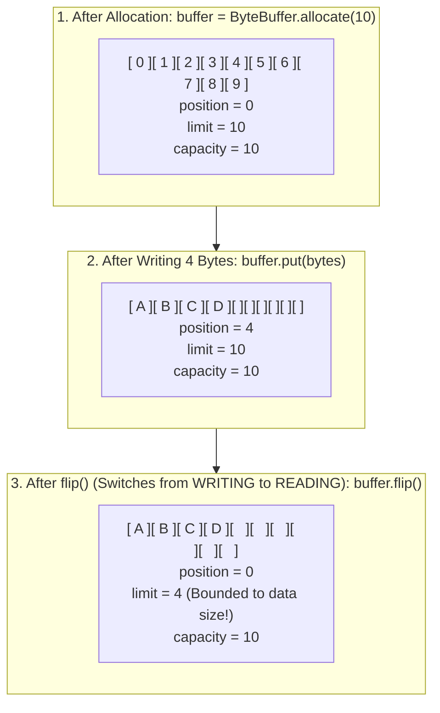

# Java I/O & Modern NIO: Buffers, Channels, Zero-Copy & Selectors

In enterprise backend engineering, moving data across physical disks and network sockets is the core responsibility of an application server. 

Yet, treating I/O as simple file streams or relying blindly on framework abstractions leads to catastrophic production failures:
- **The C10K Thread Collapse**: Using classic blocking I/O (`java.io.InputStream`), spawning one platform thread per TCP socket, consuming gigabytes of thread stack memory and freezing the CPU in context-switching thrash.
- **OutOfMemoryError (OOM) via Bulk File Reads**: Calling `Files.readAllBytes()` on uploaded files or database exports, blowing past JVM heap limits.
- **Container OOMKills via Direct Memory Leaks**: Allocating off-heap `ByteBuffer.allocateDirect()` without understanding garbage collection mechanics, causing the Linux kernel to kill the container (`Exit Code 137`).
- **High CPU in File Serving**: Copying static assets or large media files through JVM user-space heap buffers rather than utilizing kernel **Zero-Copy** system calls.

This masterclass deconstructs Java I/O and modern NIO from Linux kernel page caches and Direct Memory Access (DMA) silicon up to high-concurrency event-driven network reactors.

---

## Phase 1: Ground Floor (Physical First Principles)

To understand why classic I/O is slow and how modern NIO achieves massive throughput, we must look at how the operating system and CPU physically transfer bytes.

```mermaid
flowchart TD
    subgraph Traditional_IO["1. The Traditional 4-Copy Bottleneck (java.io)"]
        direction TB
        Disk1["Disk Storage"] -->|1. DMA Copy| PageCache1["OS Kernel Page Cache"]
        PageCache1 -->|2. CPU Copy (Syscall read)| UserHeap1["JVM User-Space Heap Buffer"]
        UserHeap1 -->|3. CPU Copy (Syscall write)| SocketBuf1["OS Kernel Socket Buffer"]
        SocketBuf1 -->|4. DMA Copy| NIC1["Network Interface Card (NIC)"]
        Note1["Total: 4 Context Switches + 4 Memory Copies! Heavy CPU load!"]
    end

    subgraph Zero_Copy["2. Linux Kernel Zero-Copy (java.nio FileChannel.transferTo)"]
        direction TB
        Disk2["Disk Storage"] -->|1. DMA Copy| PageCache2["OS Kernel Page Cache"]
        PageCache2 -->|2. Zero-Copy DMA Gather / sendfile| NIC2["Network Interface Card (NIC)"]
        Note2["Total: 2 Context Switches + 0 CPU Copies! Data NEVER enters JVM Heap!"]
    end
```

### 1.1 The Traditional 4-Copy Bottleneck
When an application reads a file from disk and writes it out over an HTTP socket using classic `java.io`:
1. **DMA Copy 1 (Disk $\rightarrow$ OS Page Cache)**: The disk controller reads hardware sectors and copies bytes into the OS kernel's page cache via Direct Memory Access (DMA).
2. **CPU Copy 2 (Page Cache $\rightarrow$ JVM Heap)**: The JVM executes the `read()` system call, causing a **context switch** from user mode to kernel mode. The CPU physically copies the data from kernel memory into the application's JVM heap buffer (`byte[]`).
3. **CPU Copy 3 (JVM Heap $\rightarrow$ Socket Buffer)**: The JVM executes the `write()` system call, triggering another context switch. The CPU copies bytes from the JVM heap back into the kernel's network socket buffer.
4. **DMA Copy 4 (Socket Buffer $\rightarrow$ NIC)**: The network interface card (NIC) copies data from the socket buffer into its hardware queue via DMA.

**The Physical Cost**:
- **4 context switches** between user space and kernel space.
- **4 memory copies** (two of which tie up CPU cycles and pollute L1/L2 caches).
- Gigabytes of short-lived `byte[]` arrays allocated on the JVM heap, triggering GC pauses.

---

### 1.2 Linux Zero-Copy: `FileChannel.transferTo()`
The Linux kernel provides the `sendfile()` system call, exposed in Java NIO via **`FileChannel.transferTo()`**:
1. The JVM invokes `fileChannel.transferTo(0, size, socketChannel)`.
2. The operating system uses DMA to read disk blocks into the kernel page cache.
3. The kernel transfers descriptors directly from the page cache to the network card via DMA Gather.
4. **The data NEVER passes through JVM user space!**

Zero CPU memory copies, zero JVM heap allocations, and near wire-speed throughput.

---

## Phase 2: The Naive Code (The Production Crashes)

### Crash Scenario 1: The Blocking Thread-Per-Connection C10K Wall

A developer builds a TCP server using classic blocking I/O:

```java
// DANGEROUS ANTI-PATTERN: One thread per blocking connection
public class BlockingTcpServer {
    public void start(int port) throws IOException {
        ServerSocket serverSocket = new ServerSocket(port);
        while (true) {
            Socket socket = serverSocket.accept(); // Blocks until connection arrives
            // FATAL: Spawns an entire 1MB OS thread per connected client!
            new Thread(() -> handleConnection(socket)).start();
        }
    }

    private void handleConnection(Socket socket) {
        try (InputStream in = socket.getInputStream()) {
            byte[] buffer = new byte[4096];
            int read;
            // Blocks waiting for client to send data! Thread sits idle in RAM!
            while ((read = in.read(buffer)) != -1) {
                process(buffer, read);
            }
        } catch (IOException e) { /* ... */ }
    }
}
```

#### What Crashes in Production:
At 5,000 concurrent clients:
- 5,000 OS platform threads consume **$\approx 5\text{ GB}$ of stack memory** ($1\text{ MB}$ per thread).
- Most clients are idle (waiting for user input or keep-alive intervals).
- The Linux OS scheduler spends 80% of total CPU cycles context switching between 5,000 threads.
- The server crashes with `java.lang.OutOfMemoryError: unable to create native thread`.

---

### Crash Scenario 2: Heap Exhaustion via `Files.readAllBytes()`

```java
// DANGEROUS ANTI-PATTERN: Loading entire file into heap
@PostMapping("/upload/invoice")
public ResponseEntity<Void> processInvoice(@RequestParam("file") MultipartFile file) throws IOException {
    // FATAL: Allocates a contiguous 500MB byte[] in Young Generation!
    byte[] fileBytes = file.getBytes(); 
    parseInvoice(fileBytes);
    return ResponseEntity.ok().build();
}
```

If 10 users concurrently upload 200MB files, the application attempts to allocate **$2\text{ GB}$ of contiguous memory** simultaneously. The JVM triggers a stop-the-world Full GC, fails to reclaim space, and dies with `OutOfMemoryError: Java heap space`.

---

## Phase 3: Under the Hood (Buffers, Channels & Selectors)

### 3.1 `ByteBuffer` Anatomy & The Internal State Machine

In Java NIO, data is always read into or written from a **`ByteBuffer`**.

A `ByteBuffer` is governed by four internal pointers:
$$\mathbf{0} \le \text{mark} \le \text{position} \le \text{limit} \le \text{capacity}$$



#### The Essential `ByteBuffer` Operations:
1. **`allocate(int capacity)`**: Allocates a heap-backed array (`byte[]`).
2. **`allocateDirect(int capacity)`**: Allocates native off-heap memory using `malloc()`. Bypasses JVM garbage collection; used for high-throughput network I/O.
3. **`flip()`**: Prepares the buffer for **reading** after writing:
   ```java
   limit = position;
   position = 0;
   mark = -1;
   ```
4. **`clear()`**: Prepares the buffer for **writing** again (does not erase data, just resets pointers):
   ```java
   position = 0;
   limit = capacity;
   mark = -1;
   ```
5. **`compact()`**: Copies unread bytes to the beginning of the buffer, allowing new writes without losing unread data.

---

### 3.2 Non-Blocking Multiplexed Socket I/O with `Selector`

Instead of one thread per connection, Java NIO uses a **`Selector`** (backed by the Linux kernel's **`epoll`** system call).

A single background thread can monitor **100,000 concurrent sockets** for readiness:

```mermaid
flowchart TD
    subgraph Selector_Reactor["Java NIO Multiplexed Event Loop (epoll)"]
        direction TB
        Worker["Single Reactor Thread"]
        Sel["Selector (Linux epoll)"]
        
        C1["SocketChannel 1 (Client A - IDLE)"]
        C2["SocketChannel 2 (Client B - SENDS DATA!)"]
        C3["SocketChannel 3 (Client C - IDLE)"]
        
        Worker -->|1. selector.select() blocks in kernel epoll_wait| Sel
        Sel -.-> C1
        Sel -->|2. OP_READ Event Ready!| C2
        Sel -.-> C3
        
        Sel -->|3. Returns Ready Keys| Worker
        Worker -->|4. Reads data from SocketChannel 2 ONLY!| Process["Process Request"]
    end
```

#### Production-Grade Non-Blocking NIO Reactor Server:
```java
package com.example.nio;

import java.io.IOException;
import java.net.InetSocketAddress;
import java.nio.ByteBuffer;
import java.nio.channels.*;
import java.util.Iterator;
import java.util.Set;

public class NioNonBlockingServer {

    public void start(int port) throws IOException {
        // 1. Open ServerSocketChannel and Selector
        ServerSocketChannel serverChannel = ServerSocketChannel.open();
        serverChannel.bind(new InetSocketAddress(port));
        serverChannel.configureBlocking(false); // CRITICAL: Non-blocking mode!

        Selector selector = Selector.open();
        // Register server channel to listen for incoming connections (OP_ACCEPT)
        serverChannel.register(selector, SelectionKey.OP_ACCEPT);

        System.out.println("NIO Server started on port " + port);

        // 2. The Event Loop (Reactor Pattern)
        while (true) {
            // Blocks in kernel epoll_wait until at least ONE socket has events ready!
            selector.select();

            Set<SelectionKey> selectedKeys = selector.selectedKeys();
            Iterator<SelectionKey> iterator = selectedKeys.iterator();

            while (iterator.hasNext()) {
                SelectionKey key = iterator.next();
                iterator.remove(); // Must remove to prevent duplicate processing!

                if (!key.isValid()) continue;

                if (key.isAcceptable()) {
                    // New client connection ready
                    handleAccept(serverChannel, selector);
                } else if (key.isReadable()) {
                    // Data arrived from client
                    handleRead(key);
                }
            }
        }
    }

    private void handleAccept(ServerSocketChannel serverChannel, Selector selector) throws IOException {
        SocketChannel clientChannel = serverChannel.accept();
        if (clientChannel != null) {
            clientChannel.configureBlocking(false);
            // Register client channel to listen for incoming data (OP_READ)
            clientChannel.register(selector, SelectionKey.OP_READ);
        }
    }

    private void handleRead(SelectionKey key) throws IOException {
        SocketChannel clientChannel = (SocketChannel) key.channel();
        ByteBuffer buffer = ByteBuffer.allocate(1024);

        int bytesRead = clientChannel.read(buffer);
        if (bytesRead == -1) {
            // Client closed connection cleanly
            clientChannel.close();
            return;
        }

        buffer.flip(); // Switch buffer from WRITE to READ mode!
        byte[] data = new byte[buffer.remaining()];
        buffer.get(data);

        // Echo response back to client
        ByteBuffer response = ByteBuffer.wrap("HTTP/1.1 200 OK\r\nContent-Length: 2\r\n\r\nOK".getBytes());
        clientChannel.write(response);
    }
}
```

*This is the exact architectural foundation used by Netty, Apache Tomcat NIO, and Eclipse Jetty.*

---

### 3.3 Zero-Copy File Transfers in Action

Here is how high-performance static file servers or log shipping agents stream files without CPU copy overhead:

```java
package com.example.nio;

import java.io.RandomAccessFile;
import java.io.IOException;
import java.nio.channels.FileChannel;
import java.nio.channels.SocketChannel;

public class ZeroCopyFileSender {

    public static void transferFile(String filePath, SocketChannel socketChannel) throws IOException {
        try (RandomAccessFile file = new RandomAccessFile(filePath, "r");
             FileChannel fileChannel = file.getChannel()) {

            long totalBytes = fileChannel.size();
            long transferred = 0;

            // Linux sendfile() under the hood! Zero JVM user-space copying!
            while (transferred < totalBytes) {
                transferred += fileChannel.transferTo(transferred, totalBytes - transferred, socketChannel);
            }
        }
    }
}
```

---

## Phase 4: Senior Interview Ace (Junior vs Staff Phrasing)

### Interview Question: "Explain how Java NIO differs from classic Java I/O, and how the Linux kernel enables Zero-Copy in Java."

#### ❌ The Shallow Junior Answer:
> "Java I/O is stream-oriented and blocks your threads. Java NIO is buffer-oriented and doesn't block. Zero-Copy means Java doesn't make copies of data in memory, so it's much faster."

#### Staff / Principal Engineer Answer:
> "Classic `java.io` is stream-based, unidirectional, and strictly blocking. Reading from an `InputStream` forces the calling thread to block until OS socket or disk buffers receive data. Scaling classic I/O requires a thread-per-connection model, which hits the C10K barrier due to platform thread stack memory consumption (1MB/thread) and OS context-switching overhead.
>
> Modern `java.nio` is block- and buffer-oriented. It introduces bidirectional **`Channels`**, explicit **`ByteBuffers`**, and multiplexed **`Selectors`**. A single worker thread registers thousands of non-blocking `SocketChannels` with a `Selector`, which maps to the Linux kernel's $O(1)$ **`epoll`** subsystem. The thread sleeps in `epoll_wait` and wakes up only when one or more sockets are ready for reads or writes, allowing a handful of threads to handle 100,000 concurrent sockets without stack bloat.
>
> Regarding **Zero-Copy**: in traditional I/O, transmitting a file requires 4 context switches and 4 memory copies (Disk $\rightarrow$ Page Cache $\rightarrow$ JVM Heap $\rightarrow$ Socket Buffer $\rightarrow$ NIC). 
> 
> Java NIO's `FileChannel.transferTo()` leverages the Linux **`sendfile()`** system call. The operating system uses DMA to read disk blocks into the OS kernel page cache, and then transfers the data descriptors directly to the network interface card via DMA Gather. The data completely bypasses JVM user-space memory, eliminating CPU memory copies and garbage collection pressure entirely."

---

## Production Debugging Checklist

1. <Check>Always remember to call `buffer.flip()` before reading data from a `ByteBuffer` that you just populated.</Check>
2. <Check>Never read large files into heap memory using `Files.readAllBytes()`. Stream large files using `Files.lines()`, `InputStream`, or memory-mapped buffers (`MappedByteBuffer`).</Check>
3. <Check>When using `Selector.selectedKeys()`, always call `iterator.remove()` on the processed key to prevent infinite loop re-processing.</Check>
4. <Check>Use `FileChannel.transferTo()` / `transferFrom()` for file-to-socket transfers to achieve kernel-level Zero-Copy performance.</Check>
5. <Check>Be cautious with `ByteBuffer.allocateDirect()`; native memory is not bounded by standard `-Xmx` heap limits. Monitor with `-XX:MaxDirectMemorySize` to avoid Linux container OOM kills.</Check>

---

## Done Checklist
- [ ] Understand the 4-copy bottleneck of traditional `java.io` vs Linux Zero-Copy.
- [ ] Explain why the thread-per-connection model collapses at scale (the C10K wall).
- [ ] Master the internal state pointers of `ByteBuffer` (`capacity`, `position`, `limit`, `mark`).
- [ ] Understand buffer transitions (`flip()`, `clear()`, `compact()`).
- [ ] Deconstruct the multiplexed non-blocking `Selector` and `epoll` reactor event loop.
- [ ] Implement a kernel Zero-Copy file transfer using `FileChannel.transferTo()`.
