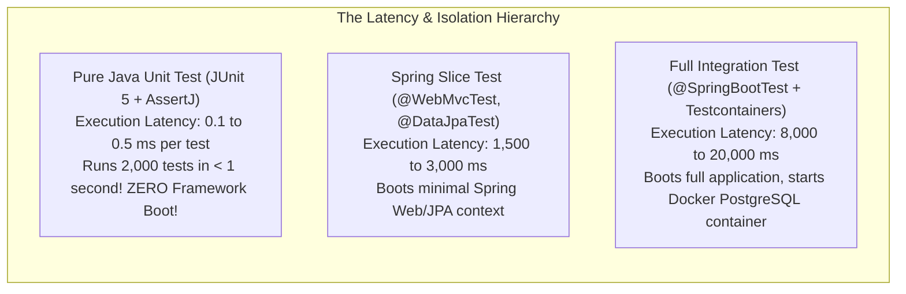
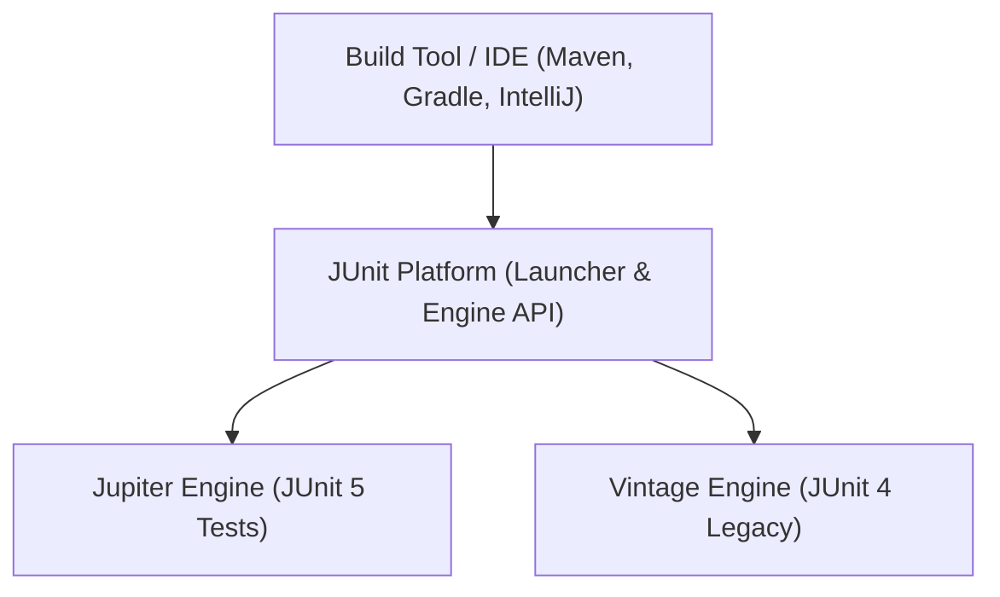

# Pure Java Unit Testing: JUnit 5 Engine, AssertJ & Mockito Internals

In modern backend engineering, developers often jump straight into heavy Spring integration testing (`@SpringBootTest`, `@WebMvcTest`).

However, neglecting pure Java unit testing leads to severe engineering friction:
- **Painfully Slow CI/CD Pipelines**: A test suite that takes 25 minutes to run because every simple validation test starts a full Spring application context, starts a database connection pool, and scans thousands of beans.
- **Flaky, Non-Deterministic Builds**: Tests that pass in isolation but fail when run in parallel due to shared mutable static state.
- **The "Over-Mocking" Nightmare**: Brittle tests that mock every single collaborator—including simple collections and domain entities—testing Mockito framework interactions rather than real business invariants.
- **Untested Edge Cases**: Failing to verify numeric boundaries, null handling, and domain exceptions due to tedious, repetitive test setup.

A senior backend engineer knows that **80% of domain business logic should be tested in pure, lightning-fast Java unit tests** running in $<1\text{ millisecond}$ each without starting any framework container.

This masterclass deconstructs JUnit 5, AssertJ, and Mockito from test execution physics up to production testing architecture.

---

## Phase 1: Ground Floor (Physical First Principles)

To design an effective testing strategy, we must understand the physical execution latency of different test tiers.



### 1.1 Test Execution Physics
- **Pure Java Unit Test**: Allocates a few objects in the JVM Young Generation, executes instructions directly on the CPU, and asserts outcomes in memory. No network sockets, no disk I/O, no framework reflection scans.
- **Spring Integration Test**: Must reflectively scan classpaths, instantiate hundreds of singleton beans, configure proxy wrappers, initialize HikariCP connection pools, run Flyway database migrations, and bind TCP server ports.

If your core business logic (calculating order discounts, validating transaction rules, parsing complex payloads) is tested only via Spring integration tests, your feedback loop is destroyed. 

Pure unit tests provide instant sub-second feedback during local development.

---

## Phase 2: The Naive Code (The Production Crashes)

### Crash Scenario 1: The Brittle "Over-Mocking" Anti-Pattern

A developer tests an order validation service by mocking everything:

```java
// DANGEROUS ANTI-PATTERN: Mocking value objects and data structures
@ExtendWith(MockitoExtension.class)
class OrderValidatorTest {

    @Mock
    private Order mockOrder; // MOCKING A DOMAIN ENTITY!
    @Mock
    private Customer mockCustomer; // MOCKING A VALUE OBJECT!

    @InjectMocks
    private OrderValidator validator;

    @Test
    void shouldValidateOrder() {
        // Tedious, brittle mocking that mirrors implementation line-by-line!
        when(mockOrder.getCustomer()).thenReturn(mockCustomer);
        when(mockCustomer.isVerified()).thenReturn(true);
        when(mockOrder.getTotalAmount()).thenReturn(BigDecimal.valueOf(100));

        boolean isValid = validator.isValid(mockOrder);

        assertTrue(isValid);
        verify(mockOrder).getCustomer();
        verify(mockCustomer).isVerified(); // Testing mock interactions, NOT behavior!
    }
}
```

#### Why This Fails in Production:
1. **Refactoring Nightmare**: If the developer refactors `Order` to check customer status via a domain method `order.canBeProcessed()`, this test immediately explodes with `UnnecessaryStubbingException` or missing mock expectations, even though the business behavior is completely unchanged!
2. **False Confidence**: Mocks return whatever you tell them to return. If the real `Customer` class throws an `IllegalStateException` under certain conditions, the mock silently masks the bug.
3. **The Rule**: **Never mock value objects, records, domain entities, or collections.** Only mock external, non-deterministic boundaries (e.g. payment gateway HTTP clients, database repositories, email dispatchers).

---

### Crash Scenario 2: Shared Mutable State & Test Pollution

```java
// DANGEROUS ANTI-PATTERN: Shared static state across tests
class SessionRegistryTest {
    // Shared mutable static collection!
    private static final Set<String> ACTIVE_SESSIONS = new HashSet<>();

    @Test
    void testLogin() {
        ACTIVE_SESSIONS.add("session-1");
        assertEquals(1, ACTIVE_SESSIONS.size());
    }

    @Test
    void testLogout() {
        // Fails intermittently depending on test execution order!
        assertEquals(0, ACTIVE_SESSIONS.size()); 
    }
}
```

When tests run in parallel (`junit.jupiter.execution.parallel.enabled = true`), shared static variables cause intermittent, non-reproducible test failures. Every test must be completely isolated and self-contained.

---

## Phase 3: Under the Hood (JUnit 5, AssertJ & Mockito)

### 3.1 JUnit 5 Architecture: Platform vs Jupiter

JUnit 5 separates the testing framework into three distinct subsystems:
1. **JUnit Platform**: The underlying foundation that launches testing frameworks on the JVM. Provides integration with Maven, Gradle, and IDEs.
2. **JUnit Jupiter**: The modern programming model and extension engine (`@Test`, `@ParameterizedTest`, `@ExtendWith`).
3. **JUnit Vintage**: The legacy engine providing backward compatibility for running JUnit 3 and JUnit 4 tests.



#### Lifecycle Annotations:
- `@BeforeEach` / `@AfterEach`: Runs before/after **every single test method**. Used to instantiate fresh collaborators.
- `@BeforeAll` / `@AfterAll`: Runs once before/after **all tests in the class** (must be `static` unless `@TestInstance(Lifecycle.PER_CLASS)` is used).

---

### 3.2 High-Throughput Parameterized Testing

Instead of writing 10 repetitive test methods to verify different boundary conditions, use `@ParameterizedTest`:

```java
import org.junit.jupiter.params.ParameterizedTest;
import org.junit.jupiter.params.provider.CsvSource;
import org.junit.jupiter.params.provider.ValueSource;

import static org.assertj.core.api.Assertions.assertThat;
import static org.assertj.core.api.Assertions.assertThatThrownBy;

class FeeCalculatorTest {

    private final FeeCalculator calculator = new FeeCalculator();

    // 1. Single-argument parameterized test
    @ParameterizedTest
    @ValueSource(longs = {0, -1, -500})
    void shouldRejectInvalidTransactionAmounts(long invalidAmount) {
        assertThatThrownBy(() -> calculator.calculateFee(invalidAmount))
            .isInstanceOf(IllegalArgumentException.class)
            .hasMessageContaining("Amount must be strictly positive");
    }

    // 2. Multi-argument parameterized test with CSV table!
    @ParameterizedTest(name = "Amount {0} cents should incur fee of {1} cents")
    @CsvSource({
        "100,    5",    // $1.00 -> $0.05 fee
        "1000,   50",   // $10.00 -> $0.50 fee
        "5000,   200",  // $50.00 -> $2.00 fee (capped)
        "100000, 200"   // $1000.00 -> $2.00 fee (max cap reached)
    })
    void shouldCalculateCorrectFeeTiers(long amountCents, long expectedFeeCents) {
        long fee = calculator.calculateFee(amountCents);
        assertThat(fee).isEqualTo(expectedFeeCents);
    }
}
```

---

### 3.3 Fluent Assertions with AssertJ

Standard JUnit assertions (`assertEquals(expected, actual)`) are error-prone: developers frequently invert expected and actual arguments, leading to confusing failure messages.

**AssertJ** provides fluent, human-readable assertion chaining:

```java
import static org.assertj.core.api.Assertions.*;

class OrderDomainTest {

    @Test
    void shouldCreateValidOrderWithCalculatedTotals() {
        Order order = Order.create("ORD-101", new CustomerId("CUST-99"))
            .addItem("SKU-APPLE", 2, Money.ofCents(150, "USD"))
            .addItem("SKU-ORANGE", 1, Money.ofCents(200, "USD"));

        // 1. Fluent property assertions
        assertThat(order)
            .isNotNull()
            .extracting(Order::getId, Order::getStatus)
            .containsExactly("ORD-101", OrderStatus.PENDING);

        // 2. Collection inspection without manual loops
        assertThat(order.getItems())
            .hasSize(2)
            .extracting(OrderItem::sku, OrderItem::quantity)
            .containsExactlyInAnyOrder(
                tuple("SKU-APPLE", 2),
                tuple("SKU-ORANGE", 1)
            );

        // 3. Mathematical precision assertion
        assertThat(order.calculateTotal().amountInCents())
            .isEqualTo(500L);
    }

    @Test
    void shouldFailWhenAddingEmptySku() {
        Order order = Order.create("ORD-102", new CustomerId("CUST-99"));

        // 4. Fluent Exception Assertion
        assertThatThrownBy(() -> order.addItem("", 1, Money.ofCents(100, "USD")))
            .isInstanceOf(InvalidOrderException.class)
            .hasMessage("SKU cannot be blank")
            .hasNoCause();
    }
}
```

---

### 3.4 Mockito Internals: The 5 Test Doubles & ByteBuddy Mechanics

In test architecture, not all fakes are mocks. Martin Fowler's taxonomy defines **5 Test Doubles**:
1. **Dummy**: Passed around but never actually used (e.g. an empty object to fill a mandatory parameter).
2. **Stub**: Provides hardcoded answers to calls made during the test (e.g. `when(repo.findById("1")).thenReturn(order)`).
3. **Spy**: A wrapper around a real object that records method calls while executing real code.
4. **Mock**: Pre-programmed with expectations; verifies interactions (e.g. `verify(emailClient).send(...)`).
5. **Fake**: A working in-memory implementation (e.g. `InMemoryUserRepository` using a `ConcurrentHashMap` instead of a real database).

#### How Mockito Physically Generates Mocks:
When you call `Mockito.mock(PaymentClient.class)`:
1. Mockito uses **ByteBuddy** to dynamically generate a proxy subclass of `PaymentClient` in Metaspace at runtime.
2. Every method is intercepted by Mockito's internal `MockHandler`.
3. Invocations are recorded in an internal thread-safe collection (`InvocationContainerImpl`).
4. When you call `verify(client).charge(...)`, Mockito searches the invocation history to ensure matching arguments were passed.

#### Clean, Production-Grade Mockito Usage with `ArgumentCaptor`:
```java
@ExtendWith(MockitoExtension.class)
class OrderFulfillmentServiceTest {

    @Mock
    private PaymentGatewayClient paymentGateway; // External network boundary!
    @Mock
    private AuditEventPublisher eventPublisher;  // External messaging boundary!

    @InjectMocks
    private OrderFulfillmentService fulfillmentService;

    @Captor
    private ArgumentCaptor<PaymentChargeRequest> chargeCaptor;

    @Test
    void shouldChargePaymentAndPublishEventOnFulfillment() {
        // 1. Arrange: Real domain objects, stubbed external client
        Order order = new Order("ORD-500", Money.ofCents(2500, "USD"));
        when(paymentGateway.charge(any())).thenReturn(PaymentReceipt.successful("TX-999"));

        // 2. Act
        fulfillmentService.fulfill(order);

        // 3. Assert: Capture the exact payload sent to external client
        verify(paymentGateway).charge(chargeCaptor.capture());
        PaymentChargeRequest request = chargeCaptor.getValue();
        
        assertThat(request.orderId()).isEqualTo("ORD-500");
        assertThat(request.amountInCents()).isEqualTo(2500L);
        assertThat(request.currency()).isEqualTo("USD");

        // Verify audit event published
        verify(eventPublisher).publish(argThat(event -> event.contains("ORD-500")));
    }
}
```

---

## Phase 4: Senior Interview Ace (Junior vs Staff Phrasing)

### Interview Question: "What is the difference between a Stub, a Mock, and a Fake, and what are the architectural risks of over-mocking?"

#### ❌ The Shallow Junior Answer:
> "A mock is created by Mockito using `@Mock`. A stub is when you use `when().thenReturn()`. Over-mocking just means you have too many `@Mock` annotations in your test class."

#### Staff / Principal Engineer Answer:
> "In test architecture, test doubles serve distinct roles:
> - A **Stub** provides canned data in response to calls; it has no expectations and does not verify interactions.
> - A **Mock** is an interaction-based double; it verifies that specific methods were invoked with exact parameters.
> - A **Fake** is a fully functional in-memory implementation—such as an `InMemoryUserRepository` backed by a `ConcurrentHashMap`—that satisfies the contract without external dependencies.
>
> The architectural risk of **over-mocking** is coupling tests to implementation details rather than observable business outcomes. When developers mock internal collaborators (like value objects, collections, or domain entities), the test suite becomes an identical mirror of the class's internal code. 
> 
> As soon as an engineer performs a pure structural refactoring—such as moving logic into private methods or reorganizing domain boundaries—dozens of tests fail despite business behavior remaining 100% correct. Furthermore, excessive mocking provides a false sense of security, as mocks never exercise real invariant validation. 
> 
> Production-grade test design dictates: use real domain objects and state-based verification via AssertJ for business logic; reserve Mockito strictly for non-deterministic external boundaries like payment gateways, SMS providers, or message brokers."

---

## Production Debugging Checklist

1. <Check>Never mock domain entities, value objects, records, or collections. Instantiate real instances.</Check>
2. <Check>Use `@ParameterizedTest` with `@CsvSource` to exhaustively test numeric, string, and null edge cases without code duplication.</Check>
3. <Check>Always use AssertJ fluent assertions (`assertThat`) rather than legacy JUnit `assertEquals` to ensure clear failure diagnostics.</Check>
4. <Check>Verify asynchronous or complex method parameters using `ArgumentCaptor` rather than deep argument matchers.</Check>
5. <Check>Ensure tests maintain zero static mutable state to enable safe concurrent test execution (`junit.jupiter.execution.parallel.enabled = true`).</Check>

---

## Done Checklist
- [ ] Understand the latency difference between pure Java unit tests and Spring integration tests.
- [ ] Avoid the over-mocking anti-pattern and know when to use real objects vs mocks.
- [ ] Understand JUnit 5 Platform vs Jupiter engine architecture.
- [ ] Write expressive parameterized tests with `@ParameterizedTest` and `@CsvSource`.
- [ ] Master fluent domain and exception assertions with AssertJ.
- [ ] Understand the 5 test doubles: Dummy, Stub, Spy, Mock, and Fake.
- [ ] Understand how Mockito generates dynamic proxies via ByteBuddy and capture arguments via `ArgumentCaptor`.
