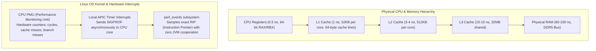
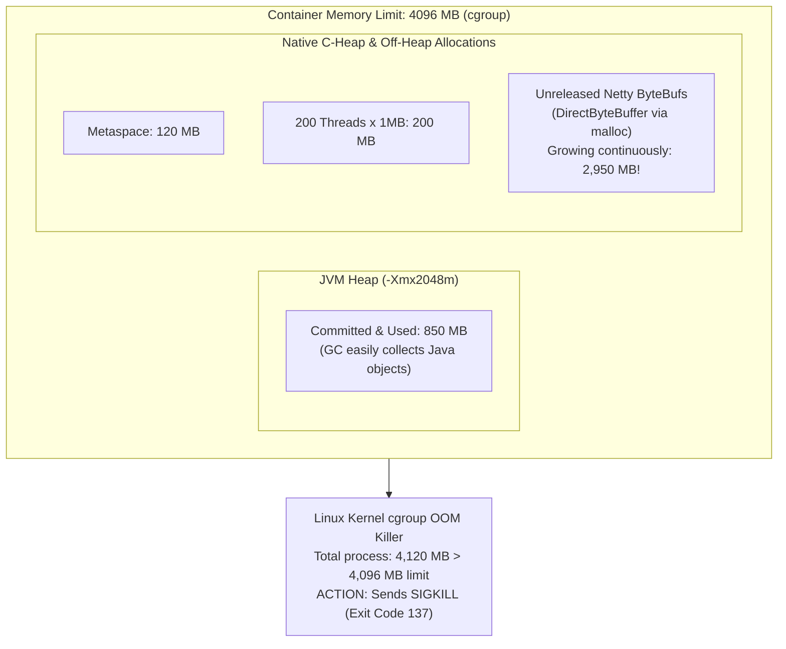
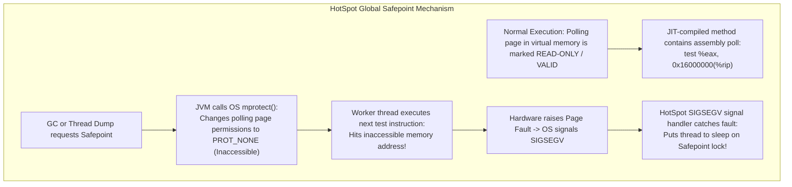
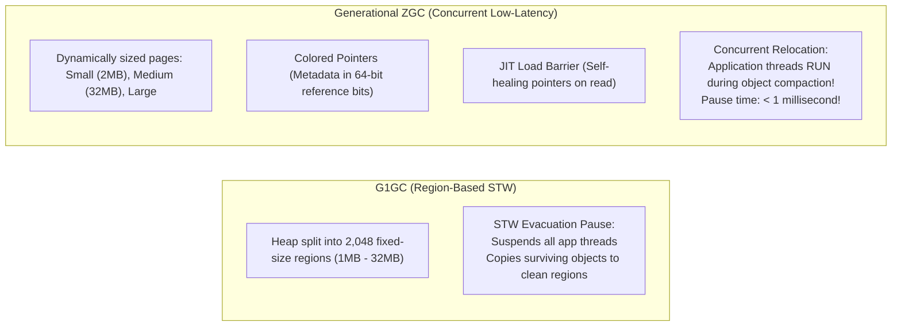

# JVM Performance Profiling & Low-Latency Tuning

In high-concurrency backend systems, application latency is rarely governed solely by algorithmic Big-O complexity. A microservice with theoretical $O(1)$ hash map lookups can still suffer catastrophic **p99 and p99.9 latency spikes exceeding 3,000 milliseconds** due to:
- Stop-The-World (STW) Garbage Collection pauses freezing all worker threads.
- **Safepoint bias** and Time-To-Safepoint (TTSP) stalls where long unrolled loops block garbage collectors from running.
- Off-heap native memory fragmentation causing the Linux kernel Out-Of-Memory (OOM) Killer to terminate the pod with **Exit Code 137** while the Java heap is only 30% full.

Senior backend engineers do not guess or randomly tweak JVM flags. They operate from physical hardware principles: CPU Performance Monitoring Units (PMU), cache line efficiency, and assembly load barriers.

---

## Phase 1: Ground Floor (Physical First Principles)

To profile and optimize Java applications running in production, you must understand how code executes on physical silicon and how the operating system interacts with the HotSpot JVM.



### 1. The Physical Cost of Latency
Every memory access that misses the CPU cache requires crossing the motherboard memory bus to physical RAM:
- **L1 Cache Reference**: $\approx 1\text{ ns}$ (approx. 4 CPU clock cycles).
- **Branch Misprediction**: $\approx 3\text{ ns}$ (CPU pipeline must be flushed and refilled).
- **L2 Cache Reference**: $\approx 3\text{ - }4\text{ ns}$.
- **L3 Cache Reference**: $\approx 10\text{ - }15\text{ ns}$.
- **Main Memory (RAM) Access**: $\approx 60\text{ - }100\text{ ns}$ (over $200\text{ CPU cycles}$ of idle stalling!).

When your Java code dereferences pointers scattered across the heap, the CPU sits completely idle, waiting for DDR5 RAM blocks to be loaded into 64-byte L1 data cache lines.

### 2. The Mechanics of Profiling: Software Sampling vs Hardware PMU
There are two fundamentally different ways to inspect what a running CPU is doing:

1. **Software In-Process Interruption (Naive Profiling)**:
   The profiler asks the JVM runtime: *"Pause all threads and tell me where everyone is."* This requires thread synchronization and JVM **Safepoints**.
2. **Hardware Performance Monitoring Unit (PMU) Sampling (`async-profiler`)**:
   Modern Intel and AMD CPUs contain hardware counters (PMU registers) that count elapsed clock cycles, instructions, and cache misses. When the counter reaches a threshold (e.g., every 10 million cycles), the CPU fires a hardware interrupt (`APIC`). 
   The Linux kernel intercepts this interrupt via `perf_events` and reads the exact Instruction Pointer (`RIP` register) off the physical core. The running Java thread does **not even know it was sampled**. It incurs zero synchronization cost.

---

## Phase 2: The Naive Code (The Production Crashes)

### Crash Scenario 1: The Safepoint Bias Blindspot & TTSP Cluster Freeze

A beginner or intermediate engineer notices high p99 latency on a report-generation service. They attach VisualVM or an older APM profiler that uses `Thread.getAllStackTraces()`.

The profiler reports that $90\%$ of CPU time is spent inside `SocketInputStream.socketRead0()` or `ReentrantLock.lock()`. The engineer concludes the database or network is slow. **This is completely wrong—the profiler is lying.**

```java
// PRODUCTION DISASTER: Tight counted loop with NO safepoint polls
public class FinancialReportCalculator {

    // Naive processing loop
    public double calculatePortfolioRisk(double[] assetWeights, double[][] covarianceMatrix) {
        double totalRisk = 0.0;
        int n = assetWeights.length;

        // Tight numerical loop: JIT compiler optimizes away safepoint checks!
        for (int i = 0; i < n; i++) {
            for (int j = 0; j < n; j++) {
                totalRisk += assetWeights[i] * assetWeights[j] * covarianceMatrix[i][j];
            }
        }
        return totalRisk;
    }
}
```

```mermaid
sequenceDiagram
    autonumber
    actor Profiler as Naive Profiler (VisualVM / JProfiler)
    participant JVM as JVM Engine
    participant FastThread as Worker 1 (Running tight loop)
    participant IOThread as Worker 2 (Waiting for DB socket read)

    Profiler->>JVM: Request Thread Dump (getAllStackTraces)
    JVM->>JVM: Arm Global Safepoint (mprotect safepoint polling page)
    JVM->>IOThread: Thread enters blocking I/O (Reaches Safepoint immediately!)
    Note over IOThread: Thread paused at Safepoint. Sits idle.
    JVM->>FastThread: Waiting for Worker 1 to check Safepoint...
    Note over FastThread: Running unrolled numerical loop! NO safepoint poll compiled in!<br/>Worker 1 continues computing for 8,200 ms!
    Note over JVM: TIME-TO-SAFEPOINT (TTSP) STALL: ALL other threads remain FROZEN!
    FastThread-->>JVM: Loop completes; thread finally hits Safepoint poll!
    Note over Profiler: Profiler samples stack: Worker 2 was at socketRead0 for 8.2s!<br/>Profiler blames DB socket! Worker 1 CPU loop was completely invisible!
```

#### What Happened in Production:
1. The JIT compiler (C2) unrolled the inner `for` loop and determined that because the index was an integer (`int`), there was no need to inject a safepoint poll on every iteration.
2. When a Garbage Collection cycle or thread dump was triggered, the JVM armed a safepoint.
3. Every worker thread in the system halted immediately—**except Worker 1**.
4. The entire JVM was frozen for **8.2 seconds** waiting for Worker 1 to hit a safepoint. This metric is called **Time-To-Safepoint (TTSP)**.
5. Kubernetes liveness probes timed out (`504 Gateway Timeout`), causing the pod to be killed and restarted in a cascading failure loop.

---

### Crash Scenario 2: The Netty / WebFlux Off-Heap DirectByteBuffer Leak

A developer builds a high-throughput reactive gateway using Spring WebFlux or raw Netty. Heap memory utilization is perfectly healthy at 2GB out of an 8GB maximum. Yet every 12 hours, Kubernetes kills the container with:
`OOMKilled: Exit Code 137`.

```java
// DANGEROUS ANTI-PATTERN: Leaking Netty Direct ByteBuf
@Component
public class ProxyPayloadHandler implements ChannelInboundHandler {

    @Override
    public void channelRead(ChannelHandlerContext ctx, Object msg) {
        if (msg instanceof ByteBuf byteBuf) {
            try {
                // Read header metadata
                int packetType = byteBuf.readInt();
                if (packetType == 99) {
                    // Forward immediately
                    ctx.fireChannelRead(byteBuf);
                    return;
                }
                // Branch with business validation failure
                throw new IllegalArgumentException("Unsupported packet type: " + packetType);
            } catch (Exception ex) {
                // FATAL BUG: Exception caught, but byteBuf is NOT released!
                // Netty ByteBufs are reference-counted off-heap allocations.
                // If not released, native C-heap memory leaks forever!
                ctx.fireExceptionCaught(ex);
            }
            // Missing: ReferenceCountUtil.release(byteBuf);
        }
    }
}
```



#### What Happened in Production:
- Unlike standard byte arrays (`byte[]`) which reside on the Java garbage-collected heap, `ByteBuf.allocateDirect()` allocates memory via standard C `malloc()` in the native process address space outside the JVM heap.
- The JVM Garbage Collector has no visibility into native memory pressure. Because no heap memory was exhausted, the JVM never triggered a full GC or invoked clean-up finalizers.
- Native RSS (Resident Set Size) surpassed the Kubernetes container limit, triggering an immediate OS kernel `SIGKILL`.

#### Production Fix: Release Reference-Counted Buffers On Every Path

```java
@Override
public void channelRead(ChannelHandlerContext ctx, Object msg) {
    if (!(msg instanceof ByteBuf byteBuf)) {
        ctx.fireChannelRead(msg);
        return;
    }

    boolean forwarded = false;
    try {
        int packetType = byteBuf.readInt();
        if (packetType == 99) {
            forwarded = true;
            ctx.fireChannelRead(byteBuf);
            return;
        }
        throw new IllegalArgumentException("Unsupported packet type: " + packetType);
    } catch (Exception ex) {
        ctx.fireExceptionCaught(ex);
    } finally {
        if (!forwarded) {
            ReferenceCountUtil.release(byteBuf);
        }
    }
}
```

Line by line:

- `if (!(msg instanceof ByteBuf byteBuf))` forwards messages this handler does not own.
- `boolean forwarded = false` records whether ownership was transferred downstream.
- `byteBuf.readInt()` consumes bytes from the reference-counted off-heap buffer.
- `forwarded = true` must happen before `ctx.fireChannelRead(byteBuf)` because the next handler now owns the buffer lifecycle.
- `return` prevents the finally block from releasing a buffer that was intentionally forwarded.
- `catch` reports the exception but does not swallow resource cleanup.
- `finally` runs on success, validation failure, and exceptions.
- `ReferenceCountUtil.release(byteBuf)` decrements the reference count so Netty can free native memory.

Proof task:

```console
Enable Netty leak detection with -Dio.netty.leakDetection.level=paranoid in a local stress test.
Send valid forwarded packets and invalid packets.
Verify invalid packets do not produce leak reports.
Watch process RSS with docker stats or ps and confirm native memory stabilizes.
```

Important caveat: `paranoid` leak detection is too expensive for normal production traffic. Use it for tests or controlled debugging, then run production with safer lower-overhead settings.

---

### Crash Scenario 3: The ThreadLocal Zombie Leak in Pooled Web Servers

```java
// DANGEROUS ANTI-PATTERN: Leaking ThreadLocal state in Tomcat worker threads
@Component
public class TenantContextFilter implements Filter {

    private static final ThreadLocal<TenantContext> CONTEXT_HOLDER = new ThreadLocal<>();

    @Override
    public void doFilter(ServletRequest request, ServletResponse response, FilterChain chain)
            throws IOException, ServletException {
        
        HttpServletRequest httpRequest = (HttpServletRequest) request;
        String tenantId = httpRequest.getHeader("X-Tenant-ID");

        // Allocates heavy metadata object attached to current thread
        CONTEXT_HOLDER.set(new TenantContext(tenantId, loadTenantConfiguration(tenantId)));

        chain.doFilter(request, response);

        // FATAL BUG: Missing finally block with CONTEXT_HOLDER.remove()!
        // If downstream controller throws an exception, this line is bypassed!
    }

    public static TenantContext getCurrentTenant() {
        return CONTEXT_HOLDER.get();
    }
}
```

#### The Production Security & Memory Disaster:
1. Tomcat and Jetty maintain persistent worker thread pools (e.g., 200 threads) that live for months without terminating.
2. When a downstream controller or database query throws an unhandled `RuntimeException`, execution jumps past the end of the filter.
3. The heavy `TenantContext` remains strongly referenced by the thread's internal `ThreadLocalMap.Entry[]` table.
4. **Disaster A (Memory Leak)**: Over time, thousands of discarded configurations accumulate, triggering an unrecoverable `java.lang.OutOfMemoryError: Java heap space`.
5. **Disaster B (Security Breach)**: When worker thread #42 is reused 5 seconds later to serve an unauthenticated user request, `CONTEXT_HOLDER.get()` returns the previous tenant's security credentials and private company data!

---

## Phase 3: Under the Hood (Mechanics, Bytecode & Kernel Interfaces)

### 1. The Global Safepoint Protocol
How does HotSpot physically force threads to halt?



In Java assembly, the JIT compiler inserts safepoint checks at method entries, exits, and loop branches:
```assembly
# Safepoint Poll in generated C2 assembly (x86_64)
test   %eax, -0x14e000(%rip)        # Reads from safepoint polling page
```
When the page is accessible, this `test` instruction executes in a single CPU cycle ($0.25\text{ ns}$). When the JVM wants a safepoint, it arms the page via `mprotect()`, turning the next read into a trap.

---

### 2. Eliminating Bias: async-profiler & Flame Graphs

`async-profiler` bypasses safepoints completely by coupling Linux `perf_events` with the JVM's private `AsyncGetCallTrace` (AGCT) interface.

```bash
# 1. Profile CPU consumption for 60 seconds (generates interactive SVG flamegraph)
./asprof -d 60 -e cpu -f /tmp/cpu_flamegraph.html <JVM_PID>

# 2. Profile memory allocations (TLAB allocations inside young gen)
./asprof -d 60 -e alloc -f /tmp/alloc_flamegraph.html <JVM_PID>

# 3. Profile lock contention (threads blocked waiting on ReentrantLock / synchronized)
./asprof -d 60 -e lock -f /tmp/lock_flamegraph.html <JVM_PID>
```

#### How to Read an Interactive Flame Graph
A Flame Graph is a visualization of sampled call stacks:

```ascii
+-------------------------------------------------------------------------+
|                    String.toLowerCase() [35% width]                     | <- Flat top: CPU Hog!
+-------------------------------------------------------------------------+
|                  OrderValidator.validateHeaders()                       |
+-------------------------------------------------------------------------+
|                  OrderController.submitOrder()                          |
+-------------------------------------------------------------------------+
|             Tomcat Worker Thread: org.apache.catalina...                |
+-------------------------------------------------------------------------+
```

1. **X-Axis (Width)**: Represents the **percentage of time** or **bytes allocated** in that function. It is sorted alphabetically across stack traces to merge identical stacks—it is **NOT** a chronological timeline.
2. **Y-Axis (Height)**: Represents the **call stack depth**. The bottom frame is the root entry point (`Thread.run()` or `main()`). The top frame is the leaf method currently executing on the physical CPU core.
3. **The Golden Rule**: **Look for wide flat plateaus at the top**. 
   - A wide method with no other frames stacked on top of it is directly burning CPU cycles (e.g., regex matching, cryptographic hashing, or primitive array parsing).
   - If a method is wide but has a tall tower of callers stacked above it, it is simply delegating work to children.

---

### 3. Garbage Collection Deep Dive: G1GC vs Generational ZGC (Java 21)



#### G1GC Internals & Failure Modes
- **Regions**: G1 divides the heap into approximately 2,048 regions dynamically assigned roles: Eden, Survivor, Old, and **Humongous** (objects larger than $50\%$ of a region size).
- **Humongous Allocation Trap**: If you allocate a 2MB `byte[]` when region size is 2MB, G1 must allocate a contiguous sequence of Humongous regions directly in the Old generation. This rapidly triggers premature Full GC pauses!
- **Tuning G1GC**:
  ```bash
  # Increase region size to 16MB to absorb large DTO / JSON allocations without humongous triggers
  -XX:G1HeapRegionSize=16m
  # Set target maximum pause time (G1 will dynamically resize young generation to meet this)
  -XX:MaxGCPauseMillis=150
  ```

#### Generational ZGC Internals (Java 21 `JEP 439`)
Generational ZGC separates young and old generations while performing all object relocation **concurrently** without Stop-The-World compaction.

##### Colored Pointers:
On a 64-bit architecture, a memory pointer only needs 42 to 44 bits to address 4TB to 16TB of RAM. ZGC steals the unused upper bits:

```ascii
+-------------------+-------------+-------------+-------------+------------------------+
| 16 Unused Bits    | 1 Finalized | 1 Remapped  | 1 Marked0   | 1 Marked1  | 44 Address|
+-------------------+-------------+-------------+-------------+------------------------+
```
- **Marked0 / Marked1**: Track whether the object was reached during the concurrent marking phase.
- **Remapped**: Indicates whether the pointer has already been updated to the object's new physical memory location.

##### The JIT Load Barrier (Self-Healing Pointers):
When an application thread executes an object dereference (`order.getCustomer()`), the JIT compiler emits a 2-instruction hardware check:

```assembly
movq   0x18(%rax), %rbx          # Read customer reference into RBX
testb  $0x1, %bl                 # Test the Remapped metadata bit
jnz    .load_barrier_fastpath    # Bit is set! Object already relocated. Proceed!
callq  .zgc_load_barrier_slow    # Bit not set! Relocate object & self-heal pointer!
.load_barrier_fastpath:
```

- **Fast Path**: Takes $0.5\text{ ns}$ (a single CPU `test` instruction).
- **Slow Path**: The thread relocates the object immediately, updates the colored pointer to the new memory address, updates the reference in-place (**self-healing**), and continues.
- **Result**: Even on a 500GB heap, Stop-The-World pauses drop from $500\text{ ms}$ to **under $1\text{ millisecond}$**!

---

### 4. Diagnosing Off-Heap Memory with Native Memory Tracking (NMT)

When a container pod crashes with `Exit Code 137`, your first diagnostic tool is HotSpot **Native Memory Tracking (NMT)**.

#### 1. Enable NMT at JVM Launch
```bash
# Add to container startup flags:
-XX:NativeMemoryTracking=detail
```

#### 2. Capture a Baseline & Run Differential Analysis
```bash
# Capture baseline after application warms up (e.g. 5 minutes after startup)
jcmd <PID> VM.native_memory baseline

# After memory grows by 500MB, compare against the baseline:
jcmd <PID> VM.native_memory detail.diff
```

#### Interpreting NMT Output:
```console
Total: reserved=3850MB +450MB, committed=2950MB +410MB

- Java Heap (reserved=2048MB, committed=2048MB)
- Class / Metaspace (reserved=256MB +10MB, committed=128MB +8MB)
- Thread Stacks (reserved=210MB +5MB, committed=210MB +5MB)
  (210 threads, stack size 1024KB)
- Code Cache (reserved=240MB, committed=65MB +2MB)
- Internal / Direct Byte Buffers (reserved=850MB +390MB, committed=850MB +390MB)  <-- LEAK LOCATED!
- Symbol (reserved=35MB, committed=35MB)
```
- **Java Heap**: Memory reserved for standard Java objects (`-Xmx`).
- **Class / Metaspace**: Loaded class metadata and bytecode. Cap via `-XX:MaxMetaspaceSize=256m`.
- **Thread Stacks**: Memory allocated for OS thread call stacks ($\text{Thread Count} \times \text{-Xss}$). 200 threads at $1\text{MB}$ each $= 200\text{MB}$.
- **Internal / Direct Byte Buffers**: Off-heap memory allocated by Netty, NIO `ByteBuffer.allocateDirect()`, or JDBC drivers.

---

## Phase 4: Senior Interview Ace (Junior vs Staff Phrasing)

| Question / Scenario | Junior Developer Answer | Senior / Staff Backend Engineer Answer |
| :--- | :--- | :--- |
| **Why does a profiler like VisualVM show high CPU in socketRead0 when our service is slow?** | "The database or remote network API is taking too long to return data, causing the socket read method to hold the CPU." | "That is a classic manifestation of **Safepoint Bias**. VisualVM uses in-process thread dumps requiring all threads to reach a Safepoint. Threads blocked on I/O or waiting on locks reach safepoints instantly, whereas threads in tight JIT-compiled loops with unrolled bounds delay reaching safepoints for seconds (TTSP stall). The profiler over-samples innocent waiting threads and misses the true CPU burner. We use `async-profiler` with Linux `perf_events` hardware counters to capture unbiased instruction pointers." |
| **How does Generational ZGC achieve sub-millisecond pause times on multi-gigabyte heaps?** | "It uses multiple background threads to collect garbage and has a very fast pause algorithm." | "ZGC executes both marking and **object relocation concurrently** with application worker threads. It avoids Stop-The-World compaction by utilizing **Colored Pointers** (encoding GC metadata like `Marked` and `Remapped` into unused bits of 64-bit reference addresses) and **JIT-compiled Load Barriers**. When a worker thread reads an unrepaired reference, the load barrier intercepts the read, relocates the object, self-heals the pointer in-place, and returns the reference in nanoseconds. Pause times are decoupled from heap size and live object volume." |
| **Our Kubernetes pod crashed with Exit Code 137, but heap memory was only 40% full. What happened?** | "The JVM had an OutOfMemoryError and crashed, or Kubernetes didn't give the container enough CPU." | "`Exit Code 137` is a Linux `SIGKILL` ($128 + 9$). Because the JVM heap was under-utilized, the container was terminated by the Linux kernel cgroup OOM Killer for exceeding total physical container memory limits. The leak lives off-heap: Netty unreleased direct byte buffers, excessive native thread stacks (`-Xss`), or unbounded Metaspace classloading. We diagnose this by enabling `-XX:NativeMemoryTracking=detail` and comparing memory differentials with `jcmd VM.native_memory detail.diff`." |
| **What is the difference between CPU profiling and Allocation profiling in Flame Graphs?** | "CPU profiling shows where time is spent, while allocation profiling shows which classes take up the most heap space." | "CPU profiling samples instruction pointers when threads are actively executing on physical cores, exposing compute bottlenecks like JSON serialization or hashing. Allocation profiling samples Thread Local Allocation Buffer (TLAB) allocations when threads allocate new objects on the heap. High allocation rates lead to heavy memory churn, increased GC CPU utilization, and rapid Eden exhaustion, even if the individual allocations themselves consume negligible execution time." |
| **Why should you never use `ThreadLocal` inside modern virtual threads or pooled web workers without a cleanup contract?** | "ThreadLocals can make the code hard to read and test because the state is global." | "In pooled thread architectures (Tomcat worker pools), threads persist across thousands of independent client requests. If `ThreadLocal.remove()` is omitted from a mandatory `finally` block, state leaks into subsequent requests. This causes both **unbounded heap memory leaks** (retaining heavy tenant contexts on long-lived thread stacks) and **critical multi-tenant security vulnerabilities** where a user inherits another customer's security credentials." |

---

## Production-Hardened Java 21 Container Flag Template

Below is the battle-tested JVM flag template for Spring Boot 3 microservices running Java 21 inside Kubernetes cgroup v2 environments:

```bash
#!/bin/bash
exec java \
  # 1. Container Memory Adaptation (Dynamic 75% Heap Boundary)
  -XX:+UseContainerSupport \
  -XX:MaxRAMPercentage=75.0 \
  -XX:InitialRAMPercentage=75.0 \
  
  # 2. Ultra-Low Latency Garbage Collection (Generational ZGC)
  -XX:+UseZGC \
  -XX:+ZGenerational \
  
  # 3. Prevent Safepoint TTSP Freezes in Counted Loops
  -XX:+UseCountedLoopSafepoints \
  -XX:LoopStripMiningIter=1000 \
  
  # 4. Off-Heap & Metaspace Bounds Protection
  -XX:MaxMetaspaceSize=256m \
  -XX:ReservedCodeCacheSize=256m \
  -XX:+NativeMemoryTracking=summary \
  
  # 5. Fail-Fast Crash Diagnostics & Automatic Core Dumps
  -XX:+ExitOnOutOfMemoryError \
  -XX:+HeapDumpOnOutOfMemoryError \
  -XX:HeapDumpPath=/var/log/app/heap_dump.hprof \
  
  # 6. Continuous Production Flight Recording (Under 1% overhead)
  -XX:StartFlightRecording=disk=true,dumponexit=true,filename=/var/log/app/crash_recording.jfr,settings=profile \
  
  # 7. Secure Random Non-Blocking Entropy
  -Djava.security.egd=file:/dev/./urandom \
  
  -jar /app/application.jar
```

---

## Production Debugging Checklist

<AccordionGroup>
  <Accordion title="1. High p99 Latency with Low Average CPU Utilization">
    - [ ] Check GC pause times via JVM metrics or GC logs: `-Xlog:gc*,gc+phases=debug:file=/var/log/app/gc.log:time,tags`.
    - [ ] Inspect Time-To-Safepoint (TTSP): `-Xlog:safepoint=debug:file=/var/log/app/safepoint.log:time,tags`. Look for `Time to reach safepoint` exceeding $100\text{ ms}$.
    - [ ] Verify `-XX:+UseCountedLoopSafepoints` is active if heavy numerical loops exist.
    - [ ] Profile thread lock contention with `./asprof -d 30 -e lock -f /tmp/lock.html <PID>`.
  </Accordion>

  <Accordion title="2. Pod OOMKilled (Exit Code 137) Diagnostics">
    - [ ] Verify Kubernetes memory limits: `kubectl describe pod <pod-name>` (Check `Last State: Terminated - OOMKilled`).
    - [ ] Verify `-XX:MaxRAMPercentage=75.0` is configured so off-heap memory has $25\%$ headroom.
    - [ ] Run `jcmd <PID> VM.native_memory detail.diff` to pinpoint Direct ByteBuffers, Metaspace, or native threads.
    - [ ] If using Netty/WebFlux, set `-Dio.netty.leakDetection.level=PARANOID` in staging to catch unreleased `ByteBuf` references.
  </Accordion>

  <Accordion title="3. CPU Utilization at 100% on Single Core">
    - [ ] Capture a 30-second CPU flame graph: `./asprof -d 30 -e cpu -f /tmp/cpu.html <PID>`.
    - [ ] Inspect the flame graph for wide flat plateaus at the top.
    - [ ] Check for regex catastrophic backtracking, unindexed linear search over large collections, or infinite retry loops.
  </Accordion>
</AccordionGroup>

---

## Done Checklist

<Check>
CPU and allocation profiling in production uses `async-profiler` or Java Flight Recorder (JFR) to eliminate safepoint bias.
</Check>
<Check>
Flame graphs are analyzed by locating wide horizontal plateaus at the top of the call stack hierarchy.
</Check>
<Check>
Java 21 services use Generational ZGC (`-XX:+UseZGC -XX:+ZGenerational`) for sub-millisecond tail latency guarantees.
</Check>
<Check>
Counted loop safepoints (`-XX:+UseCountedLoopSafepoints`) are configured to prevent catastrophic TTSP cluster stalls.
</Check>
<Check>
Off-heap native memory is monitored using Native Memory Tracking (NMT) to prevent container Exit Code 137 OOM kills.
</Check>
<Check>
ThreadLocal allocations in pooled worker threads strictly enforce `.remove()` cleanup inside `try-finally` blocks.
</Check>
