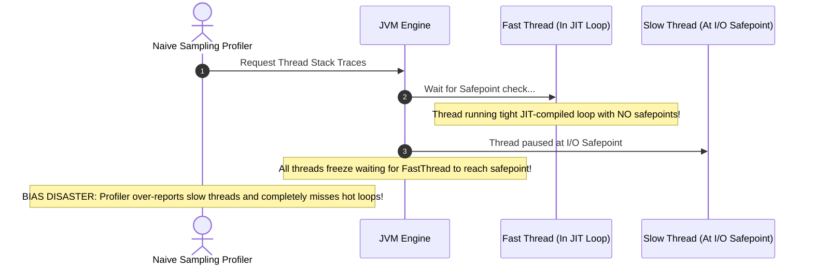
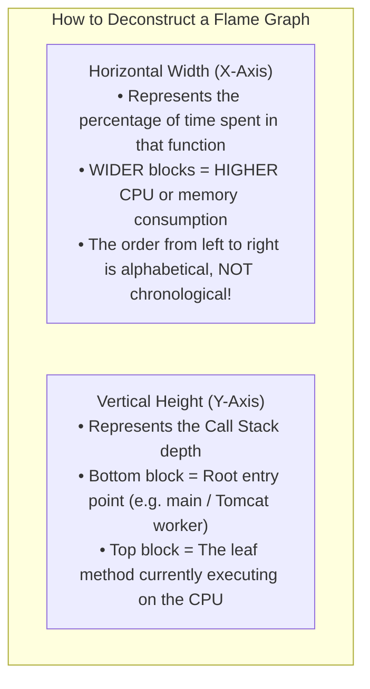
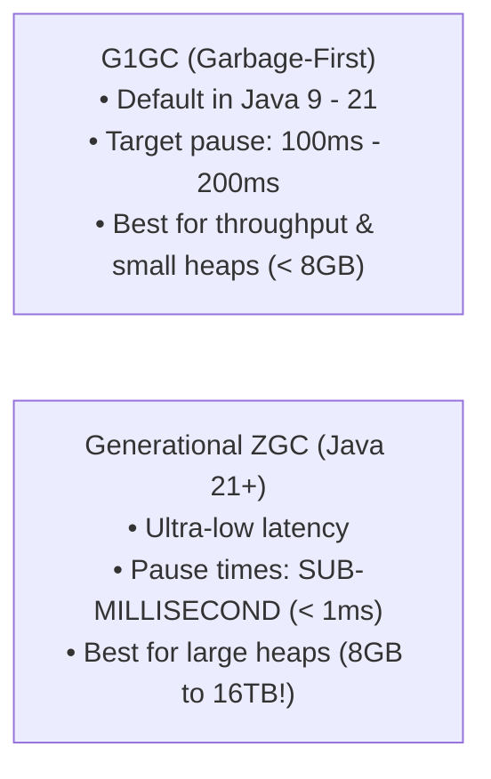
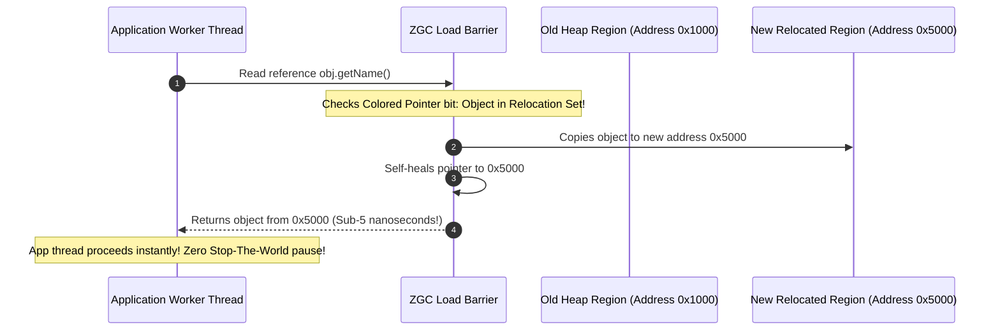

# JVM Performance Profiling & Low-Latency Tuning

In high-performance backend systems, application latency is not governed purely by algorithmic Big-O complexity. A microservice with $O(1)$ hash map lookups can still suffer catastrophic **p99 latency spikes exceeding 2,000 milliseconds** due to JVM Stop-The-World Garbage Collection (GC) pauses, safepoint synchronization stalls, or off-heap native memory fragmentation.

Senior backend engineers do not guess or randomly tweak JVM arguments. They use **low-overhead production profilers (Java Flight Recorder, async-profiler), interpret Flame Graphs, and tune modern low-latency garbage collectors (Generational ZGC)** to reduce pauses and measure application latency under realistic load. A short GC pause does not imply a short database call or HTTP request.

---

## 1. Safepoint Bias & Why Traditional Profilers Lie

Traditional Java profilers (VisualVM, older JProfiler hooks) collect thread dumps at fixed intervals using `Thread.getAllStackTraces()`. 

To capture a stack trace, the JVM must bring all threads to a **Safepoint**—a state where the thread's execution is paused and its registers and stack frames are consistent.



### The Safepoint Bias Disaster
- Methods without explicit safepoints (such as counted `for` loops unrolled by the JIT compiler) **cannot be sampled** while executing.
- The profiler only samples threads when they reach an existing safepoint (e.g. method entry/exit or I/O).
- **Result**: The profiler severely distorts reality, blaming I/O or innocent wrapper methods while the true CPU bottleneck remains completely invisible!

### The Solution: `async-profiler`
**`async-profiler`** eliminates safepoint bias completely by using the Linux kernel's `perf_events` subsystem directly. It intercepts CPU instruction pointers asynchronously via hardware performance counters, capturing true execution state without forcing JVM threads to wait for safepoints.

---

## 2. Low-Overhead Profiling: async-profiler & Flame Graphs

`async-profiler` runs in production with **under 1% CPU overhead**, generating interactive SVG Flame Graphs for CPU utilization, memory allocations, and lock contention.

### 2.1 Capturing a Production Profile via CLI

```bash
# 1. Profile CPU consumption for 60 seconds and output an interactive Flame Graph:
./asprof -d 60 -e cpu -f /tmp/cpu_flamegraph.html <JVM_PID>

# 2. Profile memory allocations (TLAB allocation profiling) to locate memory leaks:
./asprof -d 60 -e alloc -f /tmp/alloc_flamegraph.html <JVM_PID>

# 3. Profile lock contention (threads blocked waiting on ReentrantLock/synchronized):
./asprof -d 60 -e lock -f /tmp/lock_flamegraph.html <JVM_PID>
```

### 2.2 How to Read a Flame Graph



<Tip>
**The Golden Rule of Flame Graphs**: Look for **wide plateaus (flat tops)** at the top of the flame graph. A wide top indicates a single method consuming a massive percentage of CPU cycles directly (e.g. regex evaluation, JSON deserialization, or unindexed collection scanning).
</Tip>

---

## 3. Modern Garbage Collectors: G1GC vs Generational ZGC

The greatest driver of tail latency (p99 and p99.9) in Java backend services is the Garbage Collector.



### Architectural Comparison Matrix

| Dimension | G1GC (Garbage-First) | Generational ZGC (Java 21+) |
| :--- | :--- | :--- |
| **Max Pause Time Goal** | 100ms to 250ms (`-XX:MaxGCPauseMillis`) | Designed for very short GC pauses; measure under your workload |
| **Pause Time Scaling** | Scales with the number of live objects | Designed to keep pauses independent of heap size; allocation stalls are a separate concern |
| **Heap Sizing** | Choose from measured live data and allocation rate | Needs room for concurrent collection; not limited to large heaps |
| **Core Technique** | Regional marking, Stop-The-World compaction | Colored Pointers, Load Barriers, Concurrent Relocation |
| **Throughput Trade-off** | Measure throughput and pause distribution | Concurrent GC uses CPU; measure the cost on the same workload |
| **Production Activation**| Default in Java 17/21 | `-XX:+UseZGC -XX:+ZGenerational` |

---

## 4. Generational ZGC: Sub-Millisecond Pauses in Java 21

In Java 21, **Generational ZGC** (`JEP 439`) combined the ultra-low pause times of ZGC with the fundamental **Weak Generational Hypothesis**: *most objects die young*.

### How Generational ZGC Achieves Sub-Millisecond Pauses
Traditional collectors pause all application threads while moving surviving objects to new memory addresses.

ZGC executes **object relocation concurrently** while application threads are actively running, using two low-level hardware and JVM innovations:

1. **Colored Pointers**: ZGC encodes garbage collection metadata (marked, remapped) directly into the unused upper bits of 64-bit memory reference pointers.
2. **Load Barriers (Self-Healing Pointers)**: When an application thread reads an object reference that hasn't been relocated yet, the JIT-compiled load barrier intercepts the read, relocates the object immediately, updates the colored pointer to the new address, and returns the reference—all in a few CPU nanoseconds!



---

## 5. Diagnosing Off-Heap Memory Leaks with NMT

When a container pod terminates with `Exit Code 137 (OOMKilled)` but the Java heap was only 50% full, the leak lives **outside the JVM heap** (Off-Heap / Native Memory).

### 5.1 Native Memory Tracking (NMT)
Enable NMT in your container environment:

```bash
# Add to JVM startup arguments:
-XX:NativeMemoryTracking=summary
```

### 5.2 Establishing a Baseline & Finding the Leak
When the application starts, create a baseline snapshot:

```bash
jcmd <PID> VM.native_memory baseline
```

After the container memory climbs by 500MB, execute a differential comparison:

```bash
jcmd <PID> VM.native_memory summary.diff
```

#### Sample NMT Differential Output:
```console
Total: reserved=2450MB +250MB, committed=1850MB +210MB

- Java Heap: committed=1024MB (no change)
- Class / Metaspace: committed=120MB +5MB
- Thread Stacks: committed=150MB +10MB (150 threads)
- Internal / Direct Byte Buffers: committed=556MB +195MB  <-- LEAK DETECTED HERE!
```

### 5.3 The Common Off-Heap Culprits:
1. **Netty Direct Byte Buffers**: High-performance HTTP/2, gRPC, and Spring WebFlux clients allocate off-heap memory via `ByteBuf`. If an exception handler forgets to call `ReferenceCountUtil.release(byteBuf)`, native memory leaks indefinitely until Kubernetes kills the container.
2. **Metaspace Leak (Dynamic Classloading)**: Frameworks that dynamically generate bytecode (CGLIB, proxy generators, unconstrained Groovy scripts) without garbage collecting classloaders leak Metaspace. Cap this via `-XX:MaxMetaspaceSize=256m`.
3. **ThreadLocal Leaks in Pooled Threads**: Calling `ThreadLocal.set()` in a Tomcat or thread pool worker without calling `ThreadLocal.remove()` in a `finally` block retains heavy object graphs for the lifetime of the JVM!

---

## 6. Production JVM Flag Template (Java 21 Containers)

Below is the battle-tested JVM flag template for Spring Boot 3 running on Java 21 inside Kubernetes:

```bash
java \
  # 1. Container Memory Adaptation (Dynamic 75% Heap)
  -XX:+UseContainerSupport \
  -XX:MaxRAMPercentage=75.0 \
  -XX:InitialRAMPercentage=75.0 \
  
  # 2. Ultra-Low Tail Latency Collector (Generational ZGC)
  -XX:+UseZGC \
  -XX:+ZGenerational \
  
  # 3. Metaspace & Native Memory Protection
  -XX:MaxMetaspaceSize=256m \
  -XX:+NativeMemoryTracking=summary \
  
  # 4. Crash Diagnostics & Fast Fail
  -XX:+ExitOnOutOfMemoryError \
  -XX:+HeapDumpOnOutOfMemoryError \
  -XX:HeapDumpPath=/var/log/app/heap_dump.hprof \
  
  # 5. Continuous Low-Overhead Production Flight Recording
  -XX:StartFlightRecording=disk=true,dumponexit=true,filename=/var/log/app/startup.jfr,settings=profile \
  
  # 6. Faster Startup Entropy
  -Djava.security.egd=file:/dev/./urandom \
  -jar app.jar
```

---

## 7. Active Recall Interview Mastery

<AccordionGroup>
  <Accordion title="1. What is Safepoint Bias, and why does async-profiler provide more accurate CPU profiles than VisualVM?">
    Safepoint Bias occurs when traditional profilers require all JVM threads to reach a Safepoint before capturing stack traces. Methods without safepoints (e.g. unrolled loops or tight mathematical calculations) cannot be interrupted, causing the profiler to miss hot CPU methods and over-report I/O or synchronized methods. 
    
    `async-profiler` uses Linux kernel `perf_events` hardware interrupts to asynchronously sample instruction pointers regardless of whether a thread is at a safepoint, delivering unbiased, accurate CPU profiles.
  </Accordion>

  <Accordion title="2. How does Generational ZGC achieve sub-millisecond pause times on multi-gigabyte heaps?">
    Generational ZGC performs almost all garbage collection work **concurrently** while application threads are actively executing. 
    
    It avoids Stop-The-World compaction pauses using **Colored Pointers** (encoding metadata in reference address bits) and **Load Barriers** (intercepting reads to relocate objects on the fly in nanoseconds). Because pause times are determined by small root set scanning rather than the number of live heap objects, its design keeps pauses largely independent of heap size. This is not a hard deadline for every pause, allocation, or application request.
  </Accordion>

  <Accordion title="3. How do you diagnose a container Exit Code 137 when the JVM heap is only 50% utilized?">
    Exit code 137 indicates termination by `SIGKILL` under the usual shell convention. An OOM kill is one possible cause; forced termination after a shutdown timeout is another. Check the container's termination reason and events first. If memory exhaustion is confirmed, inspect total process memory as well as heap use. A half-full heap alone does not prove an off-heap leak.
    
    To diagnose:
    1. Start the container with `-XX:NativeMemoryTracking=summary`.
    2. Establish a baseline using `jcmd <PID> VM.native_memory baseline`.
    3. As memory increases, run `jcmd <PID> VM.native_memory summary.diff`.
    4. Inspect the output for growth in Metaspace, Thread stack allocations, or Direct Byte Buffers.
  </Accordion>

  <Accordion title="4. What is a Flame Graph, and how do you spot a CPU bottleneck in it?">
    A Flame Graph is a visualization of profiled software call stacks:
    - **Y-axis (Height)**: Represents call stack depth (bottom is caller, top is callee).
    - **X-axis (Width)**: Represents the total percentage of CPU cycles or allocations consumed (wider = more resources).
    
    To spot a bottleneck, look for **wide flat tops (plateaus)**. A wide top indicates a leaf method that is directly consuming significant CPU cycles without delegating work to children.
  </Accordion>

  <Accordion title="5. Why do ThreadLocals cause silent memory leaks in thread-pooled web servers like Tomcat?">
    Web servers maintain persistent thread pools where worker threads live for the entire lifecycle of the application. 
    
    If a request handler calls `ThreadLocal.set()` and fails to call `ThreadLocal.remove()` in a `finally` block, the object stored in the thread's internal `threadLocals` map remains strongly reachable for the lifetime of that worker thread. Over thousands of requests, heavy objects accumulate in worker threads, eventually triggering an OutOfMemoryError.
  </Accordion>
</AccordionGroup>

---

## 8. Done Checklist

<Check>
CPU and allocation profiling in production uses `async-profiler` or Java Flight Recorder (JFR) to avoid safepoint bias.
</Check>
<Check>
Flame graphs are analyzed by identifying wide horizontal plateaus at the top of the call stack.
</Check>
<Check>
For Java 21, evaluate Generational ZGC with `-XX:+UseZGC -XX:+ZGenerational`. Compare request latency, allocation stalls, CPU, and memory against G1 on the same workload. The [Java 21 collector guide](https://docs.oracle.com/en/java/javase/21/gctuning/available-collectors.html) provides selection guidance; it does not replace a benchmark of your service.
</Check>
<Check>
Container memory is configured with `-XX:+UseContainerSupport` and `-XX:MaxRAMPercentage=75.0`.
</Check>
<Check>
Off-heap memory consumption is tracked and monitored using Native Memory Tracking (NMT).
</Check>
<Check>
ThreadLocal allocations in pooled threads are strictly cleaned up via `try-finally` blocks.
</Check>
