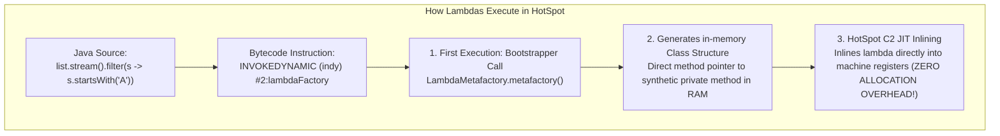
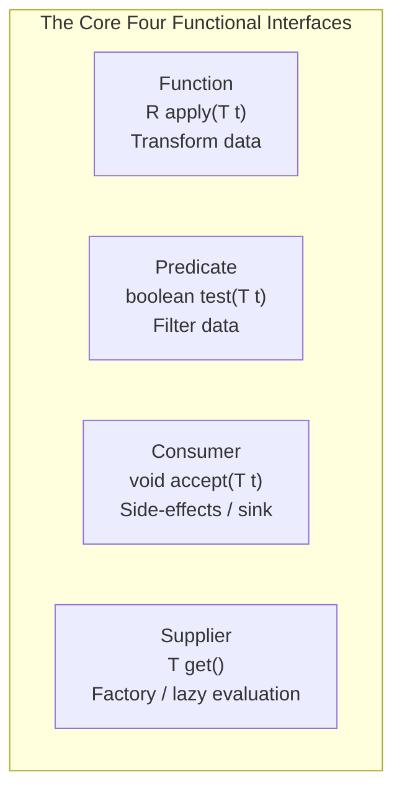

# Java Functional Programming & Streams: Bytecode, Spliterators & Collectors

In modern Java backend engineering, functional programming and Stream pipelines are ubiquitous. However, treating streams as simple syntactic sugar for loops leads to critical production failures:
- **Application-Wide Freezes via `parallelStream()`**: Executing blocking network calls inside `parallelStream()`, starving the shared global `ForkJoinPool.commonPool()` and halting all concurrent requests.
- **OutOfMemoryError via Stateful Operations**: Applying stateful operations (`.sorted()`, `.distinct()`) to large or unbounded streams, forcing HotSpot to buffer entire datasets in heap RAM.
- **Garbage Collection Thrashing**: Streaming with generic wrappers (`Stream<Long>`) instead of primitive streams (`LongStream`), allocating millions of short-lived heap wrappers inside high-frequency accounting loops.
- **Silent Duplicate Key Collisions**: Using `Collectors.toMap()` without a merge function, crashing the application when duplicate keys are encountered in production data.

This masterclass deconstructs lambdas and stream pipelines from the JVM's `invokedynamic` bytecode instruction up to custom collector implementations.

---

## Phase 1: Ground Floor (Physical First Principles)

Before writing stream pipelines, we must understand how HotSpot physically compiles and executes lambdas in memory.



### 1.1 Why Lambdas Are Not Anonymous Inner Classes
In early versions of Java, passing behavior required creating an anonymous inner class:
```java
// Legacy Java: Creates a separate physical class file!
button.addActionListener(new ActionListener() {
    @Override
    public void actionPerformed(ActionEvent e) {
        System.out.println("Clicked");
    }
});
```
This design had severe physical penalties:
1. **Disk & JAR Bloat**: Emitted a separate physical file (`EnclosingClass$1.class`) for every anonymous class.
2. **Metaspace Memory Overhead**: Every anonymous class had to be loaded and linked by the JVM classloader, consuming permanent Metaspace memory.
3. **Eager Object Allocation**: Every invocation instantiated a new heap object with an implicit reference to the enclosing class's `this` pointer (a notorious memory leak hazard).

### 1.2 The `invokedynamic` Revolution
Java 8 introduced the **`invokedynamic` (indy)** bytecode instruction. When the compiler encounters a lambda expression:
1. It does **not** create a new `.class` file. It emits a private synthetic static method containing the lambda body inside the host class.
2. It emits an `invokedynamic` call site referencing **`LambdaMetafactory.metafactory()`**.
3. On first execution, the JVM dynamically links a fast `CallSite`. For stateless lambdas, the instance is cached as a singleton.
4. Because there is no hidden outer class reference, HotSpot's C2 JIT compiler can inline the lambda directly into CPU registers with **zero object allocation**.

---

## Phase 2: The Naive Code (The Production Crashes)

### Crash Scenario 1: The `parallelStream()` Cluster Freezing Outage

A developer processes a list of outbound notifications using a parallel stream:

```java
// DANGEROUS ANTI-PATTERN: Blocking I/O inside parallelStream
public class NotificationService {
    public void dispatchNotifications(List<Notification> notifications) {
        notifications.parallelStream().forEach(notification -> {
            // FATAL: Blocking HTTP call over the network!
            smsGatewayClient.sendSms(notification); 
        });
    }
}
```

#### What Crashes in Production:
1. By default, `parallelStream()` runs on the shared JVM-wide **`ForkJoinPool.commonPool()`**.
2. The common pool defaults to:
   $$\text{Threads} = \text{Runtime.getRuntime().availableProcessors()} - 1$$
   On an 8-core Kubernetes pod, the pool has only **7 worker threads**.
3. When `smsGatewayClient.sendSms` blocks for $300\text{ ms}$ waiting for the network, all 7 threads in the common pool are pinned waiting for network I/O.
4. Across the entire application, any other feature using `parallelStream()`, `CompletableFuture.supplyAsync()` without a custom executor, or parallel array operations **locks up completely**. 

The pod stops responding to HTTP health checks, Kubernetes restarts the pod, and cascading failover crashes the remaining pods in the cluster.

---

### Crash Scenario 2: The Unbounded Stateful Stream Heap Explosion

A developer filters and sorts audit logs from a data stream:

```java
// DANGEROUS ANTI-PATTERN: Stateful operations on high-volume streams
public List<AuditLog> getTopAuditEvents(Stream<AuditLog> logStream) {
    return logStream
        .filter(AuditLog::isFailure)
        .sorted(Comparator.comparing(AuditLog::getTimestamp).reversed()) // FATAL!
        .limit(10)
        .toList();
}
```

#### Why it Crashes:
Intermediate stream operations fall into two distinct mechanical categories:
- **Stateless Operations (`filter`, `map`, `flatMap`)**: Elements are processed one-by-one as a pipeline. Zero memory buffering is required.
- **Stateful Operations (`sorted`, `distinct`)**: The pipeline **cannot emit a single downstream item** until it has seen **every single upstream element**.

When `logStream` contains $5,000,000$ items, `.sorted()` buffers all $5,000,000$ objects in an internal array in heap memory before emitting the first element to `.limit(10)`. The heap exhausts, GC pause times spike to $15\text{ seconds}$, and the JVM crashes with `java.lang.OutOfMemoryError: Java heap space`.

---

### Crash Scenario 3: `Collectors.toMap` Duplicate Key Crash

```java
// DANGEROUS ANTI-PATTERN: toMap without merge function
Map<String, User> userMap = users.stream()
    .collect(Collectors.toMap(User::getEmail, Function.identity()));
```

If the production database contains two users with the same email (e.g. duplicate guest accounts), `Collectors.toMap()` throws:
`java.lang.IllegalStateException: Duplicate key (attempted merging values User@1 and User@2)`.

---

## Phase 3: Under the Hood (Spliterators, Pipelines & Collectors)

### 3.1 Functional Interfaces & Primitive Specialization

A functional interface is any interface with exactly **one abstract method (SAM)**, marked with `@FunctionalInterface`.



#### The Autoboxing Trap in Streams:
```java
// DANGEROUS: 10,000,000 Long objects allocated on heap!
Stream.iterate(0L, i -> i + 1)
    .limit(10_000_000)
    .reduce(0L, Long::sum);

// OPTIMIZED: Zero heap allocations! Runs in CPU registers!
LongStream.range(0, 10_000_000)
    .sum();
```
Always use primitive streams (`IntStream`, `LongStream`, `DoubleStream`) for numerical calculations to eliminate autoboxing overhead.

---

### 3.2 Stream Pipeline Architecture & `Spliterator`

Every Java Stream is backed by a **`Spliterator`** (Splitable Iterator). The Spliterator controls both sequential traversal and parallel decomposition:

```java
public interface Spliterator<T> {
    boolean tryAdvance(Consumer<? super T> action); // Advance 1 element
    Spliterator<T> trySplit();                       // Partition for parallel execution
    long estimateSize();
    int characteristics();                           // Metadata flags
}
```

#### The 8 Spliterator Characteristics:
The JVM optimizes stream pipeline execution based on Spliterator metadata flags:
1. `ORDERED`: Elements have an encounter order (e.g. `List`). Operations like `limit()` preserve order.
2. `DISTINCT`: Elements are unique (e.g. `Set`). The engine skips downstream `distinct()` operations!
3. `SORTED`: Elements are pre-sorted (e.g. `TreeSet`). The engine completely optimizes away `.sorted()` calls!
4. `SIZED`: The exact size is known before traversal. Allows pre-allocating collection arrays.
5. `NONNULL`: Elements are guaranteed not to be null.
6. `IMMUTABLE`: Source cannot be structurally modified during traversal.
7. `CONCURRENT`: Safe for concurrent modification without synchronization.
8. `SUBSIZED`: All splits produced by `trySplit()` are also `SIZED`.

---

### 3.3 Deep Dive into `java.util.stream.Collectors`

In production, `collect()` is the most powerful terminal operation.

#### 1. Safe `toMap` with Conflict Resolution:
```java
Map<String, User> userMap = users.stream()
    .collect(Collectors.toMap(
        User::getEmail,
        Function.identity(),
        (existing, replacement) -> existing // Merge rule: Keep existing on collision
    ));
```

#### 2. Multi-Level `groupingBy` with Downstream Reduction:
```java
public record Order(String customerId, String status, long amountCents) {}

// Group orders by customerId, and compute TOTAL SPENT per customer!
Map<String, Long> customerSpending = orders.stream()
    .collect(Collectors.groupingBy(
        Order::customerId,
        Collectors.summingLong(Order::amountCents) // Downstream collector!
    ));

// Multi-level grouping: Customer -> Status -> List of Orders
Map<String, Map<String, List<Order>>> categorized = orders.stream()
    .collect(Collectors.groupingBy(
        Order::customerId,
        Collectors.groupingBy(Order::status) // Nested grouping!
    ));
```

---

### 3.4 Writing a Production Custom `Collector`

A `Collector<T, A, R>` consists of four functions:
1. `Supplier<A>`: Creates a new mutable accumulator container.
2. `BiConsumer<A, T>`: Folds an input element into the accumulator.
3. `BinaryOperator<A>`: Merges two accumulators (used in parallel streams).
4. `Function<A, R>`: Transforms the accumulator into the final result.

#### Implementation: High-Throughput Batch Collector
A collector that batches stream elements into fixed-size chunks of $N$ items (e.g., for bulk database inserts):

```java
package com.example.common.stream;

import java.util.*;
import java.util.function.*;
import java.util.stream.Collector;

public class BatchCollector<T> implements Collector<T, List<List<T>>, List<List<T>>> {
    private final int batchSize;

    public BatchCollector(int batchSize) {
        if (batchSize <= 0) throw new IllegalArgumentException("batchSize must be > 0");
        this.batchSize = batchSize;
    }

    @Override
    public Supplier<List<List<T>>> supplier() {
        return ArrayList::new;
    }

    @Override
    public BiConsumer<List<List<T>>, T> accumulator() {
        return (batches, item) -> {
            if (batches.isEmpty() || batches.get(batches.size() - 1).size() == batchSize) {
                List<T> newBatch = new ArrayList<>(batchSize);
                newBatch.add(item);
                batches.add(newBatch);
            } else {
                batches.get(batches.size() - 1).add(item);
            }
        };
    }

    @Override
    public BinaryOperator<List<List<T>>> combiner() {
        return (left, right) -> {
            left.addAll(right);
            return left;
        };
    }

    @Override
    public Function<List<List<T>>, List<List<T>>> finisher() {
        return Function.identity();
    }

    @Override
    public Set<Characteristics> characteristics() {
        return Set.of(Characteristics.IDENTITY_FINISH);
    }
}
```

#### Usage:
```java
List<Order> orders = orderRepository.findAllUnprocessed();

// Batch orders into chunks of 500 for batch database insertion!
List<List<Order>> batches = orders.stream()
    .collect(new BatchCollector<>(500));

for (List<Order> batch : batches) {
    orderRepository.saveAll(batch); // Executes 1 batch INSERT instead of 500 separate calls!
}
```

---

## Phase 4: Senior Interview Ace (Junior vs Staff Phrasing)

### Interview Question: "When should you use `parallelStream()` in a backend web application, and how do lambdas execute at the bytecode level?"

#### ❌ The Shallow Junior Answer:
> "You should use `parallelStream()` whenever you have a big collection and you want to make it faster by using all CPU cores. Lambdas are just anonymous classes that the compiler creates for you."

#### Staff / Principal Engineer Answer:
> "In backend web services, `parallelStream()` should almost never be used for request processing. `parallelStream()` defaults to the shared JVM-wide `ForkJoinPool.commonPool()`, which has a fixed worker thread count equal to CPU cores minus one. If any thread in that pool blocks on network I/O, database queries, or external APIs, the common pool is starved, causing unrelated concurrent web requests across the entire application to hang. If CPU-bound parallelism is truly required, it must be isolated within a custom `ForkJoinPool` or dedicated `ExecutorService`.
>
> At the bytecode level, lambdas do not compile to anonymous inner classes. If they did, every lambda would create an `Enclosing$1.class` file, consume Metaspace memory, and instantiate a heap object with an outer `this` reference. Instead, Java compiles the lambda body into a private synthetic method inside the declaring class and emits an `invokedynamic` (indy) instruction. 
> 
> On first invocation, the JVM executes `LambdaMetafactory.metafactory()`, creating a dynamic call site. For stateless lambdas, the JVM caches a single instance and HotSpot's C2 JIT compiler aggressively inlines the lambda directly into the calling method, executing in CPU registers with zero heap allocations."

---

## Production Debugging Checklist

1. <Check>Never execute blocking I/O (database, HTTP, disk) inside `parallelStream()`. Use a dedicated, bounded `ExecutorService` instead.</Check>
2. <Check>Use primitive streams (`IntStream`, `LongStream`) whenever processing numerical data to prevent millions of autoboxed wrapper allocations.</Check>
3. <Check>Always provide a merge function when using `Collectors.toMap()` to prevent `IllegalStateException` on duplicate data.</Check>
4. <Check>Never store or reuse Stream references; streams can only be traversed once. Calling terminal operations on an already-closed stream throws `IllegalStateException`.</Check>
5. <Check>Avoid stateful operations (`.sorted()`, `.distinct()`) on unbounded or large streams in memory; perform sorting and pagination in the database layer via SQL.</Check>

---

## Done Checklist
- [ ] Understand why lambdas compile to `invokedynamic` rather than anonymous inner classes.
- [ ] Know how `LambdaMetafactory.metafactory()` generates lightweight dynamic call sites.
- [ ] Understand why `parallelStream()` causes thread starvation in `ForkJoinPool.commonPool()`.
- [ ] Differentiate between stateless and stateful intermediate stream operations.
- [ ] Understand the 8 `Spliterator` characteristics (`ORDERED`, `SIZED`, `SORTED`, etc.).
- [ ] Master advanced collectors: `groupingBy` with downstream collectors and safe `toMap`.
- [ ] Build a custom `Collector<T, A, R>` for batching elements.
