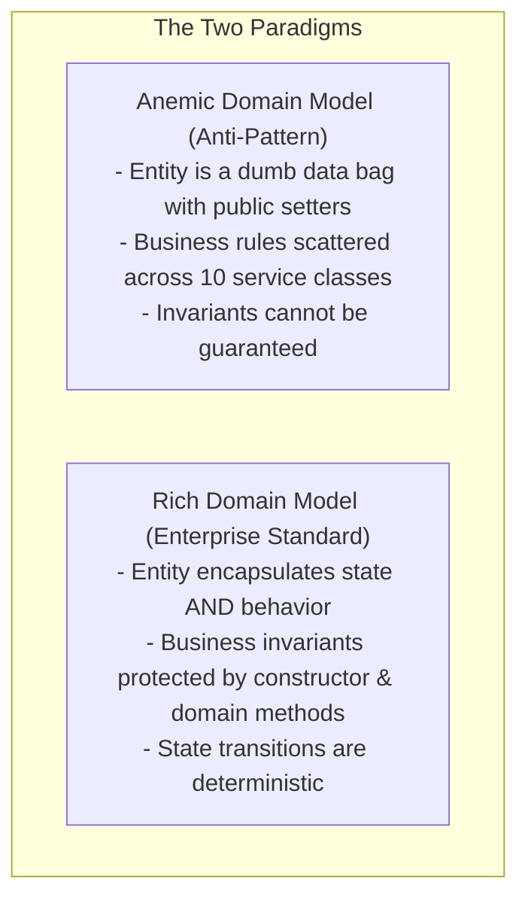
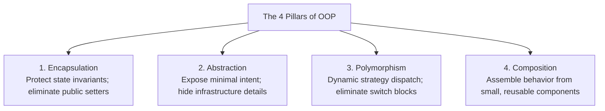
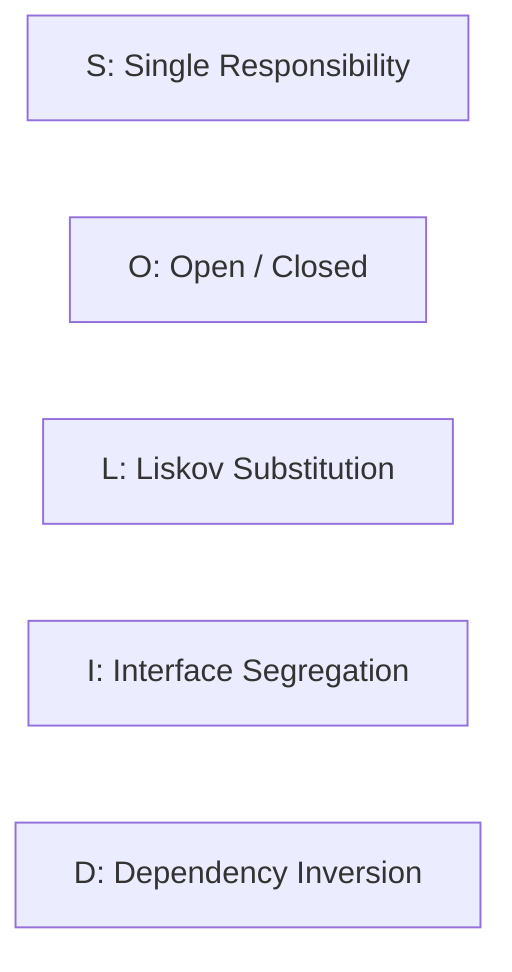

## 1. Mental Model: Beyond Syntax to Enterprise Architecture

In backend engineering, Object-Oriented Programming (OOP) is not merely about writing `class` and `extends`.

OOP is the architectural discipline of **encapsulating business invariants, decoupling volatile infrastructure from core business rules, and building systems that remain resilient to change**:
- A junior engineer uses classes as dumb data bags (getters and setters) and puts business logic in monolithic "God Services".
- A senior backend architect designs **Rich Domain Models**, uses **Composition over Inheritance**, and rigorously applies the **SOLID principles** to protect software from architectural rot.



---

## 2. The 4 Pillars of OOP in Enterprise Backends



---

### 1. Encapsulation: Defending Business Invariants

<Tabs>
  <Tab title="Anti-Pattern: Anemic Entity with Public Setters">
```java
// DANGEROUS: ANEMIC DOMAIN MODEL
public class BankAccount {
    public Long id;
    public long balanceCents;
    public String status; // Any external class can mutate this arbitrarily!

    public void setBalanceCents(long balanceCents) { this.balanceCents = balanceCents; }
    public void setStatus(String status) { this.status = status; }
}

// Any caller can violate business rules!
account.setStatus("FROZEN");
account.setBalanceCents(account.getBalanceCents() - 1000); // Debiting frozen account!
```
  </Tab>

  <Tab title="Production Standard: Rich Domain Entity">
```java
public class BankAccount {

    private final Long id;
    private long balanceCents;
    private AccountStatus status;

    public BankAccount(Long id, long initialDepositCents) {
        if (initialDepositCents < 0) {
            throw new IllegalArgumentException("Opening balance cannot be negative");
        }
        this.id = Objects.requireNonNull(id, "Account ID required");
        this.balanceCents = initialDepositCents;
        this.status = AccountStatus.ACTIVE;
    }

    // Business Invariant protected by Domain Method
    public void withdraw(long amountCents) {
        if (this.status != AccountStatus.ACTIVE) {
            throw new IllegalStateException("Cannot withdraw from non-active account: " + this.status);
        }
        if (amountCents <= 0) {
            throw new IllegalArgumentException("Withdrawal amount must be positive");
        }
        if (this.balanceCents < amountCents) {
            throw new InsufficientFundsException("Insufficient funds: current balance is " + balanceCents);
        }
        this.balanceCents -= amountCents;
    }

    public long getBalanceCents() { return balanceCents; }
    public AccountStatus getStatus() { return status; }
}
```
  </Tab>
</Tabs>

---

### 2. Composition Over Inheritance: The Fragile Base Class Trap

A common beginner mistake is building deep inheritance trees (`Entity -> AuditableEntity -> Person -> Employee -> Manager`).

```mermaid
flowchart TD
    subgraph Fragile Inheritance Tree (Anti-Pattern)
        Base["BaseService (Defines shared helper methods)"] --> Sub1["OrderService"]
        Base --> Sub2["UserService"]
        Note1["Modifying BaseService unintentionally breaks Sub1 and Sub2!"]
    end

    subgraph Composition (Production Standard)
        Order["OrderService"] -->|Injects Component| Audit["AuditLogger"]
        Order -->|Injects Component| Notifier["NotificationClient"]
        Note2["Components are loosely coupled, unit-testable, and independently reusable!"]
    end
```

#### Why Inheritance Breaks in Enterprise Systems:
1. **Tight Coupling**: Modifying a protected method in a parent class ripples down and breaks subclasses.
2. **Cannot Swap at Runtime**: A class cannot change its parent class dynamically.
3. **Breaks Encapsulation**: Subclasses often depend on the internal implementation details of parent classes.

---

## 3. The SOLID Principles in Real Backend Engineering



---

### 1. Single Responsibility Principle (SRP)
> *"A class should have one, and only one, reason to change."*

#### Anti-Pattern: The God Service
```java
// VIOLATES SRP: 4 REASONS TO CHANGE
@Service
public class OrderService {
    public void processOrder(OrderRequest request) {
        // 1. Validates order parameters (Validation logic)
        // 2. Calculates dynamic tax (Tax calculation rules)
        // 3. Executes SQL queries via JDBC (Database persistence)
        // 4. Sends SMTP confirmation emails (Notification infrastructure)
    }
}
```

#### Refactoring: Focused Collaborators
- `OrderValidator`: Validates input constraints.
- `TaxCalculator`: Applies regional VAT/Sales tax rules.
- `OrderRepository`: Handles SQL persistence.
- `OrderNotificationService`: Dispatches asynchronous confirmation events.

---

### 2. Open/Closed Principle (OCP)
> *"Software entities should be open for extension, but closed for modification."*

When adding a new payment method (e.g., Apple Pay), you should **never modify existing payment processor code**.

#### Clean Architecture: Dynamic Strategy Interface
```java
// 1. Strategy Contract (Closed for modification)
public interface PaymentGateway {
    PaymentResult charge(PaymentRequest request);
    PaymentProvider getProvider();
}

// 2. Adding Apple Pay requires writing a NEW class (Open for extension)
@Component
public class ApplePayGateway implements PaymentGateway {
    @Override
    public PaymentResult charge(PaymentRequest request) {
        // Apple Pay API integration...
    }

    @Override
    public PaymentProvider getProvider() {
        return PaymentProvider.APPLE_PAY;
    }
}
```

---

### 3. Liskov Substitution Principle (LSP)
> *"Subtypes must be substitutable for their base types without altering program correctness."*

#### The Classic Violation: Throwing `UnsupportedOperationException`
```java
public interface ReadOnlyRepository<T> {
    T findById(Long id);
}

public interface MutableRepository<T> extends ReadOnlyRepository<T> {
    T save(T entity);
}

// VIOLATES LSP: Subclass breaks base contract!
public class ImmutableAuditRepository implements MutableRepository<AuditLog> {
    @Override
    public AuditLog save(AuditLog entity) {
        throw new UnsupportedOperationException("Audit logs are immutable!");
    }
}
```
**The Fix**: Segregate the interfaces. Do not inherit methods that the subclass cannot fulfill!

---

### 4. Interface Segregation Principle (ISP)
> *"Clients should not be forced to depend on methods they do not use."*

#### Anti-Pattern: Fat Interfaces
```java
// FAT INTERFACE ANTI-PATTERN
public interface UserService {
    UserProfile getProfile(Long id);
    void updatePassword(Long id, String newPass);
    void banUser(Long id);           // Admin only!
    void generateTaxReport(Long id); // Financial team only!
}
```

#### Production Standard: Role-Based Segregated Interfaces
- `UserProfileProvider`: Exposes `getProfile()`.
- `UserAccountSecurity`: Exposes `updatePassword()`.
- `UserAdministration`: Exposes `banUser()`.

---

### 5. Dependency Inversion Principle (DIP)
> *"High-level modules should not depend on low-level modules. Both should depend on abstractions."*

```mermaid
flowchart TD
    subgraph Bad: High-Level Depends on Low-Level
        Svc1[OrderService (High-Level Business Logic)] --> MySQL[MySQLClient (Low-Level Driver)]
    end

    subgraph Good: Dependency Inversion
        Svc2[OrderService (High-Level Domain)] --> Port[OrderRepository Port (Interface)]
        Adapter[PostgreSQLOrderAdapter (Infrastructure)] -.->|Implements| Port
    end
```

---

## 4. Failure Modes & Edge Case Matrix

| Failure Mode | Root Cause | Impact | Production Defense |
| :--- | :--- | :--- | :--- |
| **Anemic Domain Model** | Entities contain only getters/setters | Invariants violated; logic duplicated across services | Encapsulate state mutations in rich domain methods. |
| **Fragile Base Class** | Overuse of inheritance hierarchies | Modifying base class breaks subclasses unpredictably | Apply **Composition Over Inheritance**. |
| **God Service Sprawl** | Single service handles validation, persistence, and external APIs | High cyclomatic complexity; unit testing impossible | Decompose into focused use-case interactors (SRP). |
| **LSP Contract Violation** | Subtype throws `UnsupportedOperationException` | Polymorphic code fails at runtime | Segregate interfaces so subtypes implement only supported methods. |
| **DIP Leaky Abstraction** | Domain layer directly imports database drivers or AWS SDKs | Vendor lock-in; testing requires cloud resources | Invert dependencies via Ports and Adapters (Hexagonal Architecture). |

---

## 5. Senior Interview Questions & Active Recall

<AccordionGroup>
  <Accordion title="1. What is the difference between an Anemic Domain Model and a Rich Domain Model?">
    An **Anemic Domain Model** treats entities as passive data structures containing public getters and setters, while all business validation, state transitions, and rules are implemented externally in service classes. This leads to code duplication and makes it impossible to guarantee invariants. A **Rich Domain Model** encapsulates both data and business behaviors directly inside the domain entity, exposing meaningful domain methods (`order.cancel()`, `account.withdraw()`) that guarantee business invariants are never violated.
  </Accordion>

  <Accordion title="2. Why should backend engineers favor Composition over Inheritance?">
    Inheritance creates tight compile-time coupling between parent and child classes (the Fragile Base Class problem), where changes to the parent class can inadvertently break subclasses. Inheritance also breaks encapsulation by exposing internal protected fields. Composition models relationships as *"has-a"* rather than *"is-a"*, allowing components to be mocked easily in unit tests, swapped dynamically at runtime, and reused across different domain contexts without rigid hierarchical constraints.
  </Accordion>

  <Accordion title="3. How does the Dependency Inversion Principle (DIP) relate to Hexagonal Architecture?">
    DIP dictates that high-level business policies must not depend on low-level infrastructure details (databases, messaging brokers, external APIs). In Hexagonal Architecture (Ports and Adapters), the core domain defines **Ports** (interfaces like `OrderRepository` or `PaymentGateway`). Infrastructure adapters (PostgreSQL JPA adapter, Stripe HTTP client) implement these interfaces from the outside. The domain remains pure Java with zero dependencies on external frameworks or databases.
  </Accordion>
</AccordionGroup>

---

## 6. Done Checklist

<Check>
- [ ] Implement Rich Domain Models that encapsulate state and protect business invariants.
- [ ] Understand the Fragile Base Class problem and apply Composition Over Inheritance.
- [ ] Apply the Single Responsibility Principle to decompose God Services.
- [ ] Use polymorphism and dynamic strategy maps to satisfy the Open/Closed Principle.
- [ ] Avoid Liskov Substitution violations by eliminating `UnsupportedOperationException`.
- [ ] Segregate fat interfaces into lean, client-specific role interfaces.
- [ ] Enforce the Dependency Inversion Principle using Ports and Adapters.
</Check>
