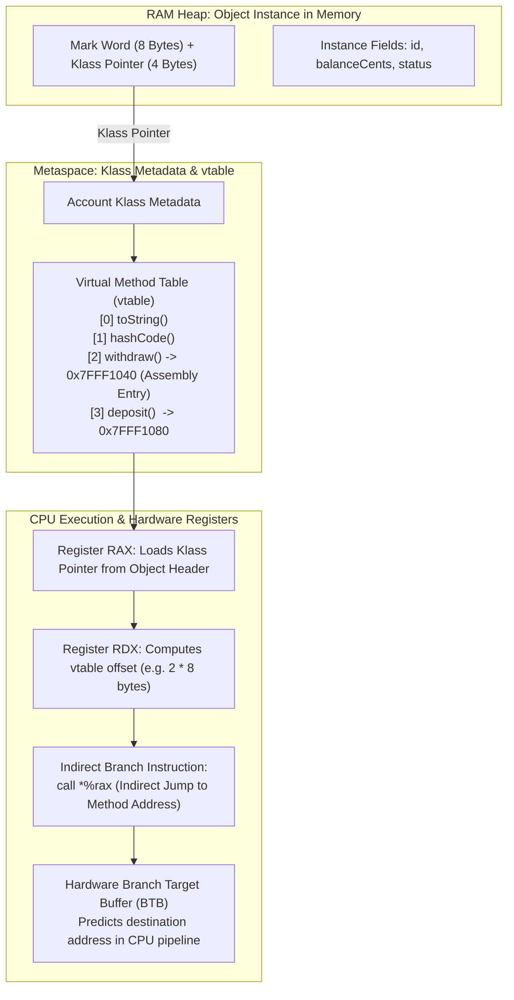
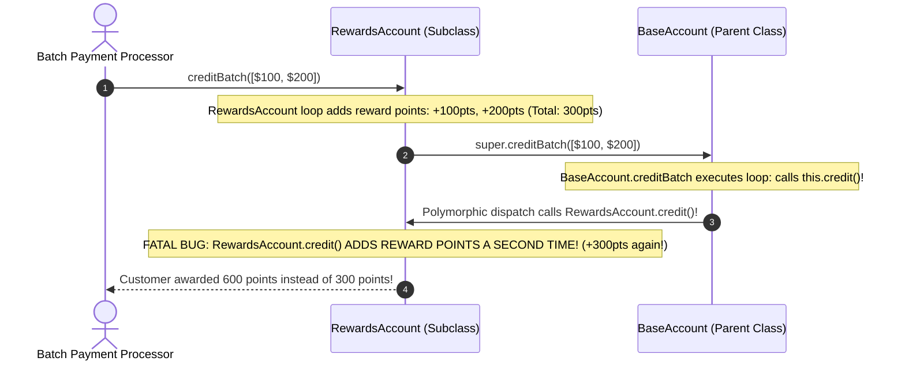
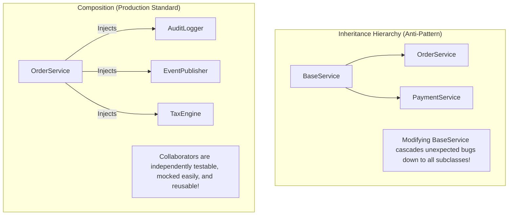
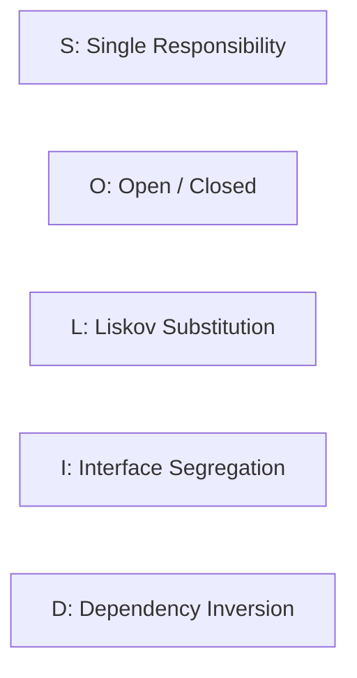
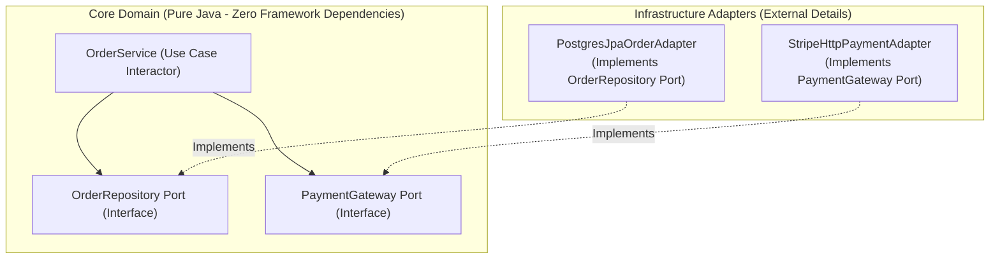
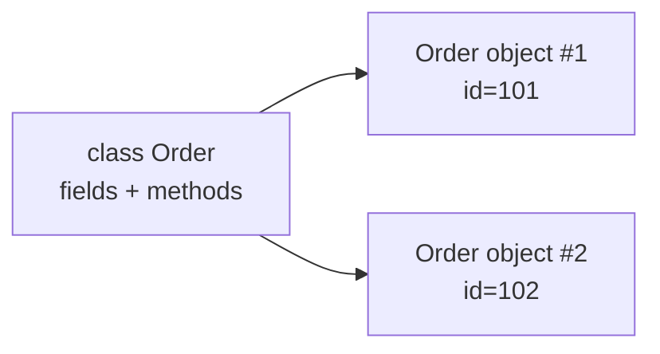

# Object-Oriented Design & SOLID Principles in Backend Systems

In backend engineering, Object-Oriented Programming (OOP) is not about reciting academic textbook definitions or creating artificial inheritance trees (`Animal -> Dog`).

OOP is the architectural discipline of **encapsulating business invariants, controlling dynamic dispatch overhead on physical CPUs, decoupling volatile infrastructure from domain logic, and designing software that does not rot under enterprise scale**:
- A junior developer treats objects as dumb data bags (anemic models with public getters and setters) and implements business logic in monolithic, 3,000-line "God Services".
- A senior backend engineer designs **Rich Domain Models**, leverages **Composition over Inheritance**, understands how the HotSpot JIT compiles **Virtual Method Tables (vtables)**, and rigorously applies **SOLID principles** via Hexagonal Ports and Adapters.

---

## Phase 1: Ground Floor (Physical First Principles)

To design high-performance polymorphic systems, you must understand how dynamic method dispatch physically executes on computer hardware and CPU registers.



### 1. The Physical Cost of Polymorphism: The `vtable`
When you write `account.withdraw(amount)`, the compiler does not know at compile time which exact method implementation will execute if `account` is an interface or base class.
1. The CPU loads the object's memory address into a register.
2. It dereferences the **Klass Word** from the 12-byte HotSpot object header to locate the class metadata in Metaspace.
3. Inside the class metadata resides the **Virtual Method Table (`vtable`)**—an array of function pointers to executable machine code.
4. The CPU resolves the offset for `withdraw()` and executes an **indirect branch call**:
   ```assembly
   movq   0x8(%rdi), %rax          # Load Klass pointer from object header into RAX
   movq   0x20(%rax), %rax         # Load function pointer from vtable slot 4
   callq  *%rax                    # Indirect call to resolved machine code!
   ```

### 2. The JIT Inlining Optimization: Monomorphic vs Megamorphic Calls
Because indirect branch calls (`call *%rax`) cannot be pre-fetched as easily by CPU instruction pipelines, the HotSpot JIT compiler monitors call sites:
- **Monomorphic Call Site (1 Receiver Class)**: If $99\%$ of calls target the exact same implementation (e.g., `StandardBankAccount`), the JIT compiler completely eliminates the `vtable` lookup! It **inlines** the method body directly into the caller, achieving zero function call overhead ($0\text{ ns}$).
- **Bimorphic Call Site (2 Receiver Classes)**: The JIT compiler emits an inline conditional check: `if (klass == TypeA) inline A; else inline B;`.
- **Megamorphic Call Site (3+ Receiver Classes)**: The JIT compiler gives up on inlining. The CPU must execute an indirect jump through the `vtable` on every single invocation, stalling the CPU pipeline whenever the Branch Target Buffer (BTB) mispredicts.

---

## Phase 2: The Naive Code (The Production Crashes)

### Crash Scenario 1: The Fragile Base Class Silent Cashback Corruption

A developer builds a banking application using deep class inheritance:

```java
// DANGEROUS ANTI-PATTERN: Deep Inheritance & Fragile Base Class
public class BaseAccount {
    protected long balanceCents;

    public void credit(long amountCents) {
        this.balanceCents += amountCents;
        logTransaction("CREDIT", amountCents);
    }

    // Added 6 months later by another developer:
    public void creditBatch(List<Long> amounts) {
        for (Long amount : amounts) {
            // Reuses existing credit method internally
            this.credit(amount);
        }
    }

    protected void logTransaction(String type, long amount) { /* audit log */ }
}

public class RewardsAccount extends BaseAccount {
    private long rewardPoints;

    @Override
    public void credit(long amountCents) {
        // Subclass adds reward points on credit
        this.rewardPoints += (amountCents / 100);
        super.credit(amountCents);
    }

    @Override
    public void creditBatch(List<Long> amounts) {
        // Subclass optimizes reward point calculation for batches
        for (Long amount : amounts) {
            this.rewardPoints += (amount / 100);
        }
        // Calls base class batch credit!
        super.creditBatch(amounts);
    }
}
```



#### What Happened in Production:
- Deep inheritance broke encapsulation. The subclass author assumed `super.creditBatch()` only manipulated balance.
- Because `BaseAccount.creditBatch()` polymorphically called `this.credit()`, the subclass's overridden `credit()` method executed twice for every transaction.
- The company silently paid out double rewards cashback for 3 weeks before financial auditing caught the loss.

---

### Crash Scenario 2: The Anemic Model & Race Condition Invariant Breach

A developer models an e-commerce inventory system using standard getters and setters (Anemic Domain Model):

```java
// DANGEROUS ANTI-PATTERN: Anemic Entity with Public Setters
@Entity
public class ProductInventory {
    @Id
    private Long id;
    private int stockAvailable;
    private int reservedStock;

    // Dumb getters and setters generated by Lombok
    public int getStockAvailable() { return stockAvailable; }
    public void setStockAvailable(int stockAvailable) { this.stockAvailable = stockAvailable; }

    public int getReservedStock() { return reservedStock; }
    public void setReservedStock(int reservedStock) { this.reservedStock = reservedStock; }
}

// In the service layer:
@Service
public class OrderService {
    @Transactional
    public void reserveProduct(Long productId, int quantity) {
        ProductInventory inv = inventoryRepo.findById(productId).orElseThrow();
        
        // Business logic scattered in service:
        if (inv.getStockAvailable() >= quantity) {
            // INVARIANT CORRUPTION HAZARD:
            inv.setStockAvailable(inv.getStockAvailable() - quantity);
            inv.setReservedStock(inv.getReservedStock() + quantity);
            inventoryRepo.save(inv);
        }
    }
}
```

#### What Happened in Production:
1. Because `ProductInventory` exposes raw setters, there is zero encapsulation of business invariants.
2. Another developer working on the Warehouse module wrote:
   `inv.setStockAvailable(inv.getStockAvailable() - damagedCount);` without updating `reservedStock`.
3. In another place, a promotion service updated stock directly without validation.
4. Total stock fell below zero (`stockAvailable = -42`), resulting in overselling 42 high-value laptops during Black Friday.

---

### Crash Scenario 3: The Liskov Substitution Runtime Crash in Batch Jobs

```java
// DANGEROUS ANTI-PATTERN: Subclass violates base class behavioral contract
public interface AccountRepository {
    Account findById(Long id);
    void save(Account account);
}

public class ReadOnlyArchiveRepository implements AccountRepository {
    @Override
    public Account findById(Long id) { return fetchFromColdStorage(id); }

    @Override
    public void save(Account account) {
        // FATAL: Violates LSP! Cannot fulfill base contract!
        throw new UnsupportedOperationException("Cold storage archive is immutable!");
    }
}
```

#### What Happened in Production:
- A nightly batch settlement job loaded a list of all configured `AccountRepository` implementations to apply year-end maintenance flags.
- When the loop reached `ReadOnlyArchiveRepository`, it threw an unhandled `UnsupportedOperationException`.
- The nightly job crashed at 03:15 AM after updating 1,200 accounts, leaving the remaining 40,000 accounts un-reconciled and triggering a SEV-1 incident.

---

## Phase 3: Under the Hood (Mechanics, SOLID Architecture & Hexagonal Ports)

### 1. Composition Over Inheritance: The Modern Architectural Standard

Instead of fragile parent-child inheritance trees, modern backend architecture favors **Composition**: assembling behavior from independent, loosely coupled collaborator components.



---

### 2. The Rich Domain Model Pattern

A **Rich Domain Model** encapsulates state and business rules inside the entity. All state transitions are guarded by explicit domain methods; public setters are strictly banned.

```java
package com.backend.domain.model;

import com.backend.domain.exception.InsufficientStockException;
import com.backend.domain.exception.InvalidQuantityException;
import java.util.Objects;

public class ProductInventory {

    private final Long id;
    private int stockAvailable;
    private int reservedStock;
    private long version;

    // Constructor enforces invariant at creation time
    public ProductInventory(Long id, int initialStock) {
        if (initialStock < 0) {
            throw new InvalidQuantityException("Initial stock cannot be negative: " + initialStock);
        }
        this.id = Objects.requireNonNull(id, "Product ID cannot be null");
        this.stockAvailable = initialStock;
        this.reservedStock = 0;
    }

    // Business Invariant Method: Protects atomic state transitions
    public void reserve(int quantity) {
        if (quantity <= 0) {
            throw new InvalidQuantityException("Reservation quantity must be positive: " + quantity);
        }
        if (this.stockAvailable < quantity) {
            throw new InsufficientStockException(this.id, quantity, this.stockAvailable);
        }
        this.stockAvailable -= quantity;
        this.reservedStock += quantity;
    }

    public void releaseReservation(int quantity) {
        if (quantity <= 0 || quantity > this.reservedStock) {
            throw new InvalidQuantityException("Cannot release invalid reserved quantity: " + quantity);
        }
        this.reservedStock -= quantity;
        this.stockAvailable += quantity;
    }

    // Strictly read-only accessors (NO PUBLIC SETTERS!)
    public Long getId() { return id; }
    public int getStockAvailable() { return stockAvailable; }
    public int getReservedStock() { return reservedStock; }
}
```

---

### 3. The 5 SOLID Principles in Real Backend Engineering



#### 1. Single Responsibility Principle (SRP)
> *"A class should have one, and only one, reason to change."*

- **Violation (The God Service)**: An `OrderService` that validates JSON payloads, calculates regional sales taxes, executes raw SQL queries, and sends SendGrid confirmation emails.
- **Refactoring**: Decompose into single-purpose components:
  - `OrderValidator`: Validates business constraints.
  - `TaxEngine`: Computes jurisdictional VAT and sales tax.
  - `OrderRepository`: Persists entities to the database.
  - `OrderEventPublisher`: Dispatches domain events to Kafka.

#### 2. Open/Closed Principle (OCP)
> *"Software entities should be open for extension, but closed for modification."*

When adding a new payment gateway (e.g., PayPal), you should **never edit existing Stripe payment code**.

```java
// Strategy Interface (Closed for modification)
public interface PaymentGateway {
    PaymentResult charge(PaymentIntent intent);
    PaymentProvider getProvider();
}

// Adding PayPal requires creating a NEW class (Open for extension)
@Component
public class PayPalPaymentGateway implements PaymentGateway {
    @Override
    public PaymentResult charge(PaymentIntent intent) {
        // PayPal specific SDK execution
        return PaymentResult.success(intent.getId());
    }

    @Override
    public PaymentProvider getProvider() {
        return PaymentProvider.PAYPAL;
    }
}
```

#### 3. Liskov Substitution Principle (LSP)
> *"Subtypes must be substitutable for their base types without altering program correctness."*

- **The Rule**: Subtypes must honor the behavioral contracts of their supertypes. A subtype must never throw `UnsupportedOperationException`, tighten preconditions, or loosen postconditions.
- **Fix**: Never inherit interfaces you cannot support. Use segregated interfaces (`ReadableRepository` and `WritableRepository`).

#### 4. Interface Segregation Principle (ISP)
> *"Clients should not be forced to depend on methods they do not use."*

```java
// ANTI-PATTERN: Fat Interface
public interface UserManagementService {
    UserProfile getProfile(Long id);
    void updatePassword(Long id, String pass);
    void banUser(Long id);                     // Admin only!
    void generateFinancialTaxReport(Long id);  // Finance only!
}

// PRODUCTION STANDARD: Role-Segregated Interfaces
public interface UserProfileReader {
    UserProfile getProfile(Long id);
}

public interface UserSecurityOperations {
    void updatePassword(Long id, String pass);
}

public interface UserModerationOperations {
    void banUser(Long id);
}
```

#### 5. Dependency Inversion Principle (DIP) & Hexagonal Architecture
> *"High-level modules should not depend on low-level modules. Both should depend on abstractions."*



The core domain contains business logic and defines the **Ports** (interfaces). The database drivers, JPA repositories, and third-party REST clients live in the outer **Adapter** layer, depending inward on domain abstractions.

---

## OOP Fundamentals Interview Map

OOP is not "classes and objects." In backend systems, OOP is how you protect business rules from invalid state changes.

### 1. Class vs object

A class is the blueprint. An object is one runtime instance in heap memory.



In production, object state matters because a bad object can represent an impossible business fact, such as a paid order with zero total.

### 2. Encapsulation means invariant protection

Bad entity:

```java
public class Order {
    public OrderStatus status;
    public long totalCents;
}
```

Any caller can create nonsense:

```java
order.status = OrderStatus.PAID;
order.totalCents = -500;
```

Better:

```java
public class Order {
    private OrderStatus status;
    private long totalCents;

    public void markPaid() {
        if (totalCents <= 0) {
            throw new IllegalStateException("Cannot pay zero-value order");
        }
        this.status = OrderStatus.PAID;
    }
}
```

**Senior answer:** "Encapsulation is not hiding fields for style. It makes invalid state unrepresentable or at least impossible to create silently."

### 3. Interface vs abstract class

| Tool | Use When |
| :--- | :--- |
| Interface | You need a capability contract across unrelated classes |
| Abstract class | You need shared base state or template behavior |

For backend architecture, prefer interfaces at boundaries:

```java
public interface PaymentGateway {
    ChargeResult charge(ChargeCommand command);
}
```

The domain depends on the contract, not Stripe, Razorpay, or any HTTP SDK.

### 4. Inheritance vs composition

Inheritance says "is a." Composition says "has a."

Bad:

```java
class StripePaymentService extends BaseHttpPaymentService {}
```

Better:

```java
class StripePaymentGateway implements PaymentGateway {
    private final RestClient restClient;
}
```

Composition is easier to test, replace, secure, and observe.

### 5. Polymorphism replaces branching

Bad:

```java
switch (provider) {
    case STRIPE -> stripe.charge(command);
    case PAYPAL -> paypal.charge(command);
}
```

Better:

```java
Map<PaymentProvider, PaymentGateway> gateways;
gateways.get(provider).charge(command);
```

This is the Open/Closed Principle in real Spring code: add a new provider by adding one implementation, not editing the central workflow.

### Build-Break-Fix Lab

<Steps>
  <Step title="Build">
    Model `Order`, `PaymentGateway`, and two provider implementations.
  </Step>
  <Step title="Break">
    Add public setters and a switch-based provider selection service.
  </Step>
  <Step title="Observe">
    Create invalid order states and watch each new provider require editing old code.
  </Step>
  <Step title="Fix">
    Move state transitions into domain methods and replace branching with strategy polymorphism.
  </Step>
  <Step title="Prove">
    Add unit tests showing invalid states throw and a new provider can be added without modifying the orchestrator.
  </Step>
</Steps>

---

## Phase 4: Senior Interview Ace (Junior vs Staff Phrasing)

| Question / Scenario | Junior Developer Answer | Senior / Staff Backend Engineer Answer |
| :--- | :--- | :--- |
| **Why is Composition generally preferred over Inheritance in enterprise systems?** | "Composition makes code more reusable and avoids having big parent classes." | "Inheritance creates **tight compile-time coupling** where subclasses depend on the internal implementation mechanics of parent classes (the Fragile Base Class problem). Overriding methods can inadvertently corrupt internal state workflows. Composition models relationships as dynamic *has-a* collaborators rather than rigid *is-a* hierarchies. Collaborators can be mocked effortlessly in unit tests, swapped at runtime via dependency injection, and do not leak protected internal state." |
| **What is the performance overhead of Polymorphism on the CPU?** | "Polymorphism has almost no overhead in modern Java." | "At the hardware level, polymorphic dispatch requires dereferencing the class **Klass Word** from the object header to access the **Virtual Method Table (vtable)** in Metaspace, followed by an indirect branch instruction (`call *%rax`). In **monomorphic call sites**, HotSpot's JIT compiler inlines the method body directly, resulting in zero overhead. However, in **megamorphic call sites** (3+ receiver types), JIT cannot inline. The CPU executes indirect jumps on every call, incurring Branch Target Buffer (BTB) mispredictions and CPU instruction pipeline stalls." |
| **What is an Anemic Domain Model, and why is it problematic in high-concurrency systems?** | "It's an entity class that only has private fields with getters and setters." | "An Anemic Domain Model turns entities into passive data bags where business rules, state validations, and invariants are extracted into external service classes. This violates encapsulation because any service can mutate fields arbitrarily. In concurrent environments, multiple services may read the entity's state and write conflicting mutations simultaneously, making it impossible to enforce business consistency. A **Rich Domain Model** encapsulates state transitions behind domain methods (`order.cancel()`, `inventory.reserve()`) that enforce atomic invariants." |
| **How do you apply the Open/Closed Principle when integrating new third-party payment providers?** | "I use an `if-else` or `switch` statement in the service to check which provider to call." | "Using `switch` statements violates OCP because every new provider requires modifying and re-testing existing core payment code. We implement the **Strategy Pattern**: create a `PaymentGateway` interface with a `charge()` contract and register provider implementations as Spring `@Component` beans. We inject a `Map<PaymentProvider, PaymentGateway>` into the orchestrator. Adding a new provider simply requires writing a new class that implements the interface, requiring **zero modifications** to existing production code." |
| **How does Dependency Inversion Principle (DIP) differ from Dependency Injection (DI)?** | "They are the same thing; DIP is done using `@Autowired` in Spring." | "Dependency Injection is merely an implementation technique (a design pattern) used to supply dependencies to a class from the outside. The **Dependency Inversion Principle (DIP)** is a high-level architectural principle stating that core business policies must not depend on low-level infrastructure details; both must depend on abstractions. In Hexagonal Architecture, the domain defines repository interfaces (Ports), and infrastructure adapters implement them. Spring's DI container is merely the tool used to wire the adapter to the port." |

---

## Production Debugging Checklist

<AccordionGroup>
  <Accordion title="1. High Cyclomatic Complexity in God Services">
    - [ ] Audit service classes exceeding 500 lines of code or 10 injected dependencies.
    - [ ] Identify multiple reasons to change (validation, tax math, database operations, notifications).
    - [ ] Extract distinct responsibilities into dedicated domain interactors (SRP).
  </Accordion>

  <Accordion title="2. Diagnosing Megamorphic JIT Inlining Bottlenecks">
    - [ ] Inspect hot method call sites using `-XX:+PrintInlining` or Java Flight Recorder (JFR).
    - [ ] Look for log warnings: `callee is too large` or `receiver is not monomorphic`.
    - [ ] If a critical loop executes over an interface with many implementations, refactor the dispatch to group operations by concrete type to restore monomorphic JIT inlining.
  </Accordion>

  <Accordion title="3. Invariant Corruption & Negative Balances">
    - [ ] Audit domain entities for public setters. Remove all setters on fields governed by business rules.
    - [ ] Move state mutation logic into private or package-private domain methods on the entity itself.
    - [ ] Verify that entity constructors reject invalid initial parameters immediately with `IllegalArgumentException`.
  </Accordion>
</AccordionGroup>

---

## Done Checklist

<Check>
Domain entities are modeled as Rich Domain Models; public setters are eliminated in favor of domain behavior methods.
</Check>
<Check>
Inheritance hierarchies are replaced by Composition and strategy delegation to eliminate the Fragile Base Class trap.
</Check>
<Check>
The Single Responsibility Principle is enforced; large God Services are decomposed into single-purpose interactors.
</Check>
<Check>
The Open/Closed Principle is implemented via Strategy patterns and interface polymorphism rather than branching switch statements.
</Check>
<Check>
Subclasses strictly adhere to the Liskov Substitution Principle and never throw `UnsupportedOperationException`.
</Check>
<Check>
The Dependency Inversion Principle is realized through Hexagonal Ports and Adapters, keeping the core domain clean and framework-agnostic.
</Check>
