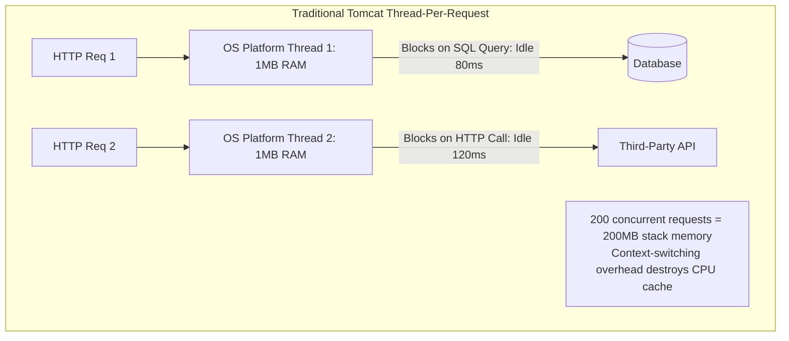
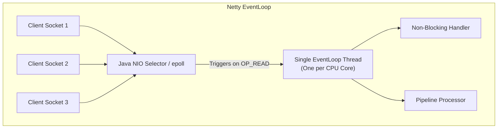
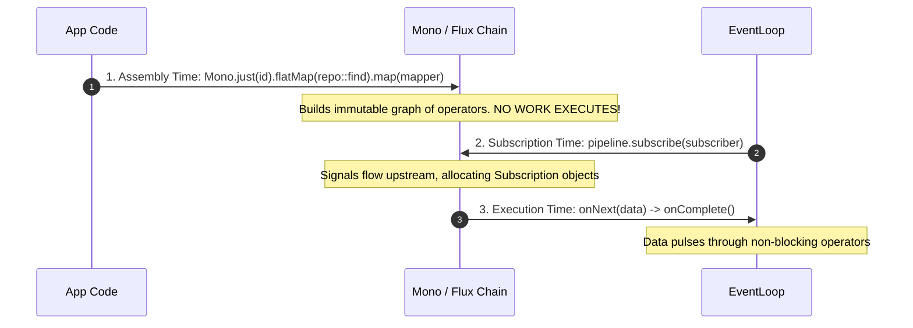
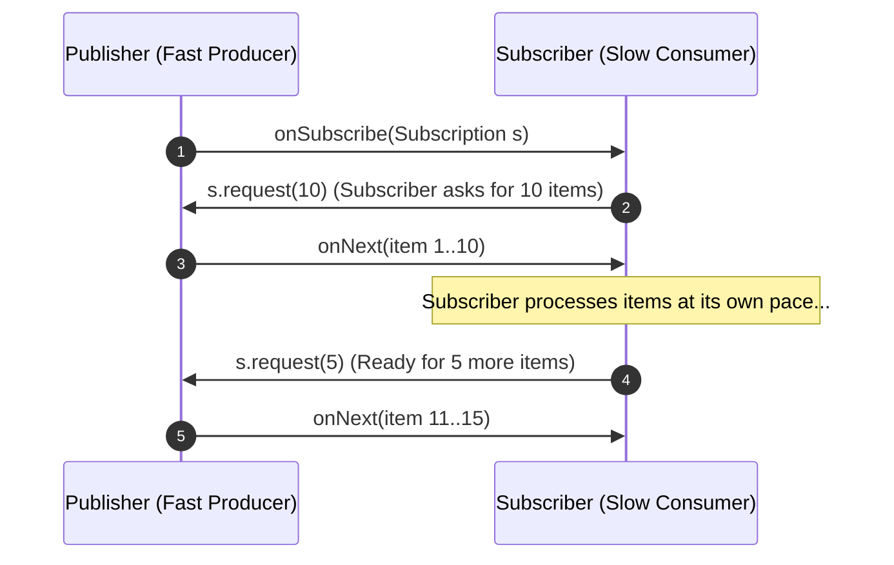
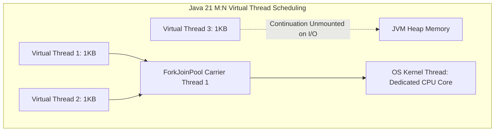

## 1. Mental Model: The Thread Scaling Wall

For two decades, Java enterprise applications relied on the **Thread-Per-Request** model:
1. An incoming HTTP request is assigned a dedicated operating system (OS) kernel thread from a Tomcat worker pool (`max-threads=200`).
2. That thread executes business logic, makes blocking JDBC queries, calls downstream REST services, and formats JSON responses.
3. While waiting 80ms for a database read or remote HTTP API response, the OS thread sits idle, blocked in the kernel's `wait_queue`.



### The C10K / C1000K Problem
An OS platform thread consumes roughly **1MB of off-heap stack memory**. A server with 4GB of RAM will crash with `OutOfMemoryError: unable to create native thread` around 3,000-4,000 threads. Even worse, the Linux kernel scheduler degrades exponentially when context-switching thousands of blocked threads across CPU registers.

To handle hundreds of thousands of concurrent connections, the Java ecosystem developed two fundamentally divergent paradigms:
1. **Reactive Programming (Spring WebFlux + Project Reactor + Netty)**: Rewrite code into non-blocking, asynchronous callback event graphs on a tiny fixed pool of event-loop threads.
2. **Virtual Threads (Java 21 Project Loom)**: Keep familiar imperative, synchronous, blocking code, but decouple Java threads from OS kernel threads using lightweight user-mode fibers.

---

## 2. Project Reactor & Netty Internals

Spring WebFlux runs on **Eclipse Netty**, an asynchronous, event-driven network application framework.



### The EventLoop Rule: "Never Block the EventLoop"
Netty allocates exactly **one EventLoop thread per CPU core** (e.g., 8 threads on an 8-core CPU). These 8 threads process I/O events for hundreds of thousands of concurrent client sockets using Linux `epoll`.

<Warning>
If a developer executes a blocking operation (e.g., `Thread.sleep()`, standard `jdbcTemplate.query()`, or legacy HTTP clients) inside a WebFlux pipeline without offloading to an elastic scheduler, that entire EventLoop thread freezes. All thousands of other client sockets assigned to that EventLoop stall immediately, spiking p99 latency to infinity.
</Warning>

### The Three Phases of Reactive Execution



1. **Assembly Time**: Operators (`map`, `flatMap`, `filter`) are chained together. This merely constructs a declarative directed acyclic graph (DAG). No database calls or HTTP requests happen.
2. **Subscription Time**: When `.subscribe()` is called (done automatically by WebFlux at the controller edge), subscribers flow backwards upstream to publishers.
3. **Execution Time**: The actual data flows downstream through signals (`onNext`, `onError`, `onComplete`).

---

## 3. Reactive Backpressure Mechanics

What happens when a fast publisher (e.g., a high-speed sensor stream or Kafka topic producing 100,000 events/sec) outpaces a slow subscriber (e.g., a slow database persisting only 2,000 events/sec)?

In imperative programming, the slow consumer's memory buffer blows up, causing JVM `OutOfMemoryError`.

In Reactive Streams (RFC specification), backpressure is mediated via the **Pull-Push Hybrid protocol**:



### Backpressure Overflow Strategies in Project Reactor:
- `onBackpressureBuffer(maxSize)`: Buffers items in memory up to a bounded threshold; rejects further signals with `BufferOverflowException`.
- `onBackpressureDrop()`: Drops incoming items emitted while downstream has zero pending demand (`request(0)`).
- `onBackpressureLatest()`: Retains only the most recent item, discarding previous unconsumed emissions (ideal for stock tickers or real-time sensor dashboards).

---

## 4. Java 21 Virtual Threads (Project Loom) Internals

Java 21 introduced **Virtual Threads**, which completely change the economics of thread creation:



### Continuation Unmounting: The Magic Trick
When a virtual thread executes a blocking socket read:
1. The JVM runtime detects the blocking syscall inside the JDK standard library (`SocketInputStream`, `ReentrantLock`).
2. The virtual thread's execution stack is **unmounted** from its underlying OS "Carrier Thread" (an internal `ForkJoinPool` worker) and preserved as a lightweight Continuation object in standard JVM heap memory (~1-2KB).
3. The Carrier Thread is immediately free to run another virtual thread.
4. When the Linux kernel signals via `epoll` that the network socket has bytes ready to read, the ForkJoinPool scheduler **remounts** the virtual thread's stack onto any available Carrier Thread and resumes execution right where it left off.

```java
// Enabling Virtual Threads in Spring Boot 3.2+ (application.yml)
spring:
  threads:
    virtual:
      enabled: true
```
With this single property, every incoming HTTP request runs in its own lightweight virtual thread. You write traditional, readable, imperative code (`orderRepository.findById(id)`), while achieving Netty-grade concurrency.

---

## 5. The Context Propagation Dilemma

In enterprise architectures, cross-cutting concerns (Security authentication context, OpenTelemetry trace spans, SLF4J MDC correlation IDs) are stored in `ThreadLocal` variables:

```java
// Traditional ThreadLocal access
String traceId = MDC.get("traceId");
SecurityContext context = SecurityContextHolder.getContext();
```

### Why WebFlux Breaks ThreadLocal
Because WebFlux switches thread execution arbitrarily across different EventLoop workers or scheduler threads between reactive operators:
- A thread executing `.map()` might NOT be the same thread executing `.flatMap()` 5 milliseconds later.
- As a result, standard `ThreadLocal` values vanish or leak between unrelated customer requests.

**WebFlux Solution**: You must explicitly thread `Reactor Context` through downstream chains:
```java
public Mono<OrderResponse> processOrder(OrderRequest request) {
    return Mono.deferContextual(ctx -> {
        String correlationId = ctx.get("CORRELATION_ID");
        return orderService.create(request, correlationId);
    }).contextWrite(Context.of("CORRELATION_ID", UUID.randomUUID().toString()));
}
```

### Scoped Values: preview API in Java 21

`ScopedValue` binds a value for a limited execution scope. In Java 21 it is a **preview API**, so it needs `javac --release 21 --enable-preview` and `java --enable-preview`. The following is a fragment requiring your `UserPrincipal` and service types. It is optional reading; the core labs use no preview APIs. See the [Java 21 API](https://docs.oracle.com/en/java/javase/21/docs/api/java.base/java/lang/ScopedValue.html).

Bindings can be inherited by child tasks created through the supported structured concurrency API. They are not automatically inherited by arbitrary new threads or executor submissions.
```java
public final static ScopedValue<UserPrincipal> CURRENT_USER = ScopedValue.newInstance();

// Available during this call; the binding ends when the scope exits
ScopedValue.where(CURRENT_USER, authenticatedUser).run(() -> {
    orderService.process();
});
```

---

<Note>
The monitor pinning advice here targets Java 21. JDK 24 changed `synchronized` so a blocked virtual thread can release its carrier. Do not apply the older workaround mechanically to every newer runtime. See [JDK 24 migration notes](https://docs.oracle.com/en/java/javase/24/migrate/significant-changes-jdk-24.html).
</Note>

## 6. Choosing an Execution Model

| Evaluation Dimension | Spring WebFlux (Reactor / Netty) | Spring MVC + Virtual Threads (Loom) |
| :--- | :--- | :--- |
| **Programming Paradigm** | Declarative Functional / Monadic Streams | Familiar Synchronous / Imperative |
| **Debugging & Stack Traces** | Cryptic operator assembly traces; hard to debug | Pristine line-by-line sequential stack traces |
| **Relational DB Ecosystem** | R2DBC for nonblocking SQL; blocking JPA calls need explicit offloading | Full JPA / Hibernate 6, Liquibase, Flyway |
| **Third-Party Libraries** | Any blocking library poisons the EventLoop | Blocking APIs remain usable; bound concurrency and test pinning on Java 21 |
| **Backpressure Support** | Native, fine-grained stream backpressure | Bounded queues, semaphores, admission limits, and transport flow control |
| **Streaming & Push Protocols** | Native SSE, WebSockets, RSocket, gRPC bidirectional | Supported, but requires chunked async workers |
| **Context Propagation** | Complex Reactor `Context` wrapping | Native `ThreadLocal` and `ScopedValue` |
| **Memory Footprint** | Extremely low (~few hundred bytes per stream) | Very low (~1-2KB per virtual thread) |

### When to Still Choose Spring WebFlux:
1. **Edge Gateways & Reverse Proxies**: Services that route millions of concurrent connections with zero database persistence (e.g., Spring Cloud Gateway).
2. **Infinite Data Streams**: Long-lived Server-Sent Events (SSE) or WebSocket push feeds (e.g., stock market tick tickers, live chat backplanes).
3. **Reactive Native Datastores**: Workloads backed strictly by reactive-native engines like MongoDB Reactive, Redis Reactive, or Apache Cassandra.

### When to Consider Spring MVC + Virtual Threads:
1. **Relational Database Core**: Any application relying on PostgreSQL, MySQL, JPA, Hibernate, or Spring Data JDBC.
2. **Enterprise Business Logic**: Complex domain models with extensive branch conditions, domain exceptions, and transaction propagation.
3. **Engineering Team Productivity**: Teams that want clear stack traces, step-through breakpoints, and familiar control flow and bounded resource use.

---

## 7. Working Code Comparison: Same API Implemented Both Ways

<Tabs>
  <Tab title="Spring WebFlux (Reactive)">
```java
@RestController
@RequestMapping("/api/v1/orders")
public class ReactiveOrderController {

    private final ReactiveOrderRepository orderRepository;
    private final WebClient inventoryClient;

    public ReactiveOrderController(ReactiveOrderRepository orderRepository, WebClient.Builder webClientBuilder) {
        this.orderRepository = orderRepository;
        this.inventoryClient = webClientBuilder.baseUrl("https://inventory.internal").build();
    }

    @PostMapping
    @ResponseStatus(HttpStatus.CREATED)
    public Mono<OrderResponse> createOrder(@Valid @RequestBody OrderRequest request) {
        return inventoryClient.post()
                .uri("/check-stock")
                .bodyValue(new StockCheckDto(request.productId(), request.quantity()))
                .retrieve()
                .bodyToMono(StockStatus.class)
                .flatMap(status -> {
                    if (!status.available()) {
                        return Mono.error(new OutOfStockException("Item unavailable"));
                    }
                    Order order = new Order(request.productId(), request.quantity(), "CONFIRMED");
                    return orderRepository.save(order);
                })
                .map(OrderResponse::fromDomain);
    }
}
```
  </Tab>
  <Tab title="Spring MVC + Virtual Threads (Java 21 Loom)">
```java
@RestController
@RequestMapping("/api/v1/orders")
public class ImperativeOrderController {

    private final OrderRepository orderRepository;
    private final RestClient inventoryClient;

    public ImperativeOrderController(OrderRepository orderRepository, RestClient.Builder restClientBuilder) {
        this.orderRepository = orderRepository;
        this.inventoryClient = restClientBuilder.baseUrl("https://inventory.internal").build();
    }

    @PostMapping
    @ResponseStatus(HttpStatus.CREATED)
    public OrderResponse createOrder(@Valid @RequestBody OrderRequest request) {
        // Runs on an unmounted Virtual Thread; blocking HTTP call does NOT hold an OS thread
        StockStatus status = inventoryClient.post()
                .uri("/check-stock")
                .body(new StockCheckDto(request.productId(), request.quantity()))
                .retrieve()
                .body(StockStatus.class);

        if (status == null || !status.available()) {
            throw new OutOfStockException("Item unavailable");
        }

        // Standard JPA / Hibernate save; fully blocking, completely safe
        Order order = new Order(request.productId(), request.quantity(), "CONFIRMED");
        Order saved = orderRepository.save(order);

        return OrderResponse.fromDomain(saved);
    }
}
```
  </Tab>
</Tabs>

---

## 8. Failure Modes & Edge Case Matrix

| Failure Mode | Architecture | Root Cause | Impact | Production Defense |
| :--- | :--- | :--- | :--- | :--- |
| **EventLoop Starvation** | WebFlux | Calling blocking code (JDBC, `Thread.sleep`) on Netty thread | Entire server stalls; all client sockets freeze | Run BlockHound in tests; offload blocking calls to `subscribeOn(Schedulers.boundedElastic())`. |
| **Carrier Thread Pinning** | Virtual Threads | Blocking inside `synchronized` block or native JNI call | Virtual thread cannot unmount; pins OS carrier thread | Replace `synchronized` with `java.util.concurrent.locks.ReentrantLock`. Run `-Djdk.tracePinnedThreads=full`. |
| **ThreadLocal Memory Leaks** | WebFlux | Setting SLF4J MDC without manual Reactor Context cleanup | Correlation IDs bleed into unrelated customer requests | Use `reactor-core-micrometer` context propagation hooks. |
| **Unbounded Virtual Thread Storm** | Virtual Threads | Spawning millions of virtual threads against an unprotected DB | 100,000 DB connections requested; HikariCP exhausts | Restrict concurrency using a `Semaphore` rather than thread pool sizing. |

---

## 9. Senior Interview Questions & Active Recall

<AccordionGroup>
  <Accordion title="Why can't you just use JPA / Hibernate with Spring WebFlux?">
    JPA and Hibernate are fundamentally built on blocking JDBC (`java.sql`), which assumes synchronous socket I/O tied to the executing thread. If you execute a JPA repository call inside a WebFlux pipeline, it blocks the Netty EventLoop thread, stalling all concurrent connections on that core. While R2DBC provides asynchronous reactive database access, it lacks advanced ORM capabilities like dirty checking, lazy loading proxies, and first-level caching.
  </Accordion>
  <Accordion title="What is the Carrier Thread Pinning problem in Virtual Threads, and how do you diagnose it?">
    A virtual thread is pinned to its carrier thread when it blocks while executing inside a `synchronized` block or method, or while invoking native C code via JNI. When pinned, the continuation cannot be unmounted to heap memory, preventing the underlying OS carrier thread from executing other virtual threads. It is diagnosed by launching the JVM with `-Djdk.tracePinnedThreads=full` and mitigated by replacing `synchronized` with `ReentrantLock`.
  </Accordion>
  <Accordion title="Does Java 21 Virtual Threads make Reactive Programming completely obsolete?">
    No. Virtual threads excel at high-concurrency request-response workloads with blocking I/O (REST APIs backed by databases). However, Reactive Programming is still superior for: (1) fine-grained stream backpressure where consumers must control producer emission rates, (2) long-lived reactive push feeds like SSE or RSocket, and (3) edge reverse proxies requiring zero-copy network buffer forwarding without stack allocations.
  </Accordion>
</AccordionGroup>

---

## 10. Done Checklist

<Check>
- [ ] Understand the fundamental bottleneck of Tomcat's Thread-Per-Request architecture (1MB stack per thread, kernel context-switching).
- [ ] Articulate the Netty EventLoop architecture and the catastrophic impact of blocking an EventLoop thread.
- [ ] Diagram the 3 phases of reactive execution: Assembly Time, Subscription Time, and Execution Time.
- [ ] Explain Reactive Backpressure and compare buffer, drop, and latest overflow strategies.
- [ ] Master Continuation Unmounting in Java 21 Virtual Threads and contrast with reactive callback graphs.
- [ ] Identify Carrier Thread Pinning (`synchronized`) and know how to diagnose it with JVM flags.
- [ ] Apply the 2026 Architectural Decision Rubric: WebFlux for streaming/edge proxies vs Spring MVC + Virtual Threads for relational database CRUD.
</Check>
