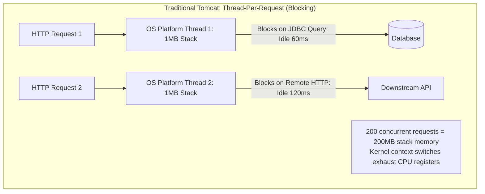
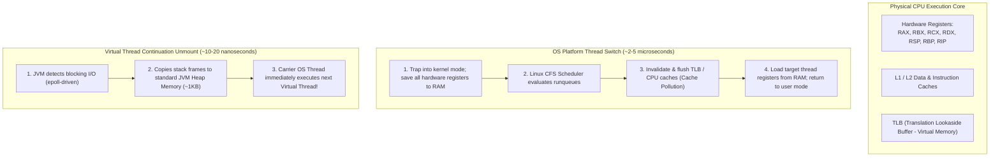
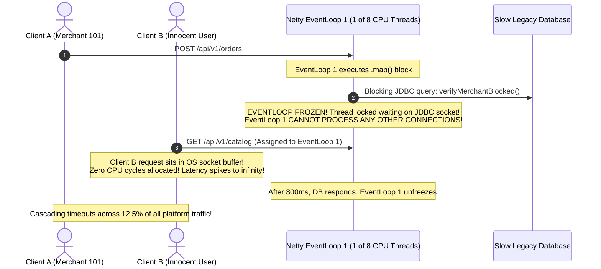
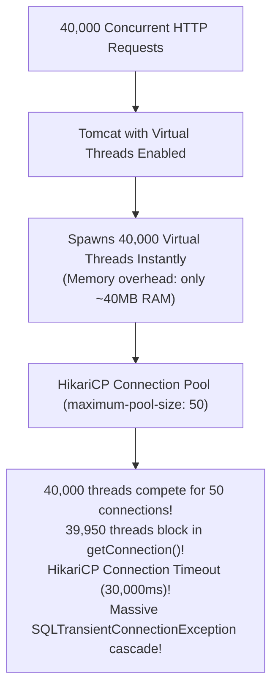
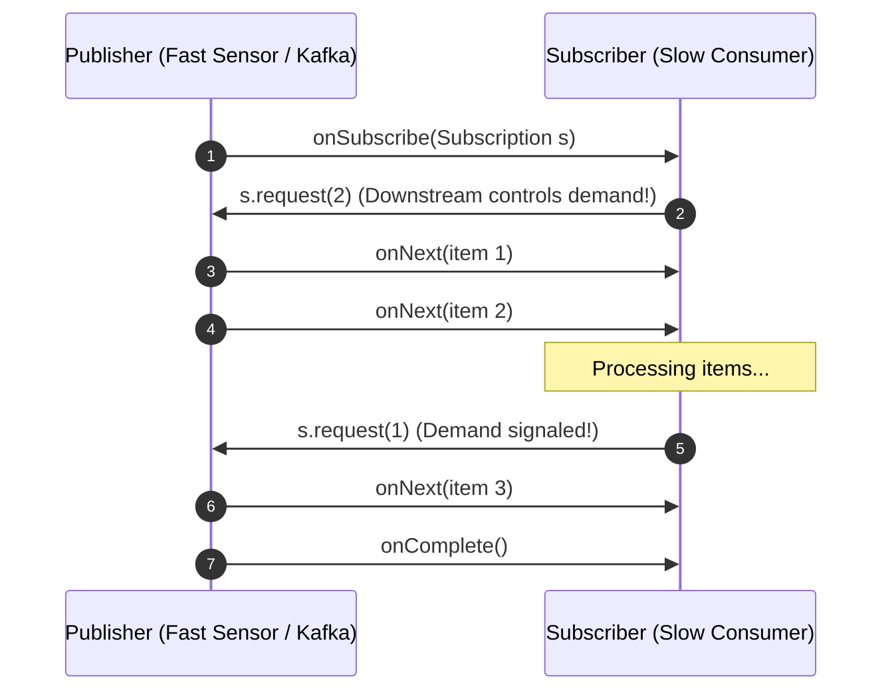

# Reactive (WebFlux) vs Virtual Threads (Loom): The Showdown

For over two decades, the Java enterprise ecosystem was anchored to the **Thread-Per-Request** concurrency model:
- An incoming HTTP request is assigned a dedicated operating system (OS) platform thread from a Tomcat or Jetty worker pool (default `max-threads=200`).
- That OS thread executes domain logic, issues blocking JDBC database queries, invokes downstream REST services, and serializes JSON responses.
- While waiting $60\text{ ms}$ for a PostgreSQL query or remote microservice response, the physical thread sits completely idle, blocked in the Linux kernel's `wait_queue`.



### The C10K / C1000K Thread Scaling Wall
An OS platform thread is an expensive kernel resource consuming approximately **1MB of off-heap stack memory**. Attempting to spawn 5,000 platform threads causes the Linux kernel to crash the JVM with:
`java.lang.OutOfMemoryError: unable to create native thread`.

Furthermore, when thousands of blocked threads compete for execution, the Linux kernel CPU scheduler spends more cycles performing **CPU register state saving and Translation Lookaside Buffer (TLB) cache flushes** (kernel context-switching) than executing actual business code.

To scale beyond this hardware ceiling, the Java ecosystem developed two fundamentally divergent paradigms:
1. **Reactive Programming (Spring WebFlux + Project Reactor + Netty)**: Rewrite code into non-blocking, asynchronous callback event graphs operating on a tiny, fixed pool of EventLoop threads.
2. **Virtual Threads (Java 21 Project Loom)**: Retain intuitive, synchronous, blocking code, while decoupling Java threads from OS kernel threads using lightweight user-mode fibers scheduled in JVM heap memory.

---

## Phase 1: Ground Floor (Physical First Principles)

To evaluate these concurrency models, you must understand what physically occurs inside CPU cores, silicon registers, and kernel memory during a thread context switch.



### 1. The Physical Cost of an OS Context Switch
When an OS platform thread blocks waiting on socket I/O:
1. The CPU raises a software interrupt, switching privilege levels from User Mode (Ring 3) to Kernel Mode (Ring 0).
2. The operating system kernel saves the exact state of all hardware registers (`RAX`, `RBX`, `RSP`, `RIP`) into the thread's kernel task descriptor.
3. The Linux Completely Fair Scheduler (CFS) scans active runqueues and picks another thread.
4. The memory management unit (MMU) must invalidate and flush the **Translation Lookaside Buffer (TLB)**, evicting warm L1 and L2 CPU caches.
5. This process takes **$2\text{ to }5\text{ microseconds}$** ($5,000\text{ to }15,000\text{ CPU clock cycles}$) of pure waste.

### 2. Continuation Unmounting (Project Loom Mechanics)
Virtual threads bypass the Linux kernel scheduler completely:
- A virtual thread is an instance of `java.lang.VirtualThread` representing a **Continuation** (a pauseable call stack).
- When a virtual thread executes a blocking socket read (`socket.read()`), the JVM standard library detects the call, intercepts the blocking syscall, and **unmounts the continuation stack** from its underlying OS **Carrier Thread** (an internal `ForkJoinPool` worker).
- The continuation stack frame ($\approx 1\text{ to }2\text{ KB}$) is copied to ordinary JVM heap memory.
- The Carrier Thread never blocks! It immediately picks up another virtual thread and continues executing instructions at full CPU speed.
- When the Linux kernel signals via `epoll` that data has arrived, the JVM scheduler **remounts** the continuation onto any available carrier thread and resumes execution.

---

## Phase 2: The Naive Code (The Production Crashes)

### Crash Scenario 1: The EventLoop Poisoning Freeze (WebFlux Meltdown)

A developer builds a high-throughput reactive gateway using Spring WebFlux. During an urgent hotfix, they need to verify an API key against a legacy database:

```java
// DANGEROUS ANTI-PATTERN: Executing blocking calls on a Netty EventLoop thread
@RestController
@RequestMapping("/api/v1/orders")
public class ReactiveOrderController {

    @Autowired
    private LegacyAuthDatabaseClient legacyDbClient; // Blocking JDBC Client!

    @PostMapping
    public Mono<OrderResponse> submitOrder(@RequestBody OrderRequest request) {
        return Mono.just(request)
            .map(req -> {
                // FATAL DISASTER: Blocking JDBC call executed on Netty EventLoop!
                // Blocks the thread for 800 milliseconds!
                return legacyDbClient.verifyMerchantBlocked(req.merchantId());
            })
            .flatMap(isBlocked -> {
                if (isBlocked) {
                    return Mono.error(new MerchantBlockedException());
                }
                return processOrderReactive(request);
            });
    }
}
```



#### What Happened in Production:
- On an 8-core server, Netty allocates exactly **8 EventLoop threads**.
- Blocking a single EventLoop thread freezes **$12.5\%$ of all active TCP connections across the entire cluster**.
- Under moderate traffic, 8 concurrent requests executing blocking JDBC calls freeze **100% of all EventLoops**.
- Health check endpoints (`/actuator/health`) timeout, Kubernetes concludes the pod is dead, and the cluster enters an unrecoverable restart death spiral.

---

### Crash Scenario 2: The Carrier Thread Pinning Lockup (Virtual Thread Disaster)

A team migrates a Spring Boot application to Java 21 Virtual Threads (`spring.threads.virtual.enabled=true`). A third-party caching library relies on legacy Java `synchronized` blocks:

```java
// DANGEROUS ANTI-PATTERN: Blocking I/O inside a synchronized block
public class LegacyDistributedCache {

    private final Object lock = new Object();

    public byte[] fetchCachedData(String key) {
        // FATAL IN JAVA 21: synchronized blocks PIN the Virtual Thread to the Carrier Thread!
        synchronized (lock) {
            // Blocking socket read over network!
            return socketChannel.readBytes(key); 
        }
    }
}
```

#### What Happened in Production:
- In Java 21, when a virtual thread enters a `synchronized` block or invokes native C code via JNI, the JVM **pins the virtual thread to its underlying OS Carrier Thread**.
- When `socketChannel.readBytes()` blocks on the network, the JVM **cannot unmount the continuation**!
- Under high concurrency, all 8 `ForkJoinPool` carrier threads become pinned and frozen in network I/O.
- Even though millions of virtual threads can exist, **there are zero carrier threads available to execute them**.
- Application throughput collapses from 15,000 req/sec to 12 req/sec, and p99 latency explodes to 30 seconds.

---

### Crash Scenario 3: The Unbounded Database Connection Pool Collapse

A team enables virtual threads on Spring MVC backed by PostgreSQL. An unexpected marketing push sends 40,000 concurrent HTTP requests:



#### What Happened in Production:
- In the traditional model, Tomcat's pool capped concurrency at 200 requests, queuing excess traffic at the HTTP gateway.
- With virtual threads enabled, Tomcat spawned **40,000 virtual threads simultaneously**.
- All 40,000 threads entered `orderRepository.findById()` and requested database connections from HikariCP.
- HikariCP connection pool was sized to 50 connections.
- 39,950 virtual threads timed out waiting for a connection, throwing `SQLTransientConnectionException: Connection is not available, request timed out after 30000ms`.
- 99.8% of user transactions failed with `HTTP 500 Internal Server Error`.

---

## Phase 3: Under the Hood (Mechanics, Protocols & Decision Rubric)

### 1. Reactive Streams Architecture: The Pull-Push Hybrid

Spring WebFlux implements the **Reactive Streams Specification**:
- `Mono<T>`: Emits 0 or 1 item.
- `Flux<T>`: Emits 0 to $N$ items (potentially infinite stream).



#### The 3 Execution Phases:
1. **Assembly Time**: Operators (`.filter()`, `.map()`, `.flatMap()`) construct an immutable computation graph (DAG). **Zero execution or I/O occurs**.
2. **Subscription Time**: Calling `.subscribe()` triggers signals flowing upstream from consumer to producer.
3. **Execution Time**: The publisher pushes data down to the subscriber within the requested backpressure bounds (`request(n)`).

---

### 2. Virtual Threads: Diagnosing & Eliminating Carrier Pinning

#### 1. Enabling JVM Pinning Diagnostics
Launch your Java 21 container with the pinning diagnostic flag:
```bash
-Djdk.tracePinnedThreads=full
```
When a virtual thread pins its carrier, the JVM prints a full stack trace pinpointing the offending `synchronized` method:
```console
Thread[#42,ForkJoinPool-1-worker-3,5,CarrierThreads]
    java.base/java.lang.VirtualThread$VThreadContinuation.onPinned(VirtualThread.java:183)
    com.backend.cache.LegacyDistributedCache.fetchCachedData(LegacyDistributedCache.java:24) <== PINNED HERE!
```

#### 2. Resolving Pinning with `ReentrantLock`:
Replace `synchronized` with `ReentrantLock`. Unlike monitor locks, `ReentrantLock` integrates directly with Loom, allowing continuations to unmount cleanly:

```java
public class ModernDistributedCache {

    private final ReentrantLock lock = new ReentrantLock();

    public byte[] fetchCachedData(String key) {
        lock.lock();
        try {
            // UNMOUNTS CLEANLY: Carrier thread is freed while waiting on socket!
            return socketChannel.readBytes(key);
        } finally {
            lock.unlock();
        }
    }
}
```

---

### 3. Bounding Virtual Thread Concurrency with Semaphores

Because virtual threads are virtually free to create, **you must never use thread pools to throttle virtual threads**. Instead, throttle access to finite downstream resources (databases, third-party APIs) using a **`Semaphore`**:

```java
@Service
public class BoundedInventoryService {

    private final InventoryClient inventoryClient;
    // Strict concurrency boundary: Max 50 simultaneous outbound HTTP calls!
    private final Semaphore outboundConcurrencyLimiter = new Semaphore(50);

    public InventoryStatus checkInventory(String sku) {
        try {
            outboundConcurrencyLimiter.acquire();
            // Virtual thread blocks on semaphore; unmounts cleanly if limit reached!
            return inventoryClient.fetchStock(sku);
        } catch (InterruptedException ex) {
            Thread.currentThread().interrupt();
            throw new RuntimeException("Interrupted acquiring slot", ex);
        } finally {
            outboundConcurrencyLimiter.release();
        }
    }
}
```

---

### 4. The 2026 Architectural Decision Rubric

| Feature / Dimension | Spring WebFlux (Reactor / Netty) | Spring MVC + Virtual Threads (Java 21) |
| :--- | :--- | :--- |
| **Programming Paradigm** | Declarative Functional / Monadic streams | **Familiar Imperative / Synchronous** |
| **Relational Database Stack** | R2DBC (Non-blocking SQL; lacks JPA maturity) | **Full JPA / Hibernate 6, Flyway, JDBC** |
| **Debugging & Stack Traces** | Cryptic reactive operator chain traces | **Pristine sequential line-by-line stack traces** |
| **Context Propagation** | Complex Reactor `Context` manual chaining | **Native `ThreadLocal` & `ScopedValue`** |
| **Fine-Grained Backpressure**| **Native Reactive Streams (`request(n)`)** | Transport-level TCP flow control & Semaphores |
| **Long-Lived Push Streaming**| **Superb for SSE, WebSockets, RSocket** | Supported, but requires chunked async workers |
| **Third-Party Ecosystem** | Any blocking library poisons the EventLoop | Blocking libraries work safely (barring pinning) |
| **Memory per Connection** | Extremely low (~few hundred bytes) | Very low (~1 to 2 KB per virtual thread) |

```mermaid
flowchart TD
    Start{What is your primary datastore & architecture?}
    
    Start -->|PostgreSQL, MySQL, Oracle, JPA/Hibernate| MVC[Spring MVC + Virtual Threads\n(Peak developer productivity; full JPA support)]
    Start -->|Complex Domain Logic & Enterprise CRUD| MVC
    
    Start -->|Edge API Gateway / Reverse Proxy| Flux[Spring WebFlux + Netty\n(Zero-copy buffer forwarding; maximum IOPS)]
    Start -->|Continuous Real-Time Push: WebSockets/SSE| Flux
    Start -->|Reactive-Native Datastores: Mongo / Cassandra| Flux
```

---

## Phase 4: Senior Interview Ace (Junior vs Staff Phrasing)

| Question / Scenario | Junior Developer Answer | Senior / Staff Backend Engineer Answer |
| :--- | :--- | :--- |
| **Why can't you simply use JPA/Hibernate inside a Spring WebFlux application?** | "Because JPA is synchronous and WebFlux is asynchronous." | "JPA and Hibernate are architected entirely on top of blocking JDBC (`java.sql`), which assumes synchronous socket I/O tied to the executing thread. If you execute a blocking JPA query inside a WebFlux pipeline, it blocks one of the small, fixed Netty EventLoop worker threads (equal to CPU cores). This starves the EventLoop, causing **all other concurrent client connections sharing that core to freeze completely**. While R2DBC exists for reactive SQL, it lacks full ORM features like lazy-loading proxies and first-level dirty checking." |
| **What is Carrier Thread Pinning in Java 21 Virtual Threads, and how do you resolve it?** | "Pinning is when a thread gets stuck on a CPU and cannot move." | "In Project Loom, a virtual thread is 'pinned' to its underlying OS Carrier Thread whenever it blocks inside a `synchronized` block/method or executes native code via JNI. When pinned, the JVM **cannot unmount the continuation stack to heap memory**. Under high concurrency, all worker threads in the internal `ForkJoinPool` become pinned and blocked on socket reads, exhausting carrier capacity and stalling the entire application. We diagnose this via `-Djdk.tracePinnedThreads=full` and mitigate it by replacing `synchronized` with `ReentrantLock`." |
| **Do Java 21 Virtual Threads make Spring WebFlux completely obsolete?** | "Yes, virtual threads give you the same performance without messy reactive code." | "No. Virtual threads revolutionize **request-response architectures backed by relational databases**, making Spring MVC the preferred choice for standard enterprise CRUD. However, WebFlux remains indispensable for three distinct architectures: (1) **Edge Gateways & Reverse Proxies** (Spring Cloud Gateway) routing millions of connections with zero database state, (2) **Continuous Push Streaming** (long-lived Server-Sent Events, WebSockets, RSocket) requiring low-memory connection holding, and (3) **Fine-Grained Backpressure** where downstream consumers must explicitly throttle upstream producer emission rates." |
| **Why do we use Semaphores instead of Thread Pools when throttling Virtual Threads?** | "Semaphores are faster than thread pools in Java." | "In traditional architectures, thread pools served two purposes: reusing expensive OS threads and bounding downstream concurrency. Because virtual threads are extraordinarily lightweight ($\approx 1\text{KB}$) and cheap to create, **pooling virtual threads is an anti-pattern**. However, downstream resources like database connection pools (HikariCP) or third-party APIs have strict capacity limits. We let virtual threads spawn freely to handle HTTP requests, but throttle access to limited resources using a `Semaphore`. Virtual threads waiting on a semaphore unmount cleanly without holding carrier threads." |
| **How does Context Propagation differ between Project Reactor and Virtual Threads?** | "Virtual threads use ThreadLocal, while Reactor uses Context." | "In WebFlux, execution hops arbitrarily between different EventLoop and scheduler threads across reactive operators (`map`, `flatMap`). As a result, standard `ThreadLocal` variables (MDC trace IDs, Security Context) vanish or bleed across customer boundaries unless explicitly threaded through `Reactor Context`. Virtual Threads preserve the thread-per-request abstraction: standard `ThreadLocal` variables work out-of-the-box because the virtual thread stays logically bound to the execution flow from request start to finish, and Java 21 `ScopedValue` provides an immutable, lightweight alternative." |

---

## Production Debugging Checklist

<AccordionGroup>
  <Accordion title="1. WebFlux EventLoop Freeze / Starvation">
    - [ ] Run **BlockHound** in unit/integration tests to detect accidental blocking calls on Netty threads: `BlockHound.install()`.
    - [ ] Inspect thread dumps for Netty threads in `BLOCKED` or `WAITING` states on socket reads or database drivers.
    - [ ] If blocking legacy calls are unavoidable, offload them to dedicated schedulers: `.subscribeOn(Schedulers.boundedElastic())`.
  </Accordion>

  <Accordion title="2. Virtual Thread Carrier Pinning">
    - [ ] Start the container with `-Djdk.tracePinnedThreads=full`.
    - [ ] Inspect logs for `VirtualThread$VThreadContinuation.onPinned`.
    - [ ] Identify the offending `synchronized` block and replace it with `java.util.concurrent.locks.ReentrantLock`.
  </Accordion>

  <Accordion title="3. Database Connection Pool Exhaustion on Virtual Threads">
    - [ ] Verify that virtual threads accessing HikariCP are bounded by a `Semaphore` or that HikariCP `maximum-pool-size` matches database server CPU core capacity.
    - [ ] Ensure `connection-timeout` in HikariCP is tuned appropriately (default 30s; reduce to 5s in high-concurrency environments to fail fast).
  </Accordion>
</AccordionGroup>

---

## Done Checklist

<Check>
Physical OS context-switching overhead (TLB flushing, register saving) vs Continuation unmounting is mastered.
</Check>
<Check>
The Netty EventLoop rule ("Never block the EventLoop") is strictly enforced in WebFlux services.
</Check>
<Check>
Carrier thread pinning (`synchronized`) is diagnosed using `-Djdk.tracePinnedThreads=full` and resolved via `ReentrantLock`.
</Check>
<Check>
Downstream database and API concurrency on Virtual Threads is guarded using Semaphores rather than thread pool sizing.
</Check>
<Check>
The 2026 Architectural Decision Rubric is applied: WebFlux for edge proxies/streaming; Spring MVC + Virtual Threads for relational CRUD.
</Check>
<Check>
Context propagation strategies (Reactor `Context` vs `ThreadLocal` vs `ScopedValue`) are applied correctly.
</Check>
