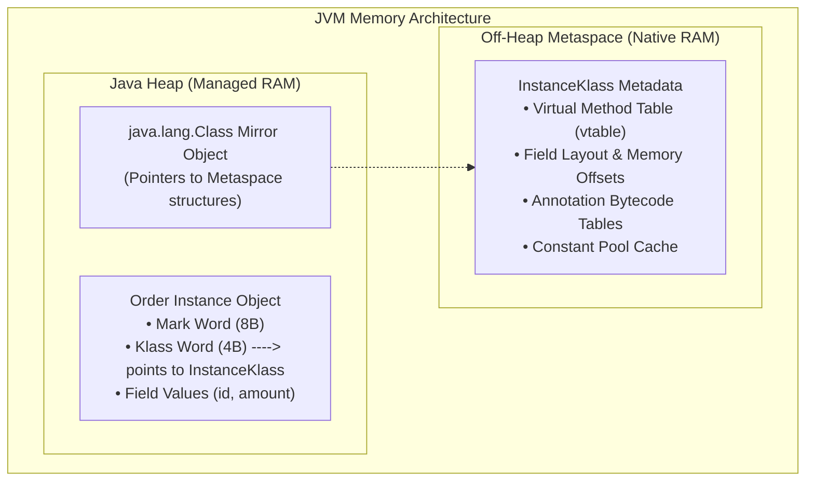
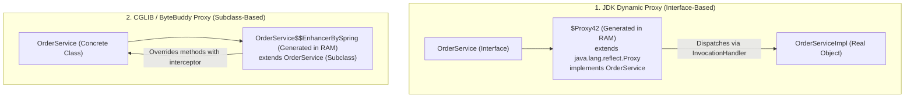

# Java Reflection, Annotations & Dynamic Proxies: Demystifying Framework Magic

In enterprise backend engineering, Spring Boot is often perceived as impenetrable "black magic":
- You place `@Autowired` on a field, and Spring mysteriously instantiates and injects the dependency.
- You annotate a method with `@Transactional`, and Spring automatically manages database transactions, commits, and rollbacks without a single line of JDBC code.
- You annotate an interface with `@Repository`, and Spring magically generates a working database implementation at runtime.

When engineers treat frameworks as black magic, they are completely helpless when production bugs strike:
- **The Self-Invocation Bug**: Calling a `@Transactional` method from within the same class (`this.process()`), silently bypassing the transaction proxy and leaving database writes uncommitted.
- **`ClassCastException` on Injected Beans**: Injecting a concrete class (`OrderServiceImpl`) instead of its interface (`OrderService`), crashing application startup under JDK dynamic proxies.
- **Java Module System Crashes**: Calling `setAccessible(true)` in Java 17+ and crashing with `java.lang.reflect.InaccessibleObjectException`.

Spring Boot is not magic. It is built entirely on three fundamental Java mechanisms: **Reflection**, **Runtime Annotations**, and **Dynamic Proxies**.

This masterclass deconstructs these mechanisms from HotSpot Metaspace metadata up to building a working miniature Spring IoC container from scratch.

---

## Phase 1: Ground Floor (Physical First Principles)

To understand reflection, we must look at how the JVM stores class structure in physical memory.



### 1.1 Class Metadata in Metaspace & The `Class<T>` Mirror
When HotSpot loads a compiled `.class` file into memory:
1. It parses the bytecode and allocates a C++ internal structure called **`InstanceKlass`** in native, off-heap **Metaspace**.
2. Metaspace stores the class's **vtable** (virtual method pointers), field memory offsets, interfaces, and annotation metadata.
3. On the Java Heap, HotSpot creates a single companion instance of **`java.lang.Class<T>`** (the "Class Mirror").
4. When you write `order.getClass()` or `Order.class`, you obtain a direct pointer to this mirror object.

### 1.2 The Performance Cost of Reflection
Historically, developers were warned that reflection was "too slow" for production. 

What is the physical cost of invoking a method via reflection (`Method.invoke()`)?
- **Argument Boxing**: Primitive arguments (`int`, `long`) must be boxed into `Integer` / `Long` heap objects.
- **Array Allocation**: Arguments are passed via an `Object[]` array, allocating memory on the heap.
- **Security Checks**: The JVM verifies caller access permissions on every invocation.
- **Disabling JIT Inlining**: HotSpot cannot easily inline dynamic method calls because the target method could theoretically change at runtime.

#### HotSpot's Solution: Reflection Inflation
HotSpot uses an optimization known as **Reflection Inflation**:
- For the first 15 invocations (`-Dsun.reflect.inflationThreshold=15`), HotSpot executes reflection via a slow native C++ JNI bridge.
- On the 16th invocation, HotSpot dynamically generates a custom bytecode class (`GeneratedMethodAccessor`) specifically compiled for that method.
- Once generated, reflective invocation executes nearly as fast as direct method calls!

---

## Phase 2: The Naive Code (The Production Crashes)

### Crash Scenario 1: The `@Transactional` Self-Invocation Trap

A developer writes an order processing service in Spring Boot:

```java
@Service
public class OrderService {

    public void processOrder(Order order) {
        log.info("Processing order: {}", order.getId());
        // Internal call to transactional method!
        this.saveOrderWithAudit(order); // FATAL BUG: No transaction is started!
    }

    @Transactional
    public void saveOrderWithAudit(Order order) {
        orderRepository.save(order);
        auditRepository.record("Order created: " + order.getId());
        if (order.isFraudulent()) {
            throw new PaymentFailedException("Fraud detected");
        }
    }
}
```

```mermaid
flowchart LR
    subgraph ExternalCall["External Controller Call"]
        Ctrl["Controller"] -->|Calls orderProxy.processOrder()| Proxy["Spring CGLIB / JDK Dynamic Proxy"]
        Proxy -->|1. No @Transactional on processOrder| Target["Real OrderService Instance"]
        Target -->|2. this.saveOrderWithAudit()| Target
        Note["Calls 'this' directly!\nBYPASSES THE PROXY COMPLETELY!\nTransaction interceptor is NEVER executed!"]
    end
```

#### What Crashes in Production:
`order.isFraudulent()` evaluates to true and throws `PaymentFailedException`. 

The developer expects the database transaction to roll back. However, because `saveOrderWithAudit` was called via `this.` internally, **it bypassed the Spring Dynamic Proxy**. 

No transaction was ever started! The order and audit log remain committed in the database, and fraudulent money is stolen.

---

### Crash Scenario 2: `ClassCastException` on Interface-Based Proxies

A developer tries to inject a concrete implementation instead of an interface:

```java
public interface PaymentService {
    void charge(BigDecimal amount);
}

@Service
public class PaymentServiceImpl implements PaymentService {
    @Transactional
    public void charge(BigDecimal amount) { /* ... */ }
}

@RestController
public class CheckoutController {
    // DANGEROUS: Injects concrete class instead of interface!
    @Autowired
    private PaymentServiceImpl paymentService; // CRASHES AT STARTUP!
}
```

#### Why it Crashes:
If Spring is configured with standard **JDK Dynamic Proxies** (`Proxy.newProxyInstance`):
1. The dynamic proxy implements `PaymentService`.
2. The proxy extends `java.lang.reflect.Proxy`. It is a **sibling** of `PaymentServiceImpl`, not a child!
3. Attempting to inject the proxy into a field of type `PaymentServiceImpl` fails with:
   `BeanNotOfRequiredTypeException: Bean named 'paymentServiceImpl' is expected to be of type 'PaymentServiceImpl' but was actually of type 'jdk.proxy2.$Proxy42'`.

Always inject **interfaces**, not concrete implementation classes.

---

## Phase 3: Under the Hood (Reflection, Annotations & Proxies)

### 3.1 The Reflection Engine: Inspecting & Mutating Objects

Java Reflection gives you full access to class structures, private fields, and constructors at runtime:

```java
import java.lang.reflect.Constructor;
import java.lang.reflect.Field;
import java.lang.reflect.Method;

public class ReflectionEngineDemo {
    public static void inspectClass(Object target) throws Exception {
        Class<?> clazz = target.getClass();
        System.out.println("Class: " + clazz.getName());

        // 1. Inspect all declared fields (including private)
        for (Field field : clazz.getDeclaredFields()) {
            field.setAccessible(true); // Bypass Java access checks
            Object value = field.get(target);
            System.out.printf("  Field '%s' (%s) = %s%n", 
                field.getName(), field.getType().getSimpleName(), value);
        }

        // 2. Inspect all methods
        for (Method method : clazz.getDeclaredMethods()) {
            System.out.printf("  Method '%s' returns %s%n", 
                method.getName(), method.getReturnType().getSimpleName());
        }
    }
}
```

---

### 3.2 Runtime Annotations: Defining Metadata

Annotations carry metadata that the JVM or frameworks inspect at runtime:

```java
import java.lang.annotation.ElementType;
import java.lang.annotation.Retention;
import java.lang.annotation.RetentionPolicy;
import java.lang.annotation.Target;

// 1. RetentionPolicy.RUNTIME: Retained in Metaspace bytecode; readable via reflection!
@Retention(RetentionPolicy.RUNTIME)
// 2. ElementType specifies where this annotation can be placed
@Target({ElementType.METHOD, ElementType.TYPE})
public @interface Transactional {
    boolean readOnly() default false;
    int timeoutSeconds() default 30;
}
```

#### The Three Retention Policies:
| Policy | When Retained | Visible to Reflection? | Primary Use Case |
| :--- | :--- | :--- | :--- |
| `SOURCE` | Discarded by compiler | ❌ No | Compiler checks (`@Override`, `@SuppressWarnings`, Lombok) |
| `CLASS` (Default) | Stored in `.class` file | ❌ No | Bytecode tools, Android build plugins |
| `RUNTIME` | Loaded into Metaspace | ✅ **Yes** | Frameworks (Spring `@Autowired`, Hibernate `@Entity`) |

---

### 3.3 JDK Dynamic Proxies vs CGLIB / ByteBuddy

A **Dynamic Proxy** is a class created dynamically in memory at runtime that intercepts calls to methods.



#### 1. JDK Dynamic Proxy Implementation:
JDK proxies require an interface:
```java
import java.lang.reflect.InvocationHandler;
import java.lang.reflect.Method;
import java.lang.reflect.Proxy;

public class TransactionInvocationHandler implements InvocationHandler {
    private final Object target;

    public TransactionInvocationHandler(Object target) {
        this.target = target;
    }

    @Override
    public Object invoke(Object proxy, Method method, Object[] args) throws Throwable {
        // Check if method has @Transactional
        Method targetMethod = target.getClass().getMethod(method.getName(), method.getParameterTypes());
        boolean isTransactional = targetMethod.isAnnotationPresent(Transactional.class);

        if (!isTransactional) {
            return method.invoke(target, args); // Direct invocation
        }

        System.out.println(">>> [PROXY] BEGIN DATABASE TRANSACTION");
        try {
            Object result = method.invoke(target, args);
            System.out.println(">>> [PROXY] COMMIT DATABASE TRANSACTION");
            return result;
        } catch (Exception e) {
            System.out.println(">>> [PROXY] ROLLBACK DATABASE TRANSACTION");
            throw e.getCause();
        }
    }
}
```

#### Creating the Proxy:
```java
OrderService realService = new OrderServiceImpl();

OrderService proxyService = (OrderService) Proxy.newProxyInstance(
    OrderService.class.getClassLoader(),
    new Class<?>[] { OrderService.class },
    new TransactionInvocationHandler(realService)
);

proxyService.saveOrder(new Order("ORD-101")); // Intercepted with BEGIN / COMMIT!
```

---

### 3.4 Building a Miniature Spring IoC & AOP Engine in 50 Lines of Pure Java

To prove that Spring Boot is not magic, here is a working dependency injection and transaction engine:

```java
package com.example.minispring;

import java.lang.annotation.Retention;
import java.lang.annotation.RetentionPolicy;
import java.lang.reflect.*;
import java.util.*;

// Annotations
@Retention(RetentionPolicy.RUNTIME) @interface Component {}
@Retention(RetentionPolicy.RUNTIME) @interface Autowired {}
@Retention(RetentionPolicy.RUNTIME) @interface MyTransactional {}

// Miniature IoC Container
public class MiniApplicationContext {
    private final Map<Class<?>, Object> beanRegistry = new HashMap<>();

    public void registerAndInject(Class<?>... classes) throws Exception {
        // Step 1: Instantiate all classes with @Component
        for (Class<?> clazz : classes) {
            if (clazz.isAnnotationPresent(Component.class)) {
                Constructor<?> constructor = clazz.getDeclaredConstructor();
                constructor.setAccessible(true);
                Object instance = constructor.newInstance();
                beanRegistry.put(clazz, instance);
            }
        }

        // Step 2: Perform Field Dependency Injection (@Autowired)
        for (Object bean : beanRegistry.values()) {
            for (Field field : bean.getClass().getDeclaredFields()) {
                if (field.isAnnotationPresent(Autowired.class)) {
                    field.setAccessible(true);
                    Object dependency = beanRegistry.get(field.getType());
                    if (dependency != null) {
                        field.set(bean, dependency); // Inject dependency!
                    }
                }
            }
        }
    }

    public <T> T getBean(Class<T> clazz) {
        return clazz.cast(beanRegistry.get(clazz));
    }
}
```

#### How It Executes:
```java
@Component
class OrderRepository {
    public void insert() { System.out.println("Inserted into PostgreSQL"); }
}

@Component
class OrderService {
    @Autowired
    private OrderRepository orderRepository;

    public void createOrder() {
        orderRepository.insert(); // Works! Dependency was injected via reflection!
    }
}

public class Main {
    public static void main(String[] args) throws Exception {
        MiniApplicationContext context = new MiniApplicationContext();
        context.registerAndInject(OrderRepository.class, OrderService.class);

        OrderService service = context.getBean(OrderService.class);
        service.createOrder(); // Outputs: "Inserted into PostgreSQL"
    }
}
```

---

## Phase 4: Senior Interview Ace (Junior vs Staff Phrasing)

### Interview Question: "How does Spring Boot implement `@Transactional` under the hood, and why does calling a `@Transactional` method internally fail?"

#### ❌ The Shallow Junior Answer:
> "Spring uses AOP to wrap the method with a transaction. If you call it from inside the same class, it fails because Spring doesn't see the annotation."

#### Staff / Principal Engineer Answer:
> "Spring implements `@Transactional` using **AOP Dynamic Proxies**—either JDK Dynamic Proxies for interface-based components or CGLIB/ByteBuddy subclasses for concrete classes. 
>
> During application context initialization, Spring's `BeanPostProcessor` wraps the real target bean in a dynamic proxy. When an external caller invokes a method on the proxy, the proxy intercepts the invocation and delegates to `TransactionInterceptor`. The interceptor contacts the `PlatformTransactionManager`, begins a transaction on the `DataSource`, binds the database connection to the thread via `TransactionSynchronizationManager` (stored in a `ThreadLocal`), and invokes the target bean's method. If an unhandled `RuntimeException` occurs, it triggers a rollback; otherwise, it commits.
>
> When a method within the bean calls another `@Transactional` method in the same bean via `this.method()`, the invocation bypasses the dynamic proxy entirely. Execution occurs directly on the raw target object's `this` pointer in memory. Because the proxy was never invoked, the transaction interceptor never runs, and the method executes without transactional boundaries. Solutions include injecting the bean into itself, refactoring the transactional method into a separate collaborator service, or using programmatic `TransactionTemplate`."

---

## Production Debugging Checklist

1. <Check>Never call a `@Transactional`, `@Async`, or `@Cacheable` method from within the same class using `this.method()`. Refactor the method into a separate collaborator bean.</Check>
2. <Check>Always inject service **interfaces** rather than concrete implementations to ensure seamless compatibility with JDK Dynamic Proxies.</Check>
3. <Check>Verify that custom annotations intended for runtime reflection are explicitly marked with `@Retention(RetentionPolicy.RUNTIME)`.</Check>
4. <Check>In Java 17+, avoid illegal reflective access to JDK internal packages without explicitly providing `--add-opens` JVM launch arguments.</Check>
5. <Check>Ensure dynamic proxy interceptors catch `InvocationTargetException` and rethrow `targetException.getCause()` to prevent masking original domain exceptions.</Check>

---

## Done Checklist
- [ ] Understand HotSpot Metaspace metadata and the `Class<T>` heap mirror.
- [ ] Explain why reflection was historically slow and how Reflection Inflation optimizes it.
- [ ] Deconstruct the `@Transactional` self-invocation trap and the proxy bypass.
- [ ] Contrast the three Annotation retention policies: `SOURCE`, `CLASS`, and `RUNTIME`.
- [ ] Explain the difference between JDK Dynamic Proxies (interfaces) and CGLIB/ByteBuddy (subclasses).
- [ ] Build a miniature dependency injection container using reflection.
