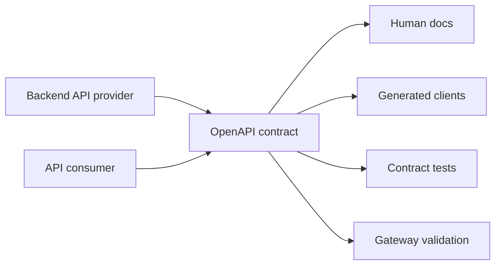
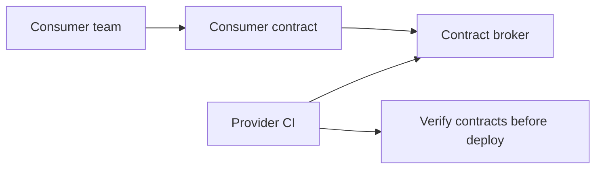

## Prerequisites: Before You Begin

You should already understand:

- HTTP methods, status codes, headers, and JSON.
- DTOs, validation, and error responses.
- Integration testing with Spring Boot.
- Basic CI/CD pipelines.

---

# Phase 1: Ground Floor (Why API Contracts Exist)

An API is a promise between a provider and consumers. The provider is your backend. The consumers may be browsers, mobile apps, partner systems, internal services, batch jobs, or SDKs.



If you deploy a backend change that silently breaks a mobile app already installed on millions of phones, rollback may not fix the damage. API design must assume old clients live longer than backend releases.

## Contract vs Implementation

| Thing | Meaning |
| --- | --- |
| Contract | Public promise: route, method, fields, status codes, errors, auth, examples. |
| Implementation | Java controllers, services, database, and infrastructure behind the promise. |
| Compatibility | Whether old consumers keep working after the provider changes. |
| Versioning | How incompatible changes are introduced without surprise breakage. |

---

# Phase 2: The Naive API Change (The Mobile App Crash)

Naive DTO:

```java
public record UserResponse(
        UUID id,
        String name
) {}
```

Backend change:

```java
public record UserResponse(
        UUID id,
        String displayName
) {}
```

The developer thinks this is a harmless rename. Existing clients reading `name` now break.

Safe change:

```java
public record UserResponse(
        UUID id,
        String name,
        String displayName
) {}
```

Keep `name` until all consumers have migrated. Mark it deprecated in the OpenAPI schema and remove it only under an explicit version policy.

---

# Phase 3: OpenAPI Contract Shape

```yaml
openapi: 3.1.0
info:
  title: Notes API
  version: 1.4.0
paths:
  /api/notes/{id}:
    get:
      operationId: getNote
      security:
        - bearerAuth: []
      parameters:
        - name: id
          in: path
          required: true
          schema:
            type: string
            format: uuid
      responses:
        "200":
          description: Note found
          content:
            application/json:
              schema:
                $ref: "#/components/schemas/NoteResponse"
        "404":
          description: Note not found or not visible to caller
          content:
            application/problem+json:
              schema:
                $ref: "#/components/schemas/ProblemDetail"
components:
  schemas:
    NoteResponse:
      type: object
      required: [id, title, content, updatedAt]
      properties:
        id:
          type: string
          format: uuid
        title:
          type: string
          maxLength: 120
        content:
          type: string
        updatedAt:
          type: string
          format: date-time
    ProblemDetail:
      type: object
      required: [type, title, status]
      properties:
        type:
          type: string
          format: uri
        title:
          type: string
        status:
          type: integer
        detail:
          type: string
```

## Compatibility Rules

| Change | Compatible? | Why |
| --- | --- | --- |
| Add optional response field | Usually yes | Old clients ignore unknown fields if configured safely. |
| Remove response field | No | Existing clients may depend on it. |
| Rename field | No | Equivalent to remove plus add. |
| Add required request field | No | Old clients do not send it. |
| Add optional request field | Yes | Old clients remain valid. |
| Change enum values | Risky | Old clients may not handle new value. |
| Change status code semantics | Risky | Client retry/error handling may break. |
| Tighten validation | Often breaking | Previously accepted requests now fail. |

---

# Phase 4: Versioning Strategies

## URI Versioning

```http
GET /api/v1/orders/123 HTTP/1.1
```

Simple and visible. It can create duplicate routes and pressure teams to version too often.

## Header Versioning

```http
GET /api/orders/123 HTTP/1.1
API-Version: 2026-09-11
```

Cleaner URLs, but less visible and harder to test manually.

## Media Type Versioning

```http
GET /api/orders/123 HTTP/1.1
Accept: application/vnd.backend-mastery.order.v2+json
```

Precise, but heavier for simple teams and debugging.

## Practical Rule

Use additive changes for normal evolution. Use a new major version only when behavior cannot remain backward compatible.

---

# Phase 5: Contract Testing In CI

## Provider Contract Test

```java
@SpringBootTest(webEnvironment = SpringBootTest.WebEnvironment.RANDOM_PORT)
class OpenApiContractTest {

    @Autowired
    TestRestTemplate rest;

    @Test
    void noteResponseMatchesContractShape() {
        ResponseEntity<String> response = rest.getForEntity("/api/notes/{id}", String.class, testNoteId());

        assertThat(response.getStatusCode()).isEqualTo(HttpStatus.OK);
        assertThat(response.getHeaders().getContentType()).isEqualTo(MediaType.APPLICATION_JSON);
        assertThat(response.getBody()).contains("id", "title", "content", "updatedAt");
    }
}
```

## Breaking Change Gate

```yaml
name: API Contract Check

on:
  pull_request:

jobs:
  openapi-diff:
    runs-on: ubuntu-latest
    steps:
      - uses: actions/checkout@v4
      - name: Generate OpenAPI
        run: ./mvnw test
      - name: Compare API contract
        run: |
          docker run --rm \
            -v "$PWD:/work" \
            openapitools/openapi-diff:latest \
            /work/contracts/main.yaml \
            /work/target/openapi.yaml \
            --fail-on-incompatible
```

## Consumer-Driven Contract Thinking

Provider tests prove the API matches its own document. Consumer-driven tests prove the provider still satisfies real consumer expectations.



---

# Phase 6: Senior Interview Ace

| Junior answer | Senior answer |
| --- | --- |
| "We version APIs with `/v1`." | "Versioning is the last resort. Most evolution should be additive and backward compatible." |
| "OpenAPI creates docs." | "OpenAPI is a machine-readable contract used for docs, SDKs, validation, diffing, and CI compatibility gates." |
| "Changing a field name is simple." | "It is a breaking change for consumers. Add the new field, deprecate the old field, then remove under policy." |
| "We test controllers." | "I also test contract compatibility and consumer expectations so provider changes cannot silently break clients." |

## Debug Checklist

- Did a response field disappear or change type?
- Did a request field become required?
- Did enum behavior change?
- Did error shape or status code change?
- Are examples in the OpenAPI spec still valid?
- Are generated clients pinned to compatible versions?
- Does CI compare contract changes before merge?

## Practice Tasks

1. Write an OpenAPI contract for Notes API.
2. Add an optional response field and verify it is compatible.
3. Rename a field and make the diff gate fail.
4. Add ProblemDetail schemas for validation errors.
5. Create a deprecation policy for removing old fields.

## Done Checklist

- [ ] You can explain contract vs implementation.
- [ ] You can classify API changes as breaking or non-breaking.
- [ ] You can write an OpenAPI schema with examples.
- [ ] You can design a versioning strategy.
- [ ] You can add an API compatibility check to CI.
