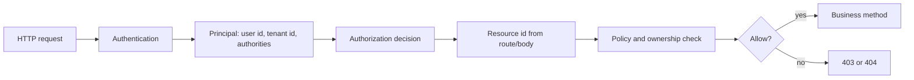
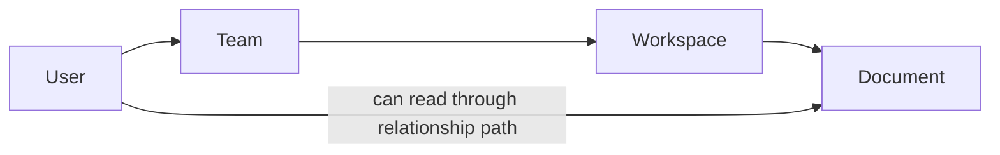

## Prerequisites: Before You Begin

You should already understand:

- Authentication and JWT validation.
- Spring Security filter chains.
- Controller, service, repository, and database boundaries.
- Basic SQL predicates and foreign keys.

---

# Phase 1: Ground Floor (The Real Security Boundary)

Authentication answers: "Who is calling?"

Authorization answers: "What is this caller allowed to do to this exact resource?"



The dangerous part is that the resource ID usually comes from the user:

```http
GET /api/notes/42 HTTP/1.1
Authorization: Bearer eyJ...
```

The server must prove that the authenticated principal can access note `42`. A valid token alone does not prove ownership.

---

# Phase 2: The Naive Code (The Data Leak)

## Catastrophe: IDOR / BOLA

```java
@GetMapping("/notes/{id}")
public NoteResponse read(@PathVariable UUID id) {
    Note note = noteRepository.findById(id)
            .orElseThrow(NotFoundException::new);

    return NoteResponse.from(note);
}
```

The user changes the ID in the URL and reads someone else's note.

Correct owner-scoped query:

```java
@GetMapping("/notes/{id}")
public NoteResponse read(@AuthenticationPrincipal AppUser user,
                         @PathVariable UUID id) {
    Note note = noteRepository.findByIdAndOwnerId(id, user.id())
            .orElseThrow(NotFoundException::new);

    return NoteResponse.from(note);
}
```

Line by line:

- `@AuthenticationPrincipal AppUser user` uses the authenticated identity produced by the security filter chain, not a caller-supplied user ID.
- `@PathVariable UUID id` is untrusted client input. The caller can change it.
- `findByIdAndOwnerId(id, user.id())` binds the requested resource to the authenticated owner in one repository query.
- `orElseThrow(NotFoundException::new)` intentionally hides whether the note exists for somebody else.
- `NoteResponse.from(note)` returns a DTO instead of leaking the entity.

Proof tests:

```console
Alice creates note A.
Alice reads note A -> 200.
Bob reads note A by ID -> 404 or 403 according to policy.
Verify Bob's request does not return note data.
Verify repository method scopes by both id and ownerId.
```

Better service boundary:

```java
@Service
public class NoteService {

    private final NoteRepository notes;

    public NoteService(NoteRepository notes) {
        this.notes = notes;
    }

    @Transactional(readOnly = true)
    public NoteResponse read(UserId caller, NoteId noteId) {
        Note note = notes.findByIdAndOwnerId(noteId.value(), caller.value())
                .orElseThrow(NotFoundException::new);
        return NoteResponse.from(note);
    }
}
```

---

# Phase 3: Authorization Models

## RBAC: Role-Based Access Control

RBAC checks what broad role a principal has.

```java
@PreAuthorize("hasRole('ADMIN')")
public List<UserResponse> listUsers() {
    return users.findAllUsers();
}
```

Good for:

- Admin panels.
- Coarse feature access.
- Internal tools.

Weakness:

- Roles do not answer object ownership.
- `ROLE_USER` does not mean "can read every user's data."

## ABAC: Attribute-Based Access Control

ABAC checks attributes about the user, resource, action, and environment.

```java
@PreAuthorize("""
    hasAuthority('invoice:read') and
    @tenantAccess.canAccessTenant(authentication, #tenantId)
""")
public InvoiceResponse readInvoice(UUID tenantId, UUID invoiceId) {
    return invoices.read(tenantId, invoiceId);
}
```

Useful attributes:

| Attribute type | Examples |
| --- | --- |
| Subject | user ID, role, department, clearance |
| Resource | owner ID, tenant ID, status, sensitivity |
| Action | read, write, approve, export |
| Environment | IP range, time, device trust, region |

## ReBAC: Relationship-Based Access Control

ReBAC checks graph relationships.

Examples:

- User can read a document because they belong to a team that owns the workspace.
- Doctor can access a patient because an active care relationship exists.
- Employee can approve an expense because they are the submitter's manager.



## ACL: Access Control List

An ACL stores permissions per resource.

```sql
CREATE TABLE document_permission (
    document_id uuid NOT NULL,
    principal_type text NOT NULL,
    principal_id uuid NOT NULL,
    permission text NOT NULL,
    PRIMARY KEY (document_id, principal_type, principal_id, permission)
);
```

Good for document sharing and collaboration. Dangerous if every request performs too many graph or ACL lookups without caching and careful indexes.

---

# Phase 4: Production Implementation

## Defense In Depth Layers

| Layer | Example | What it prevents |
| --- | --- | --- |
| URL rules | `/admin/**` requires admin | obvious route exposure |
| Method security | `@PreAuthorize` on service methods | controller bypass |
| Repository scoping | `findByIdAndOwnerId` | IDOR/BOLA |
| Database constraints | tenant foreign keys, RLS | application bug blast radius |
| Audit logs | who accessed what | investigation and compliance |

## Central Authorization Bean

```java
@Component("authz")
public class AuthorizationRules {

    private final ProjectMemberRepository members;

    public AuthorizationRules(ProjectMemberRepository members) {
        this.members = members;
    }

    public boolean canEditProject(Authentication authentication, UUID projectId) {
        AppPrincipal principal = (AppPrincipal) authentication.getPrincipal();
        return members.existsByProjectIdAndUserIdAndRoleIn(
                projectId,
                principal.userId(),
                Set.of(ProjectRole.OWNER, ProjectRole.MAINTAINER)
        );
    }
}
```

```java
@PreAuthorize("@authz.canEditProject(authentication, #projectId)")
public void renameProject(UUID projectId, RenameProjectRequest request) {
    projectService.rename(projectId, request.name());
}
```

## Ownership Test Matrix

```java
@SpringBootTest
class NoteAuthorizationTest {

    @Test
    void ownerCanReadOwnNote() {
        // arrange owner, note, token
        // expect 200
    }

    @Test
    void userCannotReadAnotherUsersNote() {
        // arrange user A note and user B token
        // expect 404 or 403 by product choice
    }

    @Test
    void userCannotUpdateOwnerIdThroughRequestBody() {
        // request body ownerId must be ignored
    }
}
```

## 403 vs 404

| Response | Use when |
| --- | --- |
| `403 Forbidden` | Caller knows the resource exists but lacks permission. |
| `404 Not Found` | Hiding existence reduces enumeration risk. |

Be consistent. Document the product choice.

---

# Phase 5: Senior Interview Ace

| Junior answer | Senior answer |
| --- | --- |
| "We use roles." | "Roles are only coarse grants. Object-level authorization still needs ownership, tenant, relationship, or ACL checks." |
| "JWT has user ID." | "The token identifies the caller. It does not prove the caller can access the route resource ID." |
| "Controller checks admin." | "Authorization belongs at service boundaries too, because controllers are not the only callers." |
| "Return 403." | "For private resources, 404 can prevent existence leaks; for known admin resources, 403 is clearer." |

## Debug Checklist

- Does every endpoint using `{id}` prove access to that exact object?
- Does search/list include tenant or owner predicates?
- Can request body fields override authenticated principal data?
- Are unannotated service methods exposed?
- Are authorization checks tested with two different users?
- Are batch/export endpoints protected by the same rules?
- Are field-level permissions needed for sensitive properties?

## Practice Tasks

1. Add a broken `findById(id)` endpoint and exploit it with another user's ID.
2. Replace it with `findByIdAndOwnerId`.
3. Add `@PreAuthorize` for project maintainers.
4. Add tests for owner, non-owner, admin, and disabled user.
5. Add audit logging for sensitive reads.

## Done Checklist

- [ ] You can explain RBAC, ABAC, ReBAC, and ACLs.
- [ ] You can prevent IDOR/BOLA with owner-scoped queries.
- [ ] You can choose 403 vs 404 intentionally.
- [ ] You can write method-security tests.
- [ ] You can explain why authentication is not authorization.
