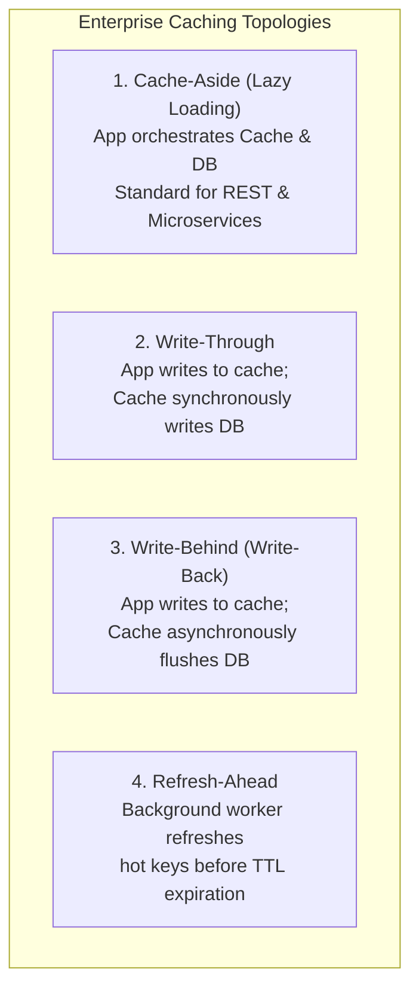
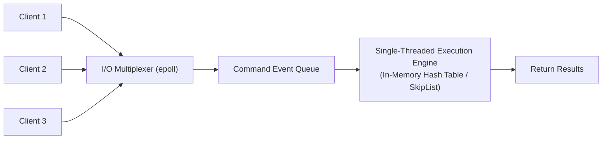
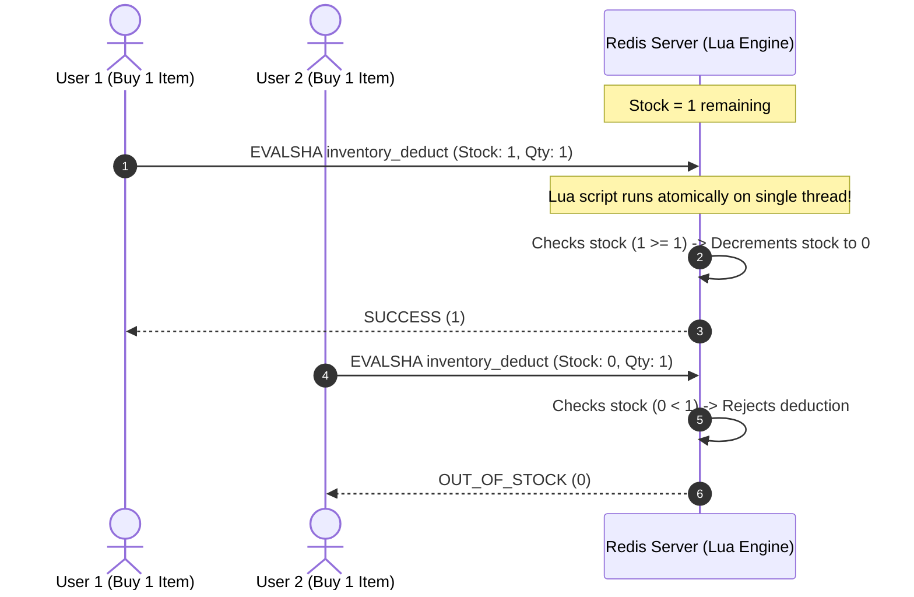
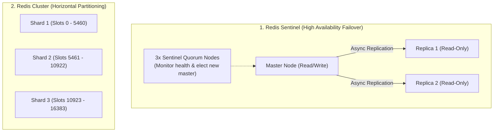
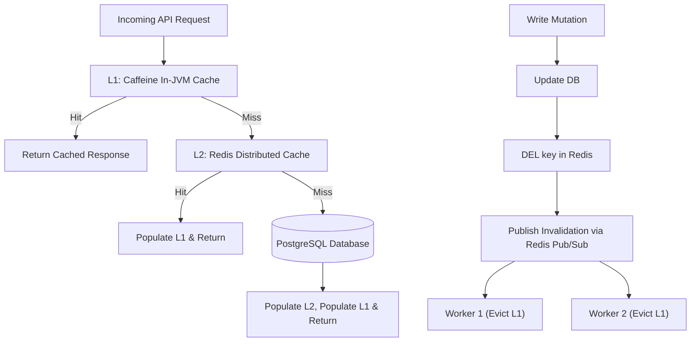
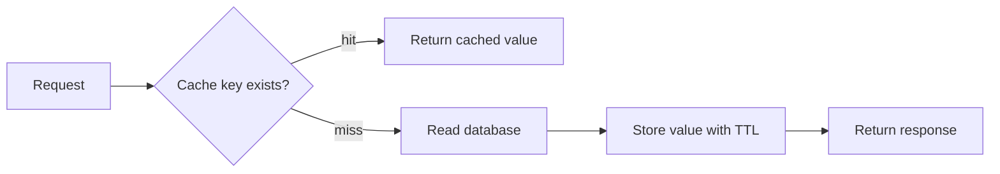

# Distributed Caching & Redis Mastery

> "There are only two hard things in Computer Science: cache invalidation and naming things." — *Phil Karlton*

Caching stores precomputed calculations and frequent database reads in ultra-fast in-memory storage (Redis) to deliver sub-millisecond API response times. 

However, implementing caching without a rigorous invalidation strategy creates critical production bugs: **stale customer data, silent memory leaks, and cascading database crashes during cache stampedes**.

---

## 1. The Four Caching Topologies & Write Strategies

How and when your backend reads and writes to the cache governs system consistency, read latency, and write throughput:



### Architectural Comparison Matrix

| Pattern | Read Path | Write Path | Strengths | Trade-offs |
| :--- | :--- | :--- | :--- | :--- |
| **Cache-Aside** (Default) | Read Cache $\rightarrow$ On miss, read DB $\rightarrow$ Populate Cache | Write DB $\rightarrow$ Evict Cache (`DEL key`) | Only requested data is cached; cache downtime does not take down the app | Cache miss incurs 3 network hops; momentary eventual consistency window |
| **Write-Through** | Read Cache $\rightarrow$ On miss, read DB | Write Cache $\rightarrow$ Cache synchronously writes DB | Can keep writes and cache updates aligned when all writes use the same path | High write latency (waits for both cache and DB writes) |
| **Write-Behind** | Read Cache | Write Cache $\rightarrow$ Async worker batch flushes to DB | Maximum write throughput (absorbs massive write spikes) | Cache node crash before flush causes **permanent data loss** |
| **Refresh-Ahead** | Read Cache | Background scheduled job refreshes hot keys before TTL | Near-zero read latency; eliminates cache misses on hot data | Miscalculating access frequency wastes RAM on cold keys |

### Cache-aside writes: invalidate after commit, then handle races
When mutating data in a Cache-Aside architecture, developers often make the mistake of updating the cache value directly:

```mermaid
sequenceDiagram
    autonumber
    actor T1 as Thread 1 (Update to B)
    actor T2 as Thread 2 (Update to C)
    participant DB as PostgreSQL Database
    participant Cache as Redis Cache

    T1->>DB: 1. UPDATE products SET price = 200 (B)
    T2->>DB: 2. UPDATE products SET price = 300 (C)
    Note over T1,Cache: Network delay / thread scheduling stall
    T2->>Cache: 3. SET product:42 price = 300 (C)
    T1->>Cache: 4. SET product:42 price = 200 (B)
    Note over DB,Cache: DB holds 300; cache holds 200 until expiry or repair
```

For cache-aside, deleting the entry **after the database commits** avoids this delayed-writer `SET` race. It does not make the cache strongly consistent. Consider this different sequence:

1. Reader A misses the cache and reads the old database value.
2. Writer B commits a new value and deletes the cache key.
3. Reader A resumes and caches the old value after the deletion.

The key is stale again. The process can also crash between commit and deletion. A cache-loader lock alone does not coordinate writers. Define acceptable staleness, set a TTL, and use durable invalidation events where needed. TTL limits entry age, not time since the database write, if a delayed reader refills it. Version checks require a design that rejects older refills as well as older writes.

Treat the database as the authority for inventory reservation, authorization, and other invariants. Caching a product display is different from deciding whether a purchase is allowed. See [cache-aside consistency limits](https://learn.microsoft.com/en-us/azure/architecture/patterns/cache-aside).

---

## 2. Redis Internals: The Event Loop & Data Structures

Redis is renowned for delivering 100,000+ operations per second per CPU core. Understanding its internal architecture explains why it is immune to race conditions within a single command.

### 2.1 The Single-Threaded Event Loop
Redis executes all core commands sequentially on a **single thread** using non-blocking I/O multiplexing (`epoll` on Linux, `kqueue` on macOS):



Because command execution is single-threaded:
- Redis commands (`INCR`, `HSET`, `LPUSH`, `ZADD`) are **inherently atomic**.
- You never need distributed mutex locks to increment a counter or push to a list.
- **Danger**: Running long-running $O(N)$ commands (like `KEYS *`, `HGETALL` on a 100,000-field hash, or complex `FLUSHALL`) freezes the entire Redis server, blocking all other client requests!

### 2.2 Redis In-Memory Data Structures

| Redis Type | Underlying C Data Structure | Ideal Backend Use Case | Time Complexity |
| :--- | :--- | :--- | :--- |
| **String** | SDS (Simple Dynamic String) | JSON payloads, binary blobs, atomic distributed counters | $O(1)$ |
| **Hash** | Dict (Hash Table) / Listpack | User profiles, product entities (saves up to 60% RAM vs JSON) | $O(1)$ per field |
| **List** | Quicklist (Doubly linked list of zip lists) | Activity feeds, background job message queues (`BLPOP`) | $O(1)$ push/pop |
| **Set** | Intset / Dict | Unique tags, follower IDs, mutual friend intersections (`SINTER`) | $O(1)$ add/check |
| **Sorted Set (ZSET)** | SkipList + Hash Table | Real-time leaderboards, sliding window rate limiters | $O(\log N)$ |
| **HyperLogLog** | Probabilistic Cardinality Register | Counting unique daily active users (1M items in only 12 KB RAM!) | $O(1)$ (0.81% error) |

---

## 3. The Three Classic Cache Disasters & Production Defenses

### 3.1 Cache Stampede (Thundering Herd)
When an ultra-popular hot key (e.g., flash sale item or homepage banner with 20,000 requests/sec) expires, all incoming threads simultaneously experience a cache miss. Thousands of concurrent database queries overwhelm PostgreSQL, causing connection pool exhaustion and CPU saturation.

#### Mitigation: Single-Flight Distributed Mutex (Redisson)
Ensure that **only one thread** queries the database and repopulates Redis, while all other concurrent requests wait and read the repopulated cache:

```java
package com.example.cache;

import org.redisson.api.RLock;
import org.redisson.api.RedissonClient;
import org.springframework.data.redis.core.StringRedisTemplate;
import org.springframework.stereotype.Service;

import java.time.Duration;
import java.util.concurrent.TimeUnit;

@Service
public class ProductCacheService {

    private final StringRedisTemplate redisTemplate;
    private final RedissonClient redissonClient;
    private final ProductDatabaseRepository productRepository;

    public ProductCacheService(StringRedisTemplate redisTemplate, RedissonClient redissonClient, ProductDatabaseRepository productRepository) {
        this.redisTemplate = redisTemplate;
        this.redissonClient = redissonClient;
        this.productRepository = productRepository;
    }

    public String getProductJson(Long productId) {
        String cacheKey = "product:v1:" + productId;
        
        // 1. Fast Path: Cache Hit
        String cachedJson = redisTemplate.opsForValue().get(cacheKey);
        if (cachedJson != null) {
            return cachedJson;
        }

        // 2. Slow Path: Prevent Stampede via Distributed Mutex
        RLock lock = redissonClient.getLock("lock:" + cacheKey);
        try {
            // Wait up to 3 seconds for lock; lease lock for max 5 seconds
            if (lock.tryLock(3, 5, TimeUnit.SECONDS)) {
                try {
                    // Double-check cache in case previous lock holder populated it
                    cachedJson = redisTemplate.opsForValue().get(cacheKey);
                    if (cachedJson != null) {
                        return cachedJson;
                    }

                    // 3. Single thread queries the database
                    String dbJson = productRepository.findProductAsJson(productId);
                    if (dbJson == null) {
                        // Negative caching against penetration attacks
                        redisTemplate.opsForValue().set(cacheKey, "", Duration.ofSeconds(30));
                        return null;
                    }

                    // 4. Cache with jitter (10 mins + random 0-60s)
                    redisTemplate.opsForValue().set(cacheKey, dbJson, Duration.ofSeconds(600 + (long)(Math.random() * 60)));
                    return dbJson;
                } finally {
                    lock.unlock();
                }
            }
        } catch (InterruptedException e) {
            Thread.currentThread().interrupt();
        }

        // Fallback: If lock acquisition times out, read directly from DB as safety valve
        return productRepository.findProductAsJson(productId);
    }
}
```

### 3.2 Cache Penetration
An attacker maliciously requests millions of non-existent entity IDs (`GET /users/-99999` or random UUIDs). Because these records do not exist in the database, the cache never stores them, forcing every malicious request to hit PostgreSQL directly.

#### Mitigations:
1. **Bloom Filter**: A space-efficient probabilistic data structure placed in front of Redis. If the Bloom filter says the key does not exist, reject the request immediately without querying Redis or PostgreSQL.
2. **Negative Caching (Null Sentinel)**: Cache the absence of data with a short TTL (30 seconds):
   ```java
   if (entity == null) {
       redisTemplate.opsForValue().set(cacheKey, "__NULL__", Duration.ofSeconds(30));
   }
   ```

### 3.3 Cache Avalanche
If a batch job warms the cache with 500,000 catalog items at midnight with an exact 2-hour TTL (`TTL = 7200`), all 500,000 keys expire at the exact same millisecond (02:00:00). The subsequent traffic wave slams the database, knocking it offline.

#### Mitigation: TTL Jitter
Always add randomized jitter to cache expiration:

$$\text{Final TTL} = \text{Base TTL} + \text{Random}(0, \text{Jitter Window})$$

```java
Duration baseTtl = Duration.ofHours(2);
long jitterSeconds = ThreadLocalRandom.current().nextLong(0, 300); // 0 to 5 mins jitter
redisTemplate.opsForValue().set(cacheKey, payload, baseTtl.plusSeconds(jitterSeconds));
```

---

## 4. Atomic Operations with Redis Lua Scripts

When an operation requires reading a key, making a decision, and writing a new value, individual Redis commands suffer from race conditions.

**Lua Scripts execute atomically in the Redis event loop**. No other command or script can run while a Lua script is executing:



### Production Spring Boot Lua Script Execution

```java
package com.example.cache;

import org.springframework.core.io.ClassPathResource;
import org.springframework.data.redis.core.StringRedisTemplate;
import org.springframework.data.redis.core.script.DefaultRedisScript;
import org.springframework.scripting.support.ResourceScriptSource;
import org.springframework.stereotype.Service;

import java.util.Collections;

@Service
public class AtomicInventoryService {

    private final StringRedisTemplate redisTemplate;
    private final DefaultRedisScript<Long> inventoryScript;

    public AtomicInventoryService(StringRedisTemplate redisTemplate) {
        this.redisTemplate = redisTemplate;
        this.inventoryScript = new DefaultRedisScript<>();
        this.inventoryScript.setScriptSource(
            new ResourceScriptSource(new ClassPathResource("scripts/deduct_stock.lua"))
        );
        this.inventoryScript.setResultType(Long.class);
    }

    public boolean deductStock(String itemKey, int quantity) {
        // Returns 1 if deduction succeeded, 0 if insufficient stock
        Long result = redisTemplate.execute(
            inventoryScript,
            Collections.singletonList(itemKey),
            String.valueOf(quantity)
        );
        return result != null && result == 1L;
    }
}
```

#### `deduct_stock.lua` Script
```lua
-- KEYS[1]: Item stock key (e.g. 'inventory:item:42')
-- ARGV[1]: Quantity to deduct (e.g. '1')

local current_stock = tonumber(redis.call('GET', KEYS[1]))

if not current_stock or current_stock < tonumber(ARGV[1]) then
    return 0 -- Insufficient inventory
else
    redis.call('DECRBY', KEYS[1], ARGV[1])
    return 1 -- Successfully deducted atomically
end
```

---

## 5. Redis High Availability: Sentinel vs Cluster



### 5.1 Redis Sentinel (Active-Passive Failover)
- A single master accepts writes and replicates asynchronously to one or more read replicas.
- A cluster of at least 3 Sentinel processes monitors the master. If the master drops offline, sentinels vote to promote a replica to master automatically.
- **Limitation**: All writes are constrained to a single server's memory and CPU capacity.

### 5.2 Redis Cluster (Horizontal Sharding)
- Shards dataset automatically across multiple master nodes using **16,384 Hash Slots**:

$$\text{Slot} = \text{CRC16}(\text{key}) \pmod{16384}$$

- **Hash Tags `{...}` for Multi-Key Operations**:
  If an operation requires updating multiple keys in a single transaction (or Lua script), all keys must map to the **exact same hash slot**. Enforce this using curly braces:
  ```redis
  user:{104}:profile  -> CRC16('104') % 16384 -> Slot 8192
  user:{104}:orders   -> CRC16('104') % 16384 -> Slot 8192
  ```

---

## 6. Two-Tier Caching (L1 Caffeine + L2 Redis)

For extreme high-throughput architectures (e.g., 500,000 requests/sec), querying Redis over the network incurs 0.5 to 1.5 milliseconds of network latency and socket serialization overhead.

A **Two-Tier Cache** combines in-process memory (L1) with distributed memory (L2):
- **L1 Cache (Caffeine)**: Stored in JVM heap, with no network hop. Measure actual lookup and serialization costs.
- **L2 Cache (Redis)**: Shared across application instances. Latency depends on network placement, command cost, and load.



Redis Pub/Sub is **at-most-once**: a disconnected instance misses invalidations. Use short L1 TTLs and clear or reconcile local entries after reconnect. Durable delivery needs a retained event stream and per-instance replay or another reconciliation design. A single competing-consumer group does not broadcast every invalidation to every cache instance. See [Redis Pub/Sub delivery semantics](https://redis.io/docs/latest/develop/pubsub/).

A useful failure test pauses a reader after its database read, commits a writer and its eviction, then releases the reader. Assert that your chosen version or TTL policy handles the resulting stale refill. Also disconnect one L1 subscriber during an update and verify it recovers without relying on a missed message.

---

## Caching Fundamentals Interview Map

Caching is not "make it faster." Caching is controlled duplication of data, with explicit staleness risk.

### 1. What should you cache?

Good cache candidates:

- Expensive reads.
- Frequently repeated data.
- Data that can tolerate short staleness.
- Derived read models.
- Public catalog/detail pages.

Bad cache candidates:

- Authorization decisions without strict invalidation.
- Account balances that require exact freshness.
- Inventory reservation decisions.
- One-off low-frequency rows.
- Data with unclear ownership or tenant scope.

### 2. Cache hit, miss, and hit ratio



Hit ratio:

$$\text{Hit Ratio} = \frac{\text{Cache Hits}}{\text{Cache Hits} + \text{Cache Misses}}$$

A high hit ratio is not automatically good. A cache can serve stale or unauthorized data very quickly.

### 3. Key design matters

Bad:

```console
product:42
```

Better:

```console
tenant:acme:product:v3:42:currency:USD
```

Include all dimensions that change the response: tenant, locale, role if relevant, version, feature flags, currency, and query parameters.

### 4. TTL is a correctness decision

TTL is not only a memory setting. It defines how long the system may serve an old value if invalidation fails.

Short TTL:

- More database load.
- Lower staleness window.

Long TTL:

- Better hit ratio.
- Higher stale-data risk.

### Build-Break-Fix Lab

<Steps>
  <Step title="Build">
    Cache product detail responses with tenant-aware keys and TTL jitter.
  </Step>
  <Step title="Break">
    Omit tenant from the key and update the product while one reader is delayed.
  </Step>
  <Step title="Observe">
    Watch cross-tenant data leakage or stale refill after invalidation.
  </Step>
  <Step title="Fix">
    Include all response dimensions in the key, delete after commit, and add version or short TTL protection.
  </Step>
  <Step title="Prove">
    Write tests for cache hit, miss, stale refill, tenant isolation, and Redis outage fallback.
  </Step>
</Steps>

---

## 7. Active Recall Interview Mastery

<AccordionGroup>
  <Accordion title="1. Why is Redis single-threaded for command execution? How does it handle 100k+ QPS?">
    Redis avoids the high overhead of multi-threaded programming: thread context switches, CPU cache invalidation, and lock contention (mutex/spinlocks). 
    
    Because its dataset resides completely in RAM, memory lookups are nanosecond-fast. CPU processing is almost never the bottleneck—network I/O is. Redis uses non-blocking I/O multiplexing (`epoll`) to handle thousands of concurrent client sockets on a single thread. In Redis 6+, multithreading was added strictly for reading and writing network socket buffers, while core state mutations remain single-threaded.
  </Accordion>

  <Accordion title="2. Why should you delete (evict) a cache key on database update instead of updating the cached value?">
    Updating the cache on write creates severe race conditions when multiple concurrent writes occur. 
    
    If Thread 1 updates the database to $V_1$ and Thread 2 updates the database to $V_2$, network jitter can cause Thread 2's cache write to land before Thread 1's cache write. The cache ends up storing $V_1$ while the database holds $V_2$, leaving stale data until expiration or repair. Deletion after commit removes that write/write race, but a delayed reader can still refill an old value. Add an explicit staleness policy and test the read/write race.
  </Accordion>

  <Accordion title="3. What is the difference between Cache Stampede, Cache Penetration, and Cache Avalanche?">
    - **Cache Stampede (Thundering Herd)**: A single hot key expires, and thousands of concurrent requests simultaneously miss the cache and overwhelm the database. Mitigation: Distributed mutex locking (Redisson).
    - **Cache Penetration**: An attacker queries non-existent keys, causing all requests to bypass the cache and hit the database. Mitigation: Bloom Filters or caching null sentinels.
    - **Cache Avalanche**: Many keys expire at the exact same moment (e.g. fixed 1-hour TTLs set during a midnight batch job), causing a spike of simultaneous database queries. Mitigation: TTL Jitter.
  </Accordion>

  <Accordion title="4. How does Redis Cluster partition data, and what are hash tags used for?">
    Redis Cluster divides the key space into **16,384 logical Hash Slots**. Every key is assigned to a slot using the formula:
    $$\text{Slot} = \text{CRC16}(\text{key}) \pmod{16384}$$
    
    Multi-key commands (transactions or Lua scripts) fail in Redis Cluster if the keys reside on different shards. **Hash Tags** (`{...}`) force multiple keys to hash only the substring inside the braces. For example, `{user:10}:profile` and `{user:10}:orders` both hash the string `"user:10"`, guaranteeing they land on the exact same shard and slot.
  </Accordion>

  <Accordion title="5. How do Lua scripts ensure atomicity in Redis?">
    Redis executes Lua scripts as a single atomic unit directly inside its single-threaded event loop. While a Lua script is running, Redis pauses execution of all other incoming client commands until the script completes. This prevents interleaving, race conditions, and phantom reads without requiring complex distributed locking protocols.
  </Accordion>
</AccordionGroup>

---

## 8. Done Checklist

<Check>
Cache-Aside pattern strictly deletes (`DEL`) cache keys on database updates rather than attempting to update them in place.
</Check>
<Check>
Hot keys protect against Cache Stampedes using Redisson distributed mutex locks.
</Check>
<Check>
Cache penetration attacks are neutralized using Bloom filters or negative caching with short TTL sentinels.
</Check>
<Check>
All cache expirations apply randomized TTL jitter to prevent synchronized cache avalanches.
</Check>
<Check>
Compound check-and-set operations use atomic Redis Lua scripts to eliminate concurrency race conditions.
</Check>
<Check>
Redis Cluster multi-key operations utilize hash tags (`{...}`) to ensure slot co-location.
</Check>
