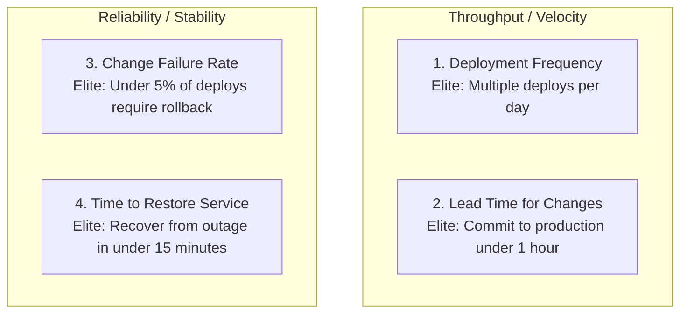
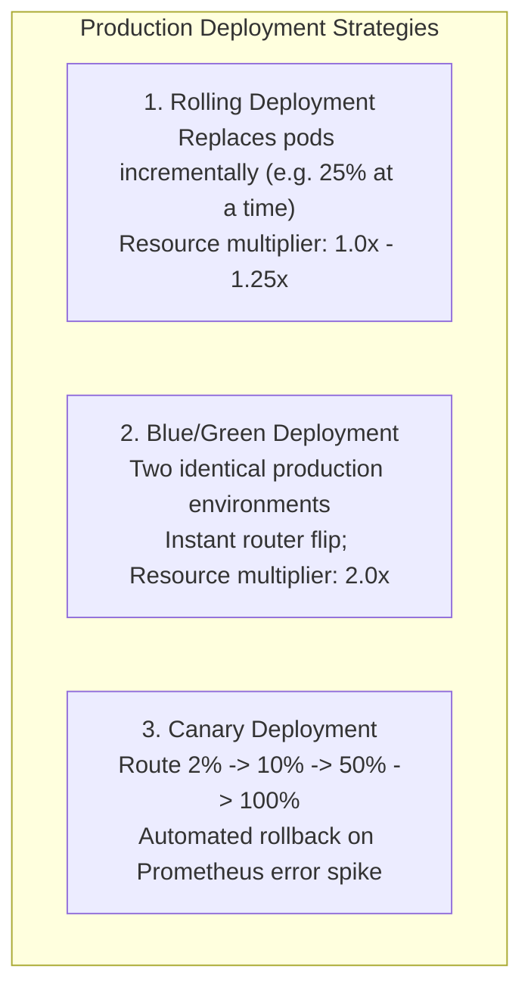
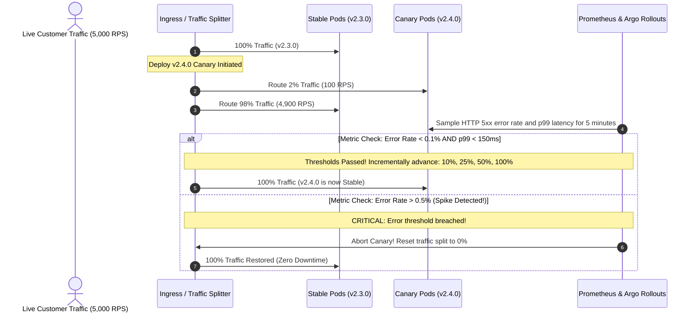
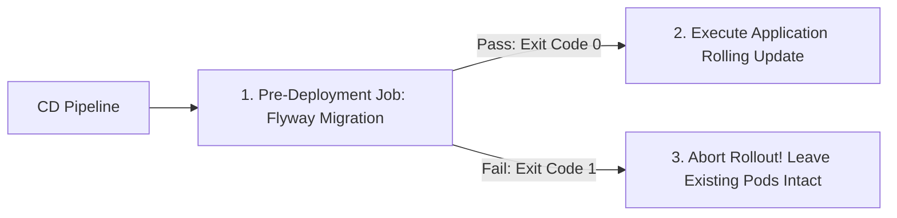

# Zero-Downtime Deployment & CI/CD Pipelines

Continuous Integration (CI) and Continuous Deployment (CD) automate the journey of backend code from a pull request merge to a running production Kubernetes cluster.

In high-reliability engineering, deployments are **routine, non-event operations conducted in the middle of the workday**. Mature engineering organizations deploy 50+ times per day using automated Testcontainers verification, Trivy container security scans, pre-deployment Flyway migration jobs, and automated Canary rollbacks upon metric degradation.

---

## 1. DORA Metrics: Measuring Engineering Velocity & Stability

The DevOps Research and Assessment (DORA) framework evaluates backend delivery performance using four core metrics:



| Metric | Low Performer | Medium Performer | Elite Performer |
| :--- | :--- | :--- | :--- |
| **Deployment Frequency** | Monthly or quarterly | Every 1 to 4 weeks | **Multiple deploys per day** |
| **Lead Time for Changes** | 1 to 6 months | 1 week to 1 month | **Under 1 hour** |
| **Time to Restore Service** | Over 1 day | Under 1 day | **Under 15 minutes** |
| **Change Failure Rate** | 46% to 60% | 16% to 30% | **0% to 5%** |

---

## 2. The Three Deployment Strategies Compared

Choosing a deployment topology dictates infrastructure costs, rollback speed, and customer blast radius:



### Architectural Comparison Matrix

| Dimension | Rolling Deployment | Blue/Green Deployment | Canary Deployment |
| :--- | :--- | :--- | :--- |
| **Downtime** | Zero | Zero | Zero |
| **Rollback Speed** | Minutes (Reverse rollout) | **Instantaneous** (Revert router to Blue) | Fast (Revert router traffic split to 0%) |
| **Infrastructure Cost** | Baseline (1.0x to 1.25x) | **High** (Requires 2.0x capacity during deploy) | Baseline (1.0x to 1.1x) |
| **Database Compatibility** | Strict: Schema must support both old and new code | Strict: Old and new fleets share the database | Strict: Old and new code run concurrently |
| **Blast Radius** | Medium (All users gradually hit new version) | High (100% of users immediately exposed on flip) | **Minimal** (Only 2% of traffic exposed initially) |
| **Tooling Standard** | Built-in Kubernetes Deployments | Ingress / Service selector switch | Argo Rollouts / Flagger with Istio/Envoy |

---

## 3. Canary Deployments & Automated Prometheus Rollback

A Canary rollout exposes a tiny slice of live customer traffic to the new version while monitoring telemetry. If error rates or latency spike, traffic automatically reverts to the stable version before users notice an outage.



### Argo Rollouts AnalysisTemplate (Prometheus Metric Gate)

```yaml
apiVersion: argoproj.io/v1alpha1
kind: AnalysisTemplate
metadata:
  name: success-rate-check
spec:
  metrics:
  - name: success-rate
    interval: 30s
    successCondition: result[0] >= 0.995 # 99.5% success rate required
    failureLimit: 2 # Abort rollout after 2 consecutive failures
    provider:
      prometheus:
        address: http://prometheus-server.monitoring:9090
        query: |
          sum(rate(http_requests_total{status=~"2..",app="notes-api"}[1m])) 
          / 
          sum(rate(http_requests_total{app="notes-api"}[1m]))
```

---

## 4. Production GitHub Actions CI/CD Pipeline

Here is a complete, enterprise GitHub Actions workflow (`.github/workflows/deploy.yml`) with automated testing via Testcontainers, caching, Trivy security scanning, and container registry publishing:

```yaml
name: Production CI/CD Pipeline

on:
  push:
    branches: [ main ]
  pull_request:
    branches: [ main ]

env:
  REGISTRY: ghcr.io
  IMAGE_NAME: ${{ github.repository }}

jobs:
  test-and-verify:
    name: Build, Test & Security Gate
    runs-on: ubuntu-latest

    steps:
      - name: Checkout Source Code
        uses: actions/checkout@v4

      - name: Setup Java 21 (Eclipse Temurin)
        uses: actions/setup-java@v4
        with:
          java-version: '21'
          distribution: 'temurin'
          cache: 'maven'

      # Run unit and Testcontainers integration tests
      - name: Execute Test Suite with Testcontainers
        run: ./mvnw verify -B
        env:
          TESTCONTAINERS_REUSE_ENABLE: true

      - name: Set up Docker Buildx
        uses: docker/setup-buildx-action@v3

      - name: Build Candidate Image for Security Scanning
        uses: docker/build-push-action@v5
        with:
          context: .
          load: true
          tags: ${{ env.IMAGE_NAME }}:candidate
          cache-from: type=gha
          cache-to: type=gha,mode=max

      # Security Gate: Break build if CRITICAL or HIGH vulnerabilities exist
      - name: Security Vulnerability Scan with Trivy
        uses: aquasecurity/trivy-action@master
        with:
          image-ref: ${{ env.IMAGE_NAME }}:candidate
          format: 'table'
          exit-code: '1' # Fails the pipeline if vulnerabilities are detected
          ignore-unfixed: true
          severity: 'CRITICAL,HIGH'

      - name: Log in to GitHub Container Registry (GHCR)
        if: github.ref == 'refs/heads/main'
        uses: docker/login-action@v3
        with:
          registry: ${{ env.REGISTRY }}
          username: ${{ github.actor }}
          password: ${{ secrets.GITHUB_TOKEN }}

      - name: Publish Immutable Image to Registry
        if: github.ref == 'refs/heads/main'
        uses: docker/build-push-action@v5
        with:
          context: .
          push: true
          tags: |
            ${{ env.REGISTRY }}/${{ env.IMAGE_NAME }}:${{ github.sha }}
            ${{ env.REGISTRY }}/${{ env.IMAGE_NAME }}:latest
          cache-from: type=gha
          cache-to: type=gha,mode=max
```

---

## 5. Pre-Deployment Database Migration Safety Gates

Running Flyway database migrations inside application startup code (`@PostConstruct` or Spring Boot auto-run) in a multi-pod cluster is a dangerous anti-pattern:
- If 10 container pods start simultaneously, all 10 attempt to acquire migration locks at the same moment.
- If a migration contains a syntax error, pods fail to start, triggering Kubernetes crash loops.

### The Production Solution: Dedicated Kubernetes Migration Job

Run Flyway as an isolated pre-deployment Kubernetes `Job`. The deployment rollout pauses until the migration job exits successfully (`Completed`):



```yaml
apiVersion: batch/v1
kind: Job
metadata:
  name: flyway-migration-v2-4-0
spec:
  backoffLimit: 1 # Do not endlessly retry a failed migration script
  template:
    spec:
      restartPolicy: Never
      containers:
        - name: flyway
          image: flyway/flyway:10-alpine
          args: ["migrate"]
          env:
            - name: FLYWAY_URL
              valueFrom:
                secretKeyRef:
                  name: production-db-secrets
                  key: jdbc-url
            - name: FLYWAY_USER
              valueFrom:
                secretKeyRef:
                  name: production-db-secrets
                  key: username
            - name: FLYWAY_PASSWORD
              valueFrom:
                secretKeyRef:
                  name: production-db-secrets
                  key: password
```

---

## 6. GitOps with ArgoCD: Declarative Continuous Delivery

In modern cloud engineering, pipelines do not execute `kubectl apply` directly from GitHub Actions. Pushing directly from CI gives runner agents broad administrative cluster access.

Instead, production teams use **GitOps** powered by **ArgoCD**:

```mermaid
flowchart LR
    Dev["Developer"] -->|git push| GitApp["App Repo (Code + Dockerfile)"]
    GitApp -->|CI Build & Test| GHCR["Container Registry (ghcr.io)"]
    CI["GitHub Actions"] -->|Update Image Tag| GitConfig["Config Repo (Helm / Kustomize)"]
    
    subgraph K8sCluster["Kubernetes Production Cluster"]
        Argo["ArgoCD Controller\n(Watches Config Repo)"] -->|Reconcile State| LiveCluster["Live Pods & Services"]
        Argo -->|Pulls Image| GHCR
    end
    
    GitConfig -.->|Git Pull Loop (every 3 mins)| Argo
```

### GitOps Core Principles
1. **The Entire System is Described Declaratively**: Kubernetes manifests, Helm values, and Ingress routing rules live in Git.
2. **The Desired State is Versioned**: Git history is the single source of truth for what is currently deployed.
3. **Automated Reconciliation**: ArgoCD continuously compares the live cluster state against Git. If a developer manually edits a pod via CLI (drift), ArgoCD automatically reverts the cluster to match Git.
4. **Instant Rollback**: Rolling back production requires only running `git revert <commit_sha>` on the configuration repository!

---

## 7. Active Recall Interview Mastery

<AccordionGroup>
  <Accordion title="1. What is the difference between a Blue/Green deployment and a Canary deployment?">
    - **Blue/Green Deployment**: Two identical production environments exist side-by-side. The router points 100% of traffic to Blue. The new release is deployed to Green and tested. Once verified, the router flips 100% of traffic to Green instantly. Advantage: Instantaneous rollback. Disadvantage: Requires 2.0x infrastructure capacity, and all users are exposed to bugs simultaneously.
    - **Canary Deployment**: A small subset of users (e.g. 2%) is routed to the new version while 98% continue using the stable version. Automated monitoring (Prometheus) tracks error rates and latency. If metrics remain healthy, traffic incrementally shifts (10%, 25%, 50%, 100%). Advantage: Minimal customer blast radius; lower infrastructure cost.
  </Accordion>

  <Accordion title="2. Why should database migrations run in a pre-deployment Kubernetes Job instead of Spring Boot startup?">
    Running migrations inside Spring Boot startup means every starting pod attempts to execute migrations simultaneously. In a cluster of 10 or 20 pods, this creates intense lock contention on the `flyway_schema_history` table and risks table deadlocks. 
    
    Furthermore, if a migration fails, the pod crashes after holding startup resources. Running Flyway as an isolated pre-deployment Kubernetes Job guarantees that migrations execute exactly once, sequentially, before any new application pods boot. If the migration fails, the pipeline aborts before the application deployment begins.
  </Accordion>

  <Accordion title="3. What are DORA metrics, and why are they important?">
    DORA metrics are four industry-standard indicators of software delivery performance:
    1. **Deployment Frequency (DF)**: How often code is deployed to production.
    2. **Lead Time for Changes (LTTC)**: Time from code commit to running in production.
    3. **Change Failure Rate (CFR)**: Percentage of deployments requiring rollback or hotfixes.
    4. **Time to Restore Service (TTRS)**: Time required to recover from a production outage.
    
    They prove that high delivery speed and high stability are not mutually exclusive; elite teams achieve both through automated testing, small batch sizes, and automated Canary rollbacks.
  </Accordion>

  <Accordion title="4. How does GitOps with ArgoCD improve deployment security compared to CI direct push?">
    In a traditional CI push model, the CI runner (e.g. GitHub Actions) must possess long-lived cluster administrative credentials (`kubeconfig` with cluster-admin rights) to run `kubectl apply`. If a malicious PR or compromised runner action leaks these credentials, the entire Kubernetes cluster is compromised.
    
    In GitOps, the CI pipeline only has permission to commit a new image tag to a Git repository. ArgoCD runs *inside* the cluster and pulls configuration changes securely. The cluster firewall never needs to allow inbound connections from external CI runners.
  </Accordion>

  <Accordion title="5. Why should container images be tagged with Git commit SHAs rather than :latest?">
    The `:latest` tag is mutable and non-deterministic. If three pods restart at different times, they may pull different underlying image layers depending on what was pushed to the registry, causing a single deployment to run conflicting code versions simultaneously. 
    
    Tagging with immutable Git commit SHAs (e.g. `ghcr.io/org/app:a7f3b8c`) guarantees 100% reproducibility: you know the exact source code commit running in every pod, enabling straightforward auditing and deterministic rollbacks.
  </Accordion>
</AccordionGroup>

---

## 8. Done Checklist

<Check>
All pull requests run full Testcontainers integration tests before merge approval.
</Check>
<Check>
Container images are scanned for critical and high CVE vulnerabilities using Trivy before publishing.
</Check>
<Check>
Container images are tagged with immutable Git commit SHAs, never relying on `:latest`.
</Check>
<Check>
Database migrations execute via isolated pre-deployment Kubernetes Jobs rather than within application startup code.
</Check>
<Check>
Canary deployments monitor Prometheus error rates and latency gates to automatically abort bad releases.
</Check>
<Check>
Continuous Delivery is managed declaratively via GitOps and ArgoCD reconciliation.
</Check>
