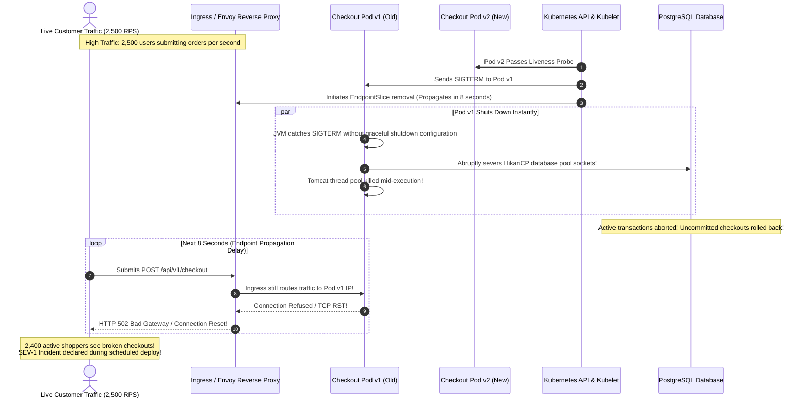
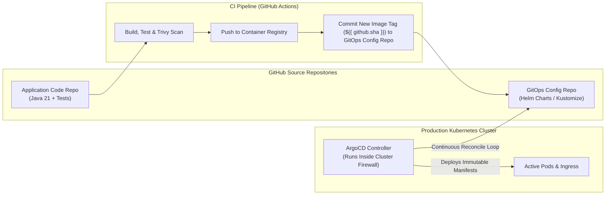
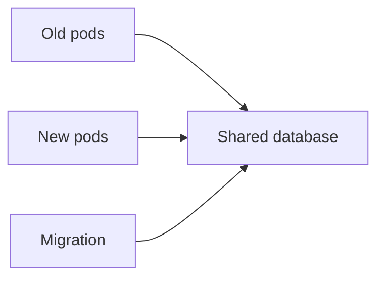

# Zero-Downtime Deployment & CI/CD Pipelines

Continuous Integration (CI) and Continuous Deployment (CD) automate the journey of backend code from a pull request merge to a running production Kubernetes cluster.

In high-reliability engineering, deployments are **routine, non-event operations conducted in the middle of the workday**. Elite engineering organizations deploy 50+ times per day without dropping a single active customer HTTP request.

Achieving this requires mastering **operating system process lifecycles, TCP socket draining, Kubernetes endpoint propagation delays, automated Canary metric gates, and GitOps synchronization**.

---

## 1. Phase 1: Ground Floor (Physical First Principles)

To achieve true zero-downtime deployments, you must look beneath the high-level abstractions of Kubernetes and understand what physically occurs at the Linux kernel and network socket layers when a server process starts, accepts traffic, and shuts down.

```mermaid
flowchart TD
    subgraph KernelSocketLayer ["Linux Kernel Network & Process Architecture"]
        NIC["Physical Network Card (NIC)"] --> Driver["e1000e / virtio-net Driver (Ring Buffer)"]
        Driver --> KernelStack["Kernel TCP/IP Stack (sk_buff)"]
        KernelStack --> SockQueue["Socket Backlog Queue (SO_BACKLOG)"]
        SockQueue --> FD["Process File Descriptor Table (FD: 4 -> Port 8080)"]
        FD --> AppMemory["Application User Space (Tomcat Worker Thread Pool)"]
    end

    subgraph ShutdownDisaster ["Ungraceful Termination (SIGKILL / Instant Kill)"]
        KillSig["kill -9 (SIGKILL)"] --> InstantProcDeath["Process Memory Instantaneously Reclaimed"]
        InstantProcDeath --> InFlightDiscard["Unprocessed sk_buff Packets Discarded!"]
        InstantProcDeath --> TCPReset["Kernel Sends TCP RST (Reset) to Clients!"]
        TCPReset --> ClientDrop["Client Sees: ECONNRESET / HTTP 502 Bad Gateway!"]
    end
```



### The Physical Socket Lifecycle: What is a Process?
In Linux, an application like a Spring Boot server is an OS process with a unique **Process ID (PID)** and an isolated virtual memory address space.
1. **Listening Sockets**: The JVM calls the `bind()` and `listen()` system calls to bind a socket file descriptor (FD) to port `8080`.
2. **The Socket Backlog**: The Linux kernel maintains two queues for incoming connections:
   - **SYN Queue**: Tracks incomplete TCP three-way handshakes (`SYN` received, awaiting client `ACK`).
   - **Accept Queue (`SO_BACKLOG`)**: Tracks established TCP connections waiting for the application's user space threads to call `accept()`.
3. **In-Flight Packets (`sk_buff`)**: When client requests arrive across the physical network card (NIC), the kernel allocates `sk_buff` (socket buffer) memory structures. When your backend process reads from a socket, it is reading data that the kernel already received and queued in RAM.

### The Signal Spectrum: `SIGTERM` vs `SIGKILL`
When orchestrators like Kubernetes stop a container, they interact with the Linux kernel using POSIX signals:
- **`SIGTERM` (Signal 15 - Termination)**: A polite request asking the process to terminate. The application process **can catch this signal**, stop accepting new TCP connections, finish processing in-flight requests, flush database transaction buffers, and close file descriptors cleanly.
- **`SIGKILL` (Signal 9 - Hard Kill)**: An uncatchable kernel-level executioner. The Linux kernel immediately reclaims the process memory pages and destroys the file descriptor table. **Any unread packets in the socket buffer are discarded, and the kernel sends a TCP `RST` (Reset) packet to the remote client**, terminating the HTTP connection with `ECONNRESET` or `Broken pipe` (`EPIPE`).

### The Endpoint Propagation Lag (The Silent Outage Cause)
Why does simply catching `SIGTERM` in Java fail to prevent dropped requests in Kubernetes?
- When a pod transitions to `Terminating`, Kubernetes simultaneously:
  1. Sends `SIGTERM` to the container process.
  2. Updates the `EndpointSlice` object in etcd to remove the pod's IP address.
- **The Physical Lag**: It takes **3 to 10 seconds** for this endpoint update to physically propagate across the cluster to `kube-proxy`, Linux `iptables` / `IPVS` rules, and Ingress proxies (Envoy / Nginx).
- **The Result**: For 5 to 10 seconds after your pod receives `SIGTERM`, Ingress proxies **continue routing new incoming customer requests to that pod's IP address**! If your Java app stops listening immediately upon `SIGTERM`, those incoming requests hit a closed socket and immediately fail with HTTP 502 Bad Gateway!

---

## 2. Phase 2: The Naive Code (The Production Crash)

Let us examine the standard beginner configuration for deploying a Spring Boot microservice to Kubernetes and observe why it causes widespread outages during midday deployments.

### The Naive Kubernetes Manifest & Application Config

```yaml
# application.yml (NAIVE CONFIGURATION - PRODUCTION HAZARD)
server:
  port: 8080
  # Missing: server.shutdown=graceful!
```

```yaml
# kubernetes/deployment.yml (NAIVE DEPLOYMENT - PRODUCTION HAZARD)
apiVersion: apps/v1
kind: Deployment
metadata:
  name: checkout-service
spec:
  replicas: 4
  strategy:
    type: RollingUpdate
    rollingUpdate:
      maxUnavailable: 25%
      maxSurge: 25%
  template:
    metadata:
      labels:
        app: checkout-service
    spec:
      containers:
      - name: checkout-service
        image: ghcr.io/company/checkout-service:latest # Mutable tag danger!
        ports:
        - containerPort: 8080
        # Missing: preStop sleep hook!
        # Missing: terminationGracePeriodSeconds tuning!
```

### The Midday Deployment Crash Sequence



#### Why Production Collapsed:
1. **The Tomcat Thread Sever**: Because Spring Boot was not configured for graceful shutdown, the embedded Tomcat container killed active worker threads immediately upon receiving `SIGTERM`. Database connections were closed mid-query, leaving users with unconfirmed or failed payment operations.
2. **The Ingress Propagation Black Hole**: For 8 seconds while the Linux kernel `iptables` and Envoy reverse proxies were syncing their routing tables, live traffic was routed to an IP whose listener socket was already destroyed.
3. **The `:latest` Image Tag Mutation**: The deployment pulled the mutable `:latest` tag. If two pods restarted at different times, they pulled different underlying Docker image digests, causing the cluster to run two incompatible code revisions simultaneously.

---

## 3. Phase 3: Under the Hood (Mechanics & Solutions)

To eliminate deployment downtime, senior backend engineers implement four interconnected architectural pillars:
1. **The Zero-Downtime Graceful Termination Triangle (`preStop` + `server.shutdown=graceful`)**.
2. **Canary Deployments with Automated Prometheus Metric Rollbacks**.
3. **Hardened GitHub Actions CI/CD Pipeline with Trivy Security Gates**.
4. **Declarative GitOps with ArgoCD**.

---

### Pillar 1: The Zero-Downtime Graceful Termination Triangle

To guarantee zero dropped requests during pod termination, Kubernetes and Spring Boot must execute a coordinated, phased teardown:

```mermaid
sequenceDiagram
    autonumber
    actor Users as Live Customer Traffic
    participant Ingress as Ingress / Envoy Proxy
    participant Kubelet as Kubernetes Kubelet
    participant PreStop as Container preStop Hook (sleep 15)
    participant Spring as Spring Boot 3 Application
    participant DB as PostgreSQL Database

    Kubelet->>PreStop: 1. Pod marked Terminating; executes: sleep 15
    Kubelet->>Ingress: 2. Kubelet broadcasts EndpointSlice removal
    Note over Ingress: Over the next 5-10s, Envoy removes Pod IP from routing table.<br/>New traffic is smoothly redirected to healthy pods!

    loop During the 15s preStop Sleep
        Users->>Ingress: Request arriving during propagation
        Ingress->>Spring: Safely routed to Pod (Spring is still running normally!)
        Spring->>DB: Executes query and returns 200 OK
    end

    Note over PreStop: 15s sleep expires! Zero new requests are arriving.
    Kubelet->>Spring: 3. Kubelet sends SIGTERM to Spring Boot process (PID 1)
    Spring->>Spring: 4. Graceful Shutdown initiates: Stops accepting new TCP connections
    Spring->>DB: 5. Allows in-flight HTTP requests and Hikari transactions to finish (Up to 30s)
    Spring->>DB: 6. Cleanly closes HikariCP pool and network sockets
    Spring-->>Kubelet: 7. JVM exits cleanly with Exit Code 0!
```

#### Step 1: Spring Boot 3 Graceful Shutdown (`application.yml`)

```yaml
server:
  port: 8080
  shutdown: graceful # Closes listener socket; allows in-flight HTTP requests to complete

spring:
  lifecycle:
    timeout-per-shutdown-phase: 30s # Grants active requests up to 30s to finish
```

#### Step 2: Kubernetes Graceful Teardown Manifest (`deployment.yml`)

```yaml
apiVersion: apps/v1
kind: Deployment
metadata:
  name: checkout-service
  namespace: production
spec:
  replicas: 6
  strategy:
    type: RollingUpdate
    rollingUpdate:
      maxSurge: 25%         # Spin up new pods before killing old ones
      maxUnavailable: 0     # NEVER drop below 100% capacity during a rollout!
  template:
    metadata:
      labels:
        app: checkout-service
    spec:
      terminationGracePeriodSeconds: 60 # Must exceed (preStop sleep + Spring timeout)
      containers:
      - name: checkout-service
        image: ghcr.io/company/checkout-service:v2.4.1 # Immutable Git SHA / semantic tag
        lifecycle:
          preStop:
            exec:
              command: ["/bin/sh", "-c", "sleep 15"] # Delays SIGTERM until Ingress reroutes
        readinessProbe:
          httpGet:
            path: /actuator/health/readiness
            port: 8080
          initialDelaySeconds: 15
          periodSeconds: 5
        livenessProbe:
          httpGet:
            path: /actuator/health/liveness
            port: 8080
          initialDelaySeconds: 30
          periodSeconds: 10
```

> [!IMPORTANT]
> **The Math of `terminationGracePeriodSeconds`**:
> If your `preStop` hook sleeps for 15 seconds, and Spring Boot's `timeout-per-shutdown-phase` is 30 seconds:
> $$\text{Total Shutdown Time} = 15\text{s} + 30\text{s} = 45\text{s}$$
> Your Kubernetes `terminationGracePeriodSeconds` **must be set to at least 60 seconds**. If set to the default of 30 seconds, Kubernetes will issue a `SIGKILL` while Spring Boot is in the middle of draining in-flight requests!

---

### Pillar 2: Canary Deployments & Automated Prometheus Metric Gates

Rather than exposing 100% of production traffic to a new release simultaneously, **Canary Deployments** route a fractional percentage of live customer traffic (e.g., 2% $\to$ 10% $\to$ 50% $\to$ 100%) to the new release while evaluating real-time Prometheus telemetry.

```mermaid
flowchart TD
    subgraph TrafficSplitting ["Envoy / Istio Traffic Splitter"]
        Client["Live Traffic (10,000 RPS)"] --> Splitter["Virtual Service / Traffic Router"]
        Splitter -->|98% Traffic (9,800 RPS)| Stable["Stable Fleet (v2.3.0)"]
        Splitter -->|2% Traffic (200 RPS)| Canary["Canary Fleet (v2.4.0)"]
    end

    subgraph TelemetryGate ["Prometheus & Argo Rollouts Controller"]
        Prom["Prometheus Engine"] -->|Query 5xx Error Rate & p99 Latency| Canary
        Prom --> Check{"Error Rate < 0.1% AND p99 < 150ms?"}
        Check -->|Pass| Advance["Increment Traffic: 10% -> 25% -> 50% -> 100%"]
        Check -->|Fail: Spike Detected!| Abort["ABORT CANARY!<br/>Traffic Split Instantly Reverted to 0%!"]
    end
```

#### Argo Rollouts AnalysisTemplate (Prometheus Automated Gate):

```yaml
apiVersion: argoproj.io/v1alpha1
kind: AnalysisTemplate
metadata:
  name: canary-success-rate-gate
  namespace: production
spec:
  metrics:
  - name: success-rate
    interval: 30s
    successCondition: result[0] >= 0.999 # 99.9% success rate required (Max 0.1% errors)
    failureLimit: 2 # Abort rollout if 2 consecutive intervals fail
    provider:
      prometheus:
        address: http://prometheus-k8s.monitoring:9090
        query: |
          sum(rate(http_requests_total{status=~"2..",app="checkout-service",rollouts_pod_template_hash=~".*"}[1m]))
          /
          sum(rate(http_requests_total{app="checkout-service",rollouts_pod_template_hash=~".*"}[1m]))
  - name: p99-latency
    interval: 30s
    successCondition: result[0] <= 0.150 # Max 150ms p99 latency
    failureLimit: 2
    provider:
      prometheus:
        address: http://prometheus-k8s.monitoring:9090
        query: |
          histogram_quantile(0.99, sum(rate(http_request_duration_seconds_bucket{app="checkout-service"}[1m])) by (le))
```

---

### Pillar 3: Production GitHub Actions CI/CD Pipeline

Here is a hardened GitHub Actions workflow (`.github/workflows/deploy.yml`) featuring Java 21 compilation, Testcontainers integration testing, Trivy container vulnerability scanning, and immutable container publishing:

```yaml
name: Production CI/CD Pipeline

on:
  push:
    branches: [ main ]
  pull_request:
    branches: [ main ]

env:
  REGISTRY: ghcr.io
  IMAGE_NAME: ${{ github.repository }}

jobs:
  verify-and-build:
    name: Build, Test & Security Gate
    runs-on: ubuntu-latest

    steps:
      - name: Checkout Source Code
        uses: actions/checkout@v4

      - name: Setup Java 21 (Eclipse Temurin)
        uses: actions/setup-java@v4
        with:
          java-version: '21'
          distribution: 'temurin'
          cache: 'maven'

      # Step 1: Execute Unit and Testcontainers Integration Tests
      - name: Execute Test Suite with Testcontainers
        run: ./mvnw verify -B
        env:
          TESTCONTAINERS_REUSE_ENABLE: true

      # Step 2: Set up Docker Buildx for multi-stage caching
      - name: Set up Docker Buildx
        uses: docker/setup-buildx-action@v3

      # Step 3: Build Candidate Image for Security Scanning
      - name: Build Candidate Image
        uses: docker/build-push-action@v5
        with:
          context: .
          load: true
          tags: ${{ env.IMAGE_NAME }}:candidate
          cache-from: type=gha
          cache-to: type=gha,mode=max

      # Step 4: Trivy Security Gate - Fails pipeline if CRITICAL/HIGH CVEs exist
      - name: Security Vulnerability Scan with Trivy
        uses: aquasecurity/trivy-action@master
        with:
          image-ref: ${{ env.IMAGE_NAME }}:candidate
          format: 'table'
          exit-code: '1' # Breaks CI build on security vulnerability!
          ignore-unfixed: true
          severity: 'CRITICAL,HIGH'

      # Step 5: Authenticate with GitHub Container Registry
      - name: Log in to GHCR
        if: github.ref == 'refs/heads/main'
        uses: docker/login-action@v3
        with:
          registry: ${{ env.REGISTRY }}
          username: ${{ github.actor }}
          password: ${{ secrets.GITHUB_TOKEN }}

      # Step 6: Publish Immutable Image Tagged with Git Commit SHA
      - name: Publish Immutable Image
        if: github.ref == 'refs/heads/main'
        uses: docker/build-push-action@v5
        with:
          context: .
          push: true
          tags: |
            ${{ env.REGISTRY }}/${{ env.IMAGE_NAME }}:${{ github.sha }}
          cache-from: type=gha
          cache-to: type=gha,mode=max
```

---

### Pillar 4: GitOps with ArgoCD: Declarative Continuous Delivery

In modern cloud engineering, pipelines do not run `kubectl apply` directly from GitHub Actions runners. Granting external CI runners `cluster-admin` credentials creates a massive security attack surface.

Instead, production teams adopt **GitOps** powered by **ArgoCD**:



#### GitOps Core Guarantees:
1. **Zero External Access**: The Kubernetes cluster firewall rejects all inbound connections. ArgoCD runs *inside* the private cluster and pulls configuration changes securely via outbound HTTPS.
2. **Deterministic Version History**: The desired state of the entire production cluster lives in Git. Every change is tracked as a Git commit.
3. **Drift Detection & Self-Healing**: If an operator manually edits a deployment or changes replica counts via `kubectl edit`, ArgoCD detects the configuration drift and immediately overrides the manual change to match Git.
4. **Instant Rollback**: Rolling back production requires only running `git revert <commit_sha>` on the GitOps repository. ArgoCD syncs within seconds.

---

## Deployment Fundamentals Interview Map

Deployment is not copying code to a server. It is changing a live distributed system without breaking users.

### 1. Build vs release vs deploy

| Word | Meaning |
| :--- | :--- |
| Build | Compile/test/package an immutable artifact |
| Release | Make a version available for deployment |
| Deploy | Put that version into a runtime environment |
| Rollout | Gradually shift running traffic to the new version |

### 2. Why immutable artifacts matter

The same image digest should move from CI to staging to production.

```console
registry.example.com/notes-api@sha256:abc123...
```

Avoid `:latest`; it is mutable and destroys reproducibility.

### 3. Deployment strategy basics

| Strategy | Strength | Weakness |
| :--- | :--- | :--- |
| Rolling | Simple, low extra cost | Old and new versions overlap |
| Blue/Green | Fast rollback | Needs duplicate capacity |
| Canary | Small blast radius | Needs good metrics and routing |

### 4. Database migration compatibility

Code deploys roll forward gradually. Database schema changes are global. That mismatch is why expand/contract matters.



The schema must support old and new pods during the rollout.

### Build-Break-Fix Lab

<Steps>
  <Step title="Build">
    Create a CI pipeline that builds, tests, scans, and tags an image by commit SHA.
  </Step>
  <Step title="Break">
    Deploy `latest`, run Flyway in every web pod, and remove readiness checks.
  </Step>
  <Step title="Observe">
    Watch mixed versions, migration lock contention, and traffic routed to unready pods.
  </Step>
  <Step title="Fix">
    Use immutable image tags, a dedicated migration job, readiness gates, and canary metrics.
  </Step>
  <Step title="Prove">
    Run a rollback and canary failure simulation with expected deployment events.
  </Step>
</Steps>

---

## 4. Phase 4: Senior Interview Ace (Junior vs Staff Phrasing)

When interviewing for Senior or Staff Backend Engineer roles, interviewers evaluate whether you understand the operational mechanics of zero-downtime deployments and failure blast radius reduction.

### Junior Answer vs. Staff Engineer Answer

| Scenario | Junior Engineer Answer | Staff / Principal Engineer Answer |
| :--- | :--- | :--- |
| **"How do you achieve zero-downtime deployments in Kubernetes?"** | *"I use a Kubernetes Deployment with a RollingUpdate strategy. It replaces old pods with new pods one by one."* | *"A default RollingUpdate will drop traffic due to endpoint propagation latency. We implement the Zero-Downtime Graceful Termination Triangle: (1) Configure Spring Boot with `server.shutdown: graceful` and a 30s timeout, (2) Add a container `preStop` hook that executes `sleep 15` to give `kube-proxy`, IPVS, and Envoy time to remove the pod IP from active routing tables before the process receives `SIGTERM`, (3) Set `terminationGracePeriodSeconds` to 60s to prevent premature `SIGKILL`, and (4) Enforce `maxUnavailable: 0` so capacity never drops below 100%."* |
| **"What is the difference between Blue/Green and Canary deployments?"** | *"Blue/Green runs two environments and switches between them. Canary tests the new code on a few users."* | *"Blue/Green maintains two identical 1.0x capacity environments and flips the router. Rollback is instantaneous, but it requires 2.0x infrastructure cost and exposes 100% of users to runtime faults upon the flip. Canary deployments route a fractional percentage of traffic (e.g. 2% $\to$ 10% $\to$ 50%) using Envoy/Argo Rollouts. Telemetry gates continuously evaluate PromQL metrics (error rates and p99 latency). If a metric degrades, traffic instantly reverts to 0%, reducing the blast radius to a tiny fraction of requests."* |
| **"How do you handle database migrations during a rolling deployment?"** | *"I let Flyway run on pod startup so the new pods update the database when they boot."* | *"Running Flyway on pod startup across multiple pods causes advisory lock contention and risks pod readiness probe failures. More critically, in a rolling deployment, both old and new application code run simultaneously for 10-15 minutes. Therefore, all database schema changes must strictly follow the Expand and Contract pattern: new columns must be nullable or have defaults so older pods continue working. Migrations are executed as an isolated, pre-deployment Kubernetes Job before any application pods are updated."* |
| **"Why is GitOps preferred over running kubectl apply from CI?"** | *"It is cleaner because your YAML files are stored in GitHub."* | *"Running `kubectl apply` from CI requires pushing long-lived cluster-admin credentials to external CI runners, creating an immense security vulnerability. GitOps pulls declaratively: ArgoCD runs inside the private cluster behind the firewall and reconciles state against a versioned Git repository. It provides automated drift detection, self-healing against unauthorized manual edits, and auditable rollbacks via simple `git revert`."* |

---

## 5. Active Recall & Self-Assessment

<AccordionGroup>
  <Accordion title="1. What happens physically when a Linux process is terminated with SIGKILL?">
    `SIGKILL` (Signal 9) cannot be caught, handled, or ignored by the application process. The Linux kernel immediately terminates the process, destroys its virtual memory address space, and tears down its file descriptor table. Any unread packets sitting in the kernel socket buffer (`sk_buff`) are discarded. The kernel sends a TCP `RST` (Reset) packet to the connected client, resulting in abrupt connection closure (`ECONNRESET` / `Broken pipe`). No application-level cleanup or database transaction commit can execute.
  </Accordion>

  <Accordion title="2. Why is a container preStop hook necessary if Spring Boot already has graceful shutdown enabled?">
    When a Kubernetes pod transitions to `Terminating`, the kubelet sends `SIGTERM` to the container process at the exact same moment that the control plane updates the `EndpointSlice`. Propagating this endpoint removal to all nodes (`kube-proxy`, `iptables`/`IPVS`, and Ingress proxies) takes between 3 and 10 seconds. If Spring Boot shuts down its listener socket immediately upon receiving `SIGTERM`, Ingress proxies will continue routing new customer requests to the dying pod's IP for several seconds, resulting in connection refused errors. The `preStop` hook (`sleep 15`) keeps the process accepting connections normally until the network routing tables have completely finished removing the pod IP.
  </Accordion>

  <Accordion title="3. What are the DORA metrics and how do elite teams achieve high velocity and stability?">
    The four DORA metrics are:
    1. **Deployment Frequency**: How often code is deployed to production (Elite: multiple deploys per day).
    2. **Lead Time for Changes**: Time from commit to production (Elite: under 1 hour).
    3. **Change Failure Rate**: Percentage of deployments requiring rollback or hotfix (Elite: under 5%).
    4. **Time to Restore Service**: Time to recover from an outage (Elite: under 15 minutes).
    Elite teams achieve both high speed and high stability simultaneously through small, frequent pull requests, automated Testcontainers integration testing, non-blocking Canary rollouts with automated Prometheus rollback gates, and GitOps self-healing.
  </Accordion>

  <Accordion title="4. Why should container images never be tagged with :latest in production?">
    The `:latest` tag is mutable; it is merely a pointer to whatever image was most recently pushed. In a distributed Kubernetes cluster:
    1. If pods restart at different times, nodes with different image caching states may pull different underlying image layers, causing a single deployment to run mixed, incompatible application versions.
    2. It breaks the fundamental reliability principle of reproducible deployments. If you need to roll back to a known stable state, `:latest` cannot guarantee the exact code that was running previously. Production deployments must strictly reference immutable Git commit SHAs or cryptographic image digests (`sha256:...`).
  </Accordion>
</AccordionGroup>

---

## 6. Done Checklist

<Check>
- [ ] Configure Spring Boot 3 `server.shutdown: graceful` with a 30-second phase timeout.
- [ ] Add a `preStop: exec: command: ["sleep", "15"]` hook to Kubernetes container specifications.
- [ ] Set `terminationGracePeriodSeconds: 60` to accommodate preStop sleep and socket draining.
- [ ] Configure Kubernetes rolling updates with `maxUnavailable: 0` to preserve 100% capacity.
- [ ] Implement Argo Rollouts Canary deployments with real PromQL success rate and latency metrics.
- [ ] Build GitHub Actions CI/CD pipelines with Testcontainers and Trivy container security scans.
- [ ] Tag container images with immutable Git commit SHAs, forbidding `:latest`.
- [ ] Manage declarative continuous delivery via GitOps and ArgoCD reconciliation.
</Check>
