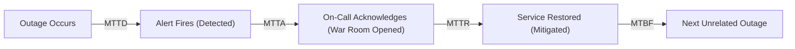
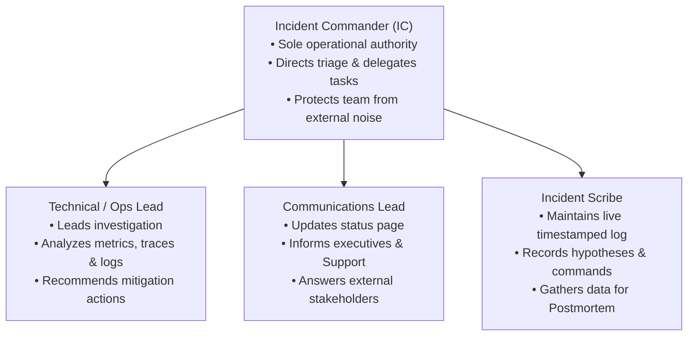

# Production SRE & Incident Response

In distributed systems and cloud backend engineering, **production failures are an inevitability**. Cloud regions experience fiber cuts, third-party payment gateways suffer intermittent outages, database replication experiences lag, and subtle edge cases bypass pre-production testing suites.

The defining hallmark of a senior backend engineer is not writing code that never fails, but possessing the **operational discipline, runbook automation, and psychological safety** required to detect outages in seconds, mitigate customer impact under high stress, and run blameless postmortems that permanently prevent recurrence.

---

## 1. SRE Reliability Metrics: MTTD, MTTA, MTTR & MTBF

High-performing Site Reliability Engineering (SRE) teams measure operational health using four standardized metrics:



- **MTTD (Mean Time to Detect)**: Time from when the fault first occurs in production until an automated Prometheus/CloudWatch alarm fires. (Goal: under 2 minutes).
- **MTTA (Mean Time to Acknowledge)**: Time from when PagerDuty pages the on-call primary until the engineer acknowledges and joins the incident bridge. (Goal: under 5 minutes for SEV-1).
- **MTTR (Mean Time to Resolve / Mitigate)**: Time from alert acknowledgment until customer-facing error rates drop back to zero and SLOs recover. (Goal: under 15 minutes).
- **MTBF (Mean Time Between Failures)**: Average operational duration between major outages. (Goal: months).

<Tip>
**The SRE Axiom**: You cannot debug a system into recovery faster than you can roll back a bad deployment. MTTR is minimized by automated rollbacks, traffic shedding, and circuit breakers—**never by live interactive debugging in production**!
</Tip>

---

## 2. Standardized Severity Matrix (SEV-1 to SEV-4)

Every production alert must map directly to an unambiguous severity level to dictate escalation paths, communication cadences, and engineering resources:

| Severity Level | Definition & Customer Impact | Response SLA | Communication Cadence | Example Incident |
| :--- | :--- | :--- | :--- | :--- |
| **SEV-1 (Critical)** | Core critical user path down; revenue loss; security breach; data loss risk. | **5 minutes** (24/7 Page) | Every 15 minutes | Users cannot complete checkout; authentication returns 500 across all users. |
| **SEV-2 (Major)** | Major functionality impaired with no viable workaround; high latency on key flows. | **15 minutes** | Every 30 minutes | Search functionality completely down; p99 API latency exceeds 5,000ms. |
| **SEV-3 (Moderate)** | Non-critical feature broken; straightforward workaround available for users. | **2 hours** | Once daily | User profile avatar uploads failing; weekly PDF export job timed out. |
| **SEV-4 (Low)** | Minor cosmetic defect; internal admin portal glitch; minimal customer impact. | Next business day | Sprint planning | Admin dashboard sorting column misaligned; internal documentation typo. |

---

## 3. The Incident Commander (IC) Protocol

During a live SEV-1 outage, unstructured group debugging in an open Slack channel leads to panic, conflicting commands, and prolonged customer downtime.

Production teams adopt the **Incident Command System (ICS)**:



### The 4 Golden Rules of the Incident Commander
1. **One Voice**: The IC is the sole authority during the incident. No changes are applied to production without explicit verbal or written authorization from the IC.
2. **Mitigate First, Debug Later**: The primary objective is restoring service to customers. Never spend 45 minutes reproducing a memory leak or inspecting heap dumps while checkouts fail. **Roll back the deployment, restart the pods, or trip the circuit breaker immediately.**
3. **Dedicated War Room**: Immediately create a dedicated channel (`#incident-2026-09-10-checkout`) and a persistent audio/video bridge. Evict unrelated observers who ask distracting questions.
4. **Shift Roles**: The IC should never have their hands on the keyboard running terminal commands. The IC maintains high-level situational awareness; the Technical Lead executes commands.

---

## 4. Production Emergency Runbooks

### Runbook 1: PostgreSQL Connection Pool Exhaustion & Lock Contention

**Symptoms**: Application logs repeat: `HikariPool-1 - Connection is not available, request timed out after 30000ms`. API latency spikes across all services.

#### Step 1: Query Active Statements in PostgreSQL
Execute this query to identify long-running, un-indexed, or stuck queries:

```sql
SELECT 
    pid, 
    now() - pg_stat_activity.query_start AS duration, 
    state,
    wait_event_type, 
    wait_event, 
    query 
FROM pg_stat_activity 
WHERE state != 'idle' 
  AND pid != pg_backend_pid()
ORDER BY duration DESC;
```

#### Step 2: Identify the Root Blocking Lock
Find which transaction holds the lock that is queuing dozens of other requests:

```sql
SELECT blocked.pid AS blocked_pid,
       blocker.pid AS blocking_pid,
       blocker.usename,
       blocker.application_name,
       blocker.state,
       now() - blocker.xact_start AS blocking_transaction_age,
       blocked.query AS blocked_statement,
       blocker.query AS blocking_statement
FROM pg_stat_activity AS blocked
CROSS JOIN LATERAL unnest(pg_blocking_pids(blocked.pid)) AS p(pid)
JOIN pg_stat_activity AS blocker ON blocker.pid = p.pid
WHERE blocked.datname = current_database();
```

#### Step 3: Choose the smallest effective intervention

Identify the transaction owner and query first. A queued DDL statement may be causing the traffic pile-up; canceling that migration can be enough. An idle transaction can hold locks even though it has no running query to cancel. Recheck PID, application name, and transaction start immediately before intervention. Do not terminate every slow connection.

```sql
-- psql only: replace 12345 with the reviewed PID from the diagnostic query.
\set target_pid 12345
SELECT pg_cancel_backend(:target_pid);
```

Re-run the diagnostic query. Cancellation stops the current statement; it does not promise that every transaction lock is released. If the connection still blocks recovery and its work can be aborted, terminate that reviewed session:

```sql
SELECT pg_terminate_backend(:target_pid);
```

Termination rolls back uncommitted database work and disconnects the client. It cannot undo external side effects. Record the action and verify recovery using pool wait, blocked sessions, and error rate. See [PostgreSQL administration functions](https://www.postgresql.org/docs/16/functions-admin.html).

---

### Runbook 2: JVM OutOfMemoryError (OOM) & Container Restarts

**Symptoms**: Repeated restarts may come from a JVM `OutOfMemoryError` or a container OOM kill. These are different failures. Exit 137 means SIGKILL; confirm `OOMKilled` in container status and correlate memory metrics before concluding that memory caused it.

#### Step 1: Verify Heap Dump Capture on Crash
Configure a heap dump for JVM-thrown `OutOfMemoryError`. A cgroup SIGKILL gives the JVM no chance to write one. The dump path needs writable persistent storage and enough free space; inspect existing container status and previous logs first:

```dockerfile
ENTRYPOINT ["java", \
  "-XX:+UseContainerSupport", \
  "-XX:MaxRAMPercentage=75.0", \
  "-XX:+HeapDumpOnOutOfMemoryError", \
  "-XX:HeapDumpPath=/var/log/app/oom_dump.hprof", \
  "-jar", "app.jar"]
```

#### Step 2: Mitigate Immediately
1. Scale up pod memory limit temporarily via Kubernetes:
   ```bash
   kubectl set resources deployment/notes-api --limits=memory=2Gi --requests=memory=1Gi
   ```
2. If memory leak is rapid, rollback the latest release to the last known stable version:
   ```bash
   kubectl rollout undo deployment/notes-api
   ```

#### Step 3: Diagnose Offline with Eclipse Memory Analyzer (MAT)
Inspect the captured `oom_dump.hprof` to find the culprit:
- Look at the **Leak Suspects Report**.
- Check for unbounded in-memory caches, unpaged JPA `findAll()` queries, or ThreadLocal leaks.

---

### Runbook 3: Cascading Downstream Outage & Circuit Breaker Tripping

**Symptoms**: Downstream payment gateway or inventory service latency jumps from 150ms to 9,000ms. All Tomcat worker threads are blocked waiting for responses.

#### Step 1: Apply the tested dependency-disable control

The documented `/actuator/circuitbreakers` endpoint lists breakers; it does not imply a built-in POST endpoint named `/transitionToOpen`. Inspect the endpoints and controls actually deployed. See [Resilience4j Spring Boot endpoints](https://resilience4j.readme.io/docs/getting-started-3).

An application-owned administrative action can call the registry:

```java
// Inside a tested, authenticated, audited operational control:
registry.circuitBreaker("paymentService").transitionToForcedOpenState();
```

This changes one application's in-memory breaker. Apply the intended policy to every replica. `FORCED_OPEN` remains closed to calls until explicitly reset or transitioned; ordinary `OPEN` can allow trial calls later. Define the recovery action and verify it in staging. See [Resilience4j breaker states](https://resilience4j.readme.io/docs/circuitbreaker).

#### Step 2: Verify Degradation & Fallback Behavior
Verify bounded latency and the documented unavailable response. Say an order is queued only after its intent is durably stored. Confirm that in-flight calls also have timeouts; opening a breaker does not cancel them.

---

### Runbook 4: Kafka Consumer Lag Surge & Poison Pill Record

**Symptoms**: Kafka consumer lag surges from 0 to 100,000+. Worker pods crash continuously with `SerializationException` or `IllegalArgumentException`.

#### Step 1: Identify Lag Per Partition
```bash
kafka-consumer-groups.sh --bootstrap-server kafka:9092 \
  --describe --group order-fulfillment-group
```

#### Step 2: Preserve the record and repair the consumer

Prefer deploying error-handling deserialization and a DLT so malformed data is retained for investigation. An offset reset skips business work for the group. Use it only after identifying the exact poisoned offset, saving the raw key/value and headers, and recording how the skipped action will be repaired.

Stop **all consumers in the group** and verify that the group is inactive. Save the current offsets. If the confirmed poison record is offset 417 in partition 2, the intended next offset is 418:

```bash
kafka-consumer-groups.sh --bootstrap-server kafka:9092 \
  --describe --group order-fulfillment-group > offsets-before.txt

kafka-consumer-groups.sh --bootstrap-server kafka:9092 \
  --group order-fulfillment-group --topic order-events:2 \
  --reset-offsets --to-offset 418 --dry-run
```

Inspect the planned offset, then execute the **same reviewed target**:

```bash
kafka-consumer-groups.sh --bootstrap-server kafka:9092 \
  --group order-fulfillment-group --topic order-events:2 \
  --reset-offsets --to-offset 418 --execute
```

Restart consumers, verify lag and business outcomes, and replay the preserved record after repair. Avoid a blind `--shift-by 1`: the committed offset may not be the failing offset. See [Kafka consumer-group offset operations](https://kafka.apache.org/38/operations/basic-kafka-operations/).

---

## 5. The Blameless Postmortem Culture & PMR Template

A **Blameless Postmortem** operates on a foundational psychological principle: **Engineers act in good faith with the information available to them at the time**. 

Punishing an engineer for pushing a bad query teaches the team to hide mistakes, slow down deployments, and avoid taking ownership. A resilient organization focuses on **systemic failures**: Why did CI not catch the missing index? Why did the database lack query timeout alarms?

### Complete Post-Mortem Report (PMR) Template

```markdown
# Incident Postmortem: [SEV-1] Payment Checkout Outage

**Date**: 2026-09-10  
**Severity**: SEV-1  
**Incident Commander**: Sarah Chen (IC)  
**Technical Lead**: Alex Rivera  
**Total Downtime**: 26 minutes (14:12 UTC to 14:38 UTC)  
**Customer Impact**: 2,340 checkout attempts failed with HTTP 500. Estimated lost revenue: $78,000.  

---

## 1. Executive Summary
At 14:12 UTC, deployment v2.4.1 introduced an unindexed query on the `orders` table. Under peak production traffic, database CPU hit 100%, exhausting the HikariCP connection pool and cascading across all API pods. The incident was mitigated at 14:38 UTC by rolling back to v2.4.0 and terminating rogue PostgreSQL queries.

---

## 2. Chronological Timeline (All times UTC)
- **14:05**: Automated deployment v2.4.1 begins rolling update.
- **14:12**: CloudWatch alarms trigger for p99 latency > 2,500ms on `/api/orders`.
- **14:14**: PagerDuty pages on-call engineer. SEV-1 declared; Sarah Chen assumes IC role.
- **14:16**: War room opened. Technical Lead notices Hikari connection acquisition timeouts.
- **14:21**: IC authorizes immediate rollback to v2.4.0 (`kubectl rollout undo`).
- **14:28**: Rollback complete; database CPU remains at 100% due to queued blocked queries.
- **14:33**: Tech Lead inspects `pg_stat_activity` and runs `pg_terminate_backend()` on blocking queries.
- **14:38**: Database CPU normalizes to 15%; p99 latency drops to 45ms. All health probes green. Incident closed.

---

## 3. Root Cause Analysis: The 5 Whys
1. **Why did checkouts fail?** HikariCP could not lease database connections.
2. **Why were connections unavailable?** All 30 pool connections were occupied running a slow `SELECT` query.
3. **Why was the query slow?** It filtered by `status` and `created_at` without an index, triggering a full sequential scan of 15 million rows.
4. **Why was the index missing?** The migration was omitted from the PR by accident.
5. **Why did CI not catch it?** Integration tests execute against an in-memory test database with only 10 rows, where sequential scans complete in under 1 millisecond.

---

## 4. Tracked Corrective Action Items

| Action Item | Classification | Owner | Jira Ticket | Due Date |
| :--- | :--- | :--- | :--- | :--- |
| Add composite index `orders(status, created_at DESC)` via `CREATE INDEX CONCURRENTLY` | **Prevent** | Alex R. | PROD-801 | 2026-09-11 |
| Add CI migration linter that flags queries filtering on unindexed columns | **Detect** | Sarah C. | INFRA-204| 2026-09-18 |
| Reduce HikariCP `connection-timeout` from 30s to 3s to fail fast during pool saturation | **Mitigate** | Bob K. | PROD-805 | 2026-09-12 |
| Configure PostgreSQL `statement_timeout = '5s'` to automatically kill runaway queries | **Mitigate** | DBA Team | DB-112 | 2026-09-15 |
```

---

## 6. Active Recall Interview Mastery

<AccordionGroup>
  <Accordion title="1. What does 'Mitigate First, Debug Later' mean during a live SEV-1 outage?">
    During a SEV-1 outage, customers are actively experiencing failure (e.g. inability to checkout, data loss, or system unavailability). Every minute of downtime translates directly to lost revenue and damaged reputation. 
    
    The team's sole priority must be restoring customer service as quickly as possible. This means rolling back recent deployments, restarting stuck containers, or scaling up hardware. Investigating the root cause, analyzing heap dumps, or reproducing the bug should only take place **after** the system has been restored to a healthy state.
  </Accordion>

  <Accordion title="2. How does the Incident Command System (ICS) prevent chaos during an outage?">
    The ICS establishes clear, structured roles during an emergency:
    - **Incident Commander (IC)**: The sole decision maker who maintains calm, sets priorities, and authorizes actions.
    - **Technical Lead**: Investigates logs, metrics, and executes technical commands.
    - **Communications Lead**: Handles external messaging (Statuspage, customer support, executives), shielding the technical team from distractions.
    - **Scribe**: Logs actions and timestamps in real time.
    
    This separation of responsibilities eliminates confusion, prevents engineers from executing conflicting commands, and drastically reduces Mean Time to Resolve (MTTR).
  </Accordion>

  <Accordion title="3. How do you distinguish between a JVM Heap OutOfMemoryError and a Linux cgroup OOMKill (Exit Code 137)?">
    - **JVM Heap OOM**: The Java process exhausts its heap (`-Xmx`). The JVM logs `java.lang.OutOfMemoryError: Java heap space` and, if configured with `-XX:+HeapDumpOnOutOfMemoryError`, writes a `.hprof` dump file before exiting.
    - **Linux cgroup OOMKill (Exit Code 137)**: The total memory consumption of the container process (Heap + Metaspace + Native Direct Buffers + Thread Stacks) exceeds the Kubernetes `resources.limits.memory`. The Linux kernel sends `SIGKILL` ($128 + 9 = 137$) directly to the process. The JVM is killed immediately without writing a stack trace or heap dump.
  </Accordion>

  <Accordion title="4. Why are blameless postmortems critical for software engineering organizations?">
    If an organization punishes individuals for mistakes, engineers will actively conceal errors, avoid taking ownership of complex systems, and delay reporting incidents. 
    
    A blameless culture recognizes that humans are fallible and that failures are the result of inadequate safety guardrails, missing automated tests, or fragile architectures. By focusing on systemic improvements (the 5 Whys), the organization builds robust defenses that prevent the same class of failure from ever recurring.
  </Accordion>

  <Accordion title="5. How do you handle a runaway query that is locking tables in PostgreSQL?">
    1. Query `pg_stat_activity` and `pg_locks` to find the process ID (`pid`) holding the ungranted lock.
    2. Attempt a graceful cancellation first using `SELECT pg_cancel_backend(pid);`. This asks the query to abort cleanly.
    3. If the query does not terminate after 5 to 10 seconds, forcefully kill the database connection using `SELECT pg_terminate_backend(pid);`.
  </Accordion>
</AccordionGroup>

---

## 7. Done Checklist

<Check>
All alerts map to unambiguous SEV-1 through SEV-4 definitions with automated PagerDuty escalation.
</Check>
<Check>
Incident Commander (IC) protocol is strictly enforced during live outages: mitigate first, debug later.
</Check>
<Check>
PostgreSQL runbook scripts (`pg_stat_activity`, `pg_terminate_backend`) are documented and accessible to all on-call engineers.
</Check>
<Check>
Production containers configure `-XX:+HeapDumpOnOutOfMemoryError` and `-XX:MaxRAMPercentage=75.0`.
</Check>
<Check>
Circuit breakers support dynamic runtime tripping via Spring Boot Actuator endpoints.
</Check>
<Check>
Blameless postmortems with 5 Whys root cause analysis and tracked action items are published within 48 hours of any SEV-1/SEV-2 outage.
</Check>
