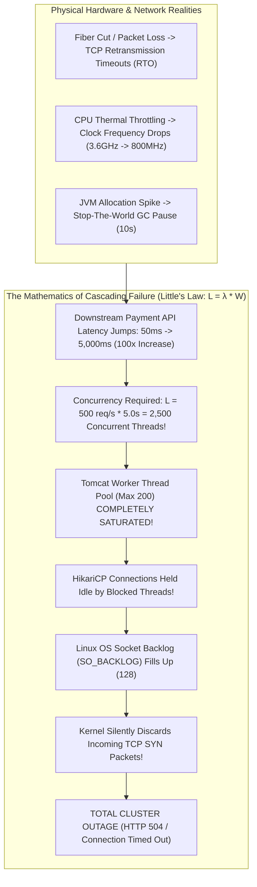
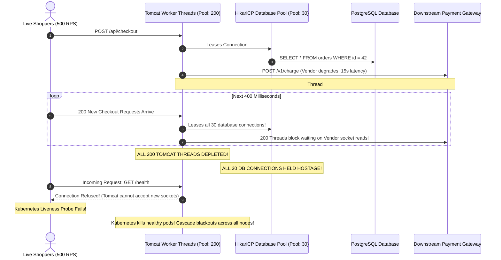
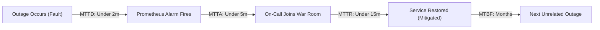
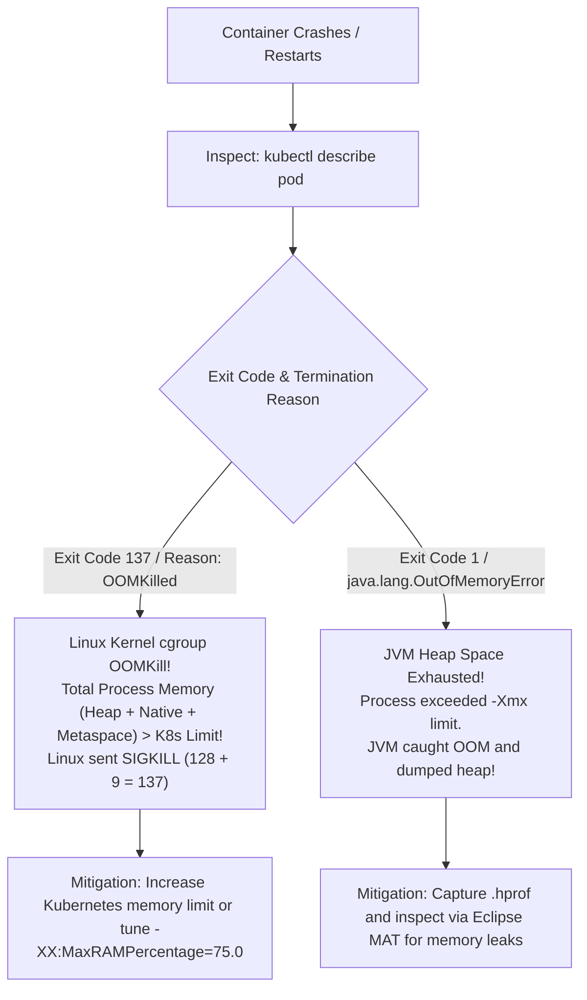

# Production SRE & Incident Response

In distributed cloud architectures, **production failures are an operational certainty**. Fiber optic cables get severed, cloud provider availability zones experience power degradation, third-party payment gateways suffer intermittent latency spikes, and subtle race conditions evade pre-production testing suites.

The defining hallmark of a senior backend engineer is not writing code that never fails, but possessing the **operational discipline, runbook automation, and psychological safety** required to detect outages in seconds, mitigate customer impact under high stress, and lead blameless postmortems that permanently prevent recurrence.

---

## 1. Phase 1: Ground Floor (Physical First Principles)

To manage high-severity production incidents effectively, you must understand the physical and mathematical mechanisms that turn a minor localized glitch into a catastrophic cluster-wide blackout.



### The Physics of Cascading Failure & Little's Law
In queueing theory, **Little's Law** governs all concurrent computing systems:
$$L = \lambda \times W$$
- $L$ : Average number of active concurrent requests in the system.
- $\lambda$ : Arrival rate (requests per second).
- $W$ : Average latency / processing duration per request.

#### The 100x Concurrency Explosion:
Imagine your checkout service processes $\lambda = 500\text{ req/s}$ with an average latency of $W = 50\text{ms}$ ($0.05\text{s}$):
$$L = 500 \times 0.05 = 25\text{ concurrent threads}$$
Your standard Tomcat thread pool (200 threads) handles this with ease.

Now, suppose a downstream payment gateway or database table lock causes latency to jump to $W = 5,000\text{ms}$ ($5.0\text{s}$):
$$L = 500 \times 5.0 = 2,500\text{ concurrent threads required!}$$
Because Tomcat has a hard cap of 200 threads:
1. Within **400 milliseconds**, all 200 worker threads are blocked waiting on network socket reads.
2. Any database connections checked out by those threads in HikariCP are held hostage.
3. New incoming HTTP requests pile up in the Linux kernel `SO_BACKLOG` queue.
4. Once the socket backlog fills, the kernel drops TCP `SYN` packets.
5. Upstream services (API Gateways, Mobile Apps) time out and retry, multiplying the incoming arrival rate $\lambda$ by $3\times$ (**The Retry Storm**).
6. A 5-second hiccup in one downstream dependency takes down the entire backend ecosystem.

---

## 2. Phase 2: The Naive Code (The Production Crash)

Let us examine the common beginner code patterns that trigger cascading failures and connection pool starvation during peak traffic.

### Naive Implementation: Unbounded HTTP Client & Retry Storm

```java
// NAIVE SERVICE IMPLEMENTATION - PRODUCTION CATASTROPHE HAZARD
@Service
public class PaymentProcessingService {

    @Autowired
    private RestTemplate restTemplate; // Naive: Default RestTemplate has NO TIMEOUTS!

    @Autowired
    private OrderRepository orderRepository;

    @Transactional // DANGER: Holding a database transaction during a remote HTTP call!
    public void processOrderPayment(Long orderId, PaymentRequest request) {
        Order order = orderRepository.findById(orderId)
                .orElseThrow(() -> new OrderNotFoundException(orderId));

        // Unbounded Remote HTTP Call with NO connect timeout and NO read timeout!
        // If payment gateway stalls, this thread blocks indefinitely!
        boolean success = false;
        int attempts = 0;

        while (!success && attempts < 10) { // Naive aggressive retry loop without jitter!
            try {
                attempts++;
                var response = restTemplate.postForObject(
                        "https://api.paymentvendor.com/v1/charge", 
                        request, 
                        PaymentResponse.class
                );
                success = response.isSuccessful();
            } catch (Exception e) {
                // Catastrophic: Retrying immediately without exponential backoff or circuit breaker!
                if (attempts >= 10) throw new PaymentFailedException(e);
            }
        }

        order.setStatus(OrderStatus.PAID);
        orderRepository.save(order);
    }
}
```

### The Production Outage Sequence



#### Why Production Collapsed:
1. **The Distributed Transaction Anti-Pattern**: The developer placed an external HTTP network call inside a `@Transactional` database boundary. When the remote vendor stalled, the physical PostgreSQL connection was locked open doing nothing for 15 seconds, exhausting HikariCP across the entire service.
2. **Missing Network Socket Timeouts**: The default `RestTemplate` has no socket connect or read timeouts. If the remote server leaves the TCP socket open without returning bytes, the worker thread hangs indefinitely in `SocketInputStream.socketRead0()`.
3. **Aggressive Un-Jittered Retries**: The `while (true)` retry loop hammered the struggling payment gateway with 10 immediate retries per failed request, amplifying traffic by 1,000% and deepening the outage.

---

## 3. Phase 3: Under the Hood (Mechanics, Runbooks & SRE Protocols)

When an outage strikes, chaos and unstructured Slack debates prolong downtime. Elite SRE organizations operate using standardized **Severity Frameworks, Incident Command Protocols, and Battle-Tested Runbooks**.

---

### SRE Reliability Metrics: MTTD, MTTA, MTTR & MTBF



- **MTTD (Mean Time to Detect)**: Duration between the physical fault occurring and automated Prometheus alarms firing. Target: $< 2\text{ minutes}$.
- **MTTA (Mean Time to Acknowledge)**: Duration between PagerDuty paging on-call and the engineer opening the war room. Target: $< 5\text{ minutes}$ for SEV-1.
- **MTTR (Mean Time to Resolve / Mitigate)**: Duration from acknowledgment until customer error rates drop back to zero. Target: $< 15\text{ minutes}$.
- **MTBF (Mean Time Between Failures)**: Operational uptime between outages. Target: months.

> [!TIP]
> **The SRE Golden Axiom**: You cannot debug a system into recovery faster than you can roll back a bad deployment. MTTR is minimized by **rolling back, restarting, shedding load, or tripping circuit breakers**—never by live interactive debugging in production!

---

### Standardized Severity Matrix (SEV-1 to SEV-4)

| Severity Level | Definition & Customer Impact | Response SLA | Communication Cadence | Example Production Scenario |
| :--- | :--- | :--- | :--- | :--- |
| **SEV-1 (Critical)** | Core revenue/business path down; data loss risk; security breach. | **5 minutes** (24/7 Page) | Every 15 minutes | Users cannot complete checkout; all API endpoints return HTTP 500. |
| **SEV-2 (Major)** | Major functionality impaired with no viable workaround; high latency on key flows. | **15 minutes** | Every 30 minutes | Search functionality completely down; p99 API latency exceeds 5,000ms. |
| **SEV-3 (Moderate)** | Non-critical feature broken; straightforward workaround available for users. | **2 hours** | Once daily | User profile avatar uploads failing; weekly PDF export job timed out. |
| **SEV-4 (Low)** | Minor cosmetic defect; internal admin portal glitch; minimal customer impact. | Next business day | Sprint planning | Admin dashboard sorting column misaligned; internal documentation typo. |

---

### The Incident Commander (IC) Protocol

During a SEV-1 emergency, engineering teams switch to the **Incident Command System (ICS)**:


#### The 4 Golden Rules of the Incident Commander:
1. **One Voice**: The IC is the sole operational authority. No changes, restarts, or rollbacks are executed without explicit verbal or written authorization from the IC.
2. **Mitigate First, Debug Later**: Restoring service to customers is the sole priority. Never spend 45 minutes reproducing a memory leak while revenue drops. Roll back the deployment, restart the pods, or trip the circuit breaker immediately.
3. **Hands Off the Keyboard**: The IC never runs terminal commands. The IC maintains high-level situational awareness and delegates commands to the Technical Lead.
4. **Dedicated War Room**: Move all communications into a dedicated incident channel (`#incident-2026-09-11-checkout`) and a persistent audio/video bridge. Remove spectators who ask distracting questions.

---

### Production Emergency Runbooks

#### Runbook 1: PostgreSQL Connection Pool Exhaustion & Recursive Lock Contention

**Symptoms**: Application logs repeat: `HikariPool-1 - Connection is not available, request timed out after 30000ms`. API latency spikes across all services.

##### Step 1: Identify Active & Long-Running Queries in PostgreSQL
```sql
SELECT 
    pid, 
    now() - pg_stat_activity.query_start AS duration, 
    state,
    wait_event_type, 
    wait_event, 
    query 
FROM pg_stat_activity 
WHERE state != 'idle' 
  AND pid != pg_backend_pid()
ORDER BY duration DESC;
```

##### Step 2: Trace Recursive Blocking PIDs (Finding the Root Blocker)
```sql
SELECT 
    blocked.pid AS blocked_pid,
    blocker.pid AS blocking_pid,
    blocker.usename,
    blocker.application_name,
    blocker.state,
    now() - blocker.xact_start AS blocking_transaction_age,
    blocked.query AS blocked_statement,
    blocker.query AS blocking_statement
FROM pg_stat_activity AS blocked
CROSS JOIN LATERAL unnest(pg_blocking_pids(blocked.pid)) AS p(pid)
JOIN pg_stat_activity AS blocker ON blocker.pid = p.pid
WHERE blocked.datname = current_database();
```

##### Step 3: Terminate the Culprit Backend Process
```sql
-- Attempt graceful query cancellation first:
SELECT pg_cancel_backend(12345);

-- If query does not terminate within 5 seconds, forcefully kill the connection:
SELECT pg_terminate_backend(12345);
```

---

#### Runbook 2: JVM OutOfMemoryError vs Container Exit Code 137

When a container restarts in production, determine whether it was a **JVM Heap OOM** or a **Linux Kernel cgroup OOMKill**:



##### Step 1: Diagnostic Commands for Live Pods
```bash
# Check if container was killed by Linux OOM killer:
kubectl get pod checkout-service-67f9b8c8d-k4z2n -o jsonpath='{.status.containerStatuses[0].lastState.terminated}'

# Expected output for cgroup kill:
# {"exitCode":137,"reason":"OOMKilled","startedAt":"...","finishedAt":"..."}

# Generate live thread dump from a running JVM without restarting it:
kubectl exec -it checkout-service-67f9b8c8d-k4z2n -- jcmd 1 Thread.print > threaddump.txt
```

##### Step 2: Ensure JVM Flags Capture Heap Dumps on Crash (`Dockerfile`)
```dockerfile
ENTRYPOINT ["java", \
  "-XX:+UseContainerSupport", \
  "-XX:MaxRAMPercentage=75.0", \
  "-XX:+HeapDumpOnOutOfMemoryError", \
  "-XX:HeapDumpPath=/var/log/app/heapdump.hprof", \
  "-jar", "app.jar"]
```

---

#### Runbook 3: Cascading Failure & Circuit Breaker Tripping

**Symptoms**: Downstream payment vendor latency jumps to 10 seconds. Tomcat threads are saturating.

##### Step 1: Force Open the Circuit Breaker Dynamically
In Resilience4j, an administrative endpoint or secure operational bean can immediately trip the circuit breaker, stopping all outgoing network calls:

```java
@Service
public class CircuitBreakerAdminService {

    private final CircuitBreakerRegistry circuitBreakerRegistry;

    public CircuitBreakerAdminService(CircuitBreakerRegistry circuitBreakerRegistry) {
        this.circuitBreakerRegistry = circuitBreakerRegistry;
    }

    /**
     * Operational intervention: Force circuit breaker into OPEN state across cluster.
     */
    public void forceOpenCircuit(String breakerName) {
        circuitBreakerRegistry.circuitBreaker(breakerName)
                .transitionToForcedOpenState();
    }
}
```

##### Step 2: Configure Fast Fallbacks & Isolated HTTP Client
Configure Spring's `RestClient` or `WebClient` with strict connect and read timeouts:

```java
@Configuration
public class HttpClientConfiguration {

    @Bean
    public RestClient paymentRestClient() {
        var requestFactory = new JdkClientHttpRequestFactory();
        requestFactory.setReadTimeout(Duration.ofMillis(2000)); // 2.0s hard socket read timeout

        return RestClient.builder()
                .requestFactory(requestFactory)
                .baseUrl("https://api.paymentvendor.com")
                .build();
    }
}
```

---

### The Blameless Postmortem (PMR) Culture & Template

A **Blameless Postmortem** operates on a foundational engineering truth: **Engineers act in good faith based on the information available to them at the time**. 

Punishing an engineer for pushing a bad query teaches the organization to hide mistakes, slow down deployments, and avoid taking ownership. High-reliability organizations focus on **systemic guardrails**: Why did CI allow an unindexed query? Why did the database lack query timeout alarms?

#### Standard Post-Mortem Report (PMR) Template

```markdown
# Incident Postmortem: [SEV-1] Payment Checkout Cascading Outage

**Date**: 2026-09-11  
**Severity**: SEV-1  
**Incident Commander**: Sarah Chen (IC)  
**Technical Lead**: Alex Rivera  
**Total Downtime**: 24 minutes (14:12 UTC to 14:36 UTC)  
**Customer Impact**: 3,120 checkout attempts failed with HTTP 504. Estimated lost revenue: $94,000.  

---

## 1. Executive Summary
At 14:12 UTC, deployment v2.4.1 introduced an unindexed query on the `orders` table inside an external payment flow. Under peak production traffic, database CPU saturated at 100%, exhausting the HikariCP connection pool and cascading across all 20 API pods due to Little's Law thread saturation. The incident was mitigated at 14:36 UTC by rolling back to v2.4.0, terminating blocked PostgreSQL queries, and forcing open the payment circuit breaker.

---

## 2. Chronological Timeline (All times UTC)
- **14:05**: Automated deployment v2.4.1 completes canary rollout.
- **14:12**: Prometheus alert fires: p99 latency > 2,500ms on `/api/checkout`.
- **14:14**: PagerDuty pages on-call. SEV-1 declared; Sarah Chen assumes IC role.
- **14:16**: Dedicated war room opened. Technical Lead identifies HikariCP connection acquisition timeouts.
- **14:21**: IC authorizes immediate rollback to v2.4.0 (`kubectl rollout undo`).
- **14:28**: Rollback complete; database CPU remains at 100% due to queued blocked queries.
- **14:31**: Tech Lead inspects `pg_stat_activity` and runs `pg_terminate_backend()` on blocking queries.
- **14:36**: Database CPU drops to 14%; p99 latency normalizes to 42ms. Health probes green. Incident closed.

---

## 3. Root Cause Analysis: The 5 Whys
1. **Why did checkouts fail?** HikariCP could not lease database connections to incoming requests.
2. **Why were connections unavailable?** All 30 pool connections were held open waiting for a slow `SELECT` statement.
3. **Why was the query slow?** It filtered by `status` and `created_at` without a composite index, forcing a full sequential scan of 15 million rows.
4. **Why was the index missing?** The migration was inadvertently excluded from the pull request.
5. **Why did pre-production tests not catch it?** Test environments ran against a database with only 1,000 rows, where sequential scans finish in 0.4 milliseconds.

---

## 4. Tracked Corrective Action Items

| Action Item | Classification | Owner | Jira Ticket | Due Date |
| :--- | :--- | :--- | :--- | :--- |
| Add composite index `orders(status, created_at DESC)` via `CREATE INDEX CONCURRENTLY` | **Prevent** | Alex R. | PROD-901 | 2026-09-12 |
| Add CI migration linter that flags queries on unindexed columns | **Detect** | Sarah C. | INFRA-304| 2026-09-18 |
| Enforce strict 2.0s socket connect/read timeouts across all HTTP client beans | **Mitigate** | Bob K. | PROD-905 | 2026-09-13 |
| Configure PostgreSQL `statement_timeout = '5s'` to automatically abort runaway queries | **Mitigate** | DBA Team | DB-212 | 2026-09-15 |
```

---

## 4. Phase 4: Senior Interview Ace (Junior vs Staff Phrasing)

When interviewing for Senior or Staff SRE / Backend Engineer roles, interviewers evaluate whether you stay calm under operational stress and understand the systemic mechanics of cascading failures.

### Junior Answer vs. Staff Engineer Answer

| Scenario | Junior Engineer Answer | Staff / Principal Engineer Answer |
| :--- | :--- | :--- |
| **"What do you do first when a SEV-1 alert fires in production?"** | *"I open my terminal, SSH into the servers, and start checking log files to see what exception is being thrown."* | *"We declare an Incident Commander (IC), open a dedicated war room, and establish the golden rule: 'Mitigate First, Debug Later.' Our goal is restoring customer service within minutes, not identifying root cause while revenue burns. If a recent deployment occurred, we immediately execute an automated rollback. If a downstream dependency is lagging, we trip circuit breakers or shed non-critical load. We only begin forensic log and heap dump analysis after customer error rates normalize."* |
| **"How does a slow downstream service cause an entire backend to crash?"** | *"The slow service makes our service wait, so our requests pile up and we run out of memory."* | *"It is governed mathematically by Little's Law: $L = \lambda \times W$. When downstream latency $W$ jumps from 50ms to 5,000ms, the number of concurrent worker threads $L$ required to maintain a fixed throughput $\lambda$ explodes 100-fold. Tomcat worker thread pools quickly saturate at their maximum limit. Because threads hold open HikariCP database connections during RPC calls, the database connection pool also starves. Incoming requests fill the Linux `SO_BACKLOG` until the kernel drops `SYN` packets, collapsing the entire service graph."* |
| **"What is the difference between a JVM OutOfMemoryError and Exit Code 137?"** | *"They are both out of memory crashes in Java."* | *"A JVM Heap `OutOfMemoryError` is thrown by the Java runtime when the heap exceeds `-Xmx`. The JVM can catch it, log the stack trace, and write a `.hprof` file via `-XX:+HeapDumpOnOutOfMemoryError`. Exit Code 137 is a Linux cgroup OOMKill ($128 + 9\text{ SIGKILL}$). The total container memory footprint—including JVM Heap, Metaspace, Off-Heap Direct Buffers, and OS thread stacks—exceeded Kubernetes `limits.memory`. The Linux kernel killed the process instantly, giving the JVM zero chance to log an error or write a heap dump."* |
| **"How do you resolve table lock contention during an active database incident?"** | *"I restart PostgreSQL to clear all the stuck locks."* | *"Restarting PostgreSQL causes massive downtime, terminates all clean connections, and initiates an expensive crash recovery process. Instead, we query `pg_stat_activity` cross-joined with `pg_blocking_pids()` to identify the exact root blocking PID. We first attempt a non-destructive cancellation using `SELECT pg_cancel_backend(pid);`. If the query does not yield within 5 seconds, we terminate the backend session with `SELECT pg_terminate_backend(pid);`, releasing all locks and restoring pool availability."* |

---

## 5. Active Recall & Self-Assessment

<AccordionGroup>
  <Accordion title="1. What is Little's Law and why is it foundational to distributed systems reliability?">
    Little's Law states that $L = \lambda \times W$, where $L$ is concurrent requests, $\lambda$ is arrival rate, and $W$ is average processing latency. It proves that system concurrency is directly proportional to latency. If processing duration increases by $10\times$ due to a slow database or external API, your thread and connection concurrency requirements also multiply by $10\times$. If thread pools have fixed ceilings, the system saturates rapidly, turning a localized slowdown into total pool exhaustion.
  </Accordion>

  <Accordion title="2. Why is calling a third-party HTTP API inside a @Transactional method an anti-pattern?">
    A `@Transactional` annotation holds open a physical database connection from the HikariCP pool for the entire duration of the method. Network I/O over HTTP is inherently non-deterministic and can stall for seconds due to packet loss, latency spikes, or third-party outages. Holding a precious database connection while waiting on remote network sockets causes database pool starvation, preventing other threads from executing fast local queries.
  </Accordion>

  <Accordion title="3. What are the core responsibilities of an Incident Commander (IC)?">
    The Incident Commander is the single operational authority during a SEV-1 outage. The IC:
    1. Sets operational priorities and establishes clear delegation.
    2. Keeps engineering teams focused on mitigation rather than deep debugging.
    3. Authorizes rollbacks, restarts, or load shedding.
    4. Shields technical leads from executive or customer distractions by designating a Communications Lead.
    5. Ensures hands stay off the keyboard to maintain high-level situational awareness.
  </Accordion>

  <Accordion title="4. How does pg_cancel_backend differ from pg_terminate_backend?">
    - `pg_cancel_backend(pid)`: Sends a `SIGINT` signal to the PostgreSQL worker process. It asks the backend to cleanly abort the currently executing query while keeping the client connection alive and open.
    - `pg_terminate_backend(pid)`: Sends a `SIGTERM` signal to the backend process. It forcefully closes the database connection, aborts all uncommitted transaction state, releases all locks held in shared memory, and disconnects the client.
  </Accordion>
</AccordionGroup>

---

## 6. Done Checklist

<Check>
- [ ] Understand Little's Law ($L = \lambda \times W$) and the physics of cascading thread pool saturation.
- [ ] Strictly isolate external HTTP network calls outside database `@Transactional` boundaries.
- [ ] Configure hard connect and read timeouts on all HTTP client and RPC beans.
- [ ] Define standardized SEV-1 through SEV-4 incident severity levels and escalation SLAs.
- [ ] Enforce the Incident Command System (ICS) and "Mitigate First, Debug Later" protocol during outages.
- [ ] Execute PostgreSQL lock resolution runbooks using `pg_stat_activity` and `pg_blocking_pids`.
- [ ] Distinguish between JVM Heap OOM and Linux cgroup OOMKill (Exit Code 137).
- [ ] Configure `-XX:+HeapDumpOnOutOfMemoryError` and `-XX:MaxRAMPercentage=75.0` in all container images.
- [ ] Publish blameless postmortems with 5 Whys root cause analysis within 48 hours of any SEV-1 incident.
</Check>
