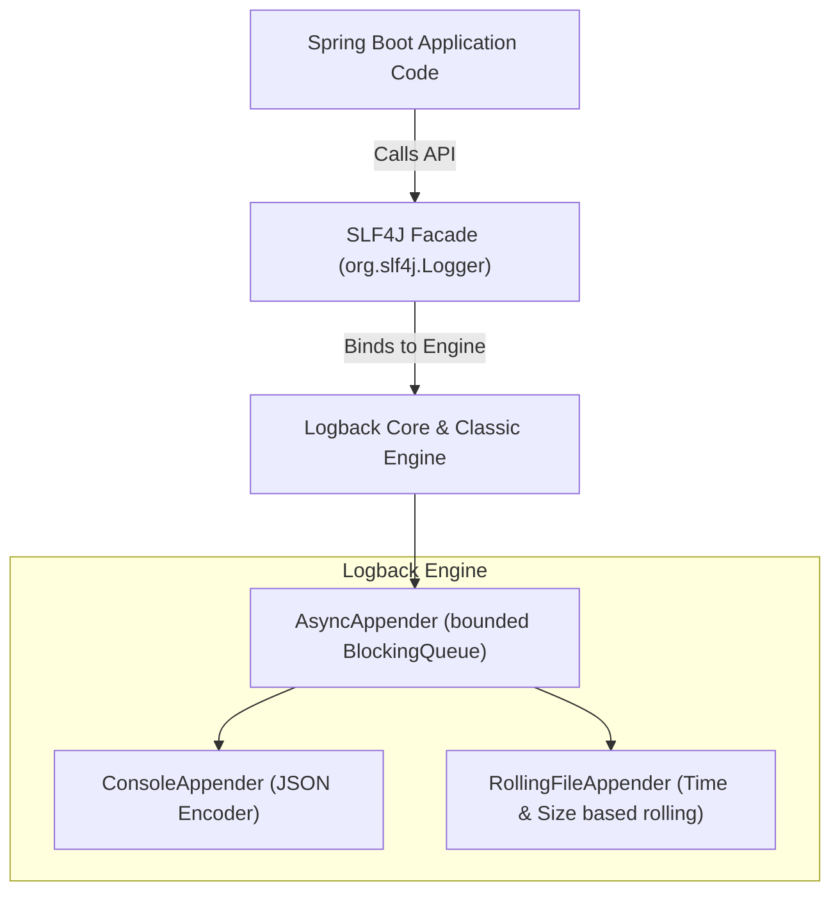
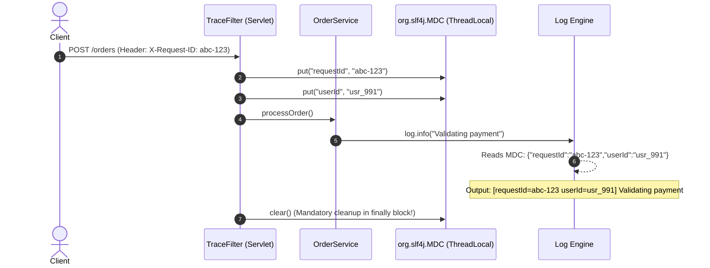
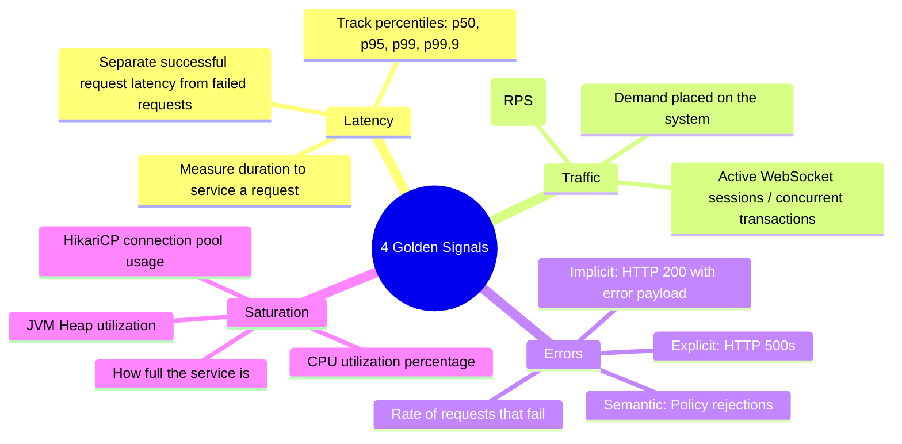
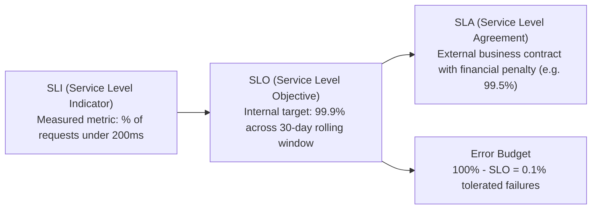

# Production Logging Architecture, MDC & Alerting SLOs

In local development, you debug by setting breakpoints in an IDE.
In production systems serving thousands of requests per second across dozens of Kubernetes pods, **you cannot attach a debugger**.

When an outage strikes at 3:00 AM, the only evidence you have consists of structured logs, telemetry metrics, and alert triggers. Poor logging architectures cause double damage:
1. **Performance Penalties**: Synchronous disk or console writes can drop request throughput by up to 80%.
2. **Debugging Blindness**: Missing correlation IDs, unstructured text logs, and alert fatigue turn incident resolution into frantic guesswork.

This guide provides an exhaustive, production-grade manual for logging pipelines, Mapped Diagnostic Context (MDC) propagation, and Google SRE alerting principles in Spring Boot 3.

---

## The Logging Engine Stack: SLF4J and Logback Internals

Modern Java logging is decoupled into a **Facade** and an **Implementation Engine**:



### Synchronous vs Asynchronous Logging
By default, standard logging writes synchronously to `STDOUT` or disk. Under heavy traffic:
- Every `log.info()` forces the request thread to acquire an OS I/O lock and wait for disk or console serialization.
- If the disk stalls or stdout buffers fill, **all application worker threads freeze**.

<Tip>
Logback's `AsyncAppender` uses a bounded blocking queue and a worker thread. It can reduce time spent writing logs on request threads, but it is not a lock-free Disruptor appender. At saturation you must choose between blocking callers and dropping events. Defaults can discard lower-level events before the queue is full. See [Logback's AsyncAppender behavior](https://logback.qos.ch/manual/appenders-async-sift.html).
</Tip>

---

## Mapped Diagnostic Context (MDC) & Context Loss Traps

### How MDC Works
`org.slf4j.MDC` uses a `ThreadLocal` map to store key-value pairs (like `traceId`, `userId`, `tenantId`) that are automatically injected into every log statement emitted on that thread.



### The MDC Context Loss Trap Across Async Boundaries
Because MDC is backed by `ThreadLocal`, its context is **completely lost** when execution hops to another thread:
- Method annotated with `@Async`
- `CompletableFuture.supplyAsync()`
- Reactive pipelines (`Project Reactor`)
- Java 21 Virtual Threads running on Carrier Thread pools

```java
// DISASTER: Logs in background thread lose all MDC metadata!
@Async
public void sendEmailNotification(String orderId) {
    // MDC is EMPTY here! requestId, userId, and tenantId are completely gone!
    log.info("Sending confirmation email for order {}", orderId); 
}
```

### The Production Solution: `TaskDecorator`
Configure Spring's `ThreadPoolTaskExecutor` with a `TaskDecorator` to copy MDC context across thread boundaries:

```java
package com.example.demo.config;

import org.slf4j.MDC;
import org.springframework.context.annotation.Bean;
import org.springframework.context.annotation.Configuration;
import org.springframework.core.task.TaskDecorator;
import org.springframework.scheduling.concurrent.ThreadPoolTaskExecutor;

import java.util.Map;
import java.util.concurrent.Executor;

@Configuration
public class AsyncConfig {

    @Bean(name = "taskExecutor")
    public Executor taskExecutor() {
        ThreadPoolTaskExecutor executor = new ThreadPoolTaskExecutor();
        executor.setCorePoolSize(8);
        executor.setMaxPoolSize(16);
        executor.setQueueCapacity(500);
        executor.setThreadNamePrefix("async-exec-");
        executor.setTaskDecorator(new MdcTaskDecorator());
        executor.initialize();
        return executor;
    }

    public static class MdcTaskDecorator implements TaskDecorator {
        @Override
        public Runnable decorate(Runnable runnable) {
            // Snapshot MDC from the caller thread
            Map<String, String> contextMap = MDC.getCopyOfContextMap();
            return () -> {
                try {
                    if (contextMap != null) {
                        MDC.setContextMap(contextMap); // Propagate to worker thread
                    }
                    runnable.run();
                } finally {
                    MDC.clear(); // Always clean up pooled thread
                }
            };
        }
    }
}
```

---

## Structured JSON Logging for Log Aggregators (ELK / Loki)

In production, human-readable text logs (`2026-09-10 15:30:00 INFO Order created`) are an anti-pattern. Centralized log platforms (Elasticsearch, OpenSearch, Grafana Loki, Datadog) require **structured JSON** to index and query fields at scale.

### Production `logback-spring.xml`
Place this configuration in `src/main/resources/logback-spring.xml` using `logstash-logback-encoder`:

```xml
<?xml version="1.0" encoding="UTF-8"?>
<configuration>

    <springProperty scope="context" name="appName" source="spring.application.name" defaultValue="backend-api"/>
    <springProperty scope="context" name="env" source="spring.profiles.active" defaultValue="prod"/>

    <!-- Direct JSON Console Appender -->
    <appender name="CONSOLE_JSON" class="ch.qos.logback.core.ConsoleAppender">
        <encoder class="net.logstash.logback.encoder.LogstashEncoder">
            <customFields>{"service":"${appName}","environment":"${env}"}</customFields>
            <fieldNames>
                <timestamp>timestamp</timestamp>
                <version>[ignore]</version>
                <levelValue>[ignore]</levelValue>
            </fieldNames>
            <!-- Explicit allowlist: these are literal key names, not glob patterns. -->
            <includeMdcKeyName>traceId</includeMdcKeyName>
            <includeMdcKeyName>spanId</includeMdcKeyName>
            <includeMdcKeyName>requestId</includeMdcKeyName>
            <timestampPattern>yyyy-MM-dd'T'HH:mm:ss.SSSZZ</timestampPattern>
        </encoder>
    </appender>

    <!-- Async wrapper: favor log retention by blocking when full. -->
    <appender name="ASYNC_JSON" class="ch.qos.logback.classic.AsyncAppender">
        <appender-ref ref="CONSOLE_JSON"/>
        <queueSize>2048</queueSize>
        <discardingThreshold>0</discardingThreshold> <!-- Disable early level-based discarding -->
        <maxFlushTime>5000</maxFlushTime>
        <neverBlock>false</neverBlock> <!-- Callers wait when the queue is full -->
    </appender>

    <root level="INFO">
        <appender-ref ref="ASYNC_JSON"/>
    </root>

</configuration>
```

This example favors retaining logs under queue pressure. If request latency is more important for a particular diagnostic stream, `neverBlock=true` drops incoming events when full, including WARN and ERROR. Neither mode guarantees delivery on a crash or after the shutdown flush deadline. Exercise a slow-output failure before choosing the policy. Business audit events need their own durable design.

Spring's `springProperty` extension cannot be combined with Logback configuration scanning. The MDC allowlist above uses literal names; `*` does not mean all fields. See [Spring Boot Logback extensions](https://docs.spring.io/spring-boot/reference/features/logging.html#features.logging.logback-extensions) and [the encoder's MDC options](https://github.com/logfellow/logstash-logback-encoder#mdc-fields).

### JSON Output on the Wire
Every log statement is formatted as a single-line JSON document:

```json
{
  "timestamp": "2026-09-10T15:30:00.124+00:00",
  "level": "INFO",
  "thread_name": "http-nio-8080-exec-4",
  "logger_name": "com.example.service.OrderService",
  "message": "Order created successfully",
  "service": "order-service",
  "environment": "prod",
  "requestId": "9b1deb4d-3b7d-4bad-9bdd",
  "userId": "usr_4412",
  "orderId": "ord_8819",
  "amountCents": 4999
}
```

---

## PII Masking: Preventing Secret Leakage

Logging personally identifiable information (PII) or secrets violates GDPR, PCI-DSS, and HIPAA compliance:
- Passwords and PINs
- JWT Bearer tokens and API keys
- Credit card PANs (Primary Account Numbers)
- Social Security Numbers (SSN)

### Regex Masking Pattern in Logback
Configure a composite converter or custom Jackson masking provider to intercept patterns before emission:

```xml
<!-- Example pattern mask in logback converter -->
<pattern>%replace(%msg){'("password"|"token"|"credit_card")\s*:\s*".*?"', '$1:"***MASKED***"'}%n</pattern>
```

---

## Google SRE Alerting: The 4 Golden Signals & Burn Rates

### The 4 Golden Signals
The Google Site Reliability Engineering (SRE) handbook identifies 4 essential telemetry metrics for any customer-facing service:



### Why Averages Lie: The Power of Percentiles
Never alert on "Average Latency". If 99 users experience a 10ms response time and 1 user experiences a 10,000ms timeout:
$$\text{Average Latency} = \frac{(99 \times 10) + 10,000}{100} = 109.9 \text{ ms}$$
The average looks completely healthy (under 110ms), while 1% of your customers are experiencing a total outage. **Always monitor p95, p99, and p99.9 latencies**.

---

## SLI, SLO, SLA & Multi-Window Burn-Rate Alerting



### Calculating the Error Budget
For an SLO of **99.9% availability** over a 30-day rolling window:
$$\text{Total Seconds in 30 Days} = 30 \times 24 \times 3600 = 2,592,000 \text{ seconds}$$
$$\text{Allowed Downtime / Error Budget} = 2,592,000 \times 0.001 = 2,592 \text{ seconds} \approx \mathbf{43.2 \text{ minutes}}$$

### Google SRE Multi-Window Multi-Burn-Rate Alerting
Traditional threshold alerting (e.g., *alert if error rate > 1% for 5 minutes*) creates severe alert fatigue: transient 1-minute network blips wake up engineers at night, while slow 0.5% leaks exhaust the monthly error budget without ever triggering an alert.

Google SRE uses **Burn Rates** (the rate at which a service consumes its error budget):
- **1x Burn Rate**: Consumes 100% of error budget in exactly 30 days (Normal, no alert).
- **14.4x Burn Rate**: Consumes 2% of monthly budget in 1 hour. **Critical Pager Alert** (wake up on-call engineer immediately).
- **6x Burn Rate**: Consumes 5% of monthly budget in 6 hours. **Ticket Alert** (investigate during business hours).

#### Production Prometheus AlertRule
```yaml
# prometheus-alerts.yml
groups:
  - name: production-slo-alerts
    rules:
      # Critical Alert: 14.4x burn rate over 1 hour and 5 minutes (Consumes 2% budget)
      - alert: ErrorBudgetBurnRateFast
        expr: |
          (
            sum(rate(http_server_requests_seconds_count{status=~"5.."}[1h]))
            /
            sum(rate(http_server_requests_seconds_count[1h]))
          ) > (14.4 * 0.001)
          and
          (
            sum(rate(http_server_requests_seconds_count{status=~"5.."}[5m]))
            /
            sum(rate(http_server_requests_seconds_count[5m]))
          ) > (14.4 * 0.001)
        for: 2m
        labels:
          severity: page
        annotations:
          summary: "High error budget burn rate (14.4x)"
          description: "Service {{ $labels.app }} is burning >2% of its monthly error budget within 1 hour."
```

---

## Production Mistakes & Anti-Patterns

<Warning>
### 1. Alerting on Symptoms Instead of User Pain
Setting alerts on *CPU utilization > 85%* is an anti-pattern. If a video transcoding worker uses 95% CPU to process jobs efficiently without dropping tasks, no human intervention is needed. Alert on **User Pain** (high error rates, p99 latency degradation, queue backlogs) rather than raw machine utilization.
</Warning>

<Warning>
### 2. The String Concatenation Logging Hazard
Avoid string concatenation inside log calls:
```java
// ANTI-PATTERN: String allocation happens EVEN IF debug logging is disabled!
log.debug("Found items: " + expensiveDatabaseLookup());

// PRODUCTION PATTERN: Parameterized logging avoids allocation when level is disabled
log.debug("Found items: {}", items);
```
</Warning>

<Warning>
### 3. Log Flooding with Stack Traces
Logging a 100-line stack trace inside a loop that executes 50,000 times per minute will exhaust container disk space, saturate logging buffers, and cost thousands of dollars in cloud logging ingest fees. Rate-limit repetitive exception logging.
</Warning>

---

## Active Recall & Interview Mastery

<AccordionGroup>
  <Accordion title="1. What is the difference between SLI, SLO, and SLA?">
    An **SLI (Service Level Indicator)** is a compliance metric measured in real-time (e.g., the proportion of HTTP requests returning under 200ms). An **SLO (Service Level Objective)** is the internal reliability target agreed upon by engineering and product teams (e.g., 99.9% of requests meet the SLI over a 30-day rolling window). An **SLA (Service Level Agreement)** is an external business contract with customers that carries financial penalties or service credits if broken (e.g., 99.5% uptime).
  </Accordion>

  <Accordion title="2. Why should logging in high-throughput backends always be asynchronous?">
    Synchronous logging forces application worker threads to acquire locks and wait for physical I/O (disk flush or console serialization) on every log statement. When disk I/O degrades or logs volume spikes, worker threads stall, exhausting Tomcat thread pools and causing HTTP 504 timeouts. AsyncAppender moves output work to a worker while queue capacity remains. A full queue either blocks callers or drops events according to configuration; no fixed latency is guaranteed.
  </Accordion>

  <Accordion title="3. How does MDC work, and how do you prevent context loss across async thread pools?">
    MDC (Mapped Diagnostic Context) stores key-value pairs in a `ThreadLocal` map to correlate logs on a specific thread. However, when work is delegated to `@Async` methods or thread pools, the new thread has an empty `ThreadLocal`. In Spring Boot, this is solved by configuring a `TaskDecorator` on the `ThreadPoolTaskExecutor` that copies the MDC map from the caller thread to the worker thread before execution and cleans it up afterward.
  </Accordion>

  <Accordion title="4. Why are latency averages considered misleading in production monitoring?">
    Averages hide catastrophic tail latency. Because latencies follow a power-law distribution, 99 fast requests (10ms) and 1 severely hung request (10,000ms) yield an average latency of ~110ms, which appears normal. However, 1% of users are experiencing a complete outage. Percentile metrics (p95, p99, p99.9) isolate the performance experienced by the slowest user cohorts.
  </Accordion>

  <Accordion title="5. What is Multi-Burn-Rate alerting and why is it superior to simple threshold alerts?">
    Simple threshold alerts (e.g. *alert if error rate > 2%*) trigger noisy false alarms on brief 30-second spikes and fail to detect slow, steady leaks that exhaust the monthly error budget over several days. Multi-burn-rate alerting measures how quickly the service is burning through its 30-day error budget across multiple time windows (e.g., 1-hour and 6-hour windows), alerting only when an incident represents a statistically significant threat to the monthly SLO.
  </Accordion>
</AccordionGroup>
