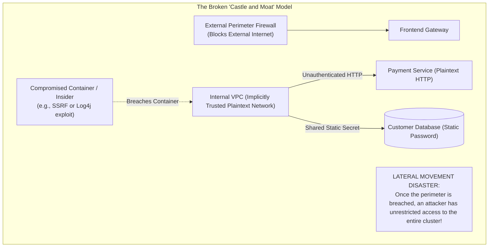
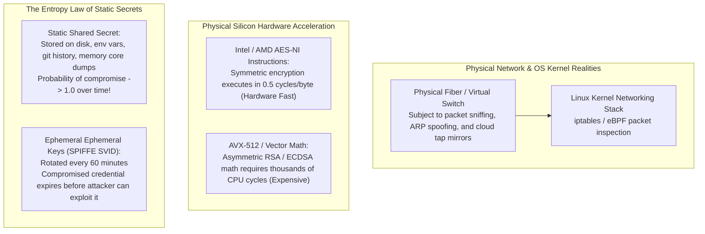
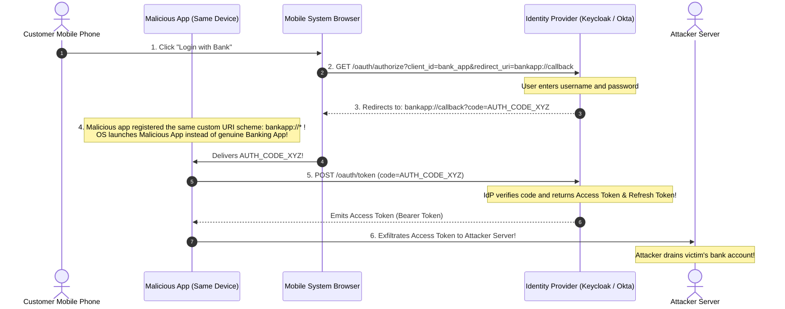
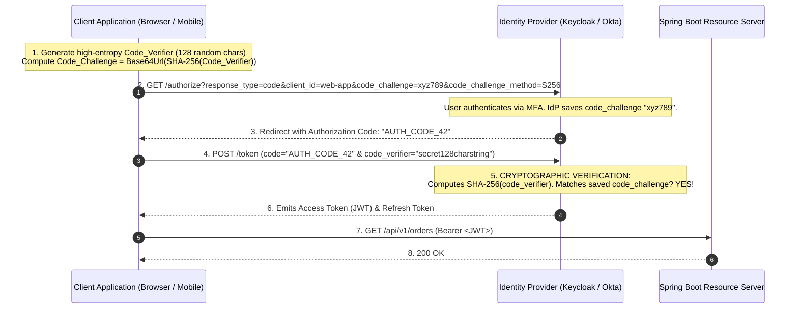
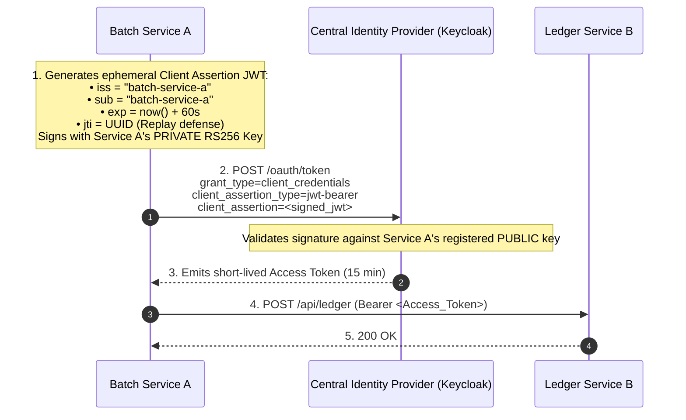
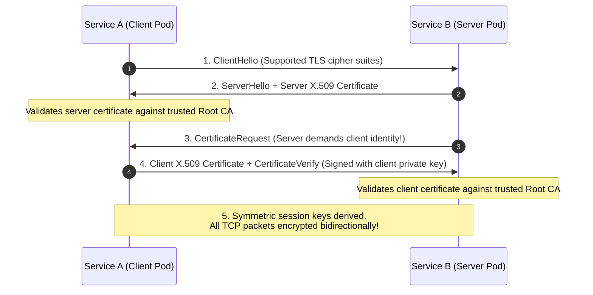
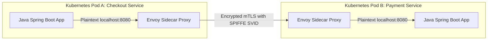

# OAuth 2.1, OIDC & Zero-Trust Service Mesh

In legacy enterprise architectures, software systems relied on the **Perimeter Security Model** (often called the "Castle and Moat" paradigm):
- A network firewall, VPN, or reverse proxy guards the external perimeter.
- Everything operating inside the internal corporate Virtual Private Cloud (VPC) is implicitly trusted.
- Microservices communicate over unencrypted, plaintext HTTP, relying on static shared API keys or hardcoded database passwords stored in configuration files.



In modern **Zero-Trust Architecture** (NIST SP 800-207), the foundational rule is:
> **"Never Trust, Always Verify."** Network locality confers zero trust. Every single request—whether between an end-user and an API, or between two internal container pods sitting on the same physical Kubernetes worker node—must be **cryptographically authenticated, authorized, and encrypted in transit**.

---

## Phase 1: Ground Floor (Physical First Principles)

To design secure distributed identity systems, you must understand the physical vulnerabilities of cloud networking, cryptographic silicon acceleration, and entropy decay.



### 1. The Myth of the "Secure Internal Network"
In cloud environments (AWS, GCP, Azure), virtual machine network interfaces (vNICs) share underlying physical hypervisors and top-of-rack physical switches. Unencrypted internal traffic between pods is vulnerable to:
- **ARP Poisoning & DNS Spoofing**: Malicious containers can redirect internal traffic through local virtual switches.
- **Sidecar & Container Escapes**: A container breach (e.g., remote code execution in an image processing library) grants immediate access to the host kernel network namespace.
- **Lawful Intercept & Cloud Mirroring**: Cloud hypervisor packet mirroring taps allow inspection of unencrypted VPC packets.

### 2. The Computational Cost of Cryptography
- **Symmetric Encryption (AES-GCM)**: Modern x86 and ARM processors contain dedicated hardware instructions (`AES-NI` / `ARMv8 Crypto`). Encrypting active TCP payloads in transit runs at **over 5 GB/sec per core** with negligible CPU overhead ($< 1\%$).
- **Asymmetric Cryptography (RSA / ECDSA)**: Negotiating handshakes and signing JWTs requires complex modular exponentiation and elliptic curve point multiplication. Generating an RSA-4096 signature takes **several milliseconds of raw CPU time**.
- **The Zero-Trust Trade-off**: Systems use asymmetric cryptography (PKCE, Private Key JWT, mTLS handshakes) to establish identity once, and switch immediately to hardware-accelerated symmetric keys (AES-GCM) for data streaming.

---

## Phase 2: The Naive Code (The Production Crashes)

### Crash Scenario 1: The Authorization Code Interception & Token Exfiltration

A development team builds a mobile banking application using standard OAuth 2.0 Authorization Code flow without PKCE:



#### What Happened in Production:
- Mobile operating systems (iOS and Android) allow multiple applications to register custom URI schemes (e.g. `bankapp://callback`).
- Because the developers omitted **Proof Key for Code Exchange (PKCE)**, anyone possessing the `code` parameter could exchange it for an Access Token.
- A rogue game app installed on the user's phone intercepted the callback, exchanged the code, and stole the user's authentication tokens.

---

### Crash Scenario 2: The Lateral Movement Cloud VPC Breach

A microservice architecture uses perimeter security with shared static API keys:

```java
// DANGEROUS ANTI-PATTERN: Internal service accepting static shared secrets
@RestController
@RequestMapping("/internal/api/v1/payments")
public class InternalPaymentController {

    @Value("${internal.shared.secret}")
    private String sharedSecret;

    @PostMapping("/disburse")
    public ResponseEntity<Void> disburseFunds(
            @RequestHeader("X-Internal-Secret") String incomingSecret,
            @RequestBody PayoutRequest request) {
        
        // FATAL FLAW: If secret matches, request is blindly trusted!
        if (!sharedSecret.equals(incomingSecret)) {
            return ResponseEntity.status(HttpStatus.UNAUTHORIZED).build();
        }

        // Executes wire transfer
        paymentService.executeWire(request);
        return ResponseEntity.ok().build();
    }
}
```

#### What Happened in Production:
1. An attacker exploited a file upload vulnerability in an internal marketing blog container sitting on the same Kubernetes cluster.
2. The attacker inspected the environment variables and found `INTERNAL_SHARED_SECRET=super-secret-key-12345`.
3. Because all internal services communicated over unencrypted HTTP without Mutual TLS or workload authorization, the attacker issued an HTTP request directly to `http://payment-service.default.svc.cluster.local/internal/api/v1/payments/disburse`.
4. The payment service executed the wire transfers, resulting in a **$1.8 million unauthorized funds transfer**.

---

### Crash Scenario 3: The JWKS Key Rotation 401 Global Blackout

A Spring Boot backend acts as an OAuth 2.0 Resource Server. To validate incoming JWTs, it fetches the public signing keys from Keycloak's JSON Web Key Set (JWKS) endpoint (`/protocol/openid-connect/certs`).

```java
// DANGEROUS ANTI-PATTERN: Static, un-refreshable JWKS configuration
@Bean
public JwtDecoder jwtDecoder() {
    // Fetches public keys ONCE at application boot time and caches indefinitely!
    return NimbusJwtDecoder.withJwkSetUri("https://auth.company.com/oauth2/jwks")
            .build();
}
```

#### What Happened in Production:
- The security team performed an emergency cryptographic key rotation on the central Identity Provider, retiring old RS256 key `key-2025` and generating `key-2026`.
- The Identity Provider began issuing user tokens signed with `key-2026`.
- Every Spring Boot microservice in the cluster rejected the incoming tokens because their in-memory JWKS cache only recognized `key-2025`.
- **Global Outage**: 100% of user API requests globally failed with `401 Unauthorized`. The outage persisted for 4 hours until all 180 microservices were manually rebooted.

---

## Phase 3: Under the Hood (Mechanics, Protocols & SPIFFE/SPIRE Architecture)

### 1. Proof Key for Code Exchange (PKCE - RFC 7636)

PKCE mathematically eliminates authorization code interception attacks using a cryptographic one-way hash function:



#### The Mathematical Trapdoor:
$$\text{Code\_Challenge} = \text{Base64UrlEncode}\left( \text{SHA-256}(\text{Code\_Verifier}) \right)$$
- If an attacker intercepts the authorization code at Step 3, they cannot exchange it for an Access Token at Step 4.
- Reversing SHA-256 to guess the 128-character `Code_Verifier` requires **$2^{256}$ operations**, which is computationally impossible under the laws of physics.

---

### 2. Machine-to-Machine Security: Private Key JWT (RFC 7523)

To eliminate static client secrets in microservice-to-microservice calls, use **Private Key JWT**:



---

### 3. Mutual TLS (mTLS) & SPIFFE / SPIRE

While JWTs provide application-layer authorization, **Mutual TLS (mTLS)** secures the transport layer, authenticating both the client and server at the TCP socket level:



#### SPIFFE Workload Identity:
Managing X.509 certificates manually across 5,000 container pods is impossible. **SPIFFE (Secure Production Identity Framework for Everyone)** standardizes machine identities:
- **SPIFFE ID**: A standardized URI representing the workload:
  `spiffe://prod.company.internal/ns/finance/sa/payment-service`
- **SVID (SPIFFE Verifiable Identity Document)**: A short-lived X.509 certificate automatically rotated every **60 minutes** by a local **SPIRE Agent** daemon without restarting containers.

---

### 4. Service Mesh Architecture: Envoy & Istio

Enterprises offload mTLS encryption, certificate rotation, and L7 authorization to **Envoy Sidecars**:



#### Declarative Istio Authorization Policy:
Enforce that **only** the `checkout-service` service account can execute payments:

```yaml
apiVersion: security.istio.io/v1beta1
kind: AuthorizationPolicy
metadata:
  name: payment-strict-rbac
  namespace: finance
spec:
  selector:
    matchLabels:
      app: payment-service
  action: ALLOW
  rules:
  - from:
    - source:
        principals: ["spiffe://prod.company.internal/ns/ecommerce/sa/checkout-service-sa"]
    to:
    - operation:
        methods: ["POST"]
        paths: ["/api/v1/payments/disburse"]
```

---

### 5. Production Spring Security 6 Resource Server Configuration

Below is the production-grade Spring Boot 3 configuration featuring automatic JWKS public key refresh, stateless session policies, and method-level RBAC:

```java
package com.backend.security.config;

import org.springframework.context.annotation.Bean;
import org.springframework.context.annotation.Configuration;
import org.springframework.security.config.Customizer;
import org.springframework.security.config.annotation.method.configuration.EnableMethodSecurity;
import org.springframework.security.config.annotation.web.builders.HttpSecurity;
import org.springframework.security.config.annotation.web.configuration.EnableWebSecurity;
import org.springframework.security.config.http.SessionCreationPolicy;
import org.springframework.security.oauth2.jwt.JwtDecoder;
import org.springframework.security.oauth2.jwt.NimbusJwtDecoder;
import org.springframework.security.oauth2.server.resource.authentication.JwtAuthenticationConverter;
import org.springframework.security.oauth2.server.resource.authentication.JwtGrantedAuthoritiesConverter;
import org.springframework.security.web.SecurityFilterChain;

import java.time.Duration;

@Configuration
@EnableWebSecurity
@EnableMethodSecurity // Enables @PreAuthorize("hasRole('PAYMENT_ADMIN')")
public class OAuth2ResourceServerConfig {

    @Bean
    public SecurityFilterChain securityFilterChain(HttpSecurity http) throws Exception {
        return http
            .csrf(csrf -> csrf.disable()) // Stateless REST API
            .cors(Customizer.withDefaults())
            .sessionManagement(session -> 
                session.sessionCreationPolicy(SessionCreationPolicy.STATELESS)
            )
            .authorizeHttpRequests(auth -> auth
                .requestMatchers("/actuator/health", "/actuator/info").permitAll()
                .requestMatchers("/api/v1/public/**").permitAll()
                .requestMatchers("/api/v1/admin/**").hasRole("PLATFORM_ADMIN")
                .anyRequest().authenticated()
            )
            .oauth2ResourceServer(oauth2 -> oauth2
                .jwt(jwt -> jwt
                    .jwtAuthenticationConverter(customJwtAuthenticationConverter())
                )
            )
            .build();
    }

    @Bean
    public JwtDecoder jwtDecoder() {
        // PRODUCTION RESILIENCE: Configure dynamic JWKS cache eviction & refresh
        return NimbusJwtDecoder.withJwkSetUri("https://auth.company.internal/oauth2/jwks")
            .cacheDefaults() // Caches keys in RAM with automatic cache expiration
            .build();
    }

    @Bean
    public JwtAuthenticationConverter customJwtAuthenticationConverter() {
        JwtGrantedAuthoritiesConverter grantedAuthoritiesConverter = new JwtGrantedAuthoritiesConverter();
        // Extract roles from Keycloak realm_access.roles or custom claims
        grantedAuthoritiesConverter.setAuthoritiesClaimName("roles");
        grantedAuthoritiesConverter.setAuthorityPrefix("ROLE_");

        JwtAuthenticationConverter jwtConverter = new JwtAuthenticationConverter();
        jwtConverter.setJwtGrantedAuthoritiesConverter(grantedAuthoritiesConverter);
        return jwtConverter;
    }
}
```

---

## Phase 4: Senior Interview Ace (Junior vs Staff Phrasing)

| Question / Scenario | Junior Developer Answer | Senior / Staff Backend Engineer Answer |
| :--- | :--- | :--- |
| **Why does OAuth 2.1 mandate PKCE even for confidential server-side web applications?** | "PKCE was made for mobile apps, but OAuth 2.1 makes it required everywhere to be more secure." | "Originally, PKCE (RFC 7636) was designed for public clients (SPAs and mobile apps) that cannot safely protect a static client secret. However, OAuth 2.1 mandates PKCE across **all** Authorization Code clients to defend against **Authorization Code Injection Attacks**. In this attack, a malicious actor intercepts a valid authorization code belonging to their own account and injects it into a victim's client session. Without PKCE, the client redeems the code, binding the victim's session to the attacker's account. Because the client holds the cryptographically random `Code_Verifier` generated specifically for that transaction, injected codes fail verification." |
| **What is the difference between an ID Token and an Access Token?** | "Both are JWTs with user information." | "They serve completely different architectural purposes in the OIDC/OAuth 2 protocol stack. An **ID Token** is an identity artifact issued by OpenID Connect intended **strictly for the client application**; it answers *'Who is the authenticated user?'* and must never be passed to resource servers to authorize API actions. An **Access Token** is an authorization credential issued by OAuth 2 intended **strictly for the Resource Server**; it answers *'What actions and scopes is this bearer permitted to execute?'*. Passing ID Tokens to backend APIs is a dangerous security anti-pattern." |
| **How does a Service Mesh enforce Zero-Trust without modifying Java application code?** | "It uses proxies to make microservices run faster." | "An Istio/Envoy service mesh enforces Zero-Trust by intercepting all TCP traffic at the Linux network layer using `iptables` rules. When Pod A calls Pod B, the local Envoy sidecar intercepts the egress TCP packet, establishes an **encrypted Mutual TLS (mTLS) tunnel** with Pod B's Envoy sidecar, and presents an ephemeral X.509 certificate carrying its **SPIFFE Workload Identity**. The receiving sidecar validates the client certificate against the cluster Root CA and evaluates Layer 7 Authorization Policies before proxying plaintext traffic over localhost to the Java container." |
| **Why should you use Private Key JWT instead of Client Secrets for machine-to-machine calls?** | "Private keys are harder to guess than passwords." | "Static client secrets are shared symmetrical passwords. If a secret is stolen from a container's environment variables, git history, or memory dump, the attacker can impersonate the client indefinitely until the secret is manually rotated across all services. **Private Key JWT (RFC 7523)** uses asymmetric cryptography: Service A holds a private key and signs an ephemeral assertion JWT valid for 60 seconds with a unique nonce (`jti`). The Identity Provider verifies the assertion against Service A's public key. The private key never leaves the client, eliminates shared secrets over the wire, and prevents replay attacks." |
| **How do you prevent a global 401 outage when an Identity Provider rotates its JWT signing keys?** | "We restart the microservices when the key is rotated." | "Microservices acting as OAuth 2.0 Resource Servers must use dynamic JWKS decoders that support **Key ID (`kid`) cache lookups and on-demand cache revalidation**. When a token arrives signed with an unfamiliar `kid`, the Resource Server must not reject the token immediately; it must perform an asynchronous cache refresh against the IdP's JWKS endpoint to fetch newly published public keys, while enforcing rate-limiting to prevent JWKS cache denial-of-service attacks." |

---

## Production Debugging Checklist

<AccordionGroup>
  <Accordion title="1. Global 401 Unauthorized After IdP Key Rotation">
    - [ ] Inspect the incoming JWT header: Check the `kid` (Key ID) and `alg` fields: `jwt.io`.
    - [ ] Curl the Identity Provider JWKS endpoint: `curl https://auth.company.com/oauth2/jwks`. Verify whether the token's `kid` exists in the published keyset.
    - [ ] Check the Spring Boot `JwtDecoder` bean: Ensure it uses dynamic cache refresh (`withJwkSetUri()`) rather than static in-memory keys.
  </Accordion>

  <Accordion title="2. Diagnosing Envoy mTLS Certificate Handshake Failures">
    - [ ] Check Envoy proxy logs on both client and server: `kubectl logs <pod-name> -c istio-proxy`.
    - [ ] Look for `TLS error: 2048:certificate verify failed` or `SPIFFE ID mismatch`.
    - [ ] Verify that SPIRE agents are actively running on the Kubernetes worker node and successfully renewing SVID certificates: `spire-agent healthcheck`.
  </Accordion>

  <Accordion title="3. Authorization Policy Rejections (RBAC Access Denied)">
    - [ ] Check the server's Envoy access logs: Look for `response_code: 403` and `response_flags: "UAEX"` (Unauthorized Access).
    - [ ] Inspect the client pod's SPIFFE principal: Verify it matches the `principals` field in the Istio `AuthorizationPolicy` YAML.
  </Accordion>
</AccordionGroup>

---

## Done Checklist

<Check>
The Zero-Trust axiom ("Never Trust, Always Verify") is enforced at both transport (mTLS) and application (OAuth 2.1) layers.
</Check>
<Check>
All Authorization Code flows mandate PKCE (`code_challenge_method=S256`) to prevent code interception attacks.
</Check>
<Check>
Machine-to-Machine communication uses Private Key JWT (RFC 7523) instead of static shared passwords.
</Check>
<Check>
Service mesh proxies enforce Mutual TLS with automated short-lived SPIFFE/SPIRE certificate rotation.
</Check>
<Check>
Spring Security 6 Resource Server decoders dynamically refresh JWKS keys to survive IdP key rotation without outages.
</Check>
<Check>
Layer 7 Authorization Policies restrict microservice traffic based on cryptographic SPIFFE identities.
</Check>
