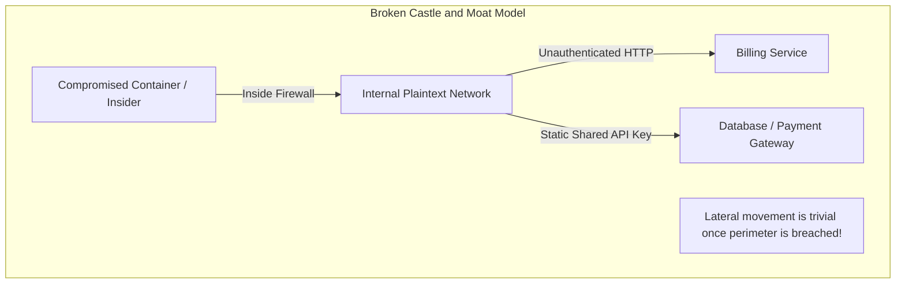
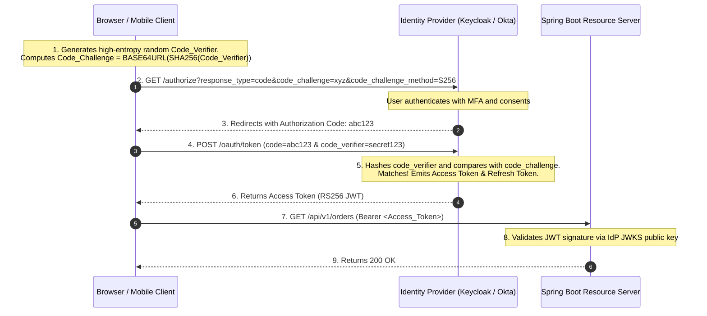
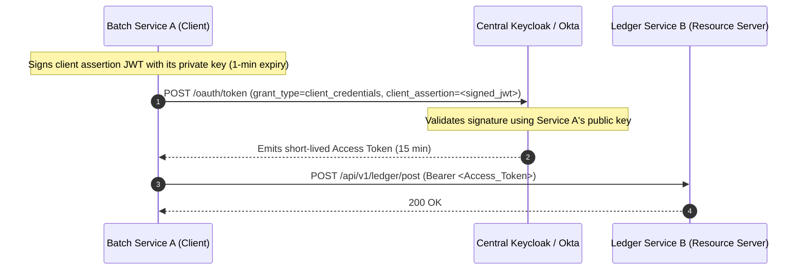
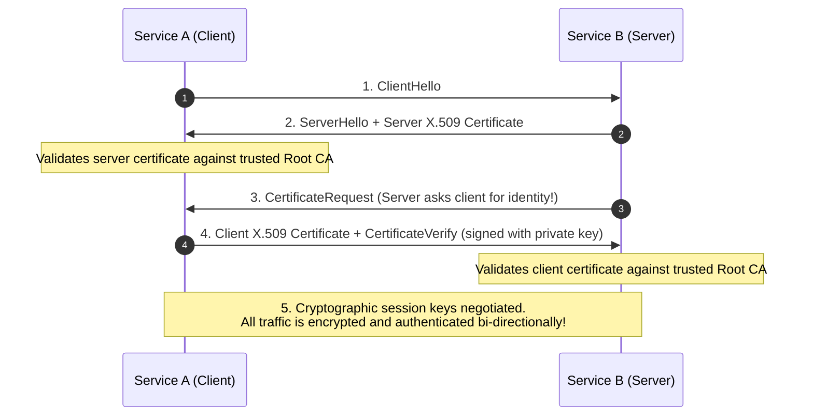
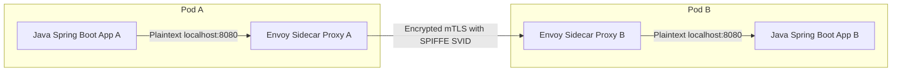

## 1. Mental Model: Beyond Static Secrets to Zero-Trust

In legacy architectures, systems relied on **Perimeter Security** (the "Castle and Moat" model):
- A corporate firewall or VPN guards the perimeter.
- Everything inside the internal network is implicitly trusted. Services communicate over plaintext HTTP using hardcoded database passwords or static API keys.



In modern **Zero-Trust Architecture** (NIST SP 800-207), the foundational axiom is:
> **"Never Trust, Always Verify."** Network locality confers zero trust. Every single request—whether between an end-user and an API, or between two internal microservices—must be **cryptographically authenticated, authorized, and encrypted in transit**.

---

## 2. OAuth 2.1 & OpenID Connect (OIDC) Protocol Stack

<CardGroup cols={2}>
  <Card title="OAuth 2.1 (Authorization)" icon="key">
    Delegated access protocol. Answers: **"What actions is this client allowed to perform on behalf of the user?"**
    Emits opaque or cryptographically signed **Access Tokens** with defined scopes (`orders:read`, `payment:write`).
  </Card>
  <Card title="OpenID Connect - OIDC (Identity)" icon="id-card">
    Identity layer built on top of OAuth 2.0. Answers: **"Who is the authenticated user?"**
    Emits an **ID Token** (JWT containing user profile claims: `sub`, `email`, `roles`).
  </Card>
</CardGroup>

### Key OAuth 2.1 Modern Security Changes:
1. **Deprecated**: The **Implicit Grant** (`response_type=token`) and **Resource Owner Password Credentials Grant** (`grant_type=password`) are completely removed due to token leakage in browser history and credential phishing risks.
2. **Mandatory PKCE**: Proof Key for Code Exchange is now required for **all** Authorization Code clients (Single-Page Apps, Mobile apps, and server-rendered web applications).

---

## 3. Authorization Code Flow with PKCE (RFC 7636)

Why was PKCE invented? On mobile devices and single-page apps (SPAs), an attacker can register a malicious custom URI scheme (e.g., `myapp://oauth-callback`) to intercept the authorization code returned by the Identity Provider.

PKCE eliminates code interception attacks using cryptographic challenge hashing:



### The PKCE Mathematical Handshake:
1. **Code Verifier**: A cryptographically random string between 43 and 128 characters using unreserved characters (`[A-Z]`, `[a-z]`, `[0-9]`, `-`, `.`, `_`, `~`).
2. **Code Challenge**:
   $$\text{Code\_Challenge} = \text{Base64UrlEncode}\left( \text{SHA-256}(\text{Code\_Verifier}) \right)$$
3. If an attacker intercepts the Authorization Code at Step 3, they cannot exchange it for an Access Token at Step 4 because they do not possess the original, unhashed `Code_Verifier`!

---

## 4. Machine-to-Machine (M2M) Security & Private Key JWT

When Service A calls Service B without human user intervention (e.g., a background batch payment reconciler calling the Ledger API), how do services authenticate?

### Anti-Pattern: Static Shared Client Secrets
Storing a static client secret (`client_secret=super-secret-password`) in Kubernetes secrets or environment variables means:
- Secrets inevitably leak into build logs, git repos, or container dumps.
- Rotating the secret requires restarting all consumer microservices simultaneously.

### Production Solution: Private Key JWT (RFC 7523)
Instead of sending a shared password across the network, Service A signs an ephemeral client assertion JWT using its own **asymmetric private key** (RS256 or ES256):



---

## 5. Zero-Trust Transport: Mutual TLS (mTLS) & SPIFFE/SPIRE

Even with JWT tokens, plaintext TCP traffic between microservices is vulnerable to packet sniffing, Man-in-the-Middle (MitM) spoofing, and ARP poisoning within cloud VPCs or Kubernetes clusters.

### Mutual TLS (mTLS) Handshake
In standard one-way TLS (browsers visiting HTTPS sites), only the server presents a certificate. In **Mutual TLS (mTLS)**, both the client and the server present and cryptographically verify each other's certificates:



### SPIFFE / SPIRE: The Standard for Workload Identity
Managing X.509 certificates manually across 1,000 microservice pods is operationally impossible. **SPIFFE (Secure Production Identity Framework for Everyone)** standardizes machine identities:

- **SPIFFE ID**: A URI specifying the workload's domain and namespace:
  `spiffe://cluster.internal/ns/production/sa/payment-service`
- **SVID (SPIFFE Verifiable Identity Document)**: A short-lived X.509 certificate automatically rotated every **1 hour** by a local **SPIRE Agent** daemonset without service restarts.

---

## 6. Service Mesh Architecture: Envoy & Istio

Rather than implementing mTLS and certificate rotation in Java application code, enterprises deploy a **Service Mesh** (Istio / Linkerd) powered by **Envoy Sidecars**:



### Istio L7 Authorization Policy Example
Declaratively enforce that **only** the `checkout-service` can call the `payment-service`:

```yaml
apiVersion: security.istio.io/v1beta1
kind: AuthorizationPolicy
metadata:
  name: payment-rbac-policy
  namespace: production
spec:
  selector:
    matchLabels:
      app: payment-service
  action: ALLOW
  rules:
  - from:
    - source:
        principals: ["spiffe://cluster.internal/ns/production/sa/checkout-service-sa"]
    to:
    - operation:
        methods: ["POST"]
        paths: ["/api/v1/payments/charge"]
```
If an attacker compromises an analytics container inside the Kubernetes cluster, Envoy drops any lateral network connection to the payment service with `RBAC: access denied` at the transport layer before it ever reaches Java code.

---

## 7. Production Spring Security 6 Resource Server Configuration

```java
package com.backend.mastery.security;

import org.springframework.context.annotation.Bean;
import org.springframework.context.annotation.Configuration;
import org.springframework.security.config.Customizer;
import org.springframework.security.config.annotation.method.configuration.EnableMethodSecurity;
import org.springframework.security.config.annotation.web.builders.HttpSecurity;
import org.springframework.security.config.annotation.web.configuration.EnableWebSecurity;
import org.springframework.security.config.http.SessionCreationPolicy;
import org.springframework.security.oauth2.server.resource.authentication.JwtAuthenticationConverter;
import org.springframework.security.oauth2.server.resource.authentication.JwtGrantedAuthoritiesConverter;
import org.springframework.security.web.SecurityFilterChain;

@Configuration
@EnableWebSecurity
@EnableMethodSecurity // Enables @PreAuthorize("hasRole('ADMIN')")
public class ResourceServerSecurityConfig {

    @Bean
    public SecurityFilterChain securityFilterChain(HttpSecurity http) throws Exception {
        return http
            .csrf(csrf -> csrf.disable()) // Stateless REST API
            .cors(Customizer.withDefaults())
            .sessionManagement(session -> 
                session.sessionCreationPolicy(SessionCreationPolicy.STATELESS)
            )
            .authorizeHttpRequests(auth -> auth
                .requestMatchers("/actuator/health", "/actuator/info").permitAll()
                .requestMatchers("/api/v1/public/**").permitAll()
                .requestMatchers("/api/v1/admin/**").hasRole("PLATFORM_ADMIN")
                .anyRequest().authenticated()
            )
            .oauth2ResourceServer(oauth2 -> oauth2
                .jwt(jwt -> jwt.jwtAuthenticationConverter(jwtAuthenticationConverter()))
            )
            .build();
    }

    @Bean
    public JwtAuthenticationConverter jwtAuthenticationConverter() {
        JwtGrantedAuthoritiesConverter grantedAuthoritiesConverter = new JwtGrantedAuthoritiesConverter();
        // Maps Keycloak realm roles or Okta groups from JWT claims
        grantedAuthoritiesConverter.setAuthoritiesClaimName("roles");
        grantedAuthoritiesConverter.setAuthorityPrefix("ROLE_");

        JwtAuthenticationConverter jwtAuthenticationConverter = new JwtAuthenticationConverter();
        jwtAuthenticationConverter.setJwtGrantedAuthoritiesConverter(grantedAuthoritiesConverter);
        return jwtAuthenticationConverter;
    }
}
```

---

## 8. Failure Modes & Edge Case Matrix

| Attack / Failure Mode | Root Cause | Impact | Production Defense |
| :--- | :--- | :--- | :--- |
| **Code Interception** | Mobile / SPA client lacks client secret | Stolen authorization code exchanged for token | Enforce PKCE (`code_challenge_method=S256`) on all authorization requests. |
| **Lateral Network Breach** | Plaintext HTTP internal network | Attacker pivots from breached container to payment DB | Implement mTLS with SPIFFE/SPIRE via Envoy sidecar service mesh. |
| **JWKS Key Rotation Blackout** | Resource Server caches public keys indefinitely | IdP rotates RS256 signing key; all client requests fail 401 | Configure Spring Security with automatic JWKS cache refresh TTL (e.g., 15m). |
| **BOLA / IDOR Attack** | Relying solely on token scopes without checking owner ID | User A reads User B's invoices (`GET /invoices/999`) | Enforce `@PreAuthorize("#userId == authentication.principal.claims['sub']")`. |

---

## 9. Senior Interview Questions & Active Recall

<AccordionGroup>
  <Accordion title="Why is Proof Key for Code Exchange (PKCE) necessary even for backend-rendered confidential clients?">
    While PKCE was originally invented to protect public clients (mobile apps and SPAs that cannot safely store a client secret), OAuth 2.1 mandates PKCE for confidential server-rendered clients as well. This prevents **Authorization Code Injection attacks**, where an attacker forces a victim to redeem a compromised authorization code belonging to the attacker, linking the victim's session to the attacker's account.
  </Accordion>
  <Accordion title="What is the difference between an ID Token and an Access Token?">
    An **ID Token** is an OpenID Connect (OIDC) artifact formatted strictly as a JWT intended solely for the **client application** to know who the user is (name, email, subject ID). It must never be used to make authorized API calls. An **Access Token** is an OAuth 2.0 credential designed for the **Resource Server** (backend API) to grant access to specific endpoints and scopes.
  </Accordion>
  <Accordion title="How does a Service Mesh (Istio / Envoy) enforce Zero-Trust without touching application code?">
    Envoy sidecars run in the same Linux network namespace as the application container. Using `iptables` PREROUTING and OUTPUT rules, all incoming and outgoing TCP packets are transparently diverted through Envoy. Envoy negotiates mTLS with peer sidecars using ephemeral SPIFFE X.509 certificates and evaluates L7 Authorization Policies before forwarding traffic over localhost plaintext to the application.
  </Accordion>
</AccordionGroup>

---

## 10. Done Checklist

<Check>
- [ ] Understand why perimeter "Castle and Moat" security is obsolete and state the core axiom of Zero-Trust.
- [ ] Contrast OAuth 2.1 (Authorization) with OpenID Connect (Identity).
- [ ] Diagram the complete Authorization Code Flow with PKCE and explain why `Code_Verifier` stops interception.
- [ ] Replace static shared passwords in M2M communications with Private Key JWT (RFC 7523).
- [ ] Explain the Mutual TLS (mTLS) handshake and how SPIFFE IDs model machine identity.
- [ ] Understand how Envoy sidecars transparently intercept traffic via `iptables` to enforce L7 access policies.
- [ ] Configure Spring Security 6 as a stateless OAuth 2.0 Resource Server with role mapping.
</Check>
