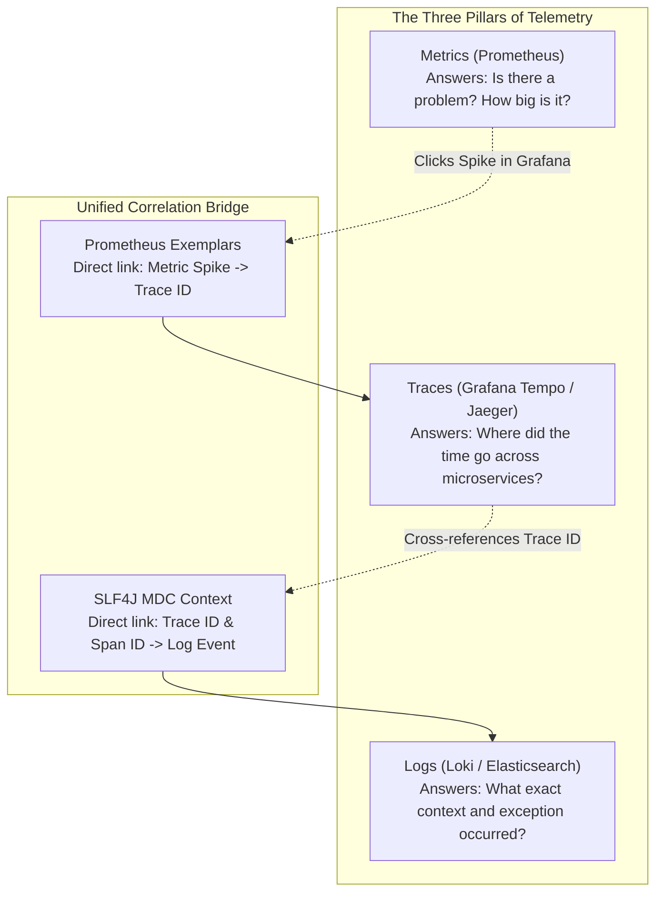
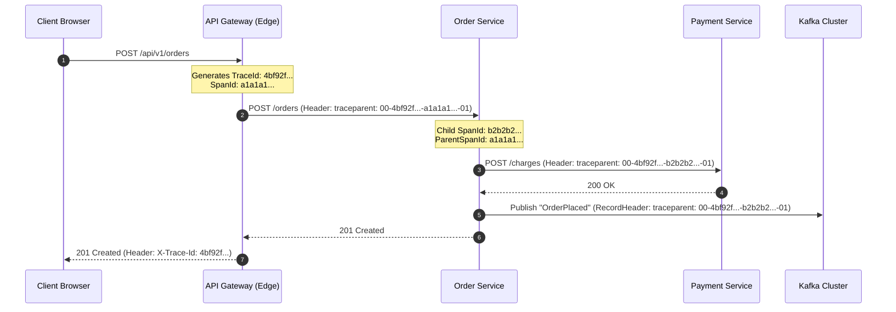
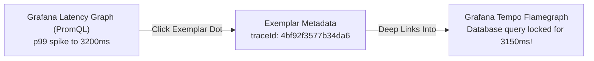
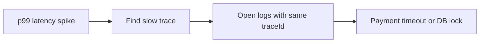

# Observability in Spring Boot 3

Observability means understanding the internal state of a production backend from its external outputs. When a distributed checkout fails or responds slowly, you cannot attach an IDE debugger to production pods. You need empirical evidence.

The modern observability stack combines three complementary telemetry pillars into a unified workflow:



---

## Spring Boot 3 Micrometer Observation API

In Spring Boot 2, metrics (`micrometer-core`) and distributed tracing (`spring-cloud-starter-sleuth`) were separate libraries with disparate APIs.

In Spring Boot 3, the **Micrometer Observation API** unifies metrics and tracing. You instrument your code once using an `Observation`. Micrometer automatically dispatches metrics (timers, counters) to Prometheus and span lifecycles to OpenTelemetry/Tempo.

### Maven Configuration

```xml
<dependencies>
    <!-- Actuator for Health & Metrics Endpoints -->
    <dependency>
        <groupId>org.springframework.boot</groupId>
        <artifactId>spring-boot-starter-actuator</artifactId>
    </dependency>

    <!-- Prometheus Meter Registry -->
    <dependency>
        <groupId>io.micrometer</groupId>
        <artifactId>micrometer-registry-prometheus</artifactId>
        <scope>runtime</scope>
    </dependency>

    <!-- OpenTelemetry Distributed Tracing Bridge -->
    <dependency>
        <groupId>io.micrometer</groupId>
        <artifactId>micrometer-tracing-bridge-otel</artifactId>
    </dependency>

    <!-- OTLP Trace Exporter (Pushes traces to Grafana Tempo or Jaeger) -->
    <dependency>
        <groupId>io.opentelemetry</groupId>
        <artifactId>opentelemetry-exporter-otlp</artifactId>
    </dependency>

    <!-- AOP for @Observed annotation -->
    <dependency>
        <groupId>org.springframework.boot</groupId>
        <artifactId>spring-boot-starter-aop</artifactId>
    </dependency>
</dependencies>
```

---

## Application Configuration (`application.yml`)

Configure Actuator, sampling probability, OpenTelemetry exporter endpoints, and Prometheus exemplar support:

```yaml application.yml
server:
  port: 8080

management:
  endpoints:
    web:
      exposure:
        include: health,info,metrics,prometheus
  endpoint:
    health:
      show-details: when_authorized
      probes:
        enabled: true
    prometheus:
      access: unrestricted
  metrics:
    tags:
      application: ${spring.application.name:order-service}
      environment: ${ENVIRONMENT:production}
    distribution:
      percentiles-histogram:
        http.server.requests: true # Enables histogram buckets for p95/p99 latency
      slo:
        http.server.requests: 50ms, 100ms, 250ms, 500ms, 1s, 2s
  tracing:
    sampling:
      probability: 1.0 # Sample 100% in dev/staging; tune to 0.05 (5%) in high-scale prod
  otlp:
    tracing:
      endpoint: http://tempo:4318/v1/traces # OTLP HTTP receiver endpoint
```

Configuration line by line:

- `management.endpoints.web.exposure.include` controls which Actuator endpoints are reachable over HTTP.
- `health.probes.enabled: true` creates Kubernetes-friendly liveness/readiness probe groups.
- `prometheus.access: unrestricted` exposes scrape data; protect it at the network or gateway layer in production.
- `metrics.tags.application` adds a stable service label to every metric.
- `metrics.tags.environment` separates production, staging, and local telemetry.
- `percentiles-histogram.http.server.requests: true` enables histogram buckets required for Prometheus p95/p99 calculations.
- `slo.http.server.requests` defines latency buckets aligned with service objectives.
- `tracing.sampling.probability` controls how many traces are recorded. High-scale production usually samples below 100%.
- `otlp.tracing.endpoint` points to the trace collector, such as Tempo or Jaeger.

---

## Instrumenting Code with `ObservationRegistry`

You can instrument business operations either declaratively using `@Observed` or programmatically with `ObservationRegistry`.

### 1. Declarative Instrumentation with `@Observed`

First, register the `ObservedAspect` bean:

```java
package com.example.backend.config;

import io.micrometer.observation.ObservationRegistry;
import io.micrometer.observation.aop.ObservedAspect;
import org.springframework.context.annotation.Bean;
import org.springframework.context.annotation.Configuration;

@Configuration(proxyBeanMethods = false)
public class ObservationConfig {

    @Bean
    public ObservedAspect observedAspect(ObservationRegistry observationRegistry) {
        return new ObservedAspect(observationRegistry);
    }
}
```

Observation line by line:

- `Observation.createNotStarted(...)` defines the operation name before starting measurement.
- `lowCardinalityKeyValue("customer.tier", "vip")` is safe for metrics because the value set is small.
- `lowCardinalityKeyValue("currency", "USD")` is another bounded label.
- `highCardinalityKeyValue("customer.id", customerId)` belongs in traces, not metric labels, because it may be unique per user.
- `.observe(() -> { ... })` starts timing, records errors, closes the span, and returns the callback result.

Proof task:

```console
Call processPayment.
Check Prometheus for payment_gateway_charge metrics with currency/customer.tier labels.
Open a trace and verify customer.id appears there.
Confirm customer.id is not a Prometheus label.
```

Annotate any service method. Spring automatically creates a tracing span and records execution duration in Prometheus:

```java
package com.example.backend.order;

import io.micrometer.observation.annotation.Observed;
import org.springframework.stereotype.Service;

@Service
public class OrderService {

    @Observed(name = "order.placement", 
              contextualName = "place-order-operation", 
              lowCardinalityKeyValues = {"order.type", "retail"})
    public OrderResponse placeOrder(CreateOrderRequest request) {
        // Business logic execution...
        return new OrderResponse("ORD-9872", "CONFIRMED");
    }
}
```

### 2. Programmatic Instrumentation (For Fine-Grained Context)

When you need dynamic tags, error auditing, or precise boundary control:

```java
package com.example.backend.payment;

import io.micrometer.observation.Observation;
import io.micrometer.observation.ObservationRegistry;
import org.slf4j.Logger;
import org.slf4j.LoggerFactory;
import org.springframework.stereotype.Service;

@Service
public class PaymentGatewayClient {

    private static final Logger log = LoggerFactory.getLogger(PaymentGatewayClient.class);
    private final ObservationRegistry observationRegistry;

    public PaymentGatewayClient(ObservationRegistry observationRegistry) {
        this.observationRegistry = observationRegistry;
    }

    public ChargeResult processPayment(String customerId, long amountCents) {
        // Create an observation with low-cardinality tags (safe for Prometheus indexes)
        return Observation.createNotStarted("payment.gateway.charge", observationRegistry)
                .lowCardinalityKeyValue("customer.tier", "vip")
                .lowCardinalityKeyValue("currency", "USD")
                .highCardinalityKeyValue("customer.id", customerId) // Included in Traces, omitted from Metrics
                .observe(() -> {
                    log.info("Dispatching charge request of {} cents", amountCents);
                    // Remote HTTP or SDK call...
                    return new ChargeResult("ch_9934812", true);
                });
    }
}
```

<Tip>
**Low-Cardinality vs High-Cardinality Tags**:
- **Low-Cardinality**: Finite set of values (e.g., HTTP method, status code, region). Safe for Prometheus metrics without causing memory exhaustion.
- **High-Cardinality**: Unique values (e.g., `user_id`, `order_id`, `email`). Sent **only** to distributed tracing spans, never to Prometheus metric labels.
</Tip>

---

## W3C Distributed Tracing & Context Propagation

In distributed microservices, a single user click triggers a cascading tree of network requests. Distributed tracing correlates all operations using the standard W3C `traceparent` HTTP header.

### The W3C `traceparent` Header Format

```http
traceparent: 00-4bf92f3577b34da6a3ce929d0e0e4736-00f067aa0ba902b7-01
             │  └───────────────┬──────────────┘ └───────┬───────┘ └─┬┘
             │             Trace ID (32 hex)        Parent Span ID   Flags
          Version                                      (16 hex)   (01 = sampled)
```



### Automatic Context Propagation with `RestClient`

In Spring Boot 3.2+, use `RestClient.Builder`. Spring automatically configures the tracing interceptor that injects the W3C `traceparent` header into every outbound HTTP request:

```java
package com.example.backend.config;

import org.springframework.context.annotation.Bean;
import org.springframework.context.annotation.Configuration;
import org.springframework.web.client.RestClient;

@Configuration(proxyBeanMethods = false)
public class RestClientConfig {

    // Spring auto-injects RestClient.Builder with Micrometer tracing interceptors attached
    @Bean
    public RestClient paymentRestClient(RestClient.Builder builder) {
        return builder
                .baseUrl("https://payment.internal.net")
                .build();
    }
}
```

---

## Structured JSON Logging & MDC Auto-Injection

Plain text logs are impossible to query across hundreds of pods. Production systems require **Structured JSON Logging** where `traceId` and `spanId` are automatically injected into SLF4J MDC.

### 1. Logback Configuration (`logback-spring.xml`)

```xml
<?xml version="1.0" encoding="UTF-8"?>
<configuration>
    <include resource="org/springframework/boot/logging/logback/defaults.xml"/>

    <appender name="CONSOLE" class="ch.qos.logback.core.ConsoleAppender">
        <encoder class="net.logstash.logback.encoder.LoggingEventCompositeJsonEncoder">
            <providers>
                <timestamp>
                    <timeZone>UTC</timeZone>
                </timestamp>
                <pattern>
                    <pattern>
                        {
                            "severity": "%level",
                            "service": "${spring.application.name:-backend}",
                            "traceId": "%X{traceId:-}",
                            "spanId": "%X{spanId:-}",
                            "thread": "%thread",
                            "logger": "%logger{36}",
                            "message": "%message"
                        }
                    </pattern>
                </pattern>
                <stackTrace>
                    <throwableConverter class="net.logstash.logback.stacktrace.ShortenedThrowableConverter">
                        <maxDepthPerThrowable>30</maxDepthPerThrowable>
                        <maxLength>2048</maxLength>
                        <rootCauseFirst>true</rootCauseFirst>
                    </throwableConverter>
                </stackTrace>
            </providers>
        </encoder>
    </appender>

    <root level="INFO">
        <appender-ref ref="CONSOLE"/>
    </root>
</configuration>
```

### Production Output Sample

```json
{
  "@timestamp": "2026-09-10T14:32:10.192Z",
  "severity": "INFO",
  "service": "order-service",
  "traceId": "4bf92f3577b34da6a3ce929d0e0e4736",
  "spanId": "00f067aa0ba902b7",
  "thread": "http-nio-8080-exec-3",
  "logger": "c.e.b.o.OrderService",
  "message": "Order ORD-9872 placed successfully for amount 12500"
}
```

---

## Prometheus Exemplars: Linking Metrics Directly to Traces

One of the most powerful advances in modern observability is **Prometheus Exemplars**. 

Traditionally, when looking at a Prometheus graph showing a latency spike (e.g., p99 latency jumping to 3.5s), you had to guess which trace in Jaeger or Tempo was responsible. 

**Exemplars** attach a specific `trace_id` to individual metric samples. In Grafana, the latency graph displays dots representing individual slow requests. Clicking a dot opens the exact distributed trace flamegraph instantly.



### Actuator Output with Exemplars (`/actuator/prometheus`)

Notice the `# {trace_id="..."}` annotation at the end of the histogram bucket:

```prometheus
# HELP http_server_requests_seconds Duration of HTTP server requests
# TYPE http_server_requests_seconds histogram
http_server_requests_seconds_bucket{exception="none",method="POST",outcome="SUCCESS",status="200",uri="/api/v1/orders",le="2.0"} 12410
http_server_requests_seconds_bucket{exception="none",method="POST",outcome="SUCCESS",status="200",uri="/api/v1/orders",le="5.0"} 12412 # {trace_id="4bf92f3577b34da6a3ce929d0e0e4736"} 3.128 1725978730.120
```

---

## The Google SRE 4 Golden Signals & PromQL Queries

Instrumenting a service is useless without knowing which queries define system health. Apply the **Four Golden Signals**:

| Signal | Definition | Production PromQL Query |
| :--- | :--- | :--- |
| **1. Latency** | Time taken to service a request (differentiating successes from errors). | `histogram_quantile(0.95, sum(rate(http_server_requests_seconds_bucket[5m])) by (le, uri))` |
| **2. Traffic** | Demand placed on the system (requests per second). | `sum(rate(http_server_requests_seconds_count[5m])) by (uri)` |
| **3. Errors** | Rate of requests that fail (HTTP 5xx or unhandled exceptions). | `sum(rate(http_server_requests_seconds_count{status=~"5.."}[5m])) / sum(rate(http_server_requests_seconds_count[5m])) * 100` |
| **4. Saturation** | Fraction of the most constrained resource in use (HikariCP pool, CPU, heap). | `hikaricp_connections_active / hikaricp_connections_max` |

---

## Production SRE Multi-Window Multi-Burn-Rate Alerting

Simple threshold alerts (e.g., `CPU > 80%`) generate alert fatigue. Modern SRE practices use **Error Budget Multi-Burn-Rate Alerting**.

Suppose your SLO is **99.9% availability over 30 days** (error budget = 0.1%).

- A **14.4x burn rate** consumes **2% of your monthly error budget in 1 hour**. This warrants an immediate page (SEV-1/SEV-2).
- A **6x burn rate** consumes **5% of your error budget in 6 hours**. This creates a high-priority ticket for working hours.

```yaml prometheus-alerts.yml
groups:
  - name: order-service-slo-alerts
    rules:
      # Page immediately: 14.4x burn rate over 1h and 5m windows
      - alert: HighErrorRatePage
        expr: |
          (
            sum(rate(http_server_requests_seconds_count{status=~"5..",uri="/api/v1/orders"}[1h]))
            /
            sum(rate(http_server_requests_seconds_count{uri="/api/v1/orders"}[1h]))
          ) > (14.4 * 0.001)
          and
          (
            sum(rate(http_server_requests_seconds_count{status=~"5..",uri="/api/v1/orders"}[5m]))
            /
            sum(rate(http_server_requests_seconds_count{uri="/api/v1/orders"}[5m]))
          ) > (14.4 * 0.001)
        for: 2m
        labels:
          severity: page
          tier: critical
        annotations:
          summary: "Order Service burning error budget at 14.4x rate"
          description: "High error rate consumes >2% of 30-day budget in 1 hour. Immediate mitigation required."

      # Ticket alert: 6x burn rate over 6h and 30m windows
      - alert: ModerateErrorRateTicket
        expr: |
          (
            sum(rate(http_server_requests_seconds_count{status=~"5..",uri="/api/v1/orders"}[6h]))
            /
            sum(rate(http_server_requests_seconds_count{uri="/api/v1/orders"}[6h]))
          ) > (6 * 0.001)
          and
          (
            sum(rate(http_server_requests_seconds_count{status=~"5..",uri="/api/v1/orders"}[30m]))
            /
            sum(rate(http_server_requests_seconds_count{uri="/api/v1/orders"}[30m]))
          ) > (6 * 0.001)
        for: 15m
        labels:
          severity: ticket
        annotations:
          summary: "Order Service moderate error rate"
          description: "Continuous degradation burning >5% of monthly budget over 6 hours."
```

---

## Observability Fundamentals Interview Map

Observability is how you debug production without a debugger.

### 1. Logs vs metrics vs traces

| Signal | Answers | Example |
| :--- | :--- | :--- |
| Logs | What happened in this code path? | exception, order ID, reason |
| Metrics | Is the system healthy over time? | error rate, p99 latency, saturation |
| Traces | Where did one request spend time? | gateway to order to payment to database |



### 2. RED and USE

For request-driven services, track RED:

- Rate: requests per second.
- Errors: failed requests.
- Duration: latency distribution.

For resources, track USE:

- Utilization: how busy.
- Saturation: queued work.
- Errors: failed operations.

### 3. Why averages lie

If 95 requests take `20ms` and 5 requests take `10s`, the average may look tolerable while real users suffer.

Use percentiles:

- p50: typical user.
- p95: slow tail.
- p99: worst regular pain.

### 4. Cardinality can kill metrics

Bad metric tag:

```java
registry.counter("checkout", "userId", userId).increment();
```

Every unique user creates a new time series. Prometheus memory can explode.

Good metric tags:

```java
registry.counter("checkout", "status", "success", "region", "us-east").increment();
```

Put high-cardinality values like user ID and order ID into traces or logs, not metric labels.

### Build-Break-Fix Lab

<Steps>
  <Step title="Build">
    Add metrics, logs, and traces to checkout and payment calls.
  </Step>
  <Step title="Break">
    Add `userId` as a metric tag and remove trace propagation on an async task.
  </Step>
  <Step title="Observe">
    Watch time-series cardinality grow and logs lose correlation.
  </Step>
  <Step title="Fix">
    Move user IDs to trace/log context and propagate MDC or tracing context across async boundaries.
  </Step>
  <Step title="Prove">
    Write an integration test that scrapes `/actuator/prometheus` and asserts expected low-cardinality labels.
  </Step>
</Steps>

---

## Production Antipatterns Checklist

<AccordionGroup>
  <Accordion title="1. High-Cardinality Tags in Prometheus Metrics">
    **Antipattern**: Adding `orderId`, `email`, or `ipAddress` as tags to `Counter` or `Timer`.
    
    **Impact**: Every unique value creates a new time series in Prometheus RAM. Ten million orders generate ten million time series, causing Prometheus Out-Of-Memory crashes (`OOMKilled`).
    
    **Solution**: Use low-cardinality tags for metrics (`status`, `method`, `tier`). Pass high-cardinality tags exclusively to distributed tracing spans.
  </Accordion>

  <Accordion title="2. Missing Context Across Asynchronous Thread Pools">
    **Antipattern**: Offloading tasks to `@Async` or `CompletableFuture` without propagating SLF4J MDC.
    
    **Impact**: Logs emitted by worker threads lose their `traceId` and `spanId`, breaking end-to-end log correlation.
    
    **Solution**: Configure Spring's `ThreadPoolTaskExecutor` with a `TaskDecorator` that copies MDC context across thread boundaries.
  </Accordion>

  <Accordion title="3. 100% Trace Sampling in High-Volume Production">
    **Antipattern**: Leaving `management.tracing.sampling.probability=1.0` in a system handling 50,000 QPS.
    
    **Impact**: Ingesting and storing 50,000 traces per second overwhelms your network and costs thousands of dollars in storage fees on Tempo/Datadog.
    
    **Solution**: Sample 1% to 5% (`0.01` to `0.05`) of normal traffic, with adaptive head/tail sampling that always captures 100% of HTTP 5xx errors and slow requests.
  </Accordion>

  <Accordion title="4. Alerting on Averages Instead of Percentiles">
    **Antipattern**: Setting alerts on average response time (`avg(http_server_requests)`).
    
    **Impact**: Averages hide catastrophic outliers. If 95% of requests take 10ms but 5% take 15 seconds, the average might appear healthy at 750ms while hundreds of users abandon checkout.
    
    **Solution**: Always monitor and alert on **p95 and p99 percentiles** calculated from histograms.
  </Accordion>
</AccordionGroup>

---

## Staff-Level Interview Questions & Answers

### Q1: How does Spring Boot 3 connect a Prometheus metric spike to a specific trace in Grafana Tempo?
**Answer**:
Through **OpenMetrics Exemplars**. When an observation completes, the Micrometer Prometheus registry samples the active span context from the tracing tracer. If the sample meets the exemplar reservation criteria, it attaches the 32-character hexadecimal `trace_id` as metadata to the histogram bucket entry. When Prometheus scrapes `/actuator/prometheus` with the `application/openmetrics-text` content type, it stores this exemplar metadata alongside the metric. In Grafana, queries configured with exemplar support render interactive dots on time-series panels that link directly to Tempo using the extracted `trace_id`.

### Q2: What is the difference between Head-Based Sampling and Tail-Based Sampling in distributed tracing?
**Answer**:
- **Head-Based Sampling**: The sampling decision is made at the ingress root span (e.g., API Gateway) before the request begins execution. It is lightweight and requires minimal memory, but risks discarding the traces of rare downstream failures or unexpected latency spikes.
- **Tail-Based Sampling**: A collector buffers received spans and applies a policy after a decision window. Policies can retain traces with an error span status or high latency. HTTP status codes are attributes; OpenTelemetry span status is a separate field. Missing spans, upstream head sampling, late arrivals, memory pressure, or collector failure can still lose relevant traces. Route spans from the same trace to the same sampling instance and monitor dropped spans. Tail sampling cannot guarantee capture of every incident. See [OpenTelemetry sampling trade-offs](https://opentelemetry.io/docs/concepts/sampling/).

### Q3: Why is HikariCP active connection saturation more dangerous than high CPU utilization?
**Answer**:
High CPU typically degrades throughput gracefully: requests take longer as threads share CPU time slices. HikariCP connection pool exhaustion, however, causes a **cliff-edge failure**. Once all pool connections are held, incoming worker threads block on the pool's internal handoff queue. When waiting exceeds `connectionTimeout` (typically 30 seconds), the pool throws `SQLTransientConnectionException`, immediately failing thousands of requests simultaneously and causing cascading timeouts throughout the upstream gateway.

---

## Practice Task: Build an Observable Payment Pipeline

Implement full production observability for a Spring Boot payment service:

1. Add Actuator, Micrometer Prometheus, and OpenTelemetry dependencies.
2. Create an `ObservationHandler` that records the business status (`SUCCESS`, `DECLINED`, `FRAUD_BLOCKED`) as low-cardinality metric tags.
3. Configure `logback-spring.xml` with JSON formatting and MDC trace correlation.
4. Set up an automated integration test using Testcontainers that calls the service, scrapes `/actuator/prometheus`, and asserts that:
   - The metric `payment.gateway.charge` exists.
   - The histogram contains valid bucket intervals.
   - The exemplar `# {trace_id="..."}` is present in the scraped output.

---

## Done Checklist

<Check>
  - [x] Implemented Spring Boot 3 Micrometer Observation API for unified metrics and traces.
  - [x] Configured declarative `@Observed` aspect and fine-grained programmatic observations.
  - [x] Mastered W3C `traceparent` context propagation across HTTP boundaries.
  - [x] Configured structured JSON logging with automated MDC `traceId` and `spanId` injection.
  - [x] Linked Prometheus metrics directly to Grafana Tempo traces via OpenMetrics Exemplars.
  - [x] Defined production PromQL queries for the Google SRE Four Golden Signals.
  - [x] Formulated multi-window multi-burn-rate alerts based on error budget depletion.
  - [x] Documented Staff-level interview questions and production antipatterns.
</Check>
