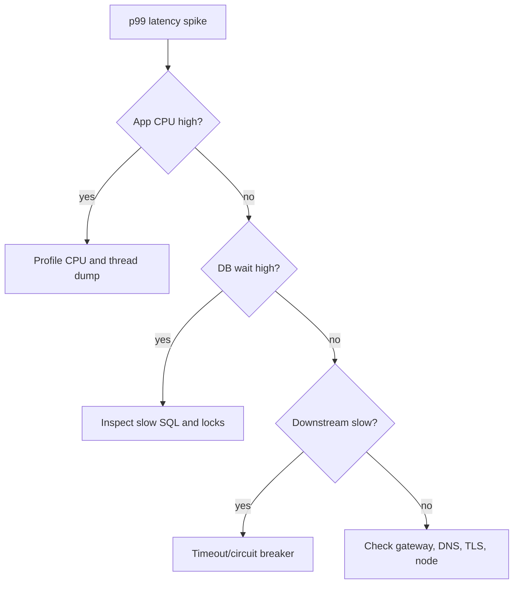

# Production Debugging Cookbook

This cookbook is for the moment when something is broken and everyone is looking at the backend engineer.

The rule:


Do not start by guessing. Start by narrowing the failure surface.

---

## Universal First Five Minutes

| Step | Question | Evidence |
| --- | --- | --- |
| 1 | Who is impacted? | error rate by route, tenant, region |
| 2 | What changed? | deploys, migrations, config, traffic spike |
| 3 | Which golden signal moved first? | latency, traffic, errors, saturation |
| 4 | What resource is exhausted? | CPU, memory, threads, DB pool, disk, queue |
| 5 | What mitigation reduces impact now? | rollback, scale, circuit break, disable feature |

Fast commands:

```bash
kubectl get pods -n prod
kubectl get events -n prod --sort-by=.lastTimestamp
kubectl logs deployment/orders-api -n prod --since=15m
kubectl top pods -n prod
kubectl rollout history deployment/orders-api -n prod
```

Database snapshot:

```sql
SELECT state, wait_event_type, wait_event, count(*)
FROM pg_stat_activity
GROUP BY state, wait_event_type, wait_event
ORDER BY count(*) DESC;
```

---

## Runbook 1: API Latency Spike

Symptoms:

- p95 or p99 latency rises.
- Error rate may still be low at first.
- Tomcat threads, DB pool, or downstream calls become saturated.



First checks:

```bash
kubectl top pods -n prod
kubectl logs deployment/orders-api -n prod --since=10m | rg "timeout|Connection|Exception|ERROR"
```

PromQL examples:

```promql
histogram_quantile(0.99, sum(rate(http_server_requests_seconds_bucket[5m])) by (le, uri))
sum(rate(http_server_requests_seconds_count{status=~"5.."}[5m])) by (uri)
max(hikaricp_connections_active) by (pool)
```

Root causes:

| Evidence | Likely cause | Mitigation |
| --- | --- | --- |
| CPU high, thread stacks in JSON serialization | response too large | paginate, reduce payload, cache |
| Threads waiting on DB | slow query or lock | cancel blocker, tune query |
| Threads waiting on HTTP client | downstream outage | open circuit, lower timeout |
| Queue depth rising | consumers too slow | scale workers, isolate poison records |

Permanent fixes:

- Add route-level latency SLOs.
- Add downstream timeout budgets.
- Add query plan regression tests for critical SQL.
- Add bulkheads for slow dependencies.

---

## Runbook 2: HikariCP Connection Pool Exhausted

Symptoms:

```log
HikariPool-1 - Connection is not available, request timed out after 30000ms.
```

First checks:

```promql
hikaricp_connections_active
hikaricp_connections_pending
hikaricp_connections_timeout_total
```

PostgreSQL:

```sql
SELECT pid,
       state,
       wait_event_type,
       wait_event,
       now() - query_start AS age,
       left(query, 120) AS query
FROM pg_stat_activity
WHERE datname = current_database()
ORDER BY age DESC;
```

Decision tree:

| Finding | Meaning | Action |
| --- | --- | --- |
| many `idle in transaction` | code opened transaction and stopped | find caller, terminate worst sessions |
| many active long queries | query too slow | inspect plan, add index, reduce result |
| many lock waits | blocker exists | run lock tree query |
| app pending connections high | app demand exceeds pool | reduce transaction time, tune pool carefully |

Lock tree:

```sql
SELECT blocked.pid AS blocked_pid,
       blocker.pid AS blocker_pid,
       blocked.query AS blocked_query,
       blocker.query AS blocker_query
FROM pg_stat_activity blocked
JOIN pg_locks blocked_locks
  ON blocked_locks.pid = blocked.pid
JOIN pg_locks blocker_locks
  ON blocker_locks.locktype = blocked_locks.locktype
 AND blocker_locks.database IS NOT DISTINCT FROM blocked_locks.database
 AND blocker_locks.relation IS NOT DISTINCT FROM blocked_locks.relation
 AND blocker_locks.page IS NOT DISTINCT FROM blocked_locks.page
 AND blocker_locks.tuple IS NOT DISTINCT FROM blocked_locks.tuple
 AND blocker_locks.transactionid IS NOT DISTINCT FROM blocked_locks.transactionid
 AND blocker_locks.classid IS NOT DISTINCT FROM blocked_locks.classid
 AND blocker_locks.objid IS NOT DISTINCT FROM blocked_locks.objid
 AND blocker_locks.objsubid IS NOT DISTINCT FROM blocked_locks.objsubid
 AND blocker_locks.pid <> blocked_locks.pid
JOIN pg_stat_activity blocker
  ON blocker.pid = blocker_locks.pid
WHERE NOT blocked_locks.granted
  AND blocker_locks.granted;
```

Immediate mitigation:

```sql
SELECT pg_cancel_backend(<pid>);
```

Use `pg_terminate_backend` only when cancellation fails and impact justifies killing the session.

Permanent fixes:

- Keep external HTTP calls outside transactions.
- Add `spring.datasource.hikari.leak-detection-threshold`.
- Set database `statement_timeout`.
- Alert on pending Hikari connections.
- Review `REQUIRES_NEW` nested transaction usage.

---

## Runbook 3: PostgreSQL CPU 100%

Symptoms:

- Database CPU stays high.
- Query latency rises.
- Application may show connection pool waits.

Find top active queries:

```sql
SELECT pid,
       now() - query_start AS age,
       wait_event_type,
       wait_event,
       left(query, 200) AS query
FROM pg_stat_activity
WHERE state = 'active'
ORDER BY age DESC;
```

If `pg_stat_statements` is enabled:

```sql
SELECT calls,
       total_exec_time,
       mean_exec_time,
       rows,
       left(query, 180) AS query
FROM pg_stat_statements
ORDER BY total_exec_time DESC
LIMIT 10;
```

Plan check:

```sql
EXPLAIN (ANALYZE, BUFFERS)
SELECT *
FROM orders
WHERE status = 'PAID'
ORDER BY created_at DESC
LIMIT 50;
```

Common causes:

| Evidence | Cause | Fix |
| --- | --- | --- |
| sequential scan on large table | missing or unusable index | add correct composite index |
| rows removed by filter is huge | poor selectivity or wrong predicate | rewrite query |
| sort spills to disk | low `work_mem` or missing index order | index for order or tune carefully |
| high calls with small query | chatty application | batch or cache |
| CPU high after deploy | query shape changed | rollback or hotfix query |

---

## Runbook 4: Lock Queue Or Deadlock

Symptoms:

```log
ERROR: deadlock detected
```

or:

```log
canceling statement due to lock timeout
```

Find blocked sessions:

```sql
SELECT pid,
       pg_blocking_pids(pid) AS blocking_pids,
       wait_event_type,
       wait_event,
       now() - query_start AS age,
       left(query, 160) AS query
FROM pg_stat_activity
WHERE cardinality(pg_blocking_pids(pid)) > 0
ORDER BY age DESC;
```

Mistakes:

| Mistake | Result | Fix |
| --- | --- | --- |
| Long report on primary during migration | DDL queues and blocks traffic | read replica and lock timeout |
| Updating rows in different orders | deadlock | canonical ordering |
| Missing FK index | parent delete locks too much | index foreign key |
| Giant update | long locks, WAL spike, bloat | chunked backfill |

Safe migration guard:

```sql
SET lock_timeout = '2s';
SET statement_timeout = '10s';
```

---

## Runbook 5: JVM Memory Leak Or OOMKilled

Symptoms:

```bash
kubectl describe pod orders-api-abc -n prod
```

Look for:

```log
Reason: OOMKilled
Exit Code: 137
```

First checks:

```bash
kubectl top pod orders-api-abc -n prod
kubectl logs orders-api-abc -n prod --previous
jcmd <pid> GC.heap_info
jcmd <pid> VM.native_memory summary
```

Heap dump on OOM:

```bash
-XX:+HeapDumpOnOutOfMemoryError
-XX:HeapDumpPath=/dumps
```

Common retained objects:

| Retained object | Likely bug |
| --- | --- |
| huge `ArrayList` | unbounded query result |
| many DTO strings | response aggregation |
| `ThreadLocalMap` values | missing cleanup |
| cache entries | unbounded cache or missing TTL |
| byte arrays | file upload loaded into heap |

Kubernetes memory rule:

```yaml
env:
  - name: JAVA_TOOL_OPTIONS
    value: "-XX:MaxRAMPercentage=75.0 -XX:+ExitOnOutOfMemoryError"
resources:
  requests:
    memory: "512Mi"
  limits:
    memory: "1Gi"
```

---

## Runbook 6: Kubernetes Service Returns 503

Symptoms:

- Gateway returns `503`.
- Pods look running.
- Service has no ready endpoints.

Commands:

```bash
kubectl get svc orders-api -n prod -o wide
kubectl get endpointslice -n prod -l kubernetes.io/service-name=orders-api
kubectl describe svc orders-api -n prod
kubectl get pods -n prod --show-labels
kubectl describe pod orders-api-abc -n prod
```

Decision table:

| Evidence | Cause | Fix |
| --- | --- | --- |
| Service selector does not match pod labels | no endpoints | correct labels/selectors |
| readiness probe failing | pod removed from endpoints | fix dependency/readiness endpoint |
| container port mismatch | traffic to wrong port | align targetPort/containerPort |
| NetworkPolicy denies traffic | packets blocked | allow namespace/pod ingress |
| Ingress route wrong | wrong backend service | fix ingress backend |

Probe example:

```yaml
readinessProbe:
  httpGet:
    path: /actuator/health/readiness
    port: 8080
  periodSeconds: 5
  timeoutSeconds: 2
  failureThreshold: 3
livenessProbe:
  httpGet:
    path: /actuator/health/liveness
    port: 8080
  periodSeconds: 10
  timeoutSeconds: 2
  failureThreshold: 6
```

---

## Runbook 7: CrashLoopBackOff

Symptoms:

```bash
kubectl get pods -n prod
```

shows:

```log
CrashLoopBackOff
```

Commands:

```bash
kubectl logs pod/orders-api-abc -n prod --previous
kubectl describe pod orders-api-abc -n prod
kubectl get events -n prod --sort-by=.lastTimestamp
```

Common causes:

| Evidence | Cause | Fix |
| --- | --- | --- |
| config bind failure | missing env var | add Secret/ConfigMap |
| permission denied | non-root cannot write path | use writable volume or correct ownership |
| OOMKilled | memory limit too low or leak | tune JVM or fix leak |
| liveness kills during startup | probe too aggressive | add startup probe |
| image pull error | bad image/tag/secret | fix registry credential or tag |

---

## Runbook 8: JWT Or Login Failure

Symptoms:

- Users see `401 Unauthorized`.
- Tokens look present.
- Failure appears after key rotation or deploy.

Check token claims:

```json
{
  "iss": "https://auth.example.com",
  "aud": "orders-api",
  "sub": "user-123",
  "exp": 1799459200,
  "kid": "auth-key-2026-09"
}
```

Checklist:

| Check | Failure |
| --- | --- |
| `iss` matches expected issuer | wrong environment auth server |
| `aud` contains this API | token minted for another service |
| `exp` not expired | clock skew or stale token |
| `kid` exists in JWKS | key rotation mismatch |
| algorithm is allowed | algorithm confusion defense |
| authorities mapped correctly | `ROLE_` prefix mismatch |

Spring Security debug:

```yaml
logging:
  level:
    org.springframework.security: DEBUG
```

Do not leave verbose security logs enabled permanently in production.

---

## Runbook 9: CORS Failure

Browser symptom:

```log
Access to fetch at 'https://api.example.com/orders' from origin 'https://app.example.com'
has been blocked by CORS policy.
```

Remember:

- CORS is enforced by browsers.
- CORS is not authentication.
- CORS is not authorization.
- Server-to-server calls do not use browser CORS.

Preflight request:

```http
OPTIONS /api/orders HTTP/1.1
Origin: https://app.example.com
Access-Control-Request-Method: POST
Access-Control-Request-Headers: authorization,content-type
```

Safe Spring configuration:

```java
@Bean
CorsConfigurationSource corsConfigurationSource() {
    CorsConfiguration config = new CorsConfiguration();
    config.setAllowedOrigins(List.of("https://app.example.com"));
    config.setAllowedMethods(List.of("GET", "POST", "PUT", "PATCH", "DELETE"));
    config.setAllowedHeaders(List.of("Authorization", "Content-Type"));
    config.setAllowCredentials(true);

    UrlBasedCorsConfigurationSource source = new UrlBasedCorsConfigurationSource();
    source.registerCorsConfiguration("/api/**", config);
    return source;
}
```

Danger:

```java
config.setAllowedOrigins(List.of("*"));
config.setAllowCredentials(true);
```

Wildcard origins and credentials are not a safe production pair.

---

## Runbook 10: Kafka Consumer Lag

Symptoms:

- Consumer lag rises.
- Processing delay increases.
- One partition may be stuck while others drain.

Commands:

```bash
kafka-consumer-groups.sh \
  --bootstrap-server kafka:9092 \
  --describe \
  --group notification-workers
```

Decision table:

| Evidence | Cause | Fix |
| --- | --- | --- |
| one partition stuck | poison record | DLT/error handler |
| all partitions lagging | consumers too slow | scale consumers up to partition count |
| frequent rebalances | processing exceeds poll interval | tune `max.poll.interval.ms` and records |
| duplicates after crash | commit after side effect | idempotent consumer |
| data loss | auto-commit before processing | manual ack after durable work |

Spring Kafka error handler shape:

```java
@Bean
CommonErrorHandler errorHandler(KafkaTemplate<Object, Object> template) {
    DeadLetterPublishingRecoverer recoverer =
            new DeadLetterPublishingRecoverer(template);

    return new DefaultErrorHandler(
            recoverer,
            new ExponentialBackOffWithMaxRetries(3)
    );
}
```

---

## Runbook 11: Redis Timeout Or Cache Meltdown

Symptoms:

- Cache latency rises.
- Backend database load spikes.
- Rate limiter may fail.

Check:

```bash
redis-cli INFO stats
redis-cli INFO memory
redis-cli SLOWLOG GET 10
redis-cli --latency
```

Failures:

| Failure | Meaning | Fix |
| --- | --- | --- |
| cache stampede | hot key expires and many requests rebuild | single-flight lock and TTL jitter |
| cache penetration | missing keys repeatedly hit DB | null sentinel or Bloom filter |
| cache avalanche | many keys expire together | randomized TTL |
| hot key | one key overloads one shard | local cache or key splitting |
| Redis unavailable | dependency outage | fail-open/fail-closed policy |

---

## Runbook 12: Disk Full, WAL Explosion, Or Replica Lag

Symptoms:

- PostgreSQL stops accepting writes.
- Replica lag grows.
- `pg_wal` grows quickly.

Check WAL and slots:

```sql
SELECT slot_name,
       active,
       pg_size_pretty(pg_wal_lsn_diff(pg_current_wal_lsn(), restart_lsn)) AS retained_wal
FROM pg_replication_slots;
```

Check database size:

```sql
SELECT pg_size_pretty(pg_database_size(current_database()));
```

Common causes:

| Evidence | Cause | Fix |
| --- | --- | --- |
| inactive slot retains WAL | dead replica or CDC consumer | restart/drop/fix slot with care |
| huge update | WAL flood | chunked backfill |
| long transaction | vacuum cannot clean | terminate or fix transaction |
| replica replay lag | replica underpowered or blocked | scale replica, inspect conflicts |

---

## Runbook 13: Webhook Retry Storm

Symptoms:

- Provider sends same event repeatedly.
- Your endpoint returns non-2xx or times out.
- Duplicate side effects appear.

Checklist:

| Check | Why |
| --- | --- |
| Verify signature before side effects | reject forged events |
| Store provider event ID | deduplicate retries |
| Return 2xx after durable acceptance | stop provider retry |
| Process slow work async | avoid provider timeout |
| Use idempotent business command | duplicate event cannot duplicate money |

Inbound shape:

```java
@PostMapping("/webhooks/payment")
public ResponseEntity<Void> handle(@RequestBody String payload,
                                   @RequestHeader("Stripe-Signature") String signature) {
    PaymentEvent event = verifier.verify(payload, signature);
    inbox.acceptOnce(event.id(), payload);
    return ResponseEntity.ok().build();
}
```

---

## Runbook 14: File Upload Failure

Symptoms:

- Uploads fail for large files.
- App memory rises.
- Users see expired upload URLs.

Checks:

| Check | Failure |
| --- | --- |
| URL expiry | client started after presigned URL expired |
| object key | wrong bucket/key signed |
| content type | signed header mismatch |
| size limit | backend allowed too-large file |
| checksum | corrupted upload |
| scan status | file uploaded but not yet clean |

Avoid this:

```java
byte[] bytes = multipartFile.getBytes();
```

Prefer direct-to-object-storage upload with metadata state transitions.

---

## Runbook 15: Docker Image Starts Locally But Fails In Kubernetes

Checklist:

| Local works, cluster fails because | Fix |
| --- | --- |
| app binds to `localhost` only | bind to `0.0.0.0` |
| required env var missing | ConfigMap/Secret |
| writes to read-only path | writable volume |
| runs as root locally but non-root in cluster | correct ownership and paths |
| wrong CPU/memory assumption | set JVM container options |
| health endpoint requires auth | expose actuator health safely |

Commands:

```bash
docker run --rm -p 8080:8080 ecommerce-backend:local
kubectl logs deployment/ecommerce-backend -n prod
kubectl describe deployment ecommerce-backend -n prod
```

---

## Permanent Fix Template

Every incident should end with guardrails:

```markdown
## Permanent Fix

- Detection: What alert catches this earlier?
- Prevention: What code/config/schema change prevents repeat?
- Containment: What circuit breaker, timeout, limit, or isolation reduces blast radius?
- Test: What automated test reproduces the failure?
- Runbook: What command sequence should future responders use?
- Owner: Who owns the follow-up?
```

## Done Checklist

- [ ] You can triage by impact, golden signal, and saturated resource.
- [ ] You can debug pool exhaustion, DB CPU, lock waits, OOMKilled pods, and Kafka lag.
- [ ] You can distinguish mitigation from root-cause analysis.
- [ ] You can write permanent fixes with detection, prevention, containment, test, and owner.
- [ ] You can turn every incident into a better runbook.
