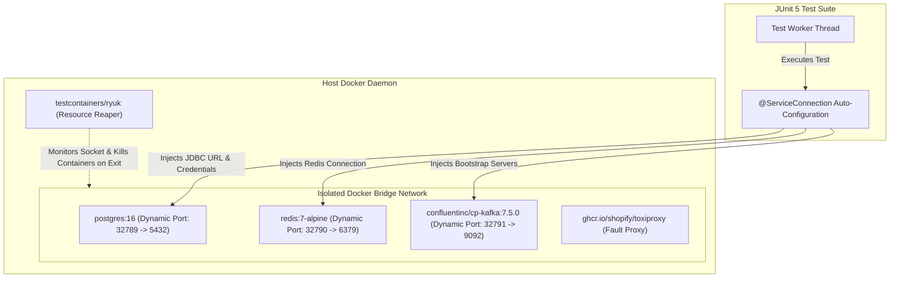
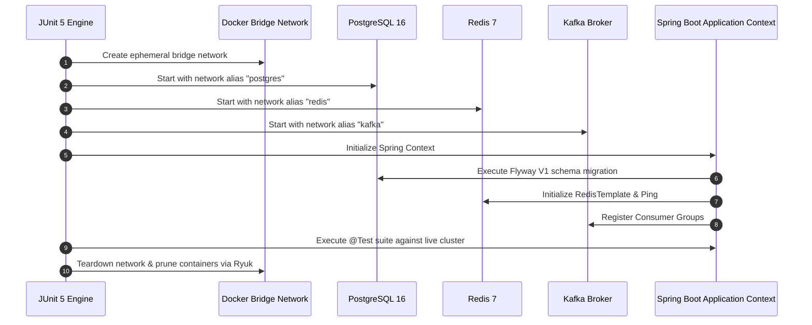

# Testcontainers Mastery in Spring Boot 3

Mocks prove that your code calls a method. They do not prove that your system works. In-memory databases like H2 lie about SQL dialects, indexes, constraints, and locking behaviors. 

**Testcontainers** runs real, ephemeral Docker containers during your automated test suite. It gives you 100% fidelity with production infrastructure while isolating tests on dynamic ports.



---

## The Fallacy of In-Memory Databases (H2 vs Real PostgreSQL)

For years, backend teams relied on H2 for testing because it is fast. In production, this creates a false sense of security.

| Feature | H2 In-Memory | PostgreSQL 16 (Testcontainers) |
| :--- | :--- | :--- |
| **Concurrency & MVCC** | Coarse-grained table/row locks. Fails to simulate real deadlocks or write skew. | Full Multi-Version Concurrency Control (`xmin`, `xmax`, SSI isolation). |
| **Dialect & Functions** | Emulation mode frequently rejects standard Postgres functions (`jsonb_build_object`, `date_trunc`). | Native engine execution. |
| **Locking Semantics** | Does not support `FOR UPDATE SKIP LOCKED` accurately. | Full native support for lock timeouts and non-blocking worker queues. |
| **Schema Migrations** | Flyway scripts with PostgreSQL-specific extensions (e.g., `CREATE EXTENSION "uuid-ossp"`, GIN indexes) crash on startup. | 100% identical execution to production Flyway deployments. |
| **JSONB Operators** | Partial or zero support for JSON path queries (`@>`, `?|`, `->>`). | Exact binary storage and indexing behaviors. |

<Warning>
**Never test schema migrations or concurrent repository updates against H2.** A passing H2 test suite that crashes upon deployment to PostgreSQL is an organizational failure. Use Testcontainers for all repository, migration, and integration tests.
</Warning>

---

## Maven Dependencies (Spring Boot 3.1+)

Spring Boot 3.1 introduced native support for Testcontainers via the `spring-boot-testcontainers` starter and `@ServiceConnection`.

```xml
<dependencies>
    <!-- Spring Boot Test Starter -->
    <dependency>
        <groupId>org.springframework.boot</groupId>
        <artifactId>spring-boot-starter-test</artifactId>
        <scope>test</scope>
    </dependency>

    <!-- Spring Boot Testcontainers Integration -->
    <dependency>
        <groupId>org.springframework.boot</groupId>
        <artifactId>spring-boot-testcontainers</artifactId>
        <scope>test</scope>
    </dependency>

    <!-- Testcontainers JUnit 5 Support -->
    <dependency>
        <groupId>org.testcontainers</groupId>
        <artifactId>junit-jupiter</artifactId>
        <scope>test</scope>
    </dependency>

    <!-- Dedicated Module Containers -->
    <dependency>
        <groupId>org.testcontainers</groupId>
        <artifactId>postgresql</artifactId>
        <scope>test</scope>
    </dependency>
    <dependency>
        <groupId>com.redis</groupId>
        <artifactId>testcontainers-redis</artifactId>
        <version>2.2.2</version>
        <scope>test</scope>
    </dependency>
    <dependency>
        <groupId>org.testcontainers</groupId>
        <artifactId>kafka</artifactId>
        <scope>test</scope>
    </dependency>
    <dependency>
        <groupId>org.testcontainers</groupId>
        <artifactId>toxiproxy</artifactId>
        <scope>test</scope>
    </dependency>
</dependencies>
```

---

## Spring Boot 3.1+ `@ServiceConnection` vs Legacy Approaches

Prior to Spring Boot 3.1, developers had to manually wire dynamic container ports into Spring environment properties using `@DynamicPropertySource`. This was boilerplate-heavy and prone to typos.

`@ServiceConnection` eliminates this entirely. It inspects the container type, starts it, extracts the assigned dynamic port and credentials, and automatically configures Spring Boot auto-configuration beans (`DataSource`, `RedisConnectionFactory`, `KafkaProperties`).

<Tabs>
  <Tab title="Spring Boot 3.1+ (@ServiceConnection)">
    ```java
    package com.example.backend.integration;

    import org.junit.jupiter.api.Test;
    import org.springframework.beans.factory.annotation.Autowired;
    import org.springframework.boot.test.context.SpringBootTest;
    import org.springframework.boot.testcontainers.service.connection.ServiceConnection;
    import org.testcontainers.containers.PostgreSQLContainer;
    import org.testcontainers.junit.jupiter.Container;
    import org.testcontainers.junit.jupiter.Testcontainers;

    import javax.sql.DataSource;
    import java.sql.Connection;
    import java.sql.SQLException;

    import static org.assertj.core.api.Assertions.assertThat;

    @SpringBootTest(webEnvironment = SpringBootTest.WebEnvironment.RANDOM_PORT)
    @Testcontainers
    class ServiceConnectionTest {

        // @ServiceConnection automatically injects:
        // spring.datasource.url, username, password, and driver-class-name
        @Container
        @ServiceConnection
        static PostgreSQLContainer<?> postgres = new PostgreSQLContainer<>("postgres:16-alpine")
                .withDatabaseName("mastery_test")
                .withUsername("test_user")
                .withPassword("test_secret");

        @Autowired
        private DataSource dataSource;

        @Test
        void shouldConnectToRealPostgresViaServiceConnection() throws SQLException {
            try (Connection conn = dataSource.getConnection()) {
                assertThat(conn.getMetaData().getDatabaseProductName()).isEqualTo("PostgreSQL");
                assertThat(conn.getMetaData().getDatabaseProductVersion()).startsWith("16.");
            }
        }
    }
    ```
  </Tab>
  <Tab title="Legacy Spring Boot 2 / 3.0 (@DynamicPropertySource)">
    ```java
    package com.example.backend.integration;

    import org.junit.jupiter.api.Test;
    import org.springframework.beans.factory.annotation.Autowired;
    import org.springframework.boot.test.context.SpringBootTest;
    import org.springframework.test.context.DynamicPropertyRegistry;
    import org.springframework.test.context.DynamicPropertySource;
    import org.testcontainers.containers.PostgreSQLContainer;
    import org.testcontainers.junit.jupiter.Container;
    import org.testcontainers.junit.jupiter.Testcontainers;

    import javax.sql.DataSource;
    import java.sql.Connection;
    import java.sql.SQLException;

    import static org.assertj.core.api.Assertions.assertThat;

    @SpringBootTest
    @Testcontainers
    class LegacyPropertySourceTest {

        @Container
        static PostgreSQLContainer<?> postgres = new PostgreSQLContainer<>("postgres:16-alpine");

        // Required 5 lines of manual dynamic mapping per container
        @DynamicPropertySource
        static void registerProperties(DynamicPropertyRegistry registry) {
            registry.add("spring.datasource.url", postgres::getJdbcUrl);
            registry.add("spring.datasource.username", postgres::getUsername);
            registry.add("spring.datasource.password", postgres::getPassword);
        }

        @Autowired
        private DataSource dataSource;

        @Test
        void shouldConnect() throws SQLException {
            try (Connection conn = dataSource.getConnection()) {
                assertThat(conn.isValid(1)).isTrue();
            }
        }
    }
    ```
  </Tab>
</Tabs>

---

## Multi-Container Shared Network Architecture

Real microservices interact with multiple stateful dependencies simultaneously. For example, a checkout service reads from PostgreSQL, caches sessions in Redis, and emits events to Apache Kafka.

Using Testcontainers, you can attach all containers to an isolated Docker `Network` and test the entire system end-to-end.



```java
package com.example.backend.integration;

import com.redis.testcontainers.RedisContainer;
import org.junit.jupiter.api.BeforeAll;
import org.junit.jupiter.api.Test;
import org.springframework.beans.factory.annotation.Autowired;
import org.springframework.boot.test.context.SpringBootTest;
import org.springframework.boot.testcontainers.service.connection.ServiceConnection;
import org.springframework.data.redis.core.StringRedisTemplate;
import org.springframework.kafka.core.KafkaTemplate;
import org.testcontainers.containers.KafkaContainer;
import org.testcontainers.containers.Network;
import org.testcontainers.containers.PostgreSQLContainer;
import org.testcontainers.junit.jupiter.Container;
import org.testcontainers.junit.jupiter.Testcontainers;
import org.testcontainers.utility.DockerImageName;

import java.time.Duration;
import java.util.concurrent.TimeUnit;

import static org.assertj.core.api.Assertions.assertThat;

@SpringBootTest(webEnvironment = SpringBootTest.WebEnvironment.RANDOM_PORT)
@Testcontainers
abstract class AbstractMultiContainerIntegrationTest {

    // Shared isolated network for inter-container communication
    static Network network = Network.newNetwork();

    @Container
    @ServiceConnection
    static PostgreSQLContainer<?> postgres = new PostgreSQLContainer<>("postgres:16-alpine")
            .withNetwork(network)
            .withNetworkAliases("postgres")
            .withDatabaseName("testdb");

    @Container
    @ServiceConnection
    static RedisContainer redis = new RedisContainer(DockerImageName.parse("redis:7-alpine"))
            .withNetwork(network)
            .withNetworkAliases("redis");

    @Container
    @ServiceConnection
    static KafkaContainer kafka = new KafkaContainer(DockerImageName.parse("confluentinc/cp-kafka:7.5.0"))
            .withNetwork(network)
            .withNetworkAliases("kafka");

    @Autowired
    protected StringRedisTemplate redisTemplate;

    @Autowired
    protected KafkaTemplate<String, String> kafkaTemplate;

    @Test
    void verifyInfrastructureHealth() {
        // Test Redis Connectivity
        redisTemplate.opsForValue().set("ping", "pong", Duration.ofSeconds(10));
        assertThat(redisTemplate.opsForValue().get("ping")).isEqualTo("pong");

        // Test Kafka Emission
        assertThat(kafkaTemplate.send("health-topic", "test-key", "test-payload"))
                .succeedsWithin(5, TimeUnit.SECONDS);
    }
}
```

---

## Local Development Revolution: `TestApplication.java`

One of the greatest features introduced in Spring Boot 3.1 is the ability to run your application locally using Testcontainers instead of maintaining a complex `docker-compose.yml` file.

Developers do not need to manually install or configure databases, message brokers, or local ports. Running `TestApplication.java` starts the necessary containers automatically and connects the local application context.

### 1. Define the Reusable Testcontainers Configuration

```java
package com.example.backend;

import com.redis.testcontainers.RedisContainer;
import org.springframework.boot.test.context.TestConfiguration;
import org.springframework.boot.testcontainers.service.connection.ServiceConnection;
import org.springframework.context.annotation.Bean;
import org.testcontainers.containers.PostgreSQLContainer;
import org.testcontainers.utility.DockerImageName;

@TestConfiguration(proxyBeanMethods = false)
public class TestcontainersConfiguration {

    @Bean
    @ServiceConnection
    public PostgreSQLContainer<?> postgresContainer() {
        return new PostgreSQLContainer<>("postgres:16-alpine")
                .withDatabaseName("dev_db")
                .withUsername("dev")
                .withPassword("dev")
                .withReuse(true); // Enables instant container reuse across restarts
    }

    @Bean
    @ServiceConnection
    public RedisContainer redisContainer() {
        return new RedisContainer(DockerImageName.parse("redis:7-alpine"))
                .withReuse(true);
    }
}
```

### 2. Define the Local Test Runner Entrypoint

Place this inside `src/test/java/com/example/backend/TestApplication.java`:

```java
package com.example.backend;

import org.springframework.boot.SpringApplication;

public class TestApplication {

    public static void main(String[] args) {
        SpringApplication.from(Application::main)
                .with(TestcontainersConfiguration.class)
                .run(args);
    }
}
```

<Tip>
Now, any developer or new hire can clone the repository and run `TestApplication.java` in IntelliJ or VS Code. Docker automatically downloads the exact image versions and configures all connections. Zero local environment configuration is needed.
</Tip>

---

## Reusable Containers (`withReuse(true)`) for Blazing Speed

By default, Testcontainers creates brand-new containers for every test class and terminates them upon JVM shutdown. This provides strong test isolation, but adds 5 to 15 seconds of startup latency to every local test run.

Container reuse allows existing running containers to be reused across successive test executions or IDE restarts.

### Step 1: Enable Reuse in Local Developer Environment

Create or edit `~/.testcontainers.properties` in your user home directory:

```properties
# ~/.testcontainers.properties
testcontainers.reuse.enable=true
```

### Step 2: Configure the Container with `.withReuse(true)`

```java
@Container
@ServiceConnection
static PostgreSQLContainer<?> postgres = new PostgreSQLContainer<>("postgres:16-alpine")
        .withReuse(true);
```

### How Testcontainers Identifies Reusable Containers

Testcontainers computes an MD5 checksum of the container's configuration (image name, environment variables, port mappings, command arguments). 

1. If a matching container is already running on the local Docker daemon, Testcontainers attaches to it immediately (latency: **under 100ms**).
2. If no matching container exists, it starts a new one and leaves it running when the JVM terminates (Ryuk is bypassed for reusable containers).

<Warning>
**Never enable container reuse on CI/CD runners.** CI pipelines must guarantee clean-slate isolation. Enable reuse only on developer machines in `~/.testcontainers.properties`.
</Warning>

---

## Chaos Engineering & Fault Injection with `ToxiproxyContainer`

Real microservices fail when downstream dependencies experience network partitions, high latency, or packet drops. Testing resilience mechanisms (like Resilience4j Circuit Breakers, Timeouts, and Retries) requires simulating realistic network degradation.

**Shopify Toxiproxy** is a TCP proxy designed for fault injection. Testcontainers provides official integration via `ToxiproxyContainer`.

```mermaid
flowchart LR
    App["Spring Boot Application"] -->|Port 8666 (Proxy Port)| TP["Toxiproxy Container"]
    TP -->|Simulated 2500ms Latency| PG["PostgreSQL Container (Port 5432)"]
    Admin["JUnit Resilience Test"] -->|Injects Toxic via HTTP (Port 8474)| TP
```

```java
package com.example.backend.integration;

import eu.rekawek.toxiproxy.Proxy;
import eu.rekawek.toxiproxy.ToxiproxyClient;
import eu.rekawek.toxiproxy.model.ToxicDirection;
import org.junit.jupiter.api.BeforeAll;
import org.junit.jupiter.api.Test;
import org.springframework.beans.factory.annotation.Autowired;
import org.springframework.boot.test.context.SpringBootTest;
import org.springframework.dao.QueryTimeoutException;
import org.springframework.jdbc.core.JdbcTemplate;
import org.springframework.test.context.DynamicPropertyRegistry;
import org.springframework.test.context.DynamicPropertySource;
import org.testcontainers.containers.Network;
import org.testcontainers.containers.PostgreSQLContainer;
import org.testcontainers.containers.ToxiproxyContainer;
import org.testcontainers.junit.jupiter.Container;
import org.testcontainers.junit.jupiter.Testcontainers;

import java.io.IOException;

import static org.assertj.core.api.Assertions.assertThatThrownBy;

@SpringBootTest
@Testcontainers
class DatabaseResilienceFaultInjectionTest {

    static Network network = Network.newNetwork();

    @Container
    static PostgreSQLContainer<?> postgres = new PostgreSQLContainer<>("postgres:16-alpine")
            .withNetwork(network)
            .withNetworkAliases("postgres-backend");

    @Container
    static ToxiproxyContainer toxiproxy = new ToxiproxyContainer("ghcr.io/shopify/toxiproxy:2.5.0")
            .withNetwork(network);

    static Proxy postgresProxy;

    @DynamicPropertySource
    static void configureProperties(DynamicPropertyRegistry registry) {
        // Obtain client to configure proxy rules
        ToxiproxyClient toxiproxyClient = new ToxiproxyClient(
                toxiproxy.getHost(), 
                toxiproxy.getControlPort()
        );

        try {
            // Create a proxy that routes from Toxiproxy to postgres-backend:5432
            postgresProxy = toxiproxyClient.createProxy(
                    "postgres", 
                    "0.0.0.0:8666", 
                    "postgres-backend:5432"
            );
        } catch (IOException e) {
            throw new RuntimeException(e);
        }

        // Point Spring Boot DataSource to the Toxiproxy port instead of PostgreSQL directly
        String proxyJdbcUrl = String.format(
                "jdbc:postgresql://%s:%d/%s",
                toxiproxy.getHost(),
                toxiproxy.getMappedPort(8666),
                postgres.getDatabaseName()
        );

        registry.add("spring.datasource.url", () -> proxyJdbcUrl);
        registry.add("spring.datasource.username", postgres::getUsername);
        registry.add("spring.datasource.password", postgres::getPassword);
        // Force HikariCP query timeout to 1 second
        registry.add("spring.datasource.hikari.connection-timeout", () -> 1000);
    }

    @Autowired
    private JdbcTemplate jdbcTemplate;

    @Test
    void shouldTriggerTimeoutExceptionWhenLatencyExceedsThreshold() throws IOException {
        // Inject 3000ms latency toxic downstream
        postgresProxy.toxics()
                .latency("high-latency-toxic", ToxicDirection.DOWNSTREAM, 3000);

        try {
            assertThatThrownBy(() -> jdbcTemplate.queryForObject("SELECT 1", Integer.class))
                    .hasCauseInstanceOf(java.sql.SQLTransientConnectionException.class);
        } finally {
            // Clean up toxic to restore normal database behavior
            postgresProxy.toxics().get("high-latency-toxic").remove();
        }
    }
}
```

---

## Testing Real Concurrency & Atomic Locks

Mocks cannot verify whether your database transactions withstand concurrent modification anomalies (e.g., race conditions, double-spending, inventory overselling). Testcontainers executes tests against real PostgreSQL row locks and transaction isolation levels.

### The Problem: Flash-Sale Concurrency Test

Suppose multiple threads attempt to reserve inventory simultaneously. We must verify that `UPDATE products SET stock = stock - ? WHERE id = ? AND stock >= ?` prevents overselling under heavy parallel load.

```java
package com.example.backend.integration;

import org.junit.jupiter.api.BeforeEach;
import org.junit.jupiter.api.Test;
import org.springframework.beans.factory.annotation.Autowired;
import org.springframework.boot.test.context.SpringBootTest;
import org.springframework.boot.testcontainers.service.connection.ServiceConnection;
import org.springframework.jdbc.core.JdbcTemplate;
import org.testcontainers.containers.PostgreSQLContainer;
import org.testcontainers.junit.jupiter.Container;
import org.testcontainers.junit.jupiter.Testcontainers;

import java.util.concurrent.CountDownLatch;
import java.util.concurrent.ExecutorService;
import java.util.concurrent.Executors;
import java.util.concurrent.atomic.AtomicInteger;

import static org.assertj.core.api.Assertions.assertThat;

@SpringBootTest
@Testcontainers
class ConcurrencyIsolationIntegrationTest {

    @Container
    @ServiceConnection
    static PostgreSQLContainer<?> postgres = new PostgreSQLContainer<>("postgres:16-alpine");

    @Autowired
    private JdbcTemplate jdbcTemplate;

    @BeforeEach
    void setupSchema() {
        jdbcTemplate.execute("DROP TABLE IF EXISTS flash_sale_inventory");
        jdbcTemplate.execute("""
            CREATE TABLE flash_sale_inventory (
                sku VARCHAR(64) PRIMARY KEY,
                available_stock INT NOT NULL CHECK (available_stock >= 0)
            )
        """);
        jdbcTemplate.update("INSERT INTO flash_sale_inventory (sku, available_stock) VALUES ('IPHONE-16', 10)");
    }

    @Test
    void shouldPreventOversellUnderHighThreadContention() throws InterruptedException {
        int threadCount = 30; // 30 concurrent shoppers attempting to buy 1 item each
        ExecutorService executor = Executors.newFixedThreadPool(threadCount);
        CountDownLatch startGate = new CountDownLatch(1);
        CountDownLatch endGate = new CountDownLatch(threadCount);

        AtomicInteger successfulPurchases = new AtomicInteger(0);
        AtomicInteger failedPurchases = new AtomicInteger(0);

        for (int i = 0; i < threadCount; i++) {
            executor.submit(() -> {
                try {
                    startGate.await(); // Synchronize all threads to fire simultaneously

                    // Atomic decrement guarded by stock check
                    int updatedRows = jdbcTemplate.update(
                            "UPDATE flash_sale_inventory SET available_stock = available_stock - 1 " +
                            "WHERE sku = 'IPHONE-16' AND available_stock >= 1"
                    );

                    if (updatedRows == 1) {
                        successfulPurchases.incrementAndGet();
                    } else {
                        failedPurchases.incrementAndGet();
                    }
                } catch (Exception e) {
                    failedPurchases.incrementAndGet();
                } finally {
                    endGate.countDown();
                }
            });
        }

        // Release the start gate
        startGate.countDown();
        endGate.await();
        executor.shutdown();

        // Exactly 10 orders must succeed, 20 must fail
        assertThat(successfulPurchases.get()).isEqualTo(10);
        assertThat(failedPurchases.get()).isEqualTo(20);

        // Final database stock must be exactly 0
        Integer remainingStock = jdbcTemplate.queryForObject(
                "SELECT available_stock FROM flash_sale_inventory WHERE sku = 'IPHONE-16'",
                Integer.class
        );
        assertThat(remainingStock).isEqualTo(0);
    }
}
```

---

## CI/CD Pipeline Performance & Optimization

Running Testcontainers in GitHub Actions or GitLab CI requires proper Docker configuration to avoid pipeline timeouts.

### 1. Use GitHub Actions Layer Caching

Pulling heavy images (e.g., `postgres:16`, `confluentinc/cp-kafka`) repeatedly wastes minutes of CI time. Cache Docker images in GitHub Actions:

```yaml
name: Backend Integration Tests

on: [push, pull_request]

jobs:
  test:
    runs-on: ubuntu-latest
    steps:
      - name: Checkout Source Code
        uses: actions/checkout@v4

      - name: Set up JDK 21
        uses: actions/setup-java@v4
        with:
          java-version: '21'
          distribution: 'temurin'
          cache: 'maven'

      - name: Cache Docker Images for Testcontainers
        uses: actions/cache@v4
        with:
          path: ~/.testcontainers-cache
          key: ${{ runner.os }}-testcontainers-${{ hashFiles('**/pom.xml') }}

      - name: Run Tests with Maven
        run: ./mvnw clean verify
```

### 2. The Singleton Container Pattern (Prevent Context Reload Overhead)

When multiple integration test classes inherit from Spring Boot, starting and stopping containers for each class inflates test execution time. 

Use the **Static Singleton Container Pattern** so that a single container instance serves all test classes throughout the entire Maven build.

```java
package com.example.backend.integration;

import org.springframework.boot.test.context.SpringBootTest;
import org.springframework.boot.testcontainers.service.connection.ServiceConnection;
import org.testcontainers.containers.PostgreSQLContainer;

@SpringBootTest(webEnvironment = SpringBootTest.WebEnvironment.RANDOM_PORT)
public abstract class BaseIntegrationTest {

    // Started once per JVM execution, shared by all subclass test suites
    @ServiceConnection
    protected static final PostgreSQLContainer<?> POSTGRES_CONTAINER;

    static {
        POSTGRES_CONTAINER = new PostgreSQLContainer<>("postgres:16-alpine")
                .withDatabaseName("test_db");
        POSTGRES_CONTAINER.start();
    }
}
```

Subclasses simply extend `BaseIntegrationTest` without declaring `@Container` or `@Testcontainers`. The Spring TestContext Framework caches the application context, resulting in a single database startup for the entire build.

---

## Debugging Ryuk & Resource Cleanup

Testcontainers deploys a tiny container called **Ryuk** (`testcontainers/ryuk`). Ryuk connects to the Docker socket via Unix domain sockets (`/var/run/docker.sock`).

- If the JVM terminates normally or crashes abruptly (e.g., `SIGKILL`, out-of-memory error), Ryuk detects socket disconnection and automatically prunes all spawned containers, volumes, and networks.
- This prevents "zombie containers" from consuming host RAM and disk space.

```bash
# Verify Ryuk is running on host
docker ps --filter "name=ryuk"
```

<Tip>
If you run inside an unprivileged Docker-in-Docker CI environment where mounting `/var/run/docker.sock` is restricted, you can disable Ryuk by passing `-Dtestcontainers.ryuk.disabled=true`. Ensure your CI runner cleans up orphaned containers after build completion.
</Tip>

---

## Production Antipatterns Checklist

<AccordionGroup>
  <Accordion title="1. Using Fixed Host Ports (.withFixedExposedPort)">
    **Antipattern**: Mapping containers to fixed ports like `5432:5432` or `6379:6379`.
    
    **Impact**: Causes `BindException: Address already in use` whenever tests run in parallel or when a local PostgreSQL/Redis service is already running on the host.
    
    **Solution**: Always use dynamic ephemeral ports assigned by Docker. Allow `@ServiceConnection` or `container.getMappedPort()` to resolve the port dynamically.
  </Accordion>

  <Accordion title="2. Non-Static Containers in Test Classes">
    **Antipattern**: Declaring `@Container PostgreSQLContainer postgres = new PostgreSQLContainer(...)` without the `static` modifier.
    
    **Impact**: Testcontainers stops and recreates a new Docker container before every individual `@Test` method. A test class with 10 methods will spend 40+ seconds spinning up containers.
    
    **Solution**: Always mark container fields as `static` so they spin up once per test class or once per JVM session.
  </Accordion>

  <Accordion title="3. Leaking Test State Across Tests">
    **Antipattern**: Assuming test methods execute in a specific order and leaving inserted rows in the database.
    
    **Impact**: Flaky tests that pass in isolation but fail when run in a full suite due to unique constraint violations.
    
    **Solution**: Clean tables between tests using `@Sql(executionPhase = AFTER_TEST_METHOD)` or trigger an automated database cleanup in `@BeforeEach`.
  </Accordion>

  <Accordion title="4. Ignoring Container Startup Timeouts">
    **Antipattern**: Heavy containers (like Kafka or LocalStack) timing out on slow CI runners with default 60-second timeouts.
    
    **Impact**: False negative build failures on GitHub Actions.
    
    **Solution**: Set explicit startup timeouts: `.withStartupTimeout(Duration.ofMinutes(3))`.
  </Accordion>
</AccordionGroup>

---

## Staff-Level Interview Questions & Answers

### Q1: How does Spring Boot 3.1 `@ServiceConnection` work under the hood?
**Answer**:
`@ServiceConnection` is powered by Spring Boot's `ContainerConnectionDetailsFactory` SPI. When the Spring TestContext initializes:
1. It discovers all container fields annotated with `@ServiceConnection`.
2. It inspects the container class (e.g., `PostgreSQLContainer`) and locates the corresponding `ConnectionDetailsFactory` (e.g., `PostgreSqlContainerConnectionDetailsFactory`).
3. It registers a `ConnectionDetails` bean (such as `JdbcConnectionDetails` or `RedisConnectionDetails`) into the application context.
4. Spring Boot auto-configuration classes (like `DataSourceAutoConfiguration`) check for the presence of these `ConnectionDetails` beans and prioritize them over static `application.properties`, injecting the dynamic host, port, username, and password automatically.

### Q2: What is the difference between `@SpringBootTest` with Testcontainers vs `@DataJpaTest` with Testcontainers?
**Answer**:
`@SpringBootTest` starts the full Spring application context, including all web controllers, services, security filters, and background listeners. It is designed for comprehensive end-to-end integration tests.

`@DataJpaTest` is an architectural slice test. It disables full web auto-configuration and initializes only JPA repositories, entities, and the DataSource. By default, `@DataJpaTest` attempts to replace the DataSource with an embedded database (H2). When using Testcontainers with `@DataJpaTest`, you must specify `@AutoConfigureTestDatabase(replace = AutoConfigureTestDatabase.Replace.NONE)` so Spring Boot uses the real container instead of attempting to look for H2.

### Q3: How do you handle database migrations with Testcontainers across 50+ test classes without slowing down the test run?
**Answer**:
There are two production techniques:
1. **Singleton Base Class**: Spin up the container once in a static initializer of an abstract `BaseIntegrationTest`. Flyway runs once upon container initialization. All 50 test classes inherit from this base class, reusing the existing Spring context and database schema.
2. **Transaction Rollback**: Wrap integration tests in `@Transactional` so changes are rolled back at the end of each test method, leaving the schema intact for subsequent classes without requiring expensive Flyway teardowns. For tests involving asynchronous tasks or multi-threaded executions where rollback is impossible, execute a fast `TRUNCATE TABLE ... CASCADE` in a `@BeforeEach` hook.

---

## Practice Task: Build an Idempotent Webhook Integration Test

Create an automated integration test for a payment webhook consumer using Testcontainers:

1. Spin up a `PostgreSQLContainer` and a `RedisContainer` using `@ServiceConnection`.
2. Apply a Flyway migration creating an `idempotency_keys` table (`key VARCHAR(64) PRIMARY KEY, locked_at TIMESTAMPTZ, processed BOOLEAN`).
3. Spawn 10 concurrent threads in Java using `ExecutorService` and `CountDownLatch`.
4. Have all 10 threads post the identical Stripe charge event (`evt_charge_1001`) with the same idempotency key simultaneously.
5. Assert that:
   - Exactly one thread successfully processes the payment and writes a database record.
   - Nine threads receive a conflict response or abort cleanly.
   - No duplicate financial transactions exist in PostgreSQL.

---

## Done Checklist

<Check>
  - [x] Replaced in-memory H2 tests with real PostgreSQL 16 Testcontainers.
  - [x] Implemented Spring Boot 3.1+ `@ServiceConnection` to eliminate manual property wiring.
  - [x] Configured multi-container environments sharing an isolated Docker `Network`.
  - [x] Created `TestApplication.java` for local containerized development without Docker Compose.
  - [x] Enabled `.withReuse(true)` on developer machines to achieve sub-second test startups.
  - [x] Injected realistic network latency and packet drops using `ToxiproxyContainer`.
  - [x] Validated multi-threaded concurrency and atomic database locks against real PostgreSQL.
  - [x] Optimized CI/CD build speeds with layer caching and singleton container patterns.
</Check>
