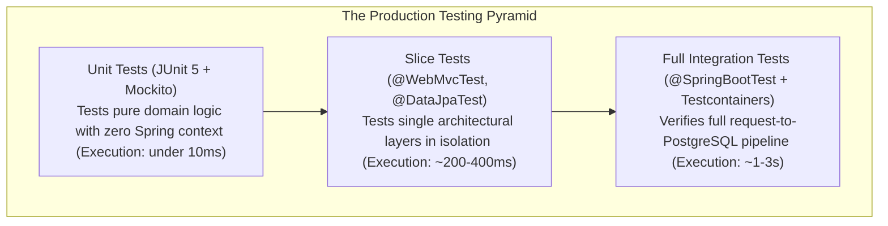

## 1. Mental Model: The Testing Confidence Pyramid

Testing in backend engineering is not about achieving 100% vanity code coverage.

It is about establishing **verifiable confidence** that:
- Business invariants hold under invalid user input.
- Database transactions roll back cleanly when runtime exceptions occur.
- Multi-threaded race conditions do not cause double-spending or inventory overselling.
- Third-party network outages (Stripe, Twilio) degrade gracefully via circuit breakers.



---

## 2. Spring TestContext Framework & Context Caching

The single biggest reason test suites take 20 minutes in CI is **context cache thrashing**.

### How Context Caching Works
When a test class runs, the Spring TestContext framework computes a **cache key** based on its configuration: active profiles, imported configuration classes, and `@MockBean` definitions. 

If the next test class has the exact same configuration, Spring **reuses the existing ApplicationContext** from memory instead of restarting Spring Boot!

```mermaid
sequenceDiagram
    autonumber
    participant Runner as JUnit 5 Test Runner
    participant Cache as Spring TestContext Cache
    participant Context as ApplicationContext (Spring Boot)

    Runner->>Cache: Request context for OrderControllerTest
    Cache->>Context: Cache Miss! Boots Spring Boot (Takes 2,500ms)
    Context-->>Runner: Context ready; executes tests
    
    Runner->>Cache: Request context for UserControllerTest (Identical Config)
    Cache-->>Runner: CACHE HIT! Reuses existing context in 2ms!
```

---

### The `@DirtiesContext` Performance Catastrophe
Annotating a test with `@DirtiesContext` tells Spring that the test mutated the context (e.g., modified a singleton bean's internal state), forcing Spring to **destroy the context and rebuild a fresh one** for the next test.

```java
// PERFORMANCE DISASTER: Forces Spring Boot to reboot 50 times in CI!
@DirtiesContext(classMode = DirtiesContext.ClassMode.AFTER_EACH_TEST_METHOD)
class NoteApiTest { ... }
```

### Best Practices for Sub-Minute Test Suites:
1. **Inherit from a Common Base Class**: Ensure all integration tests share an identical base configuration so they share a single cached `ApplicationContext`:
   ```java
   @SpringBootTest(webEnvironment = SpringBootTest.WebEnvironment.RANDOM_PORT)
   @ActiveProfiles("test")
   public abstract class BaseIntegrationTest {
       @ServiceConnection
       static PostgreSQLContainer<?> postgres = new PostgreSQLContainer<>("postgres:16-alpine");

       static {
           postgres.start();
       }
   }
   ```
2. **Avoid Varying `@MockBean` Across Classes**: Every unique `@MockBean` definition alters the context cache key, forcing Spring to boot a brand-new application context.

---

## 3. Web Layer Slice Testing: `@WebMvcTest`

To test controllers, serialization, and validation without loading the database, JPA repositories, or external services, use **`@WebMvcTest`**:

```java
package com.backend.mastery.testing;

import com.fasterxml.jackson.databind.ObjectMapper;
import org.junit.jupiter.api.DisplayName;
import org.junit.jupiter.api.Test;
import org.springframework.beans.factory.annotation.Autowired;
import org.springframework.boot.test.autoconfigure.web.servlet.WebMvcTest;
import org.springframework.boot.test.mock.mockito.MockBean;
import org.springframework.http.MediaType;
import org.springframework.security.test.context.support.WithMockUser;
import org.springframework.test.web.servlet.MockMvc;

import static org.mockito.ArgumentMatchers.any;
import static org.mockito.BDDMockito.given;
import static org.springframework.security.test.web.servlet.request.SecurityMockMvcRequestPostProcessors.csrf;
import static org.springframework.test.web.servlet.request.MockMvcRequestBuilders.post;
import static org.springframework.test.web.servlet.result.MockMvcResultMatchers.*;

@WebMvcTest(OrderController.class)
class OrderControllerSliceTest {

    @Autowired
    private MockMvc mockMvc;

    @Autowired
    private ObjectMapper objectMapper;

    @MockBean
    private OrderService orderService;

    @Test
    @WithMockUser(username = "alice", roles = {"USER"})
    @DisplayName("POST /api/v1/orders returns 201 Created on valid payload")
    void createOrderSuccess() throws Exception {
        CreateOrderRequest request = new CreateOrderRequest("PROD_101", 2);
        OrderResponse response = new OrderResponse(42L, "PROD_101", 2, "CONFIRMED");

        given(orderService.createOrder(any())).willReturn(response);

        mockMvc.perform(post("/api/v1/orders")
                .with(csrf())
                .contentType(MediaType.APPLICATION_JSON)
                .content(objectMapper.writeValueAsString(request)))
                .andExpect(status().isCreated())
                .andExpect(header().string("Location", "/api/v1/orders/42"))
                .andExpect(jsonPath("$.id").value(42))
                .andExpect(jsonPath("$.status").value("CONFIRMED"));
    }

    @Test
    @WithMockUser(username = "alice")
    @DisplayName("POST /api/v1/orders returns 400 Bad Request when quantity is zero")
    void createOrderFailsValidation() throws Exception {
        CreateOrderRequest invalidRequest = new CreateOrderRequest("PROD_101", 0); // Fails @Min(1)

        mockMvc.perform(post("/api/v1/orders")
                .with(csrf())
                .contentType(MediaType.APPLICATION_JSON)
                .content(objectMapper.writeValueAsString(invalidRequest)))
                .andExpect(status().isBadRequest())
                .andExpect(jsonPath("$.title").value("Bad Request"))
                .andExpect(jsonPath("$.invalidParams[0].name").value("quantity"));
    }
}
```

Line by line:

- `@WebMvcTest(OrderController.class)` loads the MVC slice around one controller, not the full application.
- `MockMvc` sends fake HTTP requests through Spring MVC without starting a real network port.
- `ObjectMapper` serializes the request exactly as production Jackson would.
- `@MockBean OrderService` replaces the service bean so the test stays focused on HTTP, validation, and serialization.
- `@WithMockUser` inserts an authenticated security context.
- `.with(csrf())` proves the endpoint works with CSRF protection enabled.
- `contentType(MediaType.APPLICATION_JSON)` sets the request body format.
- `objectMapper.writeValueAsString(request)` avoids hand-written JSON drift.
- `status().isCreated()` verifies protocol behavior, not just Java return values.
- `header().string("Location", ...)` proves the REST creation contract.
- `jsonPath(...)` checks response fields the client depends on.

Proof boundary: this test does not prove database persistence, transaction rollback, PostgreSQL constraints, or real JWT decoding. That is why it is a slice test.

---

## 4. Multi-Threaded Concurrency Testing: Catching Race Conditions

Can your backend prevent double-spending or inventory overselling when two requests arrive at the exact same millisecond? 

Unit tests cannot prove concurrency safety. Use **`ExecutorService`** and **`CountDownLatch`** in an integration test against a real PostgreSQL Testcontainer:

```java
package com.backend.mastery.testing;

import org.junit.jupiter.api.DisplayName;
import org.junit.jupiter.api.Test;
import org.springframework.beans.factory.annotation.Autowired;
import org.springframework.orm.ObjectOptimisticLockingFailureException;

import java.util.concurrent.CountDownLatch;
import java.util.concurrent.ExecutorService;
import java.util.concurrent.Executors;
import java.util.concurrent.atomic.AtomicInteger;

import static org.assertj.core.api.Assertions.assertThat;

class ConcurrencyRaceConditionTest extends BaseIntegrationTest {

    @Autowired
    private ProductRepository productRepository;

    @Autowired
    private OrderService orderService;

    @Test
    @DisplayName("Prevent concurrent inventory overselling via Optimistic Locking")
    void shouldPreventConcurrentOverselling() throws InterruptedException {
        // 1. Arrange: Product with exactly 1 item in stock
        Product product = productRepository.save(new Product("Limited Edition Sneaker", 1));
        Long productId = product.getId();

        int concurrentUsers = 8;
        ExecutorService executor = Executors.newFixedThreadPool(concurrentUsers);
        CountDownLatch startGate = new CountDownLatch(1);      // Holds all threads until release
        CountDownLatch endGate = new CountDownLatch(concurrentUsers); // Waits for all to complete

        AtomicInteger successCount = new AtomicInteger();
        AtomicInteger failureCount = new AtomicInteger();

        // 2. Act: 8 threads attempt to purchase the single item concurrently
        for (int i = 0; i < concurrentUsers; i++) {
            executor.submit(() -> {
                try {
                    startGate.await(); // Synchronize release to the exact same millisecond!
                    orderService.purchase(productId, 1);
                    successCount.incrementAndGet();
                } catch (ObjectOptimisticLockingFailureException | InsufficientStockException ex) {
                    failureCount.incrementAndGet();
                } catch (Exception e) {
                    // Unexpected error
                } finally {
                    endGate.countDown();
                }
            });
        }

        // Fire the gun! Release all threads simultaneously
        startGate.countDown();
        endGate.await(); // Wait for all 8 threads to finish execution

        // 3. Assert: Exactly 1 purchase succeeded; 7 failed; stock is 0 (never negative!)
        assertThat(successCount.get()).isEqualTo(1);
        assertThat(failureCount.get()).isEqualTo(7);

        Product updatedProduct = productRepository.findById(productId).orElseThrow();
        assertThat(updatedProduct.getStock()).isEqualTo(0);
    }
}
```

---

## 5. Third-Party Outage Testing with WireMock

How does your application behave when a third-party payment gateway (Stripe) hangs for 30 seconds or returns `HTTP 500 Internal Server Error`?

Use **WireMock** to simulate network outages and verify that your **Resilience4j Circuit Breakers and Retries** trigger correctly:

```java
package com.backend.mastery.testing;

import com.github.tomakehurst.wiremock.WireMockServer;
import org.junit.jupiter.api.AfterAll;
import org.junit.jupiter.api.BeforeAll;
import org.junit.jupiter.api.DisplayName;
import org.junit.jupiter.api.Test;
import org.springframework.beans.factory.annotation.Autowired;

import static com.github.tomakehurst.wiremock.client.WireMock.*;
import static org.assertj.core.api.Assertions.assertThat;

class PaymentGatewayWireMockTest extends BaseIntegrationTest {

    private static WireMockServer wireMockServer;

    @Autowired
    private PaymentClient paymentClient;

    @BeforeAll
    static void startWireMock() {
        wireMockServer = new WireMockServer(8089);
        wireMockServer.start();
    }

    @AfterAll
    static void stopWireMock() {
        wireMockServer.stop();
    }

    @Test
    @DisplayName("Should retry 3 times with exponential backoff before opening circuit breaker on 500 error")
    void shouldRetryOnRemoteFailure() {
        // Configure WireMock to return HTTP 500 for the first 2 calls, then 200 OK on attempt 3
        wireMockServer.stubFor(post(urlEqualTo("/v1/charges"))
                .inScenario("Retry Scenario")
                .whenScenarioStateIs(com.github.tomakehurst.wiremock.stubbing.Scenario.STARTED)
                .willReturn(aResponse().withStatus(500))
                .willSetStateTo("First Failure"));

        wireMockServer.stubFor(post(urlEqualTo("/v1/charges"))
                .inScenario("Retry Scenario")
                .whenScenarioStateIs("First Failure")
                .willReturn(aResponse().withStatus(500))
                .willSetStateTo("Second Failure"));

        wireMockServer.stubFor(post(urlEqualTo("/v1/charges"))
                .inScenario("Retry Scenario")
                .whenScenarioStateIs("Second Failure")
                .willReturn(aResponse()
                        .withStatus(200)
                        .withHeader("Content-Type", "application/json")
                        .withBody("{\"status\": \"PAID\", \"txId\": \"ch_999\"}")));

        // Act
        PaymentResult result = paymentClient.charge(1000L);

        // Assert: Succeeded after 3 attempts!
        assertThat(result.isSuccess()).isTrue();
        assertThat(result.transactionId()).isEqualTo("ch_999");

        // Verify WireMock received exactly 3 requests
        wireMockServer.verify(3, postRequestedFor(urlEqualTo("/v1/charges")));
    }
}
```

---

## 6. Test Data Builders & The Object Mother Pattern

Massive constructor parameter lists create brittle test suites. If you add a new column to `Order`, 200 test classes fail to compile:

```java
// ANTI-PATTERN: BRITTLE CONSTRUCTOR SPRAWL
Order order = new Order(1L, "Alice", "alice@example.com", 5000L, OrderStatus.PENDING, 
                        Instant.now(), null, "US", "CREDIT_CARD", null, null, null);
```

### Production Solution: Fluent Test Data Builders
```java
public class OrderTestDataBuilder {

    private String orderNumber = "ORD-" + UUID.randomUUID().toString().substring(0, 8);
    private OrderStatus status = OrderStatus.PENDING;
    private long totalCents = 10000L;

    public static OrderTestDataBuilder anOrder() {
        return new OrderTestDataBuilder();
    }

    public OrderTestDataBuilder withStatus(OrderStatus status) {
        this.status = status;
        return this;
    }

    public OrderTestDataBuilder withTotal(long totalCents) {
        this.totalCents = totalCents;
        return this;
    }

    public Order build() {
        Order order = new Order(orderNumber);
        if (status == OrderStatus.PAID) order.markPaid();
        return order;
    }
}

// Clean, readable, resilient tests:
Order order = OrderTestDataBuilder.anOrder().withTotal(4999L).build();
```

---

## Testing Fundamentals Interview Map

Testing questions are really about confidence boundaries. Each test type should answer a different risk.

### 1. Unit vs Slice vs Integration

| Test Type | Starts Spring? | Uses Real DB? | Best For |
| :--- | :--- | :--- | :--- |
| Unit test | No | No | Pure domain rules, value objects, calculations |
| `@WebMvcTest` | Partial | No | Routing, JSON, validation, security behavior |
| `@DataJpaTest` | Partial | Usually Testcontainers or embedded DB | Repositories, mappings, constraints, query behavior |
| `@SpringBootTest` | Yes | Yes in serious tests | Full request to database workflow |

**Senior answer:** "I choose the smallest test that can fail for the risk I care about. Unit tests prove pure rules. Slice tests prove framework boundaries. Integration tests prove wiring, SQL, transactions, and external boundaries."

### 2. What should never be mocked?

Do not mock the thing you are trying to verify.

Bad:

```java
when(orderRepository.save(any())).thenReturn(order);
```

This does not prove your JPA mapping, constraint, transaction, or SQL query works.

Mock external services in controller/service tests. Use Testcontainers for database behavior that must match PostgreSQL.

### 3. What makes a test flaky?

Flaky tests usually depend on time, order, shared state, real network services, or uncontrolled concurrency.

Common causes:

- `Thread.sleep()` instead of Awaitility or latches.
- Tests share rows without cleanup.
- Tests depend on execution order.
- Tests call real third-party APIs.
- Async work is not awaited.
- Random ports or clocks are not controlled.

### 4. What should every backend feature prove?

For a serious endpoint, write tests for:

- Happy path.
- Validation error.
- Missing resource.
- Unauthorized request.
- Forbidden or wrong-owner request.
- Database constraint conflict.
- Transaction rollback.
- Pagination boundary.
- Idempotent retry if the operation mutates state.

### Build-Break-Fix Lab

<Steps>
  <Step title="Build">
    Add a note creation endpoint with validation, ownership, JPA persistence, and `201 Created`.
  </Step>
  <Step title="Break">
    Remove `@Valid`, remove owner scoping, and throw an exception after saving.
  </Step>
  <Step title="Observe">
    Watch invalid data pass, cross-user access succeed, or committed rows survive failed use cases.
  </Step>
  <Step title="Fix">
    Restore validation, ownership-scoped repository queries, and transaction rollback behavior.
  </Step>
  <Step title="Prove">
    Add `@WebMvcTest`, `@DataJpaTest`, and `@SpringBootTest` cases for the same feature boundary.
  </Step>
</Steps>

---

## 7. Failure Modes & Edge Case Matrix

| Failure Mode | Root Cause | Impact | Production Defense |
| :--- | :--- | :--- | :--- |
| **Context Cache Thrashing** | Varying `@MockBean` combinations across test classes | CI suite runs for 30 minutes; OOM in runner | Centralize shared context configuration in an abstract base class. |
| **Flaky Concurrency Tests** | Using `Thread.sleep()` to wait for async tasks | Tests pass locally, fail unpredictably in CI | Use `CountDownLatch` or Awaitility (`await().atMost(...)`). |
| **Leaked Test Data** | Tests fail to clean database between runs | Test A fails because of data inserted by Test B | Use `@Transactional` rollbacks or clean tables in `@AfterEach`. |
| **External API Outage in CI** | Tests make real network calls to third-party endpoints | CI builds fail during external cloud downtime | Mock all external HTTP dependencies with **WireMock**. |

---

## 8. Senior Interview Questions & Active Recall

<AccordionGroup>
  <Accordion title="1. How does Spring TestContext caching work, and how does @DirtiesContext break it?">
    The Spring TestContext framework caches the `ApplicationContext` across test classes based on a composite key formed by active profiles, context initializers, and bean definitions. If multiple test classes share the exact same configuration, Spring reuses the already-booted context from memory, reducing test initialization from seconds to milliseconds. `@DirtiesContext` explicitly invalidates this cache, forcing Spring to destroy the context and rebuild a fresh one from scratch, drastically degrading CI execution speed.
  </Accordion>

  <Accordion title="2. How do you test for multi-threaded race conditions in a Spring Boot application?">
    Spawn multiple worker threads using an `ExecutorService` and synchronize them using a **`CountDownLatch`** initialized to 1. All threads call `latch.await()`, holding their execution. Calling `latch.countDown()` releases all threads simultaneously at the exact same millisecond, maximizing thread contention against shared state (e.g., purchasing the same product). A second `CountDownLatch` and `AtomicInteger`s verify that optimistic locking (`@Version`) permits only the expected number of successful updates while cleanly failing the rest.
  </Accordion>

  <Accordion title="3. When should you use @WebMvcTest slice testing versus full @SpringBootTest?">
    Use **`@WebMvcTest`** to test the web layer in isolation: HTTP routing, parameter validation (`@Valid`), JSON serialization/deserialization, and Spring Security filters. It runs in ~300ms by mocking all service dependencies. Use **`@SpringBootTest`** for end-to-end integration tests that verify database transactions, JPA constraints, real SQL queries against Testcontainers, and multi-component workflows.
  </Accordion>
</AccordionGroup>

---

## 9. Done Checklist

<Check>
- [ ] Understand the Spring Testing Pyramid and contrast Unit Tests, Slice Tests, and Integration Tests.
- [ ] Optimize CI test suites by exploiting Spring TestContext caching and eliminating `@DirtiesContext`.
- [ ] Build high-speed web layer slice tests using `@WebMvcTest`, `MockMvc`, and `@WithMockUser`.
- [ ] Test multi-threaded race conditions and optimistic locking using `CountDownLatch` and `ExecutorService`.
- [ ] Simulate external third-party outages and test Resilience4j retries using WireMock.
- [ ] Eliminate brittle test setup code by applying Fluent Test Data Builders.
</Check>
