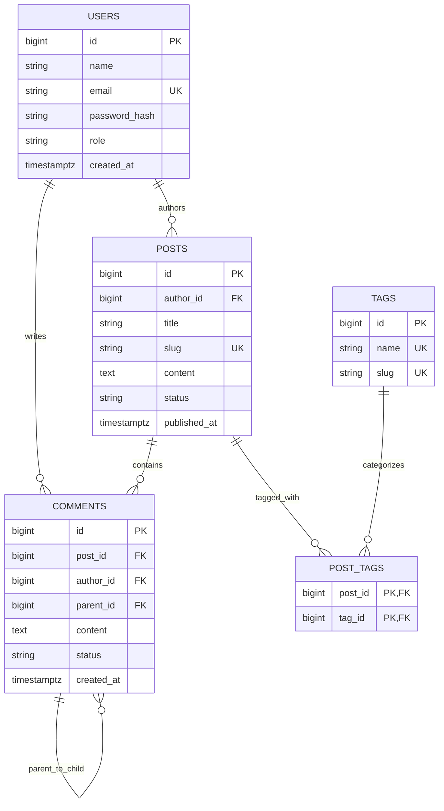

# Build Blog API (Complete Production Build)

The **Blog API** is the foundational relationship-heavy project in the curriculum.
While Notes API taught single-user data ownership, the Blog API teaches:
- **Complex Relational Modeling**: Many-to-One, Many-to-Many with composite keys, and **Self-Referential Hierarchies** (threaded comments).
- **Dynamic Multi-Criteria Search**: Querying posts by keyword, tag filters, author, and date range using Spring Data JPA **Specifications** without SQL injection.
- **N+1 Query Elimination**: Using `@EntityGraph` and batch fetching (`default_batch_fetch_size: 25`) to prevent explosive query cascades across authors and tags.
- **Fine-Grained Authorization**: SpEL method security protecting edit/delete operations (`@PreAuthorize("hasRole('ADMIN') or #post.author.id == authentication.principal.id")`).
- **Complete Testcontainers Suite**: Verifying multi-table joins, comment threading, and moderation rules against real PostgreSQL 16.

---

## 1. Relational ER Diagram & Package Structure



```bash
com.example.blog
├── auth/            # JWT authentication & UserDetails
├── post/            # Post entity, JPA specifications, service & controller
├── comment/         # Hierarchical comment tree entity & moderation
├── tag/             # Tag taxonomy & many-to-many relationship
└── common/          # Error handling (RFC 9457) & Security annotations
```

---

## 2. Production Maven Dependencies (`pom.xml`)

```xml
<?xml version="1.0" encoding="UTF-8"?>
<project xmlns="http://maven.apache.org/POM/4.0.0"
         xmlns:xsi="http://www.w3.org/2001/XMLSchema-instance"
         xsi:schemaLocation="http://maven.apache.org/POM/4.0.0 
         https://maven.apache.org/xsd/maven-4.0.0.xsd">
    <modelVersion>4.0.0</modelVersion>

    <parent>
        <groupId>org.springframework.boot</groupId>
        <artifactId>spring-boot-starter-parent</artifactId>
        <version>3.3.3</version>
        <relativePath/>
    </parent>

    <groupId>com.example</groupId>
    <artifactId>blog-api</artifactId>
    <version>1.0.0</version>
    <name>blog-api</name>

    <properties>
        <java.version>21</java.version>
    </properties>

    <dependencies>
        <dependency>
            <groupId>org.springframework.boot</groupId>
            <artifactId>spring-boot-starter-web</artifactId>
        </dependency>
        <dependency>
            <groupId>org.springframework.boot</groupId>
            <artifactId>spring-boot-starter-data-jpa</artifactId>
        </dependency>
        <dependency>
            <groupId>org.springframework.boot</groupId>
            <artifactId>spring-boot-starter-validation</artifactId>
        </dependency>
        <dependency>
            <groupId>org.springframework.boot</groupId>
            <artifactId>spring-boot-starter-security</artifactId>
        </dependency>

        <!-- Database & Flyway -->
        <dependency>
            <groupId>org.postgresql</groupId>
            <artifactId>postgresql</artifactId>
            <scope>runtime</scope>
        </dependency>
        <dependency>
            <groupId>org.flywaydb</groupId>
            <artifactId>flyway-core</artifactId>
        </dependency>
        <dependency>
            <groupId>org.flywaydb</groupId>
            <artifactId>flyway-database-postgresql</artifactId>
        </dependency>

        <!-- Testing -->
        <dependency>
            <groupId>org.springframework.boot</groupId>
            <artifactId>spring-boot-starter-test</artifactId>
            <scope>test</scope>
        </dependency>
        <dependency>
            <groupId>org.springframework.boot</groupId>
            <artifactId>spring-boot-testcontainers</artifactId>
            <scope>test</scope>
        </dependency>
        <dependency>
            <groupId>org.testcontainers</groupId>
            <artifactId>postgresql</artifactId>
            <scope>test</scope>
        </dependency>
        <dependency>
            <groupId>org.testcontainers</groupId>
            <artifactId>junit-jupiter</artifactId>
            <scope>test</scope>
        </dependency>
    </dependencies>
</project>
```

---

## 3. Flyway Database Schema Migration (`V1__init_blog.sql`)

```sql
-- V1__init_blog.sql

CREATE TABLE users (
    id BIGSERIAL PRIMARY KEY,
    name VARCHAR(100) NOT NULL,
    email VARCHAR(150) NOT NULL UNIQUE,
    password_hash VARCHAR(255) NOT NULL,
    role VARCHAR(30) NOT NULL DEFAULT 'ROLE_AUTHOR',
    created_at TIMESTAMPTZ NOT NULL DEFAULT CURRENT_TIMESTAMP
);

CREATE TABLE posts (
    id BIGSERIAL PRIMARY KEY,
    author_id BIGINT NOT NULL REFERENCES users(id) ON DELETE RESTRICT,
    title VARCHAR(255) NOT NULL,
    slug VARCHAR(280) NOT NULL UNIQUE,
    content TEXT NOT NULL,
    status VARCHAR(30) NOT NULL DEFAULT 'DRAFT',
    published_at TIMESTAMPTZ,
    created_at TIMESTAMPTZ NOT NULL DEFAULT CURRENT_TIMESTAMP,
    updated_at TIMESTAMPTZ NOT NULL DEFAULT CURRENT_TIMESTAMP
);

CREATE TABLE tags (
    id BIGSERIAL PRIMARY KEY,
    name VARCHAR(50) NOT NULL UNIQUE,
    slug VARCHAR(60) NOT NULL UNIQUE
);

CREATE TABLE post_tags (
    post_id BIGINT NOT NULL REFERENCES posts(id) ON DELETE CASCADE,
    tag_id BIGINT NOT NULL REFERENCES tags(id) ON DELETE RESTRICT,
    PRIMARY KEY (post_id, tag_id)
);

CREATE TABLE comments (
    id BIGSERIAL PRIMARY KEY,
    post_id BIGINT NOT NULL REFERENCES posts(id) ON DELETE CASCADE,
    author_id BIGINT NOT NULL REFERENCES users(id) ON DELETE RESTRICT,
    parent_id BIGINT REFERENCES comments(id) ON DELETE CASCADE,
    content TEXT NOT NULL,
    status VARCHAR(30) NOT NULL DEFAULT 'APPROVED',
    created_at TIMESTAMPTZ NOT NULL DEFAULT CURRENT_TIMESTAMP
);

-- Performance Indexes
CREATE INDEX idx_posts_status_published ON posts(status, published_at DESC) WHERE status = 'PUBLISHED';
CREATE INDEX idx_posts_author ON posts(author_id);
CREATE INDEX idx_comments_post_parent ON comments(post_id, parent_id);
CREATE INDEX idx_post_tags_tag ON post_tags(tag_id);
```

---

## 4. Java 21 JPA Domain Entities

### 1. Post Entity with Tag Association
```java
package com.example.blog.post.domain;

import com.example.blog.tag.domain.Tag;
import com.example.blog.user.domain.User;
import jakarta.persistence.*;
import java.time.Instant;
import java.util.HashSet;
import java.util.Objects;
import java.util.Set;

@Entity
@Table(name = "posts")
public class Post {

    @Id
    @GeneratedValue(strategy = GenerationType.IDENTITY)
    private Long id;

    @ManyToOne(fetch = FetchType.LAZY, optional = false)
    @JoinColumn(name = "author_id", nullable = false)
    private User author;

    @Column(name = "title", nullable = false)
    private String title;

    @Column(name = "slug", nullable = false, unique = true, length = 280)
    private String slug;

    @Column(name = "content", nullable = false, columnDefinition = "TEXT")
    private String content;

    @Enumerated(EnumType.STRING)
    @Column(name = "status", nullable = false, length = 30)
    private PostStatus status;

    @Column(name = "published_at")
    private Instant publishedAt;

    @ManyToMany
    @JoinTable(
        name = "post_tags",
        joinColumns = @JoinColumn(name = "post_id"),
        inverseJoinColumns = @JoinColumn(name = "tag_id")
    )
    private Set<Tag> tags = new HashSet<>();

    @Column(name = "created_at", nullable = false)
    private Instant createdAt;

    protected Post() {}

    public Post(User author, String title, String slug, String content) {
        this.author = Objects.requireNonNull(author);
        this.title = Objects.requireNonNull(title);
        this.slug = Objects.requireNonNull(slug);
        this.content = Objects.requireNonNull(content);
        this.status = PostStatus.DRAFT;
        this.createdAt = Instant.now();
    }

    public void publish() {
        this.status = PostStatus.PUBLISHED;
        this.publishedAt = Instant.now();
    }

    public void addTag(Tag tag) {
        this.tags.add(tag);
    }

    public void removeTag(Tag tag) {
        this.tags.remove(tag);
    }

    public Long getId() { return id; }
    public User getAuthor() { return author; }
    public String getTitle() { return title; }
    public String getSlug() { return slug; }
    public String getContent() { return content; }
    public PostStatus getStatus() { return status; }
    public Instant getPublishedAt() { return publishedAt; }
    public Set<Tag> getTags() { return Set.copyOf(tags); }
}
```

---

### 2. Threaded Hierarchical Comment Entity
```java
package com.example.blog.comment.domain;

import com.example.blog.post.domain.Post;
import com.example.blog.user.domain.User;
import jakarta.persistence.*;
import java.time.Instant;
import java.util.ArrayList;
import java.util.List;
import java.util.Objects;

@Entity
@Table(name = "comments")
public class Comment {

    @Id
    @GeneratedValue(strategy = GenerationType.IDENTITY)
    private Long id;

    @ManyToOne(fetch = FetchType.LAZY, optional = false)
    @JoinColumn(name = "post_id", nullable = false)
    private Post post;

    @ManyToOne(fetch = FetchType.LAZY, optional = false)
    @JoinColumn(name = "author_id", nullable = false)
    private User author;

    // Self-referential parent comment
    @ManyToOne(fetch = FetchType.LAZY)
    @JoinColumn(name = "parent_id")
    private Comment parent;

    // Threaded replies
    @OneToMany(mappedBy = "parent", cascade = CascadeType.ALL)
    private List<Comment> replies = new ArrayList<>();

    @Column(name = "content", nullable = false, columnDefinition = "TEXT")
    private String content;

    @Enumerated(EnumType.STRING)
    @Column(name = "status", nullable = false, length = 30)
    private CommentStatus status;

    @Column(name = "created_at", nullable = false)
    private Instant createdAt;

    protected Comment() {}

    public Comment(Post post, User author, Comment parent, String content) {
        this.post = Objects.requireNonNull(post);
        this.author = Objects.requireNonNull(author);
        this.parent = parent; // Null if root comment
        this.content = Objects.requireNonNull(content);
        this.status = CommentStatus.APPROVED;
        this.createdAt = Instant.now();
    }

    public Long getId() { return id; }
    public Post getPost() { return post; }
    public User getAuthor() { return author; }
    public Comment getParent() { return parent; }
    public List<Comment> getReplies() { return List.copyOf(replies); }
    public String getContent() { return content; }
}
```

---

## 5. Dynamic Search with Spring Data JPA Specifications

Never concatenate dynamic SQL strings for search filters. Use **Spring Data JPA Specifications** (based on the JPA Criteria API) to construct dynamic, typesafe predicates:

```java
package com.example.blog.post.repository;

import com.example.blog.post.domain.Post;
import com.example.blog.post.domain.PostStatus;
import com.example.blog.tag.domain.Tag;
import jakarta.persistence.criteria.Join;
import jakarta.persistence.criteria.Predicate;
import org.springframework.data.jpa.domain.Specification;

import java.util.ArrayList;
import java.util.List;

public class PostSpecifications {

    public static Specification<Post> withFilters(String keyword, String tagSlug, PostStatus status) {
        return (root, query, criteriaBuilder) -> {
            List<Predicate> predicates = new ArrayList<>();

            // 1. Filter by Publication Status
            if (status != null) {
                predicates.add(criteriaBuilder.equal(root.get("status"), status));
            }

            // 2. Filter by Keyword across title and content (Case-Insensitive)
            if (keyword != null && !keyword.isBlank()) {
                String pattern = "%" + keyword.trim().toLowerCase() + "%";
                Predicate titleMatch = criteriaBuilder.like(criteriaBuilder.lower(root.get("title")), pattern);
                Predicate contentMatch = criteriaBuilder.like(criteriaBuilder.lower(root.get("content")), pattern);
                predicates.add(criteriaBuilder.or(titleMatch, contentMatch));
            }

            // 3. Filter by Tag Slug via Many-to-Many Join
            if (tagSlug != null && !tagSlug.isBlank()) {
                Join<Post, Tag> tagsJoin = root.join("tags");
                predicates.add(criteriaBuilder.equal(tagsJoin.get("slug"), tagSlug.trim().toLowerCase()));
            }

            // Ensure distinct root rows if join produces duplicate rows
            if (query != null) {
                query.distinct(true);
            }

            return criteriaBuilder.and(predicates.toArray(new Predicate[0]));
        };
    }
}
```

---

## 6. N+1 Query Elimination with `@EntityGraph`

When listing posts with their authors and tags, naive fetching triggers $1 + N + N$ queries.
Use **`@EntityGraph`** to execute a single `LEFT JOIN FETCH` across the author and tags:

```java
package com.example.blog.post.repository;

import com.example.blog.post.domain.Post;
import org.springframework.data.domain.Page;
import org.springframework.data.domain.Pageable;
import org.springframework.data.jpa.domain.Specification;
import org.springframework.data.jpa.repository.EntityGraph;
import org.springframework.data.jpa.repository.JpaRepository;
import org.springframework.data.jpa.repository.JpaSpecificationExecutor;
import org.springframework.stereotype.Repository;

import java.util.Optional;

@Repository
public interface PostRepository extends JpaRepository<Post, Long>, JpaSpecificationExecutor<Post> {

    @EntityGraph(attributePaths = {"author", "tags"})
    Optional<Post> findBySlug(String slug);

    @Override
    @EntityGraph(attributePaths = {"author", "tags"})
    Page<Post> findAll(Specification<Post> spec, Pageable pageable);
}
```

---

## 7. Fine-Grained Authorization Controller with SpEL

```java
package com.example.blog.post.web;

import com.example.blog.post.domain.Post;
import com.example.blog.post.dto.CreatePostRequest;
import com.example.blog.post.dto.PostResponse;
import com.example.blog.post.repository.PostRepository;
import com.example.blog.post.service.PostService;
import jakarta.validation.Valid;
import org.springframework.data.domain.Page;
import org.springframework.data.domain.Pageable;
import org.springframework.http.ResponseEntity;
import org.springframework.security.access.prepost.PreAuthorize;
import org.springframework.web.bind.annotation.*;

@RestController
@RequestMapping("/api/posts")
public class PostController {

    private final PostService postService;
    private final PostRepository postRepository;

    public PostController(PostService postService, PostRepository postRepository) {
        this.postService = postService;
        this.postRepository = postRepository;
    }

    @GetMapping
    public ResponseEntity<Page<PostResponse>> searchPosts(
            @RequestParam(required = false) String q,
            @RequestParam(required = false) String tag,
            Pageable pageable) {

        return ResponseEntity.ok(postService.searchPublicPosts(q, tag, pageable));
    }

    @GetMapping("/{slug}")
    public ResponseEntity<PostResponse> getPostBySlug(@PathVariable String slug) {
        return ResponseEntity.ok(postService.getPublicPostBySlug(slug));
    }

    /**
     * SpEL Security: Only an ADMIN or the original author can edit or delete this post!
     * Defends against Broken Object Level Authorization (BOLA / IDOR).
     */
    @DeleteMapping("/{id}")
    @PreAuthorize("hasRole('ADMIN') or @postSecurityService.isAuthor(#id, authentication)")
    public ResponseEntity<Void> deletePost(@PathVariable Long id) {
        postService.deletePost(id);
        return ResponseEntity.noContent().build();
    }
}
```

---

## 8. Full Testcontainers Integration Test Suite

```java
package com.example.blog;

import com.example.blog.post.domain.Post;
import com.example.blog.post.domain.PostStatus;
import com.example.blog.post.repository.PostRepository;
import com.example.blog.post.repository.PostSpecifications;
import com.example.blog.tag.domain.Tag;
import com.example.blog.tag.repository.TagRepository;
import com.example.blog.user.domain.User;
import com.example.blog.user.repository.UserRepository;
import org.junit.jupiter.api.BeforeEach;
import org.junit.jupiter.api.DisplayName;
import org.junit.jupiter.api.Test;
import org.springframework.beans.factory.annotation.Autowired;
import org.springframework.boot.test.context.SpringBootTest;
import org.springframework.boot.testcontainers.service.connection.ServiceConnection;
import org.springframework.data.domain.Page;
import org.springframework.data.domain.PageRequest;
import org.springframework.transaction.annotation.Transactional;
import org.testcontainers.containers.PostgreSQLContainer;
import org.testcontainers.junit.jupiter.Container;
import org.testcontainers.junit.jupiter.Testcontainers;

import static org.assertj.core.api.Assertions.assertThat;

@SpringBootTest
@Testcontainers
@Transactional
class BlogApiIntegrationTest {

    @Container
    @ServiceConnection
    static PostgreSQLContainer<?> postgres = new PostgreSQLContainer<>("postgres:16-alpine");

    @Autowired
    private PostRepository postRepository;

    @Autowired
    private UserRepository userRepository;

    @Autowired
    private TagRepository tagRepository;

    private User author;
    private Tag javaTag;
    private Tag springTag;

    @BeforeEach
    void setUp() {
        author = userRepository.save(new User("Alice Developer", "alice@example.com", "hash", "ROLE_AUTHOR"));
        javaTag = tagRepository.save(new Tag("Java 21", "java-21"));
        springTag = tagRepository.save(new Tag("Spring Boot", "spring-boot"));

        Post post1 = new Post(author, "Mastering Virtual Threads in Java 21", "mastering-virtual-threads", "Content 1");
        post1.publish();
        post1.addTag(javaTag);
        postRepository.save(post1);

        Post post2 = new Post(author, "Production Spring Boot 3 Security", "spring-boot-security", "Content 2");
        post2.publish();
        post2.addTag(springTag);
        postRepository.save(post2);
    }

    @Test
    @DisplayName("Dynamic specification search filters posts correctly by keyword and tag slug")
    void testDynamicSearchSpecification() {
        var spec = PostSpecifications.withFilters("virtual", "java-21", PostStatus.PUBLISHED);
        Page<Post> result = postRepository.findAll(spec, PageRequest.of(0, 10));

        assertThat(result.getTotalElements()).isEqualTo(1);
        assertThat(result.getContent().get(0).getTitle()).contains("Virtual Threads");
    }

    @Test
    @DisplayName("EntityGraph loads posts, authors, and tags without N+1 query cascades")
    void testEntityGraphEagerLoading() {
        Post post = postRepository.findBySlug("mastering-virtual-threads").orElseThrow();

        assertThat(post.getAuthor().getName()).isEqualTo("Alice Developer");
        assertThat(post.getTags()).hasSize(1);
    }
}
```
