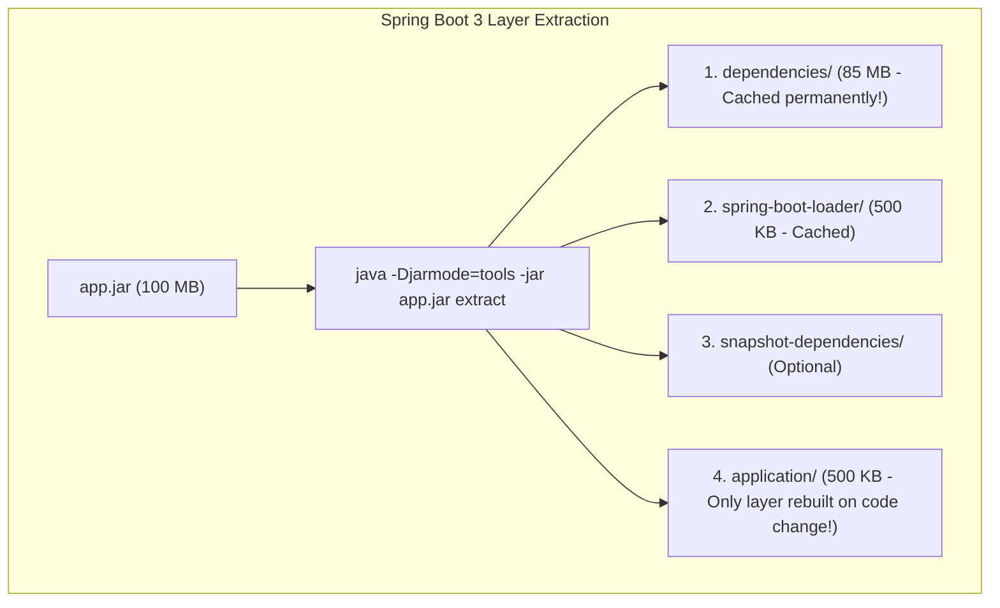
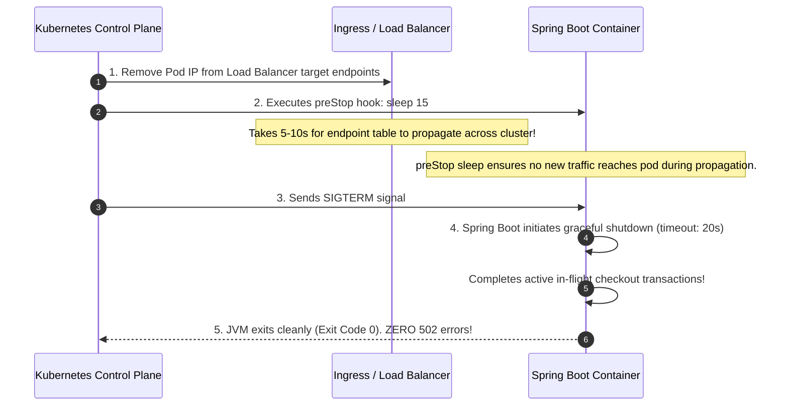

# Production Deployment Lab: Docker Layered JARs, Compose & CI/CD

Building a high-performance Spring Boot backend in your IDE is only half the engineering equation.
Deploying that application into production requires:
- **Optimized Containerization**: Slashing CI build times by $90\%$ using Spring Boot 3 **Layered JARs** to maximize Docker layer cache hits.
- **Container Security Hardening**: Eliminating root privilege escalation vulnerabilities by running as a dedicated, unprivileged system user.
- **Full-Stack Local Orchestration**: Provisioning application pods, PostgreSQL 16, Redis 7, Prometheus, and Grafana using production-grade **Docker Compose**.
- **Zero-Downtime Graceful Shutdown**: Preventing dropped in-flight requests during rolling deployments.
- **Automated CI/CD Verification**: Running Testcontainers tests, building multi-arch images, and executing Trivy vulnerability scans in GitHub Actions.

This hands-on lab takes you step-by-step from raw Java source code to an enterprise-grade, containerized release pipeline.

---

## 1. Container Optimization: The Fallacy of Single-Stage Dockerfiles

Many tutorials present a naive single-stage Dockerfile:

```dockerfile
# AMATEUR ANTI-PATTERN: Never deploy this in production!
FROM eclipse-temurin:21-jre
WORKDIR /app
COPY target/app.jar app.jar
EXPOSE 8080
ENTRYPOINT ["java", "-jar", "app.jar"]
```

### Why This Fails in Production
1. **Cache Invalidation Disaster**: A Spring Boot "fat JAR" is typically $60\text{ MB to }120\text{ MB}$. $95\%$ of that JAR consists of external Maven dependencies (Spring Framework, Hibernate, Jackson) that rarely change. If you modify a single line of Java business code, the entire $100\text{ MB}$ JAR changes checksum. Docker busts the cache and re-uploads $100\text{ MB}$ across your CI/CD network on every single commit!
2. **Security Vulnerability (Root Execution)**: By default, Docker runs processes as `root`. If an attacker discovers a Remote Code Execution (RCE) vulnerability in a dependency (e.g., Log4Shell), they gain root privileges inside the container, opening the door to container-escape exploits on the host node.
3. **Container OOMKills**: Missing JVM container-aware memory limits (`-XX:MaxRAMPercentage=75.0`), causing the JVM to allocate heap based on the physical host RAM rather than the container cgroup limits, triggering Linux Exit Code 137 OOMKills.

---

## 2. Production Multi-Stage Dockerfile with Spring Boot 3 Layered JARs

Spring Boot 3 includes built-in tooling (`jarmode=tools`) to extract fat JARs into distinct, cacheable layers:



### Complete `Dockerfile`

```dockerfile
# syntax=docker/dockerfile:1.4

# =========================================================================
# Stage 1: Build & Layer Extractor
# =========================================================================
FROM eclipse-temurin:21-jre-alpine AS builder

WORKDIR /builder

# Copy the pre-built Spring Boot fat JAR from target/
ARG JAR_FILE=target/*.jar
COPY ${JAR_FILE} app.jar

# Extract the JAR layers using Spring Boot 3 tools mode
RUN java -Djarmode=tools -jar app.jar extract --destination extracted

# =========================================================================
# Stage 2: Minimal, Hardened Production Runtime
# =========================================================================
FROM eclipse-temurin:21-jre-alpine AS runner

# Install dumb-init for proper Linux PID 1 signal forwarding (SIGTERM / SIGINT)
RUN apk add --no-cache dumb-init curl

WORKDIR /app

# Security: Create dedicated unprivileged non-root user and group
RUN addgroup --system --gid 1001 spring && \
    adduser --system --uid 1001 --ingroup spring spring

# Copy extracted layers in order of least-frequently-changed to most-frequently-changed
# Layer 1: Third-party dependencies (Highest cache hit rate: 90%+)
COPY --from=builder --chown=spring:spring /builder/extracted/dependencies/ ./
# Layer 2: Spring Boot classloader
COPY --from=builder --chown=spring:spring /builder/extracted/spring-boot-loader/ ./
# Layer 3: Snapshot dependencies (if any)
COPY --from=builder --chown=spring:spring /builder/extracted/snapshot-dependencies/ ./
# Layer 4: Application classes & resources (Only layer that changes per commit!)
COPY --from=builder --chown=spring:spring /builder/extracted/application/ ./

# Drop root privileges permanently!
USER spring:spring

EXPOSE 8080

# Environment variables for container-aware JVM memory tuning
ENV JAVA_TOOL_OPTIONS="-XX:MaxRAMPercentage=75.0 -XX:+UseG1GC -XX:+ExitOnOutOfMemoryError -XX:+HeapDumpOnOutOfMemoryError -XX:HeapDumpPath=/tmp"

# Health check verifying Actuator readiness probe
HEALTHCHECK --interval=10s --timeout=3s --retries=3 --start-period=20s \
  CMD curl -f http://localhost:8080/actuator/health/readiness || exit 1

# Launch application via dumb-init for proper graceful shutdown signal handling
ENTRYPOINT ["/usr/bin/dumb-init", "--"]
CMD ["java", "org.springframework.boot.loader.launch.JarLauncher"]
```

---

## 3. Full-Stack Local Orchestration (`docker-compose.yml`)

This production-grade Docker Compose file orchestrates your Spring Boot application alongside PostgreSQL 16, Redis 7, Prometheus, and Grafana:

```yaml
version: '3.8'

networks:
  backend-network:
    driver: bridge

volumes:
  postgres-data:
  redis-data:
  prometheus-data:
  grafana-data:

services:
  # 1. Primary PostgreSQL 16 Database
  postgres:
    image: postgres:16-alpine
    container_name: local-postgres
    restart: unless-stopped
    environment:
      POSTGRES_DB: ecommerce
      POSTGRES_USER: app_user
      POSTGRES_PASSWORD: app_secure_password
    ports:
      - "5432:5432"
    volumes:
      - postgres-data:/var/lib/postgresql/data
    networks:
      - backend-network
    healthcheck:
      test: ["CMD-SHELL", "pg_isready -U app_user -d ecommerce"]
      interval: 5s
      timeout: 3s
      retries: 5

  # 2. Redis 7 Distributed Cache
  redis:
    image: redis:7-alpine
    container_name: local-redis
    restart: unless-stopped
    ports:
      - "6379:6379"
    volumes:
      - redis-data:/data
    networks:
      - backend-network
    healthcheck:
      test: ["CMD", "redis-cli", "ping"]
      interval: 5s
      timeout: 3s
      retries: 5

  # 3. Spring Boot Backend Application
  backend:
    build:
      context: .
      dockerfile: Dockerfile
    container_name: local-backend
    restart: unless-stopped
    depends_on:
      postgres:
        condition: service_healthy
      redis:
        condition: service_healthy
    ports:
      - "8080:8080"
    environment:
      SPRING_PROFILES_ACTIVE: prod
      SPRING_DATASOURCE_URL: jdbc:postgresql://postgres:5432/ecommerce
      SPRING_DATASOURCE_USERNAME: app_user
      SPRING_DATASOURCE_PASSWORD: app_secure_password
      SPRING_DATA_REDIS_HOST: redis
      SPRING_DATA_REDIS_PORT: 6379
      MANAGEMENT_ENDPOINTS_WEB_EXPOSURE_INCLUDE: health,info,metrics,prometheus
    networks:
      - backend-network

  # 4. Prometheus Metrics Scraper
  prometheus:
    image: prom/prometheus:v2.53.0
    container_name: local-prometheus
    restart: unless-stopped
    ports:
      - "9090:9090"
    volumes:
      - ./infra/prometheus.yml:/etc/prometheus/prometheus.yml
      - prometheus-data:/prometheus
    networks:
      - backend-network

  # 5. Grafana Observability Dashboards
  grafana:
    image: grafana/grafana:11.1.0
    container_name: local-grafana
    restart: unless-stopped
    ports:
      - "3000:3000"
    volumes:
      - grafana-data:/var/lib/grafana
    networks:
      - backend-network
```

---

## 4. Production Prometheus Scrape Configuration (`infra/prometheus.yml`)

```yaml
global:
  scrape_interval: 5s
  evaluation_interval: 5s

scrape_configs:
  - job_name: 'spring-boot-actuator'
    metrics_path: '/actuator/prometheus'
    static_configs:
      - targets: ['backend:8080']
        labels:
          application: 'ecommerce-backend'
```

---

## 5. Zero-Downtime Graceful Shutdown Configuration

When Kubernetes or Docker sends a `SIGTERM` signal to stop a container during rolling updates, naive backends terminate immediately, aborting in-flight database transactions and returning `HTTP 502 Bad Gateway` to active users.

Configure **Graceful Shutdown** in `application.yml`:

```yaml
server:
  port: 8080
  # Activates graceful shutdown: Stops accepting new requests and allows in-flight requests to complete
  shutdown: graceful

spring:
  lifecycle:
    # Maximum time allocated for active in-flight requests to complete before forced SIGKILL
    timeout-per-shutdown-phase: 20s

management:
  endpoint:
    health:
      probes:
        enabled: true # Exposes /actuator/health/liveness and /actuator/health/readiness
```

### The Kubernetes Pod Deregistration Sequence



---

## 6. Automated Production CI/CD Pipeline (`.github/workflows/deploy.yml`)

A complete GitHub Actions workflow featuring Testcontainers integration tests, Docker Buildx caching, and Trivy security scanning:

```yaml
name: Production Build & Deploy Pipeline

on:
  push:
    branches: [ main ]
  pull_request:
    branches: [ main ]

jobs:
  test-and-verify:
    name: Run Tests & Quality Gates
    runs-on: ubuntu-latest

    steps:
      - name: Checkout Source Code
        uses: actions/checkout@v4

      - name: Set up JDK 21 (Eclipse Temurin)
        uses: actions/setup-java@v4
        with:
          java-version: '21'
          distribution: 'temurin'
          cache: maven

      - name: Execute Tests with Testcontainers
        run: ./mvnw clean verify

      - name: Upload Test Results
        if: always()
        uses: actions/upload-artifact@v4
        with:
          name: surefire-reports
          path: target/surefire-reports/

  build-and-scan-image:
    name: Build Layered Docker Image & Scan
    needs: test-and-verify
    runs-on: ubuntu-latest
    if: github.ref == 'refs/heads/main'

    steps:
      - name: Checkout Source Code
        uses: actions/checkout@v4

      - name: Set up JDK 21
        uses: actions/setup-java@v4
        with:
          java-version: '21'
          distribution: 'temurin'
          cache: maven

      - name: Package JAR
        run: ./mvnw clean package -DskipTests

      - name: Set up Docker Buildx
        uses: docker/setup-buildx-action@v3

      - name: Build Local Image for Security Scanning
        uses: docker/build-push-action@v5
        with:
          context: .
          load: true
          tags: ecommerce-backend:${{ github.sha }}
          cache-from: type=gha
          cache-to: type=gha,mode=max

      - name: Run Trivy Vulnerability Scanner (CVE Gate)
        uses: aquasecurity/trivy-action@master
        with:
          image-ref: ecommerce-backend:${{ github.sha }}
          format: 'table'
          exit-code: '1' # Fails build if CRITICAL vulnerabilities exist!
          ignore-unfixed: true
          severity: 'CRITICAL'
```

## Line-by-Line Deployment Gate Reading

- `uses: aquasecurity/trivy-action@master` runs a container vulnerability scanner as a CI step. Pinning to a version is safer for regulated environments.
- `image-ref: ecommerce-backend:${{ github.sha }}` scans the exact image built from the commit, not a floating `latest` tag.
- `format: 'table'` keeps CI logs human-readable during review.
- `exit-code: '1'` turns a critical vulnerability into a failed pipeline, not a warning everyone ignores.
- `ignore-unfixed: true` avoids blocking on issues with no vendor patch yet; this is a policy choice and should be revisited for internet-facing services.
- `severity: 'CRITICAL'` sets the initial gate. Mature teams often add `HIGH` with allowlists and expiry dates.

Proof drill: intentionally build from an old vulnerable base image in a branch. The pipeline should fail before deployment and record the CVE evidence in CI logs.

---

## Project Proof Drill

The deployment lab should prove that the application can be built, scanned, configured, started, drained, and rolled back without guessing. A production deployment is a controlled state transition, not a file copy.


| Proof target | Required evidence |
| --- | --- |
| Reproducible artifact | Same commit produces a tagged immutable image. |
| Container health | Readiness blocks traffic until the app can serve. |
| Graceful shutdown | Existing requests finish during pod termination. |
| Secret handling | Secrets come from environment/secret manager, not Git. |
| Migration safety | Flyway runs before incompatible application code. |
| Rollback | Previous image can be restored with one command. |

Drill:

```bash
kubectl rollout restart deployment/ecommerce-backend
kubectl rollout status deployment/ecommerce-backend
kubectl rollout undo deployment/ecommerce-backend
```

Evidence to capture:

| Evidence | Why it matters |
| --- | --- |
| zero failed readiness during startup | no traffic before app is ready |
| no interrupted in-flight request during shutdown | graceful termination works |
| image digest in deployment | deployment is traceable |
| migration logs | schema changed before app depended on it |

## 7. Operational Deployment Checklist & Rollback Runbook

### Pre-Deployment Checklist
- [ ] Flyway database migration tested on staging against production-volume data.
- [ ] Migration includes `SET lock_timeout = '2s'` to prevent lock queue traps.
- [ ] `ddl-auto` is set strictly to `validate` in production profile.
- [ ] All environment secrets (`DB_PASSWORD`, `JWT_SECRET`) injected via secret manager (never committed to Git).
- [ ] Health check readiness and liveness probes returning HTTP 200.

### Emergency Rollback Runbook
If production metrics show HTTP 5xx errors $> 1\%$ after deployment:

1. **Rollback Kubernetes Deployment Immediately**:
   ```bash
   kubectl rollout undo deployment/ecommerce-backend
   ```
2. **Verify Rollback Status**:
   ```bash
   kubectl rollout status deployment/ecommerce-backend
   ```
3. **Inspect Database Locks**:
   If rollbacks stall, check for active blocking locks via `pg_stat_activity` and cancel long-running queries using `SELECT pg_terminate_backend(pid)`.
