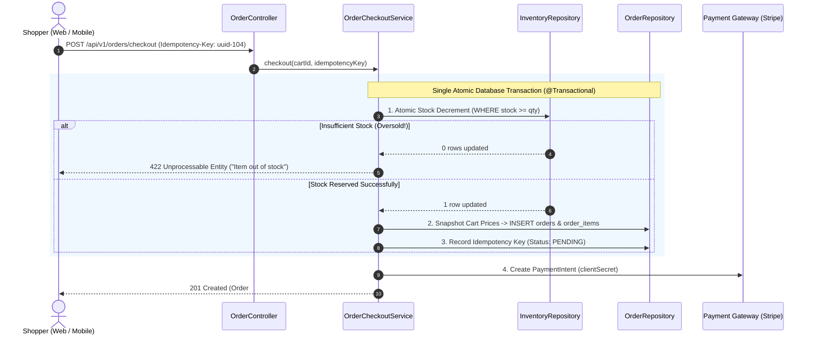
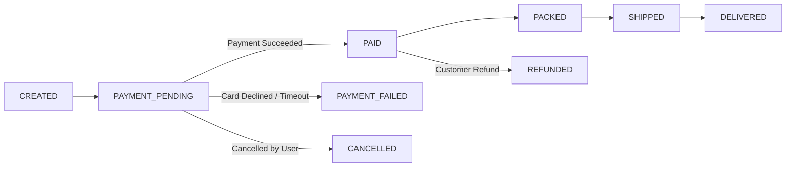
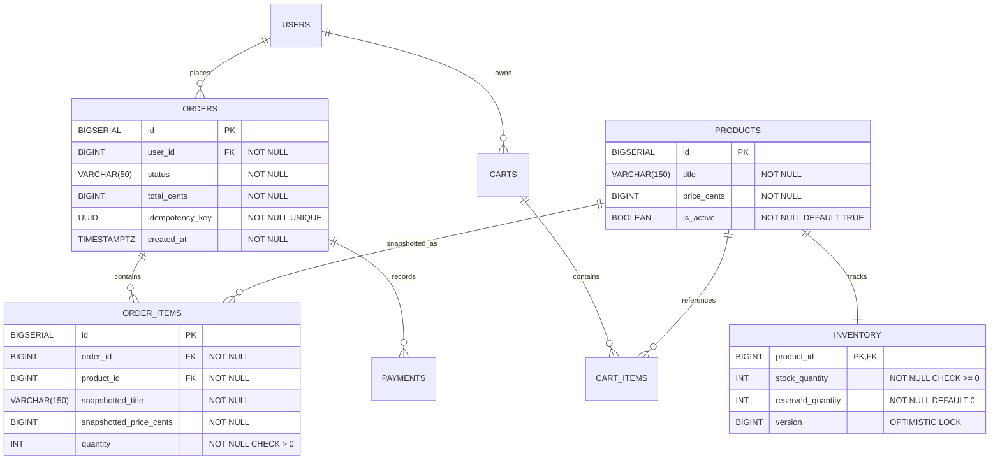

# Project Specification: Enterprise E-commerce Backend

An **Enterprise E-commerce Backend** is the capstone achievement in backend engineering. It integrates every major discipline of distributed systems: **high-concurrency inventory reservation, ACID transaction boundaries, idempotent payment webhook handling, asynchronous event publishing, and role-based access control**.

<Tip>
Looking for the step-by-step code implementation with entities, atomic SQL updates, Stripe webhook handlers, and Testcontainers? Follow [E-commerce Full Build](/projects/ecommerce-full-build).
</Tip>

---

## 1. Architectural Mental Model: The Checkout Workflow

The application is structured as a **Modular Monolith** organized into distinct bounded contexts. The critical business path is the **Checkout Flow**:



### The 4 Non-Negotiable E-Commerce Invariants
1. **Never Oversell Inventory**: Under concurrent flash-sale traffic, inventory can never drop below zero. Stock deductions must use atomic database operations (`UPDATE inventory SET stock = stock - :qty WHERE stock >= :qty`) or pessimistic row locks (`SELECT ... FOR UPDATE`).
2. **Historical Price Snapshotting**: Unit prices must be snapshotted directly into the `order_items` table at the millisecond of checkout. If a merchant changes a product price tomorrow from $50 to $75, existing orders must permanently retain their $50 historical purchase price.
3. **Idempotent Payment Webhooks**: Payment gateways (Stripe, Razorpay, Adyen) guarantee at-least-once webhook delivery. Receiving duplicate `payment_intent.succeeded` webhooks must never trigger duplicate order confirmations or double fulfillments.
4. **State Machine Immutability**: Orders follow a strict, uni-directional state machine:



---

## 2. Database Schema & Entity Relationship Diagram (ERD)



### PostgreSQL DDL (`V1__init_ecommerce.sql`)

```sql
-- 1. Product Catalog
CREATE TABLE products (
    id BIGSERIAL PRIMARY KEY,
    title VARCHAR(200) NOT NULL,
    description TEXT,
    price_cents BIGINT NOT NULL CHECK (price_cents >= 0),
    is_active BOOLEAN NOT NULL DEFAULT TRUE,
    created_at TIMESTAMP WITH TIME ZONE NOT NULL DEFAULT CURRENT_TIMESTAMP
);

CREATE INDEX idx_products_active ON products(is_active) WHERE is_active = TRUE;

-- 2. Concurrency-Safe Inventory
CREATE TABLE inventory (
    product_id BIGINT PRIMARY KEY REFERENCES products(id) ON DELETE CASCADE,
    stock_quantity INT NOT NULL CHECK (stock_quantity >= 0),
    updated_at TIMESTAMP WITH TIME ZONE NOT NULL DEFAULT CURRENT_TIMESTAMP
);

-- 3. Orders & Snapshot Items
CREATE TABLE orders (
    id BIGSERIAL PRIMARY KEY,
    user_id BIGINT NOT NULL,
    status VARCHAR(40) NOT NULL,
    total_cents BIGINT NOT NULL CHECK (total_cents >= 0),
    idempotency_key UUID NOT NULL UNIQUE,
    created_at TIMESTAMP WITH TIME ZONE NOT NULL DEFAULT CURRENT_TIMESTAMP,
    updated_at TIMESTAMP WITH TIME ZONE NOT NULL DEFAULT CURRENT_TIMESTAMP
);

CREATE INDEX idx_orders_user ON orders(user_id, created_at DESC);
CREATE INDEX idx_orders_status ON orders(status);

CREATE TABLE order_items (
    id BIGSERIAL PRIMARY KEY,
    order_id BIGINT NOT NULL REFERENCES orders(id) ON DELETE CASCADE,
    product_id BIGINT NOT NULL REFERENCES products(id),
    snapshotted_title VARCHAR(200) NOT NULL,
    snapshotted_unit_price_cents BIGINT NOT NULL CHECK (snapshotted_unit_price_cents >= 0),
    quantity INT NOT NULL CHECK (quantity > 0)
);

CREATE INDEX idx_order_items_order ON order_items(order_id);

-- 4. Payment Transactions & Webhook Deduplication
CREATE TABLE payments (
    id BIGSERIAL PRIMARY KEY,
    order_id BIGINT NOT NULL REFERENCES orders(id),
    provider VARCHAR(50) NOT NULL,
    provider_payment_id VARCHAR(150) NOT NULL UNIQUE,
    amount_cents BIGINT NOT NULL,
    status VARCHAR(40) NOT NULL,
    created_at TIMESTAMP WITH TIME ZONE NOT NULL DEFAULT CURRENT_TIMESTAMP
);

CREATE INDEX idx_payments_order ON payments(order_id);
```

---

## 3. Comprehensive RESTful API Contract

### 3.1 Customer Shopping Endpoints

| Method | Route | Request Body | Status | Description |
| :--- | :--- | :--- | :--- | :--- |
| `GET` | `/api/v1/products` | *Query: page, size, search* | `200 OK` | Paginated catalog search ($O(1)$ cursor or indexed offset). |
| `GET` | `/api/v1/products/{id}` | *None* | `200 OK` | Single product details with live stock availability. |
| `POST` | `/api/v1/cart/items` | `AddToCartRequest` | `200 OK` | Adds item to caller's persistent cart. |
| `DELETE` | `/api/v1/cart/items/{id}` | *None* | `204 No Content` | Removes line item from caller's cart. |
| `POST` | `/api/v1/orders/checkout` | `CheckoutRequest` | `201 Created` | Atomically reserves inventory and creates order. |
| `GET` | `/api/v1/orders` | *Query: page, size* | `200 OK` | Retrieves caller's order history. |
| `GET` | `/api/v1/orders/{id}` | *None* | `200 OK` | Retrieves order details (strictly scoped to caller). |

### 3.2 Payment Gateway Webhook Endpoint

| Method | Route | Request Header | Status | Description |
| :--- | :--- | :--- | :--- | :--- |
| `POST` | `/api/v1/payments/webhooks` | `Stripe-Signature: t=...,v1=...` | `200 OK` | Verifies cryptographic signature and fulfills order. |

### 3.3 Merchant Admin Endpoints (Requires `ROLE_ADMIN`)

| Method | Route | Request Body | Status | Description |
| :--- | :--- | :--- | :--- | :--- |
| `POST` | `/api/v1/admin/products` | `CreateProductRequest` | `201 Created` | Creates catalog entry with initial stock. |
| `PATCH` | `/api/v1/admin/inventory/{id}`| `AdjustStockRequest` | `200 OK` | Replenishes or audits inventory stock. |

---

## 4. Concurrency Architecture: Flash-Sale Race Condition Prevention

When 500 customers click "Checkout" simultaneously for the last remaining PlayStation console (`stock = 1`), naive ORM code fails:

```java
// FATAL NAIVE ORM BUG (LOST UPDATE & OVERSELLING):
Inventory inv = inventoryRepository.findById(productId).get();
if (inv.getStock() >= qty) {
    inv.setStock(inv.getStock() - qty); // BUG: 10 threads read stock=1 simultaneously!
    inventoryRepository.save(inv);      // Overwrites stock; all 10 orders succeed!
}
```

### The Production Defense: Atomic SQL Decrement
Execute the check and deduction in a single, atomic SQL statement:

```java
@Modifying
@Query("""
    UPDATE Inventory i 
    SET i.stockQuantity = i.stockQuantity - :quantity 
    WHERE i.productId = :productId AND i.stockQuantity >= :quantity
""")
int deductStockSafely(@Param("productId") Long productId, @Param("quantity") int quantity);
```

Because PostgreSQL executes updates under a row-level `EXCLUSIVE` lock, only **one single thread** can successfully decrement the last item ($1 \ge 1 \rightarrow \text{Returns } 1$). The other 499 threads fail the `WHERE i.stockQuantity >= :quantity` condition ($0 \ge 1 \rightarrow \text{Returns } 0$) and receive an immediate `422 Unprocessable Entity ("Out of stock")`.

---

## 5. Idempotent Payment Webhook Handling

Payment providers automatically retry webhook delivery if your server responds slowly. The webhook handler must be strictly idempotent:

```mermaid
sequenceDiagram
    autonumber
    actor Stripe as Stripe Webhook Service
    participant Webhook as PaymentWebhookController
    participant PayRepo as PaymentRepository
    participant OrderRepo as OrderRepository
    participant DB as PostgreSQL

    Stripe->>Webhook: POST /api/v1/payments/webhooks (providerPaymentId: "pi_99812")
    Webhook->>Webhook: 1. Verify HMAC-SHA256 Signature (Stripe-Signature)
    
    Webhook->>PayRepo: 2. findByProviderPaymentId("pi_99812")
    alt Already Handled (Duplicate Webhook)
        PayRepo-->>Webhook: Existing Payment Record Found
        Webhook-->>Stripe: 200 OK (Acknowledge duplicate; do NOT re-fulfill!)
    else First Delivery
        PayRepo-->>Webhook: Empty (Not Found)
        Webhook->>DB: 3. BEGIN TRANSACTION
        Webhook->>PayRepo: INSERT INTO payments (order_id, status='PAID', provider_payment_id='pi_99812')
        Webhook->>OrderRepo: UPDATE orders SET status = 'PAID' WHERE id = 104
        Webhook->>DB: 4. COMMIT TRANSACTION
        Webhook-->>Stripe: 200 OK (Payment Recorded)
    end
```

---

## 6. Acceptance Test Matrix

| Test Case | Test Scenario | Expected Outcome |
| :--- | :--- | :--- |
| `TC-ECOMM-01` | Normal checkout with ample stock | Returns `201 Created`; inventory decreased; order status is `PAYMENT_PENDING`. |
| `TC-ECOMM-02` | Checkout with insufficient stock | Returns `422 Unprocessable Entity`; stock remains unchanged; no order created. |
| `TC-ECOMM-03` | **Concurrent Flash-Sale**: 20 threads buy the last 1 item | **Exactly 1 thread succeeds (`201`)**; 19 threads receive `422`; stock finishes at `0`. |
| `TC-ECOMM-04` | Duplicate checkout using same `Idempotency-Key` | Second request returns cached original order; does not double-charge or reserve stock twice. |
| `TC-ECOMM-05` | Payment webhook received twice for same payment ID | Second webhook returns `200 OK`; order status remains `PAID`; no duplicate payment rows. |
| `TC-ECOMM-06` | Normal user attempts to call `/api/v1/admin/**` | Spring Security rejects with `403 Forbidden`. |
| `TC-ECOMM-07` | Price change test: Product price raised after order placed | Querying `GET /api/v1/orders/{id}` returns the original snapshotted purchase price. |

---

## 7. Active Recall Mastery Questions

<AccordionGroup>
  <Accordion title="1. Why must unit prices be snapshotted into the order_items table during checkout?">
    If the `order_items` table merely held a foreign key referencing `products(id)` and dynamically fetched the product's current price, any future price adjustments made by merchants would retroactively alter the total of past historical orders. 
    
    This violates accounting, tax, and legal requirements. Snapshotting `snapshotted_unit_price_cents` freezes the contractual purchase price at the exact millisecond the transaction was executed.
  </Accordion>

  <Accordion title="2. How does an Atomic SQL Update prevent overselling under high concurrency?">
    In PostgreSQL, an `UPDATE` statement acquires a row-level `ROW EXCLUSIVE` lock on the target row before evaluating the `WHERE` clause. 
    
    By writing `UPDATE inventory SET stock = stock - :qty WHERE product_id = :id AND stock >= :qty`, concurrent transactions are serialized by the database engine. If 10 transactions attempt to decrement the last item, the first transaction updates the row and decrements stock to 0. The remaining 9 transactions re-evaluate the `WHERE stock >= 1` clause against the updated row, evaluate to false, update 0 rows, and fail cleanly.
  </Accordion>

  <Accordion title="3. Why must payment webhooks verify cryptographic signatures (e.g. Stripe-Signature)?">
    Because webhook endpoints are publicly accessible over the internet, an attacker could send a forged HTTP POST request (`POST /api/v1/payments/webhooks {"orderId": 42, "status": "PAID"}`) to fulfill orders without paying. 
    
    Verifying the HMAC-SHA256 signature using the provider's secret signing key proves that the payload was generated by the legitimate payment provider and was not altered in transit.
  </Accordion>
</AccordionGroup>

---

## 8. Done Checklist

<Check>
Inventory reservation enforces atomic decrement logic to eliminate overselling under high concurrency.
</Check>
<Check>
Unit prices and item titles are snapshotted permanently into `order_items` at checkout time.
</Check>
<Check>
Checkout endpoints enforce idempotency keys to prevent duplicate order generation.
</Check>
<Check>
Payment webhook endpoints verify cryptographic signatures and enforce idempotency using unique provider payment IDs.
</Check>
<Check>
Orders adhere strictly to a uni-directional state machine.
</Check>
<Check>
All concurrency and duplicate webhook scenarios pass in automated integration test suites.
</Check>
