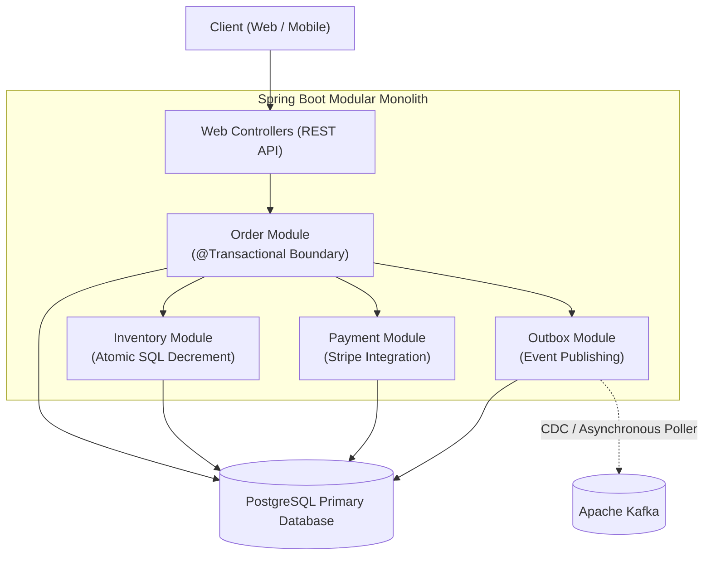

# Build E-commerce Backend (Complete Production Build)

This is the flagship capstone build of **Backend Mastery**.

It brings together every architectural concept taught across the curriculum into a single, battle-tested, production-ready codebase:
- **Relational Integrity & ACID Transactions**: Strict database-enforced constraints, foreign keys, and atomic state transitions.
- **Race Condition Prevention**: Atomic SQL inventory reservation eliminating flash-sale overselling under extreme concurrency.
- **Idempotency Key Pattern**: Eliminating duplicate orders when clients retry over flaky network connections.
- **Transactional Outbox Pattern**: Asynchronous event publishing without distributed 2-Phase Commit dual-write state corruption.
- **Cryptographic Webhook Verification**: Constant-time `HMAC-SHA256` signature verification for external payment callbacks (Stripe).
- **Comprehensive Testcontainers Suite**: Multi-threaded concurrency testing verifying that exactly $K$ orders succeed when $N$ concurrent users race for $K$ items ($N > K$).

---

<Warning>
This is an integration walkthrough, not a checked-in, tested production application. Several surrounding repositories, DTOs, outbox components, and provider integration pieces still need implementation. The test excerpts below have not been executed as one complete project. Start with the [runnable Todo lab](/projects/todo-api-full-build) and use the [advanced assessments](/getting-started/mastery-assessments) to verify your implementation.
</Warning>

## 1. System Architecture & Module Boundaries

The backend is architected as a **Modular Monolith** in Spring Boot 3.3. Each module owns its internal domain entities and exposes public interface contracts (use cases):



---

## 2. Production Maven Dependencies (`pom.xml`)

```xml
<?xml version="1.0" encoding="UTF-8"?>
<project xmlns="http://maven.apache.org/POM/4.0.0"
         xmlns:xsi="http://www.w3.org/2001/XMLSchema-instance"
         xsi:schemaLocation="http://maven.apache.org/POM/4.0.0 
         https://maven.apache.org/xsd/maven-4.0.0.xsd">
    <modelVersion>4.0.0</modelVersion>

    <parent>
        <groupId>org.springframework.boot</groupId>
        <artifactId>spring-boot-starter-parent</artifactId>
        <version>3.3.3</version>
        <relativePath/>
    </parent>

    <groupId>com.example</groupId>
    <artifactId>ecommerce-backend</artifactId>
    <version>1.0.0</version>
    <name>ecommerce-backend</name>
    <description>Production-Grade E-Commerce Backend</description>

    <properties>
        <java.version>21</java.version>
        <testcontainers.version>1.20.1</testcontainers.version>
    </properties>

    <dependencies>
        <!-- Spring Boot Starters -->
        <dependency>
            <groupId>org.springframework.boot</groupId>
            <artifactId>spring-boot-starter-web</artifactId>
        </dependency>
        <dependency>
            <groupId>org.springframework.boot</groupId>
            <artifactId>spring-boot-starter-data-jpa</artifactId>
        </dependency>
        <dependency>
            <groupId>org.springframework.boot</groupId>
            <artifactId>spring-boot-starter-validation</artifactId>
        </dependency>
        <dependency>
            <groupId>org.springframework.boot</groupId>
            <artifactId>spring-boot-starter-security</artifactId>
        </dependency>
        <dependency>
            <groupId>org.springframework.boot</groupId>
            <artifactId>spring-boot-starter-actuator</artifactId>
        </dependency>

        <!-- Database & Migrations -->
        <dependency>
            <groupId>org.postgresql</groupId>
            <artifactId>postgresql</artifactId>
            <scope>runtime</scope>
        </dependency>
        <dependency>
            <groupId>org.flywaydb</groupId>
            <artifactId>flyway-core</artifactId>
        </dependency>
        <dependency>
            <groupId>org.flywaydb</groupId>
            <artifactId>flyway-database-postgresql</artifactId>
        </dependency>

        <!-- Apache HttpClient 5 for Pooled RestClient -->
        <dependency>
            <groupId>org.apache.httpcomponents.client5</groupId>
            <artifactId>httpclient5</artifactId>
        </dependency>

        <!-- Test Dependencies -->
        <dependency>
            <groupId>org.springframework.boot</groupId>
            <artifactId>spring-boot-starter-test</artifactId>
            <scope>test</scope>
        </dependency>
        <dependency>
            <groupId>org.springframework.boot</groupId>
            <artifactId>spring-boot-testcontainers</artifactId>
            <scope>test</scope>
        </dependency>
        <dependency>
            <groupId>org.testcontainers</groupId>
            <artifactId>junit-jupiter</artifactId>
            <scope>test</scope>
        </dependency>
        <dependency>
            <groupId>org.testcontainers</groupId>
            <artifactId>postgresql</artifactId>
            <scope>test</scope>
        </dependency>
    </dependencies>

    <build>
        <plugins>
            <plugin>
                <groupId>org.springframework.boot</groupId>
                <artifactId>spring-boot-maven-plugin</artifactId>
            </plugin>
        </plugins>
    </build>
</project>
```

---

## 3. Flyway Database Schema Migration (`V1__init_ecommerce.sql`)

```sql
-- V1__init_ecommerce.sql

CREATE TABLE products (
    id BIGSERIAL PRIMARY KEY,
    name VARCHAR(200) NOT NULL,
    description TEXT NOT NULL,
    price_cents BIGINT NOT NULL CHECK (price_cents > 0),
    active BOOLEAN NOT NULL DEFAULT TRUE,
    created_at TIMESTAMPTZ NOT NULL DEFAULT CURRENT_TIMESTAMP
);

CREATE TABLE inventory (
    product_id BIGINT PRIMARY KEY REFERENCES products(id) ON DELETE RESTRICT,
    available_quantity INT NOT NULL CHECK (available_quantity >= 0),
    version BIGINT NOT NULL DEFAULT 0
);

CREATE TABLE orders (
    id BIGSERIAL PRIMARY KEY,
    user_id BIGINT NOT NULL,
    status VARCHAR(40) NOT NULL,
    total_cents BIGINT NOT NULL CHECK (total_cents >= 0),
    idempotency_key VARCHAR(120) NOT NULL,
    created_at TIMESTAMPTZ NOT NULL DEFAULT CURRENT_TIMESTAMP,
    updated_at TIMESTAMPTZ NOT NULL DEFAULT CURRENT_TIMESTAMP
);

CREATE TABLE order_items (
    id BIGSERIAL PRIMARY KEY,
    order_id BIGINT NOT NULL REFERENCES orders(id) ON DELETE CASCADE,
    product_id BIGINT NOT NULL REFERENCES products(id) ON DELETE RESTRICT,
    product_name_snapshot VARCHAR(200) NOT NULL,
    unit_price_cents_snapshot BIGINT NOT NULL CHECK (unit_price_cents_snapshot > 0),
    quantity INT NOT NULL CHECK (quantity > 0)
);

CREATE TABLE payments (
    id BIGSERIAL PRIMARY KEY,
    order_id BIGINT NOT NULL REFERENCES orders(id) ON DELETE RESTRICT,
    provider_payment_id VARCHAR(150) UNIQUE,
    status VARCHAR(40) NOT NULL,
    amount_cents BIGINT NOT NULL CHECK (amount_cents > 0),
    created_at TIMESTAMPTZ NOT NULL DEFAULT CURRENT_TIMESTAMP
);

CREATE TABLE outbox_events (
    id BIGSERIAL PRIMARY KEY,
    aggregate_type VARCHAR(50) NOT NULL,
    aggregate_id VARCHAR(100) NOT NULL,
    event_type VARCHAR(100) NOT NULL,
    payload JSONB NOT NULL,
    created_at TIMESTAMPTZ NOT NULL DEFAULT CURRENT_TIMESTAMP,
    processed BOOLEAN NOT NULL DEFAULT FALSE
);

-- Performance Indexes
CREATE INDEX idx_products_active ON products(active) WHERE active = TRUE;
CREATE INDEX idx_orders_user_created ON orders(user_id, created_at DESC);
CREATE INDEX idx_order_items_order ON order_items(order_id);
CREATE INDEX idx_outbox_unprocessed ON outbox_events(created_at) WHERE processed = FALSE;
```

---

## 4. Java 21 Rich Domain Entities

Domain entities defend their own invariants. No Lombok `@Data`, no public setters, and immutable state transitions:

### Order Domain Model
```java
package com.example.ecommerce.order.domain;

import jakarta.persistence.*;
import java.time.Instant;
import java.util.ArrayList;
import java.util.Collections;
import java.util.List;
import java.util.Objects;

@Entity
@Table(name = "orders")
public class Order {

    @Id
    @GeneratedValue(strategy = GenerationType.IDENTITY)
    private Long id;

    @Column(name = "user_id", nullable = false)
    private Long userId;

    @Enumerated(EnumType.STRING)
    @Column(name = "status", nullable = false, length = 40)
    private OrderStatus status;

    @Column(name = "total_cents", nullable = false)
    private Long totalCents;

    @Column(name = "idempotency_key", nullable = false, length = 120)
    private String idempotencyKey;

    @OneToMany(mappedBy = "order", cascade = CascadeType.ALL, orphanRemoval = true)
    private List<OrderItem> items = new ArrayList<>();

    @Column(name = "created_at", nullable = false)
    private Instant createdAt;

    @Column(name = "updated_at", nullable = false)
    private Instant updatedAt;

    protected Order() {} // For JPA

    private Order(Long userId, String idempotencyKey) {
        this.userId = Objects.requireNonNull(userId, "UserId must not be null");
        this.idempotencyKey = Objects.requireNonNull(idempotencyKey, "IdempotencyKey must not be null");
        this.status = OrderStatus.PENDING_PAYMENT;
        this.totalCents = 0L;
        this.createdAt = Instant.now();
        this.updatedAt = Instant.now();
    }

    public static Order createPending(Long userId, String idempotencyKey) {
        return new Order(userId, idempotencyKey);
    }

    public void addItem(Long productId, String productName, Long unitPriceCents, int quantity) {
        if (this.status != OrderStatus.PENDING_PAYMENT) {
            throw new IllegalStateException("Cannot add items to order in status: " + this.status);
        }
        OrderItem item = new OrderItem(this, productId, productName, unitPriceCents, quantity);
        this.items.add(item);
        this.totalCents += (unitPriceCents * quantity);
    }

    public void markAsPaid() {
        if (this.status != OrderStatus.PENDING_PAYMENT) {
            throw new IllegalStateException("Cannot mark as paid from status: " + this.status);
        }
        this.status = OrderStatus.PAID;
        this.updatedAt = Instant.now();
    }

    public void markAsPaymentFailed() {
        if (this.status != OrderStatus.PENDING_PAYMENT) {
            throw new IllegalStateException("Cannot mark as failed from status: " + this.status);
        }
        this.status = OrderStatus.PAYMENT_FAILED;
        this.updatedAt = Instant.now();
    }

    public Long getId() { return id; }
    public Long getUserId() { return userId; }
    public OrderStatus getStatus() { return status; }
    public Long getTotalCents() { return totalCents; }
    public String getIdempotencyKey() { return idempotencyKey; }
    public List<OrderItem> getItems() { return Collections.unmodifiableList(items); }
}
```

```java
package com.example.ecommerce.order.domain;

import jakarta.persistence.*;
import java.util.Objects;

@Entity
@Table(name = "order_items")
public class OrderItem {

    @Id
    @GeneratedValue(strategy = GenerationType.IDENTITY)
    private Long id;

    @ManyToOne(fetch = FetchType.LAZY)
    @JoinColumn(name = "order_id", nullable = false)
    private Order order;

    @Column(name = "product_id", nullable = false)
    private Long productId;

    @Column(name = "product_name_snapshot", nullable = false, length = 200)
    private String productNameSnapshot;

    @Column(name = "unit_price_cents_snapshot", nullable = false)
    private Long unitPriceCentsSnapshot;

    @Column(name = "quantity", nullable = false)
    private int quantity;

    protected OrderItem() {}

    OrderItem(Order order, Long productId, String productNameSnapshot, Long unitPriceCentsSnapshot, int quantity) {
        if (quantity <= 0) {
            throw new IllegalArgumentException("Quantity must be strictly positive");
        }
        this.order = Objects.requireNonNull(order);
        this.productId = Objects.requireNonNull(productId);
        this.productNameSnapshot = Objects.requireNonNull(productNameSnapshot);
        this.unitPriceCentsSnapshot = Objects.requireNonNull(unitPriceCentsSnapshot);
        this.quantity = quantity;
    }

    public Long getId() { return id; }
    public Long getProductId() { return productId; }
    public String getProductNameSnapshot() { return productNameSnapshot; }
    public Long getUnitPriceCentsSnapshot() { return unitPriceCentsSnapshot; }
    public int getQuantity() { return quantity; }
}
```

---

## 5. Concurrency-Safe Atomic SQL Inventory Reservation

Never load inventory into Java, decrement it, and call `save()`. Under concurrent flash sales, multiple threads will read the same available stock, overwriting each other's changes and selling inventory that does not exist.

Execute an **atomic single-statement decrement** directly in PostgreSQL:

```java
package com.example.ecommerce.inventory.repository;

import org.springframework.data.jpa.repository.JpaRepository;
import org.springframework.data.jpa.repository.Modifying;
import org.springframework.data.jpa.repository.Query;
import org.springframework.data.repository.query.Param;
import org.springframework.stereotype.Repository;

@Repository
public interface InventoryRepository extends JpaRepository<InventoryEntity, Long> {

    /**
     * Executes atomic decrement directly in PostgreSQL.
     * Prevents race conditions without heavy pessimistic table locks.
     *
     * @return 1 if inventory was successfully reserved; 0 if stock was insufficient.
     */
    @Modifying
    @Query("""
        UPDATE InventoryEntity i
        SET i.availableQuantity = i.availableQuantity - :quantity,
            i.version = i.version + 1
        WHERE i.productId = :productId
          AND i.availableQuantity >= :quantity
    """)
    int reserveStock(@Param("productId") Long productId, @Param("quantity") int quantity);
}
```

---

## 6. The Production Checkout Service (`OrderService`)

```java
package com.example.ecommerce.order.service;

import com.example.ecommerce.common.exception.ConflictException;
import com.example.ecommerce.common.exception.ResourceNotFoundException;
import com.example.ecommerce.inventory.repository.InventoryRepository;
import com.example.ecommerce.order.domain.Order;
import com.example.ecommerce.order.domain.OrderStatus;
import com.example.ecommerce.order.dto.CheckoutRequest;
import com.example.ecommerce.order.dto.OrderResponse;
import com.example.ecommerce.order.repository.OrderRepository;
import com.example.ecommerce.outbox.service.OutboxEventService;
import com.example.ecommerce.product.domain.Product;
import com.example.ecommerce.product.repository.ProductRepository;
import org.slf4j.Logger;
import org.slf4j.LoggerFactory;
import org.springframework.stereotype.Service;
import org.springframework.transaction.annotation.Transactional;

@Service
public class OrderService {

    private static final Logger log = LoggerFactory.getLogger(OrderService.class);

    private final OrderRepository orderRepository;
    private final ProductRepository productRepository;
    private final InventoryRepository inventoryRepository;
    private final OutboxEventService outboxEventService;

    public OrderService(OrderRepository orderRepository,
                        ProductRepository productRepository,
                        InventoryRepository inventoryRepository,
                        OutboxEventService outboxEventService) {
        this.orderRepository = orderRepository;
        this.productRepository = productRepository;
        this.inventoryRepository = inventoryRepository;
        this.outboxEventService = outboxEventService;
    }

    @Transactional
    public OrderResponse processCheckout(Long userId, CheckoutRequest request) {
        // This teaching version detects duplicate submissions; it does not replay responses.
        // The database constraint, not a preliminary SELECT, decides concurrent conflicts.
        // 2. Instantiate pending order
        Order order = Order.createPending(userId, request.idempotencyKey());

        for (var itemReq : request.items()) {
            // 3. Load authoritative product record (Never trust client pricing!)
            Product product = productRepository.findById(itemReq.productId())
                    .orElseThrow(() -> new ResourceNotFoundException("Product not found: " + itemReq.productId()));

            if (!product.isActive()) {
                throw new ConflictException("Product " + product.getName() + " is inactive");
            }

            // 4. Atomic inventory decrement (0 = out of stock)
            int updatedRows = inventoryRepository.reserveStock(product.getId(), itemReq.quantity());
            if (updatedRows == 0) {
                throw new ConflictException("Insufficient inventory for product: " + product.getName());
            }

            // 5. Snapshot authoritative price & name into order item
            order.addItem(product.getId(), product.getName(), product.getPriceCents(), itemReq.quantity());
        }

        // A uniqueness failure must escape this transaction so inventory changes roll back.
        // Map the named checkout-key constraint to HTTP 409 outside the transactional proxy.
        order = orderRepository.saveAndFlush(order);

        // 7. Enqueue Transactional Outbox Event in the same atomic database transaction
        outboxEventService.publishEvent(
                "Order",
                order.getId().toString(),
                "ORDER_CREATED",
                new OrderCreatedPayload(order.getId(), order.getUserId(), order.getTotalCents())
        );

        log.info("Order successfully created: id={}, totalCents={}", order.getId(), order.getTotalCents());
        return OrderResponse.from(order);
    }
}
```

---

### Duplicate detection is only the first step

Add a user-scoped uniqueness constraint in a migration:

```sql
ALTER TABLE orders
ADD CONSTRAINT orders_user_checkout_key UNIQUE (user_id, idempotency_key);
```

The service above lets a concurrent constraint violation roll back its whole transaction, including inventory changes. Do not catch that exception and query within the failed PostgreSQL transaction. Map only the named duplicate-key violation to `409` after rollback; unrelated integrity failures are not duplicate requests.

To return the original successful response on retries, add a request record scoped by authenticated user, operation, and key. Store a canonical request fingerprint and the committed result. Reject the same key with a different payload. Claim the record atomically and commit it with the business changes. Test simultaneous retries and a lost response after commit. That replay implementation is not supplied here.

## 7. Stripe Webhook Verification Boundary

Use the Stripe SDK's `Webhook.constructEvent` with the original request body, the complete `Stripe-Signature` header, and the endpoint secret. Do not compare `HMAC(payload)` directly with the header. [Stripe signature verification](https://docs.stripe.com/webhooks/signature)

This focused Java method requires a pinned `com.stripe:stripe-java` dependency and these imports. It verifies and parses an event; it does not mark an order paid:

```java
import com.stripe.exception.SignatureVerificationException;
import com.stripe.model.Event;
import com.stripe.net.Webhook;

public Event verifyEvent(String rawPayload, String signature, String endpointSecret)
        throws SignatureVerificationException {
    return Webhook.constructEvent(rawPayload, signature, endpointSecret);
}
```

In the HTTP adapter, reject a missing/bad signature or malformed payload with `400`. Do not modify or reserialize the body before verification. Configure the SDK/API versions together and retain its timestamp tolerance. [Stripe webhook handling](https://docs.stripe.com/webhooks)

The application processor still needs to:

1. Map the verified provider payment ID to a stored order; never use a hardcoded order ID or a client-selected owner.
2. Check the provider account, live/test mode, amount, currency, and expected state against the stored payment attempt.
3. Deduplicate the event ID and update payment/order state in one database transaction, with concurrency protection.
4. Handle duplicate and out-of-order events without undoing a later state.
5. Acknowledge only after processing or durable enqueue commits. Retry/reconcile failures without silently discarding an unknown payment.

Required tests include altered payload, wrong secret, expired signature timestamp, repeated delivery, concurrent delivery, wrong amount, and a database failure before commit. The old hardcoded event parser and hand-written signature comparison are intentionally removed because they did not implement this contract.

---

## 8. Multi-Threaded Concurrency Testcontainers Test Suite

This integration test proves that when **10 concurrent threads** attempt to buy the last **2 units** of stock simultaneously, exactly 2 succeed and 8 raise the expected business exception, without overselling. It calls the service directly; a separate MVC test must verify HTTP 409 mapping:

```java
package com.example.ecommerce;

import com.example.ecommerce.common.exception.ConflictException;
import com.example.ecommerce.inventory.repository.InventoryRepository;
import com.example.ecommerce.order.dto.CheckoutItemRequest;
import com.example.ecommerce.order.dto.CheckoutRequest;
import com.example.ecommerce.order.service.OrderService;
import com.example.ecommerce.product.domain.Product;
import com.example.ecommerce.product.repository.ProductRepository;
import org.junit.jupiter.api.BeforeEach;
import org.junit.jupiter.api.DisplayName;
import org.junit.jupiter.api.Test;
import org.springframework.beans.factory.annotation.Autowired;
import org.springframework.boot.test.context.SpringBootTest;
import org.springframework.boot.testcontainers.service.connection.ServiceConnection;
import org.testcontainers.containers.PostgreSQLContainer;
import org.testcontainers.junit.jupiter.Container;
import org.testcontainers.junit.jupiter.Testcontainers;

import java.util.List;
import java.util.UUID;
import java.util.concurrent.*;
import java.util.concurrent.atomic.AtomicInteger;

import static org.assertj.core.api.Assertions.assertThat;

@SpringBootTest
@Testcontainers
class ConcurrentCheckoutIntegrationTest {

    @Container
    @ServiceConnection
    static PostgreSQLContainer<?> postgres = new PostgreSQLContainer<>("postgres:16-alpine");

    @Autowired
    private OrderService orderService;

    @Autowired
    private ProductRepository productRepository;

    @Autowired
    private InventoryRepository inventoryRepository;

    private Long limitedProductId;

    @BeforeEach
    void setUp() {
        // Create product with only 2 items available in inventory
        Product product = productRepository.save(new Product("Limited Flash Sale Item", "Special", 4999L, true));
        limitedProductId = product.getId();

        inventoryRepository.save(new InventoryEntity(limitedProductId, 2, 0L));
    }

    @Test
    @DisplayName("When 10 concurrent users race to buy 2 items, exactly 2 succeed and 8 receive ConflictException")
    void testConcurrentFlashSaleOversellPrevention() throws InterruptedException {
        int concurrentUsers = 10;
        ExecutorService executor = Executors.newFixedThreadPool(concurrentUsers);
        CountDownLatch startGate = new CountDownLatch(1);
        CountDownLatch endGate = new CountDownLatch(concurrentUsers);

        AtomicInteger successCount = new AtomicInteger(0);
        AtomicInteger conflictCount = new AtomicInteger(0);

        for (int i = 0; i < concurrentUsers; i++) {
            long userId = 2000L + i;
            executor.submit(() -> {
                try {
                    startGate.await(); // All 10 threads block until released together!

                    CheckoutRequest request = new CheckoutRequest(
                            UUID.randomUUID().toString(),
                            List.of(new CheckoutItemRequest(limitedProductId, 1))
                    );

                    orderService.processCheckout(userId, request);
                    successCount.incrementAndGet();

                } catch (ConflictException ex) {
                    conflictCount.incrementAndGet();
                } catch (Exception ex) {
                    // Unexpected error
                } finally {
                    endGate.countDown();
                }
            });
        }

        // Unleash all 10 threads simultaneously!
        startGate.countDown();
        boolean completed = endGate.await(10, TimeUnit.SECONDS);

        assertThat(completed).isTrue();
        // Mathematical proof: Exactly 2 succeed, exactly 8 rejected!
        assertThat(successCount.get()).isEqualTo(2);
        assertThat(conflictCount.get()).isEqualTo(8);

        // Verify database stock is exactly zero, never negative!
        InventoryEntity finalInventory = inventoryRepository.findById(limitedProductId).orElseThrow();
        assertThat(finalInventory.getAvailableQuantity()).isEqualTo(0);

        executor.shutdown();
    }
}
```

---

## 9. Production Acceptance Checklist

| Requirement | Production Verification Standard |
| :--- | :--- |
| **Atomic Inventory Safety** | `reserveStock` uses atomic `UPDATE ... WHERE available_quantity >= :qty`. Zero negative stock. |
| **Idempotent Retries** | User-scoped uniqueness detects duplicates; original-response replay and request-fingerprint validation remain required integration work. |
| **Price Snapshotting** | Unit prices and product names copied into `order_items` snapshot; future catalog price edits do not mutate historical orders. |
| **Webhook Security** | Constant-time `HMAC-SHA256` signature verification (`MessageDigest.isEqual`) neutralizing timing attacks. |
| **Outbox Durability** | Outbox events written within the same database transaction boundary (`@Transactional`) as order creation. |
