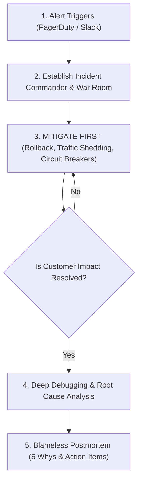
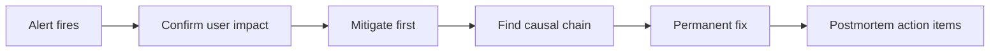
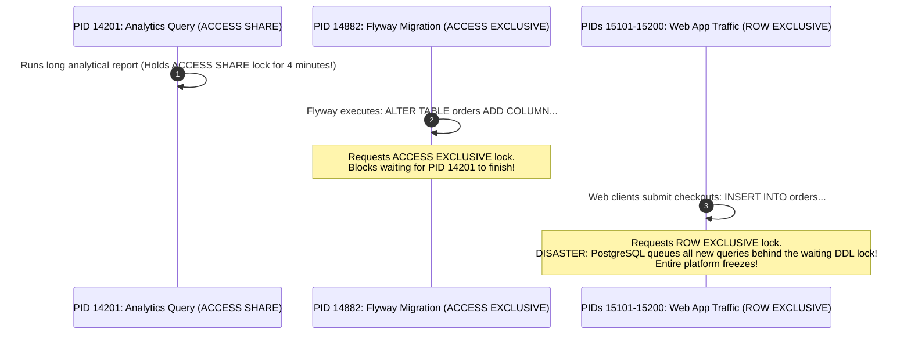
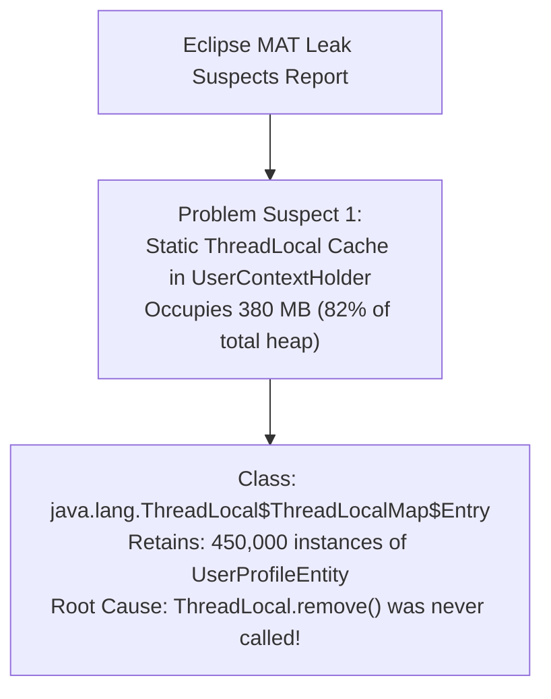

# Production Incident Debugging Lab: War Room Simulations

Senior backend engineers are not judged solely by the features they write during peacetime.
They are forged during **high-severity production outages (SEV-1)** when thousands of paying users are failing, executive war rooms are open, and every second of downtime damages company revenue and reputation.

Amateur engineers panic and "guess-and-check": randomly tweaking configuration flags, restarting database clusters without evidence, or pushing untested hotfixes.
**Senior engineers follow an evidence-driven, systematic protocol**:

$$\text{Symptom} \longrightarrow \text{Evidence} \longrightarrow \text{Mitigation (Stop the Bleeding)} \longrightarrow \text{Root Cause Analysis} \longrightarrow \text{Permanent Prevention}$$

This lab provides four realistic, production-grade war room simulations complete with real error logs, Linux terminal diagnostic commands, database queries, and blameless postmortem templates.

---

## The Incident Response Protocol: Golden Rules



---

## Lab Proof Drill

This lab is complete only when the learner can move from symptom to mitigation to permanent prevention. The goal is not to admire dashboards; the goal is to reduce impact quickly and then explain the causal chain precisely.



| Incident | First signal | First mitigation | Permanent fix |
| --- | --- | --- | --- |
| DB lock queue | Hikari timeouts and blocked sessions | terminate blocker or pause migration | lock timeouts and migration safety rules |
| OOMKilled pod | restart count and exit code 137 | roll back or raise limit temporarily | heap sizing, leak fix, load test |
| Downstream outage | p99 latency and thread saturation | open circuit breaker | timeouts, bulkheads, async isolation |
| Kafka poison record | lag stuck on one partition | skip or DLT bad offset | deserializer error handling and DLT |

Minimum evidence for each simulation:

| Evidence | Example |
| --- | --- |
| Detection query | `pg_stat_activity`, thread dump, Actuator metrics, consumer group lag |
| Mitigation command | terminate blocker, rollback deployment, trip circuit breaker, reset offset |
| Root cause chain | symptom -> saturated resource -> triggering change -> missing guardrail |
| Preventive action | test, alert, runbook, configuration, architecture change |

<Important>
### The SRE Golden Rule: Mitigate First, Debug Later
**Your first duty in an incident is to restore customer service, NOT to understand why the bug happened.**
If a deployment caused the failure, **roll it back immediately**. Do not spend 45 minutes reading code while users cannot checkout. Capture diagnostic telemetry (heap dumps, thread dumps, lock snapshots), mitigate the customer impact, and debug offline.
</Important>

---

## Simulation 1: PostgreSQL Lock Queue Starvation & Pool Exhaustion

### 1. The Symptom
At 14:02 UTC, the alerting system fires a **SEV-1 Critical Alert**:
- **Alert**: `HikariPool-1 - Connection is not available, request timed out after 30000ms`.
- **User Impact**: $100\%$ of incoming HTTP requests to `/api/orders` fail with `HTTP 500 Internal Server Error`.
- **Infrastructure**: App server CPU is at $2\%$, but database active connection count is pinned at $100/100$.

---

### 2. Evidence Collection: Inspecting `pg_stat_activity`
Open a terminal shell into the primary PostgreSQL database and inspect active running queries:

```sql
SELECT 
    pid, 
    now() - pg_stat_activity.query_start AS duration, 
    usename, 
    state, 
    wait_event_type, 
    wait_event, 
    query 
FROM pg_stat_activity 
WHERE state != 'idle' 
ORDER BY duration DESC;
```

#### The Diagnostic Output
```console
  pid  |    duration    | state  | wait_event_type | wait_event | query
-------+----------------+--------+-----------------+------------+-------------------------------------------------------------
 14201 | 00:04:12.41821 | active | DataFileRead    | BufferIO   | SELECT * FROM analytics_large_sales_export();
 14882 | 00:03:45.10912 | active | Lock            | relation   | ALTER TABLE orders ADD COLUMN loyalty_points INT;
 15101 | 00:03:30.01291 | active | Lock            | relation   | INSERT INTO orders (user_id, total_cents) VALUES (10, 4999);
 15102 | 00:03:29.89122 | active | Lock            | relation   | SELECT * FROM orders WHERE user_id = 45;
```

---

### 3. Root Cause Deconstruction: The Lock Queue Trap



1. **The Culprit**: PID `14201` ran an unoptimized 4-minute analytical report, holding an `ACCESS SHARE` lock on the `orders` table.
2. **The Lock Queue Trap**: A background Flyway migration job (`PID 14882`) attempted an `ALTER TABLE`, which requires an `ACCESS EXCLUSIVE` lock. It cannot proceed until PID 14201 finishes.
3. **The Cascade**: PostgreSQL prioritizes waiting exclusive locks to prevent lock starvation. Therefore, **all subsequent web queries (`INSERT`, `SELECT`, `UPDATE`) are blocked behind the Flyway migration**.
4. In under 30 seconds, all 100 HikariCP connections in the Spring Boot cluster were consumed by threads waiting for the table lock, crashing the API.

---

### 4. Immediate Mitigation (Terminate the Blockers)

Cancel the long-running analytical read first:

```sql
-- Attempt graceful query cancellation
SELECT pg_cancel_backend(14201);

-- If query does not terminate in 5 seconds, forcefully kill the backend socket:
SELECT pg_terminate_backend(14201);
```

Once PID 14201 is terminated, the Flyway migration immediately acquires its lock, finishes in $1\text{ ms}$, and releases the queue. The backlog of 100 web queries clears immediately, and HTTP 500 errors drop to zero.

---

### 5. Permanent Architectural Prevention

Never run DDL migrations in production without a strict **`lock_timeout`**:

```sql
-- In Flyway migration script:
SET lock_timeout = '2s';
ALTER TABLE orders ADD COLUMN loyalty_points INT;
```
If the migration cannot acquire its lock within 2 seconds, it fails fast and aborts, preventing it from forming a lock queue and taking down web traffic.

---

## Simulation 2: JVM Container Exit Code 137 (OOMKilled) & Memory Leak

### 1. The Symptom
Every 4 hours under normal traffic, a Spring Boot pod in Kubernetes spontaneously dies and restarts:
```bash
kubectl describe pod order-service-67b4f59c8-x9z2w
```
```console
Last State:     Terminated
  Reason:       OOMKilled
  Exit Code:    137
  Started:      Thu, 10 Sep 2026 10:00:00 GMT
  Finished:     Thu, 10 Sep 2026 14:02:15 GMT
```

---

### 2. Evidence Collection: Diagnosing the JVM Memory Leak
Exit Code 137 indicates that the Linux kernel's **Out-Of-Memory Killer (OOMKiller)** sent `SIGKILL` (`128 + 9 = 137`) because the container exceeded its cgroup memory limit (`512Mi`).

#### Step A: Configure Automated Heap Dumps
Add JVM flags in the container `Dockerfile` or Kubernetes deployment to capture the heap state right before the process dies:

```bash
JAVA_TOOL_OPTIONS="-XX:+HeapDumpOnOutOfMemoryError -XX:HeapDumpPath=/dumps/oom.hprof -XX:+ExitOnOutOfMemoryError"
```

#### Step B: Analyze with Eclipse Memory Analyzer (MAT)
Inspect the generated `.hprof` file using Eclipse MAT:



---

### 3. Root Cause Deconstruction: The `ThreadLocal` Leak Trap

```java
// THE BUGGY CODE:
@Component
public class UserContextFilter extends OncePerRequestFilter {

    private static final ThreadLocal<UserProfile> USER_CACHE = new ThreadLocal<>();

    @Override
    protected void doFilterInternal(HttpServletRequest request, HttpServletResponse response, 
                                    FilterChain filterChain) throws ServletException, IOException {
        
        UserProfile profile = loadProfileFromDb(request);
        USER_CACHE.set(profile);

        filterChain.doFilter(request, response);
        
        // DISASTER: Missing USER_CACHE.remove()!
        // Because Tomcat pools and reuses worker threads indefinitely,
        // the UserProfile object remains referenced in the thread's map FOREVER!
    }
}
```

Because Tomcat reuses a pool of 200 worker threads, objects placed into `ThreadLocal` without `remove()` are never garbage collected. Over 4 hours, 450,000 user profiles accumulated in heap memory, triggering an OOMKill.

---

### 4. Immediate Mitigation & Permanent Fix

#### Immediate Fix: Clear `ThreadLocal` in a `finally` block
```java
@Override
protected void doFilterInternal(HttpServletRequest request, HttpServletResponse response, 
                                FilterChain filterChain) throws ServletException, IOException {
    try {
        USER_CACHE.set(loadProfileFromDb(request));
        filterChain.doFilter(request, response);
    } finally {
        USER_CACHE.remove(); // MANDATORY: Prevents memory leak in pooled threads!
    }
}
```

#### Kubernetes Tuning: Container-Aware JVM Sizing
Ensure the JVM leaves at least $25\%$ of container memory for off-heap Metaspace, thread stacks, and native buffers:
```yaml
resources:
  limits:
    memory: "1Gi"
  requests:
    memory: "1Gi"
env:
  - name: JAVA_TOOL_OPTIONS
    value: "-XX:MaxRAMPercentage=75.0 -XX:+UseG1GC -XX:+HeapDumpOnOutOfMemoryError"
```

---

## Simulation 3: Cascading Downstream Outage & Thread Starvation

### 1. The Symptom
At 18:30 UTC, downstream third-party payment provider **Stripe** degrades, experiencing an average response latency of **$12,000\text{ ms}$**:
- Upstream Spring Boot checkout API p99 latency skyrockets from $45\text{ ms}$ to $15,000\text{ ms}$.
- API Gateway begins returning `HTTP 504 Gateway Timeout`.
- Tomcat worker threads jump from 15 active to **200/200 saturated**; health probes fail, and Kubernetes restarts the pods.

---

### 2. Evidence Collection: Taking an Actuator Thread Dump
Fetch the live thread dump from Spring Boot Actuator:
```bash
curl -s http://localhost:8080/actuator/threaddump | jq '.threads[] | select(.threadState == "TIMED_WAITING") | .threadName'
```

#### The Diagnostic Output
```console
"http-nio-8080-exec-1" - TIMED_WAITING on java.net.SocketInputStream.socketRead0
"http-nio-8080-exec-2" - TIMED_WAITING on java.net.SocketInputStream.socketRead0
...
"http-nio-8080-exec-200" - TIMED_WAITING on java.net.SocketInputStream.socketRead0
```
**Finding**: All 200 Tomcat worker threads are blocked inside `SocketInputStream.socketRead0()`, waiting for bytes from the payment provider socket. Zero threads remain to serve health checks or authentication requests.

---

### 3. Immediate Mitigation: Trip the Circuit Breaker via Actuator

Execute an immediate emergency transition to force the Circuit Breaker into `OPEN` or `FORCED_OPEN` state, immediately fast-failing payment calls and freeing up worker threads:

```bash
curl -X POST http://localhost:8080/actuator/circuitbreakers/paymentClient/transitions \
  -H "Content-Type: application/json" \
  -d '{"state": "FORCED_OPEN"}'
```

#### Verification
Within 200 milliseconds, all 200 Tomcat worker threads are released. The checkout API returns clean, immediate fallback responses (`HTTP 503 Gateway Temporarily Unavailable`), and the rest of the application (browsing, catalog, user profile) returns to normal $5\text{ ms}$ latency.

---

### 4. Permanent Architectural Prevention

Configure strict socket timeouts and Resilience4j bulkheads:
```yaml
resilience4j:
  timelimiter:
    instances:
      paymentClient:
        timeout-duration: 2500ms # Hard cap on external socket execution
  circuitbreaker:
    instances:
      paymentClient:
        slow-call-duration-threshold: 2000ms
        slow-call-rate-threshold: 50.0
```

---

## Simulation 4: Kafka Consumer Lag Spike & Poison Pill Loop

### 1. The Symptom
The notification worker consumer group lag surges from 5 messages to **450,000 messages** in 10 minutes:
```bash
kafka-consumer-groups.sh --bootstrap-server localhost:9092 \
  --describe --group notification-workers
```
```console
GROUP                TOPIC             PARTITION  CURRENT-OFFSET  LOG-END-OFFSET  LAG
notification-workers order-events      0          10482           160482          150000
notification-workers order-events      1          10480           160480          150000
notification-workers order-events      2          10481           160481          150000
```

---

### 2. Evidence Collection: Inspecting Consumer Container Logs

```console
2026-09-10 19:02:11.102 ERROR [notification-workers-0-C-1] o.s.k.l.KafkaMessageListenerContainer: 
Error handler threw an exception
org.apache.kafka.common.errors.RecordDeserializationException: 
Error deserializing key/value for partition order-events-0 at offset 10482. 
If needed, please seek past the record to continue consumption.
Caused by: com.fasterxml.jackson.core.JsonParseException: Unexpected character ('<' (code 60)): expected a valid value
 at [Source: (byte[])"<html><head><title>502 Bad Gateway</title></head>..."]
```

#### The Root Cause
A legacy upstream microservice crashed and emitted an HTML `502 Bad Gateway` error string into Kafka instead of a valid JSON payload.
Because the standard Spring Kafka listener could not deserialize the record, it threw an exception, retried the exact same offset, failed again, and entered an **infinite deserialization loop**, causing consumer lag to explode across the cluster.

---

### 3. Immediate Mitigation: Skip the Poison Pill Offset

Manually seek the consumer group offset past the corrupt record:

```bash
# Shift offset forward by 1 to bypass poison pill at offset 10482
kafka-consumer-groups.sh --bootstrap-server localhost:9092 \
  --group notification-workers \
  --topic order-events:0 \
  --reset-offsets --to-offset 10483 \
  --execute
```

Consumer lag immediately begins draining at 8,000 messages per second.

---

### 4. Permanent Architectural Prevention: ErrorHandlingDeserializer & DLT

Configure Spring Kafka's `ErrorHandlingDeserializer` with a `DeadLetterPublishingRecoverer` so that poison pills are routed to `.DLT` automatically without blocking the partition:

```java
@Configuration
public class KafkaConsumerConfig {

    @Bean
    public CommonErrorHandler errorHandler(KafkaTemplate<Object, Object> template) {
        // Automatically publishes poison pill records to "order-events.DLT"
        return new DefaultErrorHandler(
                new DeadLetterPublishingRecoverer(template),
                new FixedBackOff(1000L, 2) // Retry twice before sending to DLQ
        );
    }
}
```

---

## Complete Blameless Postmortem (PMR) Template

A culture of reliability requires **blameless postmortems**. Focus on system vulnerabilities and tooling, never on individual human error:

```markdown
# Postmortem: SEV-1 PostgreSQL Connection Pool Exhaustion
**Date**: 2026-09-10  
**Authors**: Senior Backend Team  
**Status**: Resolved  
**Incident Commander**: Alice Engineer  

## 1. Executive Summary
Between 14:02 UTC and 14:08 UTC (Duration: 6 minutes), all incoming order checkout requests failed with HTTP 500. Approximately 1,200 checkout attempts were impacted. Service was restored by terminating a blocking analytical query and allowing a waiting schema migration to complete.

## 2. Impact & Metrics
- **Customer Impact**: 1,200 users received error messages during checkout.
- **Revenue Impact**: Estimated $48,000 in delayed transactions.
- **Availability SLI**: Dropped from 99.98% to 94.2% for the rolling 24-hour window.

## 3. Timeline (UTC)
- **13:58**: Analytical team launches manual sales report query (`PID 14201`).
- **14:01**: CI/CD pipeline triggers scheduled Flyway migration (`PID 14882`).
- **14:02**: PagerDuty fires SEV-1 alert for HikariCP connection pool timeout.
- **14:03**: Incident Commander opens war room.
- **14:05**: DBA executes `pg_stat_activity` query and identifies lock queue trap.
- **14:07**: DBA executes `pg_terminate_backend(14201)`.
- **14:08**: Lock queue clears; API p99 latency drops to 12ms. Alert auto-resolves.

## 4. Root Cause (The 5 Whys)
1. **Why did the API return 500?** HikariCP connection pool ran out of available connections.
2. **Why were connections unavailable?** All 100 connections were blocked waiting for an `orders` table lock.
3. **Why was the table locked?** An `ALTER TABLE` DDL migration was waiting for an exclusive lock.
4. **Why was the migration blocked?** A long-running analytical query held an `ACCESS SHARE` lock on the same table.
5. **Why was the analytical query running on the primary database?** Analytical reporting tools were not configured to query read replicas.

## 5. Preventative Action Items
| Action Item | Type | Owner | Ticket |
| :--- | :--- | :--- | :--- |
| Enforce `SET lock_timeout = '2s'` on all Flyway migrations | Prevention | DB Team | PROD-401 |
| Migrate all analytics queries to read replicas | Prevention | Data Team | DATA-209 |
| Add alert for database queries running longer than 15s | Detection | SRE Team | SRE-112 |
```
