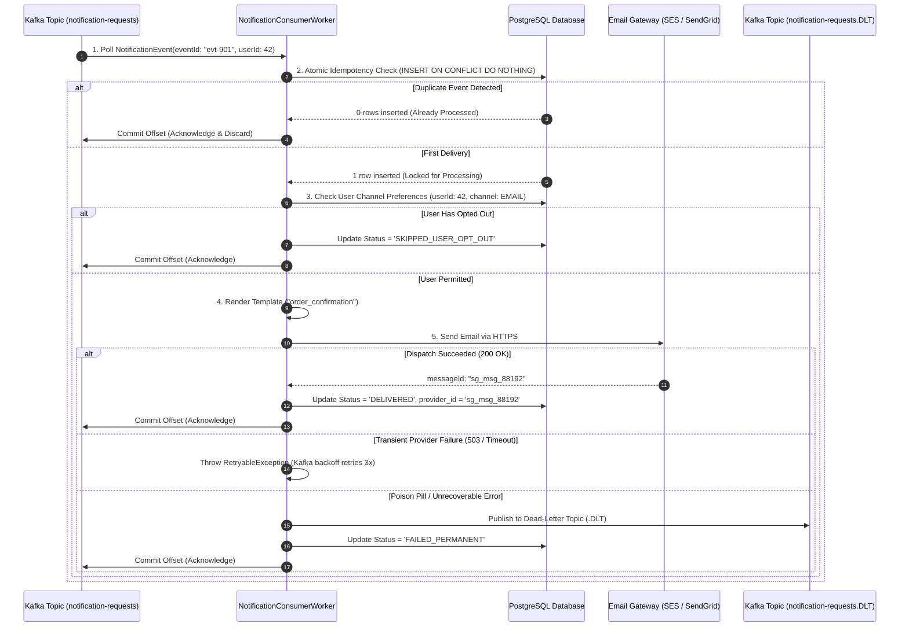
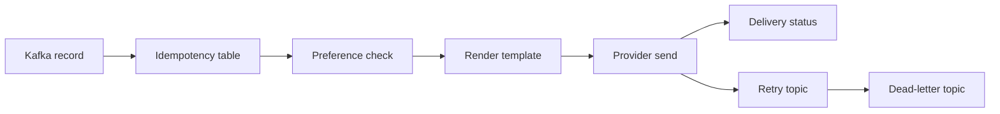

# Build Asynchronous Notification Worker: Complete Production Code

In modern web applications, notification processing (emails, SMS, mobile push alerts) must never execute synchronously inside an API request. Blocking an HTTP thread to connect to external email providers like SendGrid or AWS SES introduces latency spikes and risks thread pool starvation.

<Info>
Review multi-channel notification architecture, priority queues, and spam suppression algorithms first in [Design Notification System](/system-design/notification-system).
</Info>

This project implements an **Asynchronous Notification Worker Service** in **Java 21** and **Spring Boot 3.3+** using **Apache Kafka**, a **PostgreSQL idempotency deduplication table**, a dynamic template rendering engine, user channel preferences, non-blocking retries, and a complete **Testcontainers** integration test suite.

---

## 1. System Architecture & Worker Lifecycle



---

## 2. PostgreSQL Database Schema (Flyway Migration)

### `V1__init_notification_schema.sql`

```sql
-- 1. Notification Templates
CREATE TABLE notification_templates (
    id BIGSERIAL PRIMARY KEY,
    template_code VARCHAR(100) NOT NULL,
    channel VARCHAR(30) NOT NULL,
    subject_template VARCHAR(255) NOT NULL,
    body_template TEXT NOT NULL,
    is_active BOOLEAN NOT NULL DEFAULT TRUE,
    created_at TIMESTAMP WITH TIME ZONE NOT NULL DEFAULT CURRENT_TIMESTAMP,
    CONSTRAINT uq_template_channel UNIQUE (template_code, channel)
);

-- 2. User Notification Preferences (Opt-in / Opt-out)
CREATE TABLE notification_preferences (
    user_id BIGINT NOT NULL,
    channel VARCHAR(30) NOT NULL,
    is_enabled BOOLEAN NOT NULL DEFAULT TRUE,
    updated_at TIMESTAMP WITH TIME ZONE NOT NULL DEFAULT CURRENT_TIMESTAMP,
    PRIMARY KEY (user_id, channel)
);

-- 3. Delivery Records & Idempotency Store
CREATE TABLE notification_deliveries (
    id BIGSERIAL PRIMARY KEY,
    event_id UUID NOT NULL UNIQUE,
    user_id BIGINT NOT NULL,
    channel VARCHAR(30) NOT NULL,
    recipient_address VARCHAR(255) NOT NULL,
    status VARCHAR(50) NOT NULL,
    provider_message_id VARCHAR(150),
    error_message TEXT,
    retry_count INT NOT NULL DEFAULT 0,
    created_at TIMESTAMP WITH TIME ZONE NOT NULL DEFAULT CURRENT_TIMESTAMP,
    sent_at TIMESTAMP WITH TIME ZONE
);

CREATE INDEX idx_deliveries_user_id ON notification_deliveries(user_id);
CREATE INDEX idx_deliveries_status ON notification_deliveries(status);

-- Seed Default Notification Template
INSERT INTO notification_templates (template_code, channel, subject_template, body_template)
VALUES (
    'ORDER_CONFIRMED',
    'EMAIL',
    'Order #{{orderId}} Confirmed!',
    'Hello {{customerName}},\n\nThank you for your order of ${{amount}}! Your tracking ID will follow shortly.'
);
```

---

## 3. Java Domain Event & Entity Models

### `NotificationEvent.java` (Record)

```java
package com.example.notification.domain;

import java.time.Instant;
import java.util.Map;
import java.util.UUID;

public record NotificationEvent(
    UUID eventId,
    Long userId,
    String recipientEmail,
    Channel channel,
    String templateCode,
    Map<String, String> templateVariables,
    Instant timestamp
) {
    public enum Channel {
        EMAIL, SMS, PUSH
    }
}
```

### `NotificationDelivery.java` (JPA Entity)

```java
package com.example.notification.domain;

import jakarta.persistence.*;
import java.time.Instant;
import java.util.UUID;

@Entity
@Table(name = "notification_deliveries")
public class NotificationDelivery {

    @Id
    @GeneratedValue(strategy = GenerationType.IDENTITY)
    private Long id;

    @Column(name = "event_id", nullable = false, unique = true)
    private UUID eventId;

    @Column(name = "user_id", nullable = false)
    private Long userId;

    @Enumerated(EnumType.STRING)
    @Column(name = "channel", nullable = false)
    private NotificationEvent.Channel channel;

    @Column(name = "recipient_address", nullable = false)
    private String recipientAddress;

    @Enumerated(EnumType.STRING)
    @Column(name = "status", nullable = false)
    private DeliveryStatus status;

    @Column(name = "provider_message_id")
    private String providerMessageId;

    @Column(name = "error_message")
    private String errorMessage;

    @Column(name = "retry_count", nullable = false)
    private int retryCount;

    @Column(name = "created_at", nullable = false)
    private Instant createdAt;

    @Column(name = "sent_at")
    private Instant sentAt;

    public enum DeliveryStatus {
        PENDING, DELIVERED, SKIPPED_OPT_OUT, FAILED_PERMANENT
    }

    protected NotificationDelivery() {}

    public NotificationDelivery(UUID eventId, Long userId, NotificationEvent.Channel channel, String recipientAddress) {
        this.eventId = eventId;
        this.userId = userId;
        this.channel = channel;
        this.recipientAddress = recipientAddress;
        this.status = DeliveryStatus.PENDING;
        this.retryCount = 0;
        this.createdAt = Instant.now();
    }

    public void markDelivered(String providerMessageId) {
        this.status = DeliveryStatus.DELIVERED;
        this.providerMessageId = providerMessageId;
        this.sentAt = Instant.now();
    }

    public void markSkippedOptOut() {
        this.status = DeliveryStatus.SKIPPED_OPT_OUT;
    }

    public void markFailedPermanent(String errorMessage) {
        this.status = DeliveryStatus.FAILED_PERMANENT;
        this.errorMessage = errorMessage;
    }

    // Getters
    public Long getId() { return id; }
    public UUID getEventId() { return eventId; }
    public DeliveryStatus getStatus() { return status; }
    public String getProviderMessageId() { return providerMessageId; }
}
```

---

## 4. Template Rendering Engine & Third-Party Client

### `TemplateRenderer.java`

```java
package com.example.notification.service;

import org.springframework.jdbc.core.simple.JdbcClient;
import org.springframework.stereotype.Service;

import java.util.Map;
import java.util.Optional;

@Service
public class TemplateRenderer {

    private final JdbcClient jdbcClient;

    public TemplateRenderer(JdbcClient jdbcClient) {
        this.jdbcClient = jdbcClient;
    }

    public record RenderedContent(String subject, String body) {}

    public RenderedContent render(String templateCode, String channel, Map<String, String> variables) {
        Optional<TemplateRecord> templateOpt = jdbcClient.sql("""
            SELECT subject_template, body_template 
            FROM notification_templates 
            WHERE template_code = :code AND channel = :channel AND is_active = TRUE
        """)
        .param("code", templateCode)
        .param("channel", channel)
        .query(TemplateRecord.class)
        .optional();

        if (templateOpt.isEmpty()) {
            throw new IllegalArgumentException("Template not found: " + templateCode + " for channel " + channel);
        }

        TemplateRecord record = templateOpt.get();
        String subject = substituteVariables(record.subjectTemplate(), variables);
        String body = substituteVariables(record.bodyTemplate(), variables);

        return new RenderedContent(subject, body);
    }

    private String substituteVariables(String template, Map<String, String> variables) {
        String result = template;
        if (variables != null) {
            for (Map.Entry<String, String> entry : variables.entrySet()) {
                String token = "{{" + entry.getKey() + "}}";
                result = result.replace(token, entry.getValue());
            }
        }
        return result;
    }

    private record TemplateRecord(String subjectTemplate, String bodyTemplate) {}
}
```

### `EmailGatewayClient.java` (Third-Party Provider Simulation)

```java
package com.example.notification.service;

import org.slf4j.Logger;
import org.slf4j.LoggerFactory;
import org.springframework.stereotype.Component;

import java.util.UUID;

@Component
public class EmailGatewayClient {

    private static final Logger log = LoggerFactory.getLogger(EmailGatewayClient.class);

    public String sendEmail(String toEmail, String subject, String body) {
        log.info("Dispatching email via SendGrid API to: {}, Subject: {}", toEmail, subject);

        // Simulation: If email address is 'poison.pill@fail.com', simulate permanent error
        if ("poison.pill@fail.com".equalsIgnoreCase(toEmail)) {
            throw new IllegalArgumentException("Invalid recipient address: Simulated hard bounce.");
        }

        // Return simulated SendGrid message ID
        return "sg_msg_" + UUID.randomUUID().toString().substring(0, 8);
    }
}
```

---

## 5. Kafka Consumer Worker with Idempotency & Preferences

### `NotificationConsumerWorker.java`

```java
package com.example.notification.consumer;

import com.example.notification.domain.NotificationDelivery;
import com.example.notification.domain.NotificationEvent;
import com.example.notification.repository.NotificationDeliveryRepository;
import com.example.notification.service.EmailGatewayClient;
import com.example.notification.service.TemplateRenderer;
import org.slf4j.Logger;
import org.slf4j.LoggerFactory;
import org.springframework.dao.DataIntegrityViolationException;
import org.springframework.jdbc.core.simple.JdbcClient;
import org.springframework.kafka.annotation.KafkaListener;
import org.springframework.kafka.support.Acknowledgment;
import org.springframework.stereotype.Component;
import org.springframework.transaction.annotation.Transactional;

@Component
public class NotificationConsumerWorker {

    private static final Logger log = LoggerFactory.getLogger(NotificationConsumerWorker.class);

    private final JdbcClient jdbcClient;
    private final NotificationDeliveryRepository deliveryRepository;
    private final TemplateRenderer templateRenderer;
    private final EmailGatewayClient emailGatewayClient;

    public NotificationConsumerWorker(
            JdbcClient jdbcClient,
            NotificationDeliveryRepository deliveryRepository,
            TemplateRenderer templateRenderer,
            EmailGatewayClient emailGatewayClient) {
        this.jdbcClient = jdbcClient;
        this.deliveryRepository = deliveryRepository;
        this.templateRenderer = templateRenderer;
        this.emailGatewayClient = emailGatewayClient;
    }

    @KafkaListener(
        topics = "notification-requests",
        groupId = "notification-dispatch-workers"
    )
    @Transactional
    public void consume(NotificationEvent event, Acknowledgment ack) {
        log.info("Processing notification event {} for user {}", event.eventId(), event.userId());

        // Step 1: Enforce Idempotency via Atomic Database Reservation
        try {
            int inserted = jdbcClient.sql("""
                INSERT INTO notification_deliveries (event_id, user_id, channel, recipient_address, status)
                VALUES (:eventId, :userId, :channel, :recipient, 'PENDING')
                ON CONFLICT (event_id) DO NOTHING
            """)
            .param("eventId", event.eventId())
            .param("userId", event.userId())
            .param("channel", event.channel().name())
            .param("recipient", event.recipientEmail())
            .update();

            if (inserted == 0) {
                log.warn("Duplicate notification event {} detected. Acknowledging without re-sending.", event.eventId());
                ack.acknowledge();
                return;
            }
        } catch (DataIntegrityViolationException ex) {
            log.warn("Concurrent duplicate event {} detected.", event.eventId());
            ack.acknowledge();
            return;
        }

        NotificationDelivery delivery = deliveryRepository.findByEventId(event.eventId())
                .orElseThrow(() -> new IllegalStateException("Delivery record not found after insert: " + event.eventId()));

        // Step 2: Check User Channel Preferences
        Boolean isChannelEnabled = jdbcClient.sql("""
            SELECT is_enabled FROM notification_preferences 
            WHERE user_id = :userId AND channel = :channel
        """)
        .param("userId", event.userId())
        .param("channel", event.channel().name())
        .query(Boolean.class)
        .optional()
        .orElse(true); // Default to true if user hasn't explicitly configured

        if (!isChannelEnabled) {
            log.info("User {} has opted out of {} notifications. Skipping delivery.", event.userId(), event.channel());
            delivery.markSkippedOptOut();
            deliveryRepository.save(delivery);
            ack.acknowledge();
            return;
        }

        // Step 3: Render Template
        TemplateRenderer.RenderedContent rendered = templateRenderer.render(
            event.templateCode(),
            event.channel().name(),
            event.templateVariables()
        );

        // Step 4: Dispatch via Email Provider
        try {
            String providerMessageId = emailGatewayClient.sendEmail(
                event.recipientEmail(),
                rendered.subject(),
                rendered.body()
            );

            // Step 5: Update Delivery Status & Commit Offset
            delivery.markDelivered(providerMessageId);
            deliveryRepository.save(delivery);
            ack.acknowledge();
            log.info("Successfully delivered notification {} via provider ID {}", event.eventId(), providerMessageId);

        } catch (IllegalArgumentException permanentError) {
            // Poison pill / unrecoverable address format
            log.error("Permanent failure sending notification {}: {}", event.eventId(), permanentError.getMessage());
            delivery.markFailedPermanent(permanentError.getMessage());
            deliveryRepository.save(delivery);
            ack.acknowledge(); // Acknowledge to remove poisoned message from main queue
        }
    }
}
```

Line-by-line worker proof:

- `@KafkaListener` subscribes this method to `notification-requests` as part of the `notification-dispatch-workers` consumer group.
- `@Transactional` makes the delivery-row reservation and status update one database transaction. The Kafka acknowledgment still happens manually after the important work.
- `INSERT ... ON CONFLICT (event_id) DO NOTHING` is the idempotency gate. Duplicate Kafka deliveries become zero-row inserts instead of duplicate emails.
- `inserted == 0` means another worker or previous attempt already reserved the event, so the listener acknowledges and exits.
- `DataIntegrityViolationException` handles the race where two workers try the same insert at nearly the same time.
- `findByEventId(...)` loads the delivery record created by the reservation. If it is missing, the transaction is corrupted and should fail.
- The preferences query is scoped by `user_id` and `channel`, so opting out of email does not disable SMS or push by accident.
- `orElse(true)` is a product choice: default opt-in. If the product requires explicit consent, this must be `false`.
- `ack.acknowledge()` happens only after duplicate detection, opt-out persistence, successful delivery, or permanent failure recording.
- Transient provider failures are intentionally not acknowledged here; they should be retried or sent to a DLT depending on the configured error handler.

Proof drill: publish the same event ID 10 times. The database should contain one delivery row, the fake provider should be called once, and the Kafka offsets should still advance.

---

## 6. End-to-End Integration Testing with Testcontainers

This integration test verifies the full stack: Kafka event publishing, template substitution, user preferences suppression, and duplicate message deduplication:

```java
package com.example.notification;

import com.example.notification.domain.NotificationDelivery;
import com.example.notification.domain.NotificationEvent;
import com.example.notification.repository.NotificationDeliveryRepository;
import org.junit.jupiter.api.DisplayName;
import org.junit.jupiter.api.Test;
import org.springframework.beans.factory.annotation.Autowired;
import org.springframework.boot.test.context.SpringBootTest;
import org.springframework.jdbc.core.simple.JdbcClient;
import org.springframework.kafka.core.KafkaTemplate;
import org.springframework.test.context.DynamicPropertyRegistry;
import org.springframework.test.context.DynamicPropertySource;
import org.testcontainers.containers.PostgreSQLContainer;
import org.testcontainers.junit.jupiter.Container;
import org.testcontainers.junit.jupiter.Testcontainers;
import org.testcontainers.kafka.KafkaContainer;

import java.time.Duration;
import java.time.Instant;
import java.util.Map;
import java.util.UUID;
import java.util.concurrent.TimeUnit;

import static org.assertj.core.api.Assertions.assertThat;
import static org.awaitility.Awaitility.await;

@SpringBootTest
@Testcontainers
class NotificationWorkerIntegrationTest {

    @Container
    static PostgreSQLContainer<?> postgres = new PostgreSQLContainer<>("postgres:16-alpine");

    @Container
    static KafkaContainer kafka = new KafkaContainer("apache/kafka-native:3.8.0");

    @DynamicPropertySource
    static void configureProperties(DynamicPropertyRegistry registry) {
        registry.add("spring.datasource.url", postgres::getJdbcUrl);
        registry.add("spring.datasource.username", postgres::getUsername);
        registry.add("spring.datasource.password", postgres::getPassword);
        registry.add("spring.kafka.bootstrap-servers", kafka::getBootstrapServers);
    }

    @Autowired
    private KafkaTemplate<String, Object> kafkaTemplate;

    @Autowired
    private NotificationDeliveryRepository deliveryRepository;

    @Autowired
    private JdbcClient jdbcClient;

    @Test
    @DisplayName("Valid notification event is consumed, rendered, and marked DELIVERED")
    void validEvent_ProcessesAndMarksDelivered() {
        UUID eventId = UUID.randomUUID();
        NotificationEvent event = new NotificationEvent(
            eventId,
            101L,
            "alice@example.com",
            NotificationEvent.Channel.EMAIL,
            "ORDER_CONFIRMED",
            Map.of("orderId", "9042", "customerName", "Alice", "amount", "149.99"),
            Instant.now()
        );

        kafkaTemplate.send("notification-requests", event.userId().toString(), event);

        await().atMost(10, TimeUnit.SECONDS).untilAsserted(() -> {
            var deliveryOpt = deliveryRepository.findByEventId(eventId);
            assertThat(deliveryOpt).isPresent();
            NotificationDelivery delivery = deliveryOpt.get();
            assertThat(delivery.getStatus()).isEqualTo(NotificationDelivery.DeliveryStatus.DELIVERED);
            assertThat(delivery.getProviderMessageId()).startsWith("sg_msg_");
        });
    }

    @Test
    @DisplayName("Duplicate event delivery is deduplicated and does not re-send")
    void duplicateEvent_IsIgnoredByDeduplicationTable() {
        UUID eventId = UUID.randomUUID();
        NotificationEvent event = new NotificationEvent(
            eventId,
            102L,
            "bob@example.com",
            NotificationEvent.Channel.EMAIL,
            "ORDER_CONFIRMED",
            Map.of("orderId", "9043", "customerName", "Bob", "amount", "50.00"),
            Instant.now()
        );

        // Publish identical message twice
        kafkaTemplate.send("notification-requests", event.userId().toString(), event);
        kafkaTemplate.send("notification-requests", event.userId().toString(), event);

        await().atMost(10, TimeUnit.SECONDS).untilAsserted(() -> {
            var deliveryOpt = deliveryRepository.findByEventId(eventId);
            assertThat(deliveryOpt).isPresent();
            assertThat(deliveryOpt.get().getStatus()).isEqualTo(NotificationDelivery.DeliveryStatus.DELIVERED);
        });

        // Verify only 1 record exists in the database table
        int count = jdbcClient.sql("SELECT COUNT(*) FROM notification_deliveries WHERE event_id = :id")
                .param("id", eventId)
                .query(Integer.class)
                .single();
        assertThat(count).isEqualTo(1);
    }

    @Test
    @DisplayName("User who opted out of EMAIL channel has notification marked SKIPPED_OPT_OUT")
    void userOptedOut_NotificationIsSkipped() {
        Long optedOutUserId = 205L;
        // Insert opt-out preference
        jdbcClient.sql("INSERT INTO notification_preferences (user_id, channel, is_enabled) VALUES (:userId, 'EMAIL', FALSE)")
                .param("userId", optedOutUserId)
                .update();

        UUID eventId = UUID.randomUUID();
        NotificationEvent event = new NotificationEvent(
            eventId,
            optedOutUserId,
            "optout@example.com",
            NotificationEvent.Channel.EMAIL,
            "ORDER_CONFIRMED",
            Map.of("orderId", "9044", "customerName", "OptOutUser", "amount", "10.00"),
            Instant.now()
        );

        kafkaTemplate.send("notification-requests", event.userId().toString(), event);

        await().atMost(10, TimeUnit.SECONDS).untilAsserted(() -> {
            var deliveryOpt = deliveryRepository.findByEventId(eventId);
            assertThat(deliveryOpt).isPresent();
            assertThat(deliveryOpt.get().getStatus()).isEqualTo(NotificationDelivery.DeliveryStatus.SKIPPED_OPT_OUT);
            assertThat(deliveryOpt.get().getProviderMessageId()).isNull();
        });
    }
}
```

---

## Project Proof Drill

The notification worker is complete when it proves asynchronous reliability. The worker must survive duplicate messages, provider timeouts, user preference changes, poison messages, and provider rate limits.



| Proof target | Required evidence |
| --- | --- |
| Duplicate safety | Same event processed twice sends at most once per channel. |
| Preference timing | Opt-out before send prevents delivery even if event was queued earlier. |
| Provider timeout | Worker retries without blocking the consumer partition forever. |
| Poison message | Bad payload reaches DLT instead of looping forever. |
| Observability | Delivery attempts include event ID, user ID, channel, provider status, and retry count. |

Failure drill:

| Failure | Production behavior |
| --- | --- |
| Provider returns 429 | Worker backs off and respects channel throttling. |
| Worker crashes after provider accepts send | Dedup/status prevents duplicate delivery on retry. |
| Template variable missing | Message goes to DLT with actionable error. |
| User unsubscribes during queue delay | Preference check near send time blocks promotional notification. |

## 7. Active Recall Mastery Questions

<AccordionGroup>
  <Accordion title="1. Why must notification delivery workers be strictly idempotent?">
    Message brokers like Kafka and RabbitMQ guarantee **at-least-once delivery**. 
    
    If network latency causes an acknowledgment packet to be dropped between the worker and the broker, the broker re-delivers the record to another worker. Without an idempotency deduplication table (`INSERT ... ON CONFLICT DO NOTHING`), the customer would receive duplicate credit card charge alerts or duplicate confirmation emails.
  </Accordion>

  <Accordion title="2. Why should notification processing never happen inside the synchronous HTTP request thread?">
    External email and SMS providers (SendGrid, Twilio, AWS SES) are third-party HTTP endpoints subject to network latency, DNS resolution delays, and rate limiting. 
    
    If an application sends emails synchronously inside the `POST /checkout` controller, a 3-second SendGrid timeout holds the Tomcat thread and database connection open. Under load, 50 slow requests exhaust the server's thread pool, bringing down the entire API for all users.
  </Accordion>

  <Accordion title="3. How do you distinguish between retryable and non-retryable notification failures?">
    - **Retryable Failures**: Network connection timeouts, HTTP 503 Service Unavailable, and temporary provider rate limits (`429 Too Many Requests`). These are resolved by retrying with exponential backoff and jitter.
    - **Non-Retryable Failures (Poison Pills)**: Invalid email address syntax, missing mandatory template variables, or unmapped template codes. Retrying these will never succeed; they must be acknowledged, recorded as `FAILED_PERMANENT`, and routed to a Dead-Letter Topic (DLT) for engineering triage.
  </Accordion>
</AccordionGroup>

---

## 8. Done Checklist

<Check>
Notification events are published asynchronously to Apache Kafka, keeping user HTTP request threads sub-10ms.
</Check>
<Check>
The consumer enforces strict idempotency using an atomic PostgreSQL `ON CONFLICT DO NOTHING` reservation.
</Check>
<Check>
User channel preferences (email/SMS opt-outs) are evaluated before dispatching messages to external providers.
</Check>
<Check>
Dynamic template substitution safely injects variables into database-stored email templates.
</Check>
<Check>
Integration tests with Testcontainers Kafka and PostgreSQL verify happy path, deduplication, and user opt-out behavior.
</Check>
