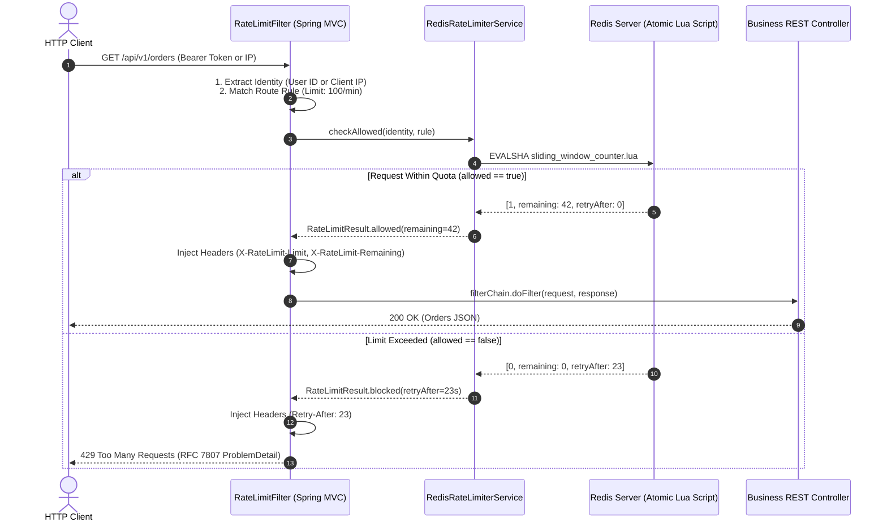
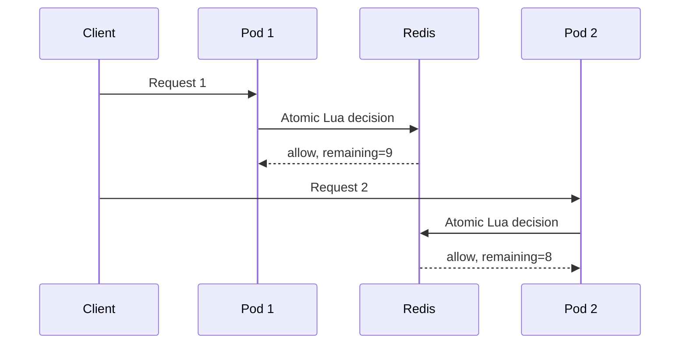

# Build Distributed Rate Limiter: Complete Production Code

A distributed rate limiter protects backend services from brute-force authentication attacks, abusive web scrapers, resource starvation, and cascading outages.

<Info>
Review rate limiter algorithms (Token Bucket, Leaky Bucket, Fixed Window, Sliding Window Counter), mathematical comparisons, and system capacity design first in [Design Distributed Rate Limiter](/system-design/rate-limiter).
</Info>

This project implements a production-grade, distributed rate limiter in **Java 21** and **Spring Boot 3.3+** using an atomic **Redis Lua script**, customizable route-level rules, `OncePerRequestFilter`, standard HTTP headers, and a complete **Testcontainers** integration test suite.

---

## 1. System Architecture & Request Lifecycle



---

## 2. Project Setup & Maven Dependencies

### `pom.xml`

```xml
<?xml version="1.0" encoding="UTF-8"?>
<project xmlns="http://maven.apache.org/POM/4.0.0"
         xmlns:xsi="http://www.w3.org/2001/XMLSchema-instance"
         xsi:schemaLocation="http://maven.apache.org/POM/4.0.0 
         https://maven.apache.org/xsd/maven-4.0.0.xsd">
    <modelVersion>4.0.0</modelVersion>

    <parent>
        <groupId>org.springframework.boot</groupId>
        <artifactId>spring-boot-starter-parent</artifactId>
        <version>3.3.3</version>
        <relativePath/>
    </parent>

    <groupId>com.example</groupId>
    <artifactId>rate-limiter-service</artifactId>
    <version>1.0.0</version>
    <name>rate-limiter-service</name>

    <properties>
        <java.version>21</java.version>
        <testcontainers.version>1.20.1</testcontainers.version>
    </properties>

    <dependencies>
        <!-- Spring Boot Web & Actuator -->
        <dependency>
            <groupId>org.springframework.boot</groupId>
            <artifactId>spring-boot-starter-web</artifactId>
        </dependency>
        <dependency>
            <groupId>org.springframework.boot</groupId>
            <artifactId>spring-boot-starter-actuator</artifactId>
        </dependency>
        <dependency>
            <groupId>org.springframework.boot</groupId>
            <artifactId>spring-boot-starter-validation</artifactId>
        </dependency>

        <!-- Spring Data Redis & Connection Pool -->
        <dependency>
            <groupId>org.springframework.boot</groupId>
            <artifactId>spring-boot-starter-data-redis</artifactId>
        </dependency>
        <dependency>
            <groupId>org.apache.commons</groupId>
            <artifactId>commons-pool2</artifactId>
        </dependency>

        <!-- Testing & Testcontainers -->
        <dependency>
            <groupId>org.springframework.boot</groupId>
            <artifactId>spring-boot-starter-test</artifactId>
            <scope>test</scope>
        </dependency>
        <dependency>
            <groupId>org.testcontainers</groupId>
            <artifactId>junit-jupiter</artifactId>
            <scope>test</scope>
        </dependency>
        <dependency>
            <groupId>com.redis</groupId>
            <artifactId>testcontainers-redis</artifactId>
            <version>2.2.2</version>
            <scope>test</scope>
        </dependency>
        <dependency>
            <groupId>org.awaitility</groupId>
            <artifactId>awaitility</artifactId>
            <scope>test</scope>
        </dependency>
    </dependencies>
</project>
```

---

## 3. Atomic Redis Lua Script: Sliding Window Counter

In distributed systems, check-and-increment operations across multiple Redis calls create severe race conditions.

We implement the **Sliding Window Counter algorithm** directly inside an atomic Lua script:
- Weighted average of the current minute window and the previous minute window.
- Eliminates 2x boundary traffic bursts while maintaining strict $O(1)$ memory consumption per user.

### `src/main/resources/scripts/sliding_window_limiter.lua`

```lua
-- KEYS[1]: Current window Redis key (e.g. "rate:login:ip_203.0.113.10:288100")
-- KEYS[2]: Previous window Redis key (e.g. "rate:login:ip_203.0.113.10:288099")
-- ARGV[1]: Max limit allowed in the window (e.g. 5)
-- ARGV[2]: Window size in seconds (e.g. 60)
-- ARGV[3]: Current epoch timestamp in seconds
-- ARGV[4]: Cost of this request (default: 1)

local current_key = KEYS[1]
local prev_key = KEYS[2]
local limit = tonumber(ARGV[1])
local window_size = tonumber(ARGV[2])
local now = tonumber(ARGV[3])
local cost = tonumber(ARGV[4])

-- 1. Fetch count from previous window (returns 0 if expired)
local prev_count = tonumber(redis.call('GET', prev_key)) or 0

-- 2. Fetch count from current window
local current_count = tonumber(redis.call('GET', current_key)) or 0

-- 3. Calculate time elapsed inside current window
local time_in_current_window = now % window_size
local time_weight = (window_size - time_in_current_window) / window_size

-- 4. Calculate estimated requests in sliding window
local estimated_requests = math.floor(prev_count * time_weight + current_count)

if estimated_requests + cost > limit then
    -- Rate limit exceeded!
    local retry_after = window_size - time_in_current_window
    return {0, 0, retry_after} -- [0 = blocked, 0 remaining, retry_after seconds]
else
    -- Request permitted: Increment current window counter atomically
    local new_count = redis.call('INCRBY', current_key, cost)
    if new_count == cost then
        -- Set TTL to 2x window size to ensure it survives for the next window calculation
        redis.call('EXPIRE', current_key, window_size * 2)
    end
    
    local remaining = limit - (estimated_requests + cost)
    return {1, remaining, 0} -- [1 = allowed, remaining count, 0 retry]
end
```

---

## 4. Java Domain Models & Rate Limit Strategy

### `RateLimitRule.java`

```java
package com.example.ratelimiter.domain;

import java.time.Duration;

public record RateLimitRule(
    String routePrefix,
    int maxRequests,
    Duration windowDuration,
    FailPolicy failPolicy
) {
    public enum FailPolicy {
        FAIL_OPEN,   // Allow traffic if Redis is down (preferred for normal GET reads)
        FAIL_CLOSED  // Block traffic if Redis is down (preferred for sensitive /login or /checkout)
    }

    public static RateLimitRule of(String routePrefix, int maxRequests, Duration window, FailPolicy policy) {
        return new RateLimitRule(routePrefix, maxRequests, window, policy);
    }
}
```

### `RateLimitResult.java`

```java
package com.example.ratelimiter.domain;

public record RateLimitResult(
    boolean isAllowed,
    long remainingLimit,
    long retryAfterSeconds,
    long limitCapacity
) {
    public static RateLimitResult allowed(long remaining, long capacity) {
        return new RateLimitResult(true, remaining, 0L, capacity);
    }

    public static RateLimitResult blocked(long retryAfter, long capacity) {
        return new RateLimitResult(false, 0L, retryAfter, capacity);
    }
}
```

---

## 5. Rate Limiter Service Implementation

### `RedisRateLimiterService.java`

```java
package com.example.ratelimiter.service;

import com.example.ratelimiter.domain.RateLimitResult;
import com.example.ratelimiter.domain.RateLimitRule;
import org.slf4j.Logger;
import org.slf4j.LoggerFactory;
import org.springframework.core.io.ClassPathResource;
import org.springframework.data.redis.core.StringRedisTemplate;
import org.springframework.data.redis.core.script.DefaultRedisScript;
import org.springframework.scripting.support.ResourceScriptSource;
import org.springframework.stereotype.Service;

import java.time.Instant;
import java.util.Arrays;
import java.util.List;

@Service
public class RedisRateLimiterService {

    private static final Logger log = LoggerFactory.getLogger(RedisRateLimiterService.class);
    
    private final StringRedisTemplate redisTemplate;
    private final DefaultRedisScript<List> limiterScript;

    public RedisRateLimiterService(StringRedisTemplate redisTemplate) {
        this.redisTemplate = redisTemplate;
        this.limiterScript = new DefaultRedisScript<>();
        this.limiterScript.setScriptSource(
            new ResourceScriptSource(new ClassPathResource("scripts/sliding_window_limiter.lua"))
        );
        this.limiterScript.setResultType(List.class);
    }

    public RateLimitResult checkLimit(String identity, RateLimitRule rule) {
        long nowEpoch = Instant.now().getEpochSecond();
        long windowSeconds = rule.windowDuration().toSeconds();
        long currentWindowIndex = nowEpoch / windowSeconds;
        long prevWindowIndex = currentWindowIndex - 1;

        String currentKey = String.format("rate:%s:%s:%d", rule.routePrefix(), identity, currentWindowIndex);
        String prevKey = String.format("rate:%s:%s:%d", rule.routePrefix(), identity, prevWindowIndex);

        try {
            List<?> result = redisTemplate.execute(
                limiterScript,
                Arrays.asList(currentKey, prevKey),
                String.valueOf(rule.maxRequests()),
                String.valueOf(windowSeconds),
                String.valueOf(nowEpoch),
                "1" // Cost of 1 request
            );

            if (result == null || result.size() < 3) {
                log.warn("Redis rate limiter returned null/invalid response. Applying fail policy.");
                return handleFailure(rule);
            }

            long allowed = ((Number) result.get(0)).longValue();
            long remaining = ((Number) result.get(1)).longValue();
            long retryAfter = ((Number) result.get(2)).longValue();

            if (allowed == 1L) {
                return RateLimitResult.allowed(remaining, rule.maxRequests());
            } else {
                return RateLimitResult.blocked(retryAfter, rule.maxRequests());
            }

        } catch (Exception ex) {
            log.error("Redis connectivity error during rate limiting for identity {}: {}", identity, ex.getMessage());
            return handleFailure(rule);
        }
    }

    private RateLimitResult handleFailure(RateLimitRule rule) {
        if (rule.failPolicy() == RateLimitRule.FailPolicy.FAIL_OPEN) {
            log.warn("Redis down: FAIL_OPEN permitting request for route {}", rule.routePrefix());
            return RateLimitResult.allowed(1, rule.maxRequests());
        } else {
            log.error("Redis down: FAIL_CLOSED rejecting request for route {}", rule.routePrefix());
            return RateLimitResult.blocked(60, rule.maxRequests());
        }
    }
}
```

---

## 6. HTTP Servlet Filter with Standard RFC Headers

### `RateLimitFilter.java`

```java
package com.example.ratelimiter.filter;

import com.example.ratelimiter.domain.RateLimitResult;
import com.example.ratelimiter.domain.RateLimitRule;
import com.example.ratelimiter.service.RedisRateLimiterService;
import com.fasterxml.jackson.databind.ObjectMapper;
import jakarta.servlet.FilterChain;
import jakarta.servlet.ServletException;
import jakarta.servlet.http.HttpServletRequest;
import jakarta.servlet.http.HttpServletResponse;
import org.springframework.http.HttpStatus;
import org.springframework.http.MediaType;
import org.springframework.http.ProblemDetail;
import org.springframework.stereotype.Component;
import org.springframework.web.filter.OncePerRequestFilter;

import java.io.IOException;
import java.net.URI;
import java.time.Duration;
import java.util.List;

@Component
public class RateLimitFilter extends OncePerRequestFilter {

    private final RedisRateLimiterService rateLimiterService;
    private final ObjectMapper objectMapper;

    // Configured Route Protection Rules
    private final List<RateLimitRule> rules = List.of(
        RateLimitRule.of("/api/auth/login", 5, Duration.ofMinutes(1), RateLimitRule.FailPolicy.FAIL_CLOSED),
        RateLimitRule.of("/api/urls", 30, Duration.ofMinutes(1), RateLimitRule.FailPolicy.FAIL_OPEN),
        RateLimitRule.of("/api/orders", 100, Duration.ofMinutes(1), RateLimitRule.FailPolicy.FAIL_OPEN)
    );

    public RateLimitFilter(RedisRateLimiterService rateLimiterService, ObjectMapper objectMapper) {
        this.rateLimiterService = rateLimiterService;
        this.objectMapper = objectMapper;
    }

    @Override
    protected void doFilterInternal(
            HttpServletRequest request,
            HttpServletResponse response,
            FilterChain filterChain) throws ServletException, IOException {

        String path = request.getRequestURI();
        RateLimitRule matchedRule = findMatchingRule(path);

        // If path is not rate-limited, proceed directly
        if (matchedRule == null) {
            filterChain.doFilter(request, response);
            return;
        }

        String identity = resolveClientIdentity(request);
        RateLimitResult result = rateLimiterService.checkLimit(identity, matchedRule);

        // Standard HTTP Rate Limiting Headers
        response.setHeader("X-RateLimit-Limit", String.valueOf(result.limitCapacity()));
        response.setHeader("X-RateLimit-Remaining", String.valueOf(result.remainingLimit()));

        if (!result.isAllowed()) {
            response.setHeader("Retry-After", String.valueOf(result.retryAfterSeconds()));
            response.setStatus(HttpStatus.TOO_MANY_REQUESTS.value());
            response.setContentType(MediaType.APPLICATION_PROBLEM_JSON_VALUE);

            ProblemDetail problem = ProblemDetail.forStatusAndDetail(
                HttpStatus.TOO_MANY_REQUESTS,
                "Rate limit exceeded. Please retry after " + result.retryAfterSeconds() + " seconds."
            );
            problem.setTitle("Too Many Requests");
            problem.setType(URI.create("https://api.example.com/errors/rate-limit-exceeded"));
            problem.setProperty("retryAfterSeconds", result.retryAfterSeconds());

            response.getWriter().write(objectMapper.writeValueAsString(problem));
            return;
        }

        filterChain.doFilter(request, response);
    }

    private RateLimitRule findMatchingRule(String path) {
        return rules.stream()
                .filter(rule -> path.startsWith(rule.routePrefix()))
                .findFirst()
                .orElse(null);
    }

    private String resolveClientIdentity(HttpServletRequest request) {
        // Priority 1: Authenticated User ID from Security Context or Bearer Token Header
        String authHeader = request.getHeader("X-User-Id");
        if (authHeader != null && !authHeader.isBlank()) {
            return "user:" + authHeader.trim();
        }

        // Priority 2: Trusted Client IP (Resolves X-Forwarded-For if behind trusted reverse proxy)
        String xForwardedFor = request.getHeader("X-Forwarded-For");
        if (xForwardedFor != null && !xForwardedFor.isBlank()) {
            return "ip:" + xForwardedFor.split(",")[0].trim();
        }

        return "ip:" + request.getRemoteAddr();
    }
}
```

---

## 7. Dummy REST Controller for End-to-End Testing

### `SampleApiController.java`

```java
package com.example.ratelimiter.controller;

import org.springframework.http.ResponseEntity;
import org.springframework.web.bind.annotation.*;

import java.util.Map;

@RestController
@RequestMapping("/api")
public class SampleApiController {

    @PostMapping("/auth/login")
    public ResponseEntity<Map<String, String>> login(@RequestBody Map<String, String> credentials) {
        return ResponseEntity.ok(Map.of("message", "Login successful"));
    }

    @PostMapping("/urls")
    public ResponseEntity<Map<String, String>> createUrl(@RequestBody Map<String, String> payload) {
        return ResponseEntity.ok(Map.of("shortUrl", "https://tiny.dev/xyz987"));
    }

    @GetMapping("/orders")
    public ResponseEntity<Map<String, String>> getOrders() {
        return ResponseEntity.ok(Map.of("status", "Active orders list"));
    }
}
```

---

## 8. End-to-End Integration Testing with Testcontainers Redis

Never mock Redis when testing rate limiters. In-memory mocks do not execute Lua scripts, test atomicity, or verify TTL expiration.

Below is the complete integration test class:

```java
package com.example.ratelimiter;

import com.redis.testcontainers.RedisContainer;
import org.junit.jupiter.api.DisplayName;
import org.junit.jupiter.api.Test;
import org.springframework.beans.factory.annotation.Autowired;
import org.springframework.boot.test.autoconfigure.web.servlet.AutoConfigureMockMvc;
import org.springframework.boot.test.context.SpringBootTest;
import org.springframework.http.MediaType;
import org.springframework.test.context.DynamicPropertyRegistry;
import org.springframework.test.context.DynamicPropertySource;
import org.springframework.test.web.servlet.MockMvc;
import org.testcontainers.junit.jupiter.Container;
import org.testcontainers.junit.jupiter.Testcontainers;
import org.testcontainers.utility.DockerImageName;

import java.util.concurrent.CountDownLatch;
import java.util.concurrent.ExecutorService;
import java.util.concurrent.Executors;
import java.util.concurrent.atomic.AtomicInteger;

import static org.assertj.core.api.Assertions.assertThat;
import static org.springframework.test.web.servlet.request.MockMvcRequestBuilders.post;
import static org.springframework.test.web.servlet.result.MockMvcResultMatchers.*;

@SpringBootTest
@AutoConfigureMockMvc
@Testcontainers
class RateLimiterIntegrationTest {

    @Container
    static RedisContainer redis = new RedisContainer(DockerImageName.parse("redis:7.2-alpine"));

    @DynamicPropertySource
    static void redisProperties(DynamicPropertyRegistry registry) {
        registry.add("spring.data.redis.host", redis::getHost);
        registry.add("spring.data.redis.port", () -> redis.getFirstMappedPort().toString());
    }

    @Autowired
    private MockMvc mockMvc;

    @Test
    @DisplayName("Requests within limit succeed with 200 OK and valid remaining headers")
    void underLimit_SucceedsWithRateLimitHeaders() throws Exception {
        mockMvc.perform(post("/api/auth/login")
                .contentType(MediaType.APPLICATION_JSON)
                .header("X-Forwarded-For", "198.51.100.1")
                .content("{\"email\":\"alice@example.com\"}"))
                .andExpect(status().isOk())
                .andExpect(header().string("X-RateLimit-Limit", "5"))
                .andExpect(header().string("X-RateLimit-Remaining", "4"));
    }

    @Test
    @DisplayName("Exceeding 5 login requests triggers 429 Too Many Requests with Retry-After")
    void exceedingLimit_Returns429TooManyRequests() throws Exception {
        String clientIp = "198.51.100.2";

        // First 5 requests must pass
        for (int i = 0; i < 5; i++) {
            mockMvc.perform(post("/api/auth/login")
                    .contentType(MediaType.APPLICATION_JSON)
                    .header("X-Forwarded-For", clientIp)
                    .content("{\"email\":\"test@example.com\"}"))
                    .andExpect(status().isOk());
        }

        // 6th request must be blocked with HTTP 429
        mockMvc.perform(post("/api/auth/login")
                .contentType(MediaType.APPLICATION_JSON)
                .header("X-Forwarded-For", clientIp)
                .content("{\"email\":\"test@example.com\"}"))
                .andExpect(status().isTooManyRequests())
                .andExpect(header().string("X-RateLimit-Remaining", "0"))
                .andExpect(header().exists("Retry-After"))
                .andExpect(jsonPath("$.title").value("Too Many Requests"))
                .andExpect(jsonPath("$.status").value(429));
    }

    @Test
    @DisplayName("Concurrent burst: 20 simultaneous threads against 5-request limit allows exactly 5")
    void concurrentBurst_AllowsExactlyLimit() throws Exception {
        String clientIp = "198.51.100.3";
        int threadCount = 20;
        ExecutorService executor = Executors.newFixedThreadPool(threadCount);
        CountDownLatch startGate = new CountDownLatch(1);
        CountDownLatch finishGate = new CountDownLatch(threadCount);

        AtomicInteger successCount = new AtomicInteger(0);
        AtomicInteger blockedCount = new AtomicInteger(0);

        for (int i = 0; i < threadCount; i++) {
            executor.submit(() -> {
                try {
                    startGate.await(); // Synchronize all threads to execute simultaneously
                    int status = mockMvc.perform(post("/api/auth/login")
                            .contentType(MediaType.APPLICATION_JSON)
                            .header("X-Forwarded-For", clientIp)
                            .content("{\"email\":\"burst@example.com\"}"))
                            .andReturn()
                            .getResponse()
                            .getStatus();

                    if (status == 200) successCount.incrementAndGet();
                    else if (status == 429) blockedCount.incrementAndGet();
                } catch (Exception e) {
                    // Ignore test interruption
                } finally {
                    finishGate.countDown();
                }
            });
        }

        startGate.countDown(); // Trigger simultaneous burst
        finishGate.await();
        executor.shutdown();

        assertThat(successCount.get()).isEqualTo(5);
        assertThat(blockedCount.get()).isEqualTo(15);
    }
}
```

---

## 9. Verification with `curl`

### 1. Test Normal Allowed Request
```bash
curl -i -X POST http://localhost:8080/api/auth/login \
  -H "Content-Type: application/json" \
  -H "X-Forwarded-For: 203.0.113.42" \
  -d '{"email":"test@company.com"}'
```

#### Expected HTTP Response:
```http
HTTP/1.1 200 OK
Content-Type: application/json
X-RateLimit-Limit: 5
X-RateLimit-Remaining: 4

{"message":"Login successful"}
```

### 2. Test Rate-Limited Request (After 5 Requests)
```bash
curl -i -X POST http://localhost:8080/api/auth/login \
  -H "Content-Type: application/json" \
  -H "X-Forwarded-For: 203.0.113.42" \
  -d '{"email":"test@company.com"}'
```

#### Expected HTTP Response:
```http
HTTP/1.1 429 Too Many Requests
Content-Type: application/problem+json
X-RateLimit-Limit: 5
X-RateLimit-Remaining: 0
Retry-After: 38

{
  "type": "https://api.example.com/errors/rate-limit-exceeded",
  "title": "Too Many Requests",
  "status": 429,
  "detail": "Rate limit exceeded. Please retry after 38 seconds.",
  "retryAfterSeconds": 38
}
```

---

## Project Proof Drill

This project proves that rate limiting is a distributed systems problem. A passing implementation must make the same decision across multiple application pods and must expose clear behavior to clients.



| Proof target | Required evidence |
| --- | --- |
| Atomic decision | Concurrent requests cannot exceed the limit through race conditions. |
| Multi-pod correctness | Requests distributed across pods share the same budget. |
| Useful rejection | `429` includes `Retry-After` and rate limit headers. |
| Policy flexibility | Different routes can use different limits. |
| Redis failure policy | Behavior is intentionally fail-open or fail-closed per route. |

Load drill:

```bash
hey -n 200 -c 50 http://localhost:8080/api/search?q=spring
```

Expected evidence:

| Metric | What it proves |
| --- | --- |
| allowed count | Requests under budget pass. |
| rejected count | Excess requests get `429`. |
| Redis latency | Limiter storage is not the bottleneck. |
| hot keys | One user/API key is not overwhelming shared capacity. |

## 10. Active Recall Mastery Questions

<AccordionGroup>
  <Accordion title="1. Why is an atomic Lua script required instead of consecutive Redis GET and INCR commands?">
    If the application executed `GET key` followed by `INCR key` over two separate network round-trips, concurrent threads from different application pods could both observe the counter at `limit - 1` before either increments. Both threads would proceed, permitting double the allowed traffic. 
    
    A Redis Lua script executes atomically within Redis's single-threaded event loop. No other thread or command can interleave between the check and the increment.
  </Accordion>

  <Accordion title="2. What is the difference between Fail Open and Fail Closed when Redis is unavailable?">
    - **Fail Open**: If Redis crashes or experiences a network partition, the limiter permits incoming requests to proceed. Recommended for standard read endpoints (product catalog, public feeds) to maintain high availability.
    - **Fail Closed**: If Redis is unavailable, the limiter rejects incoming requests with HTTP 429 or 503. Recommended for sensitive operations (login, checkout, credit card authorization) to protect backend services and prevent brute-force credential stuffing.
  </Accordion>

  <Accordion title="3. How can client IP rate limiting be bypassed, and how do you prevent IP spoofing?">
    Attackers can spoof the `X-Forwarded-For` header by sending arbitrary IP strings (`X-Forwarded-For: 1.1.1.1`). 
    
    To prevent this, the backend must trust the `X-Forwarded-For` header **only if the immediate TCP connection originates from a known, trusted reverse proxy CIDR range** (e.g. AWS ALB or Cloudflare edge IPs). Furthermore, for authenticated endpoints, the backend should always rate-limit by immutable authenticated `user_id` rather than client IP.
  </Accordion>

  <Accordion title="4. How does the Sliding Window Counter algorithm compare to Fixed Window?">
    A Fixed Window counter resets at the boundary of each minute (e.g., 12:00:00 to 12:01:00). An attacker can send the maximum quota at 12:00:59 and another full quota at 12:01:01, resulting in a **2x traffic burst** within a 2-second window. 
    
    The Sliding Window Counter uses a weighted sum of the previous and current window based on the current timestamp, smoothing out boundary spikes while maintaining $O(1)$ memory consumption.
  </Accordion>
</AccordionGroup>

---

## 11. Done Checklist

<Check>
The rate limiter executes an atomic Lua script using the sliding window counter algorithm.
</Check>
<Check>
`OncePerRequestFilter` injects standard headers (`X-RateLimit-Limit`, `X-RateLimit-Remaining`, `Retry-After`).
</Check>
<Check>
Over-limit requests return `429 Too Many Requests` formatted with RFC 7807 `ProblemDetail`.
</Check>
<Check>
Sensitive routes (`/login`) enforce a Fail-Closed policy, while normal reads enforce Fail-Open upon Redis outage.
</Check>
<Check>
A complete multi-threaded Testcontainers test suite verifies concurrent burst protection and atomic throttling.
</Check>
