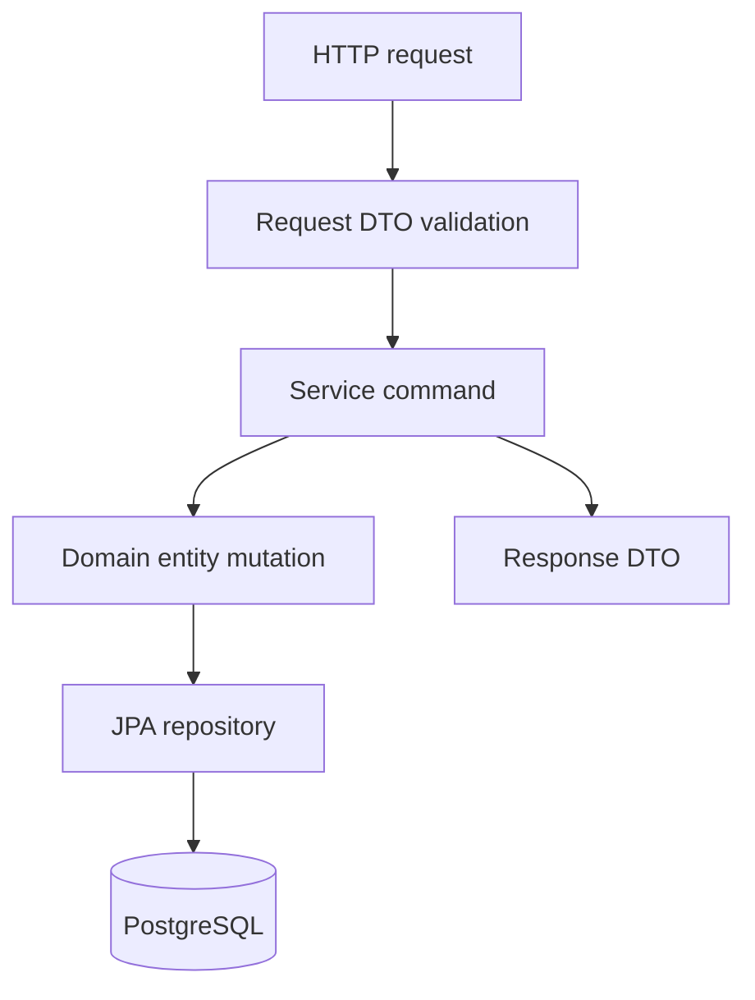

# Build Todo API From Zero

Start with the complete, tested application under `examples/todo-api` in this repository:

```bash
mvn -f examples/todo-api/pom.xml verify
mvn -f examples/todo-api/pom.xml spring-boot:run
```

Follow its README for requests and expected responses. It uses Java 21, Spring Boot 3.5.10, Flyway, and local H2. This older walkthrough below uses a different schema and title limit; study it as a separate design exercise, not as additional files to paste into the starter. See [verification scope](/getting-started/versions-and-evidence).

<Info>
For standalone project specifications, schema contracts, and challenge requirements, see [Project: Todo API](/projects/todo-api).
</Info>

It is small enough to finish in an afternoon, yet serious enough to teach the complete backend request-to-database flow.

## What You Will Build

- Create, list, retrieve, update, complete, and delete todos
- Validate request payloads at the API boundary
- Return consistent, production-safe HTTP error formats
- Paginate collection responses
- Write automated MockMvc tests

---

<Steps>
  <Step title="Step 1: Project Setup & Dependencies">
    Initialize a Spring Boot 3.x project using Java 21 with Maven or Gradle:

    <Tabs>
      <Tab title="Maven (pom.xml)">
        ```xml
        <dependencies>
            <dependency>
                <groupId>org.springframework.boot</groupId>
                <artifactId>spring-boot-starter-web</artifactId>
            </dependency>
            <dependency>
                <groupId>org.springframework.boot</groupId>
                <artifactId>spring-boot-starter-data-jpa</artifactId>
            </dependency>
            <dependency>
                <groupId>org.springframework.boot</groupId>
                <artifactId>spring-boot-starter-validation</artifactId>
            </dependency>
            <dependency>
                <groupId>com.h2database</groupId>
                <artifactId>h2</artifactId>
                <scope>runtime</scope>
            </dependency>
            <dependency>
                <groupId>org.postgresql</groupId>
                <artifactId>postgresql</artifactId>
                <scope>runtime</scope>
            </dependency>
            <dependency>
                <groupId>org.springframework.boot</groupId>
                <artifactId>spring-boot-starter-test</artifactId>
                <scope>test</scope>
            </dependency>
        </dependencies>
        ```
      </Tab>
      <Tab title="Gradle (build.gradle)">
        ```groovy
        dependencies {
            implementation 'org.springframework.boot:spring-boot-starter-web'
            implementation 'org.springframework.boot:spring-boot-starter-data-jpa'
            implementation 'org.springframework.boot:spring-boot-starter-validation'
            runtimeOnly 'com.h2database:h2'
            runtimeOnly 'org.postgresql:postgresql'
            testImplementation 'org.springframework.boot:spring-boot-starter-test'
        }
        ```
      </Tab>
    </Tabs>

    ### Package Structure

    ```bash
    com.example.todo
      TodoApplication.java
      todo/
        Todo.java
        TodoRepository.java
        TodoService.java
        TodoController.java
        CreateTodoRequest.java
        UpdateTodoRequest.java
        TodoResponse.java
      common/
        ErrorResponse.java
        GlobalExceptionHandler.java
        TodoNotFoundException.java
    ```
  </Step>

  <Step title="Step 2: Database Table & JPA Entity">
    Create the SQL table schema:

    ```sql
    CREATE TABLE todos (
      id BIGSERIAL PRIMARY KEY,
      title VARCHAR(200) NOT NULL,
      completed BOOLEAN NOT NULL DEFAULT FALSE,
      created_at TIMESTAMP NOT NULL DEFAULT CURRENT_TIMESTAMP,
      updated_at TIMESTAMP NOT NULL DEFAULT CURRENT_TIMESTAMP
    );
    ```

    Map it to a JPA Entity in `todo/Todo.java`:

    ```java
    package com.example.todo.todo;

    import jakarta.persistence.*;
    import java.time.Instant;

    @Entity
    @Table(name = "todos")
    public class Todo {
        @Id
        @GeneratedValue(strategy = GenerationType.IDENTITY)
        private Long id;

        @Column(nullable = false, length = 200)
        private String title;

        @Column(nullable = false)
        private boolean completed;

        @Column(name = "created_at", nullable = false)
        private Instant createdAt = Instant.now();

        @Column(name = "updated_at", nullable = false)
        private Instant updatedAt = Instant.now();

        protected Todo() {
            // Required by JPA specification
        }

        public Todo(String title) {
            this.title = title;
            this.completed = false;
        }

        public void updateTitle(String title) {
            this.title = title;
            this.updatedAt = Instant.now();
        }

        public void markCompleted() {
            this.completed = true;
            this.updatedAt = Instant.now();
        }

        public Long getId() { return id; }
        public String getTitle() { return title; }
        public boolean isCompleted() { return completed; }
        public Instant getCreatedAt() { return createdAt; }
        public Instant getUpdatedAt() { return updatedAt; }
    }
    ```
  </Step>

  <Step title="Step 3: Spring Data Repository">
    Create `todo/TodoRepository.java`:

    ```java
    package com.example.todo.todo;

    import org.springframework.data.jpa.repository.JpaRepository;

    public interface TodoRepository extends JpaRepository<Todo, Long> {
        // Built-in methods: save(), findById(), findAll(Pageable), deleteById(), existsById()
    }
    ```
  </Step>

  <Step title="Step 4: Request & Response DTOs with Validation">
    Define immutable records with Jakarta validation annotations:

    <CodeGroup>
      ```java CreateTodoRequest.java
      package com.example.todo.todo;

      import jakarta.validation.constraints.NotBlank;
      import jakarta.validation.constraints.Size;

      public record CreateTodoRequest(
          @NotBlank(message = "Title is required")
          @Size(max = 200, message = "Title cannot be longer than 200 characters")
          String title
      ) {}
      ```

      ```json Request Body JSON
      {
        "title": "Learn Spring Boot 3"
      }
      ```
    </CodeGroup>

    ```java UpdateTodoRequest.java
    package com.example.todo.todo;

    import jakarta.validation.constraints.NotBlank;
    import jakarta.validation.constraints.Size;

    public record UpdateTodoRequest(
        @NotBlank(message = "Title is required")
        @Size(max = 200, message = "Title cannot be longer than 200 characters")
        String title
    ) {}
    ```

    ```java TodoResponse.java
    package com.example.todo.todo;

    import java.time.Instant;

    public record TodoResponse(
        Long id,
        String title,
        boolean completed,
        Instant createdAt,
        Instant updatedAt
    ) {
        public static TodoResponse from(Todo todo) {
            return new TodoResponse(
                todo.getId(),
                todo.getTitle(),
                todo.isCompleted(),
                todo.getCreatedAt(),
                todo.getUpdatedAt()
            );
        }
    }
    ```
  </Step>

  <Step title="Step 5: Business Service Layer">
    Create `todo/TodoService.java`:

    ```java
    package com.example.todo.todo;

    import com.example.todo.common.TodoNotFoundException;
    import org.springframework.data.domain.Page;
    import org.springframework.data.domain.Pageable;
    import org.springframework.stereotype.Service;
    import org.springframework.transaction.annotation.Transactional;

    @Service
    public class TodoService {
        private final TodoRepository todoRepository;

        public TodoService(TodoRepository todoRepository) {
            this.todoRepository = todoRepository;
        }

        @Transactional
        public TodoResponse create(CreateTodoRequest request) {
            Todo todo = new Todo(request.title());
            return TodoResponse.from(todoRepository.save(todo));
        }

        @Transactional(readOnly = true)
        public Page<TodoResponse> findAll(Pageable pageable) {
            return todoRepository.findAll(pageable)
                .map(TodoResponse::from);
        }

        @Transactional(readOnly = true)
        public TodoResponse findOne(Long id) {
            Todo todo = todoRepository.findById(id)
                .orElseThrow(TodoNotFoundException::new);
            return TodoResponse.from(todo);
        }

        @Transactional
        public TodoResponse update(Long id, UpdateTodoRequest request) {
            Todo todo = todoRepository.findById(id)
                .orElseThrow(TodoNotFoundException::new);
            todo.updateTitle(request.title());
            return TodoResponse.from(todo);
        }

        @Transactional
        public TodoResponse complete(Long id) {
            Todo todo = todoRepository.findById(id)
                .orElseThrow(TodoNotFoundException::new);
            todo.markCompleted();
            return TodoResponse.from(todo);
        }

        @Transactional
        public void delete(Long id) {
            if (!todoRepository.existsById(id)) {
                throw new TodoNotFoundException();
            }
            todoRepository.deleteById(id);
        }
    }
    ```
  </Step>

  <Step title="Step 6: REST Controller & Error Handling">
    Create `todo/TodoController.java`:

    ```java
    package com.example.todo.todo;

    import jakarta.validation.Valid;
    import org.springframework.data.domain.Page;
    import org.springframework.data.domain.Pageable;
    import org.springframework.http.HttpStatus;
    import org.springframework.web.bind.annotation.*;

    @RestController
    @RequestMapping("/api/todos")
    public class TodoController {
        private final TodoService todoService;

        public TodoController(TodoService todoService) {
            this.todoService = todoService;
        }

        @PostMapping
        @ResponseStatus(HttpStatus.CREATED)
        public TodoResponse create(@Valid @RequestBody CreateTodoRequest request) {
            return todoService.create(request);
        }

        @GetMapping
        public Page<TodoResponse> findAll(Pageable pageable) {
            return todoService.findAll(pageable);
        }

        @GetMapping("/{id}")
        public TodoResponse findOne(@PathVariable Long id) {
            return todoService.findOne(id);
        }

        @PutMapping("/{id}")
        public TodoResponse update(@PathVariable Long id, @Valid @RequestBody UpdateTodoRequest request) {
            return todoService.update(id, request);
        }

        @PatchMapping("/{id}/complete")
        public TodoResponse complete(@PathVariable Long id) {
            return todoService.complete(id);
        }

        @DeleteMapping("/{id}")
        @ResponseStatus(HttpStatus.NO_CONTENT)
        public void delete(@PathVariable Long id) {
            todoService.delete(id);
        }
    }
    ```

    ### Global Exception Handler & Errors

    ```java com/example/todo/common/TodoNotFoundException.java
    package com.example.todo.common;

    public class TodoNotFoundException extends RuntimeException {
        public TodoNotFoundException() {
            super("Todo not found");
        }
    }
    ```

    ```java com/example/todo/common/GlobalExceptionHandler.java
    package com.example.todo.common;

    import org.springframework.http.HttpStatus;
    import org.springframework.validation.FieldError;
    import org.springframework.web.bind.MethodArgumentNotValidException;
    import org.springframework.web.bind.annotation.*;

    import java.util.HashMap;
    import java.util.Map;

    @RestControllerAdvice
    public class GlobalExceptionHandler {

        @ExceptionHandler(TodoNotFoundException.class)
        @ResponseStatus(HttpStatus.NOT_FOUND)
        public Map<String, Object> handleTodoNotFound(TodoNotFoundException ex) {
            return Map.of("message", ex.getMessage());
        }

        @ExceptionHandler(MethodArgumentNotValidException.class)
        @ResponseStatus(HttpStatus.BAD_REQUEST)
        public Map<String, Object> handleValidation(MethodArgumentNotValidException ex) {
            Map<String, String> errors = new HashMap<>();
            for (FieldError error : ex.getBindingResult().getFieldErrors()) {
                errors.put(error.getField(), error.getDefaultMessage());
            }
            return Map.of(
                "message", "Validation failed",
                "errors", errors
            );
        }
    }
    ```
  </Step>

  <Step title="Step 7: Automated Integration Tests">
    Write integration tests with `MockMvc` in `src/test/java/com/example/todo/TodoApiTest.java`:

    ```java
    package com.example.todo;

    import org.junit.jupiter.api.Test;
    import org.springframework.beans.factory.annotation.Autowired;
    import org.springframework.boot.test.autoconfigure.web.servlet.AutoConfigureMockMvc;
    import org.springframework.boot.test.context.SpringBootTest;
    import org.springframework.http.MediaType;
    import org.springframework.test.web.servlet.MockMvc;

    import static org.springframework.test.web.servlet.request.MockMvcRequestBuilders.*;
    import static org.springframework.test.web.servlet.result.MockMvcResultMatchers.*;

    @SpringBootTest
    @AutoConfigureMockMvc
    class TodoApiTest {

        @Autowired
        MockMvc mockMvc;

        @Test
        void shouldCreateTodo() throws Exception {
            mockMvc.perform(post("/api/todos")
                    .contentType(MediaType.APPLICATION_JSON)
                    .content("""
                        {
                          "title": "Build Spring Boot API"
                        }
                        """))
                .andExpect(status().isCreated())
                .andExpect(jsonPath("$.id").exists())
                .andExpect(jsonPath("$.title").value("Build Spring Boot API"))
                .andExpect(jsonPath("$.completed").value(false));
        }

        @Test
        void shouldRejectBlankTitle() throws Exception {
            mockMvc.perform(post("/api/todos")
                    .contentType(MediaType.APPLICATION_JSON)
                    .content("""
                        {
                          "title": ""
                        }
                        """))
                .andExpect(status().isBadRequest())
                .andExpect(jsonPath("$.message").value("Validation failed"))
                .andExpect(jsonPath("$.errors.title").exists());
        }

        @Test
        void shouldReturn404WhenTodoMissing() throws Exception {
            mockMvc.perform(get("/api/todos/999999"))
                .andExpect(status().isNotFound())
                .andExpect(jsonPath("$.message").value("Todo not found"));
        }
    }
    ```
  </Step>
</Steps>

---

## Testing with cURL

<Tabs>
  <Tab title="Create">
    ```bash
    curl -i -X POST http://localhost:8080/api/todos \
      -H "Content-Type: application/json" \
      -d '{"title":"Learn Spring Boot"}'
    ```
  </Tab>
  <Tab title="List (Paginated)">
    ```bash
    curl -i "http://localhost:8080/api/todos?page=0&size=10"
    ```
  </Tab>
  <Tab title="Complete">
    ```bash
    curl -i -X PATCH http://localhost:8080/api/todos/1/complete
    ```
  </Tab>
  <Tab title="Delete">
    ```bash
    curl -i -X DELETE http://localhost:8080/api/todos/1
    ```
  </Tab>
</Tabs>

## Project Proof Drill

Use this drill after the full build compiles. The point is to prove the learner understands the backend layers, not just that the happy path responds once.



| Skill | Proof question | Passing evidence |
| --- | --- | --- |
| REST basics | Does create return `201 Created` with a resource representation or location? | cURL response and integration test |
| Validation | Are invalid requests blocked before persistence? | `400` response with field errors |
| JPA basics | Are entity changes saved through transaction boundaries? | SQL/log observation or repository assertion |
| Error handling | Are missing todos mapped consistently? | ProblemDetail JSON |
| Testing | Does a real database test pass without H2 shortcuts? | Testcontainers run |

Break-fix checklist:

| Break | Fix |
| --- | --- |
| Remove `@Valid` | Validation test fails |
| Return JPA entity from controller | Replace with DTO |
| Call repository from controller | Move business operation into service |
| Use in-memory list | Replace with persistent repository and migration |

## Common Real-World Mistakes

- **Missing `@Valid`**: Controller method accepts invalid payload because `@Valid` was forgotten before `@RequestBody`.
- **Wrong `@Transactional` import**: Importing `jakarta.transaction.Transactional` instead of `org.springframework.transaction.annotation.Transactional`, disabling `readOnly = true`.
- **Exposing JPA Entities**: Returning `Todo` entity instead of `TodoResponse`, leaking internal database schema and risking lazy-loading serialization bugs.
- **Unbounded Queries**: Using `findAll()` without `Pageable`, crashing under large production datasets.

## Done Checklist

<Check>All CRUD endpoints work as verified by MockMvc tests</Check>
<Check>Validation errors return `400 Bad Request` with exact field error messages</Check>
<Check>Missing records return `404 Not Found` without stack traces</Check>
<Check>Delete endpoint returns `204 No Content`</Check>
<Check>Services use constructor injection and `@Transactional` boundaries</Check>
