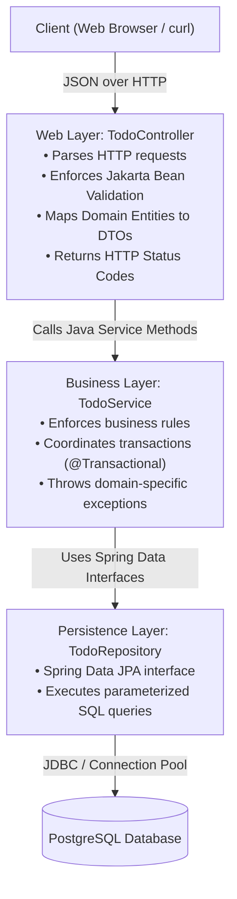
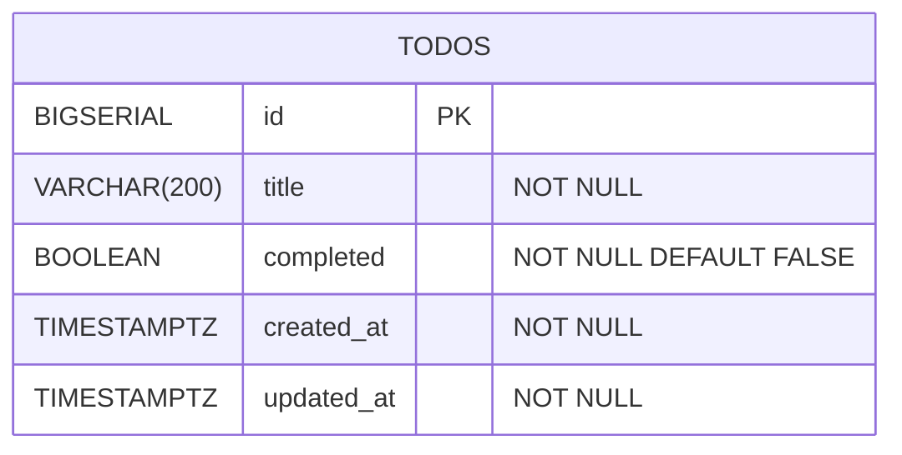
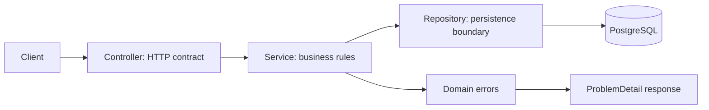

# Project Specification: Todo REST API

The **Todo REST API** is the foundational milestone in backend engineering. While superficially straightforward, a production-grade Todo API tests your mastery of the core backend principles: **strict layered separation of concerns, entity-DTO boundary isolation, Jakarta Bean Validation, standardized HTTP response semantics, and global error handling**.

<Tip>
Looking for the step-by-step code implementation with complete Java 21 classes, Flyway migrations, and tests? Follow [Build Todo API From Zero](/projects/todo-api-full-build).
</Tip>

---

## 1. Architectural Mental Model & Layered Boundaries

The application follows the classic **3-Tier Layered Architecture**. Each layer has a strict single responsibility and communicates only with its immediate neighbor:



### The 4 Non-Negotiable Boundary Rules
1. **No JPA Entities in Controllers**: HTTP endpoints accept Request DTOs and return Response DTOs (Java 21 Records). Domain entities never leave the Service boundary.
2. **No Business Logic in Controllers**: Controllers must not contain `if/else` checks for domain rules. Their sole job is HTTP routing, validation triggers, and header formation.
3. **No Database Access in Controllers**: Controllers never call Repositories directly.
4. **No Stack Traces to Clients**: Unhandled exceptions are intercepted by a `@RestControllerAdvice` and returned as RFC 9457 `ProblemDetail` structures.

---

## 2. Database Schema & Entity Relationship



### PostgreSQL DDL (`V1__init_todos.sql`)

```sql
CREATE TABLE todos (
    id BIGSERIAL PRIMARY KEY,
    title VARCHAR(200) NOT NULL,
    completed BOOLEAN NOT NULL DEFAULT FALSE,
    created_at TIMESTAMP WITH TIME ZONE NOT NULL DEFAULT CURRENT_TIMESTAMP,
    updated_at TIMESTAMP WITH TIME ZONE NOT NULL DEFAULT CURRENT_TIMESTAMP
);

CREATE INDEX idx_todos_completed ON todos(completed);
CREATE INDEX idx_todos_created ON todos(created_at DESC);
```

---

## 3. Comprehensive RESTful API Contract

| HTTP Method | Endpoint Route | Request Body | Success Status | Description |
| :--- | :--- | :--- | :--- | :--- |
| `POST` | `/api/v1/todos` | `CreateTodoRequest` | `201 Created` | Creates a new todo item; returns `Location` header. |
| `GET` | `/api/v1/todos` | *None* | `200 OK` | Retrieves all todos sorted by `created_at DESC`. |
| `GET` | `/api/v1/todos/{id}`| *None* | `200 OK` | Retrieves a single todo by primary key ID. |
| `PUT` | `/api/v1/todos/{id}`| `UpdateTodoRequest` | `200 OK` | Full replacement of title and completed status. |
| `PATCH`| `/api/v1/todos/{id}/complete` | *None* | `200 OK` | Idempotent transition to `completed = true`. |
| `DELETE`| `/api/v1/todos/{id}`| *None* | `204 No Content`| Permanently removes the todo record. |

---

## 4. Request & Response Payloads

### 4.1 Create Todo (`POST /api/v1/todos`)

#### Request Body
```json
{
  "title": "Master Spring Boot 3 & PostgreSQL"
}
```

#### Validation Invariants
- `title` is required (`@NotNull`).
- `title` cannot be empty or solely whitespace (`@NotBlank`).
- `title` length must be between 3 and 200 characters (`@Size(min = 3, max = 200)`).

#### Successful Response (`201 Created`)
Headers: `Location: https://api.example.com/api/v1/todos/42`
```json
{
  "id": 42,
  "title": "Master Spring Boot 3 & PostgreSQL",
  "completed": false,
  "createdAt": "2026-09-10T14:30:00Z",
  "updatedAt": "2026-09-10T14:30:00Z"
}
```

---

### 4.2 Standard Error Responses (RFC 9457 `ProblemDetail`)

#### Validation Failure (`400 Bad Request`)
Triggered when request payload violates bean validation rules:
```json
{
  "type": "https://api.example.com/errors/validation-failed",
  "title": "Validation Failed",
  "status": 400,
  "detail": "Invalid request payload. Check 'errors' field for details.",
  "errors": {
    "title": "must not be blank"
  },
  "timestamp": "2026-09-10T14:31:05Z"
}
```

#### Resource Not Found (`404 Not Found`)
Triggered when querying, updating, or deleting an ID that does not exist in the database:
```json
{
  "type": "https://api.example.com/errors/resource-not-found",
  "title": "Resource Not Found",
  "status": 404,
  "detail": "Todo with id 999 was not found.",
  "timestamp": "2026-09-10T14:31:20Z"
}
```

---

## 5. Verification Runbook (Complete `curl` Suite)

Test all endpoints directly from your command line:

```bash
# 1. Create a new todo item (201 Created)
curl -i -X POST http://localhost:8080/api/v1/todos \
  -H "Content-Type: application/json" \
  -d '{"title":"Implement Spring Security JWT"}'

# 2. Query all todos (200 OK)
curl -i -X GET http://localhost:8080/api/v1/todos

# 3. Query specific todo by ID (200 OK)
curl -i -X GET http://localhost:8080/api/v1/todos/1

# 4. Mark todo as completed (200 OK)
curl -i -X PATCH http://localhost:8080/api/v1/todos/1/complete

# 5. Full update of todo title (200 OK)
curl -i -X PUT http://localhost:8080/api/v1/todos/1 \
  -H "Content-Type: application/json" \
  -d '{"title":"Deploy to Kubernetes cluster","completed":true}'

# 6. Delete todo (204 No Content)
curl -i -X DELETE http://localhost:8080/api/v1/todos/1

# 7. Verify deletion returned 404 Not Found
curl -i -X GET http://localhost:8080/api/v1/todos/1
```

---

## 6. Acceptance Test Matrix

Every production implementation must satisfy the following automated test cases:

| Test Case | Scenario | Expected Status | Assertion |
| :--- | :--- | :--- | :--- |
| `TC-01` | Valid title provided | `201 Created` | ID is populated; `Location` header matches ID; `completed` is `false`. |
| `TC-02` | Title is whitespace only (`"   "`) | `400 Bad Request` | Body contains RFC 9457 error map mentioning `title`. |
| `TC-03` | Title exceeds 200 characters | `400 Bad Request` | Error details explain max length exceeded. |
| `TC-04` | Query existing ID | `200 OK` | JSON matches database state. |
| `TC-05` | Query non-existent ID | `404 Not Found` | Clean error JSON; no stack trace leaked. |
| `TC-06` | Mark already completed todo | `200 OK` | Idempotent operation; completed remains `true`. |
| `TC-07` | Delete existing ID | `204 No Content` | Response body is completely empty. |
| `TC-08` | Delete non-existent ID | `404 Not Found` | Error response returned. |

---

## Project Proof Drill

This project is not complete when the endpoints "work once." It is complete when you can prove the basic backend boundaries are correct under validation errors, missing rows, duplicate requests, and database persistence.



| Proof target | What to demonstrate | Evidence |
| --- | --- | --- |
| HTTP contract | Each route returns the correct status code. | `201`, `200`, `204`, `400`, `404` examples |
| Validation | Invalid title/body never reaches business logic. | Bean Validation test |
| Persistence | Created todos survive application restart. | Testcontainers or local Postgres verification |
| Error shape | Errors are predictable for clients. | RFC ProblemDetail JSON |
| Layering | Controller does not contain SQL or business rules. | Package scan or code review |

Break it deliberately:

| Break | Expected failure | Correct fix |
| --- | --- | --- |
| Send empty title | `400 Bad Request` | DTO validation with useful message |
| Read unknown ID | `404 Not Found` | Domain exception mapped centrally |
| Delete same ID twice | First `204`, second `404` or idempotent `204` by design | Choose and document behavior |
| Return entity directly | Persistence fields leak | Response DTO |

## 7. Active Recall Mastery Questions

<AccordionGroup>
  <Accordion title="1. Why should you never return JPA entity instances directly from a @RestController?">
    Returning JPA entities directly causes three major production hazards:
    1. **Security & Information Leaks**: You risk exposing internal database columns, password hashes, or soft-delete flags to external clients.
    2. **LazyInitializationException**: If Jackson serializes lazy associations outside an active transaction context, Hibernate throws `LazyInitializationException`.
    3. **Infinite Recursion / StackOverflowError**: Bidirectional relationships (e.g. `@OneToMany` and `@ManyToOne`) cause Jackson to serialize back-and-forth indefinitely until the JVM crashes.
    
    Using immutable DTOs (Java 21 Records) insulates your external API contract from internal database schema changes.
  </Accordion>

  <Accordion title="2. What is the semantic difference between PUT and PATCH in REST?">
    - **PUT (Complete Replacement)**: The client provides the entire replacement state of the resource. Any omitted fields are cleared or reset to defaults.
    - **PATCH (Partial Mutation)**: The client provides only the specific fields to mutate, or triggers a specific state transition (e.g. `PATCH /todos/1/complete`), leaving all other fields untouched.
  </Accordion>

  <Accordion title="3. Why does HTTP 204 No Content forbid a response body?">
    By RFC specification, the `204 No Content` status explicitly tells the client that the server successfully fulfilled the request and that there is no additional content to send. Sending a response body with a 204 status violates HTTP standards, causing HTTP clients and proxy caches to misbehave.
  </Accordion>
</AccordionGroup>

---

## 8. Done Checklist

<Check>
All endpoints adhere strictly to the RESTful contract and return proper status codes (`201`, `200`, `204`, `400`, `404`).
</Check>
<Check>
Domain entities never leave the service layer; controllers strictly accept and return Java 21 Record DTOs.
</Check>
<Check>
Jakarta Bean Validation enforces title presence, blankness checks, and length boundaries.
</Check>
<Check>
Global `@RestControllerAdvice` formats all validation and not-found exceptions as RFC 9457 `ProblemDetail`.
</Check>
<Check>
All test cases in the Acceptance Test Matrix pass in automated MockMvc and Testcontainers test suites.
</Check>
