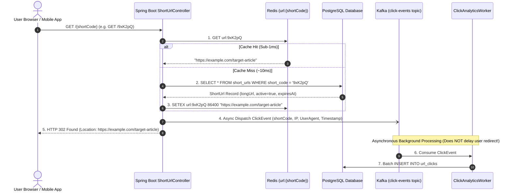
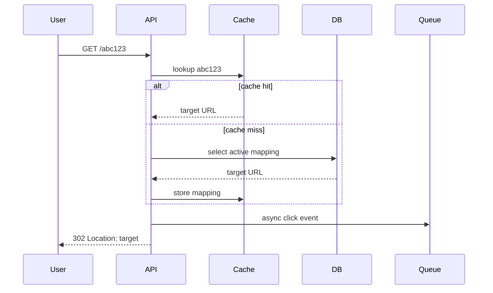

# Build Distributed URL Shortener: Complete Production Code

A URL shortener converts long, unwieldy URLs into compact, shareable 7-character aliases (e.g., `https://sho.rt/9xK2pQ`). 

While conceptually simple, building a production-grade URL shortener requires solving core distributed systems problems: **mathematical Base62 collision-free encoding, ultra-low-latency redirects under 5ms, Cache-Aside invalidation, asynchronous click analytics, and malicious URL abuse controls**.

<Info>
Review mathematical capacity estimations, ZooKeeper token range leases, Bloom filters, and table partitioning first in [Design URL Shortener](/system-design/url-shortener).
</Info>

---

## 1. System Architecture & Redirect Flow



### Why HTTP 302 Found Instead of 301 Moved Permanently?
- **301 Moved Permanently**: The client browser permanently caches the redirect URL on disk. Subsequent user clicks never contact our backend server again, making it **impossible to collect click analytics** or disable malicious links!
- **302 Found (or 307 Temporary Redirect)**: Tells the client that the redirection is temporary. The browser must query our service on every single click, enabling real-time analytics and immediate link revocation.

---

## 2. PostgreSQL Flyway Schema

### `V1__init_url_shortener.sql`

```sql
-- Sequence for collision-free Base62 ID generation
CREATE SEQUENCE seq_short_urls START WITH 10000000 INCREMENT BY 1;

-- Table storing shortened URLs
CREATE TABLE short_urls (
    id BIGINT PRIMARY KEY DEFAULT nextval('seq_short_urls'),
    short_code VARCHAR(20) NOT NULL UNIQUE,
    long_url TEXT NOT NULL,
    user_id BIGINT,
    is_active BOOLEAN NOT NULL DEFAULT TRUE,
    expires_at TIMESTAMP WITH TIME ZONE,
    created_at TIMESTAMP WITH TIME ZONE NOT NULL DEFAULT CURRENT_TIMESTAMP
);

CREATE INDEX idx_short_urls_code ON short_urls(short_code);
CREATE INDEX idx_short_urls_user ON short_urls(user_id);

-- Analytical click event store
CREATE TABLE url_clicks (
    id BIGSERIAL PRIMARY KEY,
    short_code VARCHAR(20) NOT NULL,
    clicked_at TIMESTAMP WITH TIME ZONE NOT NULL DEFAULT CURRENT_TIMESTAMP,
    ip_address VARCHAR(45),
    user_agent TEXT,
    referer TEXT
);

CREATE INDEX idx_clicks_code_date ON url_clicks(short_code, clicked_at DESC);
```

---

## 3. Base62 Mathematical Encoding Engine

Base62 uses alphanumeric characters `[0-9a-zA-Z]`. A 7-character Base62 string provides:

$$62^7 = 3,521,614,606,208 \approx 3.52 \text{ Trillion Unique Combinations}$$

### `Base62Encoder.java`

```java
package com.example.urlshortener.util;

public final class Base62Encoder {

    private static final String ALPHABET = "0123456789abcdefghijklmnopqrstuvwxyzABCDEFGHIJKLMNOPQRSTUVWXYZ";
    private static final int BASE = ALPHABET.length(); // 62

    private Base62Encoder() {}

    public static String encode(long id) {
        if (id < 0) {
            throw new IllegalArgumentException("ID must be positive: " + id);
        }
        if (id == 0) {
            return "0";
        }

        StringBuilder sb = new StringBuilder();
        while (id > 0) {
            int remainder = (int) (id % BASE);
            sb.append(ALPHABET.charAt(remainder));
            id /= BASE;
        }

        return sb.reverse().toString();
    }

    public static long decode(String shortCode) {
        if (shortCode == null || shortCode.isBlank()) {
            throw new IllegalArgumentException("Short code cannot be null or empty");
        }

        long id = 0;
        for (int i = 0; i < shortCode.length(); i++) {
            char c = shortCode.charAt(i);
            int index = ALPHABET.indexOf(c);
            if (index == -1) {
                throw new IllegalArgumentException("Invalid Base62 character: " + c);
            }
            id = id * BASE + index;
        }

        return id;
    }
}
```

---

## 4. Domain Entities & Repositories

### `ShortUrl.java`

```java
package com.example.urlshortener.domain;

import jakarta.persistence.*;
import java.time.Instant;

@Entity
@Table(name = "short_urls")
public class ShortUrl {

    @Id
    @GeneratedValue(strategy = GenerationType.SEQUENCE, generator = "seq_short_urls")
    @SequenceGenerator(name = "seq_short_urls", sequenceName = "seq_short_urls", allocationSize = 1)
    private Long id;

    @Column(name = "short_code", nullable = false, unique = true, length = 20)
    private String shortCode;

    @Column(name = "long_url", nullable = false, columnDefinition = "TEXT")
    private String longUrl;

    @Column(name = "user_id")
    private Long userId;

    @Column(name = "is_active", nullable = false)
    private boolean active;

    @Column(name = "expires_at")
    private Instant expiresAt;

    @Column(name = "created_at", nullable = false)
    private Instant createdAt;

    protected ShortUrl() {}

    public ShortUrl(String shortCode, String longUrl, Long userId, Instant expiresAt) {
        this.shortCode = shortCode;
        this.longUrl = longUrl;
        this.userId = userId;
        this.active = true;
        this.expiresAt = expiresAt;
        this.createdAt = Instant.now();
    }

    public boolean isExpired() {
        return expiresAt != null && expiresAt.isBefore(Instant.now());
    }

    public void deactivate() {
        this.active = false;
    }

    // Getters
    public Long getId() { return id; }
    public String getShortCode() { return shortCode; }
    public String getLongUrl() { return longUrl; }
    public boolean isActive() { return active; }
    public Instant getExpiresAt() { return expiresAt; }
}
```

### `ShortUrlRepository.java`

```java
package com.example.urlshortener.repository;

import com.example.urlshortener.domain.ShortUrl;
import org.springframework.data.jpa.repository.JpaRepository;
import org.springframework.stereotype.Repository;

import java.util.Optional;

@Repository
public interface ShortUrlRepository extends JpaRepository<ShortUrl, Long> {
    Optional<ShortUrl> findByShortCode(String shortCode);
    boolean existsByShortCode(String shortCode);
}
```

---

## 5. URL Shortening & Redirect Services

### `UrlCreationService.java`

```java
package com.example.urlshortener.service;

import com.example.urlshortener.domain.ShortUrl;
import com.example.urlshortener.repository.ShortUrlRepository;
import com.example.urlshortener.util.Base62Encoder;
import org.springframework.dao.DataIntegrityViolationException;
import org.springframework.jdbc.core.simple.JdbcClient;
import org.springframework.stereotype.Service;
import org.springframework.transaction.annotation.Transactional;

import java.time.Instant;
import java.util.Set;

@Service
public class UrlCreationService {

    private static final Set<String> RESERVED_WORDS = Set.of(
        "api", "admin", "login", "auth", "health", "metrics", "swagger", "docs"
    );

    private final ShortUrlRepository shortUrlRepository;
    private final JdbcClient jdbcClient;

    public UrlCreationService(ShortUrlRepository shortUrlRepository, JdbcClient jdbcClient) {
        this.shortUrlRepository = shortUrlRepository;
        this.jdbcClient = jdbcClient;
    }

    @Transactional
    public ShortUrl createShortUrl(String longUrl, String customAlias, Long userId, Instant expiresAt) {
        // Option A: Custom User Alias
        if (customAlias != null && !customAlias.isBlank()) {
            String sanitizedAlias = customAlias.trim().toLowerCase();
            
            if (RESERVED_WORDS.contains(sanitizedAlias)) {
                throw new IllegalArgumentException("Custom alias '" + sanitizedAlias + "' is reserved.");
            }
            if (shortUrlRepository.existsByShortCode(sanitizedAlias)) {
                throw new CustomAliasAlreadyExistsException("Alias '" + sanitizedAlias + "' is already taken.");
            }

            ShortUrl customUrl = new ShortUrl(sanitizedAlias, longUrl, userId, expiresAt);
            return shortUrlRepository.save(customUrl);
        }

        // Option B: High-Throughput Base62 Collision-Free Generation
        // Fetch unique ID from database sequence
        Long nextId = jdbcClient.sql("SELECT nextval('seq_short_urls')")
                .query(Long.class)
                .single();

        String generatedCode = Base62Encoder.encode(nextId);
        ShortUrl shortUrl = new ShortUrl(generatedCode, longUrl, userId, expiresAt);
        return shortUrlRepository.save(shortUrl);
    }
}
```

### `UrlRedirectService.java` (Cache-Aside + Async Analytics)

```java
package com.example.urlshortener.service;

import com.example.urlshortener.domain.ShortUrl;
import com.example.urlshortener.repository.ShortUrlRepository;
import org.slf4j.Logger;
import org.slf4j.LoggerFactory;
import org.springframework.data.redis.core.StringRedisTemplate;
import org.springframework.kafka.core.KafkaTemplate;
import org.springframework.stereotype.Service;

import java.time.Duration;
import java.time.Instant;
import java.util.Map;
import java.util.concurrent.ThreadLocalRandom;

@Service
public class UrlRedirectService {

    private static final Logger log = LoggerFactory.getLogger(UrlRedirectService.class);
    private static final String CACHE_PREFIX = "url:";

    private final StringRedisTemplate redisTemplate;
    private final ShortUrlRepository shortUrlRepository;
    private final KafkaTemplate<String, Object> kafkaTemplate;

    public UrlRedirectService(
            StringRedisTemplate redisTemplate,
            ShortUrlRepository shortUrlRepository,
            KafkaTemplate<String, Object> kafkaTemplate) {
        this.redisTemplate = redisTemplate;
        this.shortUrlRepository = shortUrlRepository;
        this.kafkaTemplate = kafkaTemplate;
    }

    public String resolveLongUrl(String shortCode, String clientIp, String userAgent, String referer) {
        String cacheKey = CACHE_PREFIX + shortCode;

        // Step 1: Check Redis Cache (Fast Path: ~1ms)
        String cachedUrl = redisTemplate.opsForValue().get(cacheKey);
        if (cachedUrl != null) {
            if ("__DEACTIVATED__".equals(cachedUrl)) {
                throw new UrlNotFoundException("Short URL is inactive or expired.");
            }
            dispatchClickAnalytics(shortCode, clientIp, userAgent, referer);
            return cachedUrl;
        }

        // Step 2: Query PostgreSQL Database (Slow Path: ~10ms)
        ShortUrl shortUrl = shortUrlRepository.findByShortCode(shortCode)
                .orElseThrow(() -> new UrlNotFoundException("URL not found: " + shortCode));

        if (!shortUrl.isActive() || shortUrl.isExpired()) {
            // Negative cache sentinel to avoid database penetration
            redisTemplate.opsForValue().set(cacheKey, "__DEACTIVATED__", Duration.ofMinutes(10));
            throw new UrlNotFoundException("Short URL is inactive or expired.");
        }

        // Step 3: Populate Redis with TTL Jitter (24 hours + 0-60 minutes jitter)
        long jitterMinutes = ThreadLocalRandom.current().nextLong(0, 60);
        Duration ttl = Duration.ofHours(24).plusMinutes(jitterMinutes);
        redisTemplate.opsForValue().set(cacheKey, shortUrl.getLongUrl(), ttl);

        // Step 4: Asynchronously publish click telemetry
        dispatchClickAnalytics(shortCode, clientIp, userAgent, referer);

        return shortUrl.getLongUrl();
    }

    private void dispatchClickAnalytics(String shortCode, String clientIp, String userAgent, String referer) {
        try {
            Map<String, Object> event = Map.of(
                "shortCode", shortCode,
                "ip", clientIp != null ? clientIp : "unknown",
                "userAgent", userAgent != null ? userAgent : "unknown",
                "referer", referer != null ? referer : "unknown",
                "timestamp", Instant.now().toString()
            );
            kafkaTemplate.send("click-events", shortCode, event);
        } catch (Exception ex) {
            log.warn("Failed to publish click analytics for shortCode {}: {}", shortCode, ex.getMessage());
        }
    }
}
```

---

## 6. HTTP REST Controller & Redirection

### `ShortUrlController.java`

```java
package com.example.urlshortener.controller;

import com.example.urlshortener.domain.ShortUrl;
import com.example.urlshortener.service.UrlCreationService;
import com.example.urlshortener.service.UrlRedirectService;
import jakarta.servlet.http.HttpServletRequest;
import jakarta.validation.Valid;
import jakarta.validation.constraints.NotBlank;
import org.hibernate.validator.constraints.URL;
import org.springframework.http.HttpHeaders;
import org.springframework.http.HttpStatus;
import org.springframework.http.ResponseEntity;
import org.springframework.web.bind.annotation.*;

import java.net.URI;
import java.time.Instant;
import java.util.Map;

@RestController
public class ShortUrlController {

    private final UrlCreationService urlCreationService;
    private final UrlRedirectService urlRedirectService;

    public ShortUrlController(UrlCreationService urlCreationService, UrlRedirectService urlRedirectService) {
        this.urlCreationService = urlCreationService;
        this.urlRedirectService = urlRedirectService;
    }

    public record CreateUrlRequest(
        @NotBlank(message = "Long URL cannot be blank")
        @URL(message = "Must be a valid URL")
        String longUrl,
        String customAlias,
        Instant expiresAt
    ) {}

    @PostMapping("/api/v1/urls")
    public ResponseEntity<Map<String, String>> createShortUrl(
            @Valid @RequestBody CreateUrlRequest request,
            @RequestHeader(value = "X-User-Id", required = false) Long userId) {

        ShortUrl created = urlCreationService.createShortUrl(
            request.longUrl(),
            request.customAlias(),
            userId,
            request.expiresAt()
        );

        String fullShortUrl = "https://sho.rt/" + created.getShortCode();

        return ResponseEntity.created(URI.create(fullShortUrl))
                .body(Map.of(
                    "shortCode", created.getShortCode(),
                    "shortUrl", fullShortUrl,
                    "longUrl", created.getLongUrl()
                ));
    }

    @GetMapping("/{shortCode}")
    public ResponseEntity<Void> redirect(
            @PathVariable String shortCode,
            HttpServletRequest request) {

        String clientIp = request.getHeader("X-Forwarded-For") != null 
                ? request.getHeader("X-Forwarded-For").split(",")[0].trim() 
                : request.getRemoteAddr();

        String userAgent = request.getHeader(HttpHeaders.USER_AGENT);
        String referer = request.getHeader(HttpHeaders.REFERER);

        String destinationLongUrl = urlRedirectService.resolveLongUrl(shortCode, clientIp, userAgent, referer);

        return ResponseEntity.status(HttpStatus.FOUND) // HTTP 302 Found
                .location(URI.create(destinationLongUrl))
                .build();
    }
}
```

---

## 7. End-to-End Integration Testing with Testcontainers

This integration test verifies URL creation, Base62 encoding, custom alias conflict handling (HTTP 409), Cache-Aside hit caching, and HTTP 302 redirects:

```java
package com.example.urlshortener;

import com.redis.testcontainers.RedisContainer;
import org.junit.jupiter.api.DisplayName;
import org.junit.jupiter.api.Test;
import org.springframework.beans.factory.annotation.Autowired;
import org.springframework.boot.test.autoconfigure.web.servlet.AutoConfigureMockMvc;
import org.springframework.boot.test.context.SpringBootTest;
import org.springframework.data.redis.core.StringRedisTemplate;
import org.springframework.http.MediaType;
import org.springframework.test.context.DynamicPropertyRegistry;
import org.springframework.test.context.DynamicPropertySource;
import org.springframework.test.web.servlet.MockMvc;
import org.testcontainers.containers.PostgreSQLContainer;
import org.testcontainers.junit.jupiter.Container;
import org.testcontainers.junit.jupiter.Testcontainers;
import org.testcontainers.kafka.KafkaContainer;

import static org.assertj.core.api.Assertions.assertThat;
import static org.springframework.test.web.servlet.request.MockMvcRequestBuilders.get;
import static org.springframework.test.web.servlet.request.MockMvcRequestBuilders.post;
import static org.springframework.test.web.servlet.result.MockMvcResultMatchers.*;

@SpringBootTest
@AutoConfigureMockMvc
@Testcontainers
class UrlShortenerIntegrationTest {

    @Container
    static PostgreSQLContainer<?> postgres = new PostgreSQLContainer<>("postgres:16-alpine");

    @Container
    static RedisContainer redis = new RedisContainer("redis:7.2-alpine");

    @Container
    static KafkaContainer kafka = new KafkaContainer("apache/kafka-native:3.8.0");

    @DynamicPropertySource
    static void configureProperties(DynamicPropertyRegistry registry) {
        registry.add("spring.datasource.url", postgres::getJdbcUrl);
        registry.add("spring.datasource.username", postgres::getUsername);
        registry.add("spring.datasource.password", postgres::getPassword);
        registry.add("spring.data.redis.host", redis::getHost);
        registry.add("spring.data.redis.port", () -> redis.getFirstMappedPort().toString());
        registry.add("spring.kafka.bootstrap-servers", kafka::getBootstrapServers);
    }

    @Autowired
    private MockMvc mockMvc;

    @Autowired
    private StringRedisTemplate redisTemplate;

    @Test
    @DisplayName("Create URL, redirect successfully via HTTP 302, and verify Redis Cache-Aside population")
    void fullRedirectLifecycle_Success() throws Exception {
        String originalUrl = "https://spring.io/projects/spring-boot";

        // Step 1: Create Short URL
        String responseJson = mockMvc.perform(post("/api/v1/urls")
                .contentType(MediaType.APPLICATION_JSON)
                .content("""
                    {"longUrl": "%s"}
                    """.formatted(originalUrl)))
                .andExpect(status().isCreated())
                .andExpect(header().exists("Location"))
                .andExpect(jsonPath("$.shortCode").isNotEmpty())
                .andReturn()
                .getResponse()
                .getContentAsString();

        String shortCode = responseJson.split("\"shortCode\":\"")[1].split("\"")[0];

        // Step 2: First Redirect (Cache Miss -> DB Query -> Populates Redis)
        mockMvc.perform(get("/" + shortCode))
                .andExpect(status().isFound())
                .andExpect(header().string("Location", originalUrl));

        // Step 3: Verify Cache Contains the Key
        String cachedValue = redisTemplate.opsForValue().get("url:" + shortCode);
        assertThat(cachedValue).isEqualTo(originalUrl);

        // Step 4: Second Redirect (Fast Cache Hit)
        mockMvc.perform(get("/" + shortCode))
                .andExpect(status().isFound())
                .andExpect(header().string("Location", originalUrl));
    }

    @Test
    @DisplayName("Custom alias collision returns HTTP 409 Conflict")
    void customAlias_CollisionReturns409() throws Exception {
        String longUrl = "https://example.com/promo";
        String customAlias = "springpromo";

        // First creation succeeds
        mockMvc.perform(post("/api/v1/urls")
                .contentType(MediaType.APPLICATION_JSON)
                .content("""
                    {"longUrl": "%s", "customAlias": "%s"}
                    """.formatted(longUrl, customAlias)))
                .andExpect(status().isCreated());

        // Duplicate custom alias rejected
        mockMvc.perform(post("/api/v1/urls")
                .contentType(MediaType.APPLICATION_JSON)
                .content("""
                    {"longUrl": "https://other.com", "customAlias": "%s"}
                    """.formatted(customAlias)))
                .andExpect(status().isConflict());
    }
}
```

---

## Project Proof Drill

The URL shortener is complete when create and redirect paths are tested separately. Creation can be a little slower. Redirects must be fast, cacheable, observable, and protected from unsafe destinations.



| Proof target | Required evidence |
| --- | --- |
| Collision safety | Forced duplicate short code retries or fails cleanly. |
| Redirect speed | Hot code uses cache and avoids unnecessary database load. |
| Expiration | Expired code never redirects. |
| Analytics isolation | Click tracking failure does not break redirect. |
| Abuse state | Unsafe links can be disabled without deleting history. |

Failure drill:

| Failure | Expected behavior |
| --- | --- |
| Cache is empty | Database fallback works and warms cache. |
| Analytics queue is down | Redirect still works if analytics is non-critical. |
| Code does not exist | Return `404` without expensive repeated DB hits for hot missing keys. |
| Link is disabled | Return safe error page or `410 Gone`. |

## 8. Active Recall Mastery Questions

<AccordionGroup>
  <Accordion title="1. Why is HTTP 302 Found used instead of HTTP 301 Moved Permanently for URL shorteners?">
    With HTTP 301, the browser permanently caches the redirect mapping on the client device. On subsequent visits, the client never contacts the backend server, completely blinding your analytics pipeline and preventing you from tracking total clicks, referrers, or user devices. 
    
    Additionally, if a link is disabled (e.g. reported for phishing or fraud), a 301 cache makes it impossible to prevent existing visitors from reaching the malicious site. HTTP 302 forces every request through your backend.
  </Accordion>

  <Accordion title="2. How does Base62 encoding guarantee collision-free short codes?">
    Base62 is a **bijective mapping** (1-to-1 conversion) between a 64-bit numerical database identifier and an alphanumeric string (`0-9a-zA-Z`). 
    
    Because the underlying numerical ID is produced by an auto-incrementing database sequence (`nextval('seq_short_urls')`), every generated ID is mathematically guaranteed to be distinct. Distinct numerical inputs always produce unique Base62 strings, eliminating hash collision retries entirely.
  </Accordion>

  <Accordion title="3. Why should click analytics be dispatched asynchronously via Kafka?">
    A URL shortener's primary user-facing SLA is redirect speed (sub-5ms response). 
    
    Writing click records (IP, user agent, geolocation, referrer) synchronously to PostgreSQL adds 15 to 30ms of database I/O latency to every single redirect. Dispatching a lightweight event to Apache Kafka takes under 1 millisecond, allowing dedicated background workers to batch insert analytics data without slowing down user redirection.
  </Accordion>
</AccordionGroup>

---

## 9. Done Checklist

<Check>
Base62 mathematical encoding generates 7-character collision-free short codes from database sequences.
</Check>
<Check>
Redirects return HTTP 302 Found to preserve analytics fidelity and support link revocation.
</Check>
<Check>
Cache-Aside pattern stores hot URLs in Redis with TTL jitter to eliminate database read bottlenecks.
</Check>
<Check>
Click telemetry is dispatched asynchronously to Apache Kafka, isolating redirect latency from analytics writes.
</Check>
<Check>
Custom aliases validate against reserved word blocklists and enforce unique constraints.
</Check>
<Check>
Full Testcontainers integration test suite verifies creation, conflict handling, and Redis caching.
</Check>
