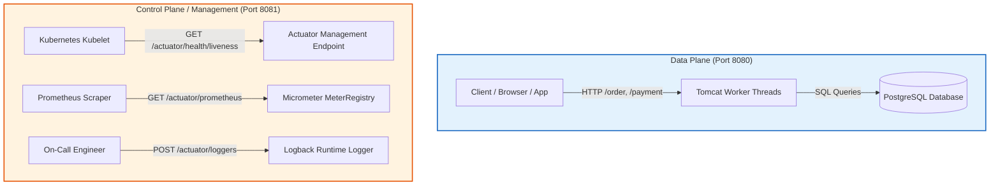
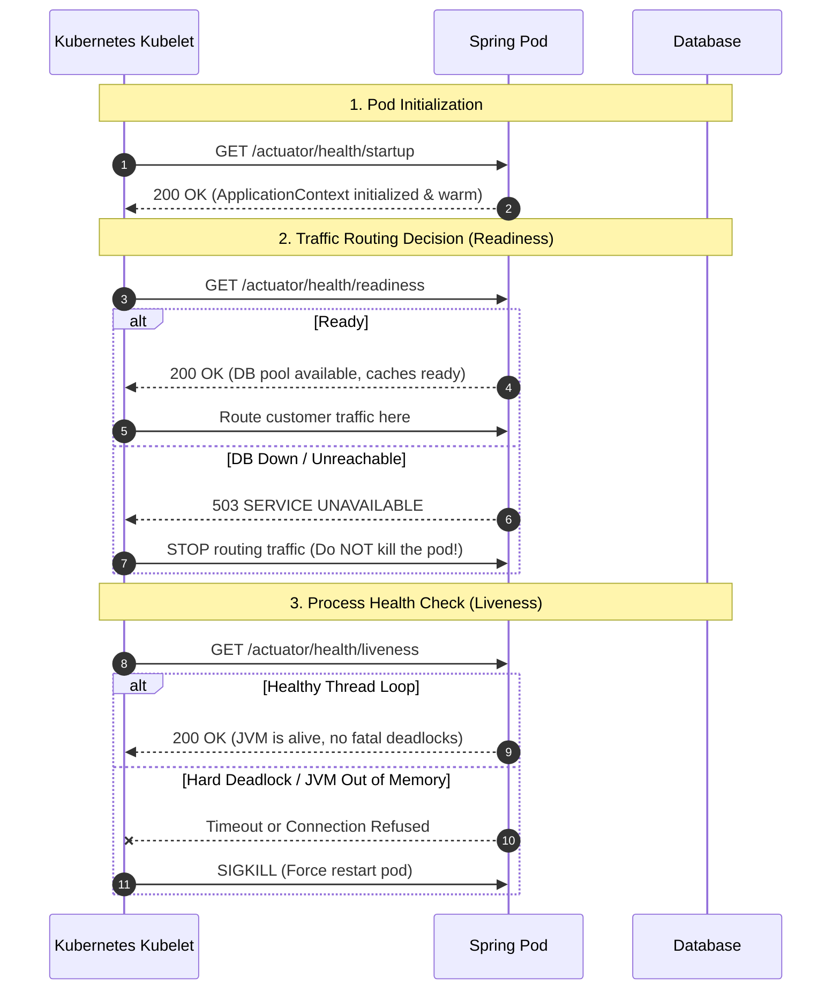
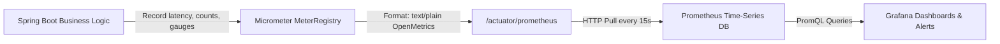
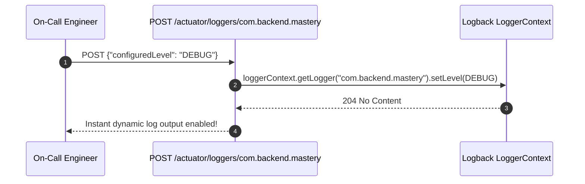

When a backend service runs in production, you cannot attach an IDE debugger to pause execution and inspect variables. Your application is a compiled binary running inside a Linux container, hidden behind load balancers, serving hundreds or thousands of concurrent requests per second.

If memory fills up, if database connection pools exhaust, or if background worker threads deadlock, how do you know? How does Kubernetes know whether your container is healthy or should be restarted?

**Spring Boot Actuator** is the production engine of the Spring ecosystem. It exposes HTTP and JMX endpoints that let you monitor, audit, and interact with your running application without restarting it.

In this chapter, we will build from the physical hardware and OS kernel signals up to Staff-level observability architecture, covering Kubernetes probes, custom health indicators, Micrometer Prometheus metrics, tag cardinality traps, dynamic runtime logging, and live JVM thread dump diagnostics.

---

## 1. Physical Mental Model: The Control Plane vs. The Data Plane

In production networking and system architecture, every high-scale system separates two paths:



1. **The Data Plane**: The pipeline that processes customer requests (e.g., `POST /api/orders`, `GET /users/42`). If the data plane gets overwhelmed with traffic, customer requests slow down.
2. **The Control Plane**: The management pipeline used by orchestration platforms (Kubernetes), monitoring scrapers (Prometheus, Datadog), and engineers to observe and control the process.

<Warning>
**The Single-Port Production Disaster**:
If your customer traffic and your Actuator endpoints share the exact same port (e.g., `8080`) and thread pool, a traffic surge on `/api/orders` can saturate all 200 Tomcat worker threads. 

When the Kubernetes `kubelet` pings `/actuator/health/liveness`, its request gets queued behind hundreds of customer requests. The probe times out (typically 1–3 seconds). Kubernetes assumes the container is dead and **kills the pod**, creating a catastrophic restart storm across your entire cluster!
</Warning>

### Separating Management Port in Spring Boot

In `application.yml`, always isolate the management endpoints onto a dedicated internal port:

```yaml
server:
  port: 8080 # Customer traffic

management:
  server:
    port: 8081 # Internal cluster network only! Never expose to the public internet.
  endpoints:
    web:
      exposure:
        include: "health,info,prometheus,metrics,loggers,threaddump"
      base-path: "/actuator"
```

Now, Tomcat spins up a completely separate network connector on port `8081` with its own thread listener. Even if customer traffic saturates port `8080`, Kubernetes health checks and Prometheus metric collections on port `8081` respond instantly.

---

## 2. Kubernetes Probes: Liveness vs. Readiness vs. Startup

Many developers confuse Liveness and Readiness. Making the wrong choice here is one of the most common causes of multi-region cascading outages in Kubernetes.



### The Three Probes Defined

| Probe | Purpose | What Kubernetes Does on Failure | Real Backend Example |
| :--- | :--- | :--- | :--- |
| **Startup Probe** | Gives slow-starting apps time to boot (JIT compilation, cache pre-warming). | Kills the pod only after `initialDelaySeconds + (periodSeconds * failureThreshold)`. | Large enterprise apps that take 45 seconds to initialize Hibernate and Liquibase. |
| **Liveness Probe** | Checks: *"Is the JVM process alive and capable of making forward progress?"* | **SIGKILL / Restarts the container**. | Detects JVM fatal deadlocks or broken thread loops. **Never check external dependencies here!** |
| **Readiness Probe** | Checks: *"Is this container ready to accept customer traffic right now?"* | **Removes pod from Service load balancer**. Does NOT restart. | Temporarily stop routing if connection pool is warming up or downstream DB is disconnected. |

### The "Death Spiral" Anti-Pattern: External Checks in Liveness

<Warning>
**The Worst Mistake in Kubernetes**:
Never let your Liveness probe check PostgreSQL, Redis, or an external third-party API!
</Warning>

Imagine this scenario:
1. Your PostgreSQL database experiences a temporary network blip or high load for 30 seconds.
2. If your pod's **Liveness** probe checks the database, it fails.
3. Kubernetes says: *"Pod 1 is broken! Kill and restart it!"*
4. Kubernetes kills all 50 pods of your service simultaneously.
5. All 50 pods reboot at the exact same moment. During startup, they all hammer the recovering database with 50 new connection handshakes and Flyway migration queries.
6. The database crashes permanently under the boot spike. Your entire system is down for hours.

**The Golden Rule**:
- **Liveness** checks *internal* JVM viability only (can the JVM process CPU cycles?).
- **Readiness** checks whether *dependencies* are accessible. If the database goes down, readiness fails, Kubernetes stops sending user traffic, but the pods stay alive waiting patiently for the database to recover.

### Enabling Kubernetes Probes in Spring Boot 3

Spring Boot automatically activates Kubernetes probe endpoints when it detects it is running inside Kubernetes. You can also explicitly enable them in `application.yml`:

```yaml
management:
  endpoint:
    health:
      probes:
        enabled: true
      show-details: when_authorized # Never leak internal IPs/passwords publicly!
      roles: "ACTUATOR_ADMIN"
  health:
    livenessstate:
      enabled: true
    readinessstate:
      enabled: true
```

This exposes two dedicated endpoints:
- `GET /actuator/health/liveness` -> Returns `{"status":"UP"}`
- `GET /actuator/health/readiness` -> Returns `{"status":"UP"}`

### Kubernetes Pod Manifest Configuration

Here is how your Kubernetes YAML should configure these probes:

```yaml
apiVersion: apps/v1
kind: Deployment
metadata:
  name: order-service
spec:
  replicas: 3
  template:
    spec:
      containers:
        - name: order-service
          image: myregistry.com/order-service:1.0.0
          ports:
            - containerPort: 8080
              name: http
            - containerPort: 8081
              name: management
          startupProbe:
            httpGet:
              path: /actuator/health/liveness
              port: management
            failureThreshold: 30
            periodSeconds: 2 # 30 * 2s = 60s total max boot window
          livenessProbe:
            httpGet:
              path: /actuator/health/liveness
              port: management
            initialDelaySeconds: 5
            periodSeconds: 10
            timeoutSeconds: 2
            failureThreshold: 3
          readinessProbe:
            httpGet:
              path: /actuator/health/readiness
              port: management
            initialDelaySeconds: 5
            periodSeconds: 5
            timeoutSeconds: 2
            failureThreshold: 2
```

---

## 3. Writing Production Custom HealthIndicators

Spring Boot provides built-in health indicators for DataSource (`DiskSpaceHealthIndicator`, `DataSourceHealthIndicator`, `RedisHealthIndicator`). But in real-world systems, you need custom indicators for proprietary components—such as an external payment provider, a critical message queue backlog, or disk buffer capacity.

Let us write a custom health indicator for an asynchronous order processing pipeline.

```java
package com.backend.mastery.actuator;

import org.springframework.boot.actuate.health.Health;
import org.springframework.boot.actuate.health.HealthIndicator;
import org.springframework.stereotype.Component;

import java.io.File;
import java.util.concurrent.atomic.AtomicBoolean;

/**
 * Custom Health Indicator monitoring local temp storage for PDF receipt generation.
 * If disk space falls below 500 MB, we report OUT_OF_SERVICE to stop incoming orders.
 */
@Component("receiptStorageHealth")
public class ReceiptStorageHealthIndicator implements HealthIndicator {

    private static final long MIN_FREE_BYTES = 500L * 1024 * 1024; // 500 MB
    private final File storageDir = new File("/tmp/receipts");
    private final AtomicBoolean maintenanceMode = new AtomicBoolean(false);

    public void setMaintenanceMode(boolean inMaintenance) {
        this.maintenanceMode.set(inMaintenance);
    }

    @Override
    public Health health() {
        if (maintenanceMode.get()) {
            return Health.outOfService()
                    .withDetail("reason", "Manual administrator maintenance triggered")
                    .withDetail("action", "Draining in-flight generation jobs")
                    .build();
        }

        long usableSpace = storageDir.getUsableSpace();

        if (usableSpace < MIN_FREE_BYTES) {
            return Health.down()
                    .withDetail("error", "Insufficient storage for receipt generation")
                    .withDetail("freeBytes", usableSpace)
                    .withDetail("thresholdBytes", MIN_FREE_BYTES)
                    .build();
        }

        return Health.up()
                .withDetail("storagePath", storageDir.getAbsolutePath())
                .withDetail("freeBytes", usableSpace)
                .build();
    }
}
```

### Understanding Health Status Codes and HTTP Mapping

Spring Boot maps health statuses to HTTP response codes via `HttpCodeStatusMapper`:

| Spring Health Status | Default HTTP Status | Meaning |
| :--- | :--- | :--- |
| `Status.UP` | `200 OK` | Component is healthy and operating normally. |
| `Status.DOWN` | `503 SERVICE UNAVAILABLE` | Component has suffered an unrecoverable failure. |
| `Status.OUT_OF_SERVICE` | `503 SERVICE UNAVAILABLE` | Component is intentionally disabled or draining traffic. |
| `Status.UNKNOWN` | `200 OK` | Status cannot be determined; does not trigger alarms by default. |

When you query `GET http://localhost:8081/actuator/health`, Spring aggregates all indicators. If even a **single** indicator reports `DOWN` or `OUT_OF_SERVICE`, the overall status becomes `503 SERVICE UNAVAILABLE`.

---

## 4. Production Metrics with Micrometer & Prometheus

Observability is not just knowing whether a service is up or down; it is understanding how it behaves under load.

**Micrometer** is the standard metrics facade for the JVM, analogous to SLF4J for logging. You instrument your code once with Micrometer interfaces, and Micrometer exports those metrics to any monitoring system (Prometheus, Datadog, InfluxDB, AWS CloudWatch).



### The Three Core Meter Types

1. **Counter**: A monotonically increasing cumulative value (e.g., `orders_placed_total`, `http_requests_total`). It can only go up or be reset to zero on restart.
2. **Timer**: Measures both duration (latency in milliseconds/seconds) and frequency of short events (e.g., HTTP request execution time, database query latency). Automatically creates histograms and percentiles ($p50, p95, p99$).
3. **Gauge**: An instantaneous snapshot of a fluctuating value (e.g., active thread count, database connection pool active connections, CPU usage percentage).

### Building a Production Order Metrics Service

Here is a real-world implementation demonstrating Counters, Timers, and Gauges with custom tags:

```java
package com.backend.mastery.actuator;

import io.micrometer.core.instrument.Counter;
import io.micrometer.core.instrument.MeterRegistry;
import io.micrometer.core.instrument.Timer;
import org.springframework.stereotype.Service;

import java.util.concurrent.ConcurrentHashMap;
import java.util.concurrent.TimeUnit;
import java.util.concurrent.atomic.AtomicInteger;

@Service
public class OrderMetricsService {

    private final MeterRegistry registry;
    private final Counter paymentSuccessCounter;
    private final Counter paymentFailureCounter;
    private final Timer orderProcessingTimer;
    private final AtomicInteger pendingOrdersGauge;

    public OrderMetricsService(MeterRegistry registry) {
        this.registry = registry;

        // 1. Counter: Track total successful payments
        this.paymentSuccessCounter = Counter.builder("shop.payment.processed.total")
                .description("Total number of processed payments")
                .tag("result", "success")
                .tag("payment_type", "credit_card")
                .register(registry);

        // 2. Counter: Track payment rejections
        this.paymentFailureCounter = Counter.builder("shop.payment.processed.total")
                .description("Total number of processed payments")
                .tag("result", "failed")
                .tag("payment_type", "credit_card")
                .register(registry);

        // 3. Timer: Track checkout duration with percentiles
        this.orderProcessingTimer = Timer.builder("shop.order.processing.duration")
                .description("Duration required to validate, charge, and store an order")
                .publishPercentiles(0.5, 0.95, 0.99) // p50, p95, p99
                .publishPercentileHistogram()
                .minimumExpectedValue(java.time.Duration.ofMillis(10))
                .maximumExpectedValue(java.time.Duration.ofSeconds(5))
                .register(registry);

        // 4. Gauge: Track live orders currently sitting in memory queue
        this.pendingOrdersGauge = new AtomicInteger(0);
        registry.gauge("shop.orders.pending.gauge", pendingOrdersGauge);
    }

    public void recordOrderExecution(Runnable task) {
        pendingOrdersGauge.incrementAndGet();
        long start = System.nanoTime();
        try {
            orderProcessingTimer.record(task);
            paymentSuccessCounter.increment();
        } catch (Exception ex) {
            paymentFailureCounter.increment();
            throw ex;
        } finally {
            pendingOrdersGauge.decrementAndGet();
        }
    }
}
```

### The Unbounded Tag Cardinality Disaster

<Warning>
**The Tag Cardinality Trap (How Metrics Kill Your JVM)**:
Never, under any circumstances, use dynamic user input or high-cardinality values as Micrometer tag values!
</Warning>

Look at this innocent-looking line:

```java
// CATASTROPHIC ANTI-PATTERN:
Counter.builder("http.requests")
    .tag("user_id", request.getUserId()) // 10 million distinct users!
    .tag("order_id", request.getOrderId()) // Infinite distinct IDs!
    .register(registry);
```

**Why this causes an OutOfMemoryError (OOM)**:
1. In Prometheus and Micrometer, each unique combination of key-value tags creates a completely separate **time series** in memory.
2. If you have 5 million users, Micrometer allocates 5 million distinct `Meter` objects in the JVM heap.
3. Every 15 seconds, Prometheus scrapes `/actuator/prometheus`. The response body is now a **600-megabyte raw text string**.
4. The JVM garbage collector freezes the entire server trying to clean up millions of tag strings. The pod crashes with `java.lang.OutOfMemoryError: Java heap space`.

**Best Practice**:
- Tags must only contain bounded, low-cardinality enums (e.g., `status: success|failed`, `http_method: GET|POST`, `client_type: mobile|web`).
- High-cardinality identifiers (`orderId`, `userId`, `traceId`) belong in **logs and distributed traces (OpenTelemetry)**, never in metrics!

---

## 5. Dynamic Runtime Logging (`/actuator/loggers`)

In high-throughput microservices, running with `DEBUG` logging enabled at all times generates hundreds of gigabytes of disk I/O per hour, causing significant CPU overhead. Consequently, production services run with `INFO` or `WARN` level.

However, when a critical customer reports a bizarre bug in production, you need `DEBUG` logs immediately. In legacy systems, this required editing `application.yml`, committing code, building a Docker image, and redeploying—by which time the bug is gone.

With Spring Boot Actuator, you can change the log level of any package **in real time with zero restarts**:



### Querying Current Log Level

```bash
curl -X GET http://localhost:8081/actuator/loggers/com.backend.mastery.service
```

**Response**:
```json
{
  "configuredLevel": "INFO",
  "effectiveLevel": "INFO"
}
```

### Updating Log Level at Runtime

To switch the entire order processing subsystem to `DEBUG` for the next 10 minutes:

```bash
curl -X POST http://localhost:8081/actuator/loggers/com.backend.mastery.service \
  -H "Content-Type: application/json" \
  -d '{"configuredLevel": "DEBUG"}'
```

The response is `204 No Content`. Instantly, every thread executing code inside `com.backend.mastery.service` begins emitting debug statements to standard output without interrupting in-flight requests.

Once you capture the trace, reset it back to normal:

```bash
curl -X POST http://localhost:8081/actuator/loggers/com.backend.mastery.service \
  -H "Content-Type: application/json" \
  -d '{"configuredLevel": null}'
```

Passing `null` restores the log level back to whatever was defined in the base configuration.

---

## 6. Thread Dumps & Heap Dumps: Diagnosing Production Freezes

When a service is consuming 100% CPU or suddenly stops responding to HTTP requests, it is usually suffering from one of two problems:
1. **Thread Deadlock or CPU Spin**: Multiple threads waiting on synchronized monitors, database connection pools exhausted, or infinite loops.
2. **Memory Leak**: An unbounded collection or cache consuming the entire JVM heap.

### Generating a Live Thread Dump (`/actuator/threaddump`)

Actuator can snapshot the exact stack trace and execution state of every single thread running inside the JVM:

```bash
curl -X GET http://localhost:8081/actuator/threaddump -H "Accept: text/plain"
```

Let us analyze a real thread dump section to spot a production deadlock:

```text
"http-nio-8080-exec-1" #42 daemon prio=5 os_prio=0 cpu=142.31ms elapsed=420.12s tid=0x00007f9c9401b800 nid=0x2b waiting on condition [0x00007f9c6e3fd000]
   java.lang.Thread.State: WAITING (parking)
	at jdk.internal.misc.Unsafe.park(java.base@21.0.2/Native Method)
	- parking to wait for  <0x000000070b4a21e0> (a java.util.concurrent.locks.AbstractQueuedSynchronizer$ConditionObject)
	at java.util.concurrent.locks.LockSupport.park(java.base@21.0.2/LockSupport.java:371)
	at com.zaxxer.hikari.util.ConcurrentBag.borrow(ConcurrentBag.java:152)
	at com.zaxxer.hikari.pool.HikariPool.getConnection(HikariPool.java:182)
	at com.zaxxer.hikari.pool.HikariPool.getConnection(HikariPool.java:162)
	at org.springframework.jdbc.datasource.DataSourceUtils.doGetConnection(DataSourceUtils.java:117)
	at org.springframework.jdbc.datasource.DataSourceTransactionManager.doBegin(DataSourceTransactionManager.java:303)
```

**What This Thread Dump Proves**:
- The worker thread `http-nio-8080-exec-1` is in `WAITING (parking)` state.
- Look at line 4: `com.zaxxer.hikari.pool.HikariPool.getConnection`.
- **Diagnosis**: The database connection pool is completely exhausted! Every worker thread is paused waiting for a database connection that is never returned. This instantly points you to a missing connection release or a slow database query holding connections hostage.

---

## 7. Securing Actuator in Production

Actuator endpoints reveal sensitive internal details about your system: environment variables, database URLs, classpaths, thread stacks, and memory layouts. Exposing them to the public internet is an extreme security vulnerability.

### Complete Hardened Actuator Configuration

Here is the production standard for securing Actuator:

<CodeGroup>
```yaml application-prod.yml
# 1. Isolate to internal private network port
management:
  server:
    port: 8081
    address: 127.0.0.1 # Or internal VPC interface only
  endpoints:
    web:
      exposure:
        # Expose only the strictly necessary operational endpoints
        include: "health,info,prometheus,metrics,loggers"
  endpoint:
    health:
      show-details: when_authorized
      roles: "ACTUATOR_ADMIN"
    env:
      enabled: false # Never expose environment variables!
    heapdump:
      enabled: false # Dumping heap contains customer PII and API keys!
```

```java SecurityConfig.java
package com.backend.mastery.config;

import org.springframework.boot.actuate.autoconfigure.security.servlet.EndpointRequest;
import org.springframework.context.annotation.Bean;
import org.springframework.context.annotation.Configuration;
import org.springframework.core.annotation.Order;
import org.springframework.security.config.annotation.web.builders.HttpSecurity;
import org.springframework.security.web.SecurityFilterChain;

import static org.springframework.security.config.Customizer.withDefaults;

@Configuration(proxyBeanMethods = false)
public class ActuatorSecurityConfig {

    @Bean
    @Order(1) // Evaluate before main application security filter chain
    public SecurityFilterChain actuatorSecurityFilterChain(HttpSecurity http) throws Exception {
        http
            .securityMatcher(EndpointRequest.toAnyEndpoint())
            .authorizeHttpRequests(auth -> auth
                // Allow Kubernetes probes without authentication (internal VPC only)
                .requestMatchers(EndpointRequest.to("health")).permitAll()
                // Prometheus scraping requires mTLS or internal token
                .requestMatchers(EndpointRequest.to("prometheus")).hasRole("MONITORING")
                // Runtime logger adjustments restricted to senior engineering role
                .requestMatchers(EndpointRequest.to("loggers", "threaddump")).hasRole("OPS_ADMIN")
                .anyRequest().denyAll()
            )
            .httpBasic(withDefaults())
            .csrf(csrf -> csrf.disable()); // Stateless internal API

        return http.build();
    }
}
```
</CodeGroup>

---

## 8. Active Recall & Interview Drills

<CardGroup cols={2}>
  <Card title="1. Liveness vs Readiness" icon="question">
    Why should your database connection check NEVER be wired into the Liveness probe? What happens to a Kubernetes cluster if you do?
  </Card>
  <Card title="2. Management Port Isolation" icon="question">
    Why should `management.server.port` be configured to a different port (e.g. 8081) than customer traffic (8080)?
  </Card>
  <Card title="3. Tag Cardinality Trap" icon="question">
    What happens to the JVM heap if you include `userId` or `orderUuid` as a tag in a Micrometer Counter?
  </Card>
  <Card title="4. Dynamic Log Levels" icon="question">
    How do you switch a specific package to `DEBUG` level in production without restarting the JVM or modifying config files?
  </Card>
  <Card title="5. Health Status Aggregation" icon="question">
    If you have 5 HealthIndicators, and 4 return `UP` while 1 returns `DOWN`, what HTTP status code does `/actuator/health` return by default?
  </Card>
  <Card title="6. Thread Dump Triage" icon="question">
    When looking at an Actuator thread dump, what thread state and method call indicates HikariCP connection pool starvation?
  </Card>
  <Card title="7. Prometheus vs Actuator" icon="question">
    What is the architectural difference between Micrometer and Prometheus? Which one formats the metric text output?
  </Card>
  <Card title="8. Securing Actuator" icon="question">
    Why should the `/actuator/heapdump` and `/actuator/env` endpoints be explicitly disabled or restricted from production access?
  </Card>
</CardGroup>

---

## 9. Done Checklist

<Check>
- [ ] Understand the architectural boundary between the Data Plane (customer traffic) and Control Plane (Actuator).
- [ ] Isolated `management.server.port` to a dedicated internal port (8081) to protect against worker thread starvation.
- [ ] Configured Kubernetes Startup, Liveness, and Readiness probes with appropriate delay, timeout, and failure thresholds.
- [ ] Strictly ensured Liveness probes check internal JVM viability only, never downstream databases or external services.
- [ ] Implemented a custom `HealthIndicator` providing diagnostic details and appropriate status codes (`UP`, `DOWN`, `OUT_OF_SERVICE`).
- [ ] Configured `management.endpoint.health.show-details: when_authorized` to prevent leaking internal infrastructure details.
- [ ] Mastered Micrometer core instruments: Counters, Timers (with percentiles), and Gauges.
- [ ] Eliminated high-cardinality values (`userId`, `orderId`) from Micrometer tags to prevent JVM heap exhaustion.
- [ ] Used `POST /actuator/loggers` to adjust log levels dynamically in production without service interruption.
- [ ] Downloaded and analyzed JVM thread dumps to diagnose deadlocks, thread parking, and connection pool bottlenecks.
- [ ] Hardened Actuator endpoints in Spring Security using dedicated `EndpointRequest` security matchers.
- [ ] Validated the `/actuator/prometheus` scraping endpoint format for consumption by Prometheus server.
- [ ] Verified graceful degradation when downstream components fail while readiness probe stops user traffic.
- [ ] Disabled sensitive endpoints (`env`, `heapdump`) in production to prevent credential and PII exfiltration.
- [ ] Tested all endpoints locally and verified clean HTTP response codes and JSON payload structure.
</Check>
