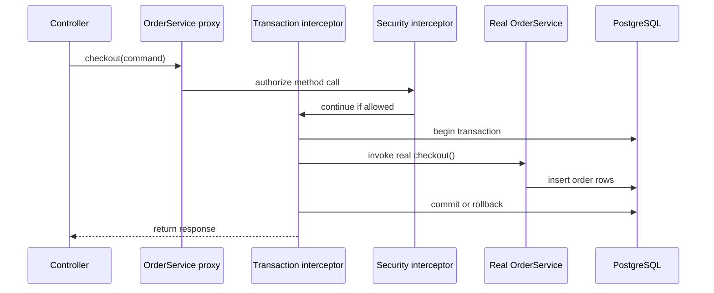
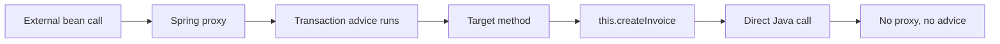

## Prerequisites: Before You Begin

Before studying this chapter, make sure you understand:

- Spring IoC and constructor injection.
- Transaction boundaries and `@Transactional`.
- Java threads, thread pools, and exception handling.
- Basic HTTP request flow through controller, service, repository, and database.

---

# Phase 1: Ground Floor (Physical First Principles)

A normal Java method call is just a CPU jump inside one JVM process. Spring AOP changes that path by placing a proxy object in front of the real object. The caller thinks it is invoking `OrderService`, but it is actually invoking a Spring-generated object that can run extra logic before and after the real method.



That is why annotations such as `@Transactional`, `@PreAuthorize`, `@Cacheable`, and `@Async` feel like magic. They are not magic. They are method interceptors attached to a proxy.

## The Vocabulary In Simple English

| Term | Meaning | Backend example |
| --- | --- | --- |
| Target object | The real bean that contains your business code. | `OrderService` |
| Proxy | Spring-generated object that wraps the target. | CGLIB subclass or JDK proxy |
| Advice | Extra logic run around a method call. | start transaction, check permission |
| Pointcut | Rule deciding which methods get advice. | methods annotated with `@Transactional` |
| Join point | The actual method invocation being intercepted. | `checkout()` call |
| Advisor | Pointcut plus advice. | transaction advisor |

---

# Phase 2: The Naive Code (The Production Crash)

## Catastrophe 1: Self-Invocation Bypasses The Proxy

```java
@Service
public class BillingService {

    public void billCustomer(Long customerId) {
        // This is a direct call on "this", not a proxy call.
        createInvoice(customerId);
    }

    @Transactional
    public void createInvoice(Long customerId) {
        // Developer expects a transaction here.
        // It will not start when called through this.createInvoice().
    }
}
```

Why it fails:



Fix:

- Move the transactional method to a collaborator bean.
- Or use `TransactionTemplate` for explicit boundaries.
- Avoid `AopContext.currentProxy()` in ordinary business code.

## Catastrophe 2: Publishing Events Before Commit

```java
@Transactional
public void placeOrder(PlaceOrderCommand command) {
    Order order = orderRepository.save(Order.place(command));
    applicationEventPublisher.publishEvent(new OrderPlacedEvent(order.getId()));
    paymentClient.reserveFunds(order.getId());
}
```

If the event listener sends email immediately, the user can receive an "order placed" email even if the transaction later rolls back.

Fix with transaction-bound events:

```java
@Component
class OrderEvents {

    @TransactionalEventListener(phase = TransactionPhase.AFTER_COMMIT)
    void afterCommit(OrderPlacedEvent event) {
        // Runs only after the database transaction commits.
    }
}
```

## Catastrophe 3: `@Async` Without Executor Discipline

```java
@Async
public void sendReceiptEmail(Long orderId) {
    emailClient.send(orderId);
}
```

The annotation is not enough. You must know:

- Which executor runs this work.
- How many threads it has.
- What happens when the queue is full.
- How exceptions are observed.
- Whether MDC/correlation IDs and security context are propagated.

---

# Phase 3: Under The Hood (Mechanics & Code)

## JDK Dynamic Proxy vs CGLIB

| Proxy type | How it works | Limitation |
| --- | --- | --- |
| JDK dynamic proxy | Creates an object implementing the same interface. | Only interface methods are proxied. |
| CGLIB proxy | Creates a runtime subclass of the concrete class. | `final` classes and `final/private` methods cannot be advised. |

<Warning>
If an advised method is `private`, `final`, or called through `this`, Spring AOP advice will not run the way beginners expect.
</Warning>

## Production Executor Configuration

```java
@Configuration
@EnableAsync
public class AsyncConfig {

    @Bean(name = "notificationExecutor")
    public ThreadPoolTaskExecutor notificationExecutor() {
        ThreadPoolTaskExecutor executor = new ThreadPoolTaskExecutor();
        executor.setCorePoolSize(8);
        executor.setMaxPoolSize(32);
        executor.setQueueCapacity(500);
        executor.setThreadNamePrefix("notification-");
        executor.setRejectedExecutionHandler(new ThreadPoolExecutor.CallerRunsPolicy());
        executor.setTaskDecorator(new MdcTaskDecorator());
        executor.initialize();
        return executor;
    }
}
```

```java
public class MdcTaskDecorator implements TaskDecorator {

    @Override
    public Runnable decorate(Runnable task) {
        Map<String, String> context = MDC.getCopyOfContextMap();
        return () -> {
            Map<String, String> previous = MDC.getCopyOfContextMap();
            try {
                if (context != null) {
                    MDC.setContextMap(context);
                }
                task.run();
            } finally {
                if (previous == null) {
                    MDC.clear();
                } else {
                    MDC.setContextMap(previous);
                }
            }
        };
    }
}
```

Use the executor explicitly:

```java
@Service
public class ReceiptService {

    @Async("notificationExecutor")
    public CompletableFuture<Void> sendReceipt(Long orderId) {
        // send receipt
        return CompletableFuture.completedFuture(null);
    }
}
```

## Transactional Domain Event Pattern

```java
public record OrderPlacedEvent(UUID orderId, UUID customerId) {}
```

```java
@Service
public class OrderService {

    private final OrderRepository orders;
    private final ApplicationEventPublisher events;

    public OrderService(OrderRepository orders, ApplicationEventPublisher events) {
        this.orders = orders;
        this.events = events;
    }

    @Transactional
    public UUID placeOrder(PlaceOrderCommand command) {
        Order order = orders.save(Order.place(command));
        events.publishEvent(new OrderPlacedEvent(order.id(), order.customerId()));
        return order.id();
    }
}
```

```java
@Component
public class OrderPlacedListener {

    private final OutboxRepository outbox;

    public OrderPlacedListener(OutboxRepository outbox) {
        this.outbox = outbox;
    }

    @TransactionalEventListener(phase = TransactionPhase.BEFORE_COMMIT)
    public void storeOutboxEvent(OrderPlacedEvent event) {
        outbox.save(OutboxMessage.from(event));
    }
}
```

`BEFORE_COMMIT` is useful when the listener must write inside the same transaction. `AFTER_COMMIT` is useful when the listener must run only after success and does not need to mutate the same transaction.

## Scheduling In Kubernetes

```java
@Scheduled(cron = "0 0 * * * *")
public void generateHourlyReports() {
    reportService.generate();
}
```

This runs once per JVM. If the deployment has 6 pods, it runs 6 times.

Production options:

| Requirement | Safer design |
| --- | --- |
| Run once for whole cluster | Kubernetes CronJob, ShedLock, Quartz cluster mode, or database row claiming |
| Process many rows safely | `FOR UPDATE SKIP LOCKED` or Spring Batch partitioning |
| Retry failed work | Store job state durably |
| Observe failures | Emit job duration, success, failure, and lag metrics |

---

# Phase 4: Senior Interview Ace

| Junior answer | Senior answer |
| --- | --- |
| "`@Transactional` starts a transaction." | "Spring starts a transaction when a method call enters through the proxy and matches the transaction advisor. Self-invocation, private methods, and final methods can bypass the advice." |
| "`@Async` makes it run in background." | "`@Async` submits work to an executor. I need bounded queues, rejection policy, exception handling, context propagation, and metrics." |
| "Events decouple code." | "Events decouple call sites, but transaction phase matters. I use `@TransactionalEventListener` or an outbox when commit correctness matters." |
| "`@Scheduled` runs the job." | "It runs per JVM. In Kubernetes, multiple pods can execute the same schedule unless I add cluster coordination." |

## Debug Checklist

- Is the bean actually managed by Spring?
- Is the method public and non-final?
- Is the call entering through another bean or through `this`?
- Are multiple annotations competing for advisor order?
- Which executor is used by `@Async`?
- Are async exceptions logged, surfaced, or silently swallowed?
- Does the event need `BEFORE_COMMIT`, `AFTER_COMMIT`, or a transactional outbox?
- Does the scheduled job run once per pod or once per cluster?

## Practice Tasks

1. Create a self-invocation `@Transactional` bug and prove the transaction is missing.
2. Refactor the method into a collaborator bean and prove the transaction appears.
3. Publish an order event and handle it with `AFTER_COMMIT`.
4. Add a bounded executor for `@Async`.
5. Run two app instances and prove that `@Scheduled` runs twice without coordination.

## Done Checklist

- [ ] You can explain proxy-based AOP without using the word "magic."
- [ ] You can identify why self-invocation breaks advice.
- [ ] You can choose between `@EventListener`, `@TransactionalEventListener`, and outbox.
- [ ] You can configure a bounded async executor.
- [ ] You can make scheduled jobs safe in multi-pod deployments.
