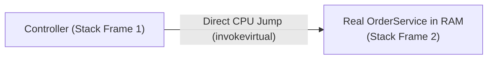
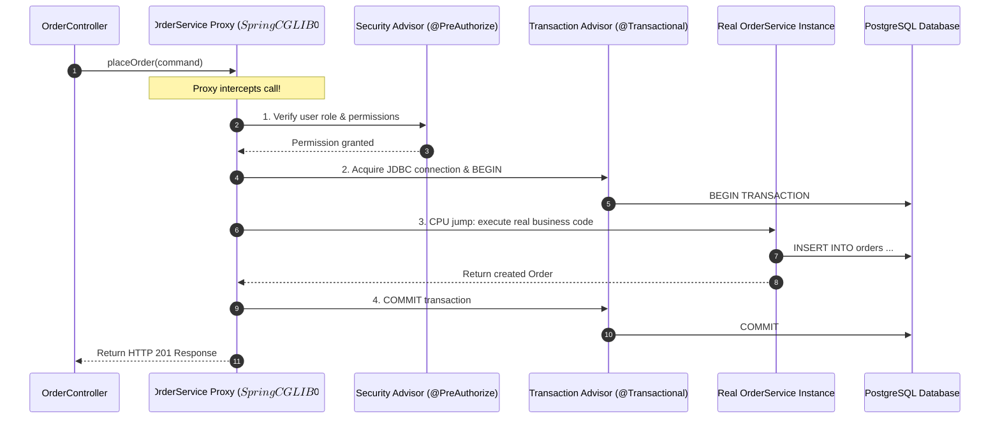
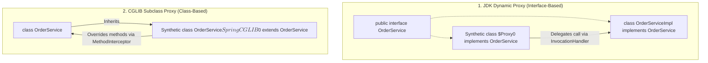
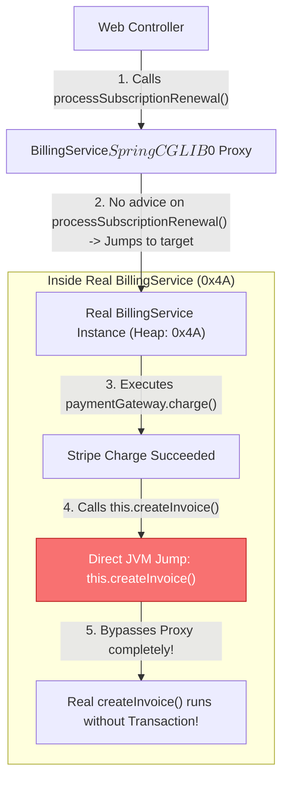
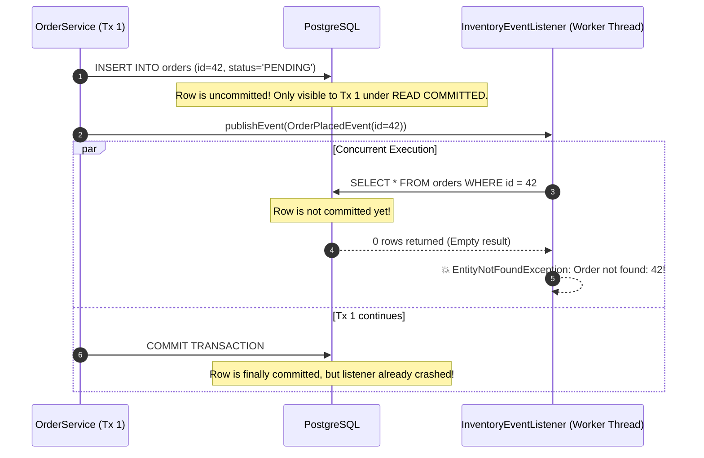
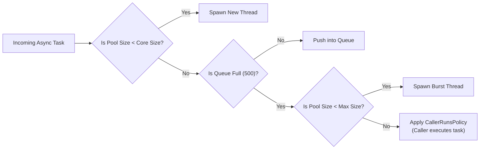
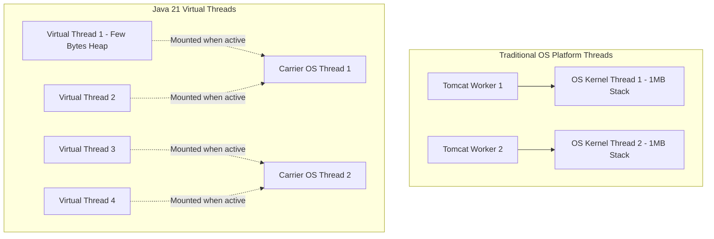
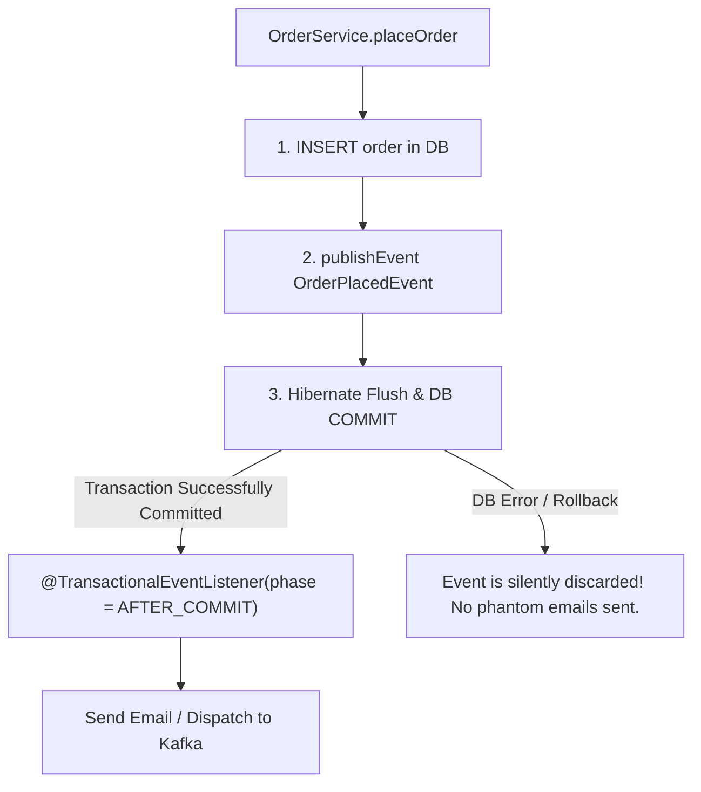
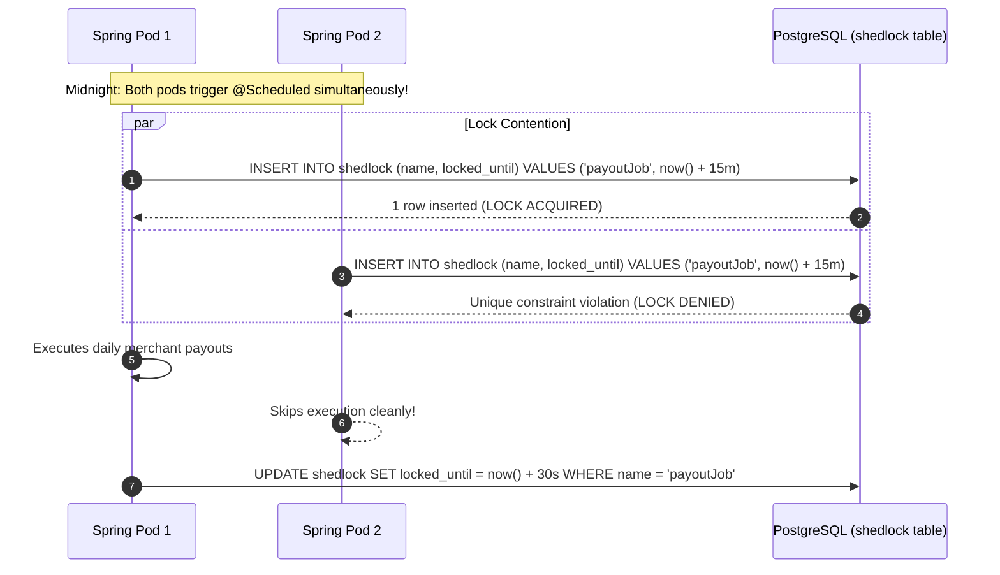

## Prerequisites: Before You Begin

Before diving into Spring AOP and asynchronous execution, ensure you understand:
- **JVM Memory**: The difference between stack memory (local method variables) and heap memory (shared objects created with `new`).
- **Interfaces vs Subclasses**: How Java polymorphism works through interfaces and class inheritance.
- **Spring IoC**: How the Spring container instantiates beans and injects them into other beans.
- **Relational Transactions**: What an ACID transaction boundary means and why database commits must be atomic.

---

# Phase 1: Ground Floor (Physical First Principles)

## 1. What Physically Happens During a Java Method Call?

In normal Java code, calling a method is a direct jump inside the computer's CPU. 

When thread $T_1$ executes `orderService.placeOrder()`, the CPU takes the memory address of the compiled bytecode for `placeOrder()`, pushes a new frame onto the thread's physical stack in RAM, and immediately begins executing instructions.



Because this is a direct jump, **nothing else can happen in between**. Java does not automatically check security permissions, does not automatically open a PostgreSQL transaction, and does not automatically log how many milliseconds the method took.

To add those behaviors without copy-pasting code into thousands of methods, Spring uses **Aspect-Oriented Programming (AOP)** powered by **Dynamic Proxies**.

---

## 2. What Is a Spring Proxy?

A **Proxy** is an invisible middleman object that Spring places in the JVM heap between the caller and the real bean.

When you inject `OrderService` into `OrderController`, Spring does **not** give the controller a direct reference to your real `OrderService`. Instead, Spring manufactures a synthetic proxy object that wraps your real bean:



This sequence illustrates why annotations like `@Transactional`, `@PreAuthorize`, `@Cacheable`, and `@Async` feel like "magic." 

They are **not** language keywords. They are simply metadata flags read by Spring's proxy interceptor chain to decide what extra logic to execute before and after jumping to your real method!

---

## 3. CGLIB Subclassing vs JDK Dynamic Proxies

Spring creates proxies using one of two physical mechanisms in the JVM:



### Mechanism Comparison

| Property | JDK Dynamic Proxy | CGLIB Subclass Proxy |
| :--- | :--- | :--- |
| **How it works** | Uses `java.lang.reflect.Proxy` to implement interfaces dynamically at runtime. | Uses bytecode manipulation (`ByteBuddy` / ASM) to generate a child subclass extending the bean. |
| **Interface required?** | **Yes**. Can only proxy methods defined on a Java `interface`. | **No**. Can proxy concrete classes directly without interfaces. |
| **Generated class name** | `com.sun.proxy.$Proxy42` | `OrderService$$SpringCGLIB$$0` |
| **Class limitations** | Cannot cast proxy to the concrete implementation class. | Target class **cannot be `final`**; target methods **cannot be `final`**. |
| **Spring Boot default** | Opt-in via `spring.aop.proxy-target-class=false`. | **Default in Spring Boot 2 & 3** (`spring.aop.proxy-target-class=true`). |

<Tip>
**Why Spring Boot 3 Defaults to CGLIB**:
In older Spring versions, if you injected a concrete class like `@Autowired private OrderServiceImpl service`, but the bean implemented an interface, Spring generated a JDK proxy (`$Proxy42`). Because `$Proxy42` implemented the interface but did not extend `OrderServiceImpl`, the JVM crashed on startup with a `BeanNotOfRequiredTypeException`. CGLIB generates a direct subclass, completely eliminating this class-cast hazard.
</Tip>

---

## 4. The Core Vocabulary in Plain English

| Term | Simple Definition | Concrete Backend Example |
| :--- | :--- | :--- |
| **Target Object** | Your real Java class containing actual business rules. | `OrderService.java` |
| **Join Point** | Any point during program execution where code can be intercepted (in Spring AOP, this is always a method execution). | The moment `placeOrder()` is invoked. |
| **Pointcut** | A predicate or pattern that matches specific Join Points. | `"All public methods in package com.example.service annotated with @Audited"`. |
| **Advice** | The physical code executed by the proxy at a join point. | Open a database connection, log latency, verify JWT permissions. |
| **Advisor** | The atomic unit of Spring AOP: exactly one Pointcut paired with one Advice. | `TransactionAttributeSourceAdvisor` (matches `@Transactional` and applies transaction advice). |
| **Weaving** | The process of linking proxies to target objects to create an advised object. | Spring Boot performs **runtime dynamic weaving** during application startup in `BeanPostProcessor`. |

---

# Phase 2: The Naive Code (The Production Crash)

When developers use Spring annotations without understanding the underlying proxy mechanics, they trigger subtle, catastrophic bugs that pass code review and silent unit tests, only to cause data corruption and system outages in production.

---

## Catastrophe 1: The Self-Invocation Silent Bypass

A fintech developer wrote a billing service. When a subscription renews, the system charges the customer and generates an invoice. If generating the invoice fails, the entire operation must roll back:

```java
// NAIVE CODE: CATASTROPHIC TRANSACTION & CACHE BYPASS!
@Service
public class BillingService {

    private final PaymentGateway paymentGateway;
    private final InvoiceRepository invoiceRepository;

    public BillingService(PaymentGateway paymentGateway, InvoiceRepository invoiceRepository) {
        this.paymentGateway = paymentGateway;
        this.invoiceRepository = invoiceRepository;
    }

    public void processSubscriptionRenewal(Long customerId, BigDecimal amount) {
        // Step 1: Charge the customer
        paymentGateway.charge(customerId, amount);

        // Step 2: Call internal helper method to create invoice
        // FATAL MISTAKE: Self-invocation via "this" keyword!
        this.createInvoice(customerId, amount);
    }

    @Transactional(propagation = Propagation.REQUIRES_NEW)
    public void createInvoice(Long customerId, BigDecimal amount) {
        Invoice invoice = new Invoice(customerId, amount, Instant.now());
        invoiceRepository.save(invoice);
        if (amount.compareTo(BigDecimal.valueOf(10000)) > 0) {
            throw new ComplianceReviewRequiredException("Large corporate invoice requires manual sign-off");
        }
    }
}
```

### Why Production Fails Catastrophically

In production, an invoice over \$10,000 threw `ComplianceReviewRequiredException`. The developer expected `@Transactional` to roll back the database insert. Instead, the corrupt invoice was permanently committed to PostgreSQL!

#### The Memory Call Stack Trace



1. The controller invokes `processSubscriptionRenewal()` on the **Proxy**.
2. Because `processSubscriptionRenewal()` has no annotations, the proxy performs a direct pass-through jump to the real `BillingService` object.
3. Inside `processSubscriptionRenewal()`, the code calls `this.createInvoice()`.
4. In Java, `this` is a direct physical pointer in RAM to the current object (`0x4A`). 
5. The call **never goes back to the Proxy**! The `@Transactional` annotation on `createInvoice()` is never read, no database transaction is opened, and no rollback logic can ever execute.

---

### The Production Fix: Collaborator Bean Separation

Move the transactional boundary to a separate collaborator bean so every call passes through a Spring-managed proxy reference:

```java
// 1. Dedicated collaborator containing the transaction boundary
@Service
public class InvoiceService {

    private final InvoiceRepository invoiceRepository;

    public InvoiceService(InvoiceRepository invoiceRepository) {
        this.invoiceRepository = invoiceRepository;
    }

    @Transactional(propagation = Propagation.REQUIRES_NEW)
    public void createInvoice(Long customerId, BigDecimal amount) {
        Invoice invoice = new Invoice(customerId, amount, Instant.now());
        invoiceRepository.save(invoice);
        if (amount.compareTo(BigDecimal.valueOf(10000)) > 0) {
            throw new ComplianceReviewRequiredException("Large corporate invoice requires manual sign-off");
        }
    }
}

// 2. Billing service orchestrates external bean calls
@Service
public class BillingService {

    private final PaymentGateway paymentGateway;
    private final InvoiceService invoiceService; // Injected Spring Proxy!

    public BillingService(PaymentGateway paymentGateway, InvoiceService invoiceService) {
        this.paymentGateway = paymentGateway;
        this.invoiceService = invoiceService;
    }

    public void processSubscriptionRenewal(Long customerId, BigDecimal amount) {
        paymentGateway.charge(customerId, amount);
        // SAFE: invoiceService is a proxy; @Transactional advice executes!
        invoiceService.createInvoice(customerId, amount);
    }
}
```

Line by line:
- `private final InvoiceService invoiceService`: Injects the proxy generated by Spring for `InvoiceService`.
- `invoiceService.createInvoice(...)`: Calls the method through the proxy reference rather than `this`. The proxy intercepts the call, acquires a JDBC connection, begins a transaction, and correctly rolls back upon encountering the exception.

---

## Catastrophe 2: The Unbounded `@Async` Thread Exhaustion Crash

A developer needed to send email receipts asynchronously so the customer’s HTTP checkout request would respond in 50 milliseconds instead of waiting 3 seconds for the mail server:

```java
// NAIVE CODE: CRASHES THE OPERATING SYSTEM UNDER LOAD!
@Configuration
@EnableAsync
public class AsyncConfig {
    // Left completely empty! Relying on Spring Boot defaults.
}

@Service
public class EmailReceiptService {

    @Async
    public void sendReceipt(Long orderId, String email) {
        // Simulates 3-second network call to SendGrid
        mailClient.sendEmail(email, "Your Receipt for Order #" + orderId);
    }
}
```

### Why Production Crashes Under Load

1. **The Default Executor Hazard**: When `@EnableAsync` is present without a custom `TaskExecutor` bean, Spring Boot 3 defaults to `SimpleAsyncTaskExecutor`.
2. **One OS Thread Per Request**: `SimpleAsyncTaskExecutor` **does not pool threads**. For every single `@Async` method call, it calls `new Thread(runnable).start()`.
3. **The Black Friday Outage**: During a flash sale, 4,000 customers complete orders in 10 seconds.
4. The JVM attempts to spawn 4,000 physical OS kernel threads.
5. Each OS thread in Linux allocates a default 1 MB stack memory block (`-Xss1024k`). 4,000 threads demand 4 GB of native memory outside the JVM heap.
6. The Linux kernel hits `max user processes` limits and halts the entire server with:
   ```console
   java.lang.OutOfMemoryError: unable to create native thread: possibly out of memory or process/resource limits reached
   ```
7. Even worse: any exception thrown inside a `public void @Async` method is silently swallowed by the default exception handler and vanished forever from monitoring!

---

## Catastrophe 3: The Premature Domain Event Race Condition

An e-commerce service published an `OrderPlacedEvent` immediately after saving an order so an inventory service could reserve stock and a notification service could send an SMS:

```java
// NAIVE CODE: PHANTOM DATA RACE CONDITION!
@Service
public class OrderService {

    private final OrderRepository orderRepository;
    private final ApplicationEventPublisher eventPublisher;

    public OrderService(OrderRepository orderRepository, ApplicationEventPublisher eventPublisher) {
        this.orderRepository = orderRepository;
        this.eventPublisher = eventPublisher;
    }

    @Transactional
    public Long placeOrder(CreateOrderCommand command) {
        Order order = orderRepository.save(new Order(command));

        // FATAL MISTAKE: Publishing event while database transaction is still active and uncommitted!
        eventPublisher.publishEvent(new OrderPlacedEvent(order.getId()));

        // Simulate a slow database flush or external payment hold
        processFraudCheck(order);

        return order.getId();
    }
}

@Component
public class InventoryEventListener {

    private final OrderRepository orderRepository;
    private final InventoryClient inventoryClient;

    public InventoryEventListener(OrderRepository orderRepository, InventoryClient inventoryClient) {
        this.orderRepository = orderRepository;
        this.inventoryClient = inventoryClient;
    }

    @EventListener
    public void onOrderPlaced(OrderPlacedEvent event) {
        // ASYNC OR CONCURRENT WORKER QUERIES THE DATABASE
        Order order = orderRepository.findById(event.orderId())
            .orElseThrow(() -> new EntityNotFoundException("Order not found: " + event.orderId()));
        
        inventoryClient.reserveStock(order.getProductSku(), order.getQuantity());
    }
}
```

### The Phantom Data Race Condition



Because `@EventListener` is completely unaware of database transactions, it runs immediately. 

If the listener executes on a separate thread or dispatches a message to Kafka, the reader queries the database **before the parent transaction commits**. Because PostgreSQL operates under `READ COMMITTED` isolation, the row does not yet exist for other connections. The inventory check crashes with an `EntityNotFoundException`!

---

## Catastrophe 4: Multi-Pod Kubernetes `@Scheduled` Duplication

A fintech platform scheduled a recurring job to disburse daily merchant payouts:

```java
// NAIVE CODE: DUPLICATE PAYOUT DISASTER IN CLOUD DEPLOYMENTS!
@Component
public class PayoutScheduler {

    private final PayoutService payoutService;

    public PayoutScheduler(PayoutService payoutService) {
        this.payoutService = payoutService;
    }

    @Scheduled(cron = "0 0 0 * * ?") // Midnight every day
    public void executeDailyPayouts() {
        payoutService.disburseFundsToMerchants();
    }
}
```

### Why Multi-Pod Deployments Cause Financial Duplication

In production, your Spring Boot service runs as a Kubernetes Deployment with **5 replicas (pods)** for high availability.

`@Scheduled` runs inside the local JVM memory of each individual pod. 

At midnight:
1. Pod 1 wakes up and triggers `executeDailyPayouts()`.
2. Pod 2 wakes up and triggers `executeDailyPayouts()`.
3. Pods 3, 4, and 5 wake up and execute the exact same job simultaneously.
4. Merchants receive **5x duplicate bank deposits**, draining company accounts before engineers wake up!

---

# Phase 3: Under the Hood (Mechanics, Bytecode & Architectures)

To build bulletproof enterprise systems, you must understand how Spring coordinates proxy chains, threads, and cluster locks behind the scenes.

---

## 1. Deconstructing the AOP Advice Pipeline & Interceptor Chain

When multiple aspects annotate a method (e.g., `@PreAuthorize`, `@Transactional`, and custom logging), Spring organizes them into an **Advisor Chain** structured like an onion:

```mermaid
flowchart TD
    subgraph ProxyInvocation ["Inside OrderService$$SpringCGLIB$$0.placeOrder()"]
        C[Incoming HTTP Request] --> Adv1["Advisor 1: @Order(1) LoggingAspect (@Around)"]
        Adv1 --> Adv2["Advisor 2: @Order(2) SecurityAspect (@PreAuthorize)"]
        Adv2 --> Adv3["Advisor 3: @Order(3) TransactionAspect (@Transactional)"]
        Adv3 --> RealMethod["Real Target Bean: OrderServiceImpl.placeOrder()"]
        
        RealMethod --> Ret3["Tx COMMIT / ROLLBACK"]
        Ret3 --> Ret2["Clear SecurityContextHolder"]
        Ret2 --> Ret1["Log Total Execution Time (ms)"]
        Ret1 --> Resp[Outgoing HTTP Response]
    end
```



### The 5 Types of Advice

| Advice Type | Annotation | Execution Point | Can Abort Execution? | Typical Use Case |
| :--- | :--- | :--- | :--- | :--- |
| **Around** | `@Around` | Wraps the method entirely. Explicitly calls `joinPoint.proceed()`. | **Yes**. Can choose not to call `proceed()`, catch exceptions, or replace return value. | Latency profiling, distributed caching, circuit breaking. |
| **Before** | `@Before` | Executes before the target method is entered. | **Yes**, by throwing an exception. | Role & permission validation, rate limiting checks. |
| **After Returning** | `@AfterReturning` | Executes only if target method completes normally. | No (can inspect return value). | Audit trail logging, publishing success metrics. |
| **After Throwing** | `@AfterThrowing` | Executes only if target method throws an unhandled exception. | No (can inspect exception). | PagerDuty alerting, failure telemetry. |
| **After (Finally)** | `@After` | Executes regardless of normal return or exception (like a Java `finally` block). | No. | Releasing physical resources, clearing `ThreadLocal` context. |

---

## 2. Writing a Production-Grade Custom Aspect

Here is a fully hardened, production-ready `@AuditedLatency` aspect that measures execution time in nanoseconds, records metrics into Micrometer (Prometheus), populates MDC trace context, and properly preserves exception propagation:

### Step 1: Define the Annotation

```java
package com.example.annotation;

import java.lang.annotation.ElementType;
import java.lang.annotation.Retention;
import java.lang.annotation.RetentionPolicy;
import java.lang.annotation.Target;

@Target(ElementType.METHOD)
@Retention(RetentionPolicy.RUNTIME)
public @interface TrackLatency {
    String metricName() default "business.operation.latency";
    boolean logArguments() default false;
}
```

### Step 2: Implement the Aspect Bean

```java
package com.example.aspect;

import com.example.annotation.TrackLatency;
import io.micrometer.core.instrument.MeterRegistry;
import io.micrometer.core.instrument.Timer;
import org.aspectj.lang.ProceedingJoinPoint;
import org.aspectj.lang.annotation.Around;
import org.aspectj.lang.annotation.Aspect;
import org.aspectj.lang.reflect.MethodSignature;
import org.slf4j.Logger;
import org.slf4j.LoggerFactory;
import org.springframework.core.Ordered;
import org.springframework.core.annotation.Order;
import org.springframework.stereotype.Component;

import java.lang.reflect.Method;
import java.util.Arrays;
import java.util.concurrent.TimeUnit;

@Aspect
@Component
@Order(Ordered.HIGHEST_PRECEDENCE + 50) // Runs outside database transactions!
public class LatencyTrackingAspect {

    private static final Logger log = LoggerFactory.getLogger(LatencyTrackingAspect.class);
    private final MeterRegistry meterRegistry;

    public LatencyTrackingAspect(MeterRegistry meterRegistry) {
        this.meterRegistry = meterRegistry;
    }

    // Pointcut: Intercept any method annotated with @TrackLatency
    @Around("@annotation(trackLatency)")
    public Object profileMethod(ProceedingJoinPoint joinPoint, TrackLatency trackLatency) throws Throwable {
        MethodSignature signature = (MethodSignature) joinPoint.getSignature();
        Method method = signature.getMethod();
        String className = method.getDeclaringClass().getSimpleName();
        String methodName = method.getName();

        if (trackLatency.logArguments()) {
            log.info("Entering {}.{} with args: {}", className, methodName, Arrays.toString(joinPoint.getArgs()));
        }

        long startNanos = System.nanoTime();
        String outcome = "SUCCESS";

        try {
            // Physically execute the next interceptor in the chain or the target method!
            return joinPoint.proceed();
        } catch (Throwable ex) {
            outcome = "FAILURE";
            // MANDATORY: Never swallow exceptions in monitoring aspects!
            throw ex;
        } finally {
            long durationNanos = System.nanoTime() - startNanos;
            long durationMs = TimeUnit.NANOSECONDS.toMillis(durationNanos);

            // Record into Prometheus / Grafana metrics
            Timer.builder(trackLatency.metricName())
                .tag("class", className)
                .tag("method", methodName)
                .tag("outcome", outcome)
                .publishPercentiles(0.5, 0.95, 0.99)
                .register(meterRegistry)
                .record(durationNanos, TimeUnit.NANOSECONDS);

            log.info("Executed {}.{} in {} ms [Outcome: {}]", className, methodName, durationMs, outcome);
        }
    }
}
```

### Critical Implementation Details:
1. `@Order(Ordered.HIGHEST_PRECEDENCE + 50)`: Ensures the latency timer starts **before** the transaction advisor connects to PostgreSQL and stops **after** the transaction commits or rolls back, capturing full end-to-end database wait time.
2. `joinPoint.proceed()`: Must be wrapped in `try ... finally` to guarantee latency metrics are recorded even if the business method fails.
3. `throw ex`: Never catch and suppress exceptions in an advice unless you are explicitly writing a fallback/circuit-breaker aspect. Suppressing exceptions blinds callers and breaks Spring's `@Transactional` rollback detector!

---

## 3. Production `@Async` Executor Tuning & Context Propagation

To prevent thread exhaustion outages, you must configure a dedicated, bounded `ThreadPoolTaskExecutor` and handle uncaught exceptions and MDC correlation IDs.

```java
package com.example.config;

import org.slf4j.Logger;
import org.slf4j.LoggerFactory;
import org.slf4j.MDC;
import org.springframework.aop.interceptor.AsyncUncaughtExceptionHandler;
import org.springframework.context.annotation.Bean;
import org.springframework.context.annotation.Configuration;
import org.springframework.core.task.TaskDecorator;
import org.springframework.scheduling.annotation.AsyncConfigurer;
import org.springframework.scheduling.annotation.EnableAsync;
import org.springframework.scheduling.concurrent.ThreadPoolTaskExecutor;

import java.lang.reflect.Method;
import java.util.Arrays;
import java.util.Map;
import java.util.concurrent.Executor;
import java.util.concurrent.ThreadPoolExecutor;

@Configuration
@EnableAsync
public class AsyncEnterpriseConfig implements AsyncConfigurer {

    private static final Logger log = LoggerFactory.getLogger(AsyncEnterpriseConfig.class);

    @Override
    @Bean(name = "orderProcessingExecutor")
    public Executor getAsyncExecutor() {
        ThreadPoolTaskExecutor executor = new ThreadPoolTaskExecutor();
        
        // Sizing formula for I/O-bound tasks: Cores * (1 + Wait_Time / CPU_Time)
        int cores = Runtime.getRuntime().availableProcessors();
        executor.setCorePoolSize(cores * 2);
        executor.setMaxPoolSize(cores * 4);
        
        // Strictly bound the memory queue to prevent OutOfMemoryError!
        executor.setQueueCapacity(500);
        executor.setThreadNamePrefix("order-async-");
        
        // BACKPRESSURE POLICY: If queue is full, caller thread runs the task!
        // This naturally slows down the incoming HTTP producer rate.
        executor.setRejectedExecutionHandler(new ThreadPoolExecutor.CallerRunsPolicy());
        
        // Propagate trace IDs and security context across thread boundaries
        executor.setTaskDecorator(new MdcTraceContextTaskDecorator());
        
        // Graceful shutdown: Wait for in-flight tasks to complete before killing JVM
        executor.setWaitForTasksToCompleteOnShutdown(true);
        executor.setAwaitTerminationSeconds(30);
        
        executor.initialize();
        return executor;
    }

    @Override
    public AsyncUncaughtExceptionHandler getAsyncUncaughtExceptionHandler() {
        return new CustomAsyncExceptionHandler();
    }

    // TaskDecorator copies MDC headers from HTTP thread to Worker thread
    public static class MdcTraceContextTaskDecorator implements TaskDecorator {
        @Override
        public Runnable decorate(Runnable runnable) {
            Map<String, String> contextMap = MDC.getCopyOfContextMap();
            return () -> {
                try {
                    if (contextMap != null) {
                        MDC.setContextMap(contextMap);
                    }
                    runnable.run();
                } finally {
                    MDC.clear(); // Mandatory: Prevent thread-local memory leak in pooled threads!
                }
            };
        }
    }

    // Catches unhandled exceptions thrown by "public void @Async" methods
    public static class CustomAsyncExceptionHandler implements AsyncUncaughtExceptionHandler {
        @Override
        public void handleUncaughtException(Throwable ex, Method method, Object... params) {
            log.error("Unhandled exception in async method: {}.{} with parameters: {}",
                method.getDeclaringClass().getSimpleName(),
                method.getName(),
                Arrays.toString(params),
                ex);
            // In production: Emit alert to Sentry / PagerDuty / Datadog here
        }
    }
}
```

### Thread Pool Sizing Mathematics



1. **`setQueueCapacity(500)`**: Bounds memory. If an average task object uses 2 KB, 500 tasks consume 1 MB. An unbounded queue (`Integer.MAX_VALUE`) can hold 10,000,000 tasks until the JVM dies with `OutOfMemoryError`.
2. **`CallerRunsPolicy`**: The ultimate production circuit breaker. When the queue overflows, the Tomcat HTTP worker thread is forced to execute the background task itself. This temporarily halts the HTTP worker from accepting new HTTP traffic, creating **natural backpressure** that lets the database catch up.

---

## 4. Virtual Threads in Spring Boot 3.2+ (`spring.threads.virtual.enabled`)

Starting in Java 21 and Spring Boot 3.2, you can enable Project Loom's **Virtual Threads** with a single configuration flag:

```yaml
spring:
  threads:
    virtual:
      enabled: true
```

### Virtual Threads vs Platform (OS) Threads



### Physical Runtime Differences

| Property | Platform (OS) Threads | Java 21 Virtual Threads |
| :--- | :--- | :--- |
| **Physical Location** | Managed directly by Linux OS kernel (`pthread`). | Managed by the JVM inside heap memory. |
| **Memory Footprint** | $\approx 1\text{ MB}$ reserved per thread stack. | $\approx 200\text{ bytes} - 2\text{ KB}$ initial heap allocation. |
| **Creation Cost** | Expensive system call (`clone()` syscall). Requires pooling. | Cheap JVM object allocation. **Never pool virtual threads!** |
| **Blocking I/O Behavior** | Thread blocks OS thread; CPU core sits idle while waiting for network. | JVM unmounts virtual thread from Carrier thread; Carrier executes another task. |
| **Concurrency Ceiling** | Thousands of threads before OS thrashing. | Millions of concurrent requests. |

<Warning>
**The Virtual Thread Pinning Hazard**:
If code executes blocking I/O inside a `synchronized` block or invokes native code via JNI, the virtual thread becomes **pinned** to its physical Carrier thread. 

The Carrier thread cannot unmount, degrading virtual threads back into standard blocking OS threads. In Spring Boot 3, ensure all locks use `java.util.concurrent.locks.ReentrantLock` instead of the legacy `synchronized` keyword!
</Warning>

---

## 5. Transactional Domain Events & The Outbox Pattern

To solve the **Premature Event Race Condition**, Spring provides `@TransactionalEventListener`, which binds event execution to the exact physical phase of the database transaction:



### Complete Working Implementation

```java
package com.example.event;

import org.springframework.context.ApplicationEventPublisher;
import org.springframework.stereotype.Service;
import org.springframework.transaction.annotation.Transactional;
import org.springframework.transaction.event.TransactionPhase;
import org.springframework.transaction.event.TransactionalEventListener;

import java.util.UUID;

// 1. Immutable Event Record
public record OrderPlacedEvent(UUID orderId, Long customerId, String email) {}

// 2. Publisher Service
@Service
public class OrderService {

    private final OrderRepository orderRepository;
    private final ApplicationEventPublisher eventPublisher;

    public OrderService(OrderRepository orderRepository, ApplicationEventPublisher eventPublisher) {
        this.orderRepository = orderRepository;
        this.eventPublisher = eventPublisher;
    }

    @Transactional
    public UUID placeOrder(CreateOrderRequest request) {
        Order order = orderRepository.save(new Order(request));
        
        // Published event is intercepted and held in memory by Spring
        eventPublisher.publishEvent(new OrderPlacedEvent(order.getId(), order.getCustomerId(), request.email()));
        
        return order.getId();
    }
}

// 3. Resilient Listener
@Component
public class OrderNotificationListener {

    private final EmailService emailService;
    private final OrderRepository orderRepository;

    public OrderNotificationListener(EmailService emailService, OrderRepository orderRepository) {
        this.emailService = emailService;
        this.orderRepository = orderRepository;
    }

    // GUARANTEE: Runs ONLY after PostgreSQL writes the COMMIT record to WAL!
    @TransactionalEventListener(phase = TransactionPhase.AFTER_COMMIT)
    public void onOrderPlaced(OrderPlacedEvent event) {
        // Safe: Another thread or transaction can now physically see the committed order!
        Order order = orderRepository.findById(event.orderId())
            .orElseThrow(() -> new IllegalStateException("Database anomaly: committed order not found!"));
            
        emailService.sendConfirmation(event.email(), order.getTrackingNumber());
    }
}
```

### Transaction Phases Explained

- `TransactionPhase.BEFORE_COMMIT`: Runs right before the transaction commits. Useful if the listener must perform additional database writes (e.g., inserting a row into an `outbox_events` table) within the **exact same ACID transaction**.
- `TransactionPhase.AFTER_COMMIT` (Default): Runs after the commit succeeds. Ideal for external interactions: sending emails, pushing WebSockets, or triggering webhooks.
- `TransactionPhase.AFTER_ROLLBACK`: Runs only if the transaction aborts. Perfect for triggering cleanup routines, alerting, or invalidating temporary cache keys.
- `TransactionPhase.AFTER_COMPLETION`: Runs on both commit and rollback (equivalent to a `finally` block).

---

## 6. Cluster-Safe Distributed Scheduling with ShedLock

To prevent duplicate job execution in multi-pod Kubernetes deployments, use **ShedLock** to coordinate cluster execution using a shared PostgreSQL lock table.



### Step 1: PostgreSQL Lock Table Schema

```sql
CREATE TABLE shedlock (
    name VARCHAR(64) NOT NULL PRIMARY KEY,
    lock_until TIMESTAMP WITH TIME ZONE NOT NULL,
    locked_at TIMESTAMP WITH TIME ZONE NOT NULL,
    locked_by VARCHAR(255) NOT NULL
);
```

### Step 2: Spring Boot Configuration

```java
package com.example.config;

import net.javacrumbs.shedlock.core.LockProvider;
import net.javacrumbs.shedlock.provider.jdbctemplate.JdbcTemplateLockProvider;
import net.javacrumbs.shedlock.spring.annotation.EnableSchedulerLock;
import org.springframework.context.annotation.Bean;
import org.springframework.context.annotation.Configuration;
import org.springframework.jdbc.core.JdbcTemplate;
import org.springframework.scheduling.annotation.EnableScheduling;

import javax.sql.DataSource;

@Configuration
@EnableScheduling
// Default lock held at most 30 minutes if a pod crashes mid-execution
@EnableSchedulerLock(defaultLockAtMostFor = "PT30M")
public class ShedLockConfig {

    @Bean
    public LockProvider lockProvider(DataSource dataSource) {
        return new JdbcTemplateLockProvider(
            JdbcTemplateLockProvider.Configuration.builder()
                .withJdbcTemplate(new JdbcTemplate(dataSource))
                .usingDbTime() // CRITICAL: Uses PostgreSQL server clock to avoid multi-server clock drift!
                .build()
        );
    }
}
```

### Step 3: Cluster-Safe Scheduled Method

```java
package com.example.scheduler;

import net.javacrumbs.shedlock.spring.annotation.SchedulerLock;
import org.springframework.scheduling.annotation.Scheduled;
import org.springframework.stereotype.Component;

@Component
public class DistributedPayoutScheduler {

    private final PayoutService payoutService;

    public DistributedPayoutScheduler(PayoutService payoutService) {
        this.payoutService = payoutService;
    }

    @Scheduled(cron = "0 0 0 * * ?") // Midnight
    @SchedulerLock(
        name = "daily_merchant_payouts",
        lockAtLeastFor = "PT15S", // Prevents fast executions from releasing lock so quickly another node picks it up
        lockAtMostFor = "PT10M"   // If node dies, lock automatically expires after 10 minutes
    )
    public void executePayouts() {
        payoutService.disburseFundsToMerchants();
    }
}
```

---

# Phase 4: Senior Interview Ace & Verification

## The Senior Engineer vs Junior Engineer Mindset

| Scenario | Junior Engineer Answer | Staff / Senior Engineer Answer |
| :--- | :--- | :--- |
| **Why did `@Transactional` fail on my internal helper method?** | "Spring has a bug; `@Transactional` doesn't work on private methods." | "Spring AOP operates via dynamic runtime proxies (CGLIB subclassing). Internal calls (`this.helper()`) are direct JVM CPU jumps that bypass the proxy wrapper entirely. To fix this, extract the method to a separate collaborator bean or use `TransactionTemplate`." |
| **How does `@Async` work in Spring Boot?** | "It makes the method run on a background thread automatically." | "The `@Async` annotation triggers an AOP interceptor that dispatches execution to an underlying `TaskExecutor`. By default, Spring Boot uses `SimpleAsyncTaskExecutor`, which spawns unbounded OS threads. In production, you must declare a bounded `ThreadPoolTaskExecutor` with a `CallerRunsPolicy` to enforce backpressure, a `TaskDecorator` for MDC trace propagation, and an `AsyncUncaughtExceptionHandler` for telemetry." |
| **Can we use `@Scheduled` in Kubernetes?** | "Yes, just put `@Scheduled` on the method." | "Standard `@Scheduled` runs per JVM instance. In a multi-replica Kubernetes pod deployment, every pod runs the cron concurrently, causing duplicate writes. You must coordinate cluster execution using distributed locks like ShedLock backed by PostgreSQL, or offload scheduling entirely to Kubernetes CronJobs." |

---

## Production Debugging Checklist

<Check>
- [ ] **Verify Proxy Invocation**: Check whether the advised method is `public` and invoked through an injected collaborator reference, never via `this`.
- [ ] **Verify Class and Method Modifiers**: Ensure the class and method are not declared `final`, which prevents CGLIB subclass overrides.
- [ ] **Audit Thread Pool Queues**: Ensure no `ThreadPoolTaskExecutor` has an unbounded queue (`Integer.MAX_VALUE`). Always specify `queueCapacity` and a rejection policy (`CallerRunsPolicy`).
- [ ] **Propagate MDC Trace Context**: Confirm that correlation IDs (`X-Correlation-Id`) are transferred across thread boundaries using a `TaskDecorator`.
- [ ] **Handle Void Async Errors**: Verify that an `AsyncUncaughtExceptionHandler` is registered so exceptions thrown in `public void` async methods are alerted to monitoring systems.
- [ ] **Check Transaction Event Phases**: Confirm that notifications, emails, and message broker publishers use `@TransactionalEventListener(phase = AFTER_COMMIT)`.
- [ ] **Guard Multi-Pod Schedules**: Ensure all scheduled cron jobs running on more than 1 replica use `@SchedulerLock` or Kubernetes CronJobs.
- [ ] **Detect Virtual Thread Pinning**: If running Java 21+ with virtual threads enabled, run with `-Djdk.tracePinnedThreads=full` to verify no `synchronized` blocks pin OS carrier threads during blocking I/O.
</Check>

---

## Active Recall & Interview Mastery

<AccordionGroup>
  <Accordion title="1. Explain the exact mechanism by which Spring intercepts a method annotated with @Transactional.">
    During startup, Spring scans beans for annotations and generates a CGLIB subclass proxy (`Target$$SpringCGLIB$$0`). When an external caller invokes the method, it hits the proxy first. The proxy iterates through an advisor chain, encountering `TransactionInterceptor`. The interceptor delegates to `PlatformTransactionManager`, which requests a physical database connection from `DataSourceUtils` / HikariCP, binds the connection to the current thread via `TransactionSynchronizationManager`, issues a `BEGIN` statement to PostgreSQL, and calls `joinPoint.proceed()`. If the method returns cleanly, the interceptor issues `COMMIT`; if an unhandled `RuntimeException` is caught, it issues `ROLLBACK`.
  </Accordion>

  <Accordion title="2. Why does self-invocation (calling a method from within the same class) bypass Spring AOP advice?">
    Spring AOP is proxy-based, not bytecode-weaving based (like AspectJ compile-time weaving). The proxy wraps the real instance. When an external bean calls the proxy, the proxy can run advice before delegating. However, once execution enters the real instance, any invocation of `this.anotherMethod()` is compiled directly into an `invokevirtual` CPU instruction referencing the target object itself in RAM. The proxy is completely bypassed, meaning no interceptors, transactions, or security checks can execute.
  </Accordion>

  <Accordion title="3. What is the difference between JDK Dynamic Proxies and CGLIB proxies, and why does Spring Boot 3 default to CGLIB?">
    JDK Dynamic Proxies require target classes to implement Java interfaces. They generate an in-memory class (`$ProxyN`) implementing that interface and route calls via `InvocationHandler`. CGLIB uses ASM/ByteBuddy to generate a physical subclass extending the target class at runtime and overrides methods using `MethodInterceptor`. Spring Boot 3 defaults to CGLIB (`spring.aop.proxy-target-class=true`) because it allows injecting beans directly by their concrete class implementation without throwing `BeanNotOfRequiredTypeException`.
  </Accordion>

  <Accordion title="4. What catastrophic failure occurs when using default @Async configuration under heavy production traffic?">
    Without a custom `TaskExecutor` bean, Spring Boot defaults to `SimpleAsyncTaskExecutor`. This implementation does not pool threads; it creates a new physical operating system thread for every single task. Under heavy load (e.g. 5,000 requests/sec), the JVM attempts to allocate thousands of OS threads, consuming native memory outside the heap (`1MB` stack per thread) until the operating system refuses to allocate threads, halting the entire container with `OutOfMemoryError: unable to create native thread`.
  </Accordion>

  <Accordion title="5. Explain how CallerRunsPolicy acts as a backpressure mechanism in ThreadPoolTaskExecutor.">
    When a thread pool reaches `maxPoolSize` and its `queueCapacity` is completely saturated, the `RejectedExecutionHandler` decides what to do. Under `CallerRunsPolicy`, the task is not dropped, nor is an exception thrown. Instead, the task is executed synchronously by the thread that submitted it (e.g., the Tomcat HTTP worker thread). This prevents the HTTP thread from accepting new client requests until the background task completes, automatically slowing down incoming load and providing natural backpressure to protect downstream resources.
  </Accordion>

  <Accordion title="6. What is the difference between @EventListener and @TransactionalEventListener, and when should you use each?">
    `@EventListener` fires synchronously immediately when `publisher.publishEvent()` is called, executing within the caller's active database transaction. If the listener fails, the parent transaction rolls back. In contrast, `@TransactionalEventListener(phase = AFTER_COMMIT)` suspends execution until the parent transaction has successfully committed to the database. It should be used whenever the listener interacts with external systems (sending emails, publishing Kafka messages) or spins up independent threads that need to read the committed data without encountering phantom read anomalies.
  </Accordion>

  <Accordion title="7. How does ShedLock prevent multi-pod duplicate executions of @Scheduled cron jobs in Kubernetes?">
    ShedLock stores a record in a shared database table (e.g. PostgreSQL `shedlock`). When the cron triggers across all pods simultaneously, each pod attempts to update or insert a row using an atomic SQL query where `lock_until <= current_timestamp`. Only one pod successfully acquires the lock; all other pods fail the atomic update and return immediately without executing the business logic. `lockAtLeastFor` ensures the lock is retained long enough to prevent clock skew re-acquisitions, while `lockAtMostFor` ensures the lock expires if the leader pod experiences an ungraceful crash.
  </Accordion>

  <Accordion title="8. What is Virtual Thread Pinning in Java 21, and how does it impact Spring Boot applications?">
    Virtual threads run mounted on top of physical OS Carrier threads. When a virtual thread performs non-blocking I/O, the JVM unmounts it, allowing the Carrier thread to run other tasks. However, if blocking I/O occurs inside a Java `synchronized` block or a native JNI call, the virtual thread becomes 'pinned' to the Carrier thread. The Carrier thread cannot be released, reducing application throughput back to that of traditional platform thread pools. In Spring Boot 3, developers must replace `synchronized` blocks with `ReentrantLock` to preserve virtual thread unmounting.
  </Accordion>
</AccordionGroup>

---

## Done Checklist

<Check>
- [ ] Understand physical CPU instruction jumps vs proxy method interception.
- [ ] Distinguish JDK Dynamic Proxies (interface-based) from CGLIB proxies (subclass-based).
- [ ] Explain why Spring Boot 3 defaults to `proxy-target-class=true` (CGLIB).
- [ ] Diagnose and resolve self-invocation proxy bypass bugs using collaborator bean refactoring.
- [ ] Recognize the danger of `SimpleAsyncTaskExecutor` spawning unbounded native OS threads.
- [ ] Configure a production-grade `ThreadPoolTaskExecutor` with bounded queue and `CallerRunsPolicy`.
- [ ] Implement a `TaskDecorator` to transfer SLF4J MDC trace IDs across thread pools.
- [ ] Register an `AsyncUncaughtExceptionHandler` to log and alert on unhandled async errors.
- [ ] Differentiate Java 21 Virtual Threads from Platform Threads and identify the pinning hazard of `synchronized` blocks.
- [ ] Implement custom `@Around` aspects with nanosecond execution timing and Prometheus metrics.
- [ ] Enforce advisor execution sequence using `@Order`.
- [ ] Prevent phantom data race conditions using `@TransactionalEventListener(phase = AFTER_COMMIT)`.
- [ ] Coordinate multi-pod scheduled tasks using ShedLock and PostgreSQL row locking.
- [ ] Define safe `lockAtLeastFor` and `lockAtMostFor` durations for distributed cron jobs.
- [ ] Write ArchUnit or unit tests to verify that transactional boundaries cannot be bypassed by internal calls.
</Check>
