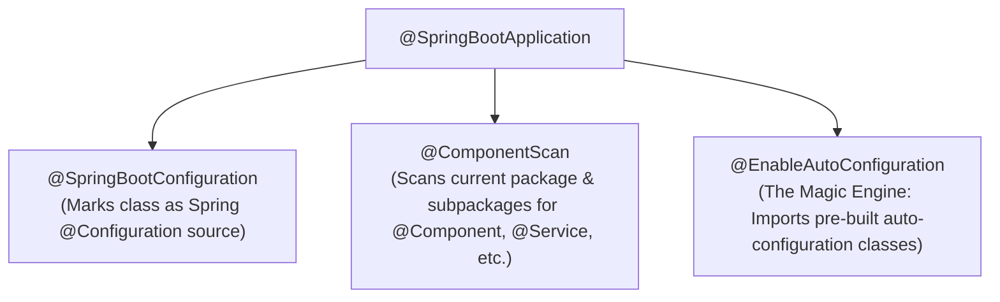
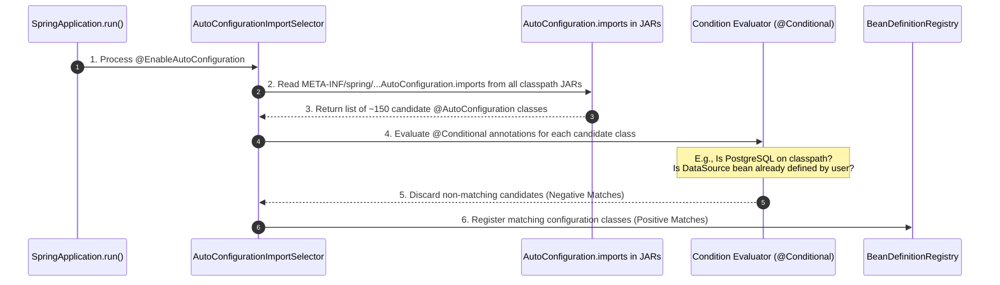
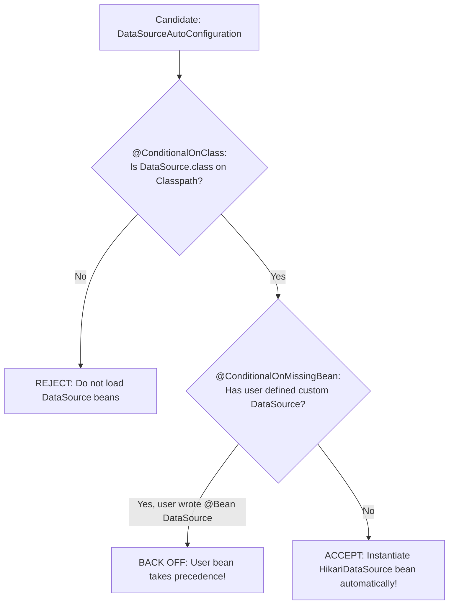

## Prerequisites: Before You Begin

Before exploring auto-configuration internals, ensure you understand:
- **Spring IoC & Classpath Scanning**: How `@ComponentScan` discovers beans by scanning base packages.
- **Java ClassLoaders & Reflection**: How the JVM loads classes from JAR files and checks `Class.forName()`.
- **`@Configuration` & `@Bean`**: How factory methods declare beans in Spring.

---

# Phase 1: Ground Floor (Physical First Principles)

## 1. What Makes Spring Boot "Spring Boot"?

Before Spring Boot existed (in standard Spring Framework 3 and 4), starting a Java web backend required thousands of lines of XML or verbose `@Configuration` classes:
- You had to manually configure a `DataSource` bean, a `HikariConfig` bean, and a `LocalContainerEntityManagerFactoryBean`.
- You had to manually configure Tomcat's `Connector`, `DispatcherServlet`, Jackson `ObjectMapper`, and transaction managers.
- If you forgot one single bean, the entire application failed with cryptic startup errors.

**Spring Boot was invented to eliminate this boilerplate using one foundational mechanism: Auto-Configuration.**

When you add `spring-boot-starter-data-jpa` and `postgresql` to your `pom.xml`, you do not write a single line of database connection code. Spring Boot detects PostgreSQL on the classpath, sees `spring.datasource.url` in your `application.yml`, and **automatically manufactures the `DataSource`, `EntityManagerFactory`, and `TransactionManager` beans for you.**

---

## 2. The Anatomy of `@SpringBootApplication`

Every Spring Boot application begins with this class:

```java
@SpringBootApplication
public class BackendApplication {
    public static void main(String[] args) {
        SpringApplication.run(BackendApplication.class, args);
    }
}
```

`@SpringBootApplication` is not a single annotation. It is a **meta-annotation** combining three distinct components:



1. **`@SpringBootConfiguration`**: A specialized variant of `@Configuration` that tags the class as a configuration source.
2. **`@ComponentScan`**: Instructs Spring to scan the current package and all child subpackages for `@Component`, `@Service`, `@Repository`, and `@RestController`.
3. **`@EnableAutoConfiguration`**: **The engine of Spring Boot.** It instructs Spring to scan external library JARs for auto-configuration classes and conditionally register beans.

---

## 3. How Auto-Configuration Loads: Spring Boot 3 `AutoConfiguration.imports`

In Spring Boot 1 and 2, auto-configuration classes were registered in `META-INF/spring.factories`.

**In Spring Boot 3 / Spring 6, `spring.factories` was replaced with a cleaner, high-performance file format:**

```console
META-INF/spring/org.springframework.boot.autoconfigure.AutoConfiguration.imports
```

When `SpringApplication.run()` boots up, the following physical sequence occurs:



Inside `spring-boot-autoconfigure-3.x.jar`, the file `org.springframework.boot.autoconfigure.AutoConfiguration.imports` contains a plain list of class names:

```text
org.springframework.boot.autoconfigure.jdbc.DataSourceAutoConfiguration
org.springframework.boot.autoconfigure.orm.jpa.HibernateJpaAutoConfiguration
org.springframework.boot.autoconfigure.jackson.JacksonAutoConfiguration
org.springframework.boot.autoconfigure.web.servlet.DispatcherServletAutoConfiguration
org.springframework.boot.autoconfigure.kafka.KafkaAutoConfiguration
... (150+ configuration classes)
```

Spring does **not** blindly instantiate all 150 configurations. If it did, your app would try to connect to Kafka, Redis, MongoDB, and RabbitMQ simultaneously!

Instead, every auto-configuration class is guarded by the **`@Conditional` family**.

---

# Phase 2: The `@Conditional` Family (How Spring Boot Decides)

Conditional annotations are the physical switches that turn auto-configuration classes on or off.



## 1. The Core Conditional Annotations

| Annotation | Meaning | Real Spring Boot Use Case |
| :--- | :--- | :--- |
| **`@ConditionalOnClass`** | Matches only if specified class bytecode is present on the classpath. | If `org.postgresql.Driver` is in `pom.xml`, configure PostgreSQL. |
| **`@ConditionalOnMissingClass`** | Matches only if specified class is **absent** from the classpath. | Fallback when a library is omitted. |
| **`@ConditionalOnBean`** | Matches only if a bean of specified type is already registered in the container. | Configure `JpaTransactionManager` only if `EntityManagerFactory` exists. |
| **`@ConditionalOnMissingBean`** | Matches only if **no user bean** of this type is registered. | **The Extensibility Golden Rule**: Spring provides a default bean, but steps aside if you define your own! |
| **`@ConditionalOnProperty`** | Matches based on environment property presence and value. | `feature.payments.enabled=true`. |
| **`@ConditionalOnWebApplication`** | Matches only if the app is a Servlet web app (Tomcat) or Reactive (Netty). | Configure `DispatcherServlet` only in Servlet web environments. |
| **`@ConditionalOnResource`** | Matches if a specific file exists on the classpath. | `classpath:schema.sql`. |

---

## 2. Deconstructing `DataSourceAutoConfiguration` Source Code

Here is how Spring Boot's real `DataSourceAutoConfiguration` is written:

```java
@AutoConfiguration
@ConditionalOnClass({ DataSource.class, EmbeddedDatabaseType.class })
@ConditionalOnMissingBean(type = "io.r2dbc.spi.ConnectionFactory")
@EnableConfigurationProperties(DataSourceProperties.class)
@Import({ DataSourcePoolMetadataProvidersConfiguration.class })
public class DataSourceAutoConfiguration {

    @Configuration(proxyBeanMethods = false)
    @Conditional(PooledDataSourceCondition.class)
    @ConditionalOnMissingBean({ DataSource.class, XADataSource.class })
    @Import({ 
        Hikari.class,          // 1. First choice: HikariCP
        Tomcat.class,          // 2. Second choice: Tomcat Pool
        Dbcp2.class,           // 3. Third choice: Commons DBCP2
        OracleUcp.class        // 4. Fourth choice: Oracle UCP
    })
    static class PooledDataSourceConfiguration {
        // Automatically picks HikariCP if com.zaxxer.hikari.HikariDataSource is on the classpath!
    }
}
```

### Line-by-Line Breakdown:
- `@AutoConfiguration`: Spring Boot 3 annotation declaring this class as an auto-configuration candidate with ordering semantics.
- `@ConditionalOnClass({ DataSource.class })`: If JDBC is not in your dependencies, the entire class is discarded in 1 nanosecond.
- `@ConditionalOnMissingBean({ DataSource.class })`: **The magic line.** If you write `@Bean public DataSource myDataSource()`, Spring Boot sees your bean and **completely skips its own auto-configuration!** Your custom bean wins with zero configuration collisions.

---

# Phase 3: The Naive Code & Production Catastrophes

---

## Catastrophe 1: The Greedy Custom Starter Bean Collision

A platform engineering team built an internal company starter `company-spring-boot-starter` to configure a shared auditing `AuditService`:

```java
// NAIVE CODE: DESTROYS DEVELOPER EXTENSIBILITY ACROSS THE ENTIRE COMPANY!
@Configuration
public class AuditAutoConfiguration {

    @Bean
    public AuditService auditService() {
        // Hardcoded to log to AWS CloudWatch
        return new CloudWatchAuditService();
    }
}
```

### Why Production Broke:
A development team needed to test locally without connecting to AWS CloudWatch. They defined their own mock bean:

```java
@Configuration
public class LocalTestConfig {
    @Bean
    public AuditService auditService() {
        return new ConsoleAuditService();
    }
}
```

**The Crash**: When the application started, Spring crashed with:
```console
A component required a bean of type 'AuditService' that could not be found, 
or: BeanDefinitionOverrideException: Invalid bean definition with name 'auditService' 
defined in class path resource: Bean definition overriding is disabled!
```

Because the starter omitted `@ConditionalOnMissingBean`, Spring attempted to register both beans under the same name, halting startup!

### The Production Fix: Always Use `@ConditionalOnMissingBean`

```java
@AutoConfiguration
public class AuditAutoConfiguration {

    @Bean
    @ConditionalOnMissingBean(AuditService.class) // BACKS OFF if user provides custom bean!
    public AuditService auditService() {
        return new CloudWatchAuditService();
    }
}
```

---

## Catastrophe 2: Debugging Auto-Configuration with the `--debug` Flag

When a bean is unexpectedly missing, or a starter fails to activate, junior engineers guess randomly and restart the server 20 times.

**The Staff Engineer Technique**: Pass `--debug` at startup:

```bash
java -jar app.jar --debug
```

Spring Boot outputs the **Condition Evaluation Report**:

```console
============================
CONDITIONS EVALUATION REPORT
============================

Positive matches: (Auto-configurations that ACTIVATED)
-----------------
   DataSourceAutoConfiguration matched:
      - @ConditionalOnClass found required class 'javax.sql.DataSource' (OnClassCondition)

   HibernateJpaAutoConfiguration matched:
      - @ConditionalOnClass found required class 'org.hibernate.SessionFactory' (OnClassCondition)


Negative matches: (Auto-configurations that were SKIPPED)
-----------------
   MongoDataAutoConfiguration:
      Did not match:
         - @ConditionalOnClass did not find required class 'com.mongodb.client.MongoClient' (OnClassCondition)

   RedisAutoConfiguration:
      Did not match:
         - @ConditionalOnClass did not find required class 'org.springframework.data.redis.core.RedisOperations'

Exclusions: (Auto-configurations explicitly disabled)
-----------
   None
```

In 2 seconds, you can see exactly why MongoDB was skipped (missing `MongoClient` class) and why PostgreSQL activated!

---

# Phase 4: Step-by-Step: Building a Production Custom Spring Boot Starter

Let's build a real-world production starter: `tenant-routing-spring-boot-starter`. It automatically detects tenant headers and routes traffic to tenant-specific databases.

### Starter Project Structure

Industry convention separates a starter into two modules:
1. `tenant-spring-boot-autoconfigure`: Contains configuration logic, properties, and beans.
2. `tenant-spring-boot-starter`: An empty "pom-only" aggregator that pulls in `autoconfigure` and required dependencies.

```bash
tenant-spring-boot-starter/
├── pom.xml
└── tenant-spring-boot-autoconfigure/
    ├── pom.xml
    └── src/main/
        ├── java/com/company/tenant/
        │   ├── TenantProperties.java
        │   ├── TenantRoutingFilter.java
        │   ├── TenantContext.java
        │   └── TenantAutoConfiguration.java
        └── resources/META-INF/spring/
            └── org.springframework.boot.autoconfigure.AutoConfiguration.imports
```

---

### Step 1: Configuration Properties Record

```java
package com.company.tenant;

import org.springframework.boot.context.properties.ConfigurationProperties;
import org.springframework.boot.context.properties.bind.DefaultValue;

@ConfigurationProperties(prefix = "multitenancy")
public record TenantProperties(
    @DefaultValue("true") boolean enabled,
    @DefaultValue("X-Tenant-Id") String headerName,
    @DefaultValue("public") String defaultTenant
) {}
```

---

### Step 2: The Service & Filter

```java
package com.company.tenant;

import jakarta.servlet.*;
import jakarta.servlet.http.HttpServletRequest;
import java.io.IOException;

public class TenantRoutingFilter implements Filter {

    private final TenantProperties properties;

    public TenantRoutingFilter(TenantProperties properties) {
        this.properties = properties;
    }

    @Override
    public void doFilter(ServletRequest request, ServletResponse response, FilterChain chain)
            throws IOException, ServletException {
        HttpServletRequest httpRequest = (HttpServletRequest) request;
        String tenantId = httpRequest.getHeader(properties.headerName());
        
        if (tenantId == null || tenantId.isBlank()) {
            tenantId = properties.defaultTenant();
        }

        try {
            TenantContext.setCurrentTenant(tenantId);
            chain.doFilter(request, response);
        } finally {
            TenantContext.clear(); // Prevent ThreadLocal memory leaks!
        }
    }
}
```

---

### Step 3: The `@AutoConfiguration` Class

```java
package com.company.tenant;

import org.springframework.boot.autoconfigure.AutoConfiguration;
import org.springframework.boot.autoconfigure.condition.ConditionalOnClass;
import org.springframework.boot.autoconfigure.condition.ConditionalOnMissingBean;
import org.springframework.boot.autoconfigure.condition.ConditionalOnProperty;
import org.springframework.boot.autoconfigure.condition.ConditionalOnWebApplication;
import org.springframework.boot.context.properties.EnableConfigurationProperties;
import org.springframework.context.annotation.Bean;

@AutoConfiguration // Spring Boot 3 auto-configuration marker
@ConditionalOnWebApplication(type = ConditionalOnWebApplication.Type.SERVLET)
@ConditionalOnClass(Filter.class)
@ConditionalOnProperty(prefix = "multitenancy", name = "enabled", havingValue = "true", matchIfMissing = true)
@EnableConfigurationProperties(TenantProperties.class)
public class TenantAutoConfiguration {

    @Bean
    @ConditionalOnMissingBean(TenantRoutingFilter.class) // Extensible: user can provide custom filter!
    public TenantRoutingFilter tenantRoutingFilter(TenantProperties properties) {
        return new TenantRoutingFilter(properties);
    }
}
```

---

### Step 4: Register in `AutoConfiguration.imports`

Create the file:
`src/main/resources/META-INF/spring/org.springframework.boot.autoconfigure.AutoConfiguration.imports`

Add the fully qualified class name:
```text
com.company.tenant.TenantAutoConfiguration
```

### How Any Spring Boot Service Uses It:
In any microservice `pom.xml`:
```xml
<dependency>
    <groupId>com.company</groupId>
    <artifactId>tenant-spring-boot-starter</artifactId>
    <version>1.0.0</version>
</dependency>
```

With zero configuration, `TenantRoutingFilter` is automatically registered in Tomcat's filter chain!

---

# Phase 5: Senior Interview Ace & Verification

## The Senior Engineer vs Junior Engineer Mindset

| Scenario | Junior Engineer Answer | Staff / Senior Engineer Answer |
| :--- | :--- | :--- |
| **How does Spring Boot Auto-Configuration work?** | "Spring Boot has magic starters that automatically configure everything so you don't have to write XML." | "`@SpringBootApplication` includes `@EnableAutoConfiguration`, which triggers `AutoConfigurationImportSelector`. In Spring Boot 3, it reads candidate classes from `META-INF/spring/org.springframework.boot.autoconfigure.AutoConfiguration.imports`. Each candidate class is evaluated against `@Conditional` annotations (`@ConditionalOnClass`, `@ConditionalOnMissingBean`). Only matching configurations instantiate beans, backing off if custom user beans already exist." |
| **What is the difference between `@Component` and `@AutoConfiguration`?** | "They both declare beans." | "`@Component` beans are discovered during `@ComponentScan` within the application's base package tree. `@AutoConfiguration` classes are stored in external library JARs and read exclusively through `AutoConfiguration.imports`. They execute after user configuration is loaded, allowing `@ConditionalOnMissingBean` checks to back off cleanly." |
| **How do you build a custom Spring Boot Starter?** | "You write a class with `@Service` and publish a JAR." | "A production starter consists of an autoconfigure module and an empty starter POM. The autoconfigure module declares `@ConfigurationProperties` records, an `@AutoConfiguration` class with strict `@ConditionalOnClass`, `@ConditionalOnMissingBean`, and `@ConditionalOnProperty` guards, and registers the class in `META-INF/spring/org.springframework.boot.autoconfigure.AutoConfiguration.imports`." |

---

## Active Recall & Interview Mastery

<AccordionGroup>
  <Accordion title="1. Explain the physical mechanism by which Spring Boot 3 discovers auto-configuration classes.">
    Spring Boot's `AutoConfigurationImportSelector` uses `SpringFactoriesLoader` to read the file `META-INF/spring/org.springframework.boot.autoconfigure.AutoConfiguration.imports` across all JARs on the classpath. This file contains fully qualified configuration class names. Spring instantiates metadata readers for each class and evaluates conditional annotations (`@ConditionalOnClass`, `@ConditionalOnMissingBean`). Matching classes are registered into the `BeanDefinitionRegistry` as auto-configuration sources.
  </Accordion>

  <Accordion title="2. Why did Spring Boot 3 replace META-INF/spring.factories with AutoConfiguration.imports?">
    In Spring Boot 1 and 2, `spring.factories` stored auto-configurations, property source loaders, and initializers in a shared properties file under the key `EnableAutoConfiguration`. As Spring grew to hundreds of starters, parsing this single multi-key file on startup introduced CPU and I/O overhead. Spring Boot 3 introduced dedicated line-by-line `.imports` files, enabling faster startup, native GraalVM AOT compilation compatibility, and clean modular isolation.
  </Accordion>

  <Accordion title="3. What is the crucial role of @ConditionalOnMissingBean in production starters?">
    `@ConditionalOnMissingBean` guarantees that Spring Boot's default auto-configured beans act solely as sensible fallbacks. If an application developer registers their own custom `@Bean` of that type anywhere in their application, the auto-configuration condition evaluates to `false` and skips bean creation. This eliminates bean name collisions (`BeanDefinitionOverrideException`) and allows developers to override default framework behavior without disabling entire auto-configurations.
  </Accordion>

  <Accordion title="4. How does @ConditionalOnClass physically verify class presence without ClassNotFoundException?">
    Spring uses ASM bytecode reading (`SimpleMetadataReader`) rather than Java's default `Class.forName()` loading. It inspects the constant pool of compiled `.class` files to verify whether referenced classes exist on the class loader path. If a class is missing, the condition returns `false` without triggering a JVM `ClassNotFoundException` or `NoClassDefFoundError`.
  </Accordion>

  <Accordion title="5. How do you control the execution order of multiple AutoConfiguration classes?">
    Auto-configuration classes run after user-defined configuration. To order auto-configurations relative to one another, use the attributes on `@AutoConfiguration`:
    - `@AutoConfiguration(before = DataSourceAutoConfiguration.class)`
    - `@AutoConfiguration(after = SecurityAutoConfiguration.class)`
    Alternatively, use `@AutoConfigureOrder(Ordered.HIGHEST_PRECEDENCE)`.
  </Accordion>

  <Accordion title="6. How do you triage why an auto-configuration did not activate in production?">
    Start the application with the `--debug` flag: `java -jar app.jar --debug`. Spring Boot generates an exhaustive **Conditions Evaluation Report** at startup, categorizing configurations into **Positive matches** (activated with specific reasons) and **Negative matches** (skipped, with explicit details showing which `@Conditional` check failed, such as a missing class or property).
  </Accordion>

  <Accordion title="7. What is the difference between @ConditionalOnProperty matchIfMissing = true vs false?">
    When `matchIfMissing = true`, the condition evaluates to `true` if the property is completely absent from `application.yml` and environment variables. This makes the feature enabled by default unless explicitly disabled (`feature.enabled=false`). When `matchIfMissing = false` (default), the property must be explicitly present and match the specified `havingValue` for the configuration to activate.
  </Accordion>

  <Accordion title="8. How do you completely exclude a specific auto-configuration class?">
    You can exclude auto-configurations via:
    1. Annotation: `@SpringBootApplication(exclude = { DataSourceAutoConfiguration.class })`
    2. Configuration property: `spring.autoconfigure.exclude=org.springframework.boot.autoconfigure.jdbc.DataSourceAutoConfiguration`
    This prevents `AutoConfigurationImportSelector` from evaluating or registering the target configuration.
  </Accordion>
</AccordionGroup>

---

## Done Checklist

<Check>
- [ ] Understand the 3 annotations combined inside `@SpringBootApplication`.
- [ ] Explain the discovery role of `AutoConfigurationImportSelector`.
- [ ] Locate auto-configurations in `META-INF/spring/org.springframework.boot.autoconfigure.AutoConfiguration.imports`.
- [ ] Differentiate Spring Boot 3 `.imports` files from legacy Spring Boot 2 `spring.factories`.
- [ ] Master the `@Conditional` family (`@ConditionalOnClass`, `@ConditionalOnMissingBean`, `@ConditionalOnProperty`).
- [ ] Enforce `@ConditionalOnMissingBean` on all custom starter factory methods.
- [ ] Inspect and interpret the Conditions Evaluation Report using the `--debug` flag.
- [ ] Build a custom Spring Boot Starter separated into `autoconfigure` and starter POM modules.
- [ ] Bind starter configuration properties using immutable `@ConfigurationProperties` records.
- [ ] Register custom auto-configurations in `AutoConfiguration.imports`.
- [ ] Control auto-configuration sequence using `@AutoConfiguration(before = ..., after = ...)`.
- [ ] Safely exclude unwanted auto-configurations using `spring.autoconfigure.exclude`.
- [ ] Prevent ThreadLocal context leaks in starter servlet filters using `try-finally` cleanup.
- [ ] Verify that custom starters step aside when user applications provide custom `@Bean` definitions.
- [ ] Write integration tests for custom starters using `ApplicationContextRunner`.
</Check>
