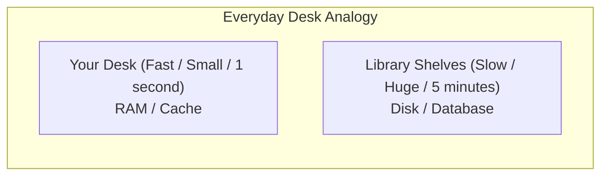
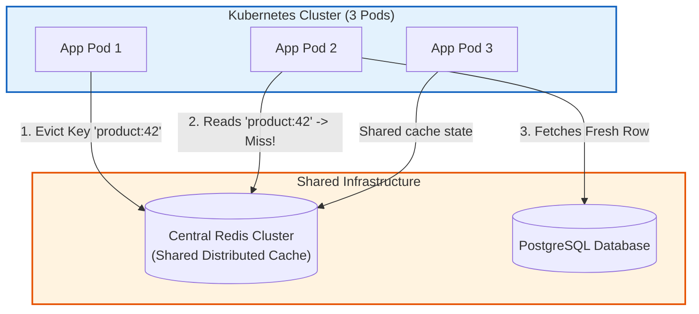
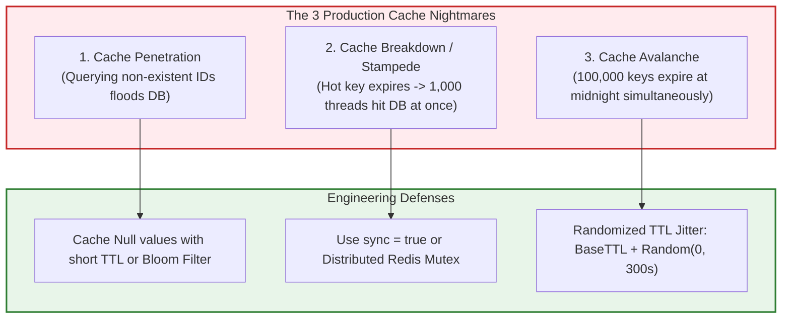

## 1. What is Caching? (The Real-Life Mental Model)

Before looking at annotations or databases, think about how you work at a desk in real life:

Imagine you are studying in a library.
- On your **desk**, you have a notebook open right in front of you. Reaching for a page takes **1 second**.
- If a book is not on your desk, you must stand up, walk down the hallway, search through the shelves, and bring the book back. That takes **5 minutes**.

Your **desk** is a **Cache**. The **library shelves** are the **Database**.



In computer software:
- **System RAM (Memory)** is your desk. Reading data from RAM takes **100 nanoseconds** (almost instantaneous).
- **PostgreSQL / MySQL on a Hard Drive (Disk)** is the library shelf. Fetching data from a disk over a network socket takes **5 to 20 milliseconds**—about **10,000 times slower**.

**Caching simply means**: The first time you read data from the slow database, you keep a copy on your fast desk (in memory). The next time someone asks for that exact same data, you hand it to them directly from memory without touching the database!

---

## 2. How Would You Build a Cache in Plain Java? (The Naive Way)

To demystify Spring's `@Cacheable`, look at how you would write a cache yourself in basic Java without any framework.

You would probably use a `HashMap`:

```java
public class SimpleProductService {

    private final ProductRepository productRepository;
    
    // A simple in-memory cache: Product ID -> Product Object
    private final Map<Long, Product> cache = new HashMap<>();

    public SimpleProductService(ProductRepository productRepository) {
        this.productRepository = productRepository;
    }

    public Product getProduct(Long id) {
        // Step 1: Check if we already have it on our desk (in the cache)
        if (cache.containsKey(id)) {
            System.out.println("Returning from fast RAM cache!");
            return cache.get(id);
        }

        // Step 2: Not in cache! Walk to the library (query the slow database)
        System.out.println("Cache miss! Querying slow database...");
        Product product = productRepository.findById(id);

        // Step 3: Put a copy on our desk for next time
        if (product != null) {
            cache.put(id, product);
        }

        return product;
    }
}
```

### Why Can't We Just Use a Plain `HashMap` in Production?

Writing that manual `if (cache.containsKey)` code works for a beginner project, but it breaks down quickly:

1. **Memory Leak (No Eviction)**:
   A plain `HashMap` grows forever. If your store has 1,000,000 products, your cache will store all 1,000,000 objects in RAM until your server crashes with `java.lang.OutOfMemoryError`. Real caches need an **eviction policy** (e.g. *"Only keep the 1,000 most recently viewed items, discard the rest"*).
2. **Not Thread-Safe**:
   In a web server, 100 users hit this method at the same millisecond. Multiple threads modifying a standard `HashMap` simultaneously causes data corruption and infinite CPU loops.
3. **Repetitive Boilerplate**:
   If you have 40 different service methods (users, orders, products, prices), you would have to copy and paste that `if/else` logic 40 times.

**This is why Spring Caching exists.** Spring lets you write your normal database query and put **`@Cacheable`** on top. Spring writes all that checking, storing, and evicting code for you automatically!

---

## 3. What is Redis? (Plain English)

Many beginners hear "Redis" and think it is a complicated database like PostgreSQL.

**In plain English: Redis is just a giant, super-fast `HashMap` running as its own server in memory.**

- In PostgreSQL, data is organized into tables, rows, columns, and foreign keys, stored permanently on disk.
- In Redis, data is just **Keys and Values** (like `SET "user:42" "Alice"`, `GET "user:42"`), stored entirely in computer RAM.

Because Redis holds everything in RAM, it can process **100,000 requests per second** with response times under 1 millisecond.

### When do you use In-Memory (Caffeine) vs. Redis?

- **Local Cache (Caffeine / JVM Memory)**: The cache lives directly inside your Java application's RAM. It is the fastest possible cache (0 network latency), but if you restart your app or run 5 pods behind a load balancer, each pod has its own separate memory.
- **Distributed Cache (Redis)**: Redis runs as a separate standalone server. All your application pods connect to the same Redis instance over the network, so if Pod 1 updates a value, Pod 2 immediately sees the update!

---

## 4. Spring Caching Architecture: How `@Cacheable` Actually Works

When you add `@EnableCaching` to your Spring Boot project, Spring creates an **AOP Interceptor Proxy** around your cached beans.

```mermaid
flowchart TD
    Client["Client / Controller"] -->|Calls productService.findById(42)| Proxy["Spring CGLIB Proxy (CacheInterceptor)"]
    Proxy -->|1. Check Cache Key: 'products:42'| CacheStore{"Key in Cache?"}
    CacheStore -->|Cache Hit (Fast)| ReturnCached["Return cached ProductDto from RAM (0ms DB query)"]
    ReturnCached --> Client
    
    CacheStore -->|Cache Miss| RealMethod["2. Execute Real Method<br/>productRepository.findById(42)"]
    RealMethod --> DB[(PostgreSQL Database)]
    DB --> RealMethod
    RealMethod --> SaveCache["3. Write result into Cache"]
    SaveCache --> Client

    style Proxy fill:#e3f2fd,stroke:#1565c0,stroke-width:2px;
    style ReturnCached fill:#e8f5e9,stroke:#2e7d32,stroke-width:2px;
    style RealMethod fill:#fff3e0,stroke:#e65100,stroke-width:2px;
```

    style Proxy fill:#e3f2fd,stroke:#1565c0,stroke-width:2px;
    style ReturnCached fill:#e8f5e9,stroke:#2e7d32,stroke-width:2px;
    style RealMethod fill:#fff3e0,stroke:#e65100,stroke-width:2px;
```

### The Core Caching Annotations

| Annotation | When It Runs | What It Does | Common Real-World Use Case |
| :--- | :--- | :--- | :--- |
| `@EnableCaching` | Application Startup | Enables Spring's caching interceptor proxy infrastructure. | Placed on `@Configuration` or `@SpringBootApplication`. |
| `@Cacheable` | **Before** Method Execution | Checks cache. If found, **skips** method execution and returns cached value. If miss, executes method and stores result. | `findById(id)`, `getUserProfile(id)`. |
| `@CachePut` | **After** Method Execution | **Always** executes method, then updates the cache with the method's return value. | `updateProduct(id, dto)` to keep cache fresh without eviction. |
| `@CacheEvict` | Before or After Method | Removes one or all entries from the cache. | `deleteProduct(id)`, or `allEntries = true` on bulk updates. |
| `@Caching` | Compound | Groups multiple caching rules together (e.g. evicting from two different caches on update). | Cross-cutting entity cache invalidation. |

### The Self-Invocation Cache Trap

<Warning>
**The #1 Caching Bug in Spring**:
Just like `@Transactional` and `@Async`, calling a `@Cacheable` method from another method inside the **same class** bypasses the cache completely!
</Warning>

Look at this broken code:

```java
@Service
public class ProductService {

    public ProductDto getProductWithDiscount(Long id) {
        // BUG: Calling this.findById(id) directly!
        // This is a direct memory call inside the JVM. It BYPASSES the CGLIB proxy!
        // The cache is NEVER checked!
        ProductDto product = findById(id);
        return applyDiscount(product);
    }

    @Cacheable(value = "products", key = "#id")
    public ProductDto findById(Long id) {
        // Hits database every single time when called from getProductWithDiscount!
        return productRepository.findById(id)
                .map(this::toDto)
                .orElseThrow();
    }
}
```

**Why This Happens**:
Spring generates a dynamic CGLIB subclass proxy that intercepts calls coming from *outside* the bean. When `getProductWithDiscount()` calls `findById()`, Java resolves it using the internal `this` pointer, completely bypassing the Spring proxy!

**The Fix**:
Move the cached lookup into a dedicated repository/collaborator bean, or inject `self` (or use `ApplicationContext`).

---

## 3. In-Memory Caching with Caffeine (Local L1 Cache)

For single-instance applications or read-heavy reference data (e.g., country codes, tax rates, tenant configs) that rarely change, an in-memory JVM cache is the fastest possible solution.

**Caffeine** is the highest-performance, near-optimal caching library for Java, utilizing the **Window TinyLFU** admission and eviction algorithm.

### Maven Dependency
```xml
<dependency>
    <groupId>com.github.ben-manes.caffeine</groupId>
    <artifactId>caffeine</artifactId>
</dependency>
<dependency>
    <groupId>org.springframework.boot</groupId>
    <artifactId>spring-boot-starter-cache</artifactId>
</dependency>
```

### Caffeine Configuration

```java
package com.backend.mastery.config;

import com.github.benmanes.caffeine.cache.Caffeine;
import org.springframework.cache.CacheManager;
import org.springframework.cache.annotation.EnableCaching;
import org.springframework.cache.caffeine.CaffeineCacheManager;
import org.springframework.context.annotation.Bean;
import org.springframework.context.annotation.Configuration;

import java.time.Duration;
import java.util.List;

@Configuration
@EnableCaching
public class CaffeineCacheConfig {

    @Bean
    public CacheManager cacheManager() {
        CaffeineCacheManager manager = new CaffeineCacheManager();
        
        // Register predefined cache names
        manager.setCacheNames(List.of("reference-data", "tax-rates"));
        
        // Configure Caffeine builder
        manager.setCaffeine(Caffeine.newBuilder()
                // Maximum number of entries in JVM heap memory
                .maximumSize(5_000)
                // Evict entries 15 minutes after write
                .expireAfterWrite(Duration.ofMinutes(15))
                // Record cache hit/miss statistics for Actuator / Micrometer
                .recordStats());

        return manager;
    }
}
```

### The Multi-Pod Inconsistency Hazard

<Warning>
**When NOT to Use Local JVM Caching**:
If your application runs as 10 pods behind a Kubernetes load balancer, each pod has its own separate JVM memory.
</Warning>

Imagine this sequence:
1. User updates product price on Pod 1.
2. Pod 1 updates the database and evicts its local Caffeine cache.
3. User refreshes their browser. Load balancer routes request to **Pod 2**.
4. Pod 2 still has the **old price** cached in its local JVM memory!
5. The customer sees the old price, while another customer on Pod 1 sees the new price.

**Conclusion**: For distributed multi-pod microservices where data must be consistent across the cluster, you must use a **distributed cache like Redis**!

---

## 4. Distributed Caching with Redis (L2 Cache)

Redis is an in-memory, network-accessible data store. All pods in your cluster connect to the same Redis instance (or Redis Cluster), guaranteeing that if Pod 1 invalidates a key, Pod 2 immediately sees the eviction.



### Maven Dependency
```xml
<dependency>
    <groupId>org.springframework.boot</groupId>
    <artifactId>spring-boot-starter-data-redis</artifactId>
</dependency>
<dependency>
    <groupId>org.apache.commons</groupId>
    <artifactId>commons-pool2</artifactId> <!-- Required for Lettuce connection pooling -->
</dependency>
```

### The Serialization Hazard: JSON vs Java Binary

By default, Spring's Redis template uses `JdkSerializationRedisSerializer`. 
- **The Disaster**: It stores raw Java binary bytecode. You cannot read the values inside `redis-cli`, it introduces severe security vulnerabilities (Java deserialization attacks), and if you change any class field in a new deploy, all existing cached entries throw `InvalidClassException`!

**Production Standard**: Always configure Redis to serialize domain objects as clean, human-readable **JSON** with an explicit `ObjectMapper`:

```java
package com.backend.mastery.config;

import com.fasterxml.jackson.annotation.JsonTypeInfo;
import com.fasterxml.jackson.databind.ObjectMapper;
import com.fasterxml.jackson.databind.jsontype.impl.LaissezFaireSubTypeValidator;
import com.fasterxml.jackson.datatype.jsr310.JavaTimeModule;
import org.springframework.boot.autoconfigure.cache.RedisCacheManagerBuilderCustomizer;
import org.springframework.cache.annotation.EnableCaching;
import org.springframework.context.annotation.Bean;
import org.springframework.context.annotation.Configuration;
import org.springframework.data.redis.cache.RedisCacheConfiguration;
import org.springframework.data.redis.serializer.GenericJackson2JsonRedisSerializer;
import org.springframework.data.redis.serializer.RedisSerializationContext.SerializationPair;
import org.springframework.data.redis.serializer.StringRedisSerializer;

import java.time.Duration;

@Configuration
@EnableCaching
public class RedisCacheConfig {

    @Bean
    public RedisCacheConfiguration defaultCacheConfiguration() {
        // Build an ObjectMapper capable of serializing Java 21 dates and class types
        ObjectMapper mapper = new ObjectMapper();
        mapper.registerModule(new JavaTimeModule());
        mapper.activateDefaultTyping(
                LaissezFaireSubTypeValidator.instance,
                ObjectMapper.DefaultTyping.NON_FINAL,
                JsonTypeInfo.As.PROPERTY
        );

        GenericJackson2JsonRedisSerializer jsonSerializer = new GenericJackson2JsonRedisSerializer(mapper);

        return RedisCacheConfiguration.defaultCacheConfig()
                // Default TTL: 1 hour
                .entryTtl(Duration.ofHours(1))
                // Do not cache null values (avoids memory pollution)
                .disableCachingNullValues()
                // Serialize keys as readable Strings (e.g. "products::42")
                .serializeKeysWith(SerializationPair.fromSerializer(new StringRedisSerializer()))
                // Serialize values as JSON
                .serializeValuesWith(SerializationPair.fromSerializer(jsonSerializer));
    }

    @Bean
    public RedisCacheManagerBuilderCustomizer redisCacheManagerBuilderCustomizer(RedisCacheConfiguration defaultConfig) {
        return builder -> builder
                // Specific TTL for high-turnover data (e.g. 5 minutes for inventory stock)
                .withCacheConfiguration("inventory", defaultConfig.entryTtl(Duration.ofMinutes(5)))
                // Longer TTL for catalog items (e.g. 24 hours)
                .withCacheConfiguration("catalog", defaultConfig.entryTtl(Duration.ofHours(24)));
    }
}
```

### Production `application.yml` for Lettuce Connection Pooling

```yaml
spring:
  data:
    redis:
      host: localhost
      port: 6379
      timeout: 2000ms # Socket read timeout
      connect-timeout: 1000ms # TCP handshake timeout
      lettuce:
        pool:
          max-active: 32 # Maximum concurrent connections
          max-idle: 16
          min-idle: 8
          max-wait: 500ms # Fail fast if pool is exhausted
```

---

## 5. The 3 Classic Production Cache Disasters & Defenses

When you put a cache into production, three failure modes can take down your entire architecture:



### Disaster 1: Cache Penetration
- **Symptom**: An attacker sends requests for random non-existent IDs (`/api/products/-999`, `/api/products/random-uuid`).
- **Failure**: Because the ID doesn't exist in Redis, it misses. The request hits PostgreSQL. PostgreSQL finds nothing and returns null. Nothing gets cached in Redis. The attacker repeats this 50,000 times/second, completely crashing PostgreSQL.
- **Defense**:
  1. Cache `null` values with a very short TTL (e.g. 60 seconds).
  2. Use a **Bloom Filter** at the API gateway to reject requests for keys that have never existed.

### Disaster 2: Cache Breakdown / Stampede (Thundering Herd)
- **Symptom**: A single hot key (e.g., iPhone launch product page) is requested 2,000 times per second. Suddenly, its TTL expires.
- **Failure**: At millisecond $T_0$, 2,000 concurrent threads check Redis. All 2,000 find a cache miss. All 2,000 threads fire the exact same expensive SQL query to PostgreSQL simultaneously, exhausting the HikariCP connection pool!
- **Defense**: Use `@Cacheable(sync = true)`!

```java
// sync = true tells Spring: Synchronize threads locally!
// Only 1 thread is allowed to query the database; other 1,999 threads wait for the result!
@Cacheable(value = "catalog", key = "#sku", sync = true)
public ProductDto getProductBySku(String sku) {
    return productRepository.findBySku(sku)
            .map(this::toDto)
            .orElseThrow();
}
```

### Disaster 3: Cache Avalanche
- **Symptom**: You populate your cache with 500,000 product records at 2:00 AM, setting a uniform TTL of 6 hours.
- **Failure**: At exactly 8:00 AM (peak morning customer traffic), all 500,000 keys expire at the exact same second. Suddenly, 100% of user requests hit PostgreSQL at once. The database crashes under the massive shockwave.
- **Defense**: Add **TTL Jitter** (random variance):

```java
// Add random jitter: 60 minutes + random(0, 10) minutes
public Duration calculateJitteredTtl(Duration baseTtl) {
    long jitterSeconds = ThreadLocalRandom.current().nextLong(0, 600); // 0 to 10 minutes
    return baseTtl.plusSeconds(jitterSeconds);
}
```

---

## 6. Complete Production Implementation: Clean Cache-Aside Pattern

Here is a production service implementing the Cache-Aside pattern with updates and clean invalidation:

```java
package com.backend.mastery.product;

import org.slf4j.Logger;
import org.slf4j.LoggerFactory;
import org.springframework.cache.annotation.CacheEvict;
import org.springframework.cache.annotation.CachePut;
import org.springframework.cache.annotation.Cacheable;
import org.springframework.stereotype.Service;
import org.springframework.transaction.annotation.Transactional;

@Service
public class ProductCatalogService {

    private static final Logger log = LoggerFactory.getLogger(ProductCatalogService.class);
    private final ProductRepository productRepository;

    public ProductCatalogService(ProductRepository productRepository) {
        this.productRepository = productRepository;
    }

    /**
     * Cache-Aside Read:
     * Checks Redis under key 'catalog::productId'.
     * sync = true prevents cache stampede when hot key expires.
     */
    @Cacheable(value = "catalog", key = "#productId", sync = true)
    @Transactional(readOnly = true)
    public ProductDto getProductById(Long productId) {
        log.info("Cache MISS for product {}. Querying PostgreSQL...", productId);
        return productRepository.findById(productId)
                .map(this::mapToDto)
                .orElseThrow(() -> new ResourceNotFoundException("Product not found: " + productId));
    }

    /**
     * Cache Update:
     * Saves changes to DB, then automatically updates the Redis cache with the return value.
     */
    @CachePut(value = "catalog", key = "#productId")
    @Transactional
    public ProductDto updateProductPrice(Long productId, UpdatePriceCommand command) {
        ProductEntity entity = productRepository.findById(productId)
                .orElseThrow(() -> new ResourceNotFoundException("Product not found: " + productId));

        entity.setPrice(command.newPrice());
        ProductEntity saved = productRepository.save(entity);
        log.info("Updated product {} in DB and refreshed Redis cache.", productId);
        return mapToDto(saved);
    }

    /**
     * Cache Eviction:
     * Deletes row from DB and removes entry from Redis.
     */
    @CacheEvict(value = "catalog", key = "#productId")
    @Transactional
    public void deleteProduct(Long productId) {
        productRepository.deleteById(productId);
        log.info("Deleted product {} from DB and evicted from Redis.", productId);
    }

    private ProductDto mapToDto(ProductEntity entity) {
        return new ProductDto(entity.getId(), entity.getName(), entity.getPrice(), entity.getSku());
    }
}
```

---

## 7. Active Recall & Interview Drills

<CardGroup cols={2}>
  <Card title="1. Cache-Aside Pattern" icon="question">
    What is the exact sequence of events in the Cache-Aside read pattern? What happens on a cache hit vs a cache miss?
  </Card>
  <Card title="2. The Self-Invocation Trap" icon="question">
    Why does calling a `@Cacheable` method from another method inside the same `@Service` class fail to use the cache?
  </Card>
  <Card title="3. Multi-Pod Caffeine Drift" icon="question">
    Why is using an in-memory Caffeine cache dangerous across 10 Kubernetes pods for mutable data?
  </Card>
  <Card title="4. Cache Stampede & sync = true" icon="question">
    What physical problem does `@Cacheable(sync = true)` solve when a high-traffic hot key expires in Redis?
  </Card>
  <Card title="5. Cache Penetration Defense" icon="question">
    How do you protect your database from an attacker requesting 100,000 non-existent entity IDs per minute?
  </Card>
  <Card title="6. Cache Avalanche & Jitter" icon="question">
    Why does setting an identical TTL of 1 hour on 500,000 product keys create a catastrophic failure at minute 60?
  </Card>
  <Card title="7. Redis Serialization" icon="question">
    Why should you replace `JdkSerializationRedisSerializer` with `GenericJackson2JsonRedisSerializer` in production?
  </Card>
  <Card title="8. @CachePut vs @Cacheable" icon="question">
    What is the critical operational difference between `@Cacheable` and `@CachePut`? When does the underlying method run?
  </Card>
</CardGroup>

---

## 8. Done Checklist

<Check>
- [ ] Understand the storage latency hierarchy (CPU Cache -> RAM -> Redis network -> Database SSD).
- [ ] Mastered how Spring's CGLIB proxy intercepts `@Cacheable` method invocations.
- [ ] Eliminated the self-invocation trap by calling cached methods through separate collaborator beans.
- [ ] Configured local in-memory caching with Caffeine for immutable reference data.
- [ ] Understood the multi-pod inconsistency risk of using in-memory caches across distributed Kubernetes pods.
- [ ] Connected Spring Boot to Redis using `spring-boot-starter-data-redis` and Lettuce connection pooling.
- [ ] Replaced vulnerable default Java binary serialization with clean, human-readable JSON serialization.
- [ ] Configured differentiated TTLs per cache name (`catalog: 24h`, `inventory: 5m`).
- [ ] Defended against Cache Penetration by caching null values with short TTLs or implementing Bloom filters.
- [ ] Defended against Cache Stampede (Thundering Herd) using `@Cacheable(sync = true)`.
- [ ] Defended against Cache Avalanche by applying randomized TTL jitter to bulk cache warmups.
- [ ] Implemented the complete Cache-Aside lifecycle with `@Cacheable`, `@CachePut`, and `@CacheEvict`.
- [ ] Monitored cache hit rates and evictions via Micrometer metrics and `/actuator/metrics/cache.gets`.
- [ ] Tested cache miss and cache hit behavior using MockMvc and real Redis test containers.
- [ ] Answered all 8 Active Recall interview questions cleanly.
</Check>
