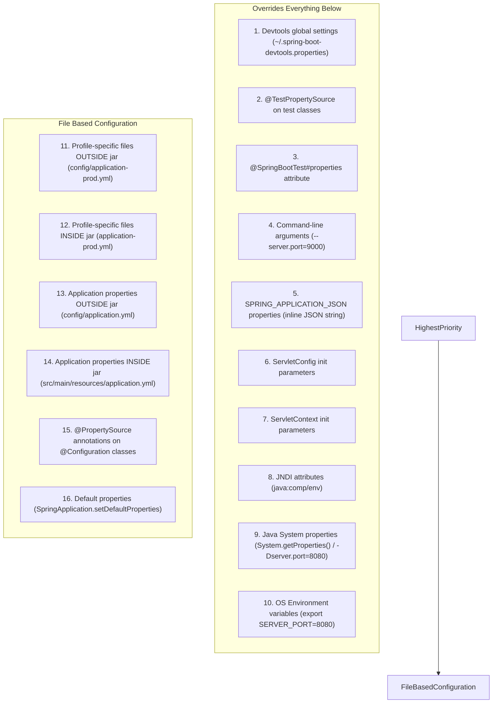
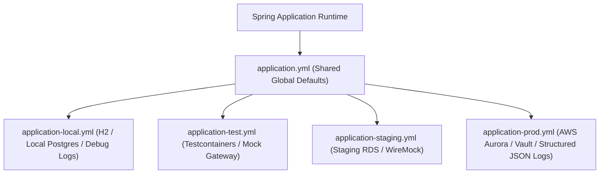

# Configuration Architecture, Profiles & Secret Management

In production backends, building separate JAR binaries for development, staging, and production environments violates the core tenets of modern cloud architecture.

According to **Factor III of The Twelve-Factor App methodology**, application code and configuration must be strictly separated. Your compiled JAR artifact should be built exactly once by CI/CD, and subsequently promoted across environments solely by varying externalized configuration.

Improper configuration architecture leads to severe production hazards: hardcoded credentials leaked into public GitHub repos, missing database passwords that crash containers during peak traffic, and subtle environment discrepancies where code works in staging but fails in production.

This guide provides an exhaustive, production-grade manual for Spring Boot 3 configuration management, Java 21 immutable record properties, profile groups, and secure secret injection.

---

## The 17-Level Order of Precedence

When the same configuration property (e.g., `server.port`) is defined in multiple sources, Spring Boot resolves the value using a strictly defined, 17-level order of precedence.
Values higher in the hierarchy **always overwrite** values lower in the hierarchy:



### Key Architectural Rules of Precedence
1. **OS Environment Variables (Level 10) override packaged files (Levels 12-14)**: This allows container orchestrators (Kubernetes, Docker, AWS ECS) to inject database credentials and secrets without rebuilding the image.
2. **Command-Line Arguments (Level 4) override Environment Variables**: Allows operators to execute one-off maintenance runs:
   ```bash
   java -jar app.jar --spring.profiles.active=migration --flyway.clean-disabled=false
   ```
3. **External config directories take precedence over packaged files**: If a Kubernetes ConfigMap mounts a file at `/app/config/application.yml`, it overrides the internal `src/main/resources/application.yml`.

---

## Relaxed Binding Rules

Spring Boot uses **Relaxed Binding** to map configuration names from environment variables, system properties, and YAML files into Java properties:

| Source | Syntax Format | Example Property |
| :--- | :--- | :--- |
| **YAML / Properties File** | kebab-case (Canonical) | `app.payment-gateway.timeout-ms: 5000` |
| **System Properties (-D)** | camelCase or kebab-case | `-Dapp.paymentGateway.timeoutMs=5000` |
| **OS Environment Variables** | UPPER_SNAKE_CASE | `APP_PAYMENTGATEWAY_TIMEOUTMS=5000` |

### Environment Variable Conversion Rules
1. Replace dots (`.`) with underscores (`_`).
2. Remove hyphens (`-`).
3. Convert all characters to uppercase.
4. For array indices, replace brackets `[0]` with underscores:
   `app.servers[0].url` becomes `APP_SERVERS_0_URL`.

---

## Immutable Configuration with Java 21 Records

Scattering `@Value("${my.property}")` annotations across service classes creates brittle, untyped applications with zero compile-time or startup-time validation.

In modern Spring Boot 3, **always use immutable Java 21 Records** combined with `@ConfigurationProperties` and Jakarta Bean Validation:

```java
package com.example.demo.config;

import jakarta.validation.Valid;
import jakarta.validation.constraints.NotBlank;
import jakarta.validation.constraints.NotNull;
import jakarta.validation.constraints.Positive;
import org.hibernate.validator.constraints.time.DurationMin;
import org.springframework.boot.context.properties.ConfigurationProperties;
import org.springframework.validation.annotation.Validated;

import java.net.URI;
import java.time.Duration;
import java.util.List;
import java.util.Map;

@ConfigurationProperties(prefix = "app")
@Validated // Enforces bean validation at application startup!
public record ApplicationProperties(
    @NotNull @Valid SecurityProperties security,
    @NotNull @Valid PaymentProperties payment,
    List<String> allowedOrigins,
    Map<String, FeatureFlag> features
) {

    public record SecurityProperties(
        @NotBlank String jwtSecret,
        @DurationMin(minutes = 5) Duration tokenExpiry,
        @NotBlank String issuer
    ) {}

    public record PaymentProperties(
        @NotNull URI gatewayUrl,
        @Positive int maxRetries,
        @NotNull Duration connectionTimeout,
        @NotNull Duration readTimeout
    ) {}

    public record FeatureFlag(
        boolean enabled,
        double rolloutPercentage
    ) {}
}
```

### Enabling Property Scanning
Enable automatic discovery in your main Spring Boot class:

```java
@SpringBootApplication
@ConfigurationPropertiesScan // Automatically discovers and binds all @ConfigurationProperties records
public class BackendApplication {
    public static void main(String[] args) {
        SpringApplication.run(BackendApplication.class, args);
    }
}
```

### Corresponding YAML Configuration
```yaml
app:
  allowed-origins:
    - "https://app.store.com"
    - "https://admin.store.com"
  security:
    jwt-secret: ${JWT_SECRET:default-insecure-dev-secret-only}
    token-expiry: 15m # Spring automatically coerces human-readable duration strings!
    issuer: "store-auth-server"
  payment:
    gateway-url: "https://api.stripe.com/v1"
    max-retries: 3
    connection-timeout: 2000ms
    read-timeout: 5000ms
  features:
    instant-checkout:
      enabled: true
      rollout-percentage: 25.0
```

<Tip>
**Fail-Fast Startup Validation**:
If an operator deploys the application with a missing `jwt-secret` or negative `max-retries`, the application throws a `ConfigurationPropertiesBindException` and terminates **before** opening the HTTP port, preventing broken services from entering the Kubernetes load balancer.
</Tip>

---

## Profile Architecture & Profile Groups

Profiles allow an application to segregate beans and configuration per environment:



### Profile Activation Rules
```bash
# Via Command Line
java -jar app.jar --spring.profiles.active=prod

# Via Environment Variable
export SPRING_PROFILES_ACTIVE=prod,aws
```

### Profile Groups in Spring Boot 3
Instead of activating dozens of individual profiles manually, define **Profile Groups** in `application.yml` to bundle modular capabilities:

```yaml
# application.yml
spring:
  profiles:
    group:
      local-dev:
        - local-db
        - mock-email
        - verbose-logging
      production:
        - prod-aurora
        - aws-ses
        - structured-json-logs
        - datadog-metrics
```

When you activate `--spring.profiles.active=production`, Spring automatically activates all 4 member profiles simultaneously.

### Programmatic & Conditional Bean Loading with `@Profile`

```java
@Configuration
public class GatewayConfiguration {

    @Bean
    @Profile("production")
    public PaymentClient realStripeClient(ApplicationProperties props) {
        return new RealStripePaymentClient(props.payment());
    }

    @Bean
    @Profile("!production") // Activates in all non-production environments
    public PaymentClient mockPaymentClient() {
        return new MockPaymentClient();
    }
}
```

---

## Spring Config Data API (`spring.config.import`)

Introduced in Spring Boot 2.4 and refined in Spring Boot 3, `spring.config.import` provides a unified syntax to import external files, directories, and configuration servers:

```yaml
spring:
  config:
    import:
      # 1. Import external directory of secrets (e.g. Kubernetes secret volume)
      - "optional:configtree:/etc/secrets/"
      # 2. Import external file outside JAR
      - "optional:file:/etc/config/custom-routing.yml"
      # 3. Import from Spring Cloud Config Server
      - "optional:configserver:https://config.corp.internal"
```

The `optional:` prefix guarantees that if the target file or directory is missing in local development, the application starts normally without crashing.

---

## Secret Management & Protection in Production

### The 3 Golden Rules of Production Secrets
1. **Never commit secrets to Version Control**: No passwords, private keys, or API tokens in Git, even in private repositories.
2. **Inject secrets at runtime**: Use HashiCorp Vault, AWS Secrets Manager, Azure Key Vault, or Kubernetes Secrets mounted as environment variables.
3. **Sanitize Actuator Endpoints**: Never expose secrets over `/actuator/env` or `/actuator/configprops`.

### Actuator Secret Sanitization Configuration
By default, Spring Boot sanitizes known sensitive keys (`password`, `secret`, `key`, `token`). In production, strictly lock down actuator visibility:

```yaml
# application.yml
management:
  endpoint:
    env:
      show-values: when_authorized # Only users with ROLE_ACTUATOR can view values
      roles: "ACTUATOR_ADMIN"
    configprops:
      show-values: when_authorized
  endpoints:
    web:
      exposure:
        include: "health,info,metrics,prometheus" # Exclude 'env' and 'configprops' from web!
```

---

## Common Configuration Anti-Patterns

<Warning>
### 1. Using `@Value` for Dozens of Scattered Properties
Using `@Value("${app.token.timeout}")` scattered across 15 different `@Service` classes makes it impossible to see what properties the application actually requires. If a property name changes, find-and-replace often misses instances, causing runtime `IllegalArgumentException` hours after deployment.
</Warning>

<Warning>
### 2. Creating Environment-Specific Code Branches
Writing code like:
```java
// ANTI-PATTERN: Environment checks inside business logic
if ("prod".equals(environment.getActiveProfiles()[0])) {
    chargeRealCreditCard();
} else {
    mockCharge();
}
```
Violates dependency inversion and leads to untested production logic. Always inject an interface (`PaymentClient`) and let Spring `@Profile` beans wire the appropriate implementation.
</Warning>

<Warning>
### 3. Relying on System Clock / Default Timezones
Never rely on the operating system host timezone for database timestamps. Always force UTC across all environments:
```java
@PostConstruct
public void init() {
    TimeZone.setDefault(TimeZone.getTimeZone("UTC"));
}
```
</Warning>

---

## Active Recall & Interview Mastery

<AccordionGroup>
  <Accordion title="1. Explain the order of precedence between OS environment variables, application.yml, and CLI arguments.">
    Spring Boot resolves properties through a strict hierarchy: **Command-Line Arguments** (Level 4) have the highest precedence, overriding **OS Environment Variables** (Level 10), which in turn override **Profile-Specific Configuration Files** (Level 12) and **Default application.yml Files** (Level 14). This enables container platforms to override base configuration via environment variables, while still allowing operators to override specific properties via CLI arguments during maintenance.
  </Accordion>

  <Accordion title="2. What are Relaxed Binding rules, and how does SPRING_DATASOURCE_URL map to datasource.url?">
    Relaxed Binding is Spring Boot's mechanism for mapping properties across different naming conventions. In YAML, canonical names use `kebab-case` (`spring.datasource.url`). Operating systems cannot use dots or hyphens in environment variable names, so Spring converts dots to underscores and eliminates hyphens to map uppercase environment variables: `SPRING_DATASOURCE_URL` maps directly to `spring.datasource.url`.
  </Accordion>

  <Accordion title="3. Why are Java 21 Records superior to @Value annotations for configuration?">
    Java 21 Records used with `@ConfigurationProperties` are immutable, compile-time type-safe, and self-documenting. They support nested hierarchies, collections, automatic duration coercion (e.g., `15m` to `Duration.ofMinutes(15)`), and Jakarta Bean Validation (`@NotNull`, `@Positive`). Furthermore, errors fail fast at application startup rather than throwing runtime exceptions when a specific method is first invoked.
  </Accordion>

  <Accordion title="4. How do Profile Groups simplify multi-environment Spring Boot microservices?">
    Profile groups allow developers to define alias profiles that bundle multiple fine-grained profiles together. In `application.yml`, defining a `production` group that includes `prod-db`, `prod-security`, and `datadog-metrics` allows an operator to set a single flag (`--spring.profiles.active=production`) instead of having to remember and supply a long, error-prone list of individual profile names.
  </Accordion>

  <Accordion title="5. How do you prevent sensitive credentials from leaking through Spring Boot Actuator?">
    1. Never expose sensitive actuator endpoints (`env`, `configprops`, `beans`) over public HTTP; restrict `management.endpoints.web.exposure.include` to `health,info,metrics,prometheus`.
    2. Configure `management.endpoint.env.show-values = when_authorized` so that values are masked with `******` unless accessed by an authenticated administrator with the proper RBAC role.
    3. Ensure secret keys follow standard naming conventions containing `password`, `secret`, `key`, or `token`, which Spring Boot automatically sanitizes by default.
  </Accordion>
</AccordionGroup>
