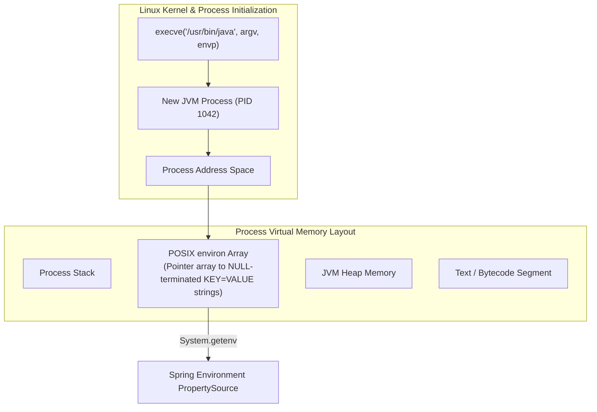
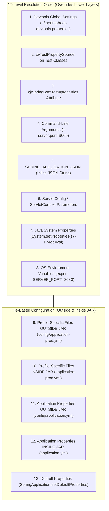
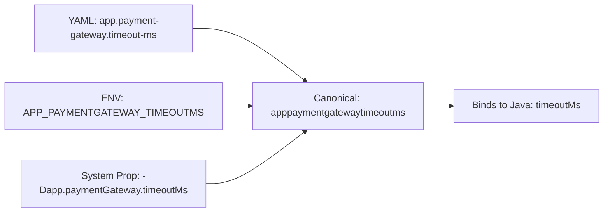
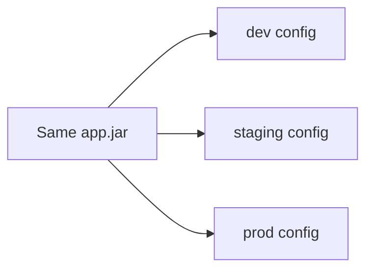

# Configuration Architecture, Profiles & Secret Management

In production backend engineering, building separate JAR binaries for development, staging, and production environments is an architectural anti-pattern.

According to **Factor III of The Twelve-Factor App methodology**, application code and runtime configuration must be strictly segregated. Your compiled JAR artifact must be built exactly once by CI/CD, pass automated integration tests, and be promoted across environments solely by varying externalized configuration.

Improper configuration architecture creates catastrophic production hazards: credentials leaked into public version control, unvalidated property strings causing midnight container crashes, and subtle environment divergences where services function in staging but fail under load in production.

---

## Phase 1: Ground Floor (Physical First Principles & POSIX Environment Mechanics)

Before exploring Spring Boot's application context, consider how the underlying Operating System kernel passes configuration to a process.



### 1. The POSIX Environment Array (`envp`)
When an operating system kernel spawns a process via the `execve()` system call, it allocates a dedicated memory block in the process address space for the `environ` pointer array. This array contains null-terminated C-strings in the format `NAME=VALUE`.
- **Process Isolation**: The child process receives a snapshot copy of the parent's environment variables. 
- **Immutability from Outside**: Once a Linux process is running, external processes cannot mutate its `environ` memory block without attaching a debugger (e.g., `ptrace`). This is why updating a Kubernetes `ConfigMap` injected as environment variables requires restarting the pod.
- **Kernel File Descriptors & ConfigTrees**: Unlike environment variables, mounted volumes (e.g., Kubernetes Secret volumes mounted at `/etc/secrets/`) leverage the Linux virtual filesystem (VFS). Changes made to mounted files update via symbolic links, allowing applications watching file descriptors via `inotify` to detect secret rotations without process restarts.

### 2. The Twelve-Factor Config Invariant
A single binary must run identically in:
- A local developer MacBook running Docker Compose.
- An automated GitHub Actions CI pipeline executing Testcontainers.
- A multi-region Kubernetes production cluster running on AWS EKS.

If your code contains `if ("production".equals(profile)) { ... }`, the Twelve-Factor contract is broken. Business logic should never branch on environment names; instead, environment-specific behaviors must be encapsulated into polymorphic beans wired via dependency injection.

---

## Phase 2: The Naive Code (The Production Crash)

A fintech payment service handled customer card transactions. The service relied on scattered `@Value` annotations, plain-text configuration files committed to Git, and manual profile checks inside business logic.

During a routine security credential rotation, the team deployed a hotfix. Within minutes, the Canary deployment crashed, transactions failed with unhandled runtime exceptions, and automated security scanners triggered a company-wide incident because database credentials were leaked over HTTP.

### The Naive Implementation

```java
@Service
public class NaivePaymentProcessingService {

    // NAIVE DISASTER 1: Scattered @Value annotations with brittle string expressions
    @Value("${payment.gateway.url}")
    private String gatewayUrl;

    @Value("${payment.gateway.api-key}")
    private String apiKey;

    // NAIVE DISASTER 2: Arbitrary fallback default hiding missing configuration
    @Value("${payment.timeout.ms:5000}")
    private int timeoutMs;

    @Value("${payment.max-retries}")
    private int maxRetries;

    @Autowired
    private Environment environment;

    public PaymentResponse processTransaction(PaymentRequest request) {
        // NAIVE DISASTER 3: Business logic branching on environment string!
        if (Arrays.asList(environment.getActiveProfiles()).contains("prod")) {
            return executeLiveCharge(request);
        } else {
            return executeMockCharge(request);
        }
    }

    private PaymentResponse executeLiveCharge(PaymentRequest request) {
        // If maxRetries was misconfigured as negative or zero, this causes undefined behavior
        for (int i = 0; i <= maxRetries; i++) {
            try {
                return callGateway(gatewayUrl, apiKey, request, timeoutMs);
            } catch (Exception ex) {
                if (i == maxRetries) throw ex;
            }
        }
        return null;
    }
}
```

### Why the System Collapsed

```mermaid
sequenceDiagram
    autonumber
    participant K8s as Kubernetes Deployer
    participant Pod as Canary Pod (Spring Boot)
    participant Actuator as HTTP Actuator (/actuator/env)
    participant Hacker as Malicious Crawler

    K8s->>Pod: Inject Env Var: PAYMENT_MAX_RETRIES=-1 (Operator typo!)
    Pod->>Pod: Boots up without failure (No Bean Validation!)
    Note over Pod: @Value assigns maxRetries = -1.<br/>for (i = 0; i <= -1; i++) loop is bypassed!<br/>Method returns null!
    
    Pod-->>K8s: Readiness probe passes (HTTP 200)
    K8s->>Pod: Route live customer transactions
    Note over Pod: Customers receive NullPointerException on checkout!
    
    Hacker->>Actuator: GET /actuator/env
    Actuator-->>Hacker: HTTP 200: Returns raw apiKey & DB password in plaintext!
    Note over Hacker: Security perimeter breached!
```

1. **No Startup Fail-Fast Validation**:
   An operator updating the Kubernetes Helm chart typed `PAYMENT_MAX_RETRIES: -1`. Because `@Value` lacks type-range validation, Spring happily injected `-1`. The loop `i <= maxRetries` was completely bypassed, causing `processTransaction()` to return `null` and crashing downstream order processing with `NullPointerException`.
2. **Missing Property Crash in Canary**:
   A developer renamed `payment.gateway.api-key` to `payment.gateway.secret-key` in one service, but forgot to update one of the legacy `@Value` references. Because `@Value` evaluation occurs only when the containing bean is instantiated, unit tests with mock properties passed. In the live Canary pod, the bean failed to initialize, causing a runtime `BeanCreationException` during traffic shifting.
3. **Plaintext Credential Exposure via Actuator**:
   The team exposed `management.endpoints.web.exposure.include=*` for debugging. The Actuator `/actuator/env` endpoint exposed every environment variable—including `SPRING_DATASOURCE_PASSWORD` and `PAYMENT_GATEWAY_API_KEY`—in plaintext to anyone on the corporate network.

---

## Phase 3: Under the Hood (Mechanics, Bytecode & Kernel Interfaces)

To eliminate configuration fragility, Spring Boot 3 provides a layered configuration engine built on a strict **17-level hierarchy**, **relaxed binding**, **immutable Java 21 Records**, and the **Config Data API**.



### 1. Architectural Rules of Precedence
1. **OS Environment Variables (Level 8) override Packaged Files (Levels 10 & 12)**:
   Container orchestrators (Kubernetes, Docker) inject runtime secrets via environment variables, cleanly overriding default properties packaged inside the JAR artifact.
2. **CLI Arguments (Level 4) override Environment Variables**:
   Allows operations teams to perform one-off batch runs or database migrations without altering container environment declarations:
   ```bash
   java -jar app.jar --spring.profiles.active=migration --flyway.clean-disabled=false
   ```
3. **External Directory Priority**:
   Spring looks for configuration in `./config/` relative to the current working directory before looking at the root classpath. A Kubernetes `ConfigMap` mounted to `/app/config/` cleanly overrides internal defaults.

---

### 2. Relaxed Binding Algorithm Internals

Spring Boot does not perform direct string lookups against property names. Instead, it converts both configuration source keys and Java field names into a **canonical representation**:
- Converts all characters to lowercase.
- Strips hyphens (`-`) and underscores (`_`).
- Strips array index brackets (`[` and `]`).



| Source Format | Example Syntax | Mapping Target |
| :--- | :--- | :--- |
| **YAML / Properties (Canonical)** | `app.payment-gateway.timeout-ms: 5000` | `app.paymentGateway.timeoutMs` |
| **System Properties (-D)** | `-Dapp.paymentGateway.timeoutMs=5000` | `app.paymentGateway.timeoutMs` |
| **OS Environment Variables** | `APP_PAYMENTGATEWAY_TIMEOUTMS=5000` | `app.paymentGateway.timeoutMs` |
| **Array Property in ENV** | `APP_SERVERS_0_URL="https://api1.com"` | `app.servers[0].url` |

---

### 3. Immutable Configuration with Java 21 Records & Bean Validation

Scatter `@Value` annotations no longer. Spring Boot 3 allows defining configuration hierarchies using immutable **Java 21 Records** annotated with `@ConfigurationProperties` and Jakarta Bean Validation (`@Validated`):

```java
package com.backend.mastery.config;

import jakarta.validation.Valid;
import jakarta.validation.constraints.NotBlank;
import jakarta.validation.constraints.NotNull;
import jakarta.validation.constraints.Positive;
import org.hibernate.validator.constraints.time.DurationMin;
import org.springframework.boot.context.properties.ConfigurationProperties;
import org.springframework.validation.annotation.Validated;

import java.net.URI;
import java.time.Duration;
import java.util.List;
import java.util.Map;

@ConfigurationProperties(prefix = "app")
@Validated // CRITICAL: Enforces fail-fast validation during JVM startup!
public record ApplicationProperties(
    @NotNull @Valid SecurityProperties security,
    @NotNull @Valid PaymentProperties payment,
    List<String> allowedOrigins,
    Map<String, FeatureFlag> features
) {

    public record SecurityProperties(
        @NotBlank String jwtSecret,
        @DurationMin(minutes = 5) Duration tokenExpiry,
        @NotBlank String issuer
    ) {}

    public record PaymentProperties(
        @NotNull URI gatewayUrl,
        @Positive int maxRetries,
        @NotNull Duration connectionTimeout,
        @NotNull Duration readTimeout
    ) {}

    public record FeatureFlag(
        boolean enabled,
        double rolloutPercentage
    ) {}
}
```

Line by line:

- `@ConfigurationProperties(prefix = "app")` tells Spring to bind properties under `app.*` into this record.
- `@Validated` activates Jakarta Bean Validation during startup, before Tomcat accepts traffic.
- `public record ApplicationProperties(...)` makes the configuration immutable after binding.
- `@NotNull @Valid SecurityProperties security` requires `app.security` to exist and validates its nested fields.
- `@NotNull @Valid PaymentProperties payment` does the same for payment configuration.
- `List<String> allowedOrigins` binds YAML arrays or indexed environment variables into a Java list.
- `Map<String, FeatureFlag> features` supports named feature toggles such as `features.checkout-v2.enabled`.
- `@NotBlank String jwtSecret` rejects missing and blank JWT secrets.
- `@DurationMin(minutes = 5) Duration tokenExpiry` prevents accidentally deploying 5-second tokens when the product expects minutes.
- `@NotNull URI gatewayUrl` verifies the payment gateway URL can be parsed as a URI.
- `@Positive int maxRetries` rejects zero and negative retry counts at startup.
- `Duration connectionTimeout` and `Duration readTimeout` make timeouts explicit typed values instead of loose strings.

Matching YAML:

```yaml
app:
  security:
    jwt-secret: "${JWT_SECRET}"
    token-expiry: 15m
    issuer: "https://auth.example.com"
  payment:
    gateway-url: "https://payments.example.com"
    max-retries: 3
    connection-timeout: 500ms
    read-timeout: 2s
  allowed-origins:
    - "https://app.example.com"
  features:
    checkout-v2:
      enabled: true
      rollout-percentage: 10.0
```

Proof task:

```console
Set app.payment.max-retries=-1.
Start the application.
Expected: startup fails before opening port 8080.
Fix max-retries=3.
Start again.
Expected: application boots and configuration bean is available.
```

#### Automatic Type Coercion
Spring Boot automatically parses human-readable duration strings directly into `java.time.Duration`:
- `token-expiry: 15m` $\rightarrow$ `Duration.ofMinutes(15)`
- `connection-timeout: 500ms` $\rightarrow$ `Duration.ofMillis(500)`
- `max-payload-size: 10MB` $\rightarrow$ `DataSize.ofMegabytes(10)`

#### Fail-Fast Bootstrap Guarantee
If the application is deployed with a negative `maxRetries` or a missing `jwtSecret`, Spring throws a `ConfigurationPropertiesBindException` and **aborts the bootstrap before opening the server socket**:

```log
***************************
APPLICATION FAILED TO START
***************************

Description:
Binding to target org.springframework.boot.context.properties.bind.BindResult@... failed:

    Property: app.payment.max-retries
    Value: -1
    Reason: must be greater than 0
```

---

### 4. Profile Groups in Spring Boot 3

Instead of requiring operators to pass 5 distinct profiles (`--spring.profiles.active=prod,aws,rds,datadog,ses`), configure **Profile Groups** in `application.yml`:

```yaml
spring:
  profiles:
    group:
      local-dev:
        - local-db
        - mock-email
        - verbose-logging
      production:
        - prod-aurora
        - aws-ses
        - structured-json-logs
        - datadog-metrics
```

Activating `--spring.profiles.active=production` automatically expands and activates all four composite profiles in a single command.

---

### 5. Spring Config Data API (`spring.config.import`)

Modern cloud architectures mount secrets as directories using Kubernetes Secret volumes or HashiCorp Vault agents:

```yaml
spring:
  config:
    import:
      # 1. ConfigTree: Mount an entire Kubernetes secret volume as properties
      # Each file in /etc/secrets/ becomes a property name, file contents become the value
      - "optional:configtree:/etc/secrets/"
      
      # 2. External YAML configuration file mounted outside the JAR
      - "optional:file:/etc/config/routing-rules.yml"
      
      # 3. HashiCorp Vault / Spring Cloud Config Server
      - "optional:vault://secret/payment-service"
```

The `optional:` prefix guarantees that if the target directory does not exist (e.g., during local JUnit tests), the application starts normally without failing.

---

### 6. Production Secret Sanitization (Actuator Defense)

Never expose sensitive secrets over HTTP. Lock down Actuator endpoints in `application.yml`:

```yaml
management:
  endpoint:
    env:
      show-values: when_authorized # Masks passwords with ****** unless authenticated as ACTUATOR_ADMIN
      roles: "ROLE_ACTUATOR_ADMIN"
    configprops:
      show-values: when_authorized
      roles: "ROLE_ACTUATOR_ADMIN"
  endpoints:
    web:
      exposure:
        # Expose only health and prometheus metrics publicly; exclude 'env' and 'configprops'
        include: "health,info,prometheus"
```

To redact custom proprietary keys (e.g., `client-signing-token`), register a custom `SanitizingFunction` bean:

```java
@Configuration
public class ActuatorSecurityConfig {

    @Bean
    public SanitizingFunction customSanitizingFunction() {
        return data -> {
            String property = data.getPropertySource().getName();
            String key = data.getKey();
            if (key.toLowerCase().contains("signing") || key.toLowerCase().contains("private")) {
                return data.withValue("******REDACTED******");
            }
            return data;
        };
    }
}
```

---

## Phase 4: Senior Interview Ace (Junior vs Staff Phrasing)

During technical interviews, configuration architecture separates candidates who treat configuration as an afterthought from those who understand zero-trust operational stability:

| Architectural Topic | Junior Developer Answer | Senior / Staff Engineer Answer |
| :--- | :--- | :--- |
| **Property Injection** | *"I use `@Value("${app.stripe.key}")` directly inside the service classes that need the value."* | *"Scattered `@Value` annotations create untyped, brittle dependencies that only fail when specific beans are accessed. I use immutable Java 21 Records with `@ConfigurationProperties` and Jakarta `@Validated`. This guarantees compile-time type safety, supports nested models, and enforces fail-fast validation before the server socket opens."* |
| **Multi-Environment Config** | *"I write an `if (activeProfile.equals("prod"))` statement in my Java service to switch between Stripe and Mock Stripe."* | *"Business code should never branch on environment strings; that violates the Twelve-Factor contract. I define a common `PaymentClient` interface and declare environment implementations with `@Profile("production")` and `@Profile("!production")`. Spring's IoC container resolves the correct bean via polymorphic dependency injection."* |
| **Precedence Hierarchy** | *"If a property is in both `application.yml` and an environment variable, they merge together randomly."* | *"Spring Boot resolves properties through a strict 17-level precedence chain. CLI arguments override OS environment variables, which override packaged profile YAML files, which override base `application.yml`. This allows container orchestrators to inject credentials at runtime without rebuilding the JAR."* |
| **Secret Management** | *"We store our staging and prod passwords in `application-prod.yml` and keep the Git repository private."* | *"Zero secrets belong in Git, regardless of repository visibility. Base configuration files declare placeholder expressions (`${DB_PASSWORD}`). Secrets are injected at runtime via HashiCorp Vault, AWS Secrets Manager, or Kubernetes Secret volumes mounted as `configtree:` directories, while Actuator endpoints are sanitized using RBAC and custom `SanitizingFunction` beans."* |
| **Kubernetes Secret Rotation** | *"When a secret rotates, we must redeploy the application and rebuild the Docker image."* | *"The Docker image is immutable across environments. For zero-downtime secret rotation without container restarts, we mount secrets as files via Kubernetes Secret volumes and consume them using Spring's `configtree:` API. An internal scheduler or `inotify` watcher triggers a Spring `ContextRefresher` event when file content changes."* |

---

## Configuration Fundamentals Interview Map

Configuration is production behavior injected at runtime. A bad config can break a correct codebase.

### 1. Why externalize configuration?

The same artifact should run in dev, staging, and production. Only configuration changes.



If you rebuild code for every environment, you cannot prove that the tested artifact is the deployed artifact.

### 2. Profiles are grouping, not security

Profiles select sets of beans and properties:

```yaml
spring:
  profiles:
    active: prod
```

A profile is not a secret boundary. Do not put production passwords in `application-prod.yml`.

### 3. Environment variable binding

Spring relaxed binding maps environment variables to properties:

```console
PAYMENT_GATEWAY_BASE_URL
```

can bind to:

```yaml
payment:
  gateway:
    base-url: ...
```

This matters in Docker and Kubernetes because environment variables are common runtime injection points.

### 4. Why use `@ConfigurationProperties`?

Bad:

```java
@Value("${payment.timeout-ms}")
private int timeoutMs;
```

Better:

```java
@ConfigurationProperties(prefix = "payment")
public record PaymentProperties(
    @NotBlank String baseUrl,
    @Min(100) int timeoutMs
) {}
```

This gives grouped config, type safety, validation, and fail-fast startup.

### Build-Break-Fix Lab

<Steps>
  <Step title="Build">
    Create typed properties for database, JWT, and payment settings.
  </Step>
  <Step title="Break">
    Remove a required environment variable and start the app.
  </Step>
  <Step title="Observe">
    Confirm the application fails at startup before opening the HTTP port.
  </Step>
  <Step title="Fix">
    Add validation annotations and safe defaults only for non-sensitive values.
  </Step>
  <Step title="Prove">
    Add a Spring Boot test that fails when required production config is missing.
  </Step>
</Steps>

---

## Active Recall & Interview Mastery

<AccordionGroup>
  <Accordion title="1. Explain the order of precedence between OS environment variables, application.yml, and CLI arguments.">
    Spring Boot resolves properties through a strict 17-level hierarchy: **Command-Line Arguments** (Level 4) have higher precedence than **OS Environment Variables** (Level 8), which have higher precedence than **Profile-Specific YAML Files** (Level 10) and **Default application.yml Files** (Level 12). This enables Kubernetes to override base configurations using container environment variables, while still allowing operations engineers to override specific flags via CLI arguments during manual maintenance runs.
  </Accordion>

  <Accordion title="2. What are Relaxed Binding rules, and how does SPRING_DATASOURCE_URL map to datasource.url?">
    Relaxed Binding is Spring Boot's algorithm for mapping property keys across different casing conventions. Spring strips delimiters (hyphens, underscores) and converts characters to lowercase to establish a canonical key. Because Linux shell environments cannot accept dots or hyphens in variable names, `SPRING_DATASOURCE_URL` strips underscores to match canonical `springdatasourceurl`, which binds directly to Java's `spring.datasource.url` property.
  </Accordion>

  <Accordion title="3. Why are Java 21 Records superior to @Value annotations for configuration?">
    Java 21 Records combined with `@ConfigurationProperties` are immutable, compile-time type-safe, and self-documenting. They support nested hierarchies, collections, automatic duration coercion (e.g., `15m` to `Duration.ofMinutes(15)`), and Jakarta Bean Validation (`@NotNull`, `@Positive`). Errors fail fast during application bootstrap with a descriptive validation error, preventing corrupt configurations from opening server ports.
  </Accordion>

  <Accordion title="4. How do Profile Groups simplify multi-environment Spring Boot microservices?">
    Profile groups allow engineers to bundle multiple modular profiles under a single descriptive alias. In `application.yml`, defining a `production` group that bundles `prod-aurora`, `aws-ses`, and `datadog-metrics` allows operations teams to activate `--spring.profiles.active=production`, cleanly activating all sub-profiles without having to maintain long, error-prone environment variable lists.
  </Accordion>

  <Accordion title="5. How do you prevent sensitive credentials from leaking through Spring Boot Actuator?">
    1. Lock down web exposure: configure `management.endpoints.web.exposure.include=health,info,prometheus` and never expose `env` or `configprops` publicly.
    2. Require authorization: set `management.endpoint.env.show-values=when_authorized` with RBAC role requirements (`ROLE_ACTUATOR_ADMIN`).
    3. Register a custom `SanitizingFunction` bean to inspect all outgoing keys and replace custom sensitive values with `******REDACTED******`.
  </Accordion>

  <Accordion title="6. What is the difference between @Profile and @ConditionalOnProperty?">
    `@Profile` activates beans based solely on active profile names (e.g., `dev`, `prod`). It couples code to environment naming conventions. In contrast, `@ConditionalOnProperty` activates beans based on specific functional feature flags or configuration properties (e.g., `feature.payment.mock=true`). This follows Twelve-Factor principles: beans activate based on feature flags, not arbitrary environment strings.
  </Accordion>

  <Accordion title="7. How does Kubernetes configtree support secret rotation without restarting Spring Boot pods?">
    Kubernetes Secret and ConfigMap volumes mount files into directories (e.g., `/etc/secrets/db-password`). When Kubernetes updates a secret, it atomically updates the symbolic link in the directory. By importing configuration via `spring.config.import=configtree:/etc/secrets/`, Spring maps directory file names to properties and file contents to values. A background watcher or scheduled refresh can reload these properties without restarting the JVM process.
  </Accordion>

  <Accordion title="8. How does Jakarta Bean Validation integrate with @ConfigurationProperties?">
    By placing `@Validated` on a `@ConfigurationProperties` record or class, Spring Boot registers a `Validator` that inspects the properties during startup. Annotations such as `@NotNull`, `@Min(100)`, `@Email`, and `@Pattern` are evaluated as properties bind. If any property fails validation, Spring aborts startup with a `ConfigurationPropertiesBindException` detailing the invalid key and rejected value, preventing runtime outages.
  </Accordion>
</AccordionGroup>

---

## Done Checklist

<Check>
- [ ] Understand POSIX environment array (`envp`) mechanics and process isolation in Linux.
- [ ] Explain why the compiled application JAR must remain 100% identical across all environments.
- [ ] Master Spring Boot's 17-level property resolution hierarchy.
- [ ] Explain Relaxed Binding rules across kebab-case, camelCase, and UPPER_SNAKE_CASE.
- [ ] Replace scattered `@Value` annotations with type-safe `@ConfigurationProperties` records.
- [ ] Enforce fail-fast startup validation on configuration properties using `@Validated`.
- [ ] Group modular profiles into clear environment aliases using `spring.profiles.group`.
- [ ] Avoid branching on environment strings (`if ("prod".equals(profile))`) in business logic.
- [ ] Mount Kubernetes secrets and config maps using `spring.config.import=configtree:/etc/secrets/`.
- [ ] Restrict Spring Boot Actuator endpoints using `management.endpoints.web.exposure.include`.
- [ ] Redact sensitive keys in Actuator using custom `SanitizingFunction` beans.
- [ ] Implement custom property converters using Spring's `Converter<String, TargetType>` interface.
- [ ] Isolate local test configurations using `@TestPropertySource` and Testcontainers.
- [ ] Protect version control by ensuring zero passwords or secret keys exist in Git repositories.
- [ ] Verify that missing required production configuration causes immediate startup failure.
</Check>
