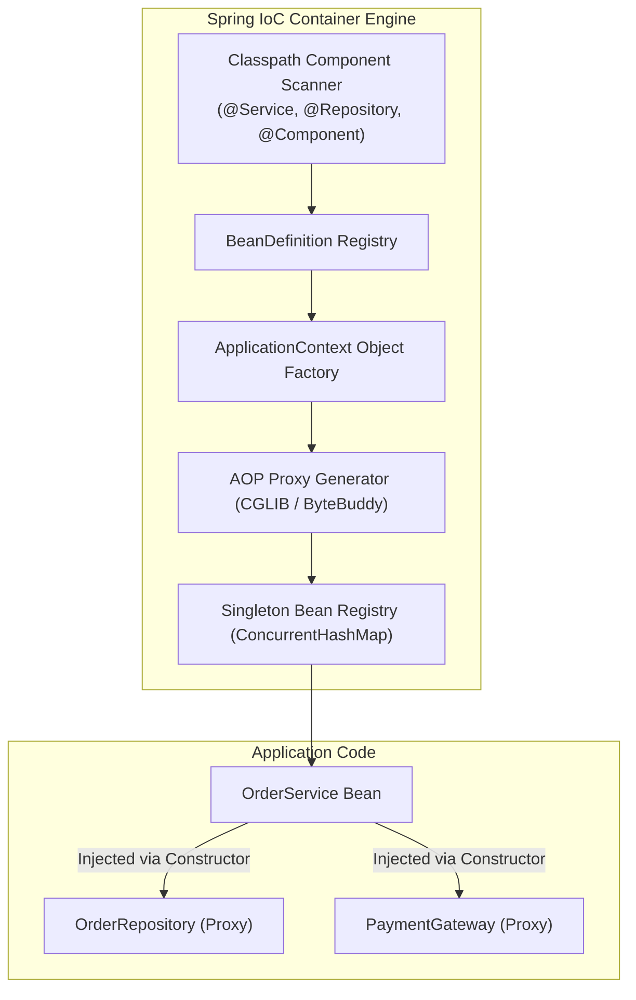
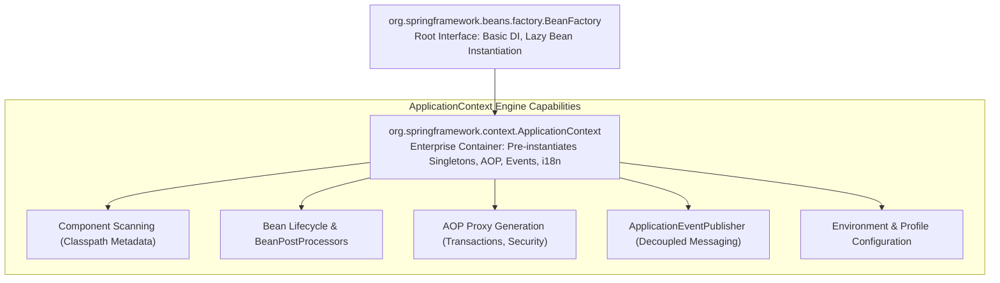
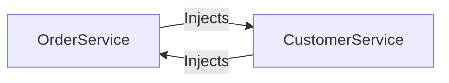
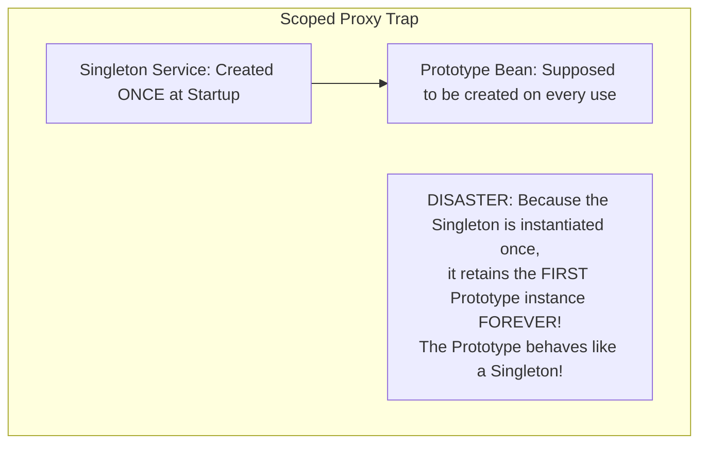

## 1. Mental Model: Inversion of Control & The Object Factory

In traditional object-oriented programming, classes manage their own dependencies using the `new` operator:

```java
public class OrderService {
    // Tightly coupled: Cannot mock for unit testing, cannot swap implementations
    private final PaymentGateway gateway = new StripePaymentGateway("secret_key_123");
}
```

This creates rigid, tightly coupled architectures where:
1. Testing in isolation is impossible without spinning up external cloud networks.
2. Swapping implementations (e.g., switching from Stripe to Adyen) requires modifying production business logic.
3. Cross-cutting infrastructure concerns (transactions, caching, metrics, security) must be manually duplicated across thousands of methods.

Spring solves this through **Inversion of Control (IoC)** and **Dependency Injection (DI)**:



Instead of your application code creating dependencies, the **Spring IoC Container** assumes full ownership: it discovers classes, instantiates them, injects collaborators, decorates them with dynamic proxies (for transactions, caching, and security), and orchestrates their complete destruction.

---

## 2. Container Architecture: `BeanFactory` vs `ApplicationContext`

Spring's IoC container is organized into two core hierarchical interfaces:



### Deep Architectural Comparison:

| Dimension | `BeanFactory` | `ApplicationContext` (Spring Boot Default) |
| :--- | :--- | :--- |
| **Instantiation Strategy** | **Lazy**: Beans are instantiated only when `getBean()` is explicitly called | **Eager**: All singletons are pre-instantiated and validated at application startup |
| **Fail-Fast Detection** | Slow: Missing dependencies fail at runtime during user requests | **Immediate**: Configuration errors fail fast during startup before opening HTTP ports |
| **AOP & Annotations** | Requires manual post-processor registration | Fully automated support for `@Transactional`, `@Async`, `@Cacheable` |
| **Enterprise Features** | Minimal: Bare-bones object graph | Internationalization (i18n), Event publishing, Web application scopes |

---

## 3. The 12-Step Spring Bean Lifecycle

When Spring boots, every bean transitions through a strictly defined lifecycle managed by the container:

```mermaid
sequenceDiagram
    autonumber
    participant Reg as BeanDefinitionRegistry
    participant BFPP as BeanFactoryPostProcessor
    participant Inst as Instantiation (CGLIB / Reflection)
    participant Aware as Aware Interfaces
    participant BPP_Pre as BeanPostProcessor (Before Init)
    participant Init as @PostConstruct / InitializingBean
    participant BPP_Post as BeanPostProcessor (After Init / Dynamic Proxy!)
    participant Ready as Bean Ready in Container
    participant Destroy as @PreDestroy / DisposableBean

    Note over Reg: 1. Discovers @Component, creates BeanDefinition
    Reg->>BFPP: 2. Resolves @Value properties & placeholders
    BFPP->>Inst: 3. Invokes constructor to instantiate object
    Inst->>Inst: 4. Populates properties (Dependency Injection)
    Inst->>Aware: 5. Sets Aware interfaces (BeanNameAware, ApplicationContextAware)
    Aware->>BPP_Pre: 6. postProcessBeforeInitialization()
    BPP_Pre->>Init: 7. Executes @PostConstruct & afterPropertiesSet()
    Init->>BPP_Post: 8. postProcessAfterInitialization()
    Note over BPP_Post: CRITICAL: Wraps bean in CGLIB dynamic proxy<br/>for @Transactional, @Async, @Secured!
    BPP_Post->>Ready: 9. Bean stored in singleton cache
    Note over Ready: Application executes HTTP requests...
    Ready->>Destroy: 10. Container shutdown executes @PreDestroy
```

### The Crucial Role of `BeanPostProcessor`
Step 8 is where Spring's magic happens. If your service is annotated with `@Transactional`, `@Async`, or `@Cacheable`:
- The container does **not** return your raw Java object.
- `AnnotationAwareAspectJAutoProxyCreator` (a `BeanPostProcessor`) intercepts the bean and wraps it in a **CGLIB Dynamic Proxy**.
- When other beans inject your service, they receive the proxy wrapper!

---

## 4. Production Code: Custom `BeanPostProcessor` Metrics Proxy

Below is a complete, production-grade custom `BeanPostProcessor` that intercepts any Spring bean annotated with `@Monitored` and dynamically wraps it in an execution-time measurement proxy:

```java
package com.backend.mastery.spring.lifecycle;

import org.slf4j.Logger;
import org.slf4j.LoggerFactory;
import org.springframework.aop.framework.ProxyFactory;
import org.springframework.beans.BeansException;
import org.springframework.beans.factory.config.BeanPostProcessor;
import org.springframework.stereotype.Component;

import java.lang.annotation.*;
import java.lang.reflect.Method;
import java.util.HashMap;
import java.util.Map;

// 1. Custom Monitoring Annotation
@Target({ElementType.TYPE, ElementType.METHOD})
@Retention(RetentionPolicy.RUNTIME)
public @interface Monitored {}

// 2. Custom BeanPostProcessor
@Component
public class PerformanceMonitoringBeanPostProcessor implements BeanPostProcessor {

    private static final Logger log = LoggerFactory.getLogger(PerformanceMonitoringBeanPostProcessor.class);
    private final Map<String, Class<?>> monitoredBeans = new HashMap<>();

    @Override
    public Object postProcessBeforeInitialization(Object bean, String beanName) throws BeansException {
        // Step 6: Identify classes marked with @Monitored before initialization
        if (bean.getClass().isAnnotationPresent(Monitored.class)) {
            monitoredBeans.put(beanName, bean.getClass());
        }
        return bean;
    }

    @Override
    public Object postProcessAfterInitialization(Object bean, String beanName) throws BeansException {
        // Step 8: Wrap the bean in an AOP proxy after initialization
        if (monitoredBeans.containsKey(beanName)) {
            log.info("Creating dynamic performance proxy for bean: {}", beanName);
            ProxyFactory proxyFactory = new ProxyFactory(bean);
            proxyFactory.addAdvice((org.aopalliance.intercept.MethodInterceptor) invocation -> {
                long startNano = System.nanoTime();
                try {
                    return invocation.proceed();
                } finally {
                    long durationMicro = (System.nanoTime() - startNano) / 1_000;
                    log.info("Method {}.{}() executed in {} µs",
                            invocation.getThis().getClass().getSimpleName(),
                            invocation.getMethod().getName(),
                            durationMicro);
                }
            });
            return proxyFactory.getProxy();
        }
        return bean;
    }
}
```

---

## 5. Eliminating `switch` Statements with Dynamic Strategy Maps

A common junior anti-pattern is using giant `switch` or `if-else` blocks to select business logic (e.g., payment gateways):

```java
// ANTI-PATTERN: VIOLATES OPEN/CLOSED PRINCIPLE (OCP)
public void processPayment(String gatewayType, long amount) {
    if ("STRIPE".equalsIgnoreCase(gatewayType)) {
        stripeGateway.charge(amount);
    } else if ("PAYPAL".equalsIgnoreCase(gatewayType)) {
        paypalGateway.charge(amount);
    } else if ("ADYEN".equalsIgnoreCase(gatewayType)) {
        adyenGateway.charge(amount);
    } else {
        throw new IllegalArgumentException("Unknown gateway: " + gatewayType);
    }
}
```

### The Spring IoC Solution: Dynamic Map Injection
Spring automatically discovers all beans implementing an interface and injects them into a `Map<String, StrategyInterface>` where the key is the **bean name**:

```java
package com.backend.mastery.spring.strategy;

import org.springframework.stereotype.Component;
import org.springframework.stereotype.Service;

import java.util.Map;

// 1. Common Strategy Interface
public interface PaymentGatewayStrategy {
    void processPayment(long amountCents);
}

// 2. Concrete Strategy Implementations (Bean names become Map keys)
@Component("STRIPE")
public class StripePaymentStrategy implements PaymentGatewayStrategy {
    @Override
    public void processPayment(long amountCents) {
        // Stripe API integration...
    }
}

@Component("PAYPAL")
public class PaypalPaymentStrategy implements PaymentGatewayStrategy {
    @Override
    public void processPayment(long amountCents) {
        // PayPal API integration...
    }
}

// 3. Context Dispatcher Service with O(1) Map Lookup
@Service
public class PaymentProcessingService {

    // Spring automatically populates this map with all PaymentGatewayStrategy beans!
    private final Map<String, PaymentGatewayStrategy> paymentStrategies;

    public PaymentProcessingService(Map<String, PaymentGatewayStrategy> paymentStrategies) {
        this.paymentStrategies = paymentStrategies;
    }

    public void executePayment(String providerKey, long amountCents) {
        PaymentGatewayStrategy strategy = paymentStrategies.get(providerKey.toUpperCase());
        if (strategy == null) {
            throw new IllegalArgumentException("Unsupported payment provider: " + providerKey);
        }
        strategy.processPayment(amountCents); // O(1) dispatch! Zero switch statements!
    }
}
```

---

## 6. Circular Dependencies: The `@Lazy` Anti-Pattern

A circular dependency occurs when Bean A requires Bean B in its constructor, and Bean B requires Bean A:



In Spring Boot 2.6+, circular dependencies are **forbidden by default**, causing startup failure with:
`BeanCurrentlyInCreationException: Is there an unresolvable circular reference?`

### Why `@Lazy` is an Anti-Pattern:
Adding `@Lazy` tells Spring to inject a synthetic CGLIB proxy placeholder to break the constructor loop. 

While it allows the application to start, it is a **toxic architectural band-aid**:
- It masks high coupling and violated Single Responsibility Principle (SRP).
- It defers class circularity bugs to runtime, occasionally causing unexpected `NullPointerException`s or deadlocks during concurrent proxy initialization.

### The Clean Refactoring: Event-Driven Decoupling
Decouple the circular reference using Spring's built-in **`ApplicationEventPublisher`**:

```java
// OrderService publishes an event instead of directly calling CustomerService
@Service
public class OrderService {

    private final ApplicationEventPublisher eventPublisher;

    public OrderService(ApplicationEventPublisher eventPublisher) {
        this.eventPublisher = eventPublisher;
    }

    public void completeOrder(Long orderId, Long customerId) {
        // Business logic...
        eventPublisher.publishEvent(new OrderCompletedEvent(orderId, customerId));
    }
}

// CustomerService listens to the event; ZERO circular dependencies!
@Service
public class CustomerService {

    @EventListener
    public void handleOrderCompleted(OrderCompletedEvent event) {
        updateLoyaltyPoints(event.customerId());
    }
}
```

---

## 7. The Scoped Proxy Hazard

What happens when you inject a **Prototype** or **Request-scoped** bean into a **Singleton** bean?



### The Production Solution: `ScopedProxyMode.TARGET_CLASS`
Instruct Spring to inject a **smart proxy** that dynamically resolves the underlying scoped instance upon every method invocation:

```java
@Component
@Scope(value = "prototype", proxyMode = ScopedProxyMode.TARGET_CLASS)
public class RequestContextHolder {
    private String traceId;
    // ...
}
```

Now, whenever the singleton invokes a method on `RequestContextHolder`, the proxy dynamically fetches the correct scoped instance for the current execution thread!

---

## 8. Failure Modes & Edge Case Matrix

| Failure Mode | Root Cause | Impact | Production Defense |
| :--- | :--- | :--- | :--- |
| **`NoSuchBeanDefinitionException`** | Missing `@Component` or package outside component scan | Application fails fast at startup | Verify `@ComponentScan` root package path in main class. |
| **`NoUniqueBeanDefinitionException`** | Multiple beans implement same interface without `@Primary` | Startup failure due to ambiguous injection | Use `@Qualifier("specificBeanName")` or inject a `Map<String, T>`. |
| **Circular Dependency Deadlock** | Two services require each other in constructors | Application crashes on boot | Decouple using Spring Domain Events (`ApplicationEventPublisher`). |
| **Self-Invocation AOP Bypass** | Calling `@Transactional` internally | Proxy bypassed; no transaction started | Move method to collaborator bean or use `TransactionTemplate`. |
| **Prototype Scope Leak** | Injecting prototype bean into singleton without scoped proxy | Prototype created once and never refreshed | Configure `@Scope(value = "prototype", proxyMode = ScopedProxyMode.TARGET_CLASS)`. |

---

## 9. Senior Interview Questions & Active Recall

<AccordionGroup>
  <Accordion title="1. What is the difference between BeanFactory and ApplicationContext?">
    `BeanFactory` is the root container interface providing basic dependency injection and lazy bean instantiation (beans are created only when requested). `ApplicationContext` extends `BeanFactory` and is the enterprise container used by Spring Boot. It eagerly pre-instantiates all singleton beans at startup (providing fail-fast validation), automates AOP proxy creation, publishes application events, and integrates environment properties and internationalization.
  </Accordion>

  <Accordion title="2. Walk through the 12 steps of the Spring Bean Lifecycle.">
    1. Bean definitions loaded from component scanning.
    2. `BeanFactoryPostProcessor` resolves placeholders and properties.
    3. Constructor instantiation via reflection.
    4. Setter/Field dependency injection.
    5. Aware interfaces set (`BeanNameAware`, `ApplicationContextAware`).
    6. `BeanPostProcessor.postProcessBeforeInitialization()`.
    7. Initialization callbacks (`@PostConstruct`, `afterPropertiesSet()`).
    8. `BeanPostProcessor.postProcessAfterInitialization()` (AOP CGLIB dynamic proxy wrapping!).
    9. Bean ready for service in singleton cache.
    10. On shutdown, destruction callbacks (`@PreDestroy`, `destroy()`).
  </Accordion>

  <Accordion title="3. How do you implement the Strategy Pattern dynamically using Spring IoC without switch statements?">
    Define a common strategy interface and annotate each concrete implementation with `@Component("STRATEGY_NAME")`. In the context service, declare a constructor dependency on `Map<String, StrategyInterface>`. Spring automatically populates this map with all matching beans, keyed by their bean names. At runtime, the service performs an $O(1)$ lookup (`strategies.get(key)`) and executes the strategy, satisfying the Open/Closed Principle.
  </Accordion>

  <Accordion title="4. Why should you avoid using @Lazy to resolve circular dependencies?">
    `@Lazy` injects a synthetic proxy to break constructor circularity at startup. However, it is an architectural anti-pattern that masks tight coupling and high cyclomatic complexity. It frequently causes subtle runtime concurrency deadlocks and `NullPointerException`s during proxy method dispatch. Circular dependencies should be eliminated at the design level by extracting shared logic into a third collaborator bean or using decoupled domain events (`ApplicationEventPublisher`).
  </Accordion>
</AccordionGroup>

---

## 10. Done Checklist

<Check>
- [ ] Understand Inversion of Control and contrast `BeanFactory` with `ApplicationContext`.
- [ ] Master the 12-step Spring Bean Lifecycle and explain where AOP dynamic proxies are generated.
- [ ] Implement a custom `BeanPostProcessor` that decorates beans with performance monitoring proxies.
- [ ] Eliminate complex `switch` statements using Spring's dynamic `Map<String, Strategy>` injection.
- [ ] Refactor circular dependencies cleanly using `ApplicationEventPublisher` instead of the `@Lazy` band-aid.
- [ ] Resolve the Scoped Proxy Hazard using `ScopedProxyMode.TARGET_CLASS`.
</Check>
