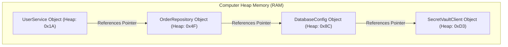
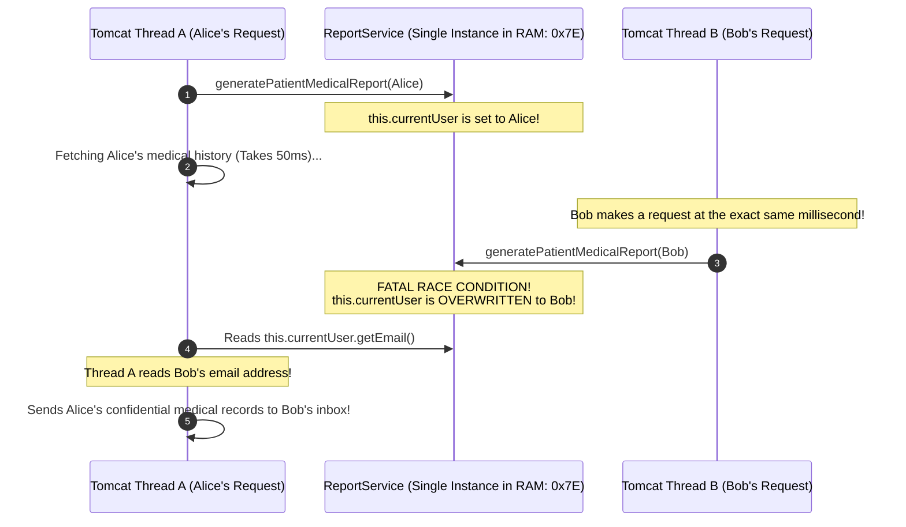
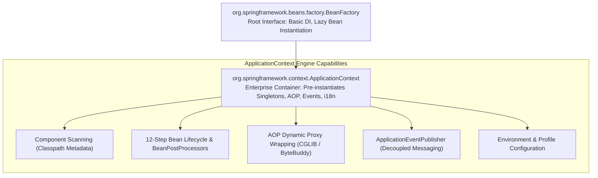
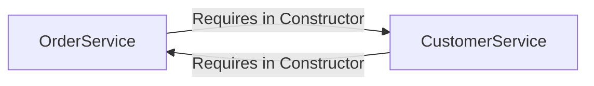
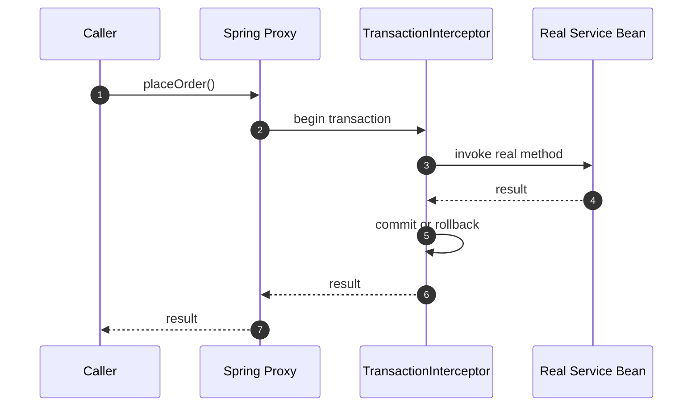

## Prerequisites: Before You Begin

Before studying Spring IoC and Dependency Injection internals, ensure you understand:
- Java OOP: memory allocation with `new`, constructors, interfaces, and reference pointers.
- Java Multithreading: how multiple threads execute code concurrently and access shared heap memory.
- Basic Spring Boot component annotations (`@Component`, `@Service`, `@Repository`).

---

# Phase 1: Ground Floor (Physical First Principles)

To understand why Inversion of Control (IoC) exists, you must look at how computer memory (RAM) allocates objects and why hardcoded creation causes architectural gridlock.



### 1. The Concrete Construction Gridlock
In basic Java, if class A needs class B, class A manually creates it using the `new` operator:

```java
public class UserService {
    // Tightly coupled: UserService controls how, when, and with what config OrderRepository is born!
    private final OrderRepository orderRepository = new OrderRepository(
        new DatabaseConfig("jdbc:postgresql://localhost:5432/mydb", "user", "secret_pass")
    );
}
```

What happens when your project grows to 50 real-world classes?
- `UserService` needs `OrderRepository`, which needs `DatabaseConfig`, which needs `VaultSecretsClient`, which needs `HttpClient`.
- To create a `UserService`, every caller must write:
  ```java
  UserService service = new UserService(
      new OrderRepository(
          new DatabaseConfig(
              new VaultSecretsClient(
                  new HttpClient(new ConnectionPool(50))
              )
          )
      )
  );
  ```
- **The Construction Gridlock**: If the developer of `DatabaseConfig` adds a `timeoutSeconds` parameter to its constructor, **every single `new` call across your entire application and test suite breaks simultaneously**!
- Furthermore, you cannot unit test `UserService` in isolation. Because `OrderRepository` is hardcoded with `new`, running a unit test physically attempts to open a network socket to `localhost:5432`!

### 2. Inversion of Control: The Automobile Factory
Inversion of Control (IoC) flips this responsibility using the **Hollywood Principle**: *"Don't call us, we'll call you."*

Instead of classes calling `new`, an external entity—the **Spring IoC Container**—acts like an automobile assembly factory:
1. It manufactures the engine (`DatabaseConfig`).
2. It manufactures the transmission (`OrderRepository`) and bolts the engine into it.
3. It drops the completed assembly into the car chassis (`UserService`).
4. `UserService` simply receives its dependencies ready to work, with zero knowledge of how they were assembled.

---

# Phase 2: The Naive Code (The Production Crash)

When a developer uses Spring without understanding container internals, they introduce subtle, dangerous bugs that pass code review but cause catastrophic data breaches in production.

### Catastrophe 1: The Mutable Singleton Data Breach (Thread Safety Disaster)

By default, **all Spring beans are Singletons**. The container creates **exactly one instance** of `UserService` in JVM heap memory. That single instance is shared simultaneously across all 200 Tomcat web worker threads handling incoming HTTP traffic.

A beginner writes this service:

```java
// NAIVE CODE: CATASTROPHIC MULTI-THREADED DATA LEAK!
@Service
public class ReportService {

    // FATAL MISTAKE: Storing mutable state in a Singleton Spring Bean!
    private User currentUser;

    public void generatePatientMedicalReport(User user) {
        // Step 1: Assign user to instance variable
        this.currentUser = user;

        // Step 2: Fetch and format medical records (Takes 50ms)
        String medicalSummary = fetchMedicalDataFromDatabase(this.currentUser.getId());

        // Step 3: Email report to the user
        sendConfidentialEmail(this.currentUser.getEmail(), medicalSummary);
    }
}
```



#### The Production Impact:
- **Catastrophic HIPAA / GDPR Data Breach**: Because all threads share the same instance variables in heap memory, Thread B overwrote `this.currentUser` while Thread A was mid-execution. 
- Alice's confidential medical records were emailed to Bob.
- **Rule**: Spring Singleton beans must be **100% stateless**. All data must pass strictly through local method arguments and return values (which live on the thread's private stack), never stored in instance fields.

---

### Catastrophe 2: The Field Injection Trap (`@Autowired` on Fields)

A beginner uses field injection because it requires less typing:

```java
// DANGEROUS ANTI-PATTERN: Field Injection
@Service
public class OrderService {

    @Autowired
    private OrderRepository orderRepository; // Injected via reflection

    public void processOrder(Order order) {
        orderRepository.save(order);
    }
}
```

#### Why Field Injection Fails in Production:
1. **Un-testable without Reflection**: If you write a unit test with Mockito:
   ```java
   OrderService service = new OrderService();
   service.processOrder(new Order()); // THROWS NullPointerException!
   ```
   Because `orderRepository` has no constructor or setter, it is `null`. You cannot pass a mock without using slow, brittle reflection frameworks.
2. **Hidden Bloat (SRP Violation)**: With field injection, adding 15 dependencies looks like 15 short lines. With constructor injection, a constructor with 15 parameters immediately triggers code smell alarms that the class violates the Single Responsibility Principle.
3. **Broken Immutability**: Field injection cannot be declared `final`. Dependencies can be mutated or reassigned at runtime.

---

# Phase 3: Under the Hood (Mechanics & Bytecode)

To understand how Spring manages your application, you must explore the internal container architecture.

## 1. Container Hierarchy: `BeanFactory` vs `ApplicationContext`

Spring's IoC container is organized into two core hierarchical interfaces:



| Dimension | `BeanFactory` | `ApplicationContext` (Spring Boot Default) |
| :--- | :--- | :--- |
| **Instantiation Strategy** | **Lazy**: Beans are instantiated only when `getBean()` is explicitly requested | **Eager**: All singletons are pre-instantiated and validated at application startup |
| **Fail-Fast Detection** | Slow: Missing dependencies fail at runtime during real user requests | **Immediate**: Misconfigured dependencies fail fast during startup before opening HTTP ports |
| **AOP & Proxies** | Requires manual post-processor registration | Fully automated support for `@Transactional`, `@Async`, `@Cacheable` |
| **Enterprise Features** | Minimal: Bare-bones object graph | Internationalization (i18n), Event publishing, Web application scopes |

---

## 2. The 12-Step Spring Bean Lifecycle

When Spring boots up, every singleton bean passes through a strictly orchestrated 12-step lifecycle:

```mermaid
sequenceDiagram
    autonumber
    participant Scanner as Component Scanner (@ComponentScan)
    participant Reg as BeanDefinitionRegistry
    participant Inst as Instantiation (Reflection / Constructor)
    participant Populate as Property Population (DI)
    participant Aware as Aware Interfaces (BeanNameAware, etc.)
    participant BPP_Pre as BeanPostProcessor (Before Init)
    participant Init as @PostConstruct & afterPropertiesSet()
    participant BPP_Post as BeanPostProcessor (After Init / Dynamic Proxy!)
    participant Ready as Singleton Cache (ConcurrentHashMap)
    participant Destroy as @PreDestroy & DisposableBean

    Scanner->>Reg: 1. Discovers classes & creates BeanDefinition metadata
    Reg->>Inst: 2. Calls constructor to allocate object in heap
    Inst->>Populate: 3. Injects dependencies into constructor / setters
    Populate->>Aware: 4. Injects Aware interfaces (BeanNameAware, ApplicationContextAware)
    Aware->>BPP_Pre: 5. postProcessBeforeInitialization()
    BPP_Pre->>Init: 6. Executes @PostConstruct custom init logic
    Init->>BPP_Post: 7. postProcessAfterInitialization()
    Note over BPP_Post: CRITICAL: Wraps bean in CGLIB dynamic proxy<br/>for @Transactional, @Async, @Secured!
    BPP_Post->>Ready: 8. Bean stored in singleton cache (Ready for traffic)
    Note over Ready: Application serves production traffic...
    Ready->>Destroy: 9. On shutdown, executes @PreDestroy cleanup
```

<Tip>
**Step 7 is Where Spring's Magic Happens**: If your class is annotated with `@Transactional`, `AnnotationAwareAspectJAutoProxyCreator` (a built-in `BeanPostProcessor`) intercepts your bean in Step 7 and wraps it in a **CGLIB Dynamic Proxy subclass**. Other beans that inject your service receive this proxy wrapper!
</Tip>

---

## 3. Circular Dependencies & The 3-Level Cache

What happens if Service A requires Service B in its constructor, and Service B requires Service A?



In Spring Boot 2.6+, constructor circular dependencies are **forbidden by default** and cause immediate startup failure with:
`BeanCurrentlyInCreationException: Is there an unresolvable circular reference?`

### How Spring Resolves Setter Circular Dependencies: The Three-Level Cache
Inside `DefaultSingletonBeanRegistry`, Spring maintains three internal hash maps:
1. `singletonObjects` (First-Level Cache): Fully initialized beans ready for production use.
2. `earlySingletonObjects` (Second-Level Cache): Raw instantiated objects exposed before property injection to break circular references.
3. `singletonFactories` (Third-Level Cache): Factory lambdas (`ObjectFactory<?>`) that create early proxy references.

### Why `@Lazy` is a Toxic Architectural Band-Aid
Adding `@Lazy` tells Spring to inject a synthetic placeholder proxy to bypass constructor circularity. 

While it allows the application to start, it is an **anti-pattern**:
- It masks high coupling and violates the Single Responsibility Principle.
- It can cause subtle runtime deadlocks during multi-threaded initialization.

### The Clean Refactoring: Decoupling with Domain Events
```java
// OrderService publishes an event instead of directly depending on CustomerService
@Service
public class OrderService {

    private final ApplicationEventPublisher eventPublisher;

    public OrderService(ApplicationEventPublisher eventPublisher) {
        this.eventPublisher = eventPublisher;
    }

    public void completeOrder(Long orderId, Long customerId) {
        // Business logic...
        eventPublisher.publishEvent(new OrderCompletedEvent(orderId, customerId));
    }
}

// CustomerService listens to the event: ZERO circular dependencies!
@Service
public class CustomerService {

    @EventListener
    public void onOrderCompleted(OrderCompletedEvent event) {
        addLoyaltyPoints(event.customerId());
    }
}
```

---

## 4. Eliminating `switch` Statements with Dynamic Strategy Maps

A common junior anti-pattern is using giant `switch` or `if-else` blocks to select payment gateways or business algorithms:

```java
// ANTI-PATTERN: Violates Open/Closed Principle (OCP)
public void processPayment(String gatewayType, long amount) {
    if ("STRIPE".equalsIgnoreCase(gatewayType)) {
        stripeGateway.charge(amount);
    } else if ("PAYPAL".equalsIgnoreCase(gatewayType)) {
        paypalGateway.charge(amount);
    } else {
        throw new IllegalArgumentException("Unknown gateway: " + gatewayType);
    }
}
```

### The Spring IoC Solution: Dynamic Map Injection
Spring automatically discovers all beans implementing an interface and injects them into a `Map<String, StrategyInterface>` where the map key is the **bean name**:

```java
// 1. Common Strategy Interface
public interface PaymentGatewayStrategy {
    void processPayment(long amountCents);
}

// 2. Concrete Implementations (Bean names become Map keys)
@Component("STRIPE")
public class StripePaymentStrategy implements PaymentGatewayStrategy {
    public void processPayment(long amountCents) { /* Stripe API call */ }
}

@Component("PAYPAL")
public class PaypalPaymentStrategy implements PaymentGatewayStrategy {
    public void processPayment(long amountCents) { /* PayPal API call */ }
}

// 3. Context Dispatcher Service with O(1) Map Lookup
@Service
public class PaymentProcessingService {

    // Spring automatically populates this map with all PaymentGatewayStrategy beans!
    private final Map<String, PaymentGatewayStrategy> paymentStrategies;

    public PaymentProcessingService(Map<String, PaymentGatewayStrategy> paymentStrategies) {
        this.paymentStrategies = paymentStrategies;
    }

    public void executePayment(String providerKey, long amountCents) {
        PaymentGatewayStrategy strategy = paymentStrategies.get(providerKey.toUpperCase());
        if (strategy == null) {
            throw new IllegalArgumentException("Unsupported payment provider: " + providerKey);
        }
        strategy.processPayment(amountCents); // O(1) dispatch! Zero switch statements!
    }
}
```

---

# Phase 4: Senior Interview Ace (Junior vs. Staff Phrasing)

Senior interviewers ask about dependency injection to test if you understand thread safety, memory models, and clean architecture.

### Q1: "Why does modern Spring strongly recommend Constructor Injection over Field Injection?"

```diff
- JUNIOR ANSWER:
  "Constructor injection is recommended because Spring documentation says it's cleaner 
   and makes it easier to read dependencies."
```

```diff
+ SENIOR / STAFF ANSWER:
  "Constructor injection provides three critical architectural and runtime guarantees:
   1. True Immutability: Dependencies can be declared 'final', ensuring references are never mutated after bean instantiation.
   2. Pure Unit Testing without Framework Overhead: Classes can be instantiated in plain JUnit tests with simple 'new OrderService(mockRepo)' without needing reflection, MockitoExtension, or spinning up an ApplicationContext.
   3. Null-Safety & Fail-Fast Validation: It is physically impossible to instantiate the class with missing dependencies, preventing NullPointerExceptions at runtime. It also visually highlights Single Responsibility violations if a constructor exceeds 4-5 parameters."
```

---

### Q2: "What is the difference between `BeanFactory` and `ApplicationContext`?"

```diff
- JUNIOR ANSWER:
  "BeanFactory is old and ApplicationContext is new. ApplicationContext has more features."
```

```diff
+ SENIOR / STAFF ANSWER:
  "BeanFactory is the root IoC container interface focused on basic dependency injection and lazy initialization—beans are instantiated only when explicitly requested via getBean().
   
   ApplicationContext extends BeanFactory and represents the enterprise container used by Spring Boot. It uses eager initialization for singleton beans, enforcing fail-fast configuration validation at startup before HTTP ports open. Furthermore, it integrates enterprise infrastructure: automated AOP proxy creation via BeanPostProcessors, ApplicationEventPublisher for decoupled messaging, Environment property resolution, and MessageSource for internationalization."
```

---

### Q3: "What happens when you inject a Prototype scoped bean into a Singleton bean, and how do you resolve it?"

```diff
- JUNIOR ANSWER:
  "Every time you call a method on the prototype bean, Spring creates a fresh instance for you."
```

```diff
+ SENIOR / STAFF ANSWER:
  "That is the classic Scoped Proxy Trap. Because the Singleton bean is instantiated only once at application startup, its constructor dependencies are also resolved and injected only once. 
   
   As a result, the Prototype bean is instantiated once and held by the Singleton forever, effectively degrading the Prototype into a Singleton!
   
   To resolve this and guarantee a fresh instance on every call, we use one of two production approaches:
   1. Scoped Proxy: Annotate the prototype bean with '@Scope(value = ConfigurableBeanFactory.SCOPE_PROTOTYPE, proxyMode = ScopedProxyMode.TARGET_CLASS)'. Spring injects a dynamic CGLIB proxy that delegates to a fresh instance on every method call.
   2. ObjectProvider: Inject an 'ObjectProvider<MyPrototypeBean>' into the singleton and call 'provider.getObject()' whenever a new instance is needed."
```

---

## Spring Core Fundamentals Interview Map

Spring basics are really about object creation, ownership, lifecycle, and thread safety.

### 1. What problem does Dependency Injection solve?

Without DI, a class creates its own dependencies:

```java
class OrderService {
    private final PaymentClient paymentClient = new StripePaymentClient();
}
```

This hard-codes infrastructure into business code. Tests cannot replace the payment client without changing the class.

With DI:

```java
class OrderService {
    private final PaymentClient paymentClient;

    OrderService(PaymentClient paymentClient) {
        this.paymentClient = paymentClient;
    }
}
```

Now Spring wires production dependencies, while tests can pass fakes.

### 2. What is a bean?

A bean is an object whose lifecycle is owned by the Spring container.


Spring knows how to create it, configure it, inject it, wrap it with proxies, and destroy it.

### 3. Why must singleton beans be stateless?

Spring singleton means one object instance per application context, not one per request.

Bad:

```java
@Service
class CurrentUserService {
    private Long currentUserId;

    void setCurrentUserId(Long currentUserId) {
        this.currentUserId = currentUserId;
    }
}
```

Two request threads can overwrite each other's user state.

Correct:

```java
@Service
class NoteService {
    NoteResponse findNote(Long noteId, Long currentUserId) {
        return repository.findByIdAndOwnerId(noteId, currentUserId)
                .map(NoteResponse::from)
                .orElseThrow(NotFoundException::new);
    }
}
```

Pass request-specific data through method arguments or request-scoped mechanisms, not mutable singleton fields.

### 4. What is a proxy?

A proxy is an object Spring places in front of your bean to intercept method calls.



This is why self-invocation breaks `@Transactional`: `this.someMethod()` calls the real object directly, bypassing the proxy.

### 5. How do you choose between `@Component`, `@Service`, `@Repository`, and `@Configuration`?

| Annotation | Meaning |
| :--- | :--- |
| `@Component` | Generic Spring-managed object |
| `@Service` | Application use case or business operation |
| `@Repository` | Persistence adapter, translated data-access exceptions |
| `@Configuration` | Factory for beans and configuration wiring |

Use the annotation that communicates role. Spring can detect all of them, but humans need architecture clarity.

### Build-Break-Fix Lab

<Steps>
  <Step title="Build">
    Create an `OrderService` with constructor-injected `PaymentClient` and `OrderRepository`.
  </Step>
  <Step title="Break">
    Store current user data in a singleton field and call a `@Transactional` method through `this`.
  </Step>
  <Step title="Observe">
    Reproduce cross-request data leakage and missing transaction behavior.
  </Step>
  <Step title="Fix">
    Pass request data as parameters and move transactional methods behind a Spring proxy boundary.
  </Step>
  <Step title="Prove">
    Add unit tests for plain constructor injection and integration tests for transaction rollback.
  </Step>
</Steps>

---

## Failure Modes & Edge Case Matrix

| Failure Mode | Root Cause | Impact | Production Defense |
| :--- | :--- | :--- | :--- |
| **`NoSuchBeanDefinitionException`** | Missing `@Component` or package outside component scan | Application fails fast at startup | Verify `@SpringBootApplication` package root hierarchy. |
| **`NoUniqueBeanDefinitionException`** | Multiple beans implement same interface without `@Primary` | Startup failure due to ambiguous injection | Use `@Qualifier("specificBeanName")` or inject `Map<String, T>`. |
| **Circular Dependency Failure** | Two beans require each other in constructors | Application crashes on boot | Decouple using Spring Domain Events (`ApplicationEventPublisher`). |
| **Prototype Scope Degeneration** | Injecting prototype bean directly into singleton | Prototype instance created once and never refreshed | Configure `proxyMode = ScopedProxyMode.TARGET_CLASS` or use `ObjectProvider<T>`. |
| **Thread-Safety State Leak** | Storing user state in a singleton bean instance variable | Data race condition leaks private user data | Make all singleton beans 100% stateless; pass data strictly via method arguments. |

---

## Done Checklist

<Check>
- [ ] Understand Inversion of Control as an automotive assembly line eliminating tight coupling.
- [ ] Diagram the 12-step Spring Bean Lifecycle and identify where AOP dynamic proxies are generated.
- [ ] Enforce strict thread-safety: ensure all Singleton beans are completely stateless.
- [ ] Eliminate Field Injection in favor of constructor injection with `final` immutable fields.
- [ ] Replace complex `switch`/`if-else` blocks with dynamic `Map<String, Strategy>` injection.
- [ ] Resolve circular dependencies cleanly using `ApplicationEventPublisher` rather than `@Lazy`.
- [ ] Prevent Prototype scope degeneration inside Singletons using `ScopedProxyMode.TARGET_CLASS`.
</Check>
