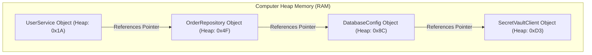
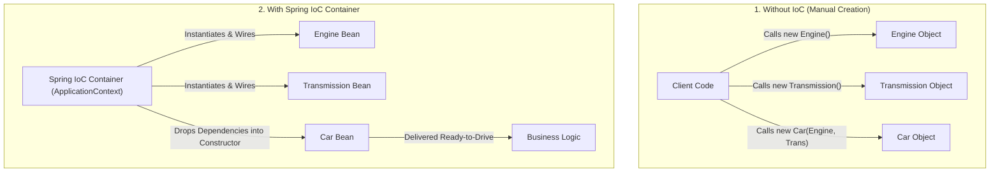
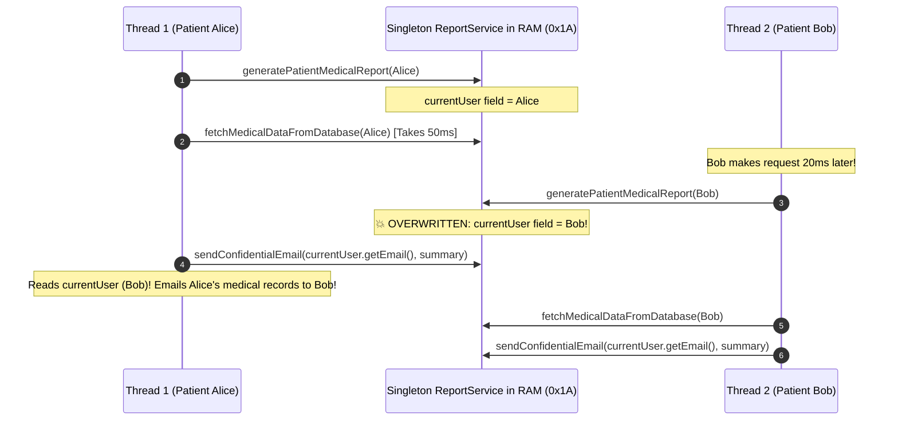
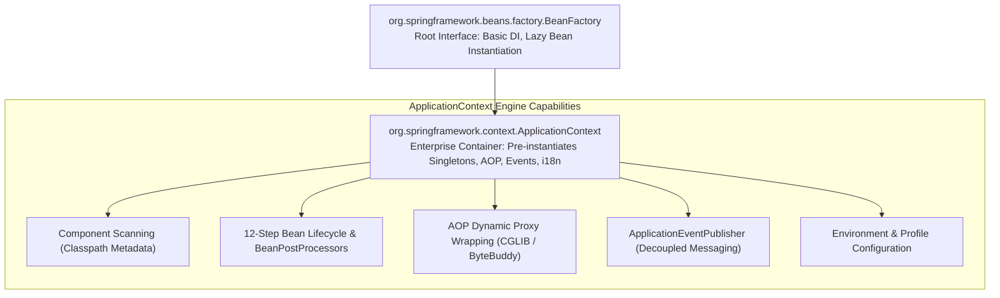
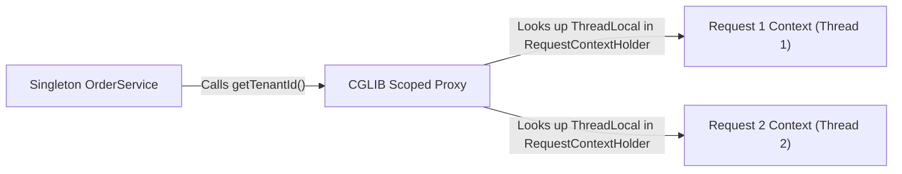
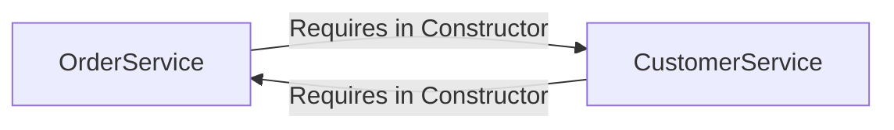

## Prerequisites: Before You Begin

Before studying Spring IoC and Dependency Injection internals, ensure you understand:
- **Java OOP**: Memory allocation with `new`, constructors, interfaces, and reference pointers in RAM.
- **Java Multithreading**: How multiple OS threads execute code concurrently and access shared heap memory.
- **Basic Spring Annotations**: What `@Component`, `@Service`, and `@Repository` mean.

---

# Phase 1: Ground Floor (Physical First Principles)

## 1. The Concrete Construction Gridlock in RAM

To understand why Inversion of Control (IoC) exists, you must look at how computer memory (RAM) allocates objects and why hardcoded creation causes architectural gridlock.



In basic Java, if class A needs class B, class A manually creates it using the `new` operator:

```java
public class UserService {
    // Tightly coupled: UserService controls how, when, and with what config OrderRepository is born!
    private final OrderRepository orderRepository = new OrderRepository(
        new DatabaseConfig("jdbc:postgresql://localhost:5432/mydb", "user", "secret_pass")
    );
}
```

What happens when your project grows to 50 real-world classes?
- `UserService` needs `OrderRepository`, which needs `DatabaseConfig`, which needs `VaultSecretsClient`, which needs `HttpClient`.
- To instantiate `UserService`, every caller must write:
  ```java
  UserService service = new UserService(
      new OrderRepository(
          new DatabaseConfig(
              new VaultSecretsClient(
                  new HttpClient(new ConnectionPool(50))
              )
          )
      )
  );
  ```
- **The Construction Gridlock**: If the developer of `DatabaseConfig` adds a `timeoutSeconds` parameter to its constructor, **every single `new` call across your entire application and test suite breaks simultaneously**!
- Furthermore, you cannot unit test `UserService` in isolation. Because `OrderRepository` is hardcoded with `new`, running a unit test physically attempts to open a network socket to `localhost:5432`!

---

## 2. Inversion of Control: The Automobile Assembly Factory

Inversion of Control (IoC) flips this responsibility using the **Hollywood Principle**: *"Don't call us, we'll call you."*



Instead of classes calling `new`, an external entity—the **Spring IoC Container**—acts like an automobile assembly factory:
1. It manufactures the engine (`DatabaseConfig`).
2. It manufactures the transmission (`OrderRepository`) and bolts the engine into it.
3. It drops the completed assembly into the car chassis (`UserService`).
4. `UserService` simply receives its dependencies ready to work, with zero knowledge of how they were assembled.

---

# Phase 2: The Naive Code (The Production Crash)

When developers use Spring without understanding container internals, they introduce subtle, dangerous bugs that pass code review but cause catastrophic data breaches in production.

---

## Catastrophe 1: The Mutable Singleton Data Breach (Thread Safety Disaster)

By default, **all Spring beans are Singletons**. The container creates **exactly one instance** of `UserService` in JVM heap memory. That single instance is shared simultaneously across all 200 Tomcat web worker threads handling incoming HTTP traffic.

A beginner writes this service:

```java
// NAIVE CODE: CATASTROPHIC MULTI-THREADED DATA LEAK!
@Service
public class ReportService {

    // FATAL MISTAKE: Storing mutable state in a Singleton Spring Bean!
    private User currentUser;

    public void generatePatientMedicalReport(User user) {
        // Step 1: Assign user to instance variable
        this.currentUser = user;

        // Step 2: Fetch and format medical records (Takes 50ms)
        String medicalSummary = fetchMedicalDataFromDatabase(this.currentUser.getId());

        // Step 3: Email report to the user
        sendConfidentialEmail(this.currentUser.getEmail(), medicalSummary);
    }
}
```

### Why Production Crashes Under Load



1. Tomcat Thread 1 receives a request from **Patient Alice**. It sets `this.currentUser = Alice`.
2. While Thread 1 is waiting 50 milliseconds for the database, Tomcat Thread 2 receives a request from **Patient Bob**.
3. Thread 2 executes `this.currentUser = Bob`, **overwriting Alice's pointer in shared heap memory**!
4. Thread 1 resumes and sends the email to `this.currentUser.getEmail()`. Because the field was overwritten, **Alice's confidential medical records are emailed directly to Bob!**

### Production Fix: Complete Statelessness

Singleton beans must be **100% stateless**. Never store user, request, or transaction data in instance variables. Pass data strictly through local method arguments allocated on the thread's private stack:

```java
@Service
public class ReportService {

    private final MedicalRecordRepository repository;
    private final EmailClient emailClient;

    // Constructor injection: Dependencies are immutable final references
    public ReportService(MedicalRecordRepository repository, EmailClient emailClient) {
        this.repository = repository;
        this.emailClient = emailClient;
    }

    // Thread-safe: User is a local reference on the thread stack frame!
    public void generatePatientMedicalReport(User user) {
        String medicalSummary = repository.fetchSummary(user.getId());
        emailClient.sendEmail(user.getEmail(), medicalSummary);
    }
}
```

---

## Catastrophe 2: Field Injection (`@Autowired`) & Test Paralysis

A beginner injects dependencies directly into private fields:

```java
// NAIVE CODE: UNTESTABLE & BRITTLE FIELD INJECTION!
@Service
public class OrderService {

    @Autowired
    private OrderRepository orderRepository;

    @Autowired
    private PaymentClient paymentClient;

    public void processOrder(Order order) {
        orderRepository.save(order);
        paymentClient.authorize(order.paymentRequest());
    }
}
```

### Why Field Injection Is Dangerous

1. **Test Paralysis**: In a plain JUnit test, you cannot instantiate `OrderService` without spinning up a heavy Spring context or using Java reflection to violently break private field encapsulation (`ReflectionTestUtils`).
2. **Hidden Bloat (SRP Violation)**: Adding 15 dependencies via `@Autowired private ...` looks like 15 short lines. With constructor injection, a constructor with 15 parameters immediately rings alarm bells that the class violates the Single Responsibility Principle.
3. **Broken Immutability**: Fields cannot be declared `final`. Dependencies can be mutated or reassigned at runtime.

### Production Fix: Constructor Injection With Final Fields

```java
@Service
public class OrderService {

    private final OrderRepository orderRepository;
    private final PaymentClient paymentClient;

    public OrderService(OrderRepository orderRepository, PaymentClient paymentClient) {
        this.orderRepository = orderRepository;
        this.paymentClient = paymentClient;
    }

    public void processOrder(Order order) {
        orderRepository.save(order);
        paymentClient.authorize(order.paymentRequest());
    }
}
```

Line by line:
- `private final OrderRepository orderRepository`: The `final` keyword guarantees reference immutability once created.
- Constructor parameters are automatically resolved by Spring without requiring `@Autowired` (when there is a single constructor).
- The class can be tested in 1 millisecond using plain Java: `new OrderService(mockRepo, mockPayment)`.

---

# Phase 3: Under the Hood (Container Mechanics & Bytecode)

## 1. Container Hierarchy: `BeanFactory` vs `ApplicationContext`

Spring's IoC container is organized into two core hierarchical interfaces:



| Dimension | `BeanFactory` | `ApplicationContext` (Spring Boot Default) |
| :--- | :--- | :--- |
| **Instantiation Strategy** | **Lazy**: Beans are instantiated only when `getBean()` is explicitly requested. | **Eager**: All singletons are pre-instantiated and validated at application startup. |
| **Fail-Fast Detection** | Slow: Missing dependencies fail at runtime during real user requests. | **Immediate**: Misconfigured dependencies fail fast during startup before opening HTTP ports. |
| **AOP & Proxies** | Requires manual post-processor registration. | Fully automated support for `@Transactional`, `@Async`, `@Cacheable`. |
| **Enterprise Features** | Minimal: Bare-bones object graph. | Internationalization (i18n), Event publishing, Web application scopes. |

---

## 2. The 12-Step Spring Bean Lifecycle

When Spring boots up, every singleton bean passes through a strictly orchestrated 12-step lifecycle:

```mermaid
sequenceDiagram
    autonumber
    participant Scanner as Component Scanner (@ComponentScan)
    participant Reg as BeanDefinitionRegistry
    participant BFPP as BeanFactoryPostProcessor
    participant Inst as Instantiation (Constructor)
    participant Populate as Property Population (DI)
    participant Aware as Aware Interfaces (BeanNameAware)
    participant BPP_Pre as BeanPostProcessor (Before Init)
    participant Init as @PostConstruct & afterPropertiesSet()
    participant BPP_Post as BeanPostProcessor (After Init / CGLIB Proxy!)
    participant Ready as Singleton Cache (ConcurrentHashMap)
    participant Destroy as @PreDestroy & DisposableBean

    Scanner->>Reg: 1. Discovers classes & registers BeanDefinitions
    Reg->>BFPP: 2. BFPP modifies BeanDefinitions (e.g. resolves ${...} placeholders)
    BFPP->>Inst: 3. Calls constructor to allocate object in heap
    Inst->>Populate: 4. Injects dependencies into constructor / setters
    Populate->>Aware: 5. Injects Aware interfaces (BeanNameAware, ApplicationContextAware)
    Aware->>BPP_Pre: 6. postProcessBeforeInitialization()
    BPP_Pre->>Init: 7. Executes @PostConstruct & InitializingBean
    Init->>BPP_Post: 8. postProcessAfterInitialization()
    Note over BPP_Post: CRITICAL: Wraps bean in CGLIB dynamic proxy<br/>for @Transactional, @Async, @Secured!
    BPP_Post->>Ready: 9. Fully initialized bean stored in singletonObjects cache
    Note over Ready: Application serves production traffic...
    Ready->>Destroy: 10. On shutdown, executes @PreDestroy cleanup
```

### The 12 Steps Explained in Plain English

1. **BeanDefinition Parsing**: Spring scans the classpath for `@Component`, `@Service`, and `@Bean` definitions and creates an in-memory catalog of `BeanDefinition` metadata.
2. **BeanFactoryPostProcessor Execution**: Before any bean is instantiated, beans implementing `BeanFactoryPostProcessor` (like `PropertySourcesPlaceholderConfigurer`) run to resolve property placeholders (`${database.url}`).
3. **Instantiation**: Spring uses reflection or Constructor MethodHandles to allocate memory for the raw object on the JVM heap.
4. **Populate Bean (Dependency Injection)**: Spring resolves and injects required dependencies into the constructor or setters.
5. **Aware Callbacks**: If the bean implements `BeanNameAware`, `BeanFactoryAware`, or `ApplicationContextAware`, Spring passes references to the container itself.
6. **BeanPostProcessor (Before Initialization)**: Custom interceptors execute `postProcessBeforeInitialization()`. This is where `CommonAnnotationBeanPostProcessor` discovers and runs `@PostConstruct` methods.
7. **InitializingBean (`afterPropertiesSet`)**: Spring invokes `InitializingBean.afterPropertiesSet()` or custom `initMethod` attributes.
8. **BeanPostProcessor (After Initialization - PROXY CREATION)**: `AnnotationAwareAspectJAutoProxyCreator` checks if the bean has `@Transactional`, `@Async`, or `@PreAuthorize`. If so, it wraps the raw bean in a **CGLIB Dynamic Proxy subclass** and returns the proxy!
9. **Singleton Cache Registration**: The completed bean (or its proxy wrapper) is placed into `DefaultSingletonBeanRegistry.singletonObjects` (a thread-safe `ConcurrentHashMap`).
10. **Application Running**: The bean serves incoming production traffic.
11. **Pre-Destruction**: On JVM shutdown hook, `CommonAnnotationBeanPostProcessor` invokes `@PreDestroy` methods.
12. **Destruction Callbacks**: Spring calls `DisposableBean.destroy()`, closes network sockets, flushes buffers, and releases resources.

---

## 3. Bean Scopes & The Scoped Proxy Trap

Spring provides 6 standard bean scopes:

| Scope | Lifecycle Duration | Where It Lives |
| :--- | :--- | :--- |
| **Singleton** (Default) | Exactly 1 instance per `ApplicationContext`. | JVM Heap (`singletonObjects` map). |
| **Prototype** | Fresh instance created on every single injection or `getBean()`. | Ephemeral. Garbage collected when dereferenced. |
| **Request** | 1 instance per HTTP request lifecycle. | Tied to current HTTP thread stack. |
| **Session** | 1 instance per HTTP Session. | Stored in Tomcat session storage. |
| **Application** | 1 instance per `ServletContext`. | Web application context. |
| **Websocket** | 1 instance per WebSocket session. | WebSocket session attributes. |

### The Scoped Proxy Trap

What happens if a Singleton bean injects a `@RequestScope` bean?

```java
// HAZARD: INJECTING REQUEST SCOPE INTO SINGLETON!
@Component
@RequestScope
public class UserRequestContext {
    private String tenantId;
    private String userId;
    // getters and setters
}

@Service // SINGLETON BEAN!
public class OrderService {

    // FATAL MISTAKE: Injected once at startup!
    private final UserRequestContext requestContext;

    public OrderService(UserRequestContext requestContext) {
        this.requestContext = requestContext;
    }

    public void process() {
        // Reads stale or crashed context from the first request!
        String tenant = requestContext.getTenantId();
    }
}
```

Because `OrderService` is a Singleton, it is instantiated **once at startup**. It resolves its dependencies once. The `UserRequestContext` injected into it remains frozen forever, causing cross-request data corruption!

### The Production Fix: Scoped Proxies

Configure `proxyMode = ScopedProxyMode.TARGET_CLASS`:

```java
@Component
@Scope(value = WebApplicationContext.SCOPE_REQUEST, proxyMode = ScopedProxyMode.TARGET_CLASS)
public class UserRequestContext {
    private String tenantId;
    private String userId;
}
```



Spring injects a dynamic CGLIB proxy into `OrderService`. When `orderService.process()` calls `requestContext.getTenantId()`, the proxy intercepts the call, fetches the current thread's `HttpServletRequest` from `RequestContextHolder`, and delegates to the request-specific instance!

---

## 4. Disambiguation: `@Primary`, `@Qualifier` & Dynamic Strategy Maps

When multiple beans implement the same interface, Spring cannot guess which bean you want:

```java
public interface PaymentProcessor { void process(BigDecimal amount); }

@Component public class StripeProcessor implements PaymentProcessor { ... }
@Component public class PaypalProcessor implements PaymentProcessor { ... }
```

Injecting `PaymentProcessor` without disambiguation crashes on startup with:
```console
NoUniqueBeanDefinitionException: expected single matching bean but found 2: paypalProcessor,stripeProcessor
```

### 1. `@Primary` vs `@Qualifier`

```java
// @Primary defines the default fallback bean
@Component
@Primary
public class StripeProcessor implements PaymentProcessor { ... }

// @Qualifier explicitly targets a named bean
@Service
public class CheckoutService {
    private final PaymentProcessor processor;

    public CheckoutService(@Qualifier("paypalProcessor") PaymentProcessor processor) {
        this.processor = processor;
    }
}
```

### 2. Eliminating `switch` Statements with Dynamic Strategy Maps

Instead of hardcoded `if-else` blocks, Spring can automatically discover all strategy beans and inject them into a `Map<String, Strategy>` where the map keys match the bean names:

```java
@Service
public class PaymentDispatcherService {

    // Spring automatically populates this map with ALL PaymentProcessor beans!
    private final Map<String, PaymentProcessor> processors;

    public PaymentDispatcherService(Map<String, PaymentProcessor> processors) {
        this.processors = processors;
    }

    public void dispatch(String provider, BigDecimal amount) {
        // provider: "stripeProcessor" or "paypalProcessor"
        PaymentProcessor processor = processors.get(provider);
        if (processor == null) {
            throw new IllegalArgumentException("Unsupported payment gateway: " + provider);
        }
        processor.process(amount); // O(1) dynamic dispatch! Zero switch statements!
    }
}
```

---

## 5. Circular Dependencies & Spring 3-Level Cache

What happens if Service A requires Service B in its constructor, and Service B requires Service A?



In Spring Boot 2.6+ and 3.x, constructor circular references are **strictly forbidden by default** and crash application startup with:
```console
BeanCurrentlyInCreationException: Error creating bean with name 'orderService': 
Requested bean is currently in creation: Is there an unresolvable circular reference?
```

### How Spring Historically Resolved Setter Circular References (The 3-Level Cache)

Inside `DefaultSingletonBeanRegistry`, Spring maintains 3 internal `Map` caches:

1. `singletonObjects` (First-Level Cache): Stores fully initialized, ready-to-use beans.
2. `earlySingletonObjects` (Second-Level Cache): Stores partially created beans (allocated in heap, but properties not yet injected).
3. `singletonFactories` (Third-Level Cache): Stores factory lambdas (`ObjectFactory<?>`) that can expose early proxy references.

### Why `@Lazy` Is an Architectural Anti-Pattern

Adding `@Lazy` tells Spring to inject a synthetic placeholder proxy:
```java
@Service
public class OrderService {
    public OrderService(@Lazy CustomerService customerService) { ... }
}
```

While this allows the application to boot, **`@Lazy` is a code smell**:
- It hides high coupling and violates the Single Responsibility Principle.
- It introduces runtime concurrency deadlocks if both beans initialize simultaneously under multi-threaded traffic.

**The Clean Fix**: Decouple the beans using **Spring Domain Events**:

```java
// OrderService publishes an event instead of calling CustomerService directly
@Service
public class OrderService {
    private final ApplicationEventPublisher eventPublisher;

    public OrderService(ApplicationEventPublisher eventPublisher) {
        this.eventPublisher = eventPublisher;
    }

    public void completeOrder(Long orderId, Long customerId) {
        eventPublisher.publishEvent(new OrderCompletedEvent(orderId, customerId));
    }
}

// CustomerService listens to the event: ZERO circular references!
@Service
public class CustomerService {
    @EventListener
    public void onOrderCompleted(OrderCompletedEvent event) {
        addRewardPoints(event.customerId());
    }
}
```

---

# Phase 4: Senior Interview Ace & Verification

## The Senior Engineer vs Junior Engineer Mindset

| Scenario | Junior Engineer Answer | Staff / Senior Engineer Answer |
| :--- | :--- | :--- |
| **Why is Constructor Injection preferred over Field Injection?** | "It's cleaner and recommended by Spring docs." | "Constructor injection enforces three guarantees: (1) Immutability via `final` fields, (2) Pure unit testability without spinning up an ApplicationContext or using reflection, and (3) Fail-fast startup validation preventing `NullPointerExceptions` if dependencies are missing." |
| **What is the difference between `BeanFactory` and `ApplicationContext`?** | "ApplicationContext has more features." | "`BeanFactory` is the root container interface using lazy instantiation (`getBean()`). `ApplicationContext` is the enterprise container used by Spring Boot that eagerly instantiates singletons at startup for fail-fast validation, and provides AOP proxy generation, event publishing, and environment property resolution." |
| **What happens when a Prototype bean is injected into a Singleton?** | "Spring creates a new prototype instance every time you call its methods." | "The Scoped Proxy Trap: The singleton is instantiated once at startup, so its dependencies are resolved only once. The prototype bean is injected once and retained forever, degrading into a singleton. To fix this, use `ScopedProxyMode.TARGET_CLASS` or inject an `ObjectProvider<T>`." |

---

## Active Recall & Interview Mastery

<AccordionGroup>
  <Accordion title="1. Explain the 12 steps of the Spring Bean Lifecycle from classpath scanning to destruction.">
    1. Scan classpath and register `BeanDefinition` metadata.<br/>
    2. Execute `BeanFactoryPostProcessor` implementations to resolve property placeholders.<br/>
    3. Instantiate raw object on the JVM heap via reflection/constructor.<br/>
    4. Populate bean properties and inject dependencies.<br/>
    5. Invoke Aware callbacks (`BeanNameAware`, `ApplicationContextAware`).<br/>
    6. Run `BeanPostProcessor.postProcessBeforeInitialization()` (executes `@PostConstruct`).<br/>
    7. Execute `InitializingBean.afterPropertiesSet()` and custom `initMethod`.<br/>
    8. Run `BeanPostProcessor.postProcessAfterInitialization()` (wraps bean in CGLIB proxy for `@Transactional`/`@Async`).<br/>
    9. Store fully initialized bean in `DefaultSingletonBeanRegistry.singletonObjects` cache.<br/>
    10. Serve application traffic.<br/>
    11. Execute `@PreDestroy` callbacks on JVM shutdown hook.<br/>
    12. Invoke `DisposableBean.destroy()` to release resources.
  </Accordion>

  <Accordion title="2. Why is storing mutable state in a Singleton Spring Bean catastrophic in production?">
    Spring beans are Singletons by default, meaning exactly one instance exists in heap memory. Tomcat handles incoming HTTP requests using a thread pool of 200 worker threads. If a singleton bean has a mutable instance variable (e.g. `private User currentUser`), multiple concurrent threads read and write to that exact same memory location simultaneously, causing race conditions where user data from Thread 1 is overwritten by Thread 2, resulting in severe privacy leaks and data corruption.
  </Accordion>

  <Accordion title="3. How does Spring resolve setter circular dependencies using the 3-level cache?">
    When Service A is instantiated, Spring places an `ObjectFactory` lambda for Service A into the 3rd level cache (`singletonFactories`). When Service A requests Service B, Service B is created and requests Service A. Service B finds Service A's factory in the 3rd level cache, creates an early proxy reference for Service A, places it into the 2nd level cache (`earlySingletonObjects`), and injects it. Service B finishes and enters the 1st level cache (`singletonObjects`). Finally, Service A receives completed Service B and moves to the 1st level cache.
  </Accordion>

  <Accordion title="4. Why does Spring Boot 3 disable circular references by default, and how should you refactor them?">
    Circular references (`A -> B -> A`) represent architectural coupling and violate the Single Responsibility Principle. They make systems brittle, impede modularization, and can trigger thread initialization deadlocks. Rather than bypassing them with `@Lazy`, developers should refactor the code by introducing a third coordinator service, or decouple the interaction using asynchronous or transactional domain events (`ApplicationEventPublisher` and `@EventListener`).
  </Accordion>

  <Accordion title="5. What is the Scoped Proxy pattern, and why is it mandatory when injecting Request-scoped beans into Singletons?">
    Because a Singleton bean is instantiated once at startup, any direct dependency injected into its constructor is evaluated only once. Injecting a `@RequestScope` bean directly would freeze the first HTTP request's context inside the singleton forever. By setting `proxyMode = ScopedProxyMode.TARGET_CLASS`, Spring injects a dynamic CGLIB proxy. When the singleton invokes a method on the proxy, the proxy dynamically retrieves the current thread's active `HttpServletRequest` from `RequestContextHolder` and delegates to the correct per-request instance.
  </Accordion>

  <Accordion title="6. How does dynamic Strategy Map injection work in Spring IoC, and how does it replace switch statements?">
    Spring can automatically inject all beans implementing an interface into a `Map<String, InterfaceName>`. Spring sets the map keys to the bean names (e.g., `@Component("STRIPE")`). Business services can query this map directly in $O(1)$ constant time (`map.get(type)`), adhering strictly to the Open/Closed Principle: new payment gateways or algorithms can be added simply by creating a new `@Component` class without modifying existing service code.
  </Accordion>

  <Accordion title="7. What is the difference between BeanPostProcessor and BeanFactoryPostProcessor?">
    `BeanFactoryPostProcessor` operates on the container's **metadata** (`BeanDefinition`) before any bean instances are created; it can read or modify property values and add bean definitions (e.g. `PropertySourcesPlaceholderConfigurer`). `BeanPostProcessor` operates on actual **bean instances** after they have been instantiated by the constructor, allowing customization, initialization callback execution (`@PostConstruct`), and wrapping beans in dynamic AOP proxies.
  </Accordion>

  <Accordion title="8. How does ObjectProvider solve optional and prototype dependency resolution?">
    `ObjectProvider<T>` is a variant of `Provider<T>` that offers variant-safe resolution methods: `getIfAvailable()`, `getIfUnique()`, and `getObject()`. When used with Prototype-scoped beans, calling `provider.getObject()` on every invocation guarantees that a brand new prototype instance is manufactured on demand without needing scoped proxies or violating inversion of control.
  </Accordion>
</AccordionGroup>

---

## Done Checklist

<Check>
- [ ] Understand Inversion of Control as an automotive assembly factory eliminating manual `new` constructor gridlock.
- [ ] Diagram the 12-step Spring Bean Lifecycle from `BeanDefinition` discovery to `@PreDestroy`.
- [ ] Identify Step 8 (`postProcessAfterInitialization`) as the exact point where AOP CGLIB proxies wrap beans.
- [ ] Differentiate `BeanFactory` (lazy, bare-bones) from `ApplicationContext` (eager, fail-fast, enterprise).
- [ ] Enforce strict thread-safety: ensure all Singleton beans are 100% stateless with zero mutable instance fields.
- [ ] Eliminate Field Injection in favor of Constructor Injection with immutable `final` dependencies.
- [ ] Understand the 6 Spring bean scopes (Singleton, Prototype, Request, Session, Application, Websocket).
- [ ] Prevent Prototype and Request scope degeneration inside Singletons using `ScopedProxyMode.TARGET_CLASS`.
- [ ] Disambiguate multiple interface implementations using `@Primary` and `@Qualifier`.
- [ ] Replace complex `switch`/`if-else` blocks with dynamic `Map<String, Strategy>` injection.
- [ ] Explain why Spring Boot 3 forbids circular references by default (`spring.main.allow-circular-references=false`).
- [ ] Trace Spring's 3-level cache (`singletonObjects`, `earlySingletonObjects`, `singletonFactories`).
- [ ] Refactor circular dependencies cleanly using `ApplicationEventPublisher` domain events instead of `@Lazy`.
- [ ] Differentiate `BeanFactoryPostProcessor` (metadata modification) from `BeanPostProcessor` (instance proxying).
- [ ] Write plain JUnit 5 unit tests for Spring services without spinning up an `ApplicationContext`.
</Check>
