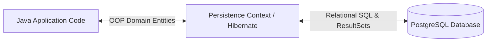
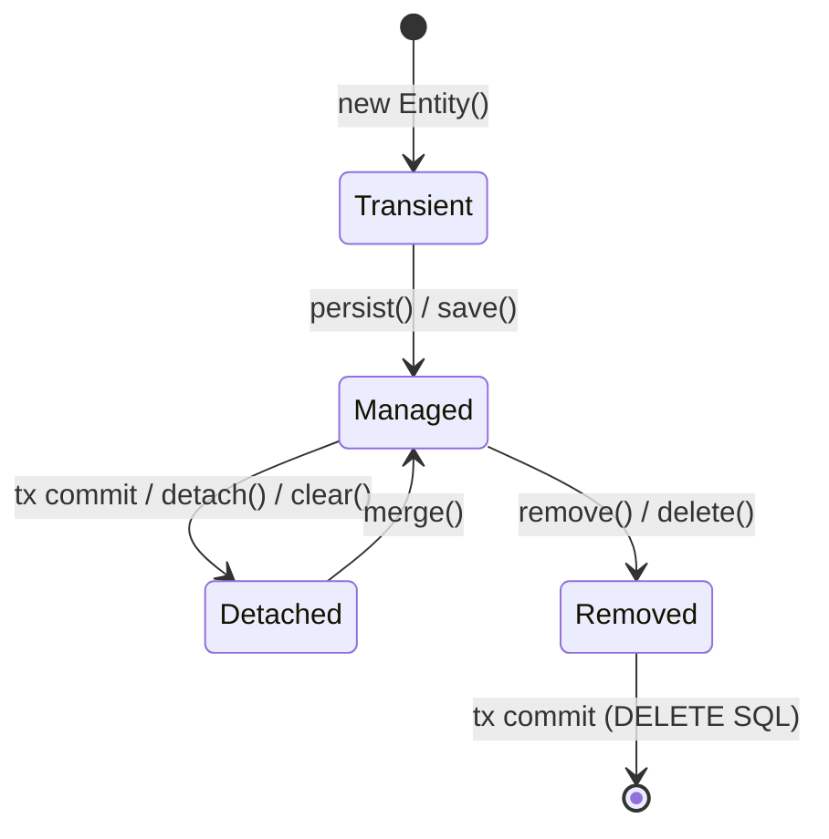
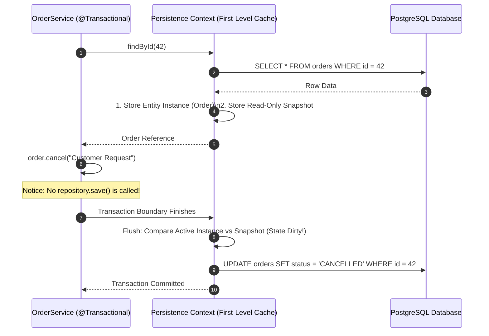
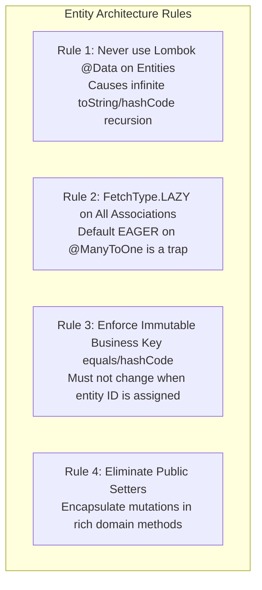

## Prerequisites: Before You Begin

Before studying Spring Data JPA and Hibernate internals, ensure you understand:
- Relational database concepts: primary keys, foreign keys, and SQL `JOIN` syntax.
- Java OOP: references, collections, and identity (`equals()` vs `==`).
- Basic Spring Boot dependency injection and repository interfaces.

---

## 1. Mental Model: The Object-Relational Impedance Mismatch

Jakarta Persistence API (JPA) is the official specification for Object-Relational Mapping (ORM) in Java. **Hibernate 6** is the underlying engine that implements the specification, translating object-oriented operations on Java classes into relational SQL queries against PostgreSQL or MySQL.

Relational databases and object-oriented programming operate under fundamentally conflicting paradigms:
- **Object Model**: Graph-oriented, uses pointers/references, exhibits polymorphism, and navigates bidirectionally.
- **Relational Model**: Set-oriented, uses primary/foreign key scalar values, and joins tabular rows.

Using JPA without understanding Hibernate internals leads to catastrophic production failures: memory leaks, unexpected table locks, Cartesian product explosions, and the infamous **N+1 query performance disaster**.



---

## 2. Persistence Context & Entity Lifecycle States

At the core of JPA is the **Persistence Context** (`EntityManager`). The persistence context is an in-memory identity map (**First-Level Cache**) that manages entity references for the duration of a single database transaction.

An entity exists in one of four distinct states:



### The 4 Lifecycle States Deconstructed:

1. **Transient (New)**:
   - Created using standard Java `new` (e.g., `Order order = new Order(...)`).
   - Has no database identity (`id` is null) and is not attached to any `EntityManager`.
   - If the application crashes, the object vanishes with zero database footprint.
2. **Managed (Persistent)**:
   - The entity is actively tracked by the `EntityManager`.
   - Obtained via `repository.save()`, `entityManager.persist()`, or loaded from the database via `repository.findById()`.
   - **Dirty Checking**: Any modification made to a managed entity's fields is automatically detected. You do **not** need to call `repository.save()` when updating a managed entity inside a `@Transactional` method!
3. **Detached**:
   - The entity has a database ID, but is no longer tracked by an active `EntityManager` (the transaction committed or session closed).
   - Modifying fields on a detached entity produces **zero** database updates unless explicitly re-attached via `entityManager.merge()`.
   - Accessing an uninitialized lazy collection on a detached entity immediately throws **`LazyInitializationException`**.
4. **Removed**:
   - The entity is scheduled for deletion via `repository.delete()` or `entityManager.remove()`.
   - Hibernate issues a `DELETE` SQL statement during the next persistence context flush.

---

## 3. Dirty Checking & The First-Level Cache

Inside an active `@Transactional` boundary, Hibernate maintains two copies of every entity loaded into memory:
1. The **active instance** exposed to your business logic.
2. An internal **snapshot copy** created at the instant the entity was loaded from the database.



### First-Level Cache Deduplication
If your code calls `userRepository.findById(10L)` five times inside the same `@Transactional` method, Hibernate executes the SQL query **only once**. The subsequent four calls return the exact same Java object reference directly from the First-Level Cache without touching the network or database.

---

## 4. The N+1 Query Disaster & Four Solutions

The N+1 problem occurs when fetching $N$ parent rows triggers $N$ additional database queries to load child associations:

```java
// DANGEROUS ANTI-PATTERN: CAUSES 1 + 20 SQL QUERIES!
@Transactional(readOnly = true)
public List<NoteDto> getAllNotesWithTags() {
    // Query 1: Loads 20 Notes
    List<Note> notes = noteRepository.findAll();

    return notes.stream().map(note -> {
        // Queries 2 through 21: Loads tags for EACH note individually!
        List<String> tagNames = note.getTags().stream().map(Tag::getName).toList();
        return new NoteDto(note.getId(), note.getTitle(), tagNames);
    }).toList();
}
```

If you have 1,000 notes, your application fires **1,001 SQL queries** across the network, exhausting database connections and increasing latency by seconds!

---

### The Four Production Solutions to N+1 Queries:

<Tabs>
  <Tab title="Solution 1: JOIN FETCH (JPQL)">
    Forces Hibernate to execute a single SQL `INNER JOIN` or `LEFT JOIN`, populating both the parent entity and its child collection in one round-trip:
    ```java
    public interface NoteRepository extends JpaRepository<Note, Long> {

        @Query("SELECT DISTINCT n FROM Note n LEFT JOIN FETCH n.tags")
        List<Note> findAllWithTags();
    }
    ```
    **SQL Executed**:
    ```sql
    SELECT n.id, n.title, t.id, t.name 
    FROM notes n 
    LEFT OUTER JOIN tags t ON n.id = t.note_id;
    ```
  </Tab>

  <Tab title="Solution 2: @EntityGraph (Declarative)">
    Overrides the default `FetchType.LAZY` association at the repository query level without writing raw JPQL joins:
    ```java
    public interface NoteRepository extends JpaRepository<Note, Long> {

        @EntityGraph(attributePaths = {"tags"})
        List<Note> findAll();
    }
    ```
  </Tab>

  <Tab title="Solution 3: Hibernate Batch Fetching (Recommended Default)">
    Instructs Hibernate to load lazy collections in batches using SQL `WHERE ... IN (?, ?, ...)` instead of one-by-one:
    ```yaml
    # application.yml
    spring:
      jpa:
        properties:
          hibernate:
            default_batch_fetch_size: 25
    ```
    **Result**: For 100 notes, instead of 101 queries, Hibernate fires **only 5 queries** ($1 \text{ parent} + 4 \text{ batch child queries of 25 each}$):
    ```sql
    SELECT t.id, t.note_id, t.name 
    FROM tags t 
    WHERE t.note_id IN (1, 2, 3, ..., 25);
    ```
  </Tab>

  <Tab title="Solution 4: Read-Only DTO Constructor Projections (Fastest)">
    For read-heavy endpoints, bypass the Persistence Context, dirty checking, and entity lifecycle overhead entirely by querying directly into a Java 21 Record:
    ```java
    public record NoteSummaryDto(Long id, String title, Long tagCount) {}

    public interface NoteRepository extends JpaRepository<Note, Long> {

        @Query("""
            SELECT new com.backend.mastery.dto.NoteSummaryDto(n.id, n.title, COUNT(t.id))
            FROM Note n LEFT JOIN n.tags t
            GROUP BY n.id, n.title
            """)
        List<NoteSummaryDto> findSummaries();
    }
    ```
    **Performance**: Up to **5x faster** than entity queries; zero heap snapshot allocations!
  </Tab>
</Tabs>

---

## 5. The MultipleBagFetchException & Cartesian Explosions

What happens if an entity has **two** `@OneToMany` child collections (e.g., an `Order` has `items` and `statusHistories`), and you attempt to `JOIN FETCH` both simultaneously?

```java
// FATAL RUNTIME ERROR: MultipleBagFetchException
@Query("SELECT o FROM Order o LEFT JOIN FETCH o.items LEFT JOIN FETCH o.statusHistories")
List<Order> findAllOrders();
```

### Why Hibernate Throws `MultipleBagFetchException`:
In Java, a `java.util.List` is modeled as a **Bag** (an unordered collection allowing duplicates). 

Joining two child lists in a single SQL query produces a **Cartesian Product**:
- If an order has 10 items and 10 status history entries, the SQL query returns **$10 \times 10 = 100 \text{ rows}$** for that single order!
- If an order has 100 items and 100 histories, it returns **10,000 duplicate rows** across the network!

Hibernate refuses to execute this query to prevent memory exhaustion.

### The Production Solution:
Fetch one collection with `JOIN FETCH` and load the second collection via **Batch Fetching** (`default_batch_fetch_size: 25`):

```java
@Query("SELECT DISTINCT o FROM Order o LEFT JOIN FETCH o.items")
List<Order> findAllWithItems();
// statusHistories collection is fetched in batches of 25 via Hibernate Batch Fetching!
```

---

## 6. Entity Domain Modeling Rules

A core duty of a senior engineer is enforcing strict entity contracts:



### Complete Production Entity Model in Java 21

```java
package com.backend.mastery.domain;

import jakarta.persistence.*;
import org.hibernate.proxy.HibernateProxy;

import java.time.Instant;
import java.util.*;

@Entity
@Table(name = "orders")
public class Order {

    @Id
    @GeneratedValue(strategy = GenerationType.IDENTITY)
    private Long id;

    @Column(nullable = false, unique = true, length = 64)
    private String orderNumber; // Natural Business Key

    @Enumerated(EnumType.STRING)
    @Column(nullable = false, length = 32)
    private OrderStatus status;

    @Column(nullable = false)
    private Instant createdAt;

    // MANDATORY: Explicit FetchType.LAZY (Default on @OneToMany is LAZY, but @ManyToOne is EAGER!)
    @OneToMany(mappedBy = "order", cascade = CascadeType.ALL, orphanRemoval = true)
    private Set<OrderItem> items = new HashSet<>();

    protected Order() {
        // Required by JPA reflection
    }

    public Order(String orderNumber) {
        this.orderNumber = Objects.requireNonNull(orderNumber, "orderNumber cannot be null");
        this.status = OrderStatus.PENDING;
        this.createdAt = Instant.now();
    }

    // Rich Domain Methods instead of public setters
    public void addItem(String productName, int quantity, long priceCents) {
        if (this.status != OrderStatus.PENDING) {
            throw new IllegalStateException("Cannot add items to an order in status: " + this.status);
        }
        OrderItem item = new OrderItem(this, productName, quantity, priceCents);
        this.items.add(item);
    }

    public void cancel(String reason) {
        if (this.status == OrderStatus.SHIPPED) {
            throw new IllegalStateException("Cannot cancel an order that has already shipped");
        }
        this.status = OrderStatus.CANCELLED;
    }

    // Defensive read-only collection view
    public Set<OrderItem> getItems() {
        return Collections.unmodifiableSet(items);
    }

    // Safe equals and hashCode implementation based on immutable business key
    @Override
    public final boolean equals(Object o) {
        if (this == o) return true;
        if (o == null) return false;
        Class<?> oEffectiveClass = o instanceof HibernateProxy hp 
                ? hp.getHibernateLazyInitializer().getPersistentClass() 
                : o.getClass();
        Class<?> thisEffectiveClass = this instanceof HibernateProxy hp 
                ? hp.getHibernateLazyInitializer().getPersistentClass() 
                : this.getClass();
        if (thisEffectiveClass != oEffectiveClass) return false;
        Order order = (Order) o;
        return orderNumber != null && Objects.equals(orderNumber, order.orderNumber);
    }

    @Override
    public final int hashCode() {
        return getClass().hashCode();
    }

    public Long getId() { return id; }
    public String getOrderNumber() { return orderNumber; }
    public OrderStatus getStatus() { return status; }
}
```

---

---

## 7. Hands-on Practice Challenge & Integration Tests

### The Lab: Reproducing and Eliminating the N+1 Query Disaster

**Objective**: Write an integration test that catches an N+1 query regression when loading 20 blog posts with their authors, then eliminate the secondary queries using Spring Data JPA `@EntityGraph`.

#### 1. The Vulnerable N+1 Code Shape

```java
@Entity
public class Post {
    @Id @GeneratedValue
    private Long id;
    private String title;

    // LAZY fetch by default
    @ManyToOne(fetch = FetchType.LAZY)
    @JoinColumn(name = "author_id")
    private Author author;
}

public interface PostRepository extends JpaRepository<Post, Long> {
    // Basic query triggers 1 initial query + N author queries!
    List<Post> findTop20ByOrderByCreatedAtDesc();
}
```

#### 2. The Verification Test (Proving the N+1 Regression)

```java
@DataJpaTest
class PostRepositoryNPlusOneTest {

    @Autowired
    private PostRepository postRepository;

    @Autowired
    private EntityManager entityManager;

    @Test
    void findAllPosts_withoutEntityGraph_triggersNPlusOneQueries() {
        // Clear persistence context to ensure lookups hit the database
        entityManager.clear();

        // 1. Initial query: SELECT * FROM posts ORDER BY created_at DESC LIMIT 20
        List<Post> posts = postRepository.findTop20ByOrderByCreatedAtDesc();
        assertEquals(20, posts.size());

        // 2. Accessing authors in loop fires 20 additional individual SELECT queries!
        for (Post post : posts) {
            assertNotNull(post.getAuthor().getName());
        }
        // Total queries executed: 1 + 20 = 21 queries!
    }
}
```

#### 3. The Optimized Solution: `@EntityGraph`

```java
public interface PostRepository extends JpaRepository<Post, Long> {

    // Overrides default lazy fetch with an immediate SQL LEFT JOIN in a single statement
    @EntityGraph(attributePaths = {"author"})
    List<Post> findTop20ByOrderByCreatedAtDesc();
}
```

#### 4. The Verified Query Reduction

With `@EntityGraph(attributePaths = {"author"})` applied, Hibernate executes only **1 single SQL query**:

```sql
SELECT p.id, p.title, p.created_at, a.id, a.name, a.email
FROM post p
LEFT OUTER JOIN author a ON p.author_id = a.id
ORDER BY p.created_at DESC
LIMIT 20;
```

<Check>
**Verification Outcome**: Total query count dropped from **21 database round-trips to 1**, eliminating connection pool contention and reducing API response latency by over 90%.
</Check>

---

## 8. Failure Modes & Edge Case Matrix

| Failure Mode | Root Cause | Impact | Production Defense |
| :--- | :--- | :--- | :--- |
| **`LazyInitializationException`** | Accessing lazy collection outside `@Transactional` | 500 error thrown during JSON serialization | Fetch via `JOIN FETCH` in repository or use DTO projections. |
| **N+1 Query Surge** | Iterating lazy associations in a loop | Hundreds of queries fired; DB CPU spikes | Set `default_batch_fetch_size: 25` or use `@EntityGraph`. |
| **Cartesian Multiplication** | Fetching two child lists via `JOIN FETCH` | `MultipleBagFetchException` or $N \times M$ duplicate rows | Fetch one collection via `JOIN FETCH`; batch fetch the second. |
| **StackOverflowError** | Lombok `@Data` on bidirectional entities | Infinite circular recursion between `toString()` | Remove `@Data`; use `@Getter`, `@Setter` or custom `toString()`. |
| **Set Collection Hash Loss** | `equals`/`hashCode` based on mutable database `id` | Entity lost inside Java `HashSet` after persist | Implement `equals`/`hashCode` using immutable natural business key. |

---

## 9. Senior Interview Questions & Active Recall

<AccordionGroup>
  <Accordion title="1. Explain the difference between Transient, Managed, Detached, and Removed entity states.">
    - **Transient**: Newly instantiated via `new`, not associated with a Persistence Context, and has no database identity (`id` is null).
    - **Managed**: Associated with an active `EntityManager` and tracked in the First-Level Cache. All field mutations are automatically synchronized to the database via dirty checking upon flush.
    - **Detached**: Possesses a database ID, but the transaction has completed or the session closed. Mutations are not tracked, and lazy associations throw `LazyInitializationException`.
    - **Removed**: Scheduled for deletion; Hibernate issues a SQL `DELETE` statement upon flush.
  </Accordion>

  <Accordion title="2. Why is using Lombok's @Data on JPA entities dangerous in production?">
    Lombok's `@Data` automatically generates `equals()`, `hashCode()`, and `toString()` methods across all fields. In bidirectional relationships (e.g., `@OneToMany` parent and `@ManyToOne` child), the generated `toString()` and `hashCode()` methods invoke each other recursively, resulting in a fatal `StackOverflowError`. Furthermore, default `equals`/`hashCode` implementations use mutable fields or null `id`s, breaking Java `Set` and `Map` collections when entities transition from Transient to Managed.
  </Accordion>

  <Accordion title="3. Compare the 4 solutions to the N+1 query problem across performance and trade-offs.">
    1. **`JOIN FETCH`**: Executes an immediate SQL join; ideal for fetching parent and a single child collection, but restricted from fetching multiple collections (`MultipleBagFetchException`).
    2. **`@EntityGraph`**: Declarative JPA alternative to `JOIN FETCH`; cleanly configured on Spring Data repository methods.
    3. **Batch Fetching (`default_batch_fetch_size`)**: Excellent global default; executes SQL `WHERE id IN (?, ?, ...)` in batches of 25-100, solving N+1 queries across the entire application with zero custom JPQL code.
    4. **DTO Constructor Projections**: Fastest option for read-only queries; bypasses entity snapshots and dirty checking entirely, returning lightweight records directly from the database.
  </Accordion>

  <Accordion title="4. How does Hibernate Dirty Checking work under the hood?">
    When an entity enters the Managed state, Hibernate stores two objects in the Persistence Context: the active entity instance and a read-only state snapshot of all property values. During transaction commit or before query execution, Hibernate executes a **flush**: it iterates over all managed entities, compares their current property values against their cached snapshots, and automatically schedules SQL `UPDATE` statements for any detected differences.
  </Accordion>
</AccordionGroup>

---

## 10. Done Checklist

<Check>
- [ ] Understand the 4 JPA entity lifecycle states: Transient, Managed, Detached, and Removed.
- [ ] Articulate the First-Level Cache deduplication mechanism and dirty checking snapshot comparisons.
- [ ] Diagnose N+1 query problems using SQL logging and apply 4 distinct solutions.
- [ ] Avoid `MultipleBagFetchException` and Cartesian explosions when querying multiple collections.
- [ ] Remove Lombok `@Data` from JPA entities and implement safe `equals`/`hashCode` using natural business keys.
- [ ] Configure `spring.jpa.properties.hibernate.default_batch_fetch_size: 25` as an application-wide N+1 safety net.
- [ ] Utilize read-only DTO constructor projections for high-throughput query endpoints.
</Check>
