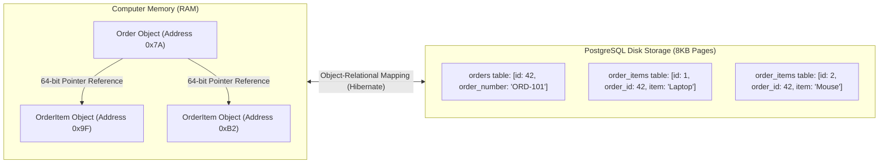
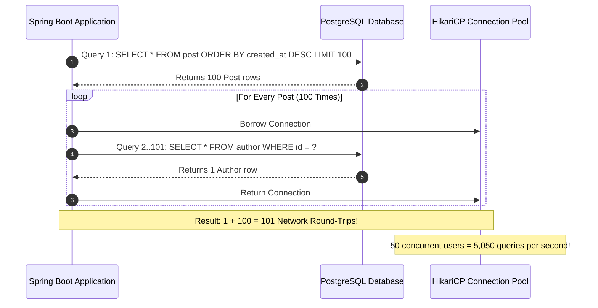
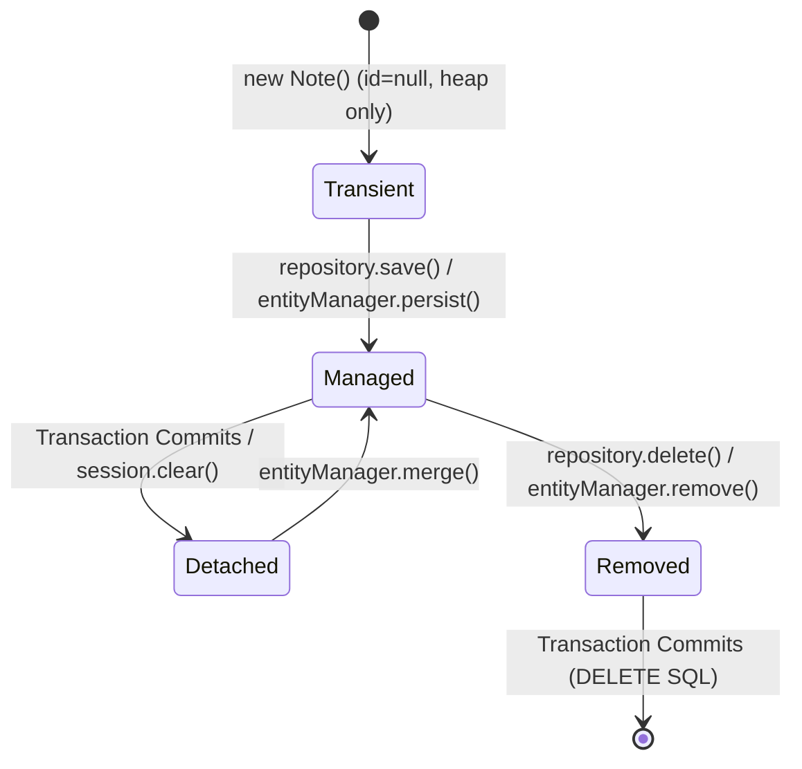
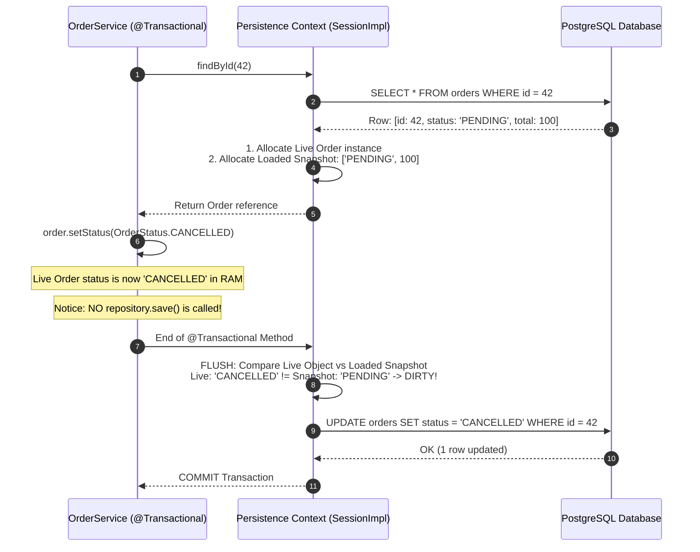
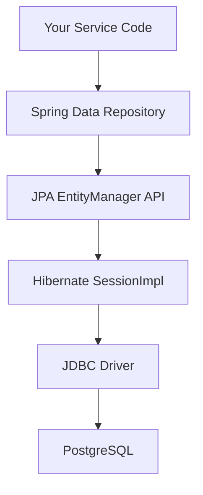
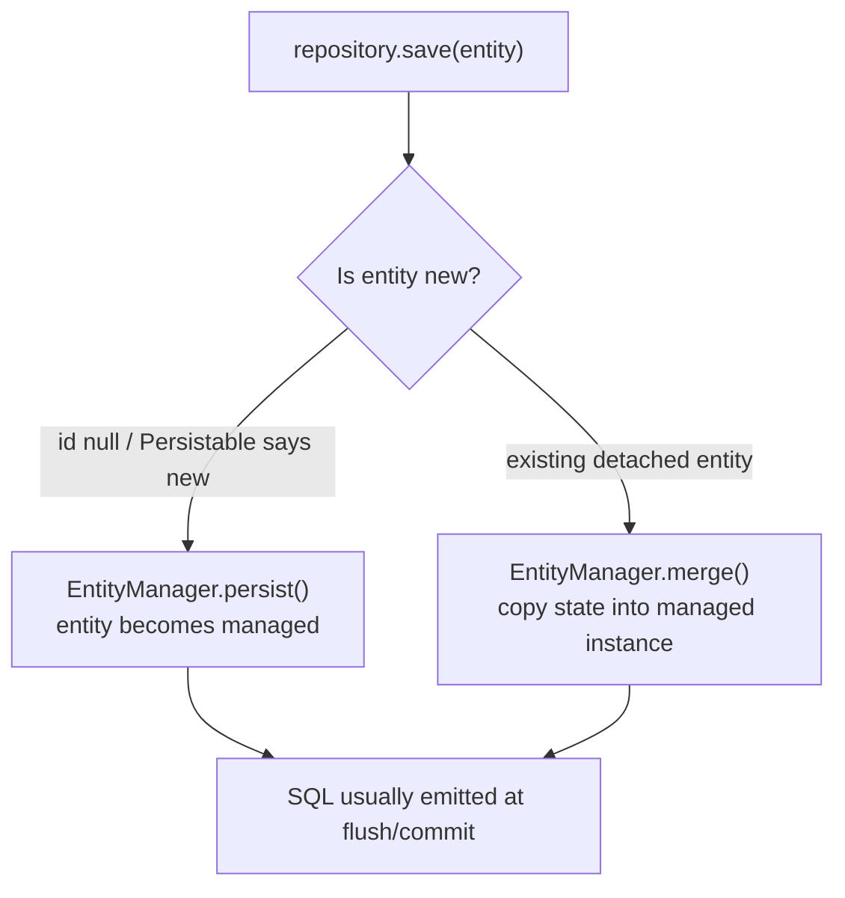
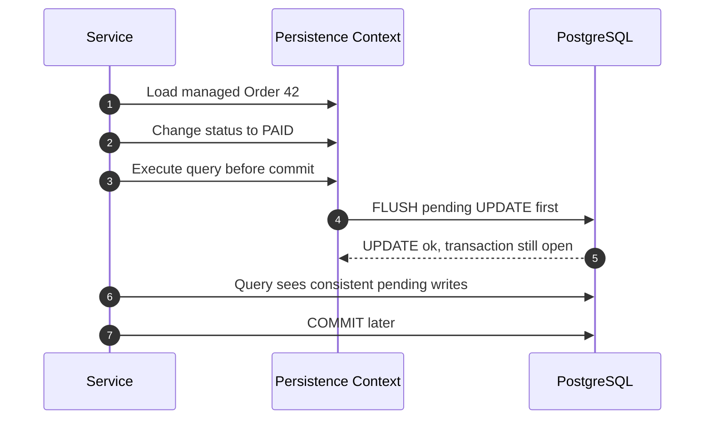

## Prerequisites: Before You Begin

Before studying Spring Data JPA and Hibernate internals, ensure you understand:
- Relational database concepts: tables, primary keys, foreign keys, and SQL `JOIN` syntax.
- Java OOP: memory references, collections (`List`, `Set`, `Map`), and object identity (`equals()` vs `==`).
- Basic Spring Boot repository interfaces (`JpaRepository`).

---

# Phase 1: Ground Floor (Physical First Principles)

To understand why Object-Relational Mapping (ORM) exists, you must first understand the physical friction between **computer memory (RAM)** and **disk storage (SSD/HDD)**.



### 1. The Object Model (How Java Thinks in RAM)
In Java, data is stored in the JVM Heap as a **graph of interconnected objects**:
- An `Order` object has a field `private List<OrderItem> items`.
- Physically, `items` is a **64-bit memory pointer** (memory address like `0x7ffee4`) pointing to an `ArrayList` in RAM.
- You navigate relationships by following memory pointers: `order.getItems().get(0).getProductName()`.
- Java supports polymorphism, inheritance (`Order` extends `BaseEntity`), and bidirectional references.

### 2. The Relational Model (How PostgreSQL Thinks on Disk)
In PostgreSQL or MySQL, data is stored on disk in **flat 2-dimensional tabular files (8KB pages)**:
- There are no memory pointers. Tables do not contain "objects."
- Relationships are represented strictly by scalar values called **Foreign Keys** (`order_id = 42`).
- To navigate relationships, the database engine must execute mathematical set joins (`JOIN order_items ON orders.id = order_items.order_id`).

### 3. The Object-Relational Impedance Mismatch
This fundamental conflict is known as the **Object-Relational Impedance Mismatch**:
- **Granularity**: Java has rich domain objects (Money, Address, Email). Databases have primitive scalar columns (`VARCHAR`, `BIGINT`, `TIMESTAMP`).
- **Identity**: Java determines identity using `==` (memory address) or `equals()`. Databases determine identity exclusively by Primary Key scalar equality (`id = 42`).
- **Navigation**: Java traverses pointer graphs in memory instantly (nanoseconds). Databases require relational SQL queries over network sockets (milliseconds).

### The Historical Pain: Life Before JPA (Raw JDBC)
Before ORMs existed, Java developers had to manually write raw JDBC boilerplate to bridge this gap:

```java
// What developers wrote in 2002 before Hibernate:
Connection conn = dataSource.getConnection();
PreparedStatement stmt = conn.prepareStatement("SELECT id, title, content FROM notes WHERE user_id = ?");
stmt.setLong(1, userId);
ResultSet rs = stmt.executeQuery();
List<Note> notes = new ArrayList<>();
while (rs.next()) {
    Note note = new Note();
    note.setId(rs.getLong("id"));
    note.setTitle(rs.getString("title"));
    note.setContent(rs.getString("content"));
    notes.add(note);
}
rs.close();
stmt.close();
conn.close();
```

If your table had 30 columns, you had to write 30 manual getters and setters. If you added a column, you had to update every SQL string by hand. 

**Hibernate** was created to automate this translation: converting Java object graphs into SQL tables, and SQL result sets back into Java object graphs.

---

# Phase 2: The Naive Code (The Production Crash)

When a new Java developer begins using Spring Data JPA, they treat database entities like regular in-memory Java objects. This instinctively leads to two catastrophic production failures.

### Catastrophe 1: The N+1 Query Waterfall Crash

Imagine you are building a dashboard showing 100 blog posts, and for each post, you want to display the author's name:

```java
// NAIVE CONTROLLER CODE: LOOKS CLEAN, BUT DESTROYS PRODUCTION!
@GetMapping("/posts")
public List<PostSummaryDto> getRecentPosts() {
    // Step 1: Fetch 100 posts
    List<Post> posts = postRepository.findTop100ByOrderByCreatedAtDesc();

    // Step 2: Loop through each post and read the author
    return posts.stream().map(post -> {
        // FATAL LINE: Triggers an individual SQL query on every single loop iteration!
        String authorName = post.getAuthor().getName();
        return new PostSummaryDto(post.getId(), post.getTitle(), authorName);
    }).toList();
}
```



#### What Physically Happens in Production:
1. **Network Saturation**: Instead of 1 query, your application fires **101 individual network requests** over the network card to the PostgreSQL server.
2. **Connection Pool Starvation**: Each query borrows a connection from HikariCP. Under high traffic (e.g. 50 users load the dashboard at once), **5,050 SQL queries flood the pool**.
3. **The 30-Second Timeout**: HikariCP's default `connection-timeout` is 30,000ms. When all 10 connections are exhausted, incoming threads freeze waiting for a connection.
4. **Tomcat Thread Pool Exhaustion**: All 200 Tomcat worker threads lock up. The server stops accepting HTTP traffic, and clients receive `504 Gateway Timeout` and `ConnectionTimeoutException: Request timed out after 30000ms`.

---

#### Production Fix: Fetch Exactly The Shape The API Needs

```java
public interface PostRepository extends JpaRepository<Post, Long> {

    @Query("""
        select new com.example.PostSummaryDto(p.id, p.title, a.name)
        from Post p
        join p.author a
        order by p.createdAt desc
        limit 100
        """)
    List<PostSummaryDto> findRecentPostSummaries();
}
```

Line by line:

- `select new ... PostSummaryDto(...)` tells Hibernate to build DTOs directly instead of managed `Post` entities.
- `p.id, p.title, a.name` fetches only fields the API needs.
- `join p.author a` loads the author name in the same SQL query instead of lazily querying per post.
- `order by p.createdAt desc` preserves the dashboard ordering.
- `limit 100` caps response size at the database boundary.
- `List<PostSummaryDto>` makes accidental lazy loading impossible because DTOs do not have JPA proxies.

Proof task:

```console
Enable Hibernate SQL logging or a query-count test.
Call the old endpoint with 100 posts: observe 101 queries.
Call the DTO projection endpoint: observe 1 query.
Verify response JSON is unchanged for the client.
```

Senior phrasing: "For read endpoints, I prefer DTO projections when I do not need managed entity state. It avoids N+1, reduces heap pressure, and prevents accidental lazy loading during JSON serialization."

---

### Catastrophe 2: The "Vanishing Entity" HashSet Bug

A developer creates a `Note` entity and overrides `equals()` and `hashCode()` using the database `id`:

```java
// NAIVE CODE: BUG WAITING TO HAPPEN!
@Entity
public class Note {
    @Id
    @GeneratedValue(strategy = GenerationType.IDENTITY)
    private Long id;
    private String title;

    // Beginner mistake: using mutable database ID for hashCode
    @Override
    public boolean equals(Object o) {
        if (this == o) return true;
        if (!(o instanceof Note note)) return false;
        return id != null && id.equals(note.id);
    }

    @Override
    public int hashCode() {
        return Objects.hash(id); // If id is null, hashCode returns 0!
    }
}
```

#### The Production Failure Walkthrough:
```java
Set<Note> set = new HashSet<>();
Note note = new Note("Production Incident Runbook");

// 1. Entity is Transient. id is NULL.
// Objects.hash(null) evaluates to 0. The note is placed in bucket 0 of the HashSet!
set.add(note);

// 2. We save the note to the database.
// PostgreSQL generates a primary key: note.id is now 42!
noteRepository.save(note);

// 3. We check if the set contains our note:
boolean exists = set.contains(note);
System.out.println(exists); // PRINTS FALSE! The entity has vanished!
```

#### Why Did It Vanish?
When `set.contains(note)` is called, `HashSet` computes `note.hashCode()`. Because `note.id` is now `42`, its hash code is `Objects.hash(42)` (e.g., `734291`). 

Java looks for the entity in **Bucket 734291**. But the object was originally inserted into **Bucket 0** when its ID was `null`! The entity is still in RAM, but it is physically impossible to find.

---

# Phase 3: Under the Hood (Mechanics & Bytecode)

To master JPA, you must demystify how Hibernate works inside the JVM.

## 1. The Persistence Context & Entity Lifecycle States

At the core of JPA is the **Persistence Context** (`EntityManager` / Hibernate `SessionImpl`). The persistence context is an in-memory identity map (**First-Level Cache**) that lives for the lifetime of a single database transaction.



### The 4 States Deconstructed:
1. **Transient (New)**:
   - Created in Java memory with `new Note()`.
   - Has no database identity (`id == null`) and is not tracked by Hibernate. If the JVM crashes, it leaves zero trace in the database.
2. **Managed (Persistent)**:
   - Tracked inside Hibernate's internal hash tables.
   - Any field change is automatically saved via **Dirty Checking** when the transaction commits. You **never** need to call `repository.save()` on a managed entity!
3. **Detached**:
   - The entity has an ID from the database, but the transaction finished and the `EntityManager` closed.
   - Modifying fields on a detached entity produces **zero** database updates unless re-attached via `merge()`.
   - Reading an uninitialized lazy relation throws `LazyInitializationException`.
4. **Removed**:
   - Marked for deletion. Hibernate fires a SQL `DELETE` statement when the transaction flushes.

---

## 2. Dirty Checking: How Hibernate Detects Changes Without `save()`

Inside the `SessionImpl`, Hibernate maintains **two internal arrays** for every managed entity:
1. The **Live Entity Reference**: The actual object your Java code modifies.
2. The **Loaded State Snapshot**: An immutable array `Object[]` containing the exact column values loaded from the database.



<Tip>
**Senior Performance Insight**: Because Hibernate must keep an `Object[]` snapshot of every managed entity in memory, loading 50,000 entities into the Persistence Context doubles your JVM heap memory consumption! For read-only operations, use `@Transactional(readOnly = true)`—Hibernate skips snapshot generation and dirty checking comparisons, cutting CPU and memory overhead significantly.
</Tip>

---

## 3. Dynamic Bytecode Proxies: How Lazy Loading Works

When you configure an association with `FetchType.LAZY`:

```java
@ManyToOne(fetch = FetchType.LAZY)
@JoinColumn(name = "author_id")
private Author author;
```

How does Hibernate prevent loading the `Author` from the database when you fetch a `Post`?

### The ByteBuddy Dynamic Subclass
Hibernate does **not** set `post.author = null`. Instead, it uses **ByteBuddy** bytecode generation to synthesize a dynamic proxy subclass at runtime:

```java
// What Hibernate creates in bytecode behind the scenes:
public class Author$HibernateProxy$a8b2 extends Author implements HibernateProxy {
    private final LazyInitializer interceptor;
    private Author target = null; // The real database entity (starts null!)

    @Override
    public String getName() {
        if (target == null) {
            // Check if persistence context is still active:
            if (!session.isOpen()) {
                throw new LazyInitializationException("could not initialize proxy - no Session");
            }
            // Fire SQL query over JDBC to load the real author:
            this.target = (Author) session.get(Author.class, this.id);
        }
        return target.getName();
    }
}
```

### Why `LazyInitializationException` Happens:
If your transaction closes at the Service layer, the database connection is returned to HikariCP and the `Session` closes. 

When your Controller or Jackson JSON serializer tries to call `post.getAuthor().getName()`, the proxy interceptor checks `session.isOpen()`. Because the session is closed, it **cannot fire a SQL query**, and throws `LazyInitializationException`!

---

## 4. The Four Production Solutions to N+1 Queries

<Tabs>
  <Tab title="Solution 1: JOIN FETCH (JPQL)">
    Forces Hibernate to execute a single SQL `INNER JOIN` or `LEFT JOIN`, populating both the parent entity and child collection in **1 single network round-trip**:
    ```java
    public interface PostRepository extends JpaRepository<Post, Long> {
        @Query("SELECT DISTINCT p FROM Post p LEFT JOIN FETCH p.author")
        List<Post> findAllWithAuthors();
    }
    ```
    **SQL Executed**:
    ```sql
    SELECT p.id, p.title, a.id, a.name, a.email
    FROM post p
    LEFT OUTER JOIN author a ON p.author_id = a.id;
    ```
  </Tab>

  <Tab title="Solution 2: @EntityGraph (Declarative JPA)">
    Overrides lazy loading declaratively on the repository method without writing custom JPQL joins:
    ```java
    public interface PostRepository extends JpaRepository<Post, Long> {
        @EntityGraph(attributePaths = {"author"})
        List<Post> findTop100ByOrderByCreatedAtDesc();
    }
    ```
  </Tab>

  <Tab title="Solution 3: Batch Fetching (Application-Wide Safety Net)">
    Configures Hibernate to load lazy collections in batches using SQL `WHERE id IN (?, ?, ...)`:
    ```yaml
    # application.yml
    spring:
      jpa:
        properties:
          hibernate:
            default_batch_fetch_size: 25
    ```
    **Result**: For 100 posts, instead of 101 queries, Hibernate fires **only 5 queries** ($1 \text{ parent} + 4 \text{ batch child queries of 25 each}$):
    ```sql
    SELECT a.id, a.name, a.email 
    FROM author a 
    WHERE a.id IN (1, 2, 3, ..., 25);
    ```
  </Tab>

  <Tab title="Solution 4: Read-Only DTO Projections (Highest Throughput)">
    Bypasses the Persistence Context, dirty checking snapshots, and entity proxies entirely by selecting scalar fields directly into a Java 21 Record:
    ```java
    public record PostSummaryDto(Long id, String title, String authorName) {}

    public interface PostRepository extends JpaRepository<Post, Long> {
        @Query("""
            SELECT new com.backend.mastery.dto.PostSummaryDto(p.id, p.title, a.name)
            FROM Post p JOIN p.author a
            """)
        List<PostSummaryDto> findSummaries();
    }
    ```
    **Performance**: Up to **5x faster** than entity queries with **zero** heap snapshot allocation overhead!
  </Tab>
</Tabs>

---

## 5. The MultipleBagFetchException & Cartesian Explosions

What happens if an entity has **two** `@OneToMany` collections (e.g. an `Order` has `items` and `statusLogs`), and you attempt to `JOIN FETCH` both in one query?

```java
// FATAL RUNTIME ERROR: MultipleBagFetchException!
@Query("SELECT o FROM Order o LEFT JOIN FETCH o.items LEFT JOIN FETCH o.statusLogs")
List<Order> findFullOrders();
```

### Why Hibernate Refuses to Run This:
In Java, a `List` is modeled as a **Bag** (an unordered collection allowing duplicates). Joining two child tables in SQL produces a mathematical **Cartesian Product**:
- If an order has 10 items and 10 logs, the SQL query returns **$10 \times 10 = 100 \text{ rows}$** for that single order!
- If an order has 100 items and 100 logs, SQL returns **10,000 duplicate rows** across the network!

Hibernate throws `MultipleBagFetchException` to protect your database and network from exploding.

### The Production Fix:
Fetch one collection with `JOIN FETCH`, and load the second collection using **Batch Fetching** (`default_batch_fetch_size: 25`):
```java
@Query("SELECT DISTINCT o FROM Order o LEFT JOIN FETCH o.items")
List<Order> findWithItems();
// o.statusLogs will be fetched in chunks of 25 automatically without Cartesian explosion!
```

---

## 6. Entity Domain Modeling Standard in Java 21

```java
package com.backend.mastery.domain;

import jakarta.persistence.*;
import org.hibernate.proxy.HibernateProxy;
import java.time.Instant;
import java.util.*;

@Entity
@Table(name = "orders")
public class Order {

    @Id
    @GeneratedValue(strategy = GenerationType.IDENTITY)
    private Long id;

    // Natural Business Key: immutable, unique, non-null
    @Column(nullable = false, unique = true, length = 64)
    private String orderNumber;

    @Enumerated(EnumType.STRING)
    @Column(nullable = false, length = 32)
    private OrderStatus status;

    @Column(nullable = false)
    private Instant createdAt;

    // ALWAYS explicit FetchType.LAZY
    @OneToMany(mappedBy = "order", cascade = CascadeType.ALL, orphanRemoval = true)
    private Set<OrderItem> items = new HashSet<>();

    protected Order() {
        // Required by JPA reflection / ByteBuddy proxies
    }

    public Order(String orderNumber) {
        this.orderNumber = Objects.requireNonNull(orderNumber, "orderNumber cannot be null");
        this.status = OrderStatus.PENDING;
        this.createdAt = Instant.now();
    }

    // Rich Domain Methods: enforce invariants instead of public setters
    public void addItem(String productName, int quantity, long priceCents) {
        if (this.status != OrderStatus.PENDING) {
            throw new IllegalStateException("Cannot add items to order in status: " + this.status);
        }
        OrderItem item = new OrderItem(this, productName, quantity, priceCents);
        this.items.add(item);
    }

    public void cancel() {
        if (this.status == OrderStatus.SHIPPED) {
            throw new IllegalStateException("Cannot cancel an order that has already shipped");
        }
        this.status = OrderStatus.CANCELLED;
    }

    // Defensive unmodifiable view
    public Set<OrderItem> getItems() {
        return Collections.unmodifiableSet(items);
    }

    // Safe equals/hashCode contract: works with Hibernate ByteBuddy proxies!
    @Override
    public final boolean equals(Object o) {
        if (this == o) return true;
        if (o == null) return false;
        Class<?> oEffectiveClass = o instanceof HibernateProxy hp 
                ? hp.getHibernateLazyInitializer().getPersistentClass() 
                : o.getClass();
        Class<?> thisEffectiveClass = this instanceof HibernateProxy hp 
                ? hp.getHibernateLazyInitializer().getPersistentClass() 
                : this.getClass();
        if (thisEffectiveClass != oEffectiveClass) return false;
        Order order = (Order) o;
        return orderNumber != null && Objects.equals(orderNumber, order.orderNumber);
    }

    @Override
    public final int hashCode() {
        return getClass().hashCode();
    }

    public Long getId() { return id; }
    public String getOrderNumber() { return orderNumber; }
    public OrderStatus getStatus() { return status; }
}
```

---

# Phase 4: Senior Interview Ace (Junior vs. Staff Phrasing)

When senior interviewers ask about Spring Data JPA, they are testing whether you understand **physical runtime behavior** or simply memorized annotations.

### Q1: "Do you need to call `repository.save()` when updating an entity inside a `@Transactional` service method?"

```diff
- JUNIOR ANSWER:
  "Yes, you should always call repository.save(entity) at the end of the method 
   to make sure the changes are written back to the database."
```

```diff
+ SENIOR / STAFF ANSWER:
  "No, calling repository.save() is redundant on managed entities. 
   When an entity is loaded inside a @Transactional boundary, it enters the Managed state 
   within the Persistence Context. Hibernate stores an immutable state snapshot array of the entity's 
   fields upon load. 
   
   During transaction commit, Hibernate's flush mechanism automatically performs dirty checking—comparing 
   the live entity against the loaded snapshot. If any field differs, it synthesizes and executes 
   an SQL UPDATE statement automatically. 
   
   Calling save() is harmless because SimpleJpaRepository.save() merely checks if the entity is new 
   and calls persist() or merge(), but omitting it demonstrates a true understanding of the Persistence Context."
```

---

### Q2: "What causes the N+1 query problem, and how do you resolve it in production?"

```diff
- JUNIOR ANSWER:
  "The N+1 problem happens when an entity has lazy relationships. You load one parent, and when you 
   loop through it, it fires N queries. You can fix it by changing FetchType.LAZY to FetchType.EAGER."
```

```diff
+ SENIOR / STAFF ANSWER:
  "Changing FetchType.LAZY to EAGER is an anti-pattern that makes the problem worse, because it forces 
   child queries to execute every time the entity is loaded application-wide, even when not needed.
   
   In production, we use a 4-tier strategy:
   1. For specific repository queries loading parent and child: Use 'JOIN FETCH' in JPQL or declarative '@EntityGraph' to join both tables in a single SQL round-trip.
   2. As an application-wide safety net: Configure 'hibernate.default_batch_fetch_size: 25-100'. This guarantees that any lazy traversal uses SQL 'WHERE id IN (?, ?, ...)', collapsing N queries into N/25 queries.
   3. For multiple collections: Avoid MultipleBagFetchException by fetching one collection with JOIN FETCH and allowing batch fetching to handle secondary collections.
   4. For read-heavy query APIs: Bypass entity snapshots and dirty checking entirely using read-only DTO Constructor Projections with Java 21 Records."
```

---

### Q3: "Why is Lombok's `@Data` considered dangerous on JPA entities?"

```diff
- JUNIOR ANSWER:
  "Lombok @Data creates boilerplate getters and setters. Some teams avoid it because it might cause performance issues."
```

```diff
+ SENIOR / STAFF ANSWER:
  "Lombok's @Data generates equals(), hashCode(), and toString() across all fields by default.
   
   This introduces two severe production hazards:
   1. Infinite Recursion StackOverflow: On bidirectional relationships (@OneToMany on parent, @ManyToOne on child), the generated toString() and hashCode() methods call each other in an infinite circular loop, instantly crashing the thread with a StackOverflowError during logging or serialization.
   2. Broken Hash Collections: If equals/hashCode use mutable fields or the auto-generated database id, an entity's hash code changes when persisted (id transitions from null to a generated value). If the entity was placed in a HashSet or HashMap prior to persisting, its hash bucket shifts, causing set.contains() to return false and corrupting collection state.
   
   We use @Getter, @Setter, and implement equals/hashCode manually using an immutable natural business key."
```

---

## Hands-on Practice Challenge & Integration Tests

### The Lab: Reproducing and Eliminating the N+1 Query Disaster

**Objective**: Write an integration test that catches an N+1 query regression when loading 20 blog posts with their authors, then eliminate the secondary queries using Spring Data JPA `@EntityGraph`.

#### 1. The Vulnerable N+1 Code Shape
```java
@Entity
public class Post {
    @Id @GeneratedValue
    private Long id;
    private String title;

    @ManyToOne(fetch = FetchType.LAZY)
    @JoinColumn(name = "author_id")
    private Author author;
}

public interface PostRepository extends JpaRepository<Post, Long> {
    List<Post> findTop20ByOrderByCreatedAtDesc();
}
```

#### 2. The Verification Test (Proving the N+1 Regression)
```java
@DataJpaTest
class PostRepositoryNPlusOneTest {

    @Autowired
    private PostRepository postRepository;

    @Autowired
    private EntityManager entityManager;

    @Test
    void findAllPosts_withoutEntityGraph_triggersNPlusOneQueries() {
        entityManager.clear(); // Clear cache to force database hits

        // Query 1: SELECT * FROM post ORDER BY created_at DESC LIMIT 20
        List<Post> posts = postRepository.findTop20ByOrderByCreatedAtDesc();
        assertEquals(20, posts.size());

        // Queries 2 through 21: Accessing author in loop fires 20 individual SELECT statements!
        for (Post post : posts) {
            assertNotNull(post.getAuthor().getName());
        }
        // Total queries executed: 1 + 20 = 21 queries!
    }
}
```

#### 3. The Optimized Solution: `@EntityGraph`
```java
public interface PostRepository extends JpaRepository<Post, Long> {
    @EntityGraph(attributePaths = {"author"})
    List<Post> findTop20ByOrderByCreatedAtDesc();
}
```

#### 4. The Verified Query Reduction
With `@EntityGraph(attributePaths = {"author"})`, Hibernate executes only **1 single SQL query**:
```sql
SELECT p.id, p.title, p.created_at, a.id, a.name, a.email
FROM post p
LEFT OUTER JOIN author a ON p.author_id = a.id
ORDER BY p.created_at DESC
LIMIT 20;
```

<Check>
**Verification Outcome**: Total query count dropped from **21 database round-trips to 1**, eliminating connection pool contention and reducing API response latency by over 90%.
</Check>

---

## JPA Fundamentals Interview Map

These questions are called "basic JPA" in interviews, but they require real mechanics.

### 1. What is the difference between JPA, Hibernate, and Spring Data JPA?

| Name | What It Is | What It Does |
| :--- | :--- | :--- |
| **JPA** | Java specification | Defines annotations and contracts such as `@Entity`, `EntityManager`, `persist`, `merge`, and JPQL |
| **Hibernate** | Implementation | Actually tracks entities, generates SQL, manages dirty checking, proxies, flushing, and caches |
| **Spring Data JPA** | Repository abstraction | Generates repository implementations and query methods on top of JPA/Hibernate |



**Senior answer:** "JPA is the contract, Hibernate is the engine, and Spring Data JPA is a convenience layer. When debugging performance, I think in Hibernate sessions, flushes, SQL generation, JDBC round trips, database plans, and transaction boundaries."

### 2. What exactly happens when `repository.save(entity)` runs?

`save()` does different things depending on whether the entity is new.



Important details:

- `persist()` attaches the same object instance to the persistence context.
- `merge()` returns a managed copy. The original detached object remains detached.
- SQL may not run immediately. Hibernate often waits until flush or transaction commit.
- `GenerationType.IDENTITY` usually forces an early insert because Hibernate needs the database-generated ID.

Common bug:

```java
Note detached = request.toEntity();
noteRepository.save(detached);
detached.rename("new title after save"); // This object may still be detached after merge.
```

Safer pattern:

```java
Note managed = noteRepository.findById(id).orElseThrow();
managed.rename(request.title());
// no save needed; dirty checking flushes at commit
```

### 3. What is flush?

Flush synchronizes the persistence context with the database. It does not necessarily commit.



Flush can happen:

- Before transaction commit.
- Before a JPQL query, so the query sees pending changes.
- When you call `entityManager.flush()`.

**Senior answer:** "Flush is SQL synchronization; commit is transaction durability. A flushed update can still roll back."

### 4. Why does lazy loading require an open transaction/session?

A lazy association starts as a proxy, not the real object.

```java
Post post = postRepository.findById(42L).orElseThrow();
Author author = post.getAuthor(); // proxy object
```

When code later calls:

```java
author.getName();
```

Hibernate must run SQL:

```sql
SELECT id, name
FROM authors
WHERE id = ?;
```

If the `EntityManager` is already closed, Hibernate has no active session to use. That is why this fails:

```console
org.hibernate.LazyInitializationException: could not initialize proxy - no Session
```

Correct fixes:

- Fetch the association deliberately with `JOIN FETCH` or `@EntityGraph`.
- Use DTO projections for read endpoints.
- Keep business work inside a transaction.

Bad fix:

```yaml
spring:
  jpa:
    open-in-view: true
```

Open Session in View hides the problem by keeping the session open during JSON serialization. It can move SQL execution into the web rendering phase, surprise you with N+1 queries, and hold database resources longer.

### 5. What is the owning side of a relationship?

In a relational database, the row with the foreign key owns the relationship.

```sql
CREATE TABLE comments (
  id BIGSERIAL PRIMARY KEY,
  post_id BIGINT NOT NULL REFERENCES posts(id)
);
```

In JPA:

```java
@ManyToOne(fetch = FetchType.LAZY)
@JoinColumn(name = "post_id")
private Post post;
```

The `Comment` owns the relationship because `comments.post_id` is the physical column Hibernate updates.

For bidirectional relationships:

```java
@OneToMany(mappedBy = "post")
private List<Comment> comments = new ArrayList<>();
```

`mappedBy = "post"` means: "The other side owns the foreign key. This collection is the inverse mirror."

**Common bug:** adding a comment only to `post.getComments()` but never setting `comment.setPost(post)`. The in-memory list changes, but the owning foreign key may not.

Use helper methods:

```java
public void addComment(Comment comment) {
    comments.add(comment);
    comment.attachToPost(this);
}
```

### 6. Why is pagination not optional?

This looks innocent:

```java
List<Order> orders = orderRepository.findAll();
```

In production, it can load millions of rows, allocate entity objects, create dirty-checking snapshots, trigger lazy loads, and crash the container.

Use bounded reads:

```java
PageRequest page = PageRequest.of(0, 50, Sort.by("createdAt").descending());
Slice<OrderSummary> orders = orderRepository.findByUserId(userId, page);
```

For very deep scrolling, prefer keyset pagination:

```sql
SELECT id, created_at, total_cents
FROM orders
WHERE user_id = ?
  AND (created_at, id) < (?, ?)
ORDER BY created_at DESC, id DESC
LIMIT 50;
```

### JPA Build-Break-Fix Lab

<Steps>
  <Step title="Build">
    Create `Post`, `Author`, and `Comment` entities with lazy relationships.
  </Step>
  <Step title="Break">
    Return `Post` entities directly from a controller and access `post.getAuthor().getName()` outside a transaction.
  </Step>
  <Step title="Observe">
    Capture `LazyInitializationException`, N+1 SQL logs, or recursive JSON serialization.
  </Step>
  <Step title="Fix">
    Replace entity responses with DTO projections and use `@EntityGraph` for required associations.
  </Step>
  <Step title="Prove">
    Add integration tests that assert the response shape and count the SQL statements for the list endpoint.
  </Step>
</Steps>

---

## Failure Modes & Edge Case Matrix

| Failure Mode | Root Cause | Impact | Production Defense |
| :--- | :--- | :--- | :--- |
| **`LazyInitializationException`** | Accessing lazy collection outside `@Transactional` | 500 error thrown during JSON serialization | Fetch via `JOIN FETCH` in repository or use DTO projections. |
| **N+1 Query Surge** | Iterating lazy associations in a loop | Hundreds of queries fired; DB CPU spikes | Set `default_batch_fetch_size: 25` or use `@EntityGraph`. |
| **Cartesian Multiplication** | Fetching two child lists via `JOIN FETCH` | `MultipleBagFetchException` or $N \times M$ duplicate rows | Fetch one collection via `JOIN FETCH`; batch fetch the second. |
| **StackOverflowError** | Lombok `@Data` on bidirectional entities | Infinite circular recursion between `toString()` | Remove `@Data`; use explicit getters/setters or custom `toString()`. |
| **Set Collection Hash Loss** | `equals`/`hashCode` based on mutable database `id` | Entity lost inside Java `HashSet` after persist | Implement `equals`/`hashCode` using immutable natural business key. |

---

## Done Checklist

<Check>
- [ ] Understand the physical Object-Relational Impedance Mismatch between JVM heap memory pointers and 8KB relational disk pages.
- [ ] Explain the 4 JPA entity lifecycle states: Transient, Managed, Detached, and Removed.
- [ ] Articulate the First-Level Cache deduplication mechanism and dirty checking snapshot comparisons.
- [ ] Understand why dynamic ByteBuddy proxies throw `LazyInitializationException` when sessions close.
- [ ] Diagnose N+1 query problems using SQL logging and apply 4 distinct production solutions.
- [ ] Avoid `MultipleBagFetchException` and Cartesian explosions when querying multiple collections.
- [ ] Eliminate Lombok `@Data` from JPA entities and implement safe `equals`/`hashCode` using natural business keys.
- [ ] Configure `spring.jpa.properties.hibernate.default_batch_fetch_size: 25` as an application-wide N+1 safety net.
- [ ] Utilize read-only DTO constructor projections for high-throughput query endpoints.
</Check>
