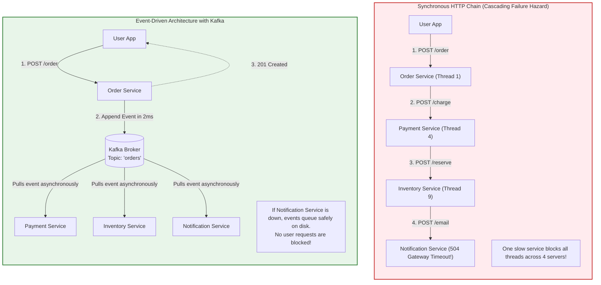
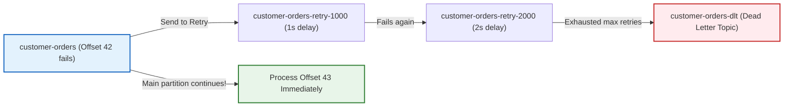

In distributed architectures, synchronous HTTP is a double-edged sword.

If your `OrderService` makes synchronous HTTP calls to `PaymentService`, `InventoryService`, `NotificationService`, and `AnalyticsService`, you have built a fragile chain of dominoes. If `NotificationService` takes 4 seconds to respond, `OrderService`'s Tomcat worker thread sits paused for 4 seconds. If `InventoryService` goes down, the entire checkout pipeline crashes.

This is why high-scale enterprise backends migrate to **event-driven architecture with Apache Kafka**. 

Instead of waiting for downstream services to finish, `OrderService` publishes an immutable event (`OrderPlacedEvent`) to an append-only commit log and finishes in 2 milliseconds. Downstream services consume the event independently at their own pace.

In this chapter, we bridge from the physical disk and network mechanics of Kafka up to production-grade Spring Boot implementation, covering producer safety, consumer commit semantics, non-blocking retry topics, and idempotent deduplication.

---

## 1. Physical Mental Model: Synchronous HTTP Chains vs. Kafka Append-Only Logs

Look at the difference between synchronous HTTP coupling and asynchronous event publishing:



---

## 2. Core Kafka Concepts in Plain English

Before writing Spring code, let us clarify the four fundamental building blocks of Kafka:

```mermaid
flowchart LR
    subgraph Topic["Topic: 'customer-orders'"]
        direction TB
        subgraph P0["Partition 0 (Append-Only Log on Disk)"]
            M0["Offset 0"] --- M1["Offset 1"] --- M2["Offset 2"] --- M3["Offset 3"]
        end
        subgraph P1["Partition 1 (Append-Only Log on Disk)"]
            M4["Offset 0"] --- M5["Offset 1"] --- M6["Offset 2"]
        end
    end

    Producer["OrderService (Producer)"] -->|Hash(customerId) % 2| Topic
    
    subgraph ConsumerGroup["Consumer Group: 'fulfillment-group'"]
        C1["Pod 1 (Listens to P0)"]
        C2["Pod 2 (Listens to P1)"]
    end

    P0 --> C1
    P1 --> C2

    style P0 fill:#e3f2fd,stroke:#1565c0,stroke-width:2px;
    style P1 fill:#fff3e0,stroke:#e65100,stroke-width:2px;
```

1. **Topic**: A category or feed name to which records are published. Think of it like a database table, except you only append records to the end; you never update or delete in place.
2. **Partition**: The physical unit of storage and parallelism on a Kafka broker. A topic is split into 1 or more partitions stored as sequential files on disk.
3. **Offset**: A monotonic 64-bit integer assigned to each message within a partition. It acts as the message's primary key and sequence number.
4. **Consumer Group**: A collection of cooperating worker instances (pods). Kafka guarantees that **each partition is assigned to exactly one consumer instance within a group**, enabling automatic load balancing without race conditions.

### The Partition Key & FIFO Ordering Rule

<Warning>
**The Golden Rule of Kafka Ordering**:
Kafka guarantees strict First-In-First-Out (FIFO) ordering **only within a single partition**, never across an entire topic!
</Warning>

If you publish messages without a key, Kafka distributes them randomly (round-robin) across partitions. If a customer creates an order, cancels it 2 seconds later, and the two messages land on different partitions, a consumer might process the cancellation **before** the creation!

**The Production Rule**:
Always provide an entity business key (e.g. `orderId`, `customerId`, `accountNumber`). Kafka hashes the key (`murmur2(key) % numPartitions`) to guarantee that all events for that specific entity always land on the **exact same partition in strict chronological order**.

---

## 3. Production Producer with `KafkaTemplate`

Spring Boot provides **`KafkaTemplate`** as a high-level abstraction for publishing messages.

### Maven Dependency
```xml
<dependency>
    <groupId>org.springframework.kafka</groupId>
    <artifactId>spring-kafka</artifactId>
</dependency>
```

### Producer Configuration (`application.yml`)

```yaml
spring:
  kafka:
    bootstrap-servers: localhost:9092
    producer:
      key-serializer: org.apache.kafka.common.serialization.StringSerializer
      value-serializer: org.springframework.kafka.support.serializer.JsonSerializer
      acks: all # Mandatory for zero data loss! Wait for all in-sync replicas to persist
      properties:
        enable.idempotence: true # Prevents duplicate messages produced by network retry timeouts
        max.in.flight.requests.per.connection: 5
        retries: 2147483647 # Retry indefinitely until broker acknowledges
        delivery.timeout.ms: 120000 # 2 minute delivery window
```

### Publishing Messages with Callback Handling

```java
package com.backend.mastery.kafka.producer;

import org.slf4j.Logger;
import org.slf4j.LoggerFactory;
import org.springframework.kafka.core.KafkaTemplate;
import org.springframework.kafka.support.SendResult;
import org.springframework.stereotype.Service;

import java.time.Instant;
import java.util.UUID;
import java.util.concurrent.CompletableFuture;

public record OrderPlacedEvent(
        String eventId,
        String orderId,
        String customerId,
        double amount,
        Instant timestamp
) {}

@Service
public class OrderEventProducer {

    private static final Logger log = LoggerFactory.getLogger(OrderEventProducer.class);
    private static final String TOPIC_ORDERS = "customer-orders";

    private final KafkaTemplate<String, Object> kafkaTemplate;

    public OrderEventProducer(KafkaTemplate<String, Object> kafkaTemplate) {
        this.kafkaTemplate = kafkaTemplate;
    }

    public void publishOrderPlaced(String orderId, String customerId, double amount) {
        OrderPlacedEvent event = new OrderPlacedEvent(
                UUID.randomUUID().toString(),
                orderId,
                customerId,
                amount,
                Instant.now()
        );

        // We use orderId as the partition key to guarantee FIFO ordering per order!
        CompletableFuture<SendResult<String, Object>> future = kafkaTemplate.send(TOPIC_ORDERS, orderId, event);

        future.whenComplete((result, ex) -> {
            if (ex != null) {
                log.error("CRITICAL: Failed to publish event {} to Kafka for order {}", event.eventId(), orderId, ex);
                // Trigger fallback: Write to a dead-letter database table or alert on-call
            } else {
                var metadata = result.getRecordMetadata();
                log.info("Published order {} to partition {} at offset {}",
                        orderId, metadata.partition(), metadata.offset());
            }
        });
    }
}
```

---

## 4. Production Consumer with `@KafkaListener`

Consuming messages in Spring Boot is declared using the `@KafkaListener` annotation on any managed bean method.

### Consumer Configuration (`application.yml`)

```yaml
spring:
  kafka:
    consumer:
      group-id: inventory-service-group
      auto-offset-reset: earliest # Read from beginning if no previous offset committed
      enable-auto-commit: false # Mandatory: Spring manages offset commits cleanly
      key-deserializer: org.apache.kafka.common.serialization.StringDeserializer
      value-deserializer: org.springframework.kafka.support.serializer.ErrorHandlingDeserializer
      properties:
        spring.deserializer.value.delegate.class: org.springframework.kafka.support.serializer.JsonDeserializer
        spring.json.trusted.packages: "com.backend.mastery.*"
    listener:
      ack-mode: RECORD # Commit offset after each message successfully processes
```

### Implementing the Consumer

```java
package com.backend.mastery.kafka.consumer;

import com.backend.mastery.kafka.producer.OrderPlacedEvent;
import org.slf4j.Logger;
import org.slf4j.LoggerFactory;
import org.springframework.kafka.annotation.KafkaListener;
import org.springframework.kafka.support.KafkaHeaders;
import org.springframework.messaging.handler.annotation.Header;
import org.springframework.messaging.handler.annotation.Payload;
import org.springframework.stereotype.Service;

@Service
public class InventoryOrderConsumer {

    private static final Logger log = LoggerFactory.getLogger(InventoryOrderConsumer.class);
    private final InventoryReservationService inventoryService;

    public InventoryOrderConsumer(InventoryReservationService inventoryService) {
        this.inventoryService = inventoryService;
    }

    @KafkaListener(
            topics = "customer-orders",
            groupId = "inventory-service-group",
            concurrency = "3" // Spins up 3 concurrent worker threads to process partitions in parallel
    )
    public void handleOrderPlaced(
            @Payload OrderPlacedEvent event,
            @Header(KafkaHeaders.RECEIVED_KEY) String key,
            @Header(KafkaHeaders.RECEIVED_PARTITION) int partition,
            @Header(KafkaHeaders.OFFSET) long offset
    ) {
        log.info("Processing order {} from partition {} at offset {}", event.orderId(), partition, offset);

        // Reserve inventory in database
        inventoryService.reserveStock(event.orderId(), event.amount());

        log.info("Successfully reserved stock for order {}", event.orderId());
    }
}
```

---

## 5. Non-Blocking Retries & Dead Letter Topics (DLT)

What happens if processing a message throws an exception (for example, the inventory database is experiencing a temporary network hiccup)?

### The Blocking Retry Trap

<Warning>
**The Partition Head-of-Line Blocking Trap**:
In naive Kafka setups, if message at offset 42 fails and the consumer retries it 10 times with a 5-second backoff, the entire partition is paused for **50 seconds**!
</Warning>

Every subsequent message on that partition (offsets 43, 44, 45...) sits frozen in line, unable to be processed, even if those messages belong to completely different customers and would have succeeded immediately!

### The Modern Solution: Spring Kafka `@RetryableTopic`

Spring Kafka 2.7+ introduced **Non-Blocking Retries**. If a message fails, Spring automatically forwards it to a separate retry topic (`customer-orders-retry-1000`, `customer-orders-retry-2000`) and commits the original offset immediately. The main partition continues processing subsequent messages without delay!

If all retries are exhausted, the message lands in a **Dead Letter Topic (DLT)** for engineer inspection:



### Implementing `@RetryableTopic`

```java
package com.backend.mastery.kafka.consumer;

import com.backend.mastery.kafka.producer.OrderPlacedEvent;
import org.slf4j.Logger;
import org.slf4j.LoggerFactory;
import org.springframework.kafka.annotation.DltHandler;
import org.springframework.kafka.annotation.KafkaListener;
import org.springframework.kafka.annotation.RetryableTopic;
import org.springframework.kafka.retrytopic.DltStrategy;
import org.springframework.kafka.retrytopic.TopicSuffixingStrategy;
import org.springframework.kafka.support.KafkaHeaders;
import org.springframework.messaging.handler.annotation.Header;
import org.springframework.retry.annotation.Backoff;
import org.springframework.stereotype.Service;

@Service
public class PaymentOrderConsumer {

    private static final Logger log = LoggerFactory.getLogger(PaymentOrderConsumer.class);

    @RetryableTopic(
            attempts = "4", // 1 initial attempt + 3 retries
            backoff = @Backoff(delay = 1000, multiplier = 2.0, maxDelay = 8000), // 1s, 2s, 4s
            autoCreateTopics = "true",
            topicSuffixingStrategy = TopicSuffixingStrategy.SUFFIX_WITH_DELAY_VALUE,
            dltStrategy = DltStrategy.FAIL_ON_ERROR
    )
    @KafkaListener(topics = "customer-orders", groupId = "payment-processor-group")
    public void processPayment(OrderPlacedEvent event) {
        log.info("Attempting payment for order: {}", event.orderId());

        if (event.amount() < 0) {
            // Fatal error: this will never succeed on retry!
            throw new IllegalArgumentException("Invalid negative payment amount: " + event.amount());
        }

        // Simulate call to third-party payment gateway
        chargeExternalGateway(event);
    }

    /**
     * DLT Handler: Invoked when all 3 retry attempts have failed
     */
    @DltHandler
    public void handleDeadLetterMessage(
            OrderPlacedEvent event,
            @Header(KafkaHeaders.RECEIVED_TOPIC) String topic,
            @Header(KafkaHeaders.EXCEPTION_MESSAGE) String error
    ) {
        log.error("CRITICAL: Message for order {} dead-lettered into topic {}. Root cause: {}",
                event.orderId(), topic, error);
        // Persist to audit failure table, trigger PagerDuty alert for on-call engineer
    }

    private void chargeExternalGateway(OrderPlacedEvent event) {
        // Business logic...
    }
}
```

---

## 6. The Idempotent Consumer Pattern (Duplicate Defense)

<Warning>
**The At-Least-Once Delivery Reality**:
In distributed messaging, network timeouts mean duplicate messages WILL arrive at your consumer!
</Warning>

Imagine this scenario:
1. Consumer processes `OrderPlacedEvent(id: 994)` and charges the customer $100.
2. Before the consumer can tell Kafka *"I finished offset 42"*, a network blip occurs or the consumer pod crashes.
3. Kafka reassigns the partition to another pod.
4. The new pod restarts from offset 42 and reads `OrderPlacedEvent(id: 994)` **again**.
5. Without deduplication, the customer is charged $100 twice!

### Implementing Idempotent Deduplication with PostgreSQL

To ensure an event is only processed once, store processed `eventId`s in an idempotent database table within the same transaction:

```java
package com.backend.mastery.kafka.consumer;

import org.springframework.jdbc.core.simple.JdbcClient;
import org.springframework.stereotype.Service;
import org.springframework.transaction.annotation.Transactional;

@Service
public class IdempotentEventProcessor {

    private final JdbcClient jdbcClient;

    public IdempotentEventProcessor(JdbcClient jdbcClient) {
        this.jdbcClient = jdbcClient;
    }

    @Transactional
    public boolean processIfFirstTime(String eventId, String consumerName, Runnable businessLogic) {
        // Attempt atomic insert into deduplication table:
        // CREATE TABLE processed_events (event_id VARCHAR(64) PRIMARY KEY, consumer_name VARCHAR(64), processed_at TIMESTAMP);
        int rowsInserted = jdbcClient.sql("""
                INSERT INTO processed_events (event_id, consumer_name, processed_at)
                VALUES (:eventId, :consumerName, NOW())
                ON CONFLICT (event_id) DO NOTHING
                """)
                .param("eventId", eventId)
                .param("consumerName", consumerName)
                .update();

        if (rowsInserted == 0) {
            // Already processed by this or another pod! Safely ignore!
            return false;
        }

        // First time seeing this event: Execute business logic within the same DB transaction!
        businessLogic.run();
        return true;
    }
}
```

Now, even if Kafka sends the exact same message 5 times, your database `ON CONFLICT` rejects duplicate executions cleanly.

---

## 7. Active Recall & Interview Drills

<CardGroup cols={2}>
  <Card title="1. Synchronous vs Asynchronous" icon="question">
    Why do long chains of synchronous HTTP calls between microservices increase latency and cause cascading outages?
  </Card>
  <Card title="2. The Partition Key Role" icon="question">
    Why must you provide a partition key (such as `orderId`) when publishing to Kafka? What happens if you omit it?
  </Card>
  <Card title="3. Producer acks=all" icon="question">
    What does `acks=all` mean on a Kafka producer, and what trade-off does it make between throughput and durability?
  </Card>
  <Card title="4. Head-of-Line Blocking" icon="question">
    What is Head-of-Line blocking in a Kafka partition consumer, and how do Spring's non-blocking retry topics solve it?
  </Card>
  <Card title="5. At-Least-Once Delivery" icon="question">
    Why does Kafka offer at-least-once delivery instead of exactly-once by default? How should consumers protect against duplicates?
  </Card>
  <Card title="6. Auto-Commit Danger" icon="question">
    Why is `enable.auto.commit=true` an anti-pattern in production Spring Boot Kafka consumers?
  </Card>
  <Card title="7. Consumer Groups Scaling" icon="question">
    If a topic has 6 partitions and a consumer group has 8 running pods, how many pods will actively process messages?
  </Card>
  <Card title="8. Dead Letter Topic (DLT)" icon="question">
    When should a message be routed to a Dead Letter Topic, and what should automated systems or engineers do with it?
  </Card>
</CardGroup>

---

## 8. Done Checklist

<Check>
- [ ] Understand the architectural boundary between synchronous HTTP coupling and asynchronous event-driven queues.
- [ ] Mastered core Kafka primitives: Topics, Partitions, Offsets, and Consumer Groups.
- [ ] Ensured all domain events include a consistent partition key (`orderId`, `userId`) to preserve FIFO ordering.
- [ ] Configured `KafkaTemplate` with `acks: all` and `enable.idempotence: true` for zero data loss publishing.
- [ ] Implemented non-blocking send callbacks on `CompletableFuture<SendResult>` with alerting on failure.
- [ ] Built an `@KafkaListener` consumer with explicit `groupId` and concurrency scaling.
- [ ] Disabled `enable.auto.commit` and configured Spring's `AckMode.RECORD` for predictable offset management.
- [ ] Eliminated head-of-line blocking using Spring Kafka's `@RetryableTopic` with exponential backoff.
- [ ] Implemented a `@DltHandler` to capture unrecoverable poisoned messages in a Dead Letter Topic.
- [ ] Protected downstream databases with the Idempotent Consumer pattern using a deduplication table.
- [ ] Verified that consumer scaling matches topic partition counts without idle pod starvation.
- [ ] Monitored consumer group lag using Actuator metrics or Kafka exporter.
- [ ] Successfully tested Kafka producers and consumers using Testcontainers `KafkaContainer`.
- [ ] Answered all 8 Active Recall interview questions without checking notes.
</Check>
