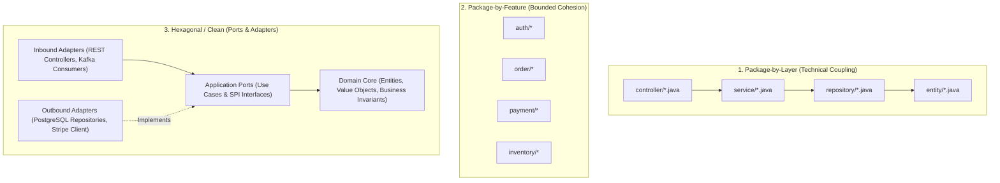
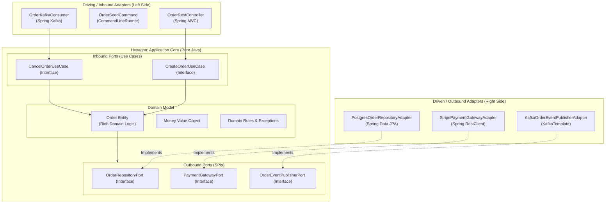
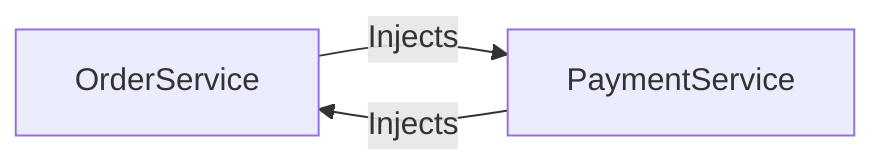
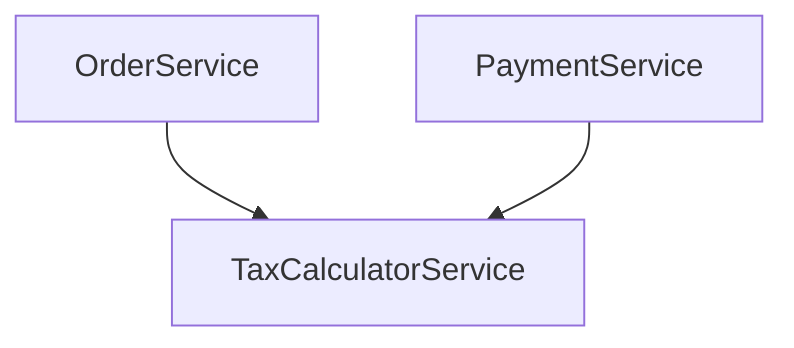

# Enterprise Project Architecture: From Layers to Hexagonal & Modulith

When starting a new Spring Boot application, most developers arrange code into technical packages: `controller`, `service`, `repository`, and `entity`.

While simple for trivial CRUD applications with 3 tables, this **Package-by-Layer** pattern breaks down catastrophically in production backends:
1. **Zero Encapsulation**: Because `OrderController` in package `com.app.controller` must call `OrderService` in package `com.app.service`, every single class and method must be declared `public`. Any class in the codebase can call anything else, creating an unmaintainable "Big Ball of Mud".
2. **Circular Dependencies**: Services inevitably inject each other (`OrderService` calls `PaymentService`, which calls `OrderService`), crashing application startup with `BeanCurrentlyInCreationException`.
3. **Database Leaking to the Edge**: JPA `@Entity` classes leak into HTTP controllers, exposing database schema details and triggering lazy-loading exceptions.

This guide provides an exhaustive, production-grade manual for organizing enterprise Spring Boot 3 backends: Package-by-Feature, Hexagonal Architecture (Ports and Adapters), Spring Modulith bounded contexts, and automated architectural tests with ArchUnit.

---

## Architecture Evolution: Layers vs Feature vs Hexagonal



### Comparing Architectural Topologies

| Dimension | Package-by-Layer | Package-by-Feature | Hexagonal (Ports & Adapters) |
| :--- | :--- | :--- | :--- |
| **Encapsulation** | Very Weak (Everything `public`) | **Strong** (Package-private `default`) | **Very Strong** (Domain isolated from frameworks) |
| **Navigation** | Poor (Features scattered across 5 folders) | **High** (All related logic in 1 place) | **High** (Clear separation of intent vs infra) |
| **Framework Independence** | Zero (Domain tied to Spring & Hibernate) | Low (Spring annotations in domain) | **Complete** (Domain is pure Java without Spring) |
| **Best Used For** | Small prototypes (&lt; 5 entities) | Standard production microservices | Complex enterprise domains, financial ledgers |

---

## Package-by-Feature & Java Encapsulation

By packaging by feature, we can leverage Java's **Package-Private (default)** access modifier. Only the classes meant to be called from the outside are marked `public`. All internal service helpers, entities, and repositories remain package-private:

```bash
com.example.store
├── order/
│   ├── OrderController.java         (public - exposed HTTP endpoint)
│   ├── OrderService.java            (public interface or package-private class)
│   ├── OrderServiceImpl.java       (package-private - hidden implementation)
│   ├── OrderRepository.java         (package-private - hidden from other packages!)
│   ├── Order.java                   (package-private - JPA entity hidden from web!)
│   ├── OrderLine.java               (package-private)
│   ├── CreateOrderRequest.java      (public record - API contract)
│   └── OrderResponse.java           (public record - API contract)
├── payment/
│   ├── PaymentController.java       (public)
│   ├── PaymentService.java          (public - order package calls this)
│   ├── PaymentClient.java           (package-private - Stripe HTTP calls)
│   └── PaymentRecord.java           (package-private)
└── common/
    ├── error/
    └── security/
```

<Tip>
**The Encapsulation Advantage**:
In the structure above, `com.example.store.payment` **cannot** inject or query `OrderRepository` directly because `OrderRepository` is package-private. The only way the payment module can interact with orders is through the public `OrderService` contract!
</Tip>

### Package Structure Line-By-Line

- `order/` groups one business capability instead of scattering its controller, service, repository, and entity across global technical folders.
- `OrderController.java (public)` is public because Spring MVC and external packages need to call it through HTTP routing.
- `OrderService.java (public interface or package-private class)` is the application boundary. Other modules should depend on a narrow behavior contract, not internals.
- `OrderServiceImpl.java (package-private)` hides implementation details so other packages cannot bypass rules.
- `OrderRepository.java (package-private)` prevents other features from querying order tables directly.
- `Order.java (package-private)` keeps JPA persistence shape away from controllers and other modules.
- `CreateOrderRequest.java (public record)` is public because it is part of the HTTP API contract.
- `OrderResponse.java (public record)` is public because controllers serialize it to clients.

Proof task:

```console
Make OrderRepository package-private.
Try injecting it from payment/.
Compilation should fail.
Then expose the exact needed behavior through OrderService.
```

That compile error is not friction. It is architecture enforcement.

---

## Hexagonal Architecture (Ports and Adapters) in Spring Boot

In Hexagonal Architecture (invented by Alistair Cockburn), the **Domain Core** is the center of the universe. It contains pure Java business logic and has **zero dependencies** on Spring, Hibernate, HTTP, or external cloud SDKs.



### 1. Inbound Port (Use Case Contract)
```java
package com.example.order.domain.port.in;

import com.example.order.domain.model.OrderId;
import java.math.BigDecimal;

public interface CreateOrderUseCase {
    OrderId createOrder(CreateOrderCommand command);

    record CreateOrderCommand(
        String customerId,
        String productId,
        int quantity,
        BigDecimal unitPrice
    ) {}
}
```

Line by line:

- `CreateOrderUseCase` names an inbound business capability, not a transport mechanism.
- `OrderId createOrder(...)` returns a domain identifier instead of an HTTP response.
- `CreateOrderCommand` carries the data needed by the use case.
- `String customerId`, `String productId`, and `int quantity` are still simplified here; a stronger domain model would use typed IDs and value objects.
- No Spring annotation appears in this interface. That keeps the application core testable without a web server.

### 2. Outbound Port (Driven SPI Interface)
```java
package com.example.order.domain.port.out;

import com.example.order.domain.model.Order;
import com.example.order.domain.model.OrderId;
import java.util.Optional;

public interface OrderRepositoryPort {
    Order save(Order order);
    Optional<Order> findById(OrderId orderId);
}
```

### 3. Pure Domain Entity (Zero Framework Dependencies)
```java
package com.example.order.domain.model;

import java.math.BigDecimal;
import java.time.Instant;

public class Order {
    private final OrderId id;
    private final String customerId;
    private OrderStatus status;
    private final BigDecimal totalAmount;
    private final Instant createdAt;

    // Business constructor enforcing domain invariants
    public Order(OrderId id, String customerId, BigDecimal totalAmount) {
        if (totalAmount.compareTo(BigDecimal.ZERO) <= 0) {
            throw new IllegalArgumentException("Order total amount must be strictly positive");
        }
        this.id = id;
        this.customerId = customerId;
        this.totalAmount = totalAmount;
        this.status = OrderStatus.CREATED;
        this.createdAt = Instant.now();
    }

    public void cancel() {
        if (this.status == OrderStatus.SHIPPED || this.status == OrderStatus.DELIVERED) {
            throw new IllegalStateException("Cannot cancel an order that has already been shipped");
        }
        this.status = OrderStatus.CANCELLED;
    }

    // Getters...
}
```

### 4. Outbound Adapter (Spring Data JPA Implementation)
```java
package com.example.order.adapter.out.persistence;

import com.example.order.domain.model.Order;
import com.example.order.domain.model.OrderId;
import com.example.order.domain.port.out.OrderRepositoryPort;
import org.springframework.stereotype.Component;

import java.util.Optional;

@Component
public class PostgresOrderRepositoryAdapter implements OrderRepositoryPort {

    private final SpringDataOrderJpaRepository jpaRepository;
    private final OrderPersistenceMapper mapper;

    public PostgresOrderRepositoryAdapter(SpringDataOrderJpaRepository jpaRepo, OrderPersistenceMapper mapper) {
        this.jpaRepository = jpaRepo;
        this.mapper = mapper;
    }

    @Override
    public Order save(Order domainOrder) {
        OrderJpaEntity jpaEntity = mapper.toJpaEntity(domainOrder);
        OrderJpaEntity saved = jpaRepository.save(jpaEntity);
        return mapper.toDomain(saved);
    }

    @Override
    public Optional<Order> findById(OrderId orderId) {
        return jpaRepository.findById(orderId.value()).map(mapper::toDomain);
    }
}
```

---

## Spring Modulith: The Modern Modular Monolith

Before breaking an application into microservices, modern backend architecture leverages **Spring Modulith**. It provides first-class verification to ensure logical domain modules in a monolith cannot violate package boundaries.

```xml
<!-- pom.xml -->
<dependency>
    <groupId>org.springframework.modulith</groupId>
    <artifactId>spring-modulith-starter-core</artifactId>
    <version>1.1.2</version>
</dependency>
<dependency>
    <groupId>org.springframework.modulith</groupId>
    <artifactId>spring-modulith-starter-test</artifactId>
    <version>1.1.2</version>
    <scope>test</scope>
</dependency>
```

### Automated Architectural Verification Test
Write a unit test that verifies structural boundaries across all modules during `mvn test`:

```java
package com.example.demo;

import org.junit.jupiter.api.Test;
import org.springframework.modulith.core.ApplicationModules;
import org.springframework.modulith.docs.Documenter;

class ArchitectureTests {

    ApplicationModules modules = ApplicationModules.of(BackendApplication.class);

    @Test
    void verifyModularity() {
        // Fails the build if any module accesses internal classes of another module!
        modules.verify();
    }

    @Test
    void generateDocumentation() {
        // Automatically creates PlantUML and C4 architecture diagrams in target/modulith-docs!
        new Documenter(modules).writeDocumentation();
    }
}
```

---

## Eliminating Circular Dependencies

### The Disaster: `BeanCurrentlyInCreationException`
A circular dependency occurs when Bean A requires Bean B to initialize, while Bean B requires Bean A:



```console
Caused by: org.springframework.beans.factory.BeanCurrentlyInCreationException: 
Error creating bean with name 'orderService': Requested bean is currently in creation: 
Is there an unresolvable circular reference?
```

<Warning>
**The Toxic Band-Aid: `@Lazy`**:
Annotating `@Lazy` on constructor parameters suppresses Spring's startup check by injecting an empty CGLIB proxy. It hides architectural rot, creates subtle race conditions, and postpones initialization failures to runtime.
</Warning>

### The 2 Clean Solutions to Circular Dependencies

#### 1. Extract Shared Responsibilities to a Third Collaborator
If `OrderService` needs `PaymentService` to calculate tax, and `PaymentService` needs `OrderService` to get order totals, extract tax calculation to an independent, stateless `TaxCalculatorService`:



#### 2. Decouple via Spring Application Events
Instead of `PaymentService` calling `OrderService.markPaid()`, publish a domain event:

```java
// In PaymentService:
@Transactional
public void processPayment(PaymentRequest req) {
    // 1. Charge card...
    // 2. Decoupled asynchronous event publication:
    eventPublisher.publishEvent(new PaymentCompletedEvent(orderId, paymentId, Instant.now()));
}

// In OrderService:
@TransactionalEventListener(phase = TransactionPhase.AFTER_COMMIT)
public void onPaymentCompleted(PaymentCompletedEvent event) {
    Order order = orderRepository.findById(event.orderId()).orElseThrow();
    order.markPaid();
}
```

---

## Automated Architecture Enforcement with ArchUnit

**ArchUnit** is a Java test library that inspects compiled bytecode to enforce architectural governance rules in CI/CD:

```xml
<dependency>
    <groupId>com.tngtech.archunit</groupId>
    <artifactId>archunit-junit5</artifactId>
    <version>1.2.1</version>
    <scope>test</scope>
</dependency>
```

### Production ArchUnit Test Suite

```java
package com.example.demo;

import com.tngtech.archunit.core.importer.ImportOption;
import com.tngtech.archunit.junit.AnalyzeClasses;
import com.tngtech.archunit.junit.ArchTest;
import com.tngtech.archunit.lang.ArchRule;
import org.springframework.stereotype.Controller;
import org.springframework.stereotype.Service;
import org.springframework.web.bind.annotation.RestController;

import static com.tngtech.archunit.lang.syntax.ArchRuleDefinition.classes;
import static com.tngtech.archunit.lang.syntax.ArchRuleDefinition.noClasses;

@AnalyzeClasses(packages = "com.example.store", importOptions = ImportOption.DoNotIncludeTests.class)
public class ArchitectureRulesTest {

    @ArchTest
    static final ArchRule controllers_must_not_access_repositories =
        noClasses().that().areAnnotatedWith(RestController.class)
            .or().areAnnotatedWith(Controller.class)
            .should().dependOnClassesThat().resideInAPackage("..repository..")
            .because("Controllers must delegate all data access through the Service layer");

    @ArchTest
    static final ArchRule services_must_not_access_controllers =
        noClasses().that().areAnnotatedWith(Service.class)
            .should().dependOnClassesThat().areAnnotatedWith(RestController.class)
            .because("Lower business layers must never have dependencies on HTTP transport layers");

    @ArchTest
    static final ArchRule layered_architecture_must_be_respected =
        classes().that().resideInAPackage("..service..")
            .should().onlyBeAccessed().byAnyPackage("..controller..", "..service..", "..config..");
}
```

---

## Active Recall & Interview Mastery

<AccordionGroup>
  <Accordion title="1. Why does Package-by-Layer violate Java encapsulation in medium-to-large backends?">
    In Package-by-Layer, classes are grouped by technical concerns (`com.app.controller`, `com.app.service`, `com.app.repository`). Because Java packages form the encapsulation boundary for package-private (default) access, classes in `controller` cannot invoke classes in `service` unless those service classes, methods, and repositories are explicitly declared `public`. Consequently, every bean in the entire application becomes globally accessible, allowing any developer to bypass domain boundaries and inject arbitrary repositories anywhere.
  </Accordion>

  <Accordion title="2. What is the fundamental difference between Inbound and Outbound Ports in Hexagonal Architecture?">
    An **Inbound Port** (Driving Port) defines the use case interface that the core domain exposes to external drivers (e.g., `CreateOrderUseCase` invoked by a REST controller or Kafka consumer). An **Outbound Port** (Driven Port / SPI) defines an interface that the domain *requires* from infrastructure to do its job (e.g., `OrderRepositoryPort` or `PaymentGatewayPort`). The domain owns both port interfaces; outbound adapters in infrastructure implement the outbound ports via the Dependency Inversion Principle.
  </Accordion>

  <Accordion title="3. Why is using @Lazy to fix circular dependencies considered an anti-pattern?">
    `@Lazy` does not resolve the underlying architectural flaw: it simply instructs Spring to inject a synthetic dynamic proxy instead of initializing the bean immediately. The circular reference and tight coupling between the two components remain intact. This masks architectural rot, introduces subtle race conditions in multithreaded environments, and can cause unexpected runtime exceptions during late lazy proxy initialization.
  </Accordion>

  <Accordion title="4. How does Spring Modulith verify architectural boundaries at build time?">
    Spring Modulith inspects the package structure and bytecode of an application, modeling first-level subpackages as logical domain modules. By running `ApplicationModules.of(Application.class).verify()` inside a standard JUnit test, Modulith verifies that no internal (package-private or non-API) types from Module A are imported by Module B, failing the build if illegal cross-module dependencies or circular dependencies are introduced.
  </Accordion>

  <Accordion title="5. How does ArchUnit help maintain team discipline in enterprise codebases?">
    ArchUnit allows engineering teams to write unit tests that enforce architectural rules as code. Rules such as *"Controllers must never talk to Repositories"* or *"Domain entities must not import Spring packages"* execute in seconds during `mvn test`. If an engineer violates these rules, the build immediately fails in CI with a detailed line-by-line violation report, preventing architectural decay before pull requests can be merged.
  </Accordion>
</AccordionGroup>
